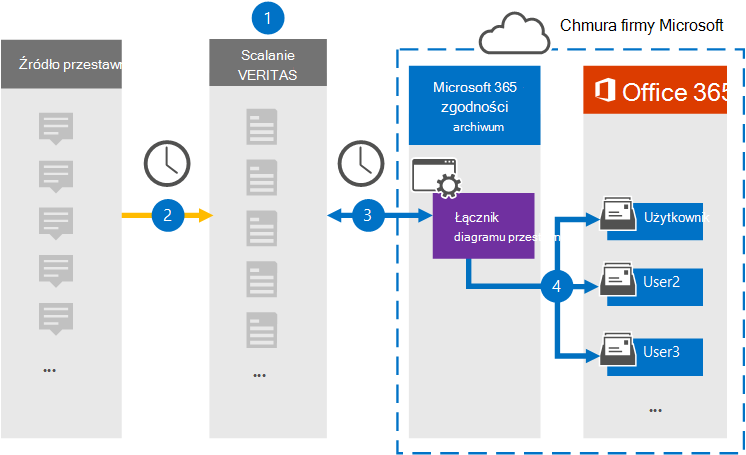

# Konfigurowanie łącznika do archiwizowania danych przestawnych

Za pomocą łącznika veritas w Centrum zgodności platformy Microsoft 365 można importować i archiwizować dane z platformy przestawnej do skrzynek pocztowych użytkowników w Microsoft 365 organizacji. Veritas udostępnia łącznik przestawny, który jest skonfigurowany do regularnego przechwytywania elementów ze źródła danych innych firm[, a następnie](https://globanet.com/pivot/) importuje je do Microsoft 365. Pivot to platforma do obsługi wiadomości błyskawicznych, która umożliwia współpracę z uczestnikami rynku finansowego. Łącznik konwertuje elementy, takie jak wiadomości czatu, z kont przestawnych użytkowników na format wiadomości e-mail, a następnie importuje te elementy do skrzynek pocztowych użytkowników w Microsoft 365.

Po przechowywaniu danych przestawnych w skrzynkach pocztowych użytkowników można stosować funkcje zgodności Microsoft 365, takie jak zawieszenie w związku z postępowaniem sądowym, zbierania elektronicznych materiałów dowodowych, zasady przechowywania i etykiety przechowywania oraz zgodność z przepisami komunikacji. Importowanie i archiwizowanie danych w programie Microsoft 365 za pomocą łącznika przestawnego może ułatwić organizacji zachowania zgodności z zasadami rządowymi i przepisami prawa.

## Omówienie archiwizowania danych przestawnych

Poniższe omówienie przedstawia proces używania łącznika do archiwizowania danych przestawnych w programie Microsoft 365.

1. Organizacja współpracuje z programem Pivot, aby skonfigurować witrynę źródłową tabeli przestawnej.

2. Elementy przestawne są kopiowane do witryny Veritas Merge1 co 24 godziny. Łącznik konwertuje również elementy przestawne na format wiadomości e-mail.

3. Łącznik przestawny, który tworzysz w Centrum zgodności platformy Microsoft 365, łączy się z witryną scalania Veritas1 każdego dnia i przesyła elementy przestawne do bezpiecznej lokalizacji usługi Azure Storage w chmurze firmy Microsoft.

4. Łącznik zaim importuje elementy przestawne do skrzynek pocztowych określonych użytkowników przy użyciu wartości właściwości *Email* (Poczta e-mail) automatycznego mapowania użytkowników zgodnie z opisem w [kroku 3](#step-3-map-users-and-complete-the-connector-setup). W skrzynkach pocztowych użytkowników jest tworzony podfolder w folderze Skrzynka odbiorcza o nazwie **Pivot** , a elementy są importowane do tego folderu. Łącznik robi to przy użyciu wartości właściwości *Email* . Każdy element przestawny zawiera tę właściwość, która jest wypełniana adresem e-mail każdego uczestnika elementu.

## Przed rozpoczęciem

- Utwórz konto korespondencji seryjnej Veritas merge1 dla łączników firmy Microsoft. Aby utworzyć to konto, skontaktuj się z [działem obsługi klienta firmy Veritas](https://www.veritas.com/content/support/). Do tego konta zalogujesz się podczas tworzenia łącznika w kroku 1.

- Użytkownik, który utworzy łącznik przestawny w kroku 1 (i ukończy go w kroku 3), musi być przypisany do roli importowania i eksportowania skrzynek pocztowych w programie Exchange Online. Ta rola jest wymagana do dodawania łączników na stronie Łączniki danych w Centrum zgodności platformy Microsoft 365. Domyślnie ta rola nie jest przypisana do grupy ról w Exchange Online. Rolę importowania i eksportowania skrzynek pocztowych możesz dodać do grupy ról Zarządzanie organizacją w programie Exchange Online. Możesz też utworzyć grupę ról, przypisać rolę importowania i eksportowania skrzynek pocztowych, a następnie dodać odpowiednich użytkowników jako członków. Aby uzyskać więcej informacji, zobacz sekcje [Tworzenie grup ról](/Exchange/permissions-exo/role-groups#create-role-groups) [lub](/Exchange/permissions-exo/role-groups#modify-role-groups) Modyfikowanie grup ról w artykule "Zarządzanie grupami ról w aplikacji Exchange Online".

- Ten łącznik danych usługi Veritas jest w publicznej wersji zapoznawczej GCC w środowisku danych Microsoft 365 chmurze dla instytucji rządowych Stanów Zjednoczonych. Aplikacje i usługi innych firm mogą obejmować przechowywanie, przekazywanie i przetwarzanie danych klienta Organizacji w systemach innych firm, które znajdują się poza infrastrukturą firmy Microsoft 365 i dlatego nie są objęte zobowiązaniami firmy Microsoft 365 w zakresie zgodności z przepisami i ochrony danych. Firma Microsoft nie zapewnia, że używanie tego produktu do łączenia się z aplikacjami innych firm oznacza, że te aplikacje innych firm są zgodne z fedRAMP.

## Krok 1. Konfigurowanie łącznika przestawnego

Pierwszym krokiem jest uzyskanie dostępu do strony **Łączniki** danych w Centrum zgodności firmy Microsoft i utworzenie łącznika dla danych przestawnych.

1. Przejdź do, [https://compliance.microsoft.com](https://compliance.microsoft.com/) a następnie kliknij pozycję **Łączniki danychPivot** > .

2. Na stronie **Opis produktu** przestawnego kliknij pozycję **Dodaj łącznik**.

3. Na stronie **Warunki użytkowania usługi** kliknij pozycję **Zaakceptuj**.

4. Wprowadź unikatową nazwę identyfikującą łącznik, a następnie kliknij przycisk **Dalej**.

5. Zaloguj się do konta korespondencji seryjnej1, aby skonfigurować łącznik.

## Krok 2. Konfigurowanie łącznika przestawnego w witrynie Veritas Merge1

Drugim krokiem jest skonfigurowanie łącznika przestawnego w witrynie Scal1. Aby uzyskać informacje na temat konfigurowania łącznika przestawnego w witrynie Veritas Merge1, zobacz Przewodnik użytkownika do [scalania1 łączników innych firm](https://docs.ms.merge1.globanetportal.com/Merge1%20Third-Party%20Connectors%20Pivot%20User%20Guide%20.pdf).

Po kliknięciu **przycisku Zapisz & zakończ** zostanie **wyświetlona** strona Mapowanie użytkowników w kreatorze łączników w Centrum zgodności platformy Microsoft 365 stronie.

## Krok 3. Mapowanie użytkowników i ukończenie konfiguracji łącznika

Aby zamapować użytkowników i dokończyć konfigurację łącznika w centrum zgodności platformy Microsoft 356, wykonaj następujące czynności:

1. Na stronie **Mapowanie użytkowników przestawnych Microsoft 365 użytkowników** włącz automatyczne mapowanie użytkowników. Elementy przestawne zawierają właściwość o nazwie Poczta *e-mail*, która zawiera adresy e-mail użytkowników w organizacji. Jeśli łącznik może skojarzyć ten adres z Microsoft 365, elementy są importowane do skrzynki pocztowej tego użytkownika.

2. Kliknij **przycisk** Dalej, przejrzyj ustawienia i przejdź do strony Łączniki danych, aby wyświetlić postęp procesu importowania nowego łącznika.

## Krok 4. Monitorowanie łącznika przestawnego

Po utworzeniu łącznika przestawnego można sprawdzić stan łącznika w Centrum zgodności platformy Microsoft 365.

1. Przejdź do łączników [https://compliance.microsoft.com](https://compliance.microsoft.com) **danych w lewym okienku narracji i** kliknij je.

2. Kliknij **kartę Łączniki** , a następnie wybierz łącznik **przestawny** , aby wyświetlić stronę wysuwu. Ta strona zawiera właściwości i informacje o łączniku.

3. W **obszarze Stan łącznika ze** źródłem **kliknij link Pobierz** dziennik, aby otworzyć (lub zapisać) dziennik stanu łącznika. Ten dziennik zawiera dane, które zostały zaimportowane do chmury firmy Microsoft.

## Znane problemy

- Obecnie importowanie załączników ani elementów większych niż 10 MB nie jest obsługuje. Obsługa większych elementów będzie dostępna w późniejszym terminie.