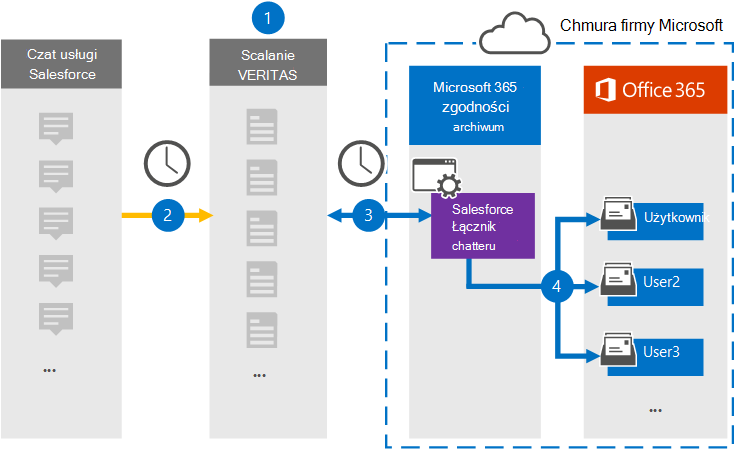

# Konfigurowanie łącznika do archiwizowania danych gadać usługi Salesforce

Użyj łącznika Veritas w portal zgodności Microsoft Purview, aby zaimportować i zarchiwizować dane z platformy Salesforce Chatter do skrzynek pocztowych użytkowników w organizacji platformy Microsoft 365. Usługa Veritas udostępnia łącznik [Salesforce Chatter](http://globanet.com/chatter/) , który przechwytuje elementy ze źródła danych innych firm i importuje te elementy do platformy Microsoft 365. Łącznik konwertuje zawartość, taką jak czaty, załączniki i wpisy z usługi Salesforce Chatter, na format wiadomości e-mail, a następnie importuje te elementy do skrzynki pocztowej użytkownika w usłudze Microsoft 365.

Po zapisaniu danych usługi Salesforce Chatter w skrzynkach pocztowych użytkowników można zastosować funkcje usługi Microsoft Purview, takie jak blokada postępowania sądowego, zbieranie elektronicznych materiałów dowodowych, zasady przechowywania i etykiety przechowywania. Importowanie i archiwizowanie danych na platformie Microsoft 365 przy użyciu łącznika Salesforce Chatter może pomóc twojej organizacji zachować zgodność z zasadami rządowymi i regulacyjnymi.

## Omówienie archiwizacji danych paplaniny usługi Salesforce

W poniższym omówieniu wyjaśniono proces korzystania z łącznika do archiwizowania danych usługi Salesforce Chatter na platformie Microsoft 365.

1. Twoja organizacja współpracuje z usługą Salesforce Chatter, aby skonfigurować i skonfigurować witrynę Salesforce Chatter.

2. Raz na 24 godziny elementy gadać usługi Salesforce są kopiowane do witryny Veritas Merge1. Łącznik zawiera również elementy Gadać w usłudze Salesforce do formatu wiadomości e-mail.

3. Łącznik Salesforce Chatter tworzony w portalu zgodności codziennie łączy się z witryną Veritas Merge1 i przesyła zawartość Chatter do bezpiecznej lokalizacji usługi Azure Storage w chmurze firmy Microsoft.

4. Łącznik importuje przekonwertowane elementy do skrzynek pocztowych określonych użytkowników przy użyciu wartości właściwości *Poczta e-mail* automatycznego mapowania użytkownika zgodnie z opisem w [kroku 3](#step-3-map-users-and-complete-the-connector-setup). Podfolder w folderze Skrzynka odbiorcza o nazwie **Salesforce Chatter** jest tworzony w skrzynkach pocztowych użytkownika, a elementy są importowane do tego folderu. Łącznik określa skrzynkę pocztową do zaimportowania elementów przy użyciu wartości właściwości *Poczta e-mail* . Każdy element chatter zawiera tę właściwość, która jest wypełniana adresem e-mail każdego uczestnika elementu.

## Przed rozpoczęciem

- Utwórz konto Merge1 dla łączników firmy Microsoft. Aby utworzyć konto, skontaktuj się z [pomocą techniczną veritas](https://www.veritas.com/content/support/). Musisz zalogować się do tego konta podczas tworzenia łącznika w kroku 1.

- Utwórz aplikację usługi Salesforce i uzyskaj token w witrynie [https://salesforce.com](https://salesforce.com). Musisz zalogować się do konta usługi Salesforce jako administrator i uzyskać osobisty token użytkownika w celu zaimportowania danych. Ponadto wyzwalacze muszą być publikowane w witrynie Chatter w celu przechwytywania aktualizacji, usuwania i edycji. Te wyzwalacze spowodują utworzenie wpisu w kanale, a funkcja Merge1 będzie przechwytywać informacje z kanału. Aby uzyskać instrukcje krok po kroku dotyczące sposobu tworzenia aplikacji i uzyskiwania tokenu, zobacz [Merge1 Third-Party Connectors User Guide (Scal1 łączniki innych firm](https://docs.ms.merge1.globanetportal.com/Merge1%20Third-Party%20Connectors%20SalesForce%20Chatter%20User%20Guide%20.pdf)).

- Użytkownik, który tworzy łącznik Gadać usługi Salesforce w kroku 1 (i kończy go w kroku 3), musi mieć przypisaną rolę Administracja łącznika danych. Ta rola jest wymagana do dodawania łączników na stronie **Łączniki danych** w portalu zgodności. Ta rola jest domyślnie dodawana do wielu grup ról. Aby uzyskać listę tych grup ról, zobacz sekcję "Role w centrach zabezpieczeń i zgodności" w obszarze [Uprawnienia w Centrum zgodności & zabezpieczeń](../security/office-365-security/permissions-in-the-security-and-compliance-center.md#roles-in-the-security--compliance-center). Alternatywnie administrator w organizacji może utworzyć niestandardową grupę ról, przypisać rolę Administracja łącznika danych, a następnie dodać odpowiednich użytkowników jako członków. Aby uzyskać instrukcje, zobacz sekcję "Tworzenie niestandardowej grupy ról" w obszarze [Uprawnienia w portal zgodności Microsoft Purview](microsoft-365-compliance-center-permissions.md#create-a-custom-role-group).

- Ten łącznik danych Veritas jest w publicznej wersji zapoznawczej w środowiskach GCC w chmurze microsoft 365 US Government. Aplikacje i usługi innych firm mogą obejmować przechowywanie, przesyłanie i przetwarzanie danych klientów organizacji w systemach innych firm, które znajdują się poza infrastrukturą platformy Microsoft 365 i w związku z tym nie są objęte zobowiązaniami microsoft purview i ochrony danych. Firma Microsoft nie przedstawia żadnej reprezentacji, że użycie tego produktu do łączenia się z aplikacjami innych firm oznacza, że te aplikacje innych firm są zgodne z fedrampem.

## Krok 1. Konfigurowanie łącznika Salesforce Chatter

Pierwszym krokiem jest dostęp do strony **Łączniki danych** w portalu zgodności i utworzenie łącznika dla danych chatter.

1. Przejdź do pozycji [https://compliance.microsoft.com](https://compliance.microsoft.com/) , a następnie kliknij pozycję **Łączniki** >  danych **Salesforce Chatter**.

2. Na stronie Opis produktu **Salesforce Chatter** kliknij pozycję **Dodaj łącznik**.

3. Na stronie **Warunki korzystania z usługi** kliknij pozycję **Akceptuj**.

4. Wprowadź unikatową nazwę identyfikującą łącznik, a następnie kliknij przycisk **Dalej**.

5. Zaloguj się do konta merge1, aby skonfigurować łącznik.

## Krok 2. Konfigurowanie gadać usługi Salesforce w witrynie Veritas Merge1

Drugim krokiem jest skonfigurowanie łącznika Salesforce Chatter w witrynie Veritas Merge1. Aby uzyskać informacje o sposobie konfigurowania łącznika Salesforce Chatter, zobacz [Merge1 Third-Party Connectors User Guide (Przewodnik użytkownika łączników](https://docs.ms.merge1.globanetportal.com/Merge1%20Third-Party%20Connectors%20SalesForce%20Chatter%20User%20Guide%20.pdf) innych firm).

Po kliknięciu przycisku **Zapisz & Zakończ** zostanie wyświetlona strona **Mapowanie użytkownika** w kreatorze łącznika w portalu zgodności.

## Krok 3. Mapowanie użytkowników i ukończenie konfiguracji łącznika

Aby zamapować użytkowników i ukończyć konfigurację łącznika w portalu zgodności, wykonaj następujące kroki:

1. Na stronie **Mapowanie użytkowników usługi Salesforce Chatter na użytkowników platformy Microsoft 365** włącz automatyczne mapowanie użytkowników. Elementy gadać usługi Salesforce obejmują właściwość o nazwie *Email* zawierającą adresy e-mail dla użytkowników w organizacji. Jeśli łącznik może skojarzyć ten adres z użytkownikiem platformy Microsoft 365, elementy zostaną zaimportowane do skrzynki pocztowej tego użytkownika.

2. Kliknij przycisk **Dalej**, przejrzyj ustawienia, a następnie przejdź do strony **Łączniki danych** , aby zobaczyć postęp procesu importowania nowego łącznika.

## Krok 4. Monitorowanie łącznika Gadać usługi Salesforce

Po utworzeniu łącznika Salesforce Chatter możesz wyświetlić stan łącznika w portalu zgodności.

1. Przejdź do strony [https://compliance.microsoft.com](https://compliance.microsoft.com/) i kliknij pozycję **Łączniki danych** w lewym pasku nawigacyjnym.

2. Kliknij kartę **Łączniki** , a następnie kliknij łącznik **Gadać usługi Salesforce** , aby wyświetlić stronę wysuwaną zawierającą właściwości i informacje o łączniku.

3. W obszarze **Stan łącznika ze źródłem** kliknij link **Pobierz dziennik** , aby otworzyć (lub zapisać) dziennik stanu łącznika. Ten dziennik zawiera dane zaimportowane do chmury firmy Microsoft.

## Znane problemy

- Obecnie nie obsługujemy importowania załączników ani elementów o rozmiarze większym niż 10 MB. Obsługa większych elementów będzie dostępna w późniejszym terminie.
