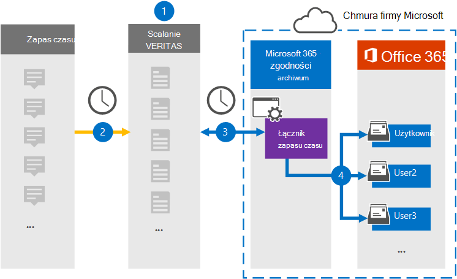

# Konfigurowanie łącznika do archiwizowania danych zbierania elektronicznych materiałów dowodowych w ucecie

Za pomocą łącznika veritas w aplikacji Centrum zgodności platformy Microsoft 365 importować i archiwizować dane innych firm z mediów społecznościowych, platform do obsługi wiadomości błyskawicznych i współpracy nad dokumentami do skrzynek pocztowych w Microsoft 365 organizacji. Firma Veritas udostępnia łącznik [usługi Slack](https://globanet.com/slack/) skonfigurowany do regularnego przechwytywania elementów ze źródła danych innej firmy, a następnie importowania ich do Microsoft 365. Usługa Slack ściąga wiadomości i pliki z interfejsu API usługi Slack i konwertuje je na format wiadomości e-mail, a następnie importuje element do skrzynek pocztowych użytkowników.

Po zapisaniu danych usługi Slack zbierania elektronicznych materiałów dowodowych w skrzynkach pocztowych użytkowników możesz stosować funkcje zgodności usługi Microsoft 365, takie jak zawieszenie w związku z postępowaniem sądowym, zbierania elektronicznych materiałów dowodowych, zasady przechowywania i etykiety przechowywania oraz zgodność komunikacji. Importowanie i archiwizowanie danych w programie Microsoft 365 za pomocą łącznika oprogramowania Slack może ułatwić organizacji zachowania zgodności z zasadami rządowymi i przepisami.

## Omówienie archiwizowania danych zbierania elektronicznych materiałów dowodowych usługi Slack

Poniższe omówienie przedstawia proces używania łącznika do archiwizowania informacji oprogramowania Slack w Microsoft 365.

1. Twoja organizacja współpracuje z usługą Slack, aby skonfigurować i skonfigurować witrynę usługi Slack.

2. Co 24 godziny wiadomości czatu z zbierania elektronicznych materiałów dowodowych Slack są kopiowane do witryny Veritas Merge1. Łącznik konwertuje także treść wiadomości czatu na format wiadomości e-mail.

3. Łącznik usługi Slack eDiscovery, który tworzysz w usłudze Centrum zgodności platformy Microsoft 365, łączy się z witryną Veritas Merge1 każdego dnia i przesyła wiadomości czatu do bezpiecznej lokalizacji usługi Azure Storage w chmurze firmy Microsoft.

4. Łącznik zaim importuje elementy przekonwertowanych wiadomości czatu do skrzynek pocztowych określonych użytkowników przy użyciu wartości właściwości  Email i automatycznego mapowania użytkowników, jak to opisano w kroku 3. W skrzynkach pocztowych użytkowników jest tworzony nowy podfolder w folderze Skrzynka odbiorcza o nazwie **Slack eDiscovery** , a elementy wiadomości czatu są importowane do tego folderu. Łącznik określa skrzynkę pocztową, do której mają być importowane elementy, przy użyciu wartości właściwości *Email* . Każda wiadomość czatu zawiera tę właściwość, która jest wypełniana adresem e-mail każdego uczestnika wiadomości czatu.

## Przed rozpoczęciem

- Utwórz konto korespondencji seryjnej Veritas merge1 dla łączników firmy Microsoft. Aby utworzyć konto, skontaktuj się z działem [obsługi klienta firmy Veritas](https://globanet.com/ms-connectors-contact). Do tego konta zalogujesz się podczas tworzenia łącznika w kroku 1.

- Uzyskaj nazwę użytkownika i hasło do konta firmowego Slack swojej organizacji. Podczas konfigurowania usługi Slack musisz zalogować się do tego konta w kroku 2.

- Użytkownik, który utworzy łącznik usługi Slack eDiscovery w kroku 1 (i ukończy go w kroku 3), musi być przypisany do roli importowania i eksportowania skrzynek pocztowych w programie Exchange Online. Ta rola jest wymagana do dodawania łączników na **stronie Łączniki** danych w Centrum zgodności platformy Microsoft 365. Domyślnie ta rola nie jest przypisana do grupy ról w Exchange Online. Rolę importowania i eksportowania skrzynek pocztowych możesz dodać do grupy ról Zarządzanie organizacją w programie Exchange Online. Możesz też utworzyć grupę ról, przypisać rolę importowania i eksportowania skrzynek pocztowych, a następnie dodać odpowiednich użytkowników jako członków. Aby uzyskać więcej informacji, zobacz sekcje [Tworzenie grup ról](/Exchange/permissions-exo/role-groups#create-role-groups) [lub](/Exchange/permissions-exo/role-groups#modify-role-groups) Modyfikowanie grup ról w artykule "Zarządzanie grupami ról w aplikacji Exchange Online".

- Ten łącznik danych usługi Veritas jest w publicznej wersji zapoznawczej GCC w środowisku danych Microsoft 365 chmurze dla instytucji rządowych Stanów Zjednoczonych. Aplikacje i usługi innych firm mogą obejmować przechowywanie, przekazywanie i przetwarzanie danych klienta Organizacji w systemach innych firm, które znajdują się poza infrastrukturą firmy Microsoft 365 i dlatego nie są objęte zobowiązaniami firmy Microsoft 365 w zakresie zgodności z przepisami i ochrony danych. Firma Microsoft nie zapewnia, że używanie tego produktu do łączenia się z aplikacjami innych firm oznacza, że te aplikacje innych firm są zgodne z fedRAMP.

## Krok 1. Konfigurowanie łącznika zbierania elektronicznych materiałów dowodowych w u zapasie czasu

Pierwszym krokiem jest uzyskanie dostępu do strony  łączników danych w aplikacji Centrum zgodności platformy Microsoft 365 utworzenie łącznika dla danych zapasu czasu.

1. Przejdź do, [https://compliance.microsoft.com](https://compliance.microsoft.com/) a następnie kliknij **pozycję Łączniki** **danychZasyłaj zbierania elektronicznych materiałów dowodowych**. > 

2. Na stronie **Opis produktu usługi Slack eDiscovery** kliknij pozycję **Dodaj łącznik**.

3. Na stronie **Warunki użytkowania usługi** kliknij pozycję **Zaakceptuj**.

4. Wprowadź unikatową nazwę identyfikującą łącznik, a następnie kliknij przycisk **Dalej**.

5. Zaloguj się do konta korespondencji seryjnej1, aby skonfigurować łącznik.

## Krok 2. Konfigurowanie usługi Slack eDiscovery

Drugim krokiem jest skonfigurowanie łącznika usługi Slack eDiscovery w witrynie Merge1. Aby uzyskać więcej informacji na temat konfigurowania łącznika usługi Slack eDiscovery w witrynie Veritas Merge1, zobacz Przewodnik użytkownika dotyczący [scalania1 łączników innych firm](https://docs.ms.merge1.globanetportal.com/Merge1%20Third-Party%20Connectors%20Slack%20eDiscovery%20User%20Guide.pdf).

Po kliknięciu **przycisku Zapisz & zakończ** zostanie **wyświetlona** strona Mapowanie użytkowników w kreatorze łączników w Centrum zgodności platformy Microsoft 365 stronie.

## Krok 3. Mapowanie użytkowników i ukończenie konfiguracji łącznika

1. Na stronie **Mapowanie użytkowników zewnętrznych Microsoft 365 użytkowników** włącz automatyczne mapowanie użytkowników.

   Elementy usługi Slack eDiscovery obejmują właściwość o nazwie *Poczta e-mail*, która zawiera adresy e-mail użytkowników w Twojej organizacji. Jeśli łącznik może skojarzyć ten adres z Microsoft 365, elementy są importowane do skrzynki pocztowej tego użytkownika.

2. Kliknij **przycisk** Dalej, przejrzyj ustawienia i przejdź do strony Łączniki danych, aby wyświetlić postęp procesu importowania nowego łącznika.

## Krok 4. Monitorowanie łącznika usługi Slack eDiscovery

Po utworzeniu łącznika zbierania elektronicznych materiałów dowodowych zapasu czasu można wyświetlić stan łącznika w Centrum zgodności platformy Microsoft 365.

1. Przejdź do łączników [https://compliance.microsoft.com](https://compliance.microsoft.com) **danych w lewym okienku narracji i** kliknij je.

2. Kliknij **kartę Łączniki** , a następnie wybierz łącznik **zbierania elektronicznych materiałów dowodowych** zapasu czasu, aby wyświetlić stronę wysuwu. Ta strona zawiera właściwości i informacje o łączniku.

3. W **obszarze Stan łącznika ze** źródłem **kliknij link Pobierz** dziennik, aby otworzyć (lub zapisać) dziennik stanu łącznika. Ten dziennik zawiera informacje o danych, które zostały zaimportowane do chmury firmy Microsoft.

## Znane problemy

- Obecnie importowanie załączników ani elementów większych niż 10 MB nie jest obsługuje. Obsługa większych elementów będzie dostępna w późniejszym terminie.