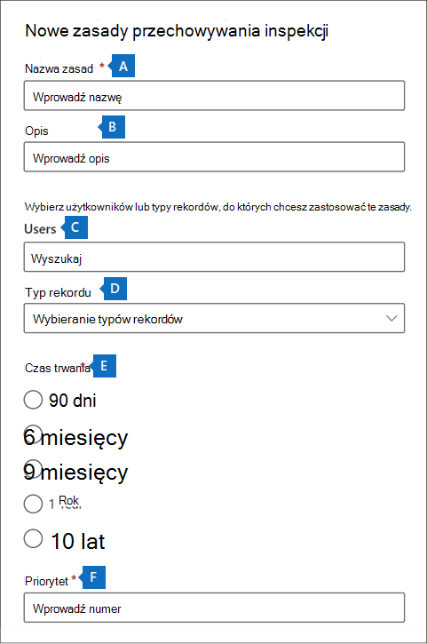

# <a name="manage-audit-log-retention-policies"></a>Zarządzanie zasadami przechowywania dzienników inspekcji

Zasady przechowywania dzienników inspekcji można tworzyć i zarządzać nimi w portal zgodności Microsoft Purview. Zasady przechowywania dzienników inspekcji są częścią nowych funkcji Inspekcja w Microsoft Purview (Premium). Zasady przechowywania dzienników inspekcji umożliwiają określenie czasu przechowywania dzienników inspekcji w organizacji. Dzienniki inspekcji można przechowywać przez maksymalnie 10 lat. Zasady można tworzyć na podstawie następujących kryteriów:

- Wszystkie działania w co najmniej jednej usłudze Microsoft 365
- Określone działania (w usłudze Microsoft 365) wykonywane przez wszystkich użytkowników lub przez określonych użytkowników
- Poziom priorytetu określający, które zasady mają pierwszeństwo w wielu zasadach w organizacji

## <a name="default-audit-log-retention-policy"></a>Domyślne zasady przechowywania dzienników inspekcji

Inspekcja (Premium) w usłudze Microsoft 365 zapewnia domyślne zasady przechowywania dzienników inspekcji dla wszystkich organizacji. Te zasady zachowują wszystkie rekordy inspekcji Exchange Online, SharePoint Online, OneDrive dla Firm i Azure Active Directory przez jeden rok. Te domyślne zasady zachowują rekordy inspekcji zawierające wartość **właściwości Exchange**, **SharePoint**, **OneDrive**, **AzureActiveDirectory** (czyli  usługi, w której wystąpiło działanie). Nie można zmodyfikować zasad domyślnych. Zobacz sekcję [Więcej informacji](#more-information) w tym artykule, aby uzyskać listę typów rekordów dla każdego obciążenia, które są uwzględnione w zasadach domyślnych.

> [!NOTE]
> Domyślne zasady przechowywania dzienników inspekcji dotyczą tylko rekordów inspekcji dla działań wykonywanych przez użytkowników, którzy mają przypisaną licencję Office 365 lub Microsoft 365 E5 lub mają licencję dodatku Zgodność platformy Microsoft 365 E5 lub E5 eDiscovery i Audit. Jeśli masz użytkowników innych niż E5 lub użytkowników-gości w organizacji, ich odpowiednie rekordy inspekcji są przechowywane przez 90 dni.

## <a name="before-you-create-an-audit-log-retention-policy"></a>Przed utworzeniem zasad przechowywania dziennika inspekcji

- Musisz mieć przypisaną rolę Konfiguracja organizacji w portalu zgodności, aby utworzyć lub zmodyfikować zasady przechowywania inspekcji.

- W organizacji możesz mieć maksymalnie 50 zasad przechowywania dzienników inspekcji.

- Aby zachować dziennik inspekcji dłużej niż 90 dni (i do 1 roku), użytkownik, który generuje dziennik inspekcji (wykonując inspekcję działania), musi mieć przypisaną licencję Office 365 E5 lub Microsoft 365 E5 albo mieć licencję dodatku Zgodność platformy Microsoft 365 E5 lub E5 zbierania elektronicznych materiałów dowodowych i inspekcji. Aby zachować dzienniki inspekcji przez 10 lat, użytkownik, który generuje dziennik inspekcji, musi również otrzymać 10-letnią licencję dodatku przechowywania dziennika inspekcji oprócz licencji E5.

- Wszystkie niestandardowe zasady przechowywania dzienników inspekcji (utworzone przez organizację) mają pierwszeństwo przed domyślnymi zasadami przechowywania. Jeśli na przykład utworzysz zasady przechowywania dzienników inspekcji dla działania skrzynki pocztowej programu Exchange z okresem przechowywania krótszym niż jeden rok, rekordy inspekcji dla działań skrzynki pocztowej programu Exchange zostaną zachowane przez krótszy czas określony przez zasady niestandardowe.

## <a name="create-an-audit-log-retention-policy"></a>Tworzenie zasad przechowywania dziennika inspekcji

1. Przejdź do strony <https://compliance.microsoft.com> i zaloguj się przy użyciu konta użytkownika, do których przypisano rolę Konfiguracja organizacji na stronie Uprawnienia w portalu zgodności.

2. W lewym okienku portalu zgodności kliknij pozycję **Inspekcja**.

3. Kliknij kartę **Zasady przechowywania inspekcji** .

4. Kliknij **pozycję Utwórz zasady przechowywania inspekcji**, a następnie wypełnij następujące pola na stronie wysuwanej:

   

   1. **Nazwa zasad:** Nazwa zasad przechowywania dziennika inspekcji. Ta nazwa musi być unikatowa w organizacji i nie można jej zmienić po utworzeniu zasad.

   2. **Opis:** Opcjonalne, ale pomocne w dostarczaniu informacji o zasadach, takich jak typ rekordu lub obciążenie, użytkownicy określoni w zasadach i czas trwania.

   3. **Użytkowników:** Wybierz co najmniej jednego użytkownika, do których mają zostać zastosowane zasady. Jeśli to pole pozostanie puste, zasady będą stosowane do wszystkich użytkowników. Jeśli **typ rekordu** pozostanie pusty, musisz wybrać użytkownika.

   4. **Typ rekordu:** Typ rekordu inspekcji, do jakiego mają zastosowanie zasady. Jeśli pozostawisz tę właściwość pustą, musisz wybrać użytkownika w polu **Użytkownicy** . Możesz wybrać jeden typ rekordu lub wiele typów rekordów:
      - Jeśli wybierzesz pojedynczy typ rekordu, pole **Działania** zostanie wyświetlone dynamicznie. Możesz użyć listy rozwijanej, aby wybrać działania z wybranego typu rekordu, do którego mają zostać zastosowane zasady. Jeśli nie wybierzesz konkretnych działań, zasady będą stosowane do wszystkich działań wybranego typu rekordu.
      - Jeśli wybierzesz wiele typów rekordów, nie masz możliwości wybierania działań. Zasady będą stosowane do wszystkich działań wybranych typów rekordów.

   5. **Długość:** Czas przechowywania dzienników inspekcji spełniających kryteria zasad.

   6. **Priorytet:** Ta wartość określa kolejność przetwarzania zasad przechowywania dzienników inspekcji w organizacji. Niższa wartość wskazuje wyższy priorytet. Prawidłowe priorytety to wartości liczbowe z zakresu **od 1** **do 10000**. Wartość **1** jest najwyższym priorytetem, a wartość **10000** jest najniższym priorytetem. Na przykład zasady o wartości **5** mają pierwszeństwo przed zasadami o wartości **10**. Jak wyjaśniono wcześniej, wszelkie niestandardowe zasady przechowywania dzienników inspekcji mają pierwszeństwo przed domyślnymi zasadami organizacji.

5. Kliknij **przycisk Zapisz** , aby utworzyć nowe zasady przechowywania dziennika inspekcji.

Nowe zasady są wyświetlane na liście na karcie **Zasady przechowywania inspekcji** .

## <a name="manage-audit-log-retention-policies-in-the-compliance-portal"></a>Zarządzanie zasadami przechowywania dzienników inspekcji w portalu zgodności

Zasady przechowywania dzienników inspekcji są wyświetlane na karcie **Zasady przechowywania inspekcji** (nazywanej również *pulpitem nawigacyjnym*). Pulpit nawigacyjny umożliwia wyświetlanie, edytowanie i usuwanie zasad przechowywania inspekcji.

### <a name="view-policies-in-the-dashboard"></a>Wyświetlanie zasad na pulpicie nawigacyjnym

Zasady przechowywania dzienników inspekcji są wyświetlane na pulpicie nawigacyjnym. Jedną z zalet wyświetlania zasad na pulpicie nawigacyjnym jest kliknięcie kolumny **Priorytet** , aby wyświetlić listę zasad w priorytecie, w którym są stosowane. Jak wyjaśniono wcześniej, niższa wartość wskazuje wyższy priorytet.


Możesz również wybrać zasady, aby wyświetlić ich ustawienia na stronie wysuwanej.

> [!NOTE]
> Domyślne zasady przechowywania dzienników inspekcji dla organizacji nie są wyświetlane na pulpicie nawigacyjnym.

### <a name="edit-policies-in-the-dashboard"></a>Edytowanie zasad na pulpicie nawigacyjnym

Aby edytować zasady, wybierz je, aby wyświetlić stronę wysuwaną. Możesz zmodyfikować co najmniej jedno ustawienie, a następnie zapisać zmiany.

> [!IMPORTANT]
>
> Jeśli używasz polecenia cmdlet **New-UnifiedAuditLogRetentionPolicy** , możesz utworzyć zasady przechowywania dziennika inspekcji dla typów rekordów lub działań, które nie są dostępne w narzędziu **Tworzenie zasad przechowywania inspekcji** na pulpicie nawigacyjnym. W takim przypadku nie będzie można edytować zasad (na przykład zmienić czasu przechowywania lub dodać i usunąć działania) na pulpicie nawigacyjnym **Zasady przechowywania inspekcji** . Zasady można wyświetlać i usuwać tylko w portal zgodności Microsoft Purview. Aby edytować zasady, musisz użyć polecenia cmdlet [Set-UnifiedAuditLogRetentionPolicy](/powershell/module/exchange/set-unifiedauditlogretentionpolicy) w pliku Security & Compliance PowerShell.>
>
> **Wskazówka:** W górnej części strony wysuwanej zostanie wyświetlony komunikat dotyczący zasad, które należy edytować przy użyciu programu PowerShell.

### <a name="delete-policies-in-the-dashboard"></a>Usuwanie zasad na pulpicie nawigacyjnym

Aby usunąć zasady, kliknij ikonę **Usuń** ikona, a następnie upewnij się, że chcesz usunąć zasady. Zasady zostaną usunięte z pulpitu nawigacyjnego, ale usunięcie zasad z organizacji może potrwać do 30 minut.

## <a name="create-and-manage-audit-log-retention-policies-in-powershell"></a>Tworzenie zasad przechowywania dzienników inspekcji i zarządzanie nimi w programie PowerShell

Do tworzenia zasad przechowywania dzienników inspekcji i zarządzania nimi można również użyć programu PowerShell security & Compliance. Jednym z powodów używania programu PowerShell jest utworzenie zasad dla typu rekordu lub działania, które nie są dostępne w interfejsie użytkownika.

### <a name="create-an-audit-log-retention-policy-in-powershell"></a>Tworzenie zasad przechowywania dzienników inspekcji w programie PowerShell

Wykonaj następujące kroki, aby utworzyć zasady przechowywania dzienników inspekcji w programie PowerShell:

1. [Połącz się z programem PowerShell security & Compliance](/powershell/exchange/connect-to-scc-powershell).

2. Uruchom następujące polecenie, aby utworzyć zasady przechowywania dzienników inspekcji:

   ```powershell
   New-UnifiedAuditLogRetentionPolicy -Name "Microsoft Teams Audit Policy" -Description "One year retention policy for all Microsoft Teams activities" -RecordTypes MicrosoftTeams -RetentionDuration TenYears -Priority 100
   ```

   W tym przykładzie są tworzone zasady przechowywania dzienników inspekcji o nazwie "Zasady inspekcji usługi Microsoft Teams" z następującymi ustawieniami:

   - Opis zasad.
   - Zachowuje wszystkie działania usługi Microsoft Teams (zgodnie z definicją parametru *RecordType* ).
   - Przechowuje dzienniki inspekcji usługi Microsoft Teams przez 10 lat.
   - Priorytet 100.

Oto kolejny przykład tworzenia zasad przechowywania dzienników inspekcji. Te zasady zachowują dzienniki inspekcji dla działania "Użytkownik zalogowany" przez sześć miesięcy dla użytkownika admin@contoso.onmicrosoft.com.

```powershell
New-UnifiedAuditLogRetentionPolicy -Name "SixMonth retention for admin logons" -RecordTypes AzureActiveDirectoryStsLogon -Operations UserLoggedIn -UserIds admin@contoso.onmicrosoft.com -RetentionDuration SixMonths -Priority 25
```

Aby uzyskać więcej informacji, zobacz [New-UnifiedAuditLogRetentionPolicy](/powershell/module/exchange/new-unifiedauditlogretentionpolicy).

### <a name="view-policies-in-powershell"></a>Wyświetlanie zasad w programie PowerShell

Użyj polecenia cmdlet [Get-UnifiedAuditLogRetentionPolicy](/powershell/module/exchange/get-unifiedauditlogretentionpolicy) w programie PowerShell Security & Compliance, aby wyświetlić zasady przechowywania dzienników inspekcji.

Oto przykładowe polecenie umożliwiające wyświetlenie ustawień wszystkich zasad przechowywania dzienników inspekcji w organizacji. To polecenie sortuje zasady z najwyższego do najniższego priorytetu.

```powershell
Get-UnifiedAuditLogRetentionPolicy | Sort-Object -Property Priority -Descending | FL Priority,Name,Description,RecordTypes,Operations,UserIds,RetentionDuration
```

> [!NOTE]
> Polecenie cmdlet **Get-UnifiedAuditLogRetentionPolicy** nie zwraca domyślnych zasad przechowywania dzienników inspekcji dla organizacji.

### <a name="edit-policies-in-powershell"></a>Edytowanie zasad w programie PowerShell

Użyj polecenia cmdlet [Set-UnifiedAuditLogRetentionPolicy](/powershell/module/exchange/set-unifiedauditlogretentionpolicy) w programie PowerShell Security & Compliance, aby edytować istniejące zasady przechowywania dzienników inspekcji.

### <a name="delete-policies-in-powershell"></a>Usuwanie zasad w programie PowerShell

Użyj polecenia cmdlet [Remove-UnifiedAuditLogRetentionPolicy](/powershell/module/exchange/remove-unifiedauditlogretentionpolicy) w programie PowerShell Security & Compliance, aby usunąć zasady przechowywania dziennika inspekcji. Usunięcie zasad z organizacji może potrwać do 30 minut.

## <a name="more-information"></a>Więcej informacji

Jak wspomniano wcześniej, rekordy inspekcji dla operacji w usłudze Azure Active Directory, Exchange Online, SharePoint Online i OneDrive dla Firm są domyślnie przechowywane przez jeden rok. W poniższej tabeli wymieniono wszystkie typy rekordów (dla każdej z tych usług) uwzględnione w domyślnych zasadach przechowywania dzienników inspekcji. Oznacza to, że dzienniki inspekcji dla dowolnej operacji z tym typem rekordu są przechowywane przez jeden rok, chyba że niestandardowe zasady przechowywania dzienników inspekcji mają pierwszeństwo przed określonym typem rekordu, operacją lub użytkownikiem. Wartość Enum (wyświetlana jako wartość właściwości RecordType w rekordzie inspekcji) dla każdego typu rekordu jest wyświetlana w nawiasach.

<br>

****

|AzureActiveDirectory|Exchange |SharePoint lub OneDrive|
|---|---|---|
|AzureActiveDirectory (8)|ExchangeAdmin (1)|ComplianceDLPSharePoint (11)|
|AzureActiveDirectoryAccountLogon (9)|ExchangeItem (2)|ComplianceDLPSharePointClassification (33)|
|AzureActiveDirectoryStsLogon (15)|Kampania (62)|Projekt (35)|
||ComplianceDLPExchange (13)|SharePoint (4)|
||ComplianceSupervisionExchange (68)|SharePointCommentOperation (37)|
||CustomerKeyServiceEncryption (69)|SharePointContentTypeOperation (55)|
||ExchangeAggregatedOperation (19)|SharePointFieldOperation (56)|
||ExchangeItemAggregated (50)|SharePointFileOperation (6)|
||ExchangeItemGroup (3)|SharePointListOperation (36)|
||InformationBarrierPolicyApplication (53)|SharePointSharingOperation (14)|
||||
