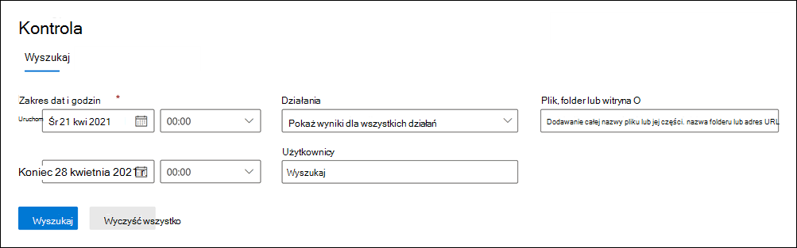
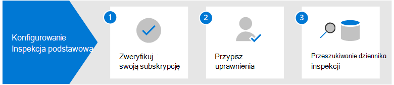

# Rozwiązania inspekcji w usłudze Microsoft Purview

Rozwiązania do inspekcji usługi Microsoft Purview zapewniają zintegrowane rozwiązanie ułatwiające organizacjom efektywne reagowanie na zdarzenia zabezpieczeń, badania kryminalistyczne, badania wewnętrzne i obowiązki w zakresie zgodności. Tysiące operacji użytkowników i administratorów wykonywanych w dziesiątkach usług i rozwiązań platformy Microsoft 365 jest przechwytywanych, rejestrowanych i przechowywanych w ujednoliconym dzienniku inspekcji organizacji. Rekordy inspekcji dla tych zdarzeń można przeszukiwać za pomocą operacji zabezpieczeń, administratorów IT, zespołów ds. ryzyka dotyczącego informacji poufnych oraz badaczy zgodności i prawnych w organizacji. Ta funkcja zapewnia wgląd w działania wykonywane w organizacji platformy Microsoft 365.

## Rozwiązania w zakresie inspekcji w usłudze Microsoft Purview

Usługa Microsoft Purview udostępnia dwa rozwiązania inspekcji: Audit (Standard) i Audit (Premium).

### Usługa Inspekcja (wersja Standardowa)

Inspekcja w Microsoft Purview (Standard) zapewnia możliwość rejestrowania i wyszukiwania zbadanych działań oraz wykonywania dochodzeń sądowych, informatycznych, zgodności i dochodzeń prawnych.

- **Domyślnie włączone**. Inspekcja (Standardowa) jest domyślnie włączona dla wszystkich organizacji z odpowiednią subskrypcją. Oznacza to, że rekordy dla inspekcji działań zostaną przechwycone i możliwe do przeszukiwania. Jedyną wymaganą konfiguracją jest przypisanie uprawnień niezbędnych do uzyskania dostępu do narzędzia do wyszukiwania dzienników inspekcji (i odpowiedniego polecenia cmdlet) i upewnienie się, że użytkownikowi przypisano odpowiednią licencję na funkcje Inspekcja w Microsoft Purview (Premium).
- **Tysiące zdarzeń inspekcji z możliwością wyszukiwania**. Możesz wyszukać szeroką gamę inspekcji wykonywanych działań, które są większością usług Platformy Microsoft 365 w organizacji. Aby uzyskać częściową listę działań, które można wyszukać, zobacz [Inspekcja działań](search-the-audit-log-in-security-and-compliance.md#audited-activities). Aby uzyskać listę usług i funkcji, które obsługują inspekcję działań, zobacz [Audit log record type (Typ rekordu dziennika inspekcji](/office/office-365-management-api/office-365-management-activity-api-schema#auditlogrecordtype)).
- **Narzędzie do wyszukiwania inspekcji w portal zgodności Microsoft Purview**. Użyj narzędzia do wyszukiwania dzienników inspekcji w portalu zgodności, aby wyszukać rekordy inspekcji. Możesz wyszukać określone działania, działania wykonywane przez określonych użytkowników i działania, które wystąpiły z zakresem dat. Oto zrzut ekranu przedstawiający narzędzie do wyszukiwania inspekcji w Centrum zgodności.

   

- **Polecenie cmdlet Search-UnifiedAuditLog**. Możesz również użyć polecenia cmdlet **Search-UnifiedAuditLog** w programie Exchange Online programu PowerShell (podstawowego polecenia cmdlet narzędzia wyszukiwania), aby wyszukać zdarzenia inspekcji lub użyć go w skrypcie. Więcej informacji można znaleźć w następujących artykułach:

  - [Dokumentacja poleceń cmdlet Search-UnifiedAuditLog](/powershell/module/exchange/search-unifiedauditlog)
  - [Przeszukaj dziennik inspekcji za pomocą skryptu programu PowerShell](audit-log-search-script.md)

- **Eksportuj rekordy inspekcji do pliku CSV**. Po uruchomieniu narzędzia do wyszukiwania dzienników inspekcji w portalu zgodności można wyeksportować rekordy inspekcji zwrócone przez wyszukiwanie do pliku CSV. Dzięki temu można używać programu Microsoft Excel do sortowania i filtrowania różnych właściwości rekordu inspekcji. Możesz również użyć funkcji przekształcania programu Excel Power Query, aby podzielić każdą właściwość w obiekcie AuditData JSON na własną kolumnę. Umożliwia to efektywne wyświetlanie i porównywanie podobnych danych dla różnych zdarzeń. Aby uzyskać więcej informacji, zobacz [Eksportowanie, konfigurowanie i wyświetlanie rekordów dziennika inspekcji](export-view-audit-log-records.md).

- **Dostęp do dzienników inspekcji za pośrednictwem interfejsu API działania zarządzania Office 365**. Trzecią metodą uzyskiwania dostępu do rekordów inspekcji i pobierania ich jest użycie interfejsu API działania zarządzania Office 365. Umożliwia to organizacjom przechowywanie danych inspekcji przez dłuższy czas niż domyślne 90 dni i umożliwia im importowanie danych inspekcji do rozwiązania SIEM. Aby uzyskać więcej informacji, zobacz [dokumentację interfejsu API działania zarządzania Office 365](/office/office-365-management-api/office-365-management-activity-api-reference).

- **90-dniowe przechowywanie dziennika inspekcji**. Gdy inspekcja działania jest wykonywana przez użytkownika lub administratora, rekord inspekcji jest generowany i przechowywany w dzienniku inspekcji organizacji. W obszarze Inspekcja (Standardowa) rekordy są przechowywane przez 90 dni, co oznacza, że można wyszukiwać działania, które wystąpiły w ciągu ostatnich trzech miesięcy.

### Inspekcja (wersja Premium)

Inspekcja (Premium) opiera się na możliwościach inspekcji (Standardowa), zapewniając zasady przechowywania dzienników inspekcji, dłuższe przechowywanie rekordów inspekcji, zdarzenia o wysokiej wartości i dostęp do interfejsu API działania zarządzania Office 365.

- **Inspekcja zasad przechowywania dzienników**. Możesz utworzyć niestandardowe zasady przechowywania dzienników inspekcji, aby przechowywać rekordy inspekcji przez dłuższy czas do jednego roku (i do 10 lat dla użytkowników z wymaganą licencją dodatku). Można utworzyć zasady do przechowywania rekordów inspekcji w oparciu o usługę, w której są wykonywane inspekcje działań, określone działania inspekcji lub użytkownika, który wykonuje inspekcję działania.

- **Dłuższe przechowywanie rekordów inspekcji**. Rekordy inspekcji programu Exchange, programu SharePoint i usługi Azure Active Directory są domyślnie przechowywane przez jeden rok. Rekordy inspekcji dla wszystkich innych działań są domyślnie przechowywane przez 90 dni lub można użyć zasad przechowywania dzienników inspekcji, aby skonfigurować dłuższe okresy przechowywania.

- **Zdarzenia inspekcji o wysokiej wartości (Premium).** Rekordy inspekcji kluczowych zdarzeń mogą pomóc organizacji w prowadzeniu badań kryminalistycznych i zgodności, zapewniając wgląd w zdarzenia, takie jak czas uzyskiwania dostępu do elementów poczty lub kiedy elementy poczty zostały przekazane i przekazane, lub kiedy i co użytkownik szukał w Exchange Online i SharePoint Online. Te kluczowe zdarzenia mogą pomóc w zbadaniu możliwych naruszeń i określeniu zakresu naruszenia zabezpieczeń.

- **Większa przepustowość interfejsu API działania zarządzania Office 365**. Inspekcja (Premium) zapewnia organizacjom większą przepustowość w celu uzyskania dostępu do dzienników inspekcji za pośrednictwem interfejsu API działania zarządzania Office 365. Mimo że wszystkie organizacje (z inspekcją (standardową) lub inspekcją (Premium)) są początkowo przydzielane według planu bazowego wynoszącego 2000 żądań na minutę, limit ten będzie dynamicznie zwiększany w zależności od liczby miejsc w organizacji i subskrypcji licencjonowania. Powoduje to, że organizacje z inspekcją (Premium) uzyskują około dwukrotnie wyższą przepustowość niż w organizacjach z usługą Audit (Standard).

Aby uzyskać bardziej szczegółowe informacje na temat funkcji inspekcji (Premium), zobacz [Audit (Premium) in Microsoft 365 (Inspekcja (Premium) na platformie Microsoft 365](advanced-audit.md).

## Porównanie kluczowych możliwości

W poniższej tabeli porównano kluczowe możliwości dostępne w usługach Audit (Standard) i Audit (Premium). Wszystkie funkcje inspekcji (w warstwie Standardowa) są uwzględnione w sekcji Inspekcja (Premium).

|Możliwości|Usługa Inspekcja (wersja Standardowa)|Inspekcja (wersja Premium)|
|:------|:-------------|:-------------|
|Domyślnie włączone|||
|Tysiące zdarzeń inspekcji z możliwością wyszukiwania|||
|Narzędzie do wyszukiwania inspekcji w portalu zgodności|||
|polecenie cmdlet Search-UnifiedAuditLog|||
|Eksportowanie rekordów inspekcji do pliku CSV|||
|Dostęp do dzienników inspekcji za pośrednictwem interfejsu API działania zarządzania Office 365 1|||
|90-dniowe przechowywanie dziennika inspekcji|||
|1-letni okres przechowywania dziennika inspekcji|||
|10-letni okres przechowywania dziennika inspekcji 2|||
|Zasady przechowywania dzienników inspekcji|||
|Zdarzenia o wysokiej wartości, kluczowe|||

> [!NOTE]
> 1 Inspekcja (Premium) obejmuje wyższy dostęp do interfejsu API działania zarządzania Office 365, który zapewnia szybszy dostęp do danych inspekcji. 2 Oprócz wymaganej licencji na inspekcję (Premium) (opisanej w następnej sekcji) użytkownikowi musi zostać przypisany 10-letni dodatek Przechowywania dziennika inspekcji w celu zachowania rekordów inspekcji przez 10 lat.

## Wymagania dotyczące licencjonowania

W poniższych sekcjach zidentyfikowano wymagania licencyjne dotyczące inspekcji (standardowej) i inspekcji (Premium). Funkcja inspekcji (standardowa) jest dołączona do funkcji Inspekcja (Premium).

### Usługa Inspekcja (wersja Standardowa)

- Subskrypcja usługi Microsoft Business Basic
- Subskrypcja usługi Microsoft Business Standard
- subskrypcja Aplikacje Microsoft 365 for Business
- subskrypcja Microsoft 365 Enterprise E3
- Microsoft 365 Business Premium
- subskrypcja Microsoft 365 Education A3
- Subskrypcja platformy Microsoft 365 Government G3
- Subskrypcja platformy Microsoft 365 Government G1
- Subskrypcja platformy Microsoft 365 Frontline F1 lub F3 lub dodatek F5 Security
- subskrypcja Office 365 Enterprise E3
- subskrypcja Office 365 Enterprise E1
- subskrypcja Office 365 Education A1
- subskrypcja Office 365 Education A3

### Inspekcja (wersja Premium)

- subskrypcja Microsoft 365 Enterprise E5
- subskrypcja Microsoft 365 Enterprise E3 + dodatek Zgodność platformy Microsoft 365 E5
- subskrypcja Microsoft 365 Enterprise E3 + dodatek Microsoft 365 E5 eDiscovery and Audit
- subskrypcja Microsoft 365 Education A5
- Microsoft 365 Education subskrypcji usługi A3 i dodatku Microsoft 365 A5 Compliance
- Microsoft 365 Education subskrypcji usługi A3 i dodatku Microsoft 365 A5 eDiscovery and Audit
- Subskrypcja platformy Microsoft 365 Government G5
- Subskrypcja platformy Microsoft 365 Government G3 + dodatek Microsoft 365 G5 Compliance
- Subskrypcja platformy Microsoft 365 Government G3 + dodatek Microsoft 365 G5 eDiscovery and Audit
- Dodatek Microsoft 365 Frontline F5 Compliance lub F5 Security & Compliance
- subskrypcja Office 365 Enterprise E5
- subskrypcja Office 365 Education A5

## Konfigurowanie rozwiązań inspekcji usługi Microsoft Purview

Aby rozpocząć korzystanie z rozwiązań inspekcji w usłudze Microsoft Purview, zapoznaj się z poniższymi wskazówkami dotyczącymi konfiguracji.

### Konfiguruj usługę Inspekcja (wersja Standardowa)

Pierwszym krokiem jest skonfigurowanie inspekcji (Standardowa), a następnie uruchomienie wyszukiwania dzienników inspekcji.

1. Sprawdź, czy Twoja organizacja ma subskrypcję, która obsługuje inspekcję (Standardowa), a w razie potrzeby subskrypcję obsługą inspekcji (Premium).

2. Przypisz uprawnienia w Exchange Online osobom w organizacji, które będą używać narzędzia do wyszukiwania dzienników inspekcji w portalu zgodności lub użyjesz polecenia cmdlet **Search-UnifiedAuditLog**. W szczególności użytkownicy muszą mieć przypisaną rolę dzienników inspekcji View-Only lub dzienników inspekcji w Exchange Online.

3. Przeszukaj dziennik inspekcji. Po wykonaniu kroków 1 i 2 użytkownicy w organizacji mogą używać narzędzia do wyszukiwania dzienników inspekcji (lub odpowiedniego polecenia cmdlet) do wyszukiwania inspekcji działań.

Aby uzyskać bardziej szczegółowe instrukcje, zobacz [Konfigurowanie inspekcji (standardowa)](set-up-basic-audit.md).

### Konfiguruj usługę Inspekcja (wersja Premium)

Jeśli Twoja organizacja ma subskrypcję, która obsługuje usługę Audit (Premium), wykonaj następujące kroki, aby skonfigurować i korzystać z dodatkowych możliwości w obszarze Inspekcja (Premium).

1. Konfigurowanie inspekcji (Premium) dla użytkowników. Ten krok składa się z następujących zadań:

   - Sprawdzanie, czy użytkownikom przypisano odpowiednią licencję lub licencję dodatku na potrzeby inspekcji (Premium).
  
   - Włączenie planu aplikacji/usługi Inspekcja (Premium) musi być przeznaczone dla tych użytkowników.
  
   - Włączanie inspekcji kluczowych zdarzeń, a następnie włączanie planu aplikacji/usługi Inspekcja (Premium) dla tych użytkowników.

2. Włącz rejestrowanie zdarzeń inspekcji (Premium), gdy użytkownicy wykonują wyszukiwania w usługach Exchange Online i SharePoint Online.

3. Skonfiguruj zasady przechowywania dzienników inspekcji. Oprócz domyślnych zasad, które przechowują rekordy inspekcji programu Exchange, SharePoint i Azure AD przez jeden rok, można utworzyć dodatkowe zasady przechowywania dzienników inspekcji w celu spełnienia wymagań zespołów ds. operacji zabezpieczeń, IT i zgodności organizacji.

4. Wyszukaj kluczowe zdarzenia inspekcji (Premium) i inne działania podczas prowadzenia dochodzeń kryminalistycznych. Po wykonaniu kroków 1 i 2 można przeszukiwać dziennik inspekcji pod kątem zdarzeń inspekcji (Premium) i innych działań podczas badania kryminalistycznego naruszonego konta i innych typów badań zabezpieczeń lub zgodności.

Aby uzyskać bardziej szczegółowe instrukcje, zobacz [Konfigurowanie inspekcji (Premium).](set-up-advanced-audit.md)

<!--
## Encrypt audit records using Customer Key

You can enable Customer Key encryption for audit records. Auditing builds on the [Service encryption with Customer Key](customer-key-overview.md) to encrypt sensitive information in your organization's auditing data. Implementing Customer Key provides extra protection by preventing unauthorized systems or Microsoft data center personnel from viewing your auditing data in the auditing pipeline and at rest. Using Customer Key to encrypt your auditing data also helps you meet regulatory or compliance obligations because your organization provides and controls the encryption keys.

To implement Customer Key for auditing, you have to create a multi-workload Data Encryption Policy (DEP), which defines the encryption hierarchy. For detailed step-by-step instructions, see [Set up Customer Key](customer-key-set-up.md).

> [!NOTE]
> Not all audit records in your organization are encrypted. The Microsoft Purview service that generates specific audit records for activity in that service defines whether the audit record is encrypted or not.
-->

## Szkolenia

Szkolenie zespołu ds. operacji zabezpieczeń, administratorów IT i zespołu badaczy zgodności w zakresie podstaw inspekcji (Standardowa) i Inspekcji (Premium) może pomóc twojej organizacji szybciej rozpocząć pracę przy użyciu inspekcji, aby pomóc w badaniu. Usługa Microsoft Purview udostępnia następujący zasób, który ułatwia tym użytkownikom w organizacji rozpoczęcie inspekcji: [Opis możliwości zbierania elektronicznych materiałów dowodowych i inspekcji w usłudze Microsoft Purview](/learn/modules/describe-ediscovery-capabilities-of-microsoft-365).
