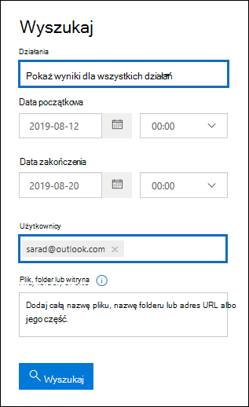

# <a name="search-the-audit-log-to-investigate-common-support-issues"></a>Przeszukaj dziennik inspekcji, aby zbadać typowe problemy z pomocą techniczną

[!include[Purview banner](../includes/purview-rebrand-banner.md)]

W tym artykule opisano, jak używać narzędzia do wyszukiwania dzienników inspekcji, aby ułatwić badanie typowych problemów z pomocą techniczną. Obejmuje to korzystanie z dziennika inspekcji w celu:

- Znajdowanie adresu IP komputera używanego do uzyskiwania dostępu do konta, którego zabezpieczenia zostały naruszone
- Określanie, kto skonfigurował przekazywanie wiadomości e-mail dla skrzynki pocztowej
- Określanie, czy użytkownik usunął elementy poczty e-mail w swojej skrzynce pocztowej
- Określanie, czy użytkownik utworzył regułę skrzynki odbiorczej
- Zbadaj, dlaczego użytkownik spoza organizacji pomyślnie się zalogował
- Wyszukiwanie działań skrzynki pocztowej wykonywanych przez użytkowników z licencjami innych niż E5
- Wyszukiwanie działań skrzynki pocztowej wykonywanych przez delegowanych użytkowników

## <a name="using-the-audit-log-search-tool"></a>Korzystanie z narzędzia do wyszukiwania dzienników inspekcji

Każdy ze scenariuszy rozwiązywania problemów opisanych w tym artykule jest oparty na użyciu narzędzia do wyszukiwania dzienników inspekcji w portalu zgodności usługi Microsoft Purview. W tej sekcji wymieniono uprawnienia wymagane do przeszukiwania dziennika inspekcji i opisano kroki uzyskiwania dostępu do przeszukiwania dzienników inspekcji i uruchamiania ich. W każdej sekcji scenariusza wyjaśniono, jak skonfigurować zapytanie wyszukiwania dziennika inspekcji i czego szukać w szczegółowych informacjach w rekordach inspekcji zgodnych z kryteriami wyszukiwania.

### <a name="permissions-required-to-use-the-audit-log-search-tool"></a>Uprawnienia wymagane do korzystania z narzędzia do wyszukiwania dzienników inspekcji

Aby przeszukać dziennik inspekcji, musisz mieć przypisaną rolę dzienników inspekcji lub dzienników inspekcji View-Only w Exchange Online. Domyślnie te role są przypisywane do grup ról Zarządzanie zgodnością i Zarządzanie organizacją na stronie **Uprawnienia** w <a href="https://go.microsoft.com/fwlink/p/?linkid=2059104" target="_blank">centrum administracyjnym Exchange</a>. Administratorzy globalni w Office 365 i Microsoft 365 są automatycznie dodawani jako członkowie grupy ról Zarządzanie organizacją w Exchange Online. Aby uzyskać więcej informacji, zobacz [Zarządzanie grupami ról w Exchange Online](/Exchange/permissions-exo/role-groups).

### <a name="running-audit-log-searches"></a>Uruchamianie przeszukiwania dzienników inspekcji

W tej sekcji opisano podstawowe informacje dotyczące tworzenia i uruchamiania przeszukiwania dzienników inspekcji. Skorzystaj z tych instrukcji jako punktu wyjścia dla każdego scenariusza rozwiązywania problemów w tym artykule. Aby uzyskać bardziej szczegółowe instrukcje krok po kroku, zobacz [Przeszukiwanie dziennika inspekcji](search-the-audit-log-in-security-and-compliance.md#step-1-run-an-audit-log-search).

1. Przejdź do witryny <https://compliance.microsoft.com/auditlogsearch> i zaloguj się przy użyciu konta służbowego.
  
    Zostanie wyświetlona strona **Inspekcja** .
  
    
  
2. Możesz skonfigurować następujące kryteria wyszukiwania. Każdy scenariusz rozwiązywania problemów w tym artykule zaleca konkretne wskazówki dotyczące konfigurowania tych pól.
  
   a. **Data rozpoczęcia** i **data zakończenia:** wybierz zakres dat i godzin, aby wyświetlić zdarzenia, które wystąpiły w tym okresie. Domyślnie wybierane są ostatnie siedem dni. Data i godzina są prezentowane w formacie Uniwersalny czas koordynowany (UTC). Maksymalny zakres dat, który można określić, wynosi 90 dni.

   b. **Działania:** Wybierz listę rozwijaną, aby wyświetlić działania, których można wyszukać. Po uruchomieniu wyszukiwania zostaną wyświetlone tylko rekordy inspekcji dla wybranych działań. Wybranie pozycji **Pokaż wyniki dla wszystkich działań** powoduje wyświetlenie wyników dla wszystkich działań spełniających inne kryteria wyszukiwania. Należy również pozostawić to pole puste w niektórych scenariuszach rozwiązywania problemów.
  
    c. **Użytkowników:** Kliknij to pole, a następnie wybierz co najmniej jednego użytkownika, aby wyświetlić wyniki wyszukiwania. Rekordy inspekcji dla wybranego działania wykonane przez użytkowników wybranych w tym polu są wyświetlane na liście wyników. Pozostaw to pole puste, aby zwrócić wpisy dla wszystkich użytkowników (i kont usług) w organizacji.
  
    d. **Plik, folder lub witryna:** Wpisz część lub wszystkie nazwy pliku lub folderu, aby wyszukać działanie związane z plikiem folderu zawierającym określone słowo kluczowe. Możesz również określić adres URL pliku lub folderu. Jeśli używasz adresu URL, upewnij się, że wpisz pełną ścieżkę adresu URL lub jeśli wpiszesz tylko część adresu URL, nie dołącz żadnych znaków specjalnych ani spacji. Pozostaw to pole puste, aby zwrócić wpisy dla wszystkich plików i folderów w organizacji. To pole pozostaje puste we wszystkich scenariuszach rozwiązywania problemów w tym artykule.
  
3. Wybierz pozycję **Wyszukaj** , aby uruchomić wyszukiwanie przy użyciu kryteriów wyszukiwania.
  
    Wyniki wyszukiwania są ładowane i po kilku chwilach są wyświetlane na stronie w narzędziu do wyszukiwania dzienników inspekcji. Każda z sekcji w tym artykule zawiera wskazówki dotyczące elementów, których należy szukać w kontekście konkretnego scenariusza rozwiązywania problemów.

    Aby uzyskać więcej informacji na temat wyświetlania i eksportowania wyników wyszukiwania dziennika inspekcji, zobacz:

    - [Wyświetlanie wyników wyszukiwania](search-the-audit-log-in-security-and-compliance.md#step-2-view-the-search-results)
  
    - [Eksportuj wyniki wyszukiwania](search-the-audit-log-in-security-and-compliance.md#step-3-export-the-search-results-to-a-file)

## <a name="find-the-ip-address-of-the-computer-used-to-access-a-compromised-account"></a>Znajdowanie adresu IP komputera używanego do uzyskiwania dostępu do konta, którego zabezpieczenia zostały naruszone

Adres IP odpowiadający działaniu wykonywanemu przez dowolnego użytkownika jest uwzględniony w większości rekordów inspekcji. Informacje o używanym kliencie są również zawarte w rekordzie inspekcji.

Oto jak skonfigurować zapytanie wyszukiwania dziennika inspekcji dla tego scenariusza:

**Działania:** Jeśli dotyczy to Twojego przypadku, wybierz określone działanie do wyszukania. Aby rozwiązać problemy z kontami, których zabezpieczenia zostały naruszone, rozważ wybranie działania **Użytkownik zalogowany do skrzynki pocztowej w** obszarze **Exchange działań skrzynki pocztowej**. Spowoduje to zwrócenie rekordów inspekcji pokazujących adres IP, który był używany podczas logowania się do skrzynki pocztowej. W przeciwnym razie pozostaw to pole puste, aby zwrócić rekordy inspekcji dla wszystkich działań. 

> [!TIP]
> Pozostawienie tego pola pustego spowoduje **zwrócenie działań UserLoggedIn**, które są działaniem Azure Active Directory wskazującym, że ktoś zalogował się do konta użytkownika. Użyj filtrowania w wynikach wyszukiwania, aby wyświetlić **rekordy inspekcji UserLoggedIn** .

**Data rozpoczęcia** i **data zakończenia:** wybierz zakres dat, który ma zastosowanie do badania.

**Użytkowników:** Jeśli badasz konto, którego bezpieczeństwo zostało naruszone, wybierz użytkownika, którego konto zostało naruszone. Spowoduje to zwrócenie rekordów inspekcji dla działań wykonywanych przez to konto użytkownika.

**Plik, folder lub witryna:** Pozostaw to pole puste.

Po uruchomieniu wyszukiwania adres IP każdego działania jest wyświetlany w kolumnie **adresu IP** w wynikach wyszukiwania. Wybierz rekord w wynikach wyszukiwania, aby wyświetlić bardziej szczegółowe informacje na stronie wysuwanej.

## <a name="determine-who-set-up-email-forwarding-for-a-mailbox"></a>Określanie, kto skonfigurował przekazywanie wiadomości e-mail dla skrzynki pocztowej

Gdy przekazywanie wiadomości e-mail jest skonfigurowane dla skrzynki pocztowej, wiadomości e-mail wysyłane do skrzynki pocztowej są przekazywane do innej skrzynki pocztowej. Komunikaty mogą być przekazywane do użytkowników w organizacji lub poza nią. Po skonfigurowaniu przekazywania wiadomości e-mail w skrzynce pocztowej podstawowym Exchange Online używanym poleceniem cmdlet jest **Set-Mailbox**.

Oto jak skonfigurować zapytanie wyszukiwania dziennika inspekcji dla tego scenariusza:

**Działania:** Pozostaw to pole puste, aby wyszukiwanie zwracało rekordy inspekcji dla wszystkich działań. Jest to niezbędne do zwrócenia wszystkich rekordów inspekcji związanych z poleceniem cmdlet **Set-Mailbox** .

**Data rozpoczęcia** i **data zakończenia:** wybierz zakres dat, który ma zastosowanie do badania.

**Użytkowników:** Jeśli nie badasz problemu z przekazywaniem wiadomości e-mail dla określonego użytkownika, pozostaw to pole puste. Pomaga to określić, czy dla dowolnego użytkownika skonfigurowano przekazywanie wiadomości e-mail.

**Plik, folder lub witryna:** Pozostaw to pole puste.

Po uruchomieniu wyszukiwania wybierz pozycję **Filtruj wyniki** na stronie wyników wyszukiwania. W polu w obszarze Nagłówek kolumny **Działania** wpisz **Set-Mailbox** , aby były wyświetlane tylko rekordy inspekcji związane z poleceniem cmdlet **Set-Mailbox** .


W tym momencie należy przyjrzeć się szczegółom każdego rekordu inspekcji, aby ustalić, czy działanie jest związane z przekazywaniem wiadomości e-mail. Wybierz rekord inspekcji, aby wyświetlić stronę wysuwaną **Szczegóły** , a następnie wybierz pozycję **Więcej informacji**. Poniższy zrzut ekranu i opisy wyróżniają informacje wskazujące, że w skrzynce pocztowej ustawiono przekazywanie wiadomości e-mail.


a. W polu **ObjectId** jest wyświetlany alias skrzynki pocztowej, na którą ustawiono przekazywanie wiadomości e-mail. Ta skrzynka pocztowa jest również **wyświetlana** w kolumnie Element na stronie wyników wyszukiwania.

b. W polu **Parametry** wartość *ForwardingSmtpAddress* wskazuje, że w skrzynce pocztowej ustawiono przekazywanie wiadomości e-mail. W tym przykładzie poczta jest przekazywana na adres e-mail mike@contoso.com, który znajduje się poza organizacją alpinehouse.onmicrosoft.com.

c. Wartość *True* parametru *DeliverToMailboxAndForward* wskazuje, że kopia wiadomości jest dostarczana do sarad@alpinehouse.onmicrosoft.com *i* jest przekazywana do adresu e-mail określonego przez parametr *ForwardingSmtpAddress* , który w tym przykładzie jest mike@contoso.com. Jeśli wartość parametru *DeliverToMailboxAndForward* ma wartość *False*, wiadomość e-mail jest przekazywana tylko do adresu określonego przez parametr *ForwardingSmtpAddress* . Nie jest dostarczany do skrzynki pocztowej określonej w polu **ObjectId** .

d. Pole **UserId** wskazuje użytkownika, który ustawi przekazywanie wiadomości e-mail w skrzynce pocztowej określonej w polu **ObjectId** . Ten użytkownik jest również wyświetlany w kolumnie **Użytkownik** na stronie wyników wyszukiwania. W tym przypadku wydaje się, że właściciel skrzynki pocztowej ustawił przekazywanie wiadomości e-mail w swojej skrzynce pocztowej.

Jeśli ustalisz, że przekazywanie wiadomości e-mail nie powinno być ustawione w skrzynce pocztowej, możesz je usunąć, uruchamiając następujące polecenie w programie Exchange Online programu PowerShell:

```powershell
Set-Mailbox <mailbox alias> -ForwardingSmtpAddress $null 
```

Aby uzyskać więcej informacji na temat parametrów związanych z przekazywaniem wiadomości [e-mail, zobacz artykuł Set-Mailbox (Konfigurowanie skrzynki pocztowej](/powershell/module/exchange/set-mailbox) ).

## <a name="determine-if-a-user-deleted-email-items"></a>Określanie, czy użytkownik usunął elementy wiadomości e-mail

Od stycznia 2019 r. firma Microsoft domyślnie włącza rejestrowanie inspekcji skrzynek pocztowych dla wszystkich Office 365 i organizacji firmy Microsoft. Oznacza to, że niektóre akcje wykonywane przez właścicieli skrzynek pocztowych są rejestrowane automatycznie, a odpowiednie rekordy inspekcji skrzynki pocztowej są dostępne podczas wyszukiwania ich w dzienniku inspekcji skrzynki pocztowej. Przed domyślnym włączeniem inspekcji skrzynki pocztowej trzeba było ją ręcznie włączyć dla każdej skrzynki pocztowej użytkownika w organizacji. 

Domyślnie rejestrowane akcje skrzynki pocztowej obejmują akcje skrzynki pocztowej SoftDelete i HardDelete wykonywane przez właścicieli skrzynek pocztowych. Oznacza to, że możesz użyć poniższych kroków, aby wyszukać w dzienniku inspekcji zdarzenia związane z usuniętymi elementami wiadomości e-mail. Aby uzyskać więcej informacji na temat domyślnego inspekcji skrzynek pocztowych, zobacz [Zarządzanie inspekcją skrzynek pocztowych](enable-mailbox-auditing.md).

Oto jak skonfigurować zapytanie wyszukiwania dziennika inspekcji dla tego scenariusza:

**Działania:** W obszarze **Exchange działań skrzynki pocztowej** wybierz jedno lub oba z następujących działań:

- **Usunięte komunikaty z folderu Elementy usunięte:** To działanie odpowiada akcji inspekcji skrzynki pocztowej **SoftDelete** . To działanie jest również rejestrowane, gdy użytkownik trwale usunie element, wybierając go i naciskając **klawisze Shift+Delete**. Po trwałym usunięciu elementu użytkownik może go odzyskać do momentu wygaśnięcia okresu przechowywania usuniętego elementu.

- **Przeczyszczane wiadomości ze skrzynki pocztowej:** To działanie odpowiada akcji inspekcji skrzynki pocztowej **HardDelete** . Jest to rejestrowane, gdy użytkownik przeczyści element z folderu Elementy możliwe do odzyskania. Administratorzy mogą używać narzędzia wyszukiwania zawartości w centrum zabezpieczeń i zgodności, aby wyszukiwać i odzyskiwać przeczyszczane elementy do momentu wygaśnięcia lub dłuższego okresu przechowywania usuniętych elementów, jeśli skrzynka pocztowa użytkownika jest wstrzymana.

**Data rozpoczęcia** i **data zakończenia:** wybierz zakres dat, który ma zastosowanie do badania.

**Użytkowników:** Jeśli wybierzesz użytkownika w tym polu, narzędzie do wyszukiwania dzienników inspekcji zwróci rekordy inspekcji dla elementów poczty e-mail, które zostały usunięte (Nietrwałe lub HardDeleted) przez określonego użytkownika. Czasami użytkownik, który usuwa wiadomość e-mail, może nie być właścicielem skrzynki pocztowej.

**Plik, folder lub witryna:** Pozostaw to pole puste.

Po uruchomieniu wyszukiwania można filtrować wyniki wyszukiwania, aby wyświetlić rekordy inspekcji dla elementów usuniętych nietrwale lub elementów usuniętych na stałe. Wybierz rekord inspekcji, aby wyświetlić stronę wysuwaną **Szczegóły** , a następnie wybierz pozycję **Więcej informacji**. Dodatkowe informacje o usuniętym elemencie, takie jak wiersz tematu i lokalizacja elementu po jego usunięciu, są wyświetlane w polu **AffectedItems** . Na poniższych zrzutach ekranu przedstawiono przykład pola **AffectedItems** z elementu usuniętego nietrwale i usuniętego elementu.

**Przykład pola AffectedItems dla elementu usuniętego nietrwale**


**Przykład pola AffectedItems dla usuniętego elementu**


### <a name="recover-deleted-email-items"></a>Odzyskiwanie usuniętych elementów wiadomości e-mail

Użytkownicy mogą odzyskać elementy usunięte nietrwale, jeśli okres przechowywania usuniętych elementów nie wygasł. W Exchange Online domyślny okres przechowywania usuniętych elementów wynosi 14 dni, ale administratorzy mogą zwiększyć to ustawienie do maksymalnie 30 dni. Wskaż użytkownikom artykuł [Odzyskiwanie usuniętych elementów lub wiadomości e-mail w Outlook w sieci Web](https://support.office.com/article/Recover-deleted-items-or-email-in-Outlook-Web-App-C3D8FC15-EEEF-4F1C-81DF-E27964B7EDD4), aby uzyskać instrukcje dotyczące odzyskiwania usuniętych elementów.

Jak wyjaśniono wcześniej, administratorzy mogą być w stanie odzyskać usunięte elementy, jeśli okres przechowywania usuniętych elementów nie wygasł lub jeśli skrzynka pocztowa jest wstrzymana, w takim przypadku elementy są przechowywane do czasu wygaśnięcia blokady. Po uruchomieniu wyszukiwania zawartości elementy usunięte nietrwale i usunięte w folderze Elementy możliwe do odzyskania są zwracane w wynikach wyszukiwania, jeśli są one zgodne z zapytaniem wyszukiwania. Aby uzyskać więcej informacji na temat uruchamiania wyszukiwania zawartości, zobacz [Wyszukiwanie zawartości w Office 365](content-search.md).

> [!TIP]
> Aby wyszukać usunięte elementy wiadomości e-mail, wyszukaj całą lub część wiersza tematu wyświetlanego w polu **AffectedItems** w rekordzie inspekcji.

## <a name="determine-if-a-user-created-an-inbox-rule"></a>Określanie, czy użytkownik utworzył regułę skrzynki odbiorczej

Gdy użytkownicy tworzą regułę skrzynki odbiorczej dla swojej skrzynki pocztowej Exchange Online, odpowiedni rekord inspekcji jest zapisywany w dzienniku inspekcji. Aby uzyskać więcej informacji na temat reguł skrzynki odbiorczej, zobacz:

- [Używanie reguł skrzynki odbiorczej w Outlook w sieci Web](https://support.office.com/article/use-inbox-rules-in-outlook-on-the-web-8400435c-f14e-4272-9004-1548bb1848f2)
- [Zarządzanie wiadomościami e-mail w Outlook przy użyciu reguł](https://support.office.com/article/Manage-email-messages-by-using-rules-C24F5DEA-9465-4DF4-AD17-A50704D66C59)

Oto jak skonfigurować zapytanie wyszukiwania dziennika inspekcji dla tego scenariusza:

**Działania:** W obszarze **Exchange działań skrzynki pocztowej** wybierz jedno lub oba z następujących działań:

- **New-InboxRule Utwórz nową regułę skrzynki odbiorczej z Outlook Web App**. To działanie zwraca rekordy inspekcji podczas tworzenia reguł skrzynki odbiorczej przy użyciu Outlook aplikacji internetowej lub Exchange Online programu PowerShell.

- **Zaktualizowano reguły skrzynki odbiorczej z klienta Outlook**. To działanie zwraca rekordy inspekcji, gdy reguły skrzynki odbiorczej są tworzone, modyfikowane lub usuwane przy użyciu klienta klasycznego Outlook.

**Data rozpoczęcia** i **data zakończenia:** wybierz zakres dat, który ma zastosowanie do badania.

**Użytkowników:** Jeśli nie badasz określonego użytkownika, pozostaw to pole puste. Pomaga to zidentyfikować nowe reguły skrzynki odbiorczej skonfigurowane przez dowolnego użytkownika.

**Plik, folder lub witryna:** Pozostaw to pole puste.

Po uruchomieniu wyszukiwania wszystkie rekordy inspekcji dla tego działania są wyświetlane w wynikach wyszukiwania. Wybierz rekord inspekcji, aby wyświetlić stronę wysuwaną **Szczegóły** , a następnie wybierz pozycję **Więcej informacji**. Informacje o ustawieniach reguły skrzynki odbiorczej są wyświetlane w polu **Parametry** . Poniższy zrzut ekranu i opisy wyróżniają informacje o regułach skrzynki odbiorczej.


a. W polu **ObjectId** jest wyświetlana pełna nazwa reguły skrzynki odbiorczej. Ta nazwa zawiera alias skrzynki pocztowej użytkownika (na przykład SaraD) i nazwę reguły skrzynki odbiorczej (na przykład "Przenieś wiadomości od administratora").

b. W polu **Parametry** jest wyświetlany warunek reguły skrzynki odbiorczej. W tym przykładzie warunek jest określony przez parametr *From* . Wartość zdefiniowana dla parametru *From* wskazuje, że reguła skrzynki odbiorczej działa w wiadomościach e-mail wysyłanych przez admin@alpinehouse.onmicrosoft.com. Aby uzyskać pełną listę parametrów, których można użyć do definiowania warunków reguł skrzynki odbiorczej, zobacz artykuł [New-InboxRule](/powershell/module/exchange/new-inboxrule) .

c. Parametr *MoveToFolder* określa akcję reguły skrzynki odbiorczej. W tym przykładzie komunikaty odebrane z admin@alpinehouse.onmicrosoft.com są przenoszone do folderu o nazwie *AdminSearch*. Zobacz również artykuł [New-InboxRule](/powershell/module/exchange/new-inboxrule) ,aby uzyskać pełną listę parametrów, których można użyć do zdefiniowania akcji reguły skrzynki odbiorczej.

d. Pole **UserId** wskazuje użytkownika, który utworzył regułę skrzynki odbiorczej określoną w polu **ObjectId** . Ten użytkownik jest również wyświetlany w kolumnie **Użytkownik** na stronie wyników wyszukiwania.

## <a name="investigate-why-there-was-a-successful-login-by-a-user-outside-your-organization"></a>Zbadaj, dlaczego użytkownik spoza organizacji pomyślnie się zalogował

Podczas przeglądania rekordów inspekcji w dzienniku inspekcji mogą zostać wyświetlone rekordy wskazujące, że użytkownik zewnętrzny został uwierzytelniony przez Azure Active Directory i pomyślnie zalogowany w organizacji. Na przykład administrator w contoso.onmicrosoft.com może zobaczyć rekord inspekcji pokazujący, że użytkownik z innej organizacji (na przykład fabrikam.onmicrosoft.com) pomyślnie zalogował się do contoso.onmicrosoft.com. Podobnie mogą zostać wyświetlone rekordy inspekcji wskazujące użytkowników z kontem Microsoft (MSA), takimi jak Outlook.com lub Live.com, pomyślnie zalogowanych w organizacji. W takich sytuacjach inspekcja działania jest **zalogowana przez użytkownika**. 

Takie działanie jest celowe. Azure Active Directory (Azure AD), usługa katalogowa, zezwala na *uwierzytelnianie* przekazywane, gdy użytkownik zewnętrzny próbuje uzyskać dostęp do witryny SharePoint lub lokalizacji OneDrive w organizacji. Gdy użytkownik zewnętrzny spróbuje to zrobić, zostanie wyświetlony monit o wprowadzenie poświadczeń. Usługa Azure AD używa poświadczeń do uwierzytelnienia użytkownika, co oznacza, że tylko usługa Azure AD sprawdza, czy użytkownik jest tym, kim się podaje. Wskazanie pomyślnego logowania w rekordzie inspekcji jest wynikiem uwierzytelnienia użytkownika przez usługę Azure AD. Pomyślne zalogowanie nie oznacza, że użytkownik mógł uzyskać dostęp do jakichkolwiek zasobów lub wykonać inne akcje w organizacji. Wskazuje tylko, że użytkownik został uwierzytelniony przez usługę Azure AD. Aby użytkownik przekazujący mógł uzyskać dostęp do SharePoint lub OneDrive zasobów, użytkownik w organizacji musiałby jawnie udostępnić zasób użytkownikowi zewnętrznemu, wysyłając mu zaproszenie do udostępniania lub link do udostępniania anonimowego. 

> [!NOTE]
> Usługa Azure AD zezwala na uwierzytelnianie przekazywane tylko w *przypadku aplikacji innych firm*, takich jak SharePoint Online i OneDrive dla Firm. Nie jest to dozwolone w przypadku innych aplikacji innych firm.

Oto przykład i opisy odpowiednich właściwości w rekordzie inspekcji dla zdarzenia **zalogowanego przez użytkownika** , które jest wynikiem uwierzytelniania przekazywanego. Wybierz rekord inspekcji, aby wyświetlić stronę wysuwaną **Szczegóły** , a następnie wybierz pozycję **Więcej informacji**.


   a. To pole wskazuje, że użytkownik, który próbował uzyskać dostęp do zasobu w organizacji, nie został znaleziony w usłudze Azure AD organizacji.

   b. To pole wyświetla nazwę UPN użytkownika zewnętrznego, który próbował uzyskać dostęp do zasobu w organizacji. Ten identyfikator użytkownika jest również identyfikowany we właściwościach **User** i **UserId** w rekordzie inspekcji.

   c. Właściwość **ApplicationId** identyfikuje aplikację, która wyzwoliła żądanie logowania. Wartość 000000003-0000-0ff1-ce00-00000000000000 wyświetlana we właściwości ApplicationId w tym rekordzie inspekcji wskazuje SharePoint Online. OneDrive dla Firm ma również ten sam identyfikator ApplicationId.

   d. Oznacza to, że uwierzytelnianie przekazywane zakończyło się pomyślnie. Innymi słowy, użytkownik został pomyślnie uwierzytelniony przez usługę Azure AD. 

   e. Wartość **RecordType** **15** wskazuje, że inspekcja działania (UserLoggedIn) jest zdarzeniem logowania usługi Secure Token Service (STS) w usłudze Azure AD.

Aby uzyskać więcej informacji na temat innych właściwości wyświetlanych w rekordzie inspekcji UserLoggedIn, zobacz informacje o schemacie dotyczącym usługi Azure AD w [schemacie interfejsu API działania zarządzania Office 365](/office/office-365-management-api/office-365-management-activity-api-schema#azure-active-directory-base-schema).

Poniżej przedstawiono dwa przykładowe scenariusze, które spowodowałyby **pomyślne zalogowanie użytkownika do** działania inspekcji z powodu uwierzytelniania przekazywanego: 

  - Użytkownik z kontem Microsoft (takim jak SaraD@outlook.com) próbował uzyskać dostęp do dokumentu na koncie OneDrive dla Firm w fourthcoffee.onmicrosoft.com i nie ma odpowiedniego konta użytkownika-gościa dla SaraD@outlook.com w fourthcoffee.onmicrosoft.com.

  - Użytkownik z kontem służbowym w organizacji (na przykład pilarp@fabrikam.onmicrosoft.com) próbował uzyskać dostęp do witryny SharePoint w contoso.onmicrosoft.com i nie ma odpowiedniego konta użytkownika-gościa dla pilarp@fabrikam.com w contoso.onmicrosoft.com.

### <a name="tips-for-investigating-successful-logins-resulting-from-pass-through-authentication"></a>Wskazówki do badania pomyślnych logowań wynikających z uwierzytelniania przekazywanego

- Wyszukaj w dzienniku inspekcji działania wykonywane przez użytkownika zewnętrznego zidentyfikowanego w rekordzie inspekcji **Zalogowany użytkownik** . Wpisz nazwę UPN użytkownika zewnętrznego w polu **Użytkownicy** i użyj zakresu dat, jeśli jest to istotne dla danego scenariusza. Możesz na przykład utworzyć wyszukiwanie przy użyciu następujących kryteriów wyszukiwania:

   

    Oprócz działań **zalogowanych przez użytkownika** mogą zostać zwrócone inne rekordy inspekcji, takie jak te, które wskazują, że użytkownik w organizacji udostępnił zasoby użytkownikowi zewnętrznemu oraz czy użytkownik zewnętrzny uzyskiwał dostęp, modyfikował lub pobierał dokument, który został mu udostępniony.

- Wyszukaj SharePoint działania udostępniania, które wskazywałyby, że plik został udostępniony użytkownikowi zewnętrznemu zidentyfikowanego przez **użytkownika zalogowanego w** rekordzie inspekcji. Aby uzyskać więcej informacji, zobacz [Używanie inspekcji udostępniania w dzienniku inspekcji](use-sharing-auditing.md).

- Wyeksportuj wyniki wyszukiwania dziennika inspekcji, które zawierają rekordy istotne dla badania, dzięki czemu możesz użyć Excel do wyszukiwania innych działań związanych z użytkownikiem zewnętrznym. Aby uzyskać więcej informacji, zobacz  [Eksportowanie, konfigurowanie i wyświetlanie rekordów dziennika inspekcji](export-view-audit-log-records.md).

## <a name="search-for-mailbox-activities-performed-by-users-with-non-e5-licenses"></a>Wyszukiwanie działań skrzynki pocztowej wykonywanych przez użytkowników z licencjami innych niż E5

Nawet jeśli [inspekcja skrzynki pocztowej jest domyślnie](enable-mailbox-auditing.md) włączona dla organizacji, można zauważyć, że zdarzenia inspekcji skrzynki pocztowej dla niektórych użytkowników nie są odnajdywane w wyszukiwaniach dzienników inspekcji przy użyciu centrum zgodności, polecenia cmdlet **Search-UnifiedAuditLog** lub interfejsu API działania zarządzania Office 365. Przyczyną jest to, że zdarzenia inspekcji skrzynki pocztowej będą zwracane tylko dla użytkowników z licencjami E5, gdy jedna z poprzednich metod przeszukiwania ujednoliconego dziennika inspekcji.

Aby pobrać rekordy dziennika inspekcji skrzynki pocztowej dla użytkowników innych niż E5, można wykonać jedno z następujących obejść:

- Ręcznie włącz inspekcję skrzynek pocztowych w poszczególnych skrzynkach pocztowych (uruchom `Set-Mailbox -Identity <MailboxIdentity> -AuditEnabled $true` polecenie w programie Exchange Online programu PowerShell). Po wykonaniu tej czynności wyszukaj działania inspekcji skrzynki pocztowej przy użyciu centrum zgodności, polecenia cmdlet **Search-UnifiedAuditLog** lub interfejsu API działania zarządzania Office 365.
  
  > [!NOTE]
  > Jeśli inspekcja skrzynki pocztowej jest już widoczna jako włączona w skrzynce pocztowej, ale wyszukiwanie nie zwraca żadnych wyników, zmień wartość parametru _AuditEnabled_ na `$false` , a następnie z powrotem na `$true`.
  
- Użyj następujących poleceń cmdlet w programie Exchange Online programu PowerShell:

  - [Search-MailboxAuditLog](/powershell/module/exchange/search-mailboxauditlog) , aby wyszukać dziennik inspekcji skrzynki pocztowej dla określonych użytkowników.

  - [New-MailboxAuditLogSearch](/powershell/module/exchange/new-mailboxauditlogsearch) , aby wyszukać dziennik inspekcji skrzynki pocztowej dla określonych użytkowników i wysłać wyniki za pośrednictwem poczty e-mail do określonych adresatów.

## <a name="search-for-mailbox-activities-performed-in-a-specific-mailbox-including-shared-mailboxes"></a>Wyszukaj działania skrzynki pocztowej wykonywane w określonej skrzynce pocztowej (w tym w udostępnionych skrzynkach pocztowych)

Jeśli używasz listy rozwijanej **Użytkownicy** w narzędziu do wyszukiwania dzienników inspekcji w centrum zgodności lub poleceniu **Search-UnifiedAuditLog -UserIds** w programie Exchange Online programu PowerShell, możesz wyszukać działania wykonywane przez określonego użytkownika. W przypadku działań inspekcji skrzynki pocztowej tego typu wyszukiwanie będzie wyszukiwać działania wykonywane przez określonego użytkownika. Nie gwarantuje to, że wszystkie działania wykonywane w tej samej skrzynce pocztowej zostaną zwrócone w wynikach wyszukiwania. Na przykład wyszukiwanie dzienników inspekcji nie zwróci rekordów inspekcji dla działań wykonywanych przez użytkownika delegowanego, ponieważ wyszukiwanie działań skrzynki pocztowej wykonywanych przez określonego użytkownika nie zwróci działań wykonywanych przez delegowanego użytkownika, któremu przypisano uprawnienia dostępu do skrzynki pocztowej innego użytkownika. (Użytkownik delegowany to osoba, która ma przypisane uprawnienie SendAs, SendOnBehalf lub FullAccess do skrzynki pocztowej innego użytkownika).

Ponadto użycie listy rozwijanej **Użytkownik** w narzędziu wyszukiwania dzienników inspekcji lub **search-UnifiedAuditLog -UserIds** nie zwróci wyników dla działań wykonywanych w udostępnionej skrzynce pocztowej.

Aby wyszukać działania wykonywane w określonej skrzynce pocztowej lub wyszukać działania wykonywane w udostępnionej skrzynce pocztowej, użyj następującej składni podczas uruchamiania polecenia cmdlet **Search-UnifiedAuditLog** :

```powershell
Search-UnifiedAuditLog  -StartDate <date> -EndDate <date> -FreeText (Get-Mailbox <mailbox identity).ExchangeGuid
```

Na przykład następujące polecenie zwraca rekordy inspekcji dla działań wykonywanych w udostępnionej skrzynce pocztowej zespołu zgodności firmy Contoso w okresie od sierpnia 2020 r. do października 2020 r.:

```powershell
Search-UnifiedAuditLog  -StartDate 08/01/2020 -EndDate 10/31/2020 -FreeText (Get-Mailbox complianceteam@contoso.onmicrosoft.com).ExchangeGuid
```

Alternatywnie możesz użyć polecenia cmdlet **Search-MailboxAuditLog** , aby wyszukać rekordy inspekcji pod kątem działań wykonywanych w określonej skrzynce pocztowej. Obejmuje to wyszukiwanie działań wykonywanych w udostępnionej skrzynce pocztowej.

Poniższy przykład zwraca rekordy dziennika inspekcji skrzynki pocztowej dla działań wykonywanych w udostępnionej skrzynce pocztowej zespołu ds. zgodności firmy Contoso:

```powershell
Search-MailboxAuditLog -Identity complianceteam@contoso.onmicrosoft.com -StartDate 08/01/2020 -EndDate 10/31/2020 -ShowDetails
```

Poniższy przykład zwraca rekordy dziennika inspekcji skrzynki pocztowej dla działań wykonywanych w określonej skrzynce pocztowej przez delegowanych użytkowników:

```powershell
Search-MailboxAuditLog -Identity <mailbox identity> -StartDate <date> -EndDate <date> -LogonTypes Delegate -ShowDetails
```

Możesz również użyć polecenia cmdlet **New-MailboxAuditLogSearch** , aby wyszukać w dzienniku inspekcji określoną skrzynkę pocztową i wysłać wyniki pocztą e-mail do określonych adresatów.