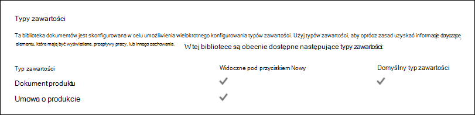
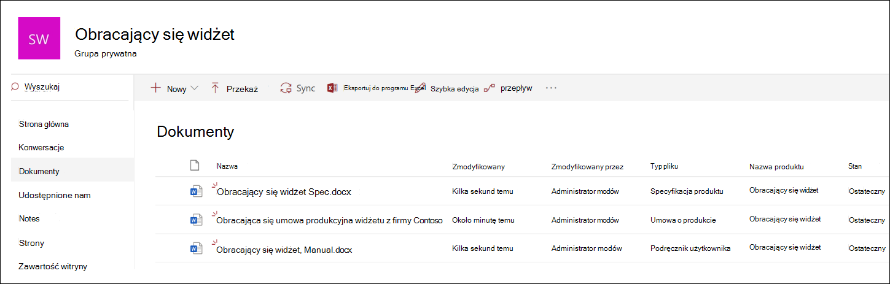
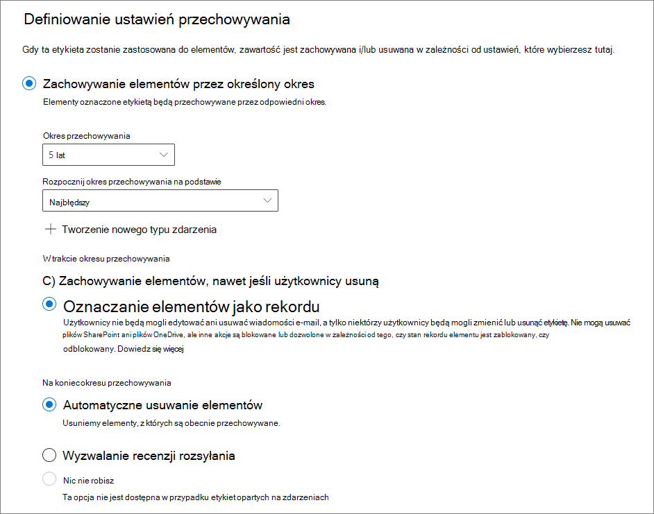
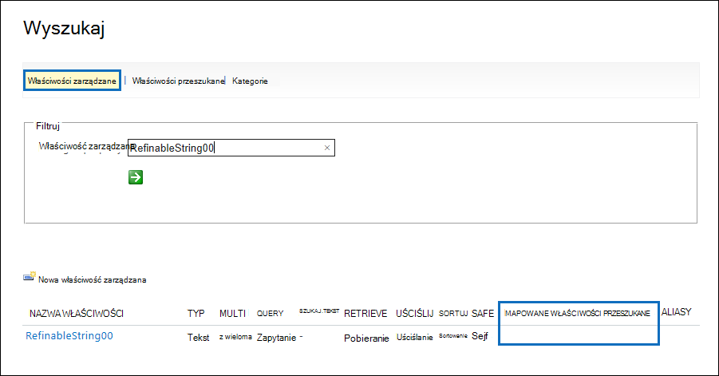
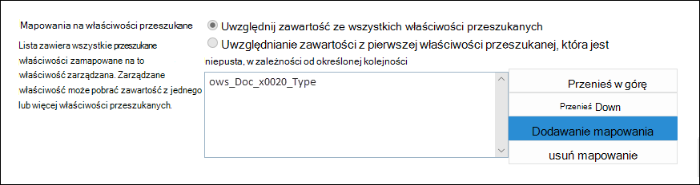
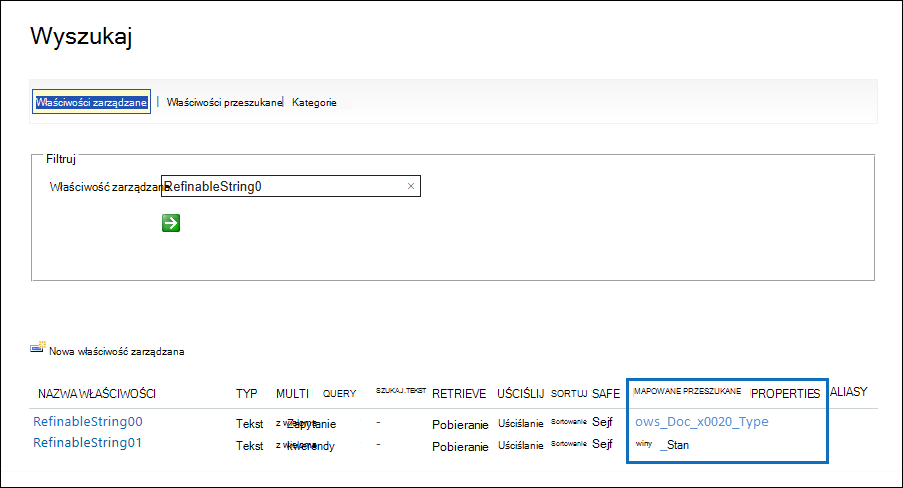
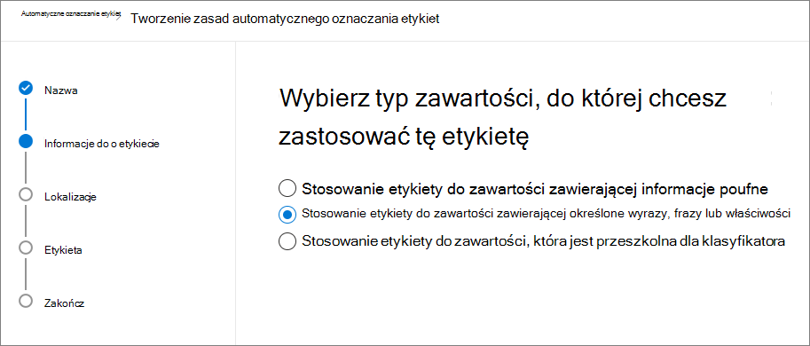
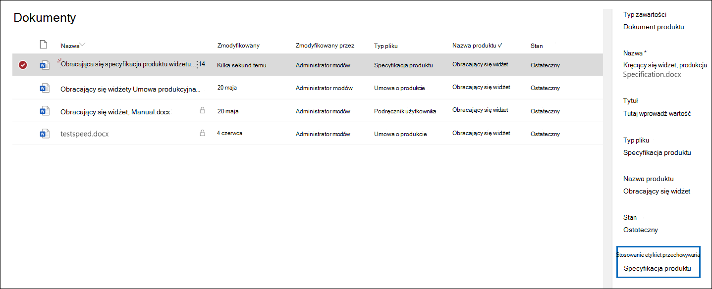

# <a name="use-retention-labels-to-manage-the-lifecycle-of-documents-stored-in-sharepoint"></a>Używanie etykiet przechowywania do zarządzania cyklem życia dokumentów przechowywanych w SharePoint

>*[Microsoft 365 wskazówki dotyczące licencjonowania dotyczące zgodności & zabezpieczeń](/office365/servicedescriptions/microsoft-365-service-descriptions/microsoft-365-tenantlevel-services-licensing-guidance/microsoft-365-security-compliance-licensing-guidance).*

[!include[Purview banner](../includes/purview-rebrand-banner.md)]

W tym artykule opisano sposób zarządzania cyklem życia dokumentów przechowywanych w SharePoint przy użyciu automatycznie stosowanych etykiet przechowywania i przechowywania opartego na zdarzeniach.

Funkcja automatycznego stosowania używa metadanych SharePoint do klasyfikacji dokumentów. Przykład w tym artykule dotyczy dokumentów związanych z produktem, ale tych samych pojęć można używać w innych scenariuszach. Na przykład w przemyśle naftowym i gazowym można go używać do zarządzania cyklem życia dokumentów dotyczących zasobów fizycznych, takich jak platformy naftowe, dzienniki studni lub licencje produkcyjne. W branży usług finansowych można zarządzać dokumentami dotyczącymi kont bankowych, kredytów hipotecznych lub umów ubezpieczeniowych. W sektorze publicznym można zarządzać pozwoleniami na budowę lub formularzami podatkowymi.

W tym artykule przyjrzymy się architekturze informacji i definicji etykiet przechowywania. Następnie sklasyfikujemy dokumenty, automatycznie stosując etykiety. Na koniec wygenerujemy zdarzenia inicjujące okres przechowywania.

## <a name="information-architecture"></a>Architektura informacji

Nasz scenariusz to firma produkcyjna, która używa SharePoint do przechowywania wszystkich dokumentów dotyczących produktów opracowywanych przez firmę. Dokumenty te obejmują specyfikacje produktów, umowy z dostawcami i podręczniki użytkownika. Gdy te dokumenty są przechowywane w SharePoint za pomocą zasad zarządzania zawartością Enterprise, są definiowane metadane dokumentu, które są używane do ich klasyfikowania. Każdy dokument ma następujące właściwości metadanych:

- **Typ dokumentu** (na przykład specyfikacja produktu, umowa lub podręcznik użytkownika)

- **Nazwa produktu**

- **Stan** (wersja robocza lub ostateczna)

Te metadane tworzą podstawowy typ zawartości o nazwie *Dokument produkcyjny* dla wszystkich dokumentów.


> [!NOTE]
> Właściwości **Typ** dokumentu i **Stan** są używane przez zasady przechowywania w dalszej części tego scenariusza do klasyfikowania i automatycznego stosowania etykiet przechowywania.

Możemy mieć kilka typów zawartości, które reprezentują różne typy dokumentów, ale skupmy się na dokumentacji produktu.

W tym scenariuszu użyjemy usługi Zarządzanych metadanych i magazynu terminów, aby utworzyć zestaw terminów dla *typu dokumentu* i inny dla *nazwy produktu*. Dla każdego zestawu terminów tworzymy termin dla każdej wartości. Wygląda to mniej więcej tak w magazynie terminów dla organizacji SharePoint:


*Typ zawartości* można tworzyć i publikować przy użyciu [Centrum typów zawartości](https://support.office.com/article/manage-content-type-publishing-06f39ac0-5576-4b68-abbc-82b68334889b). Typ zawartości można również tworzyć i publikować przy użyciu narzędzi aprowizacji witryn, takich jak [struktura aprowizacji PnP](/sharepoint/dev/solution-guidance/pnp-provisioning-framework) lub [schemat JSON projektu witryny](/sharepoint/dev/declarative-customization/site-design-json-schema#define-a-new-content-type).

Każdy produkt ma dedykowaną witrynę SharePoint zawierającą jedną bibliotekę dokumentów z włączonymi odpowiednimi typami zawartości. Wszystkie dokumenty są przechowywane w tej bibliotece dokumentów.

[ ](../media/SPRetention3.png#lightbox)

> [!NOTE]
> Zamiast SharePoint lokacji na produkt, firma produkcyjna w tym scenariuszu może użyć zespołu firmy Microsoft na produkt do obsługi współpracy między członkami zespołu, na przykład za pośrednictwem czatu trwałego, i użyć karty **Pliki** w Teams do zarządzania dokumentami. W tym artykule koncentrujemy się tylko na dokumentach, więc będziemy używać tylko witryny.

Oto widok biblioteki dokumentów dla produktu Spinning Widget:

[ ](../media/SPRetention4.png#lightbox)

Teraz, gdy mamy już podstawową architekturę informacji na potrzeby zarządzania dokumentami, przyjrzyjmy się strategii przechowywania i usuwania dokumentów korzystających z metadanych oraz sposobu klasyfikowania tych dokumentów.

## <a name="retention-and-disposition"></a>Przechowywanie i usposobienie

Zasady zgodności i ładu danych firmy produkcyjnej określają sposób zachowywania i usuwania danych. Dokumenty związane z produktem muszą być przechowywane tak długo, jak długo produkt jest wytwarzany i przez pewien dodatkowy okres. Dodatkowy okres różni się w przypadku specyfikacji produktu, umów i podręczników użytkownika. Poniższa tabela wskazuje wymagania dotyczące przechowywania i dyspozycji:

|   Typ dokumentu            |   Przechowywania                            |   Dyspozycji                                |
| -------------------------- | -------------------------------------- | -------------------------------------------- |
| Specyfikacje produktów      | 5 lat po zakończeniu produkcji  | Usuń                                       |
| Umowy dotyczące produktów          | 10 lat po zakończeniu produkcji | Przegląd                                       |
| Podręczniki użytkownika                | 5 lat po zakończeniu produkcji  | Usuń                                       |
| Wszystkie inne typy dokumentów | Nie należy aktywnie zachowywać  | Usuń, gdy dokument jest starszy niż 3 lata <br /><br /> Dokument jest uznawany za starszy niż 3 lata, jeśli nie został zmodyfikowany w ciągu ostatnich 3 lat. |
|||

Użyjemy portalu zgodności usługi Microsoft Purview, aby utworzyć następujące [etykiety przechowywania](retention.md#retention-labels):

  - Specyfikacja produktu

  - Umowa produktu

  - Podręcznik użytkownika

W tym artykule pokazano tylko, jak utworzyć i automatycznie zastosować etykietę przechowywania specyfikacji produktu. Aby zaimplementować kompletny scenariusz, należy również utworzyć i automatycznie zastosować etykiety przechowywania dla dwóch pozostałych typów dokumentów.

### <a name="settings-for-the-product-specification-retention-label"></a>Ustawienia etykiety przechowywania specyfikacji produktu

Oto [plan pliku](file-plan-manager.md) etykiety przechowywania specyfikacji produktu:

- **Nazwa:** Specyfikacja produktu

- **Opis dla użytkowników:** Zachowaj przez 5 lat po zakończeniu produkcji.

- **Opis dla administratorów:** Zachowaj przez 5 lat po zatrzymaniu produkcji, automatycznym usuwaniu, przechowywaniu na podstawie zdarzeń, typ zdarzenia to *Product Cessation*.

- **Akcja przechowywania:** Zachowaj i usuń.

- **Czas przechowywania:** 5 lat (1825 dni).

- **Etykieta rekordu**: skonfiguruj etykietę przechowywania, aby oznaczyć elementy jako [rekord](records-management.md#records), co oznacza, że etykietowane dokumenty nie mogą być modyfikowane ani usuwane przez użytkowników.

- **Deskryptory planu plików:** Aby uprościć scenariusz, nie podano opcjonalnych deskryptorów plików.

Poniższy zrzut ekranu przedstawia ustawienia podczas tworzenia etykiety przechowywania specyfikacji produktu w portalu zgodności usługi Microsoft Purview. Typ zdarzenia *Zaprzestanie produktu* można utworzyć podczas tworzenia etykiety przechowywania. Zapoznaj się z procedurą w poniższej sekcji.



> [!NOTE]
> Aby uniknąć 5-letniego oczekiwania na usunięcie dokumentu, ustaw czas przechowywania na ***1 dzień*** , jeśli ponownie tworzysz ten scenariusz w środowisku testowym.

### <a name="create-an-event-type-when-you-create-a-retention-label"></a>Tworzenie typu zdarzenia podczas tworzenia etykiety przechowywania

1. Na stronie **Definiowanie ustawień przechowywania** kreatora Tworzenie etykiety przechowywania po **rozpoczęciu okresu przechowywania wybierz** pozycję **Utwórz nowy typ zdarzenia**:

    

3. Na stronie **Nazwa typu zdarzenia wprowadź** wartość **Product Cessation (Zaprzestanie produktu** ) i opcjonalny opis. Następnie wybierz pozycję **Dalej**, **Prześlij** i **Gotowe**.

4. Wróć do strony **Definiowanie ustawień przechowywania** , aby **rozpocząć okres przechowywania na podstawie**, użyj pola listy rozwijanej, aby wybrać utworzony typ zdarzenia **Zaprzestanie produktu** .

    Poniżej przedstawiono ustawienia etykiety przechowywania specyfikacji produktu:

   

6. Wybierz pozycję **Utwórz etykietę**, a następnie na następnej stronie, gdy pojawią się opcje publikowania etykiety, automatycznego stosowania etykiety lub po prostu zapisz etykietę: wybierz pozycję **Po prostu zapisz etykietę na razie**, a następnie wybierz pozycję **Gotowe**.

    > [!TIP]
    > Aby uzyskać bardziej szczegółowe kroki, zobacz [Tworzenie etykiety, której okres przechowywania jest oparty na zdarzeniu](event-driven-retention.md#step-1-create-a-label-whose-retention-period-is-based-on-an-event).

Teraz przyjrzyjmy się, jak automatycznie zastosujemy etykietę przechowywania do zawartości specyfikacji produktu.

## <a name="auto-apply-retention-labels-to-documents"></a>Automatyczne stosowanie etykiet przechowywania do dokumentów

Użyjemy języka zapytań słów kluczowych (KQL), aby [automatycznie zastosować](apply-retention-labels-automatically.md) utworzone etykiety przechowywania. KQL jest językiem używanym do tworzenia zapytań wyszukiwania. W KQL możesz wyszukiwać przy użyciu słów kluczowych lub właściwości zarządzanych. Aby uzyskać więcej informacji, zobacz [Dokumentacja składni języka zapytań słów kluczowych (KQL).](/sharepoint/dev/general-development/keyword-query-language-kql-syntax-reference)

Zasadniczo chcemy poinformować Microsoft 365 o "zastosowaniu etykiety przechowywania **specyfikacji produktu** do wszystkich dokumentów, które mają **stan** **końcowy** i **typ** dokumentu **specyfikacji produktu**". Pamiętaj, że **stan** i **typ dokumentu** to kolumny witryny zdefiniowane dla typu zawartości Dokumentacja produktu w sekcji [Architektura informacji](#information-architecture) . W tym celu musimy skonfigurować schemat wyszukiwania.

Gdy SharePoint indeksuje zawartość, automatycznie generuje właściwości przeszukane dla każdej kolumny witryny. W tym scenariuszu interesują nas właściwości **Typ dokumentu** i **Stan** . Potrzebujemy dokumentów w bibliotece, które są odpowiednim typem zawartości i zawierają kolumny witryny wypełnione do wyszukiwania w celu utworzenia właściwości przeszukanych.

W <a href="https://go.microsoft.com/fwlink/?linkid=2185219" target="_blank">centrum administracyjnym SharePoint</a> otwórz konfigurację Wyszukiwania, a następnie wybierz pozycję **Zarządzaj schematem wyszukiwania**, aby wyświetlić i skonfigurować właściwości przeszukane.


Jeśli wpiszemy ***status** _ w polu _ *Crawled properties** i wybierzemy zieloną strzałkę, powinien zostać wyświetlony wynik podobny do następującego:


**Właściwość owsStatus\_\_** (zwróć uwagę na podwójne podkreślenie) jest tą, która nas interesuje. Mapuje ona na właściwość **Status** typu zawartości Dokument produkcyjny.

Teraz, jeśli ***wpiszemy owsdoc\_*** i wybierzemy zieloną strzałkę, powinna zostać wyświetlona następująca wartość:


**Właściwość owsDocx0020Type\_\_\_** jest drugą właściwością, która nas interesuje. Jest ona mapowana na właściwość **Typ dokumentu** produkcyjnego typu zawartości.

> [!TIP]
> Aby zidentyfikować nazwę właściwości przeszukanej dla tego scenariusza, przejdź do biblioteki dokumentów zawierającej dokumenty produkcyjne. Następnie przejdź do ustawień biblioteki. W polu **Kolumny** wybierz nazwę kolumny (na przykład **Stan** lub **Typ dokumentu**), aby otworzyć stronę kolumny witryny. Parametr *Pole* w adresie URL tej strony zawiera nazwę pola. Ta nazwa pola z prefiksem "ows_" jest nazwą właściwości przeszukanej. Na przykład adres URL `https://tenantname.sharepoint.com/sites/SpinningWidget/_layouts/15/FldEdit.aspx?List=%7BC38C2F45-3BD6-4C3B-AA3B-EF5DF6B3D172%7D&Field=_Status` odpowiada właściwości *przeszukanej owsStatus\_\_*.

Jeśli przeszukane właściwości, których szukasz, nie są wyświetlane w sekcji Zarządzanie schematem wyszukiwania w centrum administracyjnym SharePoint:

- Być może dokumenty nie zostały zindeksowane. Możesz wymusić ponowne użycie biblioteki, przechodząc do pozycji **Ustawienia** >  biblioteki **dokumentówZaawansowane Ustawienia**.

- Jeśli biblioteka dokumentów znajduje się w nowoczesnej witrynie, upewnij się, że administrator SharePoint jest również administratorem zbioru witryn.

Aby uzyskać więcej informacji na temat właściwości przeszukanych i zarządzanych, zobacz [Automatycznie utworzone właściwości zarządzane na serwerze SharePoint](/sharepoint/technical-reference/automatically-created-managed-properties-in-sharepoint).

### <a name="map-crawled-properties-to-pre-defined-managed-properties"></a>Mapowanie właściwości przeszukanych na wstępnie zdefiniowane właściwości zarządzane

KQL nie może używać właściwości przeszukanych w zapytaniach wyszukiwania. Musi używać właściwości zarządzanej. W typowym scenariuszu wyszukiwania tworzymy właściwość zarządzaną i mapujemy ją na właściwość przeszukaną, której potrzebujemy. Jednak w przypadku automatycznego stosowania etykiet przechowywania można określić tylko wstępnie zdefiniowane właściwości zarządzane w KQL, a nie w niestandardowych właściwościach zarządzanych. Istnieje zestaw wstępnie zdefiniowanych właściwości zarządzanych w systemie dla ciągu *RefinableString00* do *RefinableString199* , którego można użyć. Aby uzyskać pełną listę, zobacz [Domyślne nieużywane właściwości zarządzane](/sharepoint/manage-search-schema#default-unused-managed-properties). Te domyślne właściwości zarządzane są zwykle używane do definiowania elementów uściślania wyszukiwania.

Aby zapytanie KQL automatycznie stosować poprawną etykietę przechowywania do zawartości dokumentu produktu, mapujemy przeszukane właściwości **owsDocx0020Type\_\_\_* i *owsStatus\_\_** na dwie właściwości zarządzane z możliwością uściślenia. W naszym środowisku testowym dla tego scenariusza nie są używane **elementy RefinableString00** i **RefinableString01** . Ustaliliśmy to, przeglądając **właściwości zarządzane** w **obszarze Zarządzanie schematem wyszukiwania** w <a href="https://go.microsoft.com/fwlink/?linkid=2185219" target="_blank">centrum administracyjnym SharePoint</a>.

[ ](../media/SPRetention12.png#lightbox)

Zwróć uwagę, że kolumna **Zamapowane właściwości przeszukane** na poprzednim zrzucie ekranu jest pusta.

Aby zamapować właściwość **przeszukaną owsDocx0020Type\_\_\_**, wykonaj następujące kroki:

1. W polu Filtr **właściwości zarządzanej** wpisz **_RefinableString00_** i wybierz zieloną strzałkę.

2. Na liście wyników wybierz link **RefinableString00** , a następnie przewiń w dół do sekcji **Mapowania do właściwości przeszukanych** .

3. Wybierz **pozycję Dodaj mapowanie**, a następnie wpisz **_owsDocx0020Type\_\_\__*_ w polu _* Wyszukaj nazwę właściwości przeszukanej** w oknie **wyboru Właściwości przeszukane**. Wybierz pozycję **Znajdź**.

4. Na liście wyników wybierz pozycję **owsDocx0020Type\_\_\_**, a następnie wybierz przycisk **OK**.

   W sekcji **Zamapowane właściwości przeszukane** powinno zostać wyświetlone coś podobnego do tego zrzutu ekranu:

   [ ](../media/SPRetention13.png#lightbox)


5. Przewiń do dołu strony i wybierz przycisk **OK** , aby zapisać mapowanie.

Powtórz te kroki, aby **zamapować elementy RefinableString01** i **owsStatus\_\_**.

Teraz powinny istnieć dwie właściwości zarządzane zamapowane na dwie właściwości przeszukane:

[ ](../media/SPRetention14.png#lightbox)

Sprawdźmy, czy konfiguracja jest poprawna, uruchamiając wyszukiwanie w przedsiębiorstwie. W przeglądarce przejdź do *https://\<your_tenant>.sharepoint.com/search*. W polu wyszukiwania wpisz ***RefinableString00:"Product Specification"** _ i naciśnij klawisz Enter. To wyszukiwanie powinno zwrócić wszystkie dokumenty o *specyfikacji _Product Specification** **_typu dokumentu_**.

Teraz w polu wyszukiwania wpisz **RefinableString00:"Product Specification" AND RefinableString01:Final** i naciśnij klawisz Enter. Powinno to zwrócić wszystkie dokumenty, które mają **specyfikację produktu** **_Typu dokumentu_*_ i _* Stan** **_końcowy_**.

### <a name="create-auto-apply-label-policies"></a>Tworzenie zasad automatycznego stosowania etykiet

Teraz, gdy sprawdziliśmy, czy zapytanie KQL działa, utwórzmy zasady automatycznego stosowania etykiet, które używają zapytania KQL do automatycznego stosowania etykiety przechowywania specyfikacji produktu do odpowiednich dokumentów.

1. W <a href="https://go.microsoft.com/fwlink/p/?linkid=2077149" target="_blank">portalu zgodności usługi Microsoft Purview</a> przejdź do pozycji **Zarządzanie rekordamiZasady** >  >  **etykietAuto-zastosuj etykietę**.

   [ Etykiety ](../media/SPRetention16.png#lightbox)

2. W Kreatorze tworzenia zasad automatycznego etykietowania na stronie **Nazwa zasad automatycznego etykietowania** wprowadź nazwę, taką jak **autoaplikowanie etykiety Specyfikacja produktu** i opcjonalny opis. Następnie wybierz pozycję **Dalej**.

3. Na stronie **Wybierz typ zawartości, do którą chcesz zastosować tę etykietę** , wybierz pozycję **Zastosuj etykietę do zawartości zawierającej określone wyrazy lub frazy lub właściwości,** a następnie wybierz pozycję **Dalej**.

   [ ](../media/SPRetention17.png#lightbox)

   Ta opcja umożliwia nam podanie tego samego KQL zapytania wyszukiwania, które przetestowaliśmy w poprzedniej sekcji. Zapytanie zwraca wszystkie dokumenty specyfikacji produktu, które mają stan *Końcowy*. Gdy użyjemy tego samego zapytania w zasadach automatycznego stosowania etykiet, etykieta przechowywania specyfikacji produktu zostanie automatycznie zastosowana do wszystkich zgodnych dokumentów.

4. Na stronie **Zastosuj etykietę do zawartości pasującej do tego zapytania** wpisz **RefinableString00:"Product Specification" AND RefinableString01:Final**, a następnie wybierz przycisk **Dalej**.

   

5. Na stronie **Wybieranie lokalizacji do zastosowania zasad** wybierz lokalizacje zawartości, do których chcesz zastosować zasady. W tym scenariuszu zasady są stosowane tylko do SharePoint lokalizacji, ponieważ wszystkie dokumenty produkcyjne są przechowywane w SharePoint bibliotekach dokumentów. Przełącz stan **dla Exchange poczty e-mail**, **kont OneDrive** i **Grupy Microsoft 365** na **Wył**. Przed wybraniem pozycji **Dalej** upewnij się, że stan dla witryn SharePoint jest ustawiony **na Włączone**:

    

   > [!TIP]
   > Zamiast stosować zasady do wszystkich witryn SharePoint, możesz wybrać pozycję **Wybierz witrynę** i dodać adresy URL dla określonych witryn SharePoint.

6. Na stronie **Wybierz etykietę do automatycznego zastosowania** wybierz pozycję **Dodaj etykietę**.

7. Z listy etykiet przechowywania wybierz pozycję **Specyfikacja produktu**. Następnie wybierz pozycję **Dodaj** i **Dalej**.

8. Przejrzyj ustawienia:

    

9. Wybierz pozycję **Prześlij** , aby utworzyć zasady automatycznego stosowania etykiet.

   > [!NOTE]
   > Automatyczne stosowanie etykiety Specyfikacja produktu do wszystkich dokumentów zgodnych z zapytaniem wyszukiwania KQL trwa do 7 dni.

### <a name="verify-that-the-retention-label-was-automatically-applied"></a>Sprawdź, czy etykieta przechowywania została automatycznie zastosowana

Po upływie 7 dni użyj [Eksploratora działań](data-classification-activity-explorer.md) w portalu zgodności usługi Microsoft Purview, aby sprawdzić, czy utworzone przez nas zasady automatycznego stosowania etykiet automatycznie stosują etykiety przechowywania do dokumentów produktu.

Przyjrzyj się również właściwościom dokumentów w bibliotece dokumentów. Na panelu informacyjnym widać, że etykieta przechowywania jest stosowana do wybranego dokumentu.

[ ](../media/SPRetention21.png#lightbox)

Ponieważ etykiety przechowywania zostały automatycznie zastosowane do dokumentów, dokumenty te są chronione przed usunięciem, ponieważ etykieta przechowywania została skonfigurowana do deklarowania dokumentów jako *rekordów*. Jako przykład tej ochrony otrzymujemy następujący komunikat o błędzie podczas próby usunięcia jednego z tych dokumentów:

[ ](../media/SPRetention22.png#lightbox)

## <a name="generate-the-event-that-triggers-the-retention-period"></a>Generowanie zdarzenia wyzwalającego okres przechowywania

Teraz, po zastosowaniu etykiet przechowywania, skupmy się na zdarzeniu, które będzie wskazywać koniec produkcji dla określonego produktu. To zdarzenie wyzwala początek okresu przechowywania zdefiniowanego w etykietach przechowywania. Na przykład w przypadku dokumentów specyfikacji produktu 5-letni okres przechowywania rozpoczyna się po wyzwoleniu zdarzenia "koniec produkcji".

Zdarzenie można ręcznie utworzyć w portalu zgodności usługi Microsoft Purview, przechodząc do pozycji **Rekordy ManagementsEvents** > . Należy wybrać typ zdarzenia, ustawić poprawne identyfikatory zasobów i wprowadzić datę zdarzenia. Aby uzyskać więcej informacji, zobacz [Uruchamianie przechowywania w przypadku wystąpienia zdarzenia](event-driven-retention.md).

Jednak w tym scenariuszu automatycznie wygenerujemy zdarzenie z zewnętrznego systemu produkcyjnego. System jest prostą listą SharePoint, która wskazuje, czy produkt jest w środowisku produkcyjnym. Przepływ [Power Automate](/power-automate/getting-started) skojarzony z listą spowoduje wyzwolenie zdarzenia. W rzeczywistym scenariuszu do wygenerowania zdarzenia można użyć różnych systemów, takich jak hr lub system CRM. Power Automate zawiera wiele gotowych do użycia interakcji i blok konstrukcyjny dla obciążeń Microsoft 365, takich jak Microsoft Exchange, SharePoint, Teams i Dynamics 365, a także aplikacje innych firm, takie jak Twitter, Box, Salesforce i Workdays. Ta funkcja ułatwia integrację Power Automate z różnymi systemami. Aby uzyskać więcej informacji, zobacz [Automatyzowanie przechowywania opartego na zdarzeniach](./event-driven-retention.md#automate-events-by-using-a-rest-api).

Poniższy zrzut ekranu przedstawia listę SharePoint, która będzie używana do wyzwalania zdarzenia:

[ ](../media/SPRetention23.png#lightbox)

Obecnie w środowisku produkcyjnym istnieją dwa produkty, co wskazuje kolumna ***Tak** _ w kolumnie _ *W środowisku produkcyjnym**. Gdy wartość w tej kolumnie jest ustawiona na **_wartość Nie_** dla produktu, przepływ skojarzony z listą automatycznie wygeneruje zdarzenie. Zdarzenie wyzwala początek okresu przechowywania etykiety przechowywania, która została automatycznie zastosowana do odpowiednich dokumentów produktu.

W tym scenariuszu użyjemy następującego przepływu, aby wyzwolić zdarzenie:

[ ](../media/SPRetention24.png#lightbox)

Aby utworzyć ten przepływ, zacznij od łącznika SharePoint i wybierz wyzwalacz **Po utworzeniu lub zmodyfikowaniu elementu**. Określ adres witryny i nazwę listy. Następnie dodaj warunek na podstawie tego, kiedy wartość kolumny Lista **w środowisku produkcyjnym** jest ustawiona na **_No_* _ (lub równa _false* na karcie warunku). Następnie dodaj akcję na podstawie wbudowanego szablonu HTTP. Użyj wartości w poniższej sekcji, aby skonfigurować akcję HTTP. Możesz skopiować wartości właściwości **identyfikatora URI** i **treści** z poniższej sekcji i wkleić je do szablonu.

- **Metoda**: POST
- **Identyfikator URI**: `https://ps.compliance.protection.outlook.com/psws/service.svc/ComplianceRetentionEvent`
- **Nagłówki**: Key = Content-Type, Value = application/atom+xml
- **Treść**:

    ```xml
    <?xml version='1.0' encoding='utf-8' standalone='yes'>
    <entry xmlns:d='http://schemas.microsoft.com/ado/2007/08/dataservices' xmlns:m='http://schemas.microsoft.com/ado/2007/08/dataservices/metadata' xmlns='https://www.w3.org/2005/Atom'>
    <category scheme='http://schemas.microsoft.com/ado/2007/08/dataservices/scheme' term='Exchange.ComplianceRetentionEvent'>
    <updated>9/9/2017 10:50:00 PM</updated>
    <content type='application/xml'>
    <m:properties>
    <d:Name>Cessation Production @{triggerBody()?['Product_x0020_Name']?['Value']}</d:Name>
    <d:EventType>Product Cessation&lt;</d:EventType>
    <d:SharePointAssetIdQuery>ProductName:&quot;@{triggerBody()?['Product_x0020_Name']?['Value']}<d:SharePointAssetIdQuery>
    <d:EventDateTime>@{formatDateTime(utcNow(),'yyyy-MM-dd')}</d:EventDateTime>
    </m:properties>
    </content&gt>
    </entry>
    ```

Na tej liście opisano parametry we właściwości **Treść** akcji, które muszą zostać skonfigurowane dla tego scenariusza:

- **Nazwa**: Ten parametr określa nazwę zdarzenia, które zostanie utworzone w portalu zgodności usługi Microsoft Purview. W tym scenariuszu nazwa to "Cessation Production *xxx*", gdzie *xxx* jest wartością właściwości zarządzanej **ProductName** utworzonej wcześniej.
- **EventType**: wartość tego parametru odpowiada typowi zdarzenia, do których zostanie zastosowane utworzone zdarzenie. Ten typ zdarzenia został zdefiniowany podczas tworzenia etykiety przechowywania. W tym scenariuszu typ zdarzenia to "Product Cessation".
- **SharePointAssetIdQuery**: ten parametr definiuje identyfikator zasobu dla zdarzenia. Przechowywanie oparte na zdarzeniach wymaga unikatowego identyfikatora dokumentu. Możemy użyć identyfikatorów zasobów, aby zidentyfikować dokumenty, do których ma zastosowanie określone zdarzenie, lub, jak w tym scenariuszu, kolumnę metadanych **Nazwa produktu**. W tym celu musimy utworzyć nową właściwość zarządzaną **ProductName**, która może być używana w zapytaniu KQL. (Alternatywnie można użyć **refinableString00** zamiast tworzenia nowej właściwości zarządzanej). Musimy również zamapować tę nową właściwość zarządzaną na **właściwość przeszukaną ows_Product_x0020_Name** . Oto zrzut ekranu przedstawiający tę właściwość zarządzaną.

    [ ](../media/SPRetention25.png#lightbox)

- **EventDateTime**: ten parametr definiuje datę wystąpienia zdarzenia. Użyj bieżącego formatu daty:<br/><br/>*formatDateTime(utcNow(),'yyyy-MM-dd'*)

### <a name="putting-it-all-together"></a>Łącząc to wszystko razem

Teraz etykieta przechowywania jest tworzona i automatycznie stosowana, a przepływ jest konfigurowany i tworzony. Gdy wartość w kolumnie **W środowisku produkcyjnym** dla produktu Spinning Widget na liście Produkty zostanie zmieniona z **_Tak_*_ na _*_No_*_, przepływ zostanie wyzwolony w celu utworzenia zdarzenia. Aby wyświetlić to zdarzenie w portalu zgodności usługi Microsoft Purview, przejdź do pozycji _* Records** **managementEvents** > .

[ ](../media/SPRetention28.png#lightbox)

Wybierz zdarzenie, aby wyświetlić szczegóły na stronie wysuwanej. Zwróć uwagę, że nawet jeśli zdarzenie zostało utworzone, stan zdarzenia pokazuje, że nie przetworzono żadnych SharePoint witryn ani dokumentów.


Jednak po opóźnieniu stan zdarzenia pokazuje, że witryna SharePoint i dokument SharePoint zostały przetworzone.


Pokazuje to, że okres przechowywania etykiety zastosowanej do dokumentu produktu Spinning Widget został zainicjowany na podstawie daty zdarzenia *widżetu Cessation Production Spinning* . Zakładając, że scenariusz został zaimplementowany w środowisku testowym przez skonfigurowanie jednodniowego okresu przechowywania, możesz przejść do biblioteki dokumentów dla dokumentów produktu kilka dni po utworzeniu zdarzenia i sprawdzić, czy dokument został usunięty (po uruchomieniu zadania usuwania w SharePoint).

### <a name="more-about-asset-ids"></a>Więcej informacji o identyfikatorach zasobów

Jak wyjaśniono w artykule [Rozpoczynanie przechowywania w przypadku wystąpienia zdarzenia](event-driven-retention.md) , ważne jest zrozumienie relacji między typami zdarzeń, etykietami przechowywania, zdarzeniami i identyfikatorami zasobów. Identyfikator zasobu jest po prostu właściwością dokumentu w SharePoint i OneDrive. Pomaga zidentyfikować dokumenty, których okres przechowywania zostanie wyzwolony przez zdarzenie. Domyślnie SharePoint ma właściwość **Asset Id**, która może służyć do przechowywania opartego na zdarzeniach:


Jak pokazano na poniższym zrzucie ekranu, właściwość zarządzana identyfikatora zasobu nosi nazwę **ComplianceAssetId**.

[ ](../media/SPRetention27.png#lightbox)

Zamiast używać domyślnej właściwości **Asset Id** , jak w tym scenariuszu, można użyć dowolnej innej właściwości. Należy jednak pamiętać, że jeśli nie określisz identyfikatora zasobu lub słów kluczowych dla zdarzenia, cała zawartość, która ma etykietę tego typu zdarzenia, otrzyma okres przechowywania wyzwalany przez zdarzenie.

### <a name="using-advanced-search-in-sharepoint"></a>Używanie wyszukiwania zaawansowanego w SharePoint

Na poprzednim zrzucie ekranu widać, że istnieje inna właściwość zarządzana powiązana z etykietami przechowywania o nazwie **ComplianceTag** , która jest mapowana na właściwość przeszukaną. Właściwość zarządzana **ComplianceAssetId** jest również mapowana na właściwość przeszukaną. Oznacza to, że możesz użyć tych właściwości zarządzanych w wyszukiwaniu zaawansowanym, aby pobrać wszystkie dokumenty, które zostały oznaczone etykietą przechowywania.
