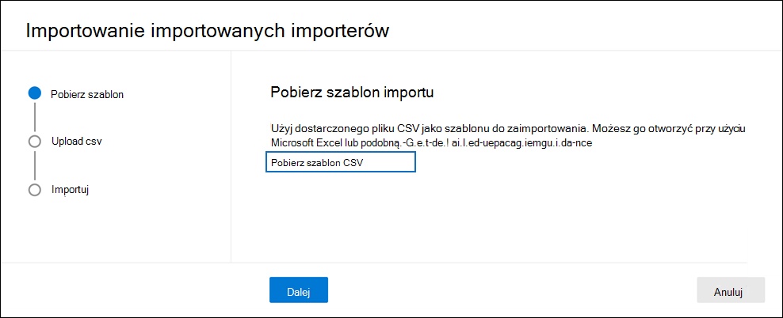

# Importowanie opiekunów do sprawy zbierania elektronicznych materiałów dowodowych (Premium)

W przypadku Zbieranie elektronicznych materiałów dowodowych w Microsoft Purview (Premium), które dotyczą wielu opiekunów, można zaimportować wielu opiekunów jednocześnie przy użyciu pliku CSV zawierającego informacje niezbędne do dodania ich do sprawy. Narzędzie do importowania opiekunów zweryfikuje również plik CSV przed utworzeniem zadania importu. Oznacza to, że można naprawić wszelkie błędy w pliku CSV zamiast czekać, aż zadanie importu zostanie ukończone przed zapoznaniem się z błędami, które uniemożliwiają dodanie opiekuna do sprawy.

## Przed zaimportowaniem opiekunów

- Można zaimportować maksymalnie 1000 opiekunów (wierszy) na plik CSV. Należy pamiętać, że importowanie 1000 opiekunów w tym samym czasie może spowodować błędy przekroczenia limitu czasu, a niektórzy opiekunowie mogą zakończyć się niepowodzeniem importu. Aby to skorygować, powtórz importowanie i należy zaimportować nieudanych opiekunów. Aby uniknąć przekroczenia limitu czasu, zalecamy importowanie 200 opiekunów jednocześnie.

- Dla każdego opiekuna można skojarzyć maksymalnie 500 źródeł danych.  

- Możesz importować tylko opiekunów, którzy są częścią usługi Azure Active Directory organizacji.

- Każdy opiekun musi mieć unikatowy adres e-mail.

- Aby zaimportować nieaktywną skrzynkę pocztową jako opiekun lub skojarzyć nieaktywną skrzynkę pocztową z innym opiekunem, dodaj prefiks "." do adresu e-mail nieaktywnej skrzynki pocztowej (na przykład .sarad@contoso.onmmicrosoft.com).

## Importuj opiekunów

1. Otwórz przypadek zbierania elektronicznych materiałów dowodowych (Premium) i wybierz kartę **Źródła danych** .

2. Kliknij **pozycję Dodaj źródła** >  danych **Importuj opiekunów**.

3. Na stronie **Kreator pobierania szablonu** kliknij pozycję **Pobierz szablon CSV** , aby pobrać plik CSV szablonu opiekuna.

   

4. Dodaj informacje o nadzorze do pliku CSV i zapisz je na komputerze lokalnym. Aby uzyskać szczegółowe informacje na temat wymaganych właściwości w pliku CSV, zobacz sekcję [Plik CSV opiekuna](#custodian-csv-file) .

5. Po przygotowaniu pliku CSV z informacjami o opiekunie wróć do karty **Źródła danych** i kliknij ponownie pozycję **Dodaj źródła** >  danych **Importuj opiekunów**.

6. Na **stronie Kreator przekazywania pliku CSV** kliknij pozycję **Przekaż plik csv** , a następnie przekaż plik CSV zawierający informacje o opiekunie.

   Po przekazaniu pliku CSV kreator importu weryfikuje plik CSV. Jeśli wystąpią błędy weryfikacji, kreator wyświetli baner błędu z linkiem umożliwiającym wyświetlenie błędów.

   

   Informacje o błędzie identyfikują wiersz i kolumnę komórki zawierającej błąd i sugerują akcję korygowania. Musisz naprawić każdy błąd weryfikacji, a następnie ponownie załadować stały plik CSV. Przed utworzeniem zadania opiekuna importu należy pomyślnie zweryfikować plik CSV.

7. Po pomyślnym zweryfikowaniu pliku CSV kliknij przycisk **Dalej** , a następnie kliknij przycisk **Importuj** , aby rozpocząć zadanie importowania.

Po uruchomieniu zadania importowania funkcja eDiscovery (Premium) wykonuje następujące czynności:

- Tworzy zadanie o nazwie **BulkAddCustodian** na karcie **Zadania** sprawy.

- Wykonuje zaawansowane indeksowanie wszystkich źródeł danych dla każdego opiekuna.

- Umieszcza wszystkie źródła danych opiekuna wstrzymane (jeśli właściwość **Is OnHold** w pliku CSV ma ustawioną wartość TRUE)

Po zakończeniu zadania opiekuna importu opiekunowie i skojarzone z nimi źródła danych są dodawane do strony **Źródła danych** sprawy.

## Plik CSV opiekuna

Po pobraniu szablonu opiekuna CSV możesz dodać opiekunów i ich źródła danych w każdym wierszu. Pamiętaj, aby nie zmieniać nazw kolumn w wierszu nagłówka. Użyj typu obciążenia i kolumn lokalizacji obciążenia, aby skojarzyć inne źródła danych z opiekunem.

| Nazwa kolumny|Opis|
|:------- |:------------------------------------------------------------|
|**Kustosz kontakt Poczta**     |Adres e-mail upn opiekuna. Na przykład sarad@contoso.onmicrosoft.com.           |
|**Włączono program Exchange** | Wartość TRUE/FALSE do uwzględnienia lub nieuprawnienia skrzynki pocztowej opiekuna.      |
|**Włączono usługę OneDrive** | Wartość TRUE/FALSE do uwzględnienia lub nieuprawnienia konta OneDrive dla Firm opiekuna. |
|**Jest onhold**        | Wartość TRUE/FALSE wskazująca, czy źródła danych opiekuna mają zostać wstrzymane. 1     |
|**Typ obciążenia1**         |Wartość ciągu wskazująca typ źródła danych do skojarzenia z opiekunem. Możliwe wartości obejmują:  — ExchangeMailbox  — SharePointSite - TeamsMailbox2 - YammerMailbox2. Poprzednie wartości dla tych typów obciążeń uwzględniają wielkość liter. Plik CSV zawiera kolumny dla trzech typów obciążeń i odpowiadających im lokalizacji obciążeń. Możesz dodać łącznie 500 typów obciążeń i lokalizacji.|
|**Lokalizacja obciążenia1**     | W zależności od typu obciążenia będzie to lokalizacja źródła danych. Na przykład adres e-mail skrzynki pocztowej programu Exchange lub adres URL witryny programu SharePoint. |
|||

> [!NOTE]
> 1 Jeśli w przypadku wstrzymania ponad 1000 skrzynek pocztowych lub 100 witryn system automatycznie przeskaluje blokadę zbierania elektronicznych materiałów dowodowych zgodnie z potrzebami. Oznacza to, że system automatycznie dodaje lokalizacje danych do wielu zasad przechowywania, zamiast dodawać je do pojedynczych zasad. Jednak limit 10 000 zasad przechowywania spraw na organizację nadal ma zastosowanie. Aby uzyskać więcej informacji na temat limitów blokady, zobacz [Limity w zakresie zbierania elektronicznych materiałów dowodowych (Premium).](limits-ediscovery20.md#hold-limits)
 
> 2 W przypadku uwzględnienia obciążeń TeamsMailbox i YammerMailbox w pliku CSV witryna grupy (TeamSite i YammerSite) jest domyślnie dodawana automatycznie. Nie musisz oddzielnie określać usług TeamsSite i YammerSite w pliku CSV.

Oto przykład pliku CSV z informacjami o opiekunze:  

|Kustosz kontakt Poczta      | Włączono program Exchange | Włączono usługę OneDrive | Jest onhold | Typ obciążenia1 | Lokalizacja obciążenia1             |
| ----------------- | ---------------- | ---------------- | --------- | -------------- | ------------------------------ |
|robinc@contoso.onmicrosoft.com | TRUE             | TRUE             | TRUE      | Witryna programu SharePoint | https://contoso.sharepoint.com |
|pillarp@contoso.onmicrosoft.com | TRUE             | TRUE             | TRUE      | |  |
|.johnj@contoso.onmicrosoft.com|TRUE|TRUE|TRUE||
|sarad@contoso.onmicrosoft.com|TRUE|TRUE|TRUE|ExchangeMailbox|.saradavis@contoso.onmicrosoft.com
||||||

> [!NOTE]
> Jak wyjaśniono wcześniej, dodaj prefiks "." do adresu UPN nieaktywnej skrzynki pocztowej, aby zaimportować nieaktywną skrzynkę pocztową jako opiekuna lub skojarzyć nieaktywną skrzynkę pocztową z innym opiekunem.
