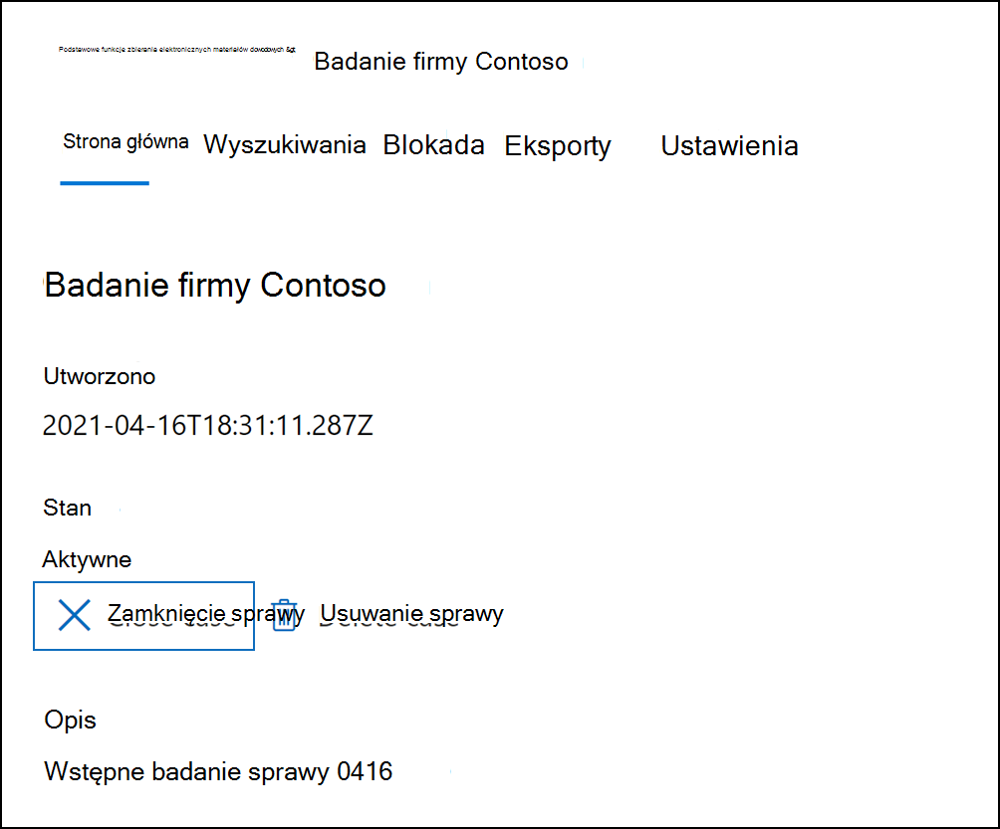

# Zamykanie, ponowne otwieranie i usuwanie sprawy zbierania elektronicznych materiałów dowodowych (standardowa)

W tym artykule opisano sposób zamykania, ponownego otwierania i usuwania przypadków Zbieranie elektronicznych materiałów dowodowych w Microsoft Purview (standard) na platformie Microsoft 365.

## Zamykanie sprawy

Po zakończeniu sprawy prawnej lub dochodzenia obsługiwanego przez sprawę zbierania elektronicznych materiałów dowodowych (Standardowa) możesz zamknąć sprawę. Oto, co się stanie po zamknięciu sprawy:
  
- Jeśli sprawa zawiera jakiekolwiek blokady zbierania elektronicznych materiałów dowodowych, zostaną wyłączone. Po wyłączeniu blokady 30-dniowy okres prolongaty (nazywany *blokadą opóźnienia*) jest stosowany do lokalizacji zawartości, które zostały wstrzymane. Pomaga to zapobiec natychmiastowemu usunięciu zawartości i zapewnia administratorom możliwość wyszukiwania i przywracania zawartości przed jej trwałym usunięciem po upływie okresu wstrzymania opóźnienia. Aby uzyskać więcej informacji, zobacz [Usuwanie lokalizacji zawartości z blokady zbierania elektronicznych materiałów dowodowych](create-ediscovery-holds.md#removing-content-locations-from-an-ediscovery-hold).

- Zamknięcie sprawy powoduje wyłączenie tylko blokad skojarzonych z tą sprawą. Jeśli inne blokady zostaną umieszczone w lokalizacji zawartości (takiej jak blokada postępowania sądowego, zasady przechowywania lub blokada z innego przypadku zbierania elektronicznych materiałów dowodowych (standardowa) te blokady będą nadal utrzymywane.

- Sprawa jest nadal wyświetlana na stronie eDiscovery (Standard) w portal zgodności Microsoft Purview. Szczegóły, blokady, wyszukiwania i członkowie zamkniętej sprawy są zachowywane.

- Sprawę można edytować po jej zamknięciu. Możesz na przykład dodawać lub usuwać członków, tworzyć wyszukiwania i eksportować wyniki wyszukiwania. Podstawowa różnica między aktywnymi i zamkniętymi przypadkami polega na tym, że blokady zbierania elektronicznych materiałów dowodowych są wyłączone po zamknięciu sprawy.

Aby zamknąć przypadek:
  
1. W portalu zgodności kliknij pozycję **eDiscovery** > **eDiscovery (Standard),** aby wyświetlić listę przypadków zbierania elektronicznych materiałów dowodowych (Standard) w organizacji.

2. Kliknij nazwę sprawy, którą chcesz zamknąć.

   

3. Na stronie głównej w obszarze **Stan** kliknij pozycję **Zamknij przypadek**.

    Zostanie wyświetlone ostrzeżenie informujące, że blokady skojarzone ze sprawą zostaną wyłączone.

4. Kliknij przycisk **Tak** , aby zamknąć sprawę.

    Stan na stronie głównej sprawy został zmieniony z **Aktywny** na **Zamykający**.

5. Na stronie **eDiscovery (Standard)** kliknij pozycję **Odśwież** , aby zaktualizować stan zamkniętego przypadku. Ukończenie procesu zamykania może potrwać do 60 minut.

    Po zakończeniu procesu stan sprawy zostanie zmieniony na **Zamknięty** na stronie **Zbierania elektronicznych materiałów dowodowych (Standardowa).**

## Ponowne otwieranie zamkniętej sprawy

Po ponownym otwarciu sprawy wszelkie blokady zbierania elektronicznych materiałów dowodowych, które istniały po zamknięciu sprawy, nie zostaną automatycznie przywrócone. Po ponownym otwarciu sprawy musisz przejść do strony **Blokady** i włączyć poprzednie blokady. Aby włączyć blokadę, wybierz ją, aby wyświetlić stronę wysuwaną, a następnie ustaw przełącznik **Stan** na **wartość Włączone**.
  
1. W portalu zgodności kliknij pozycję **eDiscovery** > **Core** , aby wyświetlić listę przypadków zbierania elektronicznych materiałów dowodowych (Standard) w organizacji.

2. Kliknij nazwę sprawy, która ma zostać ponownie otwarta.

   

3. Na stronie głównej w obszarze **Stan** kliknij pozycję **Otwórz ponownie przypadek**.

    Zostanie wyświetlone ostrzeżenie informujące, że blokady skojarzone ze sprawą po jej zamknięciu nie zostaną włączone automatycznie.

4. Kliknij przycisk **Tak** , aby ponownie otworzyć sprawę.

    Stan strony wysuwanej strony głównej sprawy został zmieniony z **Zamknięty** na **Aktywny**.

5. Na stronie **eDiscovery (Standard)** kliknij pozycję **Odśwież** , aby zaktualizować stan ponownie otwartej sprawy. Ukończenie procesu ponownego otwierania może potrwać do 60 minut. 

    Po zakończeniu procesu stan sprawy zostanie zmieniony na **Aktywny** na stronie **eDiscovery (Standard).**

6. (Opcjonalnie) Aby włączyć wszystkie blokady skojarzone z ponownie otwartą sprawą, przejdź do karty **Blokady** , wybierz blokadę, a następnie zaznacz pole wyboru w obszarze **Stan** na stronie wysuwanego blokady.
  
## Usuwanie sprawy

Możesz również usunąć aktywne i zamknięte przypadki zbierania elektronicznych materiałów dowodowych (standardowa). Po usunięciu sprawy wszystkie wyszukiwania i eksporty w tym przypadku zostaną usunięte, a sprawa zostanie usunięta z listy przypadków na stronie **zbierania elektronicznych materiałów dowodowych (w warstwie Standardowa)** w portalu zgodności. Nie można ponownie otworzyć usuniętego przypadku.

Przed usunięciem sprawy (niezależnie od tego, czy jest ona aktywna, czy zamknięta) należy najpierw usunąć *wszystkie* blokady zbierania elektronicznych materiałów dowodowych skojarzone ze sprawą. Obejmuje to usuwanie blokad ze stanem **Wyłączone**. 

Aby usunąć blokadę zbierania elektronicznych materiałów dowodowych:

1. Przejdź do karty **Blokady** w przypadku, gdy chcesz usunąć.

2. Wybierz blokadę, którą chcesz usunąć.

3. Na stronie wysuwanej kliknij pozycję **Usuń**.

      

Aby usunąć przypadek:

1. W portalu zgodności kliknij pozycję **eDiscovery** > **eDiscovery (Standard),** aby wyświetlić listę przypadków zbierania elektronicznych materiałów dowodowych (Standard) w organizacji.

2. Kliknij nazwę sprawy, którą chcesz usunąć.

3. Na stronie głównej sprawy w obszarze **Stan** kliknij pozycję **Usuń przypadek**.

      

Jeśli przypadek, który próbujesz usunąć, nadal zawiera blokadę zbierania elektronicznych materiałów dowodowych, zostanie wyświetlony komunikat o błędzie. Musisz usunąć wszystkie blokady skojarzone ze sprawą, a następnie spróbować ponownie usunąć sprawę.
