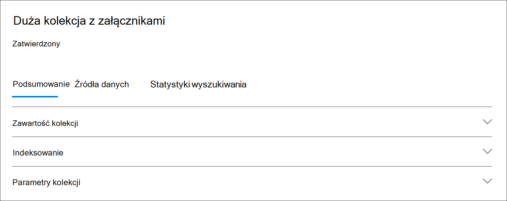

# Statystyki i raporty dotyczące kolekcji w programie Advanced eDiscovery

Po utworzeniu kolekcji roboczej można wyświetlać statystyki dotyczące pobranych elementów, takie jak lokalizacje zawartości zawierające najwięcej elementów, które pasują do kryteriów wyszukiwania, oraz liczba elementów zwróconych przez zapytanie wyszukiwania. Możesz także wyświetlić podgląd podzestawu wyników.

Po zidentyfikowaniu zestawu dokumentów, które chcesz dokładniej zbadać, możesz dodać wyniki wyszukiwania do zestawu recenzji, który będzie zbierany i przetwarzany.

## Statystyki i raporty dla kolekcji wersji roboczych

W tej sekcji opisano statystyki dostępne dla kolekcji wersji roboczych. Statystyki te są dostępne na **karcie Statystyki** wyszukiwania na wysuwanych stronie zbioru roboczego.

### Oszacowania kolekcji

Ta sekcja zawiera graficzne podsumowanie szacowanych elementów zwróconych przez kolekcję. Wskazuje liczbę elementów, które spełniają kryteria wyszukiwania kolekcji. Te informacje dają wyobrażenie o szacowanej liczbie elementów zwróconych przez kolekcję.

- **Szacowane elementy według lokalizacji**: łączna liczba szacowanych elementów zwróconych przez kolekcję. Wyświetlana jest również konkretną liczba elementów znajdujących się w skrzynkach pocztowych i znajdujących się w witrynach.

- **Szacowane lokalizacje z trafieniami**: całkowita liczba lokalizacji zawartości, które zawierają elementy zwrócone przez kolekcję. Wyświetlana jest również konkretną liczba lokalizacji skrzynek pocztowych i witryn.

- **Wielkość danych według lokalizacji (w MB)**: całkowity rozmiar wszystkich szacowanych elementów zwracanych przez kolekcję. Wyświetlany jest również określony rozmiar elementów skrzynki pocztowej i elementów witryny.

### Raport warunków

W tej sekcji są wyświetlane statystyki dotyczące zapytania wyszukiwania kolekcji oraz liczby szacowanych elementów, które pasują do różnych części zapytania wyszukiwania. Za pomocą tych statystyk można przeanalizować liczbę elementów, które pasują do każdego składnika zapytania wyszukiwania. Może to ułatwić uściślić kryteria wyszukiwania kolekcji i w razie potrzeby zawęzić zakres kolekcji.

- **Typ lokalizacji**: typ lokalizacji zawartości, do których ma zastosowanie statystyka kwerendy. Wartość **Exchange wskazuje** lokalizację skrzynki pocztowej, a wartość **SharePoint lokalizacji witryny**.

- **Część**: do części zapytania wyszukiwania mają zastosowanie statystyki. **Pole Podstawowe** wskazuje całe zapytanie wyszukiwania. **Słowo** kluczowe wskazuje statystykę w wierszu dla określonego słowa kluczowego. Jeśli użyjemy listy słów kluczowych, gdy dla zapytania wyszukiwania w kolekcji zostaną uwzględnione statystyki dla każdego składnika zapytania.

- **Warunek**: rzeczywisty składnik (słowo kluczowe lub warunek) zapytania wyszukiwania, które zostało uruchomione dla zbioru roboczego, która zwróciła statystykę wyświetlaną w odpowiednim wierszu.

- **Lokalizacje z trafieniami**: liczba lokalizacji zawartości (określonych w kolumnie Typ lokalizacji), które zawierają elementy zgodne z podstawowym lub kluczowym zapytaniem wymienionym w **kolumnie Warunek**.

- **Elementy**: liczba elementów (z określonej lokalizacji zawartości), które są zgodne z zapytaniem wymienionym w **kolumnie** Warunek. Jak wyjaśniono wcześniej, jeśli element zawiera wiele wystąpień słowa kluczowego, które jest przeszukiwane, jest on liczony tylko raz w tej kolumnie.

- **Rozmiar (MB)**: Całkowity rozmiar wszystkich elementów, które zostały znalezione (w określonej lokalizacji zawartości), które pasują do zapytania wyszukiwania w **kolumnie Warunek** .

### Najlepsze lokalizacje

W tej sekcji są wyświetlane statystyki dotyczące poszczególnych lokalizacji zawartości, z których najwięcej elementów jest zwracanych przez kolekcję.

- Nazwa lokalizacji (adres e-mail skrzynek pocztowych i adres URL witryn).

- Typ lokalizacji (skrzynka pocztowa lub witryna).

- Szacowana liczba elementów w lokalizacji zawartości zwróconej przez kolekcję.

- Całkowity rozmiar szacowanych elementów w poszczególnych lokalizacjach zawartości.

## Statystyki i raporty dla kolekcji zatwierdzonej

W tej sekcji opisano statystyki dostępne po zatwierdzeniu kolekcji do zestawu recenzji, w tym rzeczywistą liczbę elementów dodanych do zestawu recenzji. Statystyki te (oprócz informacji o zestawach ładowania) zawierają informacje historyczne dotyczące zawartości dodanej do sprawy.

Po zatwierdzeniu kolekcji do zestawu recenzji na wysuwanych stronie dla zatwierdzonego połączenia są wyświetlane następujące karty. Każda z tych kart zawiera różne typy informacji o kolekcji.

### Zawartość kolekcji

Ta sekcja karty **Podsumowanie** zawiera statystyki i inne informacje o elementach, które zostały zebrane ze źródeł danych w zbiorze i dodane do zestawu recenzji.

- **Łączna liczba wyodrębniowanych elementów**. Całkowita liczba elementów dodanych do zestawu recenzji. Ta liczba wskazuje sumę elementów nadrzędnych i elementów podrzędnych dodanych do zestawu recenzji.

  > [!TIP]
  > Umieść kursor na słupkach elementów nadrzędnych lub podrzędnych, aby wyświetlić łączną liczbę elementów nadrzędnych lub podrzędnych.

- **Elementy nadrzędne**. Liczba elementów zwróconych przez kolekcję, która została użyta do zebrania elementów dodanych do zestawu recenzji. Ta liczba odpowiada szacowanej liczbie elementów wyświetlanej w sekcji **Parametry kolekcji** (i jest równa). Liczba elementów nadrzędnych, które zostały użyte do zbierania elementów dodanych do zestawu recenzji.
 
   Element nadrzędny może zawierać wiele elementów podrzędnych. Na przykład wiadomość e-mail jest elementem nadrzędnym, jeśli zawiera dołączony plik lub ma załącznik w chmurze. W tym przypadku dołączony plik lub plik docelowy załącznika w chmurze jest uznawany za element podrzędny. Po zatwierdzeniu kolekcji elementy nadrzędne i wszystkie odpowiadające im elementy podrzędne (takie jak dołączone pliki i załączniki w chmurze) są dodawane do zestawu recenzji jako pojedyncze elementy lub pliki.

- **Elementy podrzędne**. Liczba elementów podrzędnych dodanych do zestawu recenzji. Do zestawu recenzji są dodawane tylko elementy podrzędne, które są plikami załączników i załącznikami w chmurze, jako pojedyncze pliki. Inne typy elementów podrzędnych, takie jak podpisy wiadomości e-mail i obrazy. są wyodrębnione z elementu nadrzędnego, a następnie przetwarzane przez optyczne rozpoznawanie znaków (OCR), aby wyodrębnić dowolny tekst z elementu podrzędnego. Tekst wyodrębniony z tych typów elementów nadrzędnych jest następnie dodawany do jego elementu nadrzędnego, aby można go było wyświetlić w zestawie recenzji. Dzięki nie dodaniu elementów podrzędnych do zestawu recenzji jako oddzielnego pliku Advanced eDiscovery usprawnia proces rerecenzowania przez ograniczenie liczby potencjalnie nieistotnych elementów w zestawie recenzji.

- **Elementy unikatowe**. Liczba unikatowych elementów dodanych do zestawu recenzji. Unikatowe elementy są unikatowe w zestawie recenzji. Wszystkie elementy są unikatowe po dodaniu pierwszej kolekcji do nowego zestawu recenzji, ponieważ w zestawie recenzji nie było żadnych poprzednich elementów.

- **Zidentyfikowane zduplikowane elementy**. Liczba elementów z kolekcji, które nie zostały dodane do zestawu recenzji, ponieważ ten sam element już istnieje w zestawie recenzji. Statystyki dotyczące zduplikowanych elementów mogą ułatwić wyjaśnienie różnic między liczbą szacowanych elementów z kolekcji roboczej a rzeczywistą liczbą elementów dodanych do zestawu recenzji.

### Indeksowanie

Sekcja **Indeksowanie** na karcie **Podsumowanie** zatwierdzonego zestawu recenzji zawiera informacje indeksowania dotyczące elementów dodanych do zestawu recenzji.

**Nowe elementy indeksowane**. Liczba elementów, które zostały nowo zindeksowane przed dodaniem ich do zestawu recenzji. Przykładami nowo indeksowanego elementu są elementy podrzędne wyodrębnione z elementu nadrzędnego, a następnie indeksowane przed dodaniem ich do zestawu recenzji. Ponadto elementy, które nie znajdują się w niedobczasowych źródłach danych i lokalizacjach zawartości bez elementów niedobłędnych wymienionych w tym przypadku na karcie Źródła danych, są indeksowane przed dodaniem ich do recenzji. Na przykład nowo indeksowane elementy będą zawierać elementy zebrane z dodatkowych lokalizacji.

**Zaktualizowano elementy indeksowane**. Liczba częściowo indeksowanych elementów, które zostały pomyślnie zindeksowane i dodane do zestawu recenzji. Ta statystyka wskazuje częściowo indeksowane elementy z lokalizacji zawartości, które nie są zindeksowane z lokalizacji  zawartości, z których wynikało tylko częściowe wykorzystanie danych, które zostały pomyślnie zindeksowane podczas zatwierdzonego zbioru recenzji.

**Indeksowanie błędów**. Liczba elementów częściowo indeksowanych, których nie można było zindeksować przed dodaniem ich do zestawu recenzji. Te elementy mogą wymagać rozwiązania problemów z błędami.

### Parametry kolekcji

W tej sekcji są wyświetlane informacje o kolekcjach, które zostały użyte do zbierania elementów dodanych do zestawu recenzji. Ta karta zawiera informacje podobne do informacji na karcie **Statystyka** wyszukiwania. Ta sekcja udostępnia szybkie przyciąganie zapytania wyszukiwania używanego przez kolekcję, lokalizacji zawartości, które były przeszukiwane, oraz szacowanych wyników zbierania. Jak wyjaśniono wcześniej, liczba szacowanych elementów w tej sekcji będzie równa liczbie elementów nadrzędnych widocznych w sekcji **Zawartość kolekcji** .

### Karta Statystyka wyszukiwania

Statystyki wyświetlane na karcie **Statystyka** wyszukiwania są statystykami z ostatniego uruchomienia zbioru roboczego. Obejmuje to oszacowania kolekcji, raporty warunków i najlepsze lokalizacje. Te informacje są zachowywane w kolekcji roboczej do celów informacyjnych i można je porównać z rzeczywistą kolekcją, która została zadedytowana w zestawie recenzji.

## Różnice między wersjami roboczą szacowania kolekcji a rzeczywistą zatwierdzona kolekcją

Po uruchomieniu kolekcji roboczej na karcie Podsumowanie i w sekcji Oszacowania kolekcji karty Statystyka wyszukiwania jest wyświetlana szacowana liczba elementów (i  ich całkowity rozmiar)  spełniających **kryteria kolekcji**. Po zatwierdzeniu wersji roboczej kolekcji do zestawu recenzji rzeczywista liczba elementów dodanych do zestawu recenzji (i ich całkowity rozmiar) często różni się od danych szacunkowych. W większości przypadków do zestawu recenzji jest dodawanych więcej elementów, niż oszacowano w kolekcji roboczej. Na poniższej liście opisano najczęstsze przyczyny tych różnic i porady dotyczące ich identyfikowania:

- **Elementy podrzędne**. Elementy podrzędne (takie jak pliki załączników i załączniki w chmurze), które są wyodrębnione z ich elementów nadrzędnych i dodawane jako pojedyncze pliki. Liczba elementów podrzędnych może zwiększyć liczbę elementów faktycznie dodawanych do zestawu recenzji. Na ogół liczba elementów nadrzędnych zidentyfikowanych w sekcji Zawartość  kolekcji na karcie Podsumowanie  w zatwierdzonej kolekcji powinna być równa liczbie szacowanych elementów z kolekcji roboczej.

- **Duplikowanie elementów**. Elementy z kolekcji roboczej, które już zostały dodane do zestawu recenzji w poprzedniej kolekcji, nie zostaną dodane. Jak wyjaśniono wcześniej, liczba zduplikowanych elementów w kolekcji jest wyświetlana w sekcji **Zawartość** kolekcji na **karcie Podsumowanie** .

- **Opcje konfiguracji kolekcji**. Po zatwierdzeniu kolekcji roboczej do zestawu recenzji możesz dołączyć wątki konwersacji, załączniki w chmurze i wersje dokumentów. Żadne z tych elementów, które zostały dodane do zestawu recenzji, nie są uwzględniane w szacowanych wersjach roboczych kolekcji. Są one identyfikowane i zbierane tylko po zatwierdzeniu kolekcji. Wybranie tych opcji najprawdopodobniej spowoduje zwiększenie liczby elementów dodanych do zestawu recenzji. 

    Na przykład wiele wersji dokumentów SharePoint nie jest uwzględnianych w oszacowaniu dla wersji roboczej kolekcji. Jeśli jednak wybierzesz opcję dołączania wszystkich wersji dokumentu po zatwierdzeniu wersji roboczej kolekcji, rzeczywista liczba (i całkowity rozmiar) elementów dodanych do zestawu recenzji zwiększy się.

    Aby uzyskać więcej informacji o tych opcjach, zobacz [Zatwierdzanie wersji roboczej kolekcji do zestawu recenzji](commit-draft-collection.md#commit-a-draft-collection-to-a-review-set-in-advanced-ediscovery). 

Oto inne przyczyny, dla których szacowane wyniki z wersji roboczej kolekcji mogą różnić się od rzeczywistych wyników zatwierdzonego.

- **Sposób szacowania wyników dla kolekcji wersji roboczych**. Szacowana wartość wyników wyszukiwania zwróconych przez kolekcję roboczą to tylko szacowana (a nie rzeczywista liczba) elementów spełniających kryteria zapytania kolekcji. W celu skompilowania szacowanych elementów poczty e-mail w bazie danych jest wymagana Exchange e-mail lista identyfikatorów wiadomości spełniających kryteria wyszukiwania. Jednak po zatwierdzeniu kolekcji do zestawu recenzji jest ona ponownie uruchomić i rzeczywiste komunikaty są pobierane z bazy danych programu Exchange danych. Dlatego różnice mogą wynikać z tego, jak jest określana szacowana liczba elementów i rzeczywista liczba elementów.

- **Zmiany, które się zdarzają między szacowaniem i zatwierdzaniem wersji roboczych kolekcji**. Po zatwierdzeniu wersji roboczej kolekcji do zestawu recenzji jest ponownie uruchomić wyszukiwanie w celu zebrania najnowszych elementów w indeksie wyszukiwania, które spełniają kryteria wyszukiwania. Być może utworzono, wysłano lub usunięto dodatkowe elementy spełniające kryteria wyszukiwania w czasie między ostatnim uruchomieniem kolekcji roboczej a zatwierdzona zestawem recenzji dla kolekcji roboczej. Ponadto elementy, które były w indeksie wyszukiwania, gdy oszacowano wyniki zbioru roboczego, nie są już dostępne, ponieważ zostały wyczyszone ze źródła danych przed zatwierdzeniem kolekcji. Jednym ze sposobów na ograniczenie tego problemu jest określenie zakresu dat dla kolekcji. Innym sposobem jest umieszczenie w miejscu zawartości lokalizacji zawartości, aby elementy zostały zachowane i nie można ich przeczyścić.

- **Elementy nieindeksowane**. Jeśli wersja robocza kolekcji uwzględniała wyszukiwanie we wszystkich skrzynkach pocztowych usługi Exchange lub wszystkich witrynach SharePoint, do zestawu recenzji będą dodawane tylko elementy nieindeksowane z lokalizacji zawartości zawierających elementy zgodne z kryteriami kolekcji. Innymi słowy, jeśli w skrzynce pocztowej lub witrynie nie zostaną znalezione żadne wyniki, elementy nieindeksowane w tej skrzynce pocztowej lub witrynie nie zostaną dodane do zestawu recenzji. Jednak elementy nieindeksowane ze wszystkich lokalizacji zawartości (nawet tych, które nie zawierają elementów, które pasują do zapytania kolekcji) zostaną uwzględnione w szacowanych wynikach kolekcji.

    Jeśli także wersja robocza zbioru zawierała określone lokalizacje zawartości (co oznacza, że określone skrzynki pocztowe lub witryny określone na  stronie Dodatkowe lokalizacje w Kreatorze wersji roboczych kolekcji), elementy nieindeksowane (które nie są wykluczone przez kryteria kolekcji) z lokalizacji zawartości określonych w wyszukiwaniu będą eksportowane. W tym przypadku szacowana liczba elementów nieindeksowanych i liczba elementów nieindeksowanych dodanych do zestawu recenzji powinna być taka sama.
