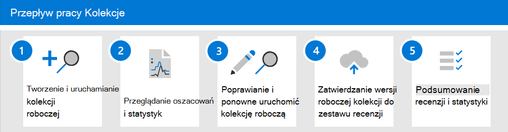

# Dowiedz się więcej o kolekcjach zbierania elektronicznych materiałów dowodowych (Premium)

[!include[Purview banner](../includes/purview-rebrand-banner.md)]

Gdy organizacje mają do czynienia ze zbieraniem komunikacji i treści, które mogą być istotne dla dochodzenia lub potencjalnego sporu sądowego, stoją przed poważnym wyzwaniem w najlepszych okolicznościach. W dzisiejszym nowoczesnym miejscu pracy ilość, różnorodność i szybkość zawartości umożliwia innowacje i pracę zdalną, a jednocześnie rozszerza wymagania i proces zarządzania kolekcjami na potrzeby badań zbierania elektronicznych materiałów dowodowych.

Przepływ pracy kolekcji stwarza istotne wyzwania techniczne związane z wyodrębnianiem zawartości z natywnych lokalizacji i źródeł. Jest to również krytyczny punkt w ocenie i strategii dla typowych scenariuszy sporów sądowych lub dochodzeń. Gdy organizacje zaczynają oceniać dochodzenie, pierwsze zadane pytania dotyczą tego, kto był zaangażowany? Po ustaleniu, kto był zaangażowany, ci opiekunowie mogą szybko zostać zatrzymani, aby zachować odpowiednie treści. Następne pytanie brzmi, co się stało? Aby odpowiedzieć na to drugie podstawowe pytanie dotyczące każdego badania, menedżerowie muszą zwrócić się do danych. Aby szybko ocenić najistotniejszą zawartość pytania o to, co się stało, menedżerowie zaczynają uściślać cel pytania, aby zapewnić, że wyniki zbierania są kompleksowe bez zbyt szerokiego zakresu.

Kolekcje zbierania elektronicznych materiałów dowodowych (Premium) ułatwiają menedżerom zbierania elektronicznych materiałów dowodowych szybkie określanie zakresu wyszukiwania zawartości w wiadomościach e-mail, dokumentach, reakcjach Teams i innej zawartości w Microsoft 365. Kolekcje zapewniają menedżerom oszacowanie zawartości, która może być istotna dla danego przypadku. Dzięki temu menedżerowie mogą podejmować szybkie, świadome decyzje dotyczące rozmiaru i zakresu zawartości istotnej dla danego przypadku. Menedżerowie zbierania elektronicznych materiałów dowodowych mogą utworzyć kolekcję do wyszukiwania źródeł danych opieki (takich jak skrzynki pocztowe i witryny SharePoint) oraz przy użyciu określonych kryteriów wyszukiwania (takich jak słowa kluczowe i zakresy dat), aby szybko zdefiniować zakres ich kolekcji.

Po zdefiniowaniu kolekcji menedżerowie zbierania elektronicznych materiałów dowodowych mogą zapisać kolekcję jako wersję roboczą i uzyskać oszacowania, w tym oszacowania ilości danych, lokalizacje zawartości zawierające wyniki oraz liczbę trafień warunku zapytania wyszukiwania. Te szczegółowe informacje mogą pomóc w poinformowaniu, czy kolekcja powinna zostać poprawiona, aby zawęzić lub rozszerzyć zakres kolekcji przed przejściem na etapy przeglądu i analizy w przepływie pracy zbierania elektronicznych materiałów dowodowych.

Gdy menedżer jest zadowolony z zakresu kolekcji i szacowanej ilości zawartości, która prawdopodobnie będzie odpowiadać, menedżer może dodać lub *zatwierdzić* zawartość do zestawu przeglądów. Podczas zatwierdzania kolekcji w zestawie przeglądów ten menedżer ma również opcje dołączania konwersacji na czacie, załączników w chmurze i wersji dokumentów. Zawartość w kolekcji przechodzi również przez inny poziom przetwarzania podczas pozyskiwania do zestawu przeglądów. a kolekcja zostanie zaktualizowana o końcowe podsumowanie kolekcji. Po dodaniu zawartości do zestawu przeglądów menedżerowie zbierania elektronicznych materiałów dowodowych mogą nadal wykonywać zapytania, grupować i uściślać zawartość, aby ułatwić minimalizowanie i przeglądanie. Ponadto kolekcja jest aktualizowana o informacje i statystyki dotyczące zawartości przekazanej do zestawu przeglądów. Zapewnia to historyczne odwołanie do zawartości w kolekcji.

Wraz z wydaniem kolekcji zbierania elektronicznych materiałów dowodowych (Premium) nazwa karty **Wyszukiwania** została zmieniona na Kolekcje w przypadku zbierania **elektronicznych** materiałów dowodowych (Premium) w portal zgodności Microsoft Purview. Kroki definiowania zakresu i rozmiaru kolekcji są zgodne z tym samym procesem co wyszukiwanie w celu zdefiniowania lokalizacji i warunków. Zapisywanie jako wersja robocza i uzyskiwanie szacunków wersji zapoznawczej umożliwia szybką walidację docelowego zakresu kolekcji przed zatwierdzeniem pełnego wyszukiwania i kolekcji w zestawie przeglądów. Umożliwia to ulepszone zarządzanie zadaniami i iterację docelową w celu zminimalizowania zawartości podczas procesu wyszukiwania i zbierania.

## Przepływ pracy kolekcji

Aby rozpocząć korzystanie z kolekcji w usłudze eDiscovery (Premium), oto podstawowy przepływ pracy i opisy poszczególnych kroków procesu.

1. **Tworzenie i uruchamianie kolekcji roboczej**. Pierwszym krokiem jest utworzenie kolekcji roboczej i zdefiniowanie źródeł danych bez nadzoru i do wyszukiwania. Możesz również przeszukać inne źródła danych, które nie zostały dodane do sprawy. Po dodaniu źródeł danych skonfigurujesz zapytanie wyszukiwania w celu wyszukania w źródłach danych zawartości odpowiedniej dla danego przypadku. Słowa kluczowe, właściwości i warunki umożliwiają tworzenie zapytań wyszukiwania zwracających zawartość, która prawdopodobnie jest najbardziej odpowiednia dla danego przypadku. Aby uzyskać więcej informacji, zobacz [Tworzenie kolekcji roboczej](create-draft-collection.md).

2. **Przejrzyj szacunki i statystyki**. Po utworzeniu kolekcji roboczej i uruchomieniu jej następnym krokiem jest wyświetlenie statystyk kolekcji, aby ułatwić sprawdzenie, czy znaleziono odpowiednią zawartość i lokalizacje zawartości z największą liczbami trafień. Możesz również wyświetlić podgląd przykładu wyników wyszukiwania, aby jeszcze bardziej ułatwić ustalenie, czy zawartość znajduje się w zakresie badania. Aby uzyskać więcej informacji, zobacz [Statystyki i raporty dotyczące kolekcji roboczych](collection-statistics-reports.md#statistics-and-reports-for-draft-collections).

3. **Popraw i uruchom ponownie kolekcję roboczą**. Na podstawie oszacowań i statystyk zwróconych przez kolekcję można edytować kolekcję roboczą, zmieniając wyszukiwane źródła danych i zapytanie wyszukiwania, aby rozwinąć lub zawęzić kolekcję. Możesz zaktualizować i ponownie uruchomić kolekcję roboczą, dopóki nie masz pewności, że kolekcja zawiera zawartość, która jest najbardziej odpowiednia dla Twojego przypadku.

4. **Zatwierdź kolekcję roboczą do zestawu przeglądów**. Gdy kolekcja zwróci zawartość typu istotną dla danego przypadku, możesz zatwierdzić kolekcję w zestawie przeglądów. Po zatwierdzeniu kolekcji możesz dodać do zestawu przeglądów wątki konwersacji, załączniki w chmurze i wersje dokumentów, które mogą być istotne dla danego przypadku.

   Po zatwierdzeniu kolekcji elementy podrzędne, takie jak podpisy poczty e-mail i obrazy, są wyodrębniane z elementu nadrzędnego (takiego jak wiadomość e-mail, wiadomość czatu lub dokument), a następnie przetwarzane przez optyczne rozpoznawanie znaków (OCR) w celu wyodrębnienia dowolnego tekstu z elementu podrzędnego. Tekst wyodrębniony z elementów podrzędnych jest następnie dodawany do elementu nadrzędnego, dzięki czemu można go wyświetlić w zestawie przeglądów. Nie dodając elementów podrzędnych do zestawu przeglądów jako oddzielnego pliku, funkcja eDiscovery (Premium) pomaga ograniczyć liczbę potencjalnie nieistotnych elementów dodanych do zestawu przeglądów. Aby uzyskać więcej informacji na temat sposobu obsługi elementów [podrzędnych, zobacz Statystyki kolekcji i raporty](collection-statistics-reports.md#collection-contents).

   Aby uzyskać więcej informacji, zobacz [Zatwierdzanie kolekcji roboczej w zestawie przeglądów](commit-draft-collection.md).

5. **Przejrzyj podsumowanie kolekcji i statystyki**. Po zatwierdzeniu kolekcji do zestawu przeglądów przechowywane są informacje o kolekcji, takie jak statystyki dotyczące wyodrębnionych elementów, głębokie indeksowanie, zapytanie wyszukiwania używane dla kolekcji i lokalizacje zawartości, z których zostały zebrane elementy. Ponadto nie można edytować ani ponownie uruchamiać zatwierdzonych kolekcji. Można je kopiować lub usuwać tylko. Zachowywanie kolekcji zapewnia historyczny rekord zebranych elementów, które zostały dodane do zestawu przeglądów. Aby uzyskać więcej informacji, zobacz [Statystyki i raporty dotyczące zatwierdzonych kolekcji](collection-statistics-reports.md#statistics-and-reports-for-committed-collections).
