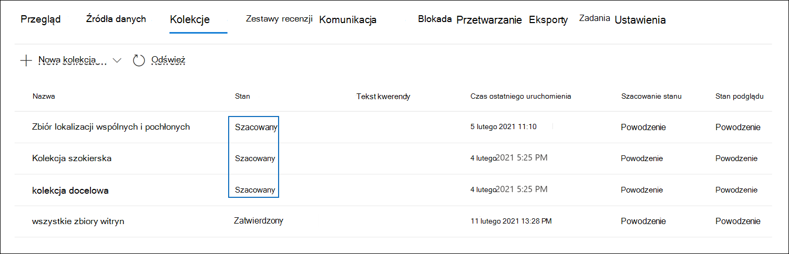

# Zatwierdzanie kolekcji roboczej do zestawu przeglądów w usłudze eDiscovery (Premium)

Jeśli elementy zebrane w kolekcji roboczej są zadowalające i są gotowe do ich analizowania, tagowania i przeglądania, możesz dodać kolekcję do zestawu przeglądów w tym przypadku. Po zatwierdzeniu kolekcji roboczej do zestawu przeglądów zebrane elementy są kopiowane z ich oryginalnej lokalizacji zawartości w Microsoft 365 do zestawu przeglądów. Zestaw przeglądów to bezpieczna, udostępniana przez firmę Microsoft lokalizacja Storage platformy Azure w chmurze firmy Microsoft.

## Zatwierdź kolekcję roboczą w zestawie do przeglądu

1. W portalu zgodności usługi Microsoft Purview otwórz przypadek Microsoft Purview eDiscovery (Premium), a następnie wybierz kartę **Kolekcje**, aby wyświetlić listę kolekcji w tym przypadku.

   

   > [!TIP]
   > Wartość w `Estimated` kolumnie **Stan** identyfikuje kolekcje robocze, które można dodać do zestawu przeglądów. Stan `Committed` wskazuje, że kolekcja została już dodana do zestawu przeglądów.

2. Na stronie **Kolekcje** wybierz kolekcję roboczą, którą chcesz zatwierdzić w zestawie przeglądów.

3. W dolnej części strony wysuwanej wybierz pozycję **ActionsEdit** collection (Akcje > **) KolekcjaEdytuj**.

4. W kreatorze edycji kolekcji kliknij przycisk **Dalej** , dopóki nie zostanie wyświetlona strona **Zapisz wersję roboczą lub zbieranie** .

5. Skonfiguruj następujące ustawienia:

   1. Wybierz pozycję **Zbierz elementy i dodaj, aby przejrzeć zestaw**.

   2. Zdecyduj, czy dodać kolekcję do nowego zestawu przeglądów (który zostanie utworzony po przesłaniu kolekcji), czy dodać ją do istniejącego zestawu przeglądów. Ukończ tę sekcję na podstawie decyzji.

   3. Skonfiguruj dodatkowe ustawienia kolekcji:

      .

       a. **Teams i Yammer komunikatów**: wybierz tę opcję, aby dodać wątki konwersacji do kolekcji, które zawierają elementy czatu zwrócone przez zapytanie wyszukiwania w kolekcji. Oznacza to, że konwersacja czatu zawierająca elementy zgodne z kryteriami wyszukiwania jest rekonstruowana. Umożliwia to przeglądanie elementów czatu w kontekście konwersacji tam iz powrotem. Aby uzyskać więcej informacji, zobacz [Konwersacja wątków w eDiscovery (Premium)](conversation-review-sets.md).

       b. **Załączniki w chmurze**: wybierz tę opcję, aby uwzględnić nowoczesne załączniki lub połączone pliki, gdy wyniki kolekcji zostaną dodane do zestawu przeglądów. Oznacza to, że plik docelowy nowoczesnego załącznika lub połączonego pliku jest dodawany do zestawu przeglądów.

       > [!NOTE]
       > Dwie opcje zbierania kontekstowych Teams i Yammer komunikatów i załączników w chmurze są domyślnie wybierane (i wyszarzone) dla przypadków utworzonych przy użyciu nowego formatu przypadku. Aby uzyskać więcej informacji, zobacz [Używanie nowego formatu przypadku](advanced-ediscovery-new-case-format.md).

       c. **Elementy częściowo indeksowane**: wybierz tę opcję, aby dodać częściowo indeksowane elementy z dodatkowych źródeł danych do zestawu przeglądów. Jeśli kolekcja przeszukała dodatkowe źródła danych (zgodnie z opisem na stronie **Dodatkowe lokalizacje** w kreatorze kolekcji), mogą istnieć częściowo zaindeksowane elementy z tych lokalizacji, które chcesz dodać do zestawu przeglądów. Źródła danych bez nadzoru zazwyczaj nie mają częściowo zaindeksowanych elementów. Dzieje się tak dlatego, że zaawansowany proces indeksowania ponownie indeksuje elementy, gdy źródła danych będące przedmiotem nadzoru i nienadzorowane są dodawane do sprawy. Ponadto dodanie częściowo indeksowanych elementów zwiększy liczbę elementów dodanych do zestawu przeglądów. 
 Po dodaniu częściowo indeksowanych elementów do zestawu przeglądów można zastosować filtr w celu wyświetlenia tych elementów. Aby uzyskać więcej informacji, zobacz [Filtrowanie częściowo indeksowanych elementów](review-set-search.md#filter-partially-indexed-items)

      d. **SharePoint wersji**: wybierz tę opcję, aby włączyć kolekcję wszystkich wersji dokumentu SharePoint według limitów wersji i parametrów wyszukiwania kolekcji. Wybranie tej opcji znacznie zwiększy rozmiar elementów dodanych do zestawu przeglądów. Po dodaniu wersji dokumentu do zestawu przeglądów 

   4. Skonfiguruj ustawienia, aby zdefiniować skalę kolekcji, aby dodać ją do zestawu przeglądów:

      - **Dodaj wszystkie wyniki kolekcji**: wybierz tę opcję, aby dodać wszystkie elementy zgodne z kryteriami wyszukiwania kolekcji do zestawu przeglądów.

      - **Dodaj przykład wyników kolekcji**: wybierz tę opcję, aby dodać przykład wyników kolekcji do zestawu przeglądów zamiast dodawać wszystkie wyniki. Jeśli wybierzesz tę opcję, kliknij pozycję **Edytuj przykładowe parametry** i wybierz jedną z następujących opcji:

         - **Przykład na podstawie ufności**: elementy z kolekcji są dodawane do zestawu przeglądów będą określane przez ustawione parametry statystyczne. Jeśli zwykle używasz poziomu ufności i interwału podczas próbkowania wyników, określ je w polach listy rozwijanej. W przeciwnym razie użyj ustawień domyślnych.

         - **Próbka losowa**: elementy z kolekcji są dodawane do zestawu przeglądów na podstawie losowego wyboru określonej wartości procentowej całkowitej liczby elementów zwróconych przez wyszukiwanie.

6. Na stronie **Przeglądanie kolekcji** możesz przejrzeć ustawienia kolekcji skonfigurowane na poprzedniej stronie. Kliknij przycisk **Edytuj** , jeśli chcesz je zmienić.

7. Kliknij pozycję **Prześlij** , aby utworzyć kolekcję roboczą. Zostanie wyświetlona strona potwierdzająca, że kolekcja została utworzona.

## Co się stanie po zatwierdzeniu kolekcji roboczej

Po zatwierdzeniu kolekcji roboczej do zestawu przeglądów dzieje się następujące rzeczy:

- Jeśli utworzono nowy zestaw przeglądów w celu zatwierdzenia kolekcji, zestaw przeglądów zostanie utworzony i wyświetlony na karcie **Zestawy przeglądów** w tym przypadku. Stan nowego zestawu przeglądów to **Gotowe**. Ta wartość stanu oznacza, że zestaw przeglądów został utworzony. Nie oznacza to, że kolekcja została dodana do zestawu przeglądów. Stan dodawania elementów w kolekcji do zestawu przeglądów jest wyświetlany na **karcie Kolekcje** .

- Zapytanie wyszukiwania kolekcji zostanie uruchomione ponownie. Oznacza to, że rzeczywiste wyniki wyszukiwania skopiowane do zestawu przeglądów mogą być inne niż szacowane wyniki zwrócone podczas ostatniego uruchomienia wyszukiwania kolekcji.

- Wszystkie elementy w wynikach wyszukiwania są kopiowane z oryginalnego źródła danych w usłudze na żywo i kopiowane do bezpiecznej lokalizacji Storage platformy Azure w chmurze firmy Microsoft.

- Szyfrowane SharePoint i OneDrive dokumenty oraz zaszyfrowane pliki dołączone wiadomości e-mail zwracane w wynikach wyszukiwania są odszyfrowywane po zatwierdzeniu kolekcji w zestawie przeglądów. W zestawie przeglądów można przeglądać odszyfrowane pliki i wykonywać względem nieodszyfrowanych plików. Aby uzyskać więcej informacji, zobacz [Odszyfrowywanie w narzędziach Microsoft 365 eDiscovery](ediscovery-decryption.md).

- Funkcja optycznego rozpoznawania znaków (OCR) wyodrębnia tekst z obrazów i zawiera tekst obrazu z zawartością dodaną do zestawu przeglądów. Aby uzyskać więcej informacji, zobacz sekcję [Optyczne rozpoznawanie znaków](#optical-character-recognition) w tym artykule.

- Po pomyślnym zakończeniu zatwierdzania wartość kolumny stanu na karcie **Kolekcje** zostanie zmieniona na `Committed`.

## Optyczne rozpoznawanie znaków

Po zatwierdzeniu kolekcji do zestawu przeglądów funkcja optycznego rozpoznawania znaków (OCR) w funkcji eDiscovery (Premium) automatycznie wyodrębnia tekst z obrazów i zawiera tekst obrazu z zawartością dodaną do zestawu przeglądów. Wyodrębniony tekst można wyświetlić w przeglądarce Tekst wybranego pliku obrazu w zestawie przeglądów. Dzięki temu można przeprowadzać dalsze przeglądy i analizy tekstu na obrazach. Funkcja OCR jest obsługiwana w przypadku luźnych plików, załączników wiadomości e-mail i obrazów osadzonych. Aby uzyskać listę formatów plików obrazów obsługiwanych w usłudze OCR, zobacz [Obsługiwane typy plików w funkcji zbierania elektronicznych materiałów dowodowych (Premium)](supported-filetypes-ediscovery20.md#image).

Musisz włączyć funkcję OCR dla każdego przypadku utworzonego w środowisku eDiscovery (Premium). Aby uzyskać więcej informacji, zobacz [Konfigurowanie ustawień wyszukiwania i analizy](configure-search-and-analytics-settings-in-advanced-ediscovery.md#optical-character-recognition-ocr).
