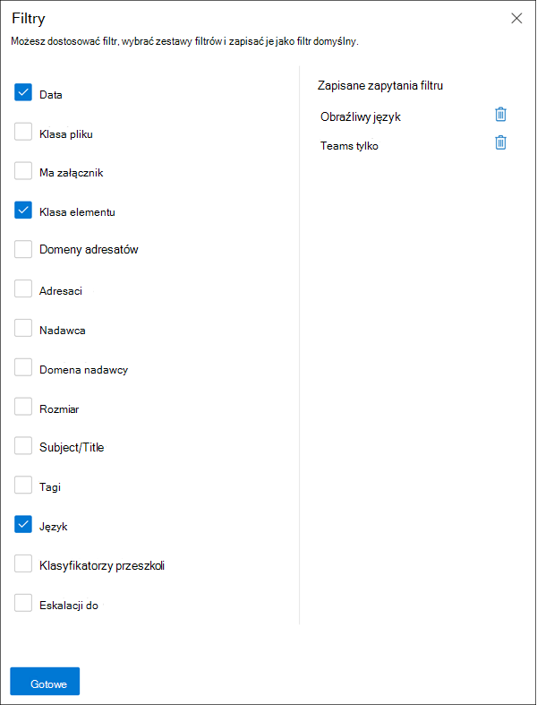

# <a name="investigate-and-remediate-communication-compliance-alerts"></a>Badaj i koryguj alerty dotyczące zgodności w komunikacji

[!include[Purview banner](../includes/purview-rebrand-banner.md)]

Po skonfigurowaniu zasad zgodności komunikacji zaczniesz otrzymywać alerty w portalu zgodności usługi Microsoft Purview w przypadku problemów z komunikatami zgodnych z warunkami zasad. Postępuj zgodnie z instrukcjami przepływu pracy tutaj, aby zbadać i rozwiązać problemy z alertami.

## <a name="investigate-alerts"></a>Badaj alerty

Pierwszym krokiem do zbadania problemów wykrytych przez zasady jest przejrzenie alertów zgodności komunikacji w portalu zgodności usługi Microsoft Purview. W obszarze rozwiązania do zapewniania zgodności z komunikacją istnieje kilka obszarów, które ułatwiają szybkie badanie alertów, w zależności od tego, jak wolisz wyświetlać grupowanie alertów:

- **Strona zasad zgodności komunikacji**: po zalogowaniu się do [portalu zgodności usługi Microsoft Purview](https://compliance.microsoft.com) przy użyciu poświadczeń konta administratora w organizacji Microsoft 365 wybierz pozycję **Zgodność komunikacji**, aby wyświetlić stronę **Zasady** zgodności komunikacji. Na tej stronie są wyświetlane zasady zgodności komunikacji skonfigurowane dla organizacji Microsoft 365 i linki do zalecanych szablonów zasad. Wszystkie wymienione zasady obejmują liczbę alertów, które wymagają przeglądu, liczbę elementów eskalowanych i rozwiązanych, stan zasad oraz datę i godzinę ostatniego skanowania zasad. Wybranie zasad powoduje wyświetlenie wszystkich oczekujących alertów dotyczących dopasowań do zasad, wybranie określonego alertu w celu uruchomienia strony szczegółów zasad i rozpoczęcia akcji korygowania.
- **Alerty**: przejdź do pozycji **Zgodność** >  **komunikacjiAcertyfikacje**, aby wyświetlić alerty z ostatnich 30 dni pogrupowane według dopasowań zasad. Ten widok umożliwia szybkie sprawdzenie, które zasady zgodności komunikacji generują najwięcej alertów uporządkowanych według ważności. Aby rozpocząć akcje korygowania, wybierz zasady skojarzone z alertem, aby uruchomić stronę **Szczegóły zasad** . Na stronie **Szczegóły zasad** możesz przejrzeć podsumowanie działań na stronie **Przegląd** , przejrzeć komunikaty alertów i wykonać je na stronie **Oczekujące** lub przejrzeć historię zamkniętych alertów na stronie **Rozwiązano** .
- **Raporty**: przejdź do pozycji **Zgodność** >  **komunikacjiRaporty**, aby wyświetlić widżety raportu zgodności komunikacji. Każdy widżet zawiera omówienie działań i stanów zgodności komunikacji, w tym dostęp do bardziej szczegółowych informacji na temat dopasowań zasad i akcji korygowania.

### <a name="using-filters"></a>Korzystanie z filtrów

Następnym krokiem jest posortowanie komunikatów, aby ułatwić badanie alertów. Na stronie **Szczegóły zasad** zgodność komunikacji obsługuje filtrowanie wielopoziomowe dla kilku pól komunikatów, aby ułatwić szybkie badanie i przeglądanie komunikatów z dopasowaniami zasad. Filtrowanie jest dostępne dla oczekujących i rozpoznanych elementów dla każdej skonfigurowanej zasady. Możesz skonfigurować zapytania filtru dla zasad lub skonfigurować i zapisać niestandardowe i domyślne zapytania filtrów do użycia w poszczególnych zasadach. Po skonfigurowaniu pól dla filtru zobaczysz pola filtru wyświetlane w górnej części kolejki komunikatów alertów, które można skonfigurować dla określonych wartości filtru.

Dla filtru daty data i godzina zdarzeń są wymienione w uniwersalnym czasie koordynowanym (UTC). Podczas filtrowania komunikatów pod kątem widoków lokalna data/godzina użytkownika żądającego określa wyniki na podstawie konwersji lokalnej daty/godziny użytkownika na utc. Jeśli na przykład użytkownik z regionu Pacyfik (PDT) filtruje raport z 30.08.2021 r. do 31.08.2021 r. o godzinie 00:00, raport zawiera komunikaty z 30.08.2021 r. od 07:00 UTC do 31.08.2021 r. 07:00 UTC. Jeśli ten sam użytkownik był w usa wschodniego czasu letniego (EDT) podczas filtrowania o 00:00, raport zawiera komunikaty z 30.08.2021 04:00 UTC do 31.08.2021 04:00 UTC.

#### <a name="filter-details"></a>Szczegóły filtru

Filtry zgodności komunikacji umożliwiają filtrowanie i sortowanie komunikatów alertów w celu szybszego badania i korygowania akcji. Filtrowanie jest dostępne na kartach **Oczekujące** i **Rozwiązane** dla poszczególnych zasad. Aby zapisać filtr lub zestaw filtrów jako zapisane zapytanie filtru, co najmniej jedna wartość musi być skonfigurowana jako wybór filtru.

W poniższej tabeli przedstawiono szczegóły filtru:

|**Filtr**|**Szczegóły**|
|:-----|:-----|
| **Data** | Data wysłania lub odebrania wiadomości przez użytkownika w organizacji. Aby filtrować dla jednego dnia, wybierz zakres dat rozpoczynający się od dnia, dla który mają zostać wyświetlone wyniki, i zakończ go następnym dniem. Jeśli na przykład chcesz filtrować wyniki dla 20.09.2020 r., wybierz zakres dat filtru 20.09.2020-21.2020.|
| **Klasa plików** | Klasa komunikatu oparta na typie komunikatu, *wiadomości* lub *załączniku*. |
| **Ma załącznik** | Obecność załącznika w wiadomości. |
| **Klasa elementu** | Źródło wiadomości na podstawie typu wiadomości, wiadomości e-mail, czatu zespołowego firmy Microsoft, bloomberga itp. Aby uzyskać więcej informacji na temat typowych typów elementów i klas [komunikatów, zobacz Typy elementów i klasy komunikatów](/office/vba/outlook/concepts/forms/item-types-and-message-classes). |
| **Domeny adresatów** | Domena, do której wysłano komunikat. Ta domena jest zwykle domyślnie domeną subskrypcji Microsoft 365. |
| **Odbiorcy** | Użytkownik, do którego wysłano wiadomość. |
| **Nadawcy** | Osoba, która wysłała wiadomość. |
| **Domena nadawcy** | Domena, która wysłała komunikat. |
| **Rozmiar** | Rozmiar komunikatu w kb. |
| **Temat/tytuł** | Temat wiadomości lub tytuł czatu. |
| **Tagi** | Tagi przypisane do komunikatu, *wątpliwe*, *zgodne* lub *niezgodne*. |
| **Język** | Wykryty język tekstu w wiadomości. Wiadomość jest klasyfikowana zgodnie z językiem większości tekstu wiadomości. Na przykład w przypadku wiadomości zawierającej tekst niemiecki i włoski, ale większość tekstu to niemiecki, wiadomość jest klasyfikowana jako niemiecka (DE). Obsługiwane są następujące języki: chiński (uproszczony — ZH), angielski (EN), francuski (FR), niemiecki (DE), włoski (IT), japoński (JP), portugalski (PT) i hiszpański (ES). Aby na przykład filtrować komunikaty sklasyfikowane jako niemieckie i włoskie, wprowadź ciąg "DE", IT (kody języka 2-cyfrowego) w polu wyszukiwania Filtr języka. Aby wyświetlić wykrytą klasyfikację języka dla wiadomości, wybierz wiadomość, wybierz pozycję Wyświetl szczegóły wiadomości i przewiń do pola EmailDetectedLanguage. |
| **Eskalacja do** | Nazwa użytkownika osoby uwzględniona w akcji eskalacji komunikatu. |
| **Klasyfikatorów** | Nazwa wbudowanych i niestandardowych klasyfikatorów, które mają zastosowanie do komunikatu. Niektóre przykłady to *: ukierunkowane nękanie*, *wulgaryzmy*, *zagrożenie* i inne.

#### <a name="to-configure-a-filter"></a>Aby skonfigurować filtr

1. Zaloguj się do [portalu zgodności usługi Microsoft Purview](https://compliance.microsoft.com) przy użyciu poświadczeń konta administratora w organizacji Microsoft 365.

2. W portalu zgodności usługi Microsoft Purview przejdź do pozycji **Zgodność z komunikacją**.

3. Wybierz kartę **Zasady** , a następnie wybierz zasady do zbadania, kliknij dwukrotnie, aby otworzyć stronę **Zasady** .

4. Na stronie **Zasady** wybierz kartę **Oczekujące** lub **Rozwiązane** , aby wyświetlić elementy do filtrowania.

5. Wybierz kontrolkę **Filtry** , aby otworzyć stronę **Szczegóły filtrów** .

6. Zaznacz co najmniej jedno pole wyboru, aby włączyć filtry dla tych alertów. Możesz wybierać spośród wielu filtrów, takich jak *Data*, *Nadawca*, *Temat/Tytuł*, *Klasyfikatory*, *Język* i inne.

7. Jeśli chcesz zapisać filtr wybrany jako filtr domyślny, wybierz pozycję **Zapisz jako domyślny**. Jeśli chcesz użyć tego filtru jako zapisanego filtru, wybierz pozycję **Gotowe**.

8. Jeśli chcesz zapisać wybrane filtry jako zapytanie filtru, wybierz pozycję **Zapisz** kontrolkę zapytania po skonfigurowaniu co najmniej jednej wartości filtru. Wprowadź nazwę zapytania filtru i wybierz pozycję **Zapisz**. Ten filtr jest dostępny tylko dla tych zasad i znajduje się na liście w sekcji **Zapisane zapytania filtru** na stronie **Szczegóły filtrów** .

    

### <a name="using-near-and-exact-duplicate-analysis"></a>Używanie niemal i dokładnej analizy duplikatów

Zasady zgodności komunikacji automatycznie skanują i grupują wstępnie w pobliżu i dokładnie duplikaty komunikatów bez żadnych dodatkowych kroków konfiguracji. Ten widok pozwala szybko działać na podobnych komunikatach jeden po drugim lub jako grupa, zmniejszając obciążenie związane z badaniem komunikatów dla recenzentów. Po wykryciu duplikatów na pasku narzędzi akcji korygowania są wyświetlane kontrolki **Zbliżone duplikaty** i/lub **Dokładne duplikaty** . Ten widok nie jest dostępny, jeśli nie znaleziono zbliżeń lub dokładnych duplikatów.

#### <a name="to-remediate-duplicates"></a>Aby skorygować duplikaty

1. Zaloguj się do [portalu zgodności usługi Microsoft Purview](https://compliance.microsoft.com) przy użyciu poświadczeń konta administratora w organizacji Microsoft 365.

2. W portalu zgodności usługi Microsoft Purview przejdź do pozycji **Zgodność z komunikacją**.

3. Wybierz kartę **Zasady** , a następnie wybierz zasady do zbadania, kliknij dwukrotnie, aby otworzyć stronę **Zasady** .

4. Na stronie **Zasady** wybierz kartę **Oczekujące** lub Rozwiązane, aby wyświetlić zduplikowane **komunikaty** .

5. Wybierz **kontrolki Near Duplikaty** lub **Dokładne duplikaty** , aby otworzyć stronę szczegółów duplikatów.

6. Wybierz co najmniej jeden komunikat do kontroli akcji korygowania dla tych komunikatów.

7. Wybierz pozycję **Rozwiąż**, **Powiadom**, **Eskaluj** lub **Pobierz** , aby zastosować akcję do wybranych zduplikowanych komunikatów jako filtr domyślny.

8. Po zakończeniu akcji korygowania komunikatów wybierz pozycję **Zamknij** .

    

## <a name="remediate-alerts"></a>Korygowanie alertów

Niezależnie od tego, gdzie zaczniesz przeglądać alerty lub skonfigurowane filtrowanie, następnym krokiem jest podjęcie akcji w celu skorygowania alertu. Rozpocznij korygowanie alertów przy użyciu następującego przepływu pracy na stronach **Zasady** lub **Alerty** .

### <a name="step-1-examine-the-message-basics"></a>Krok 1. Sprawdzanie podstaw wiadomości

 Czasami ze źródła lub tematu jest oczywiste, że komunikat można natychmiast skorygować. Może się okazać, że komunikat jest fałszywy lub niepoprawnie dopasowany do zasad i powinien zostać rozwiązany jako nieprawidłowo sklasyfikowany. Wybierz kontrolkę **Raport jako nieprawidłowo sklasyfikowaną** , aby udostępnić błędnie sklasyfikowaną zawartość firmie Microsoft, natychmiast rozwiązać alert i usunąć go z oczekującej kolejki alertów. Z informacji o źródle lub nadawcy możesz już wiedzieć, w jaki sposób wiadomość powinna być kierowana lub obsługiwana w takich okolicznościach. Rozważ użycie kontrolek **Tag as** lub **Escalate** , aby przypisać tag do odpowiednich komunikatów lub wysłać komunikaty do wyznaczonego recenzenta.


### <a name="step-2-examine-the-message-details"></a>Krok 2. Sprawdzanie szczegółów komunikatu

Po przejrzeniu podstaw wiadomości nadszedł czas, aby otworzyć komunikat w celu zbadania szczegółów i określenia dalszych akcji korygowania. Wybierz komunikat, aby wyświetlić pełny nagłówek wiadomości i informacje o treści. Dostępnych jest kilka różnych opcji i widoków, które pomogą Ci określić właściwy kierunek działania:

- **Załączniki**: ta opcja umożliwia sprawdzenie nowoczesnych załączników zgodnych z warunkami zasad. Zawartość nowoczesnych załączników jest wyodrębniona jako tekst i jest widoczna na pulpicie nawigacyjnym Oczekujące alerty dla zasad. Aby uzyskać więcej informacji, zobacz [dokumentację funkcji zgodności komunikacji](/microsoft-365/compliance/communication-compliance-channels).
- **Źródło**: ten widok jest standardowym widokiem komunikatów powszechnie spotykanym na większości internetowych platform obsługi komunikatów. Informacje nagłówka są sformatowane w normalnym stylu, a treść wiadomości obsługuje pliki graficzne i tekst zawinięty wyrazami. Jeśli optyczne [rozpoznawanie znaków (OCR)](communication-compliance-policies.md#optical-character-recognition-ocr) jest włączone dla zasad, obrazy zawierające tekst drukowany lub odręczny zgodny z warunkami zasad są wyświetlane jako element podrzędny skojarzonego komunikatu w tym widoku.
- **Zwykły tekst**: widok tekstowy wyświetla widok wiadomości tylko w postaci tekstu z numerem wiersza i zawiera wyróżnianie słów kluczowych w komunikatach i załącznikach dla terminów lub słów kluczowych typów informacji poufnych dopasowanych do skojarzonych zasad zgodności komunikacji. Wyróżnianie słów kluczowych może pomóc w szybkim skanowaniu długich wiadomości i załączników pod kątem obszaru zainteresowania. W niektórych przypadkach wyróżniony tekst może znajdować się tylko w załącznikach dla komunikatów pasujących do warunków zasad. Wyróżnianie słów kluczowych nie jest obsługiwane w przypadku terminów identyfikowanych przez wbudowane klasyfikatory przypisane do zasad. Pliki osadzone nie są wyświetlane, a numerowanie wiersza w tym widoku jest przydatne do odwoływania się do istotnych szczegółów wśród wielu recenzentów.
- **Konwersacja (wersja zapoznawcza)**: ten widok jest dostępny dla Microsoft Teams wiadomości czatu i wyświetla maksymalnie pięć komunikatów przed i po wiadomości alertu, aby ułatwić recenzentom wyświetlanie działania w kontekście konwersacji. Ten kontekst ułatwia recenzentom szybkie ocenianie komunikatów i podejmowanie bardziej świadomych decyzji dotyczących rozpoznawania komunikatów. Wyświetlane są dodatki wiadomości w czasie rzeczywistym do konwersacji, w tym wszystkie obrazy wbudowane, emotikony i naklejki dostępne w Teams. Załączniki obrazów lub plików tekstowych do komunikatów nie są wyświetlane. Powiadomienia są automatycznie wyświetlane dla wiadomości, które zostały edytowane, lub wiadomości usuniętych z okna konwersacji. Po rozwiązaniu komunikatu skojarzone komunikaty konwersacyjne nie są zachowywane z rozpoznaną wiadomością. Komunikaty konwersacji są dostępne przez maksymalnie 60 dni od zidentyfikowania komunikatu alertu.
- **Historia użytkownika**: widok historii użytkownika wyświetla wszystkie inne alerty wygenerowane przez dowolne zasady zgodności komunikacji dla użytkownika wysyłającego komunikat.
- **Powiadomienie wykryte wzorzec**: Wiele akcji nękania i zastraszania w czasie i obejmuje powtarzanie wystąpień tego samego zachowania przez użytkownika. Powiadomienie *wykryte przez wzorzec* jest wyświetlane w szczegółach alertu i zwraca uwagę na alert. Wykrywanie wzorców jest oparte na zasadach i ocenia zachowanie w ciągu ostatnich 30 dni, gdy nadawca wysyła co najmniej dwa komunikaty do tego samego adresata. Badacze i recenzenci mogą użyć tego powiadomienia do zidentyfikowania powtarzających się zachowań w celu oceny alertu zgodnie z potrzebami.
- **Tłumaczenie**: ten widok automatycznie konwertuje tekst komunikatu alertu na język skonfigurowany w ustawieniu *Wyświetlany język* w subskrypcji Microsoft 365 dla każdego recenzenta. Widok *Tłumaczenia* pomaga rozszerzyć obsługę śledczą organizacji z użytkownikami wielojęzycznymi i eliminuje potrzebę dodatkowych usług tłumaczenia poza procesem przeglądu zgodności komunikacji. Korzystając z usług tłumaczenia firmy Microsoft, widok *tłumaczenia* można w razie potrzeby włączać i wyłączać oraz obsługiwać szeroką gamę języków. Aby uzyskać pełną listę obsługiwanych języków, zobacz [Microsoft Translator Languages (Języki Microsoft Translator](https://www.microsoft.com/translator/business/languages/)). Języki wymienione na *liście języków Translator* są obsługiwane w widoku *Tłumaczenie*.

### <a name="step-3-decide-on-a-remediation-action"></a>Krok 3. Podejmowanie decyzji o akcji korygowania

Po przejrzeniu szczegółów komunikatu dla alertu możesz wybrać kilka akcji korygowania:

- **Rozwiązanie**: wybranie kontrolki **Rozwiąż** natychmiast spowoduje usunięcie komunikatu z kolejki **Oczekujące alerty** i nie można wykonać żadnych dalszych działań dotyczących komunikatu. Wybierając pozycję **Rozwiąż**, zasadniczo zamknięto alert bez dalszej klasyfikacji. Wszystkie rozpoznane komunikaty są wyświetlane na **karcie Rozwiązane** .
- **Raport jako nieprawidłowo sklasyfikowany**: zawsze można rozpoznać komunikat jako błędnie sklasyfikowany w dowolnym momencie podczas przepływu pracy przeglądania komunikatów. Błędna klasyfikacja oznacza, że alert nie może wykonywać akcji lub że alert został niepoprawnie wygenerowany przez proces alertów i wszystkie klasyfikatory z możliwością trenowania. Rozwiązanie elementu jako błędnie sklasyfikowanego powoduje wysłanie do firmy Microsoft zawartości komunikatu, załączników i tematu komunikatu (w tym metadanych) w celu ulepszenia klasyfikatorów z możliwością trenowania. Dane wysyłane do firmy Microsoft nie zawierają informacji, które mogą identyfikować lub służyć do identyfikowania użytkowników w organizacji. Nie można wykonać dalszych akcji w wiadomości, a wszystkie błędnie sklasyfikowane komunikaty są wyświetlane na **karcie Rozwiązane** .
- **Power Automate (wersja zapoznawcza)**: użyj przepływu Power Automate, aby zautomatyzować zadania procesu dla komunikatu alertu. Domyślnie zgodność komunikacji obejmuje *menedżera powiadamiania, gdy użytkownik ma szablon przepływu alertów zgodności komunikacji* , którego recenzenci mogą używać do automatyzowania procesu powiadomień dla użytkowników z alertami komunikatów. Aby uzyskać więcej informacji na temat tworzenia przepływów Power Automate i zarządzania nimi w zakresie zgodności z komunikacją, zobacz sekcję **Krok 5: Rozważ Power Automate przepływów** w tym artykule.
- **Taguj jako**: otaguj komunikat jako *zgodny*, *niezgodny* lub tak *wątpliwy* , jak odnosi się do zasad i standardów organizacji. Dodawanie tagów i tagowanie komentarzy ułatwia mikrofiltrowanie alertów zasad dla eskalacji lub w ramach innych wewnętrznych procesów przeglądu. Po zakończeniu tagowania możesz również rozwiązać problem z komunikatem, aby przenieść go z oczekującej kolejki przeglądu.
- **Powiadom**: możesz użyć **kontrolki Powiadom** , aby przypisać niestandardowy szablon powiadomienia do alertu i wysłać powiadomienie ostrzegawcze do użytkownika. Wybierz odpowiedni szablon powiadomienia skonfigurowany w obszarze **Ustawienia zgodności komunikacji** i wybierz pozycję **Wyślij** do wiadomości e-mail przypomnienie do użytkownika, który wysłał wiadomość i rozwiązać problem.
- **Eskaluj**: korzystając z **kontrolki Eskaluj** , możesz wybrać, kto jeszcze w organizacji powinien przejrzeć komunikat. Wybierz spośród listy recenzentów skonfigurowanych w zasadach zgodności komunikacji, aby wysłać powiadomienie e-mail z żądaniem dodatkowego przeglądu alertu wiadomości. Wybrany recenzent może użyć linku w powiadomieniu e-mail, aby przejść bezpośrednio do elementów eskalowanych do nich do przeglądu.
- **Eskaluj w celu zbadania**: za pomocą funkcji **Escalate na potrzeby kontroli badania** możesz utworzyć nowy [przypadek zbierania elektronicznych materiałów dowodowych (Premium)](overview-ediscovery-20.md) dla pojedynczego lub wielu komunikatów. Podasz nazwę i notatki dla nowego przypadku, a użytkownik, który wysłał komunikat zgodny z zasadami, jest automatycznie przypisywany jako opiekun sprawy. Nie potrzebujesz żadnych dodatkowych uprawnień do zarządzania sprawą. Utworzenie sprawy nie rozwiązuje ani nie tworzy nowego tagu dla wiadomości. Podczas tworzenia sprawy zbierania elektronicznych materiałów dowodowych (Premium) podczas procesu korygowania można wybrać łącznie 100 komunikatów. Obsługiwane są komunikaty we wszystkich kanałach komunikacyjnych monitorowanych przez zgodność z komunikacją. Możesz na przykład wybrać 50 czatów Microsoft Teams, 25 Exchange Online wiadomości e-mail i 25 Yammer wiadomości po otwarciu nowego przypadku zbierania elektronicznych materiałów dowodowych (Premium) dla użytkownika.
- **Usuń komunikat w Teams**: za pomocą kontrolki **Usuń wiadomość w Teams** możesz zablokować nieodpowiednie wiadomości i zawartość identyfikowaną w alertach z kanałów Microsoft Teams oraz czatów grupowych 1:1 i 1:1. Usunięte komunikaty i zawartość są zastępowane poradą dotyczącą zasad, która wyjaśnia, że jest ona zablokowana, oraz zasadami, które mają zastosowanie do jej usuwania z widoku. Adresaci otrzymują link w poradach dotyczących zasad, aby dowiedzieć się więcej o odpowiednich zasadach i procesie przeglądu. Nadawca otrzymuje poradę dotyczącą zasad dla zablokowanej wiadomości i zawartości, ale może przejrzeć szczegóły zablokowanej wiadomości i zawartości pod kątem kontekstu dotyczącego usunięcia.

    

### <a name="step-4-determine-if-message-details-should-be-archived-outside-of-communication-compliance"></a>Krok 4. Określanie, czy szczegóły komunikatu powinny być archiwizowane poza zgodnością z komunikacją

Szczegóły komunikatów można wyeksportować lub pobrać, jeśli chcesz zarchiwizować komunikaty w osobnym rozwiązaniu magazynu. Wybranie **kontrolki Pobierz** powoduje automatyczne dodanie wybranych komunikatów do pliku .ZIP, który można zapisać w magazynie poza Microsoft 365.

### <a name="step-5-consider-power-automate-flows"></a>Krok 5. Rozważ Power Automate przepływów

[Microsoft Power Automate](/power-automate/getting-started) to usługa przepływu pracy, która automatyzuje akcje w aplikacjach i usługach. Korzystając z przepływów z szablonów lub utworzonych ręcznie, można zautomatyzować typowe zadania skojarzone z tymi aplikacjami i usługami. Po włączeniu przepływów Power Automate w celu zapewnienia zgodności z komunikacją można zautomatyzować ważne zadania dla alertów i użytkowników. Możesz skonfigurować przepływy Power Automate, aby powiadamiać menedżerów, gdy użytkownicy mają alerty zgodności z komunikacją i inne aplikacje.

Klienci z subskrypcjami Microsoft 365, które obejmują zgodność z komunikacją, nie potrzebują dodatkowych licencji Power Automate, aby korzystać z zalecanego domyślnego szablonu Power Automate zgodności z komunikacją. Szablon domyślny można dostosować do obsługi organizacji i obejmuje podstawowe scenariusze zgodności z komunikacją. Jeśli wybierzesz opcję używania funkcji Power Automate w warstwie Premium w tych szablonach, utwórz szablon niestandardowy przy użyciu łącznika usługi Microsoft Purview lub użyjesz szablonów Power Automate dla innych obszarów zgodności w usłudze Microsoft Purview, możesz potrzebować dodatkowych licencji Power Automate.

> [!IMPORTANT]
> Czy podczas testowania przepływów Power Automate otrzymujesz monity o dodatkową walidację licencji? Twoja organizacja mogła jeszcze nie otrzymać aktualizacji usługi dla tej funkcji w wersji zapoznawczej. Aktualizacje są wdrażane, a wszystkie organizacje z subskrypcjami Microsoft 365, które obejmują zgodność z komunikacją, powinny mieć obsługę licencji dla przepływów utworzonych na podstawie zalecanych szablonów Power Automate do 30 października 2020 r.


Następujący szablon Power Automate jest udostępniany klientom w celu obsługi automatyzacji procesów dla alertów zgodności komunikacji:

- **Powiadom menedżera, gdy użytkownik ma alert zgodności z komunikacją**: niektóre organizacje mogą potrzebować natychmiastowego powiadomienia o zarządzaniu, gdy użytkownik ma alert zgodności z komunikacją. Po skonfigurowaniu i wybraniu tego przepływu menedżer przypadku użytkownika otrzymuje wiadomość e-mail z następującymi informacjami o wszystkich alertach:
  - Odpowiednie zasady dotyczące alertu
  - Data/godzina alertu
  - Poziom ważności alertu

#### <a name="create-a-power-automate-flow"></a>Tworzenie przepływu Power Automate

Aby utworzyć przepływ Power Automate na podstawie zalecanego szablonu domyślnego, użyj opcji **Zarządzaj przepływami Power Automate** z **kontrolki Automate** podczas pracy bezpośrednio w alercie. Aby utworzyć przepływ Power Automate przy użyciu funkcji **Zarządzanie przepływami Power Automate**, musisz być członkiem co najmniej jednej grupy ról zgodności komunikacji.

Wykonaj następujące kroki, aby utworzyć przepływ Power Automate na podstawie szablonu domyślnego:

1. W [portalu zgodności usługi Microsoft Purview](https://compliance.microsoft.com) przejdź do pozycji **Zgodność z komunikacjąZasady** >  i wybierz zasady z alertem, który chcesz przejrzeć.
2. Z poziomu zasad wybierz kartę **Oczekujące** i wybierz oczekujący alert.
3. Wybierz **pozycję Power Automate** z menu akcji alertu.
4. Na stronie **Power Automate** wybierz szablon domyślny z sekcji **Szablony zgodności komunikacji, które mogą ci się podobać** na stronie.
5. Przepływ wyświetli listę połączeń osadzonych wymaganych dla przepływu i będzie wyświetlany, jeśli są dostępne stany połączenia. W razie potrzeby zaktualizuj wszystkie połączenia, które nie są wyświetlane jako dostępne. Wybierz pozycję **Kontynuuj**.
6. Domyślnie zalecane przepływy są wstępnie skonfigurowane z zalecanymi polami zgodności komunikacji i Microsoft 365 danych usługi wymaganymi do wykonania przydzielonego zadania dla przepływu. W razie potrzeby dostosuj składniki przepływu przy użyciu kontrolki **Pokaż opcje zaawansowane** i konfigurując dostępne właściwości składnika przepływu.
7. W razie potrzeby dodaj wszelkie dodatkowe kroki do przepływu, wybierając przycisk **Nowy krok** . W większości przypadków ta zmiana nie powinna być potrzebna w przypadku zalecanych szablonów domyślnych.
8. Wybierz pozycję **Zapisz wersję roboczą** , aby zapisać przepływ do dalszej konfiguracji później, lub wybierz pozycję **Zapisz** , aby ukończyć konfigurację przepływu.
9. Wybierz pozycję **Zamknij**, aby powrócić do strony przepływu Power Automate. Nowy szablon zostanie wyświetlony jako przepływ na karcie **Moje przepływy** i będzie automatycznie dostępny w kontrolce Power Automate dla użytkownika, który utworzył przepływ podczas pracy z alertami zgodności komunikacji.

#### <a name="share-a-power-automate-flow"></a>Udostępnianie przepływu Power Automate

Domyślnie przepływy Power Automate utworzone przez użytkownika są dostępne tylko dla tego użytkownika. Aby inni użytkownicy zgodności komunikacji mieli dostęp i korzystali z przepływu, przepływ musi być współużytkowany przez twórcę przepływu. Aby udostępnić przepływ, użyjesz kontrolki **Power Automate** podczas pracy bezpośrednio w alercie.

Aby udostępnić przepływ Power Automate, musisz być członkiem co najmniej jednej grupy ról zgodności komunikacji.
Wykonaj następujące kroki, aby udostępnić przepływ Power Automate:

1. W [portalu zgodności usługi Microsoft Purview](https://compliance.microsoft.com) przejdź do pozycji **Zgodność z komunikacjąZasady** >  i wybierz zasady z alertem, który chcesz przejrzeć.
2. Z poziomu zasad wybierz kartę **Oczekujące** i wybierz oczekujący alert.
3. Wybierz **pozycję Power Automate** z menu akcji alertu.
4. Na stronie **przepływów Power Automate** wybierz kartę **Moje przepływy** lub **Przepływy zespołu**.
5. Wybierz przepływ do udostępnienia, a następnie wybierz pozycję **Udostępnij** z menu opcji przepływu.
6. Na stronie udostępniania przepływu wprowadź nazwę użytkownika lub grupy, którą chcesz dodać jako właściciela przepływu.
7. W oknie dialogowym **Użyte połączenie** wybierz przycisk **OK** , aby potwierdzić, że dodany użytkownik lub grupa będzie mieć pełny dostęp do przepływu.

#### <a name="edit-a-power-automate-flow"></a>Edytowanie przepływu Power Automate

Jeśli chcesz edytować przepływ, użyjesz kontrolki **Power Automate** podczas pracy bezpośrednio w alercie. Aby edytować przepływ Power Automate, musisz być członkiem co najmniej jednej grupy ról zgodności komunikacji.

Wykonaj następujące kroki, aby edytować przepływ Power Automate:

1. W [portalu zgodności usługi Microsoft Purview](https://compliance.microsoft.com) przejdź do pozycji **Zgodność z komunikacjąZasady** >  i wybierz zasady z alertem, który chcesz przejrzeć.
2. Z poziomu zasad wybierz kartę **Oczekujące** i wybierz oczekujący alert.
3. Wybierz **pozycję Power Automate** z menu akcji alertu.
4. Na stronie **przepływów Power Automate** wybierz pozycję Przepływ do edycji. Wybierz pozycję **Edytuj** z menu sterowania przepływem.
5. Wybierz **wielokropek** >  **Ustawienia** aby zmienić ustawienie składnika przepływu lub **wielokropekUsuj** > , aby usunąć składnik przepływu.
6. Wybierz pozycję **Zapisz** , a następnie **zamknij** , aby zakończyć edytowanie przepływu.

#### <a name="delete-a-power-automate-flow"></a>Usuwanie przepływu Power Automate

Jeśli musisz usunąć przepływ, użyjesz kontrolki **Power Automate** podczas pracy bezpośrednio w alercie. Aby usunąć przepływ Power Automate, musisz być członkiem co najmniej jednej grupy ról zgodności komunikacji.

Wykonaj następujące kroki, aby usunąć przepływ Power Automate:

1. W [portalu zgodności usługi Microsoft Purview](https://compliance.microsoft.com) przejdź do pozycji **Zgodność z komunikacjąZasady** >  i wybierz zasady z alertem, który chcesz przejrzeć.
2. Z poziomu zasad wybierz kartę **Oczekujące** i wybierz oczekujący alert.
3. Wybierz **pozycję Power Automate** z menu akcji alertu.
4. Na stronie **przepływów Power Automate** wybierz pozycję przepływ do usunięcia. Wybierz pozycję **Usuń** z menu sterowania przepływem.
5. W oknie dialogowym potwierdzenia usunięcia wybierz pozycję **Usuń** , aby usunąć przepływ, lub wybierz pozycję **Anuluj** , aby zamknąć akcję usuwania.

### <a name="step-6-consider-creating-notice-templates"></a>Krok 6. Rozważ utworzenie szablonów powiadomień

Szablony powiadomień można tworzyć, jeśli chcesz wysłać użytkownikom powiadomienie o przypomnieniu e-mail dotyczące dopasowań zasad w ramach procesu rozwiązywania problemów. Powiadomienia mogą być wysyłane tylko na adres e-mail użytkownika skojarzony z dopasowaniem zasad, który wygenerował określony alert na potrzeby korygowania. Podczas wybierania szablonu powiadomienia, który ma zostać zastosowany do naruszenia zasad w ramach przepływu pracy korygowania, można zaakceptować wartości pól zdefiniowane w szablonie lub zastąpić pola zgodnie z potrzebami.

Szablony powiadomień to niestandardowe szablony wiadomości e-mail, w których można zdefiniować następujące pola komunikatów w obszarze **Ustawienia zgodności komunikacji** :

|**Pole**|**Wymagany**| **Szczegóły** |
|:-----|:-----|:-----|
|**Nazwa szablonu** | Tak | Przyjazna nazwa szablonu powiadomienia, który wybierzesz w przepływie pracy powiadamiania podczas korygowania, obsługuje znaki tekstowe. |
| **Adres nadawcy** | Tak | Adres co najmniej jednego użytkownika lub grupy, który wysyła komunikat do użytkownika z dopasowaniem zasad wybranym w usłudze Active Directory dla subskrypcji. |
| **Adresy CC i BCC** | Nie | Opcjonalnie użytkownicy lub grupy, którzy mają być powiadamiani o dopasowaniu zasad, wybrani z usługi Active Directory dla subskrypcji. |
| **Temat** | Tak | Informacje wyświetlane w wierszu tematu wiadomości obsługują znaki tekstowe. |
| **Treść komunikatu** | Tak | Informacje wyświetlane w treści wiadomości obsługują wartości tekstowe lub HTML. |

### <a name="html-for-notices"></a>KOD HTML dla powiadomień

Jeśli chcesz utworzyć więcej niż prostą tekstową wiadomość e-mail dla powiadomień, możesz utworzyć bardziej szczegółową wiadomość przy użyciu kodu HTML w polu treść wiadomości szablonu powiadomienia. Poniższy przykład zawiera format treści wiadomości dla podstawowego szablonu powiadomień e-mail opartego na języku HTML:

```HTML
<!DOCTYPE html>
<html>
    <body>
        <h2>Action Required: Contoso Employee Code of Conduct Policy Training</h2>
        <p>A recent message you've sent has generated a policy alert for the Contoso Employee <a href='https://www.contoso.com'>Code of Conduct Policy</a>.</p>
        <p>You are required to attend the Contoso Employee Code of Conduct <a href='https://www.contoso.com'>training</a> within the next 14 days. Please contact <a href='mailto:hr@contoso.com'>Human Resources</a> with any questions about this training request.</p>
        <p>Thank you,</p>
        <p><em>Human Resources</em></p>
    </body>
</html>
```

> [!NOTE]
> Implementacja atrybutu HREF HTML w szablonach powiadomień dotyczących zgodności komunikacji obsługuje obecnie tylko pojedyncze cudzysłowy zamiast podwójnego cudzysłowu dla odwołań do adresów URL.

## <a name="unresolve-messages-preview"></a>Nierozwiązane komunikaty (wersja zapoznawcza)

Po rozwiązaniu komunikatów są one usuwane z widoku karty **Oczekujące** i wyświetlane w widoku karty **Rozwiązane** . Akcje badania i korygowania nie są dostępne dla komunikatów w widoku *Rozwiązano* . Mogą jednak wystąpić sytuacje, w których należy podjąć dodatkowe działania w przypadku komunikatu, który został omyłkowo rozwiązany lub który wymaga dalszego zbadania po początkowym rozwiązaniu. Możesz użyć nierozpoznanej funkcji poleceń, aby przenieść jeden lub więcej komunikatów z widoku *Rozwiązano* z powrotem do widoku *Oczekujące* .

Aby rozwiązać komunikaty, wykonaj następujące kroki:

1. Zaloguj się do [portalu zgodności usługi Microsoft Purview](https://compliance.microsoft.com) przy użyciu poświadczeń użytkownika przypisanego do grup ról *Analityk zgodności komunikacji* lub *Badacz zgodności komunikacji* w organizacji Microsoft 365.
2. W portalu zgodności usługi Microsoft Purview przejdź do pozycji **Zgodność z komunikacją**.
3. Wybierz kartę **Zasady** , a następnie wybierz zasady zawierające rozwiązany komunikat alertu, kliknij dwukrotnie, aby otworzyć stronę **Zasady** .
4. Na stronie **Zasady** wybierz kartę **Rozwiązano** .
5. Na **rozwiązanej karcie** wybierz co najmniej jeden komunikat, aby wrócić do *oczekującego*.
6. Na pasku poleceń wybierz pozycję **Nierozpoznaj**.
7. W okienku **Nierozpoznany element** dodaj wszelkie komentarze dotyczące nierozwiązanej akcji i wybierz pozycję **Zapisz** , aby przenieść element z powrotem do *pozycji Oczekujące*.
8. Wybierz kartę **Oczekujące** , aby sprawdzić, czy są wyświetlane wybrane elementy.
