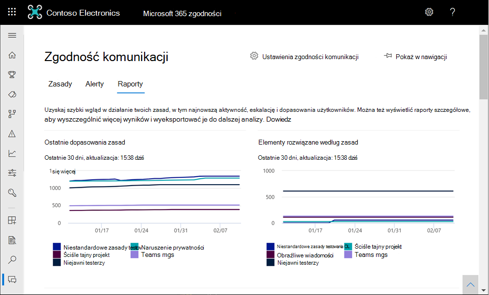
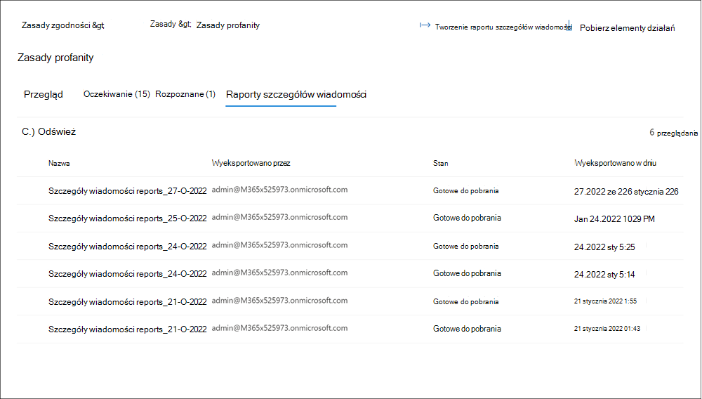

# <a name="use-communication-compliance-reports-and-audits"></a>Używanie raportów i inspekcji zgodności komunikacji

[!include[Purview banner](../includes/purview-rebrand-banner.md)]

## <a name="reports"></a>Raporty

Nowy pulpit **nawigacyjny Raporty** to centralna lokalizacja do wyświetlania wszystkich raportów zgodności komunikacji. Widżety raportów zapewniają szybki wgląd w szczegółowe informacje najczęściej potrzebne do ogólnej oceny stanu działań związanych ze zgodnością komunikacji. Informacji zawartych w widżetach raportu nie można eksportować. Szczegółowe raporty zawierają szczegółowe informacje związane z określonymi obszarami zgodności komunikacji i oferują możliwość filtrowania, grupowania, sortowania i eksportowania informacji podczas przeglądania. 

Dla filtru zakresu dat data i godzina dla zdarzeń są wymienione w uniwersalnym czasie koordynowanym (UTC). Podczas filtrowania komunikatów dla raportów lokalna data/godzina użytkownika żądającego określa wyniki na podstawie konwersji lokalnej daty/godziny użytkownika na utc. Jeśli na przykład użytkownik z regionu Pacyfik (PDT) filtruje raport z 30.08.2021 r. do 31.08.2021 r. o godzinie 00:00, raport zawiera komunikaty z 30.08.2021 r. od 07:00 UTC do 31.08.2021 r. 07:00 UTC. Jeśli ten sam użytkownik był w usa wschodniego czasu letniego (EDT) podczas filtrowania o 00:00, raport zawiera komunikaty z 30.08.2021 04:00 UTC do 31.08.2021 04:00 UTC.



**Pulpit nawigacyjny Raporty** zawiera następujące widżety raportów i szczegółowe linki do raportów:

### <a name="report-widgets"></a>Widżety raportów

- **Ostatnie dopasowania zasad**: wyświetla liczbę dopasowań według aktywnych zasad w czasie.
- **Rozwiązane elementy według zasad**: wyświetla liczbę alertów dopasowania zasad rozpoznawanych przez zasady w czasie.
- **Użytkownicy z większością dopasowań zasad**: wyświetla użytkowników (lub zanonimizowane nazwy użytkowników) i liczbę dopasowań zasad dla danego okresu.
- **Zasady z większością dopasowań**: wyświetla zasady i liczbę dopasowań dla danego okresu, w rankingu od najwyższego do najniższego w przypadku dopasowań.
- **Eskalacje według zasad**: wyświetla liczbę eskalacji na zasady w danym czasie.

### <a name="detailed-reports"></a>Szczegółowe raporty

Użyj opcji *Eksportuj* , aby utworzyć plik .csv zawierający szczegóły raportu dla dowolnego szczegółowego raportu. Opcja *Eksportuj* raport obsługuje pobieranie plików o rozmiarze do 3 MB.

- **Ustawienia zasad i stan**: szczegółowe omówienie konfiguracji i ustawień zasad, a także ogólny stan poszczególnych zasad (dopasowań i akcji) w komunikatach. Zawiera informacje o zasadach oraz sposób, w jaki zasady są skojarzone z użytkownikami i grupami, lokalizacjami, wartościami procentowymi przeglądania, recenzentami, stanem oraz datą ostatniej modyfikacji zasad. Użyj opcji *Eksportuj* , aby utworzyć plik .csv zawierający szczegóły raportu.
- **Elementy i akcje na zasady**: przejrzyj i wyeksportuj pasujące elementy oraz akcje korygowania dla zasad. Zawiera informacje o zasadach i sposób, w jaki zasady są skojarzone z:

    - Elementy dopasowane
    - Elementy eskalowane
    - Rozwiązane elementy
    - Oznakowane jako zgodne
    - Oznaczone jako niezgodne
    - Oznaczone jako wątpliwe
    - Elementy oczekujące na przegląd
    - Użytkownik powiadomiony
    - Utworzono przypadek

- **Element i akcje na lokalizację**: przeglądanie i eksportowanie pasujących elementów oraz akcji korygowania dla lokalizacji platformy Microsoft 365. Zawiera informacje o tym, jak platformy obciążeń są skojarzone z:

    - Elementy dopasowane
    - Elementy eskalowane
    - Rozwiązane elementy
    - Oznakowane jako zgodne
    - Oznaczone jako niezgodne
    - Oznaczone jako wątpliwe
    - Elementy oczekujące na przegląd
    - Użytkownik powiadomiony
    - Utworzono przypadek

- **Działanie według użytkownika**: przejrzyj i wyeksportuj pasujące elementy oraz akcje korygowania na użytkownika. Zawiera informacje o sposobie, w jaki użytkownicy są kojarzeni z:

    - Elementy dopasowane
    - Elementy eskalowane
    - Rozwiązane elementy
    - Oznakowane jako zgodne
    - Oznaczone jako niezgodne
    - Oznaczone jako wątpliwe
    - Elementy oczekujące na przegląd
    - Użytkownik powiadomiony
    - Utworzono przypadek

- **Typ informacji poufnych na lokalizację** (wersja zapoznawcza): przejrzyj i wyeksportuj informacje o wykrywaniu typów informacji poufnych i skojarzonych źródłach w zasadach zgodności komunikacji. Obejmuje całkowitą sumę i określony podział wystąpień typów informacji poufnych w źródłach skonfigurowanych w organizacji. Wartości dla każdego źródła innej firmy są wyświetlane w oddzielnych kolumnach w pliku .csv. Przykłady:

    - **Wiadomość e-mail**: wykryto typy informacji poufnych w wiadomościach e-mail programu Exchange.
    - **Teams**: typy informacji poufnych wykryte w kanałach usługi Microsoft Teams i wiadomościach czatu.
    - **Skype dla firm**: wykryto typy informacji poufnych w komunikacji programu Skype dla firm.
    - **Yammer**: typy informacji poufnych wykryte w skrzynkach odbiorczych usługi Yammer, wpisach, czatach i odpowiedziach.
    - **Źródła innych firm**: wykryto poufne typy informacji dla działań skojarzonych z łącznikami innych firm skonfigurowanymi w organizacji. Aby wyświetlić podział źródeł innych firm dla określonego typu informacji poufnych w raporcie, umieść wskaźnik myszy nad wartością typu informacji poufnych w kolumnie źródła innej firmy.
    - **Inne**: Typy informacji poufnych używane do wewnętrznego przetwarzania systemu. Wybranie lub usunięcie zaznaczenia tego źródła raportu nie wpłynie na żadne wartości.

### <a name="message-details-report-preview"></a>Raport szczegółów komunikatu (wersja zapoznawcza)

Utwórz niestandardowe raporty i przejrzyj szczegóły komunikatów zawartych w określonych zasadach na karcie **Zasady** . Te raporty mogą służyć do wszystkich przeglądów komunikatów i tworzenia migawki raportu dla stanu komunikatów w dostosowywalnym okresie. Po utworzeniu raportu możesz wyświetlić i pobrać raport szczegółów jako plik .csv na karcie **Raporty szczegółów wiadomości** .



Aby utworzyć nowy raport szczegółów komunikatu, wykonaj następujące kroki:

1. Zaloguj się do portalu zgodności usługi Microsoft Purview przy użyciu konta należącego do grupy ról *Badacze zgodności komunikacji* .
2. Przejdź do karty **Zasady** , wybierz zasady, a następnie wybierz pozycję **Utwórz raport szczegółów komunikatu**.
3. W okienku **Tworzenie raportu szczegółów komunikatu** wprowadź nazwę raportu w polu **Nazwa raportu** .
4. W **obszarze Wybierz zakres dat** wybierz *datę rozpoczęcia* i *datę zakończenia* raportu.
5. Wybierz pozycję **Utwórz**.
6. Zostanie wyświetlone potwierdzenie utworzenia raportu.

W zależności od liczby elementów w raporcie może upłynąć kilka minut do godzin, zanim raport będzie gotowy do pobrania. Postęp można sprawdzić na karcie Raporty szczegółów komunikatów. Stan raportu to *W toku* lub *Gotowe do pobrania*. Jednocześnie może być przetwarzanych maksymalnie 15 oddzielnych raportów. Aby pobrać raport, wybierz raport w stanie *Gotowe do pobrania* i wybierz pozycję **Pobierz raport**.

> [!NOTE]
> Jeśli wybrany okres nie zwraca żadnych wyników komunikatu w raporcie, nie było żadnych komunikatów dla wybranego okresu. Raport będzie pusty.

Raporty szczegółów komunikatów zawierają następujące informacje dla każdego elementu komunikatu w zasadach:

- **Identyfikator dopasowania**: unikatowy identyfikator komunikatu w zasadach.
- **Nadawca**: nadawca wiadomości.
- **Adresaci**: adresaci dołączone do wiadomości.
- **Data wysłania**: data wysłania wiadomości.
- **Data dopasowania**: data dopasowania komunikatu do warunków zasad.
- **Temat**: temat wiadomości.
- **Zawiera załączniki**: stan załączników wiadomości. Wartości to Tak lub Nie.
- **Nazwa zasad**: nazwa zasad skojarzonych z komunikatem. Ta wartość będzie taka sama dla wszystkich komunikatów w raporcie.
- **Stan elementu**: stan elementu komunikatu w zasadach. Wartości są oczekujące lub rozwiązane.
- **Tagi**: tagi przypisane do wiadomości. Wartości są wątpliwe, zgodne lub niezgodne.
- **Dopasowania słów kluczowych**: dopasowanie słowa kluczowego dla komunikatu.
- **Recenzenci**: recenzenci przypisani do wiadomości.
- **Oczekujące dla (dni)**: liczba dni, w których komunikat jest w stanie oczekiwania. W przypadku rozpoznanych komunikatów wartość to 0.
- **Komentarz do rozwiązania**: komentarze do wiadomości wprowadzone po rozwiązaniu.
- **Data rozwiązania**: data i godzina usunięcia komunikatu.
- **Ostatnia aktualizacja:** nazwa użytkownika ostatniego aktualizującego.
- **Ostatnia aktualizacja**: data i godzina ostatniej aktualizacji komunikatu.
- **Historia komentarzy**: lista wszystkich komentarzy dla alertu wiadomości, w tym autor komentarza i data/godzina komentarza.

## <a name="audit"></a>Inspekcji

W niektórych przypadkach należy przekazać informacje audytorom regulacyjnym lub zgodności, aby udowodnić nadzór nad działaniami użytkowników i komunikacją. Te informacje mogą być podsumowaniem wszystkich działań skojarzonych ze zdefiniowanymi zasadami organizacyjnymi lub w dowolnym momencie zmiany zasad zgodności komunikacji. Zasady zgodności komunikacji mają wbudowane ścieżki inspekcji umożliwiające pełną gotowość do wewnętrznych lub zewnętrznych inspekcji. Szczegółowe historie inspekcji każdej akcji tworzenia, edycji i usuwania są przechwytywane przez zasady komunikacji w celu dostarczenia dowodu procedur nadzoru.

> [!IMPORTANT]
> Aby zdarzenia zgodności z komunikacją były rejestrowane, należy włączyć inspekcję dla organizacji. Aby włączyć inspekcję, zobacz [Włączanie dziennika inspekcji](communication-compliance-configure.md#step-2-required-enable-the-audit-log). Gdy działania wyzwalają zdarzenia przechwycone w dzienniku inspekcji platformy Microsoft 365, wyświetlenie tych zdarzeń w zasadach zgodności komunikacji może potrwać do 48 godzin.

Aby wyświetlić działania aktualizacji zasad zgodności komunikacji, wybierz kontrolkę **Eksportuj aktualizacje zasad** na stronie głównej dla wszystkich zasad. Aby eksportować działania aktualizacji, musisz mieć przypisane role *administratora globalnego* lub *administratora zgodności komunikacji* . Ta akcja generuje plik inspekcji w formacie .csv, który zawiera następujące informacje:

|**Pole**|**Szczegóły**|
|:-----|:-----|
| **Creationdate** | Data wykonania działania aktualizacji w zasadach. |
| **Identyfikatory użytkowników** | Użytkownik, który wykonał działanie aktualizacji w zasadach. |
| **Operacje** | Operacje aktualizacji wykonywane na zasadach. |
| **AuditData** | To pole jest głównym źródłem danych dla wszystkich działań związanych z aktualizacją zasad. Wszystkie działania aktualizacji są rejestrowane i oddzielone ogranicznikami przecinków. |

Aby wyświetlić działania przeglądu zgodności komunikacji dla zasad, wybierz kontrolkę **Eksportuj działania przeglądu** na stronie **Przegląd** dla określonych zasad. Aby eksportować działania przeglądu, musisz mieć przypisane role *administratora globalnego* lub *administratora zgodności komunikacji* . Ta akcja generuje plik inspekcji w formacie .csv, który zawiera następujące informacje:

|**Pole**|**Szczegóły**|
|:-----|:-----|
| **Creationdate** | Data wykonania działania przeglądu w zasadach. |
| **Identyfikatory użytkowników** | Użytkownik, który wykonał działanie przeglądu w zasadach. |
| **Operacje** | Operacje przeglądania wykonywane na zasadach. |
| **AuditData** | To pole jest głównym źródłem danych dla wszystkich działań związanych z przeglądem zasad. Wszystkie działania przeglądania są rejestrowane i oddzielone ogranicznikami przecinków. |

Działania inspekcji można również wyświetlać w ujednoliconym dzienniku inspekcji lub za pomocą polecenia cmdlet programu PowerShell [Search-UnifiedAuditLog](/powershell/module/exchange/search-unifiedauditlog) . Aby dowiedzieć się więcej na temat zasad przechowywania dzienników inspekcji, zobacz [Zarządzanie zasadami przechowywania dzienników inspekcji](audit-log-retention-policies.md).

Na przykład poniższy przykład zwraca działania dla wszystkich działań przeglądu nadzoru (zasad i reguł):

```PowerShell
Search-UnifiedAuditLog -StartDate $startDate -EndDate $endDate -RecordType AeD -Operations SupervisoryReviewTag
```

Ten przykład zwraca działania aktualizacji dla zasad zgodności komunikacji:

```PowerShell
Search-UnifiedAuditLog -StartDate $startDate -EndDate $endDate -RecordType Discovery -Operations SupervisionPolicyCreated,SupervisionPolicyUpdated,SupervisionPolicyDeleted
```

Ten przykład zwraca działania zgodne z bieżącymi zasadami zgodności komunikacji:

```PowerShell
Search-UnifiedAuditLog -StartDate $startDate -EndDate $endDate -Operations SupervisionRuleMatch
```

Dopasowania zasad zgodności komunikacji są przechowywane w skrzynce pocztowej nadzoru dla każdej zasady. W niektórych przypadkach może być konieczne sprawdzenie rozmiaru skrzynki pocztowej nadzoru dla zasad, aby upewnić się, że nie zbliżasz się do bieżącego rozmiaru magazynu 100 GB lub limitu 1 miliona wiadomości. Jeśli limit skrzynki pocztowej zostanie osiągnięty, dopasowania zasad nie zostaną przechwycone i musisz utworzyć nowe zasady (z tymi samymi ustawieniami), aby nadal przechwytywać dopasowania dla tych samych działań.

Aby sprawdzić rozmiar skrzynki pocztowej nadzoru dla zasad, wykonaj następujące kroki:

1. Użyj polecenia cmdlet [Connect-ExchangeOnline](/powershell/module/exchange/connect-exchangeonline) w module programu PowerShell v2 usługi Exchange Online, aby nawiązać połączenie z programem PowerShell usługi Exchange Online przy użyciu nowoczesnego uwierzytelniania.
2. Uruchom następujące polecenie w programie PowerShell:

    ```PowerShell
    ForEach ($p in Get-SupervisoryReviewPolicyV2 | Sort-Object Name)
    {
       "<Name of your communication compliance policy>: " + $p.Name
       Get-MailboxStatistics $p.ReviewMailbox | ft ItemCount,TotalItemSize
    }
    ```
