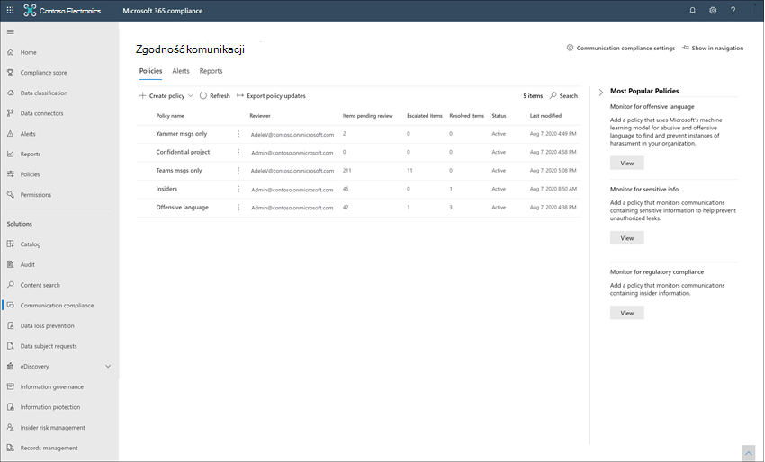

# Dowiedz się więcej o zgodności w komunikacji

> [!TIP]
> *Czy wiesz, że możesz bezpłatnie wypróbować wersje premium wszystkich dziewięciu rozwiązań Microsoft Purview?* Skorzystaj z 90-dniowej wersji próbnej rozwiązań Purview, aby dowiedzieć się, jak niezawodne możliwości usługi Purview mogą pomóc organizacji spełnić jej potrzeby w zakresie zgodności. Microsoft 365 E3 i Office 365 E3 klienci mogą rozpocząć pracę w [centrum portal zgodności Microsoft Purview prób](https://compliance.microsoft.com/trialHorizontalHub?sku=ComplianceE5&ref=DocsRef). Dowiedz się więcej o [tym, kto może zarejestrować się i zapoznać się z postanowieniami dotyczącymi wersji próbnej](compliance-easy-trials.md).

[!include[Purview banner](../includes/purview-rebrand-banner.md)]

Zgodność w komunikacji w Microsoft Purview jest rozwiązaniem ryzyka wewnętrznego, które pomaga zminimalizować ryzyko komunikacji, pomagając wykrywać, przechwytywać i działać na nieodpowiednich komunikatach w organizacji. Wstępnie zdefiniowane i niestandardowe zasady umożliwiają skanowanie komunikacji wewnętrznej i zewnętrznej pod kątem dopasowań zasad, aby mogły zostać zbadane przez wyznaczonych recenzentów. Recenzenci mogą badać skanowane wiadomości e-mail, Microsoft Teams, Yammer lub komunikację innych firm w organizacji i podejmować odpowiednie działania, aby upewnić się, że są one zgodne ze standardami wiadomości organizacji.

Zasady zgodności komunikacji w Microsoft 365 pomagają przezwyciężyć wiele nowoczesnych wyzwań związanych ze zgodnością oraz komunikacją wewnętrzną i zewnętrzną, w tym:

- Skanowanie rosnących typów kanałów komunikacyjnych
- Rosnąca ilość danych komunikatów
- Egzekwowanie przepisów i ryzyko grzywien

Ponadto może istnieć podział obowiązków między administratorami IT i zespołem zarządzania zgodnością. Zgodność z komunikacją obsługuje separację między konfiguracją zasad a badaniem i przeglądem komunikatów. Na przykład grupa IT w twojej organizacji może być odpowiedzialna za konfigurowanie uprawnień, grup i zasad zgodności komunikacji, a badacze i recenzenci mogą być odpowiedzialni za klasyfikowanie, przeglądanie i ograniczanie akcji komunikatów.

Aby uzyskać więcej informacji i omówienie procesu planowania dotyczącego zgodności i ryzykownych działań w organizacji, zobacz [Uruchamianie programu do zarządzania ryzykiem wewnętrznym](https://download.microsoft.com/download/b/2/0/b208282a-2482-4986-ba07-15a9b9286df0/pwc-starting-an-insider-risk-management-program-with-pwc-and-microsoft.pdf).

Najnowsze prezentacje konferencji Ignite dotyczące zgodności z komunikacją można znaleźć w następujących filmach wideo:

- [Wspieranie kultury bezpieczeństwa i integracji przy użyciu zgodności z komunikacją](https://www.youtube.com/watch?v=oLVzxcaef3w)
- [Dowiedz się, jak zmniejszyć ryzyko związane z komunikacją w organizacji](https://www.youtube.com/watch?v=vzARb1YaxGo)
- [Spełnianie wymagań dotyczących zgodności z przepisami przy użyciu zgodności z komunikacją](https://www.youtube.com/watch?v=gagOhtCBfgU)
- [Lepiej z Microsoft Teams — dowiedz się więcej na temat najnowszych natywnych Teams zintegrowanych funkcji w zakresie zgodności z komunikacją](https://www.youtube.com/watch?v=m4jukD5Fh-o)

Aby uzyskać szybki przegląd zgodności z komunikacją, zobacz wideo [Wykrywanie molestowania w miejscu pracy i reagowanie za pomocą zgodności z komunikacją](https://youtu.be/z33ji7a7Zho) w [kanale Microsoft Mechanics](https://www.youtube.com/user/OfficeGarageSeries).

Sprawdź, w jaki sposób [TD Securities korzysta ze zgodności komunikacyjnej](https://customers.microsoft.com/story/1391545301764211731-td-securities-banking-capital-markets-compliance) , aby spełnić swoje zobowiązania regulacyjne i spełnić ich potrzeby w zakresie bezpieczeństwa i stabilności.

Zapoznaj się z [filmem dotyczącym mechaniki firmy Microsoft](https://www.youtube.com/watch?v=Ynkfu8OF0wQ) , w jaki sposób zarządzanie ryzykiem wewnętrznym i zgodność z komunikacją współpracują ze sobą, aby zminimalizować ryzyko związane z danymi ze strony użytkowników w organizacji.

Aby być na bieżąco z najnowszymi aktualizacjami zgodności komunikacji, wybierz pozycję **Co nowego** w [zgodności z komunikacją](https://compliance.microsoft.com/) w organizacji.

> [!IMPORTANT]
> Zgodność z komunikacją jest obecnie dostępna w dzierżawach hostowanych w regionach geograficznych i krajach obsługiwanych przez zależności usługi platformy Azure. Aby sprawdzić, czy zgodność komunikacji jest obsługiwana w organizacji, zobacz [Dostępność zależności platformy Azure według kraju/regionu](/troubleshoot/azure/general/dependency-availability-by-country).

## Scenariusze dotyczące zgodności komunikacji

Zasady zgodności komunikacji mogą pomóc w przeglądaniu komunikatów w organizacji w kilku ważnych obszarach zgodności:

- **Zasady firmowe**

    Użytkownicy muszą przestrzegać akceptowalnego użycia, standardów etycznych i innych zasad firmowych we wszystkich swoich komunikatach związanych z działalnością biznesową. Zasady zgodności komunikacji mogą wykrywać dopasowania zasad i ułatwiać podjęcie działań naprawczych w celu ograniczenia tego typu zdarzeń. Można na przykład skanować komunikację użytkowników w organizacji pod kątem potencjalnych problemów z zasobami ludzkimi, takich jak nękanie lub używanie niewłaściwego lub obraźliwego języka.

- **Zarządzanie ryzykiem**

    Organizacje są odpowiedzialne za całą komunikację dystrybuowaną w ramach infrastruktury i firmowych systemów sieciowych. Korzystanie z zasad zgodności z komunikacją w celu identyfikowania potencjalnych ekspozycji prawnych i ryzyka oraz zarządzania nimi może pomóc zminimalizować ryzyko, zanim będą mogły uszkodzić działalność firmy. Można na przykład skanować komunikaty w organizacji pod kątem nieautoryzowanej komunikacji i konfliktów interesów dotyczących poufnych projektów, takich jak nadchodzące przejęcia, fuzje, ujawnianie zarobków, reorganizacje lub zmiany zespołu kierowniczego.

- **Zgodność**

    Większość organizacji musi przestrzegać pewnego rodzaju standardów zgodności z przepisami w ramach normalnych procedur operacyjnych. Przepisy te często wymagają od organizacji wdrożenia pewnego rodzaju procesu nadzoru lub nadzoru nad komunikatami, który jest odpowiedni dla ich branży. Reguła 3110 Financial Industry Regulatory Authority (FINRA) jest dobrym przykładem wymogu, aby organizacje dysponowały procedurami nadzoru w celu skanowania komunikacji użytkowników i typów firm, w które się angażuje. Innym przykładem może być konieczność przeglądu komunikacji broker-dealer w organizacji w celu ochrony przed potencjalnym praniem pieniędzy, wykorzystywaniem informacji poufnych, zmową lub przekupstwem. Zasady zgodności komunikacji mogą pomóc organizacji spełnić te wymagania, udostępniając proces skanowania i raportowania komunikacji firmowej. Aby uzyskać więcej informacji na temat pomocy technicznej dla organizacji finansowych, zobacz [Kluczowe zagadnienia dotyczące zgodności i zabezpieczeń dla amerykańskich rynków bankowych i kapitałowych](../solutions/financial-services-secure-collaboration.md).

## Kluczowe obszary funkcji

Zgodność z komunikacją oferuje kilka ważnych funkcji, które ułatwiają rozwiązywanie problemów ze zgodnością na platformach obsługi komunikatów:

- Inteligentne, dostosowywalne szablony
- Elastyczne przepływy pracy korygowania
- Szczegółowe informacje umożliwiające podjęcie działań

### Inteligentne, dostosowywalne szablony

Inteligentne, dostosowywalne szablony w zakresie zgodności z komunikacją umożliwiają stosowanie uczenia maszynowego w celu inteligentnego wykrywania naruszeń komunikacji w organizacji.

- **Dostosowywalne wstępnie skonfigurowane szablony**: szablony zasad pomagają rozwiązać najczęstsze zagrożenia związane z komunikacją. Początkowe tworzenie zasad i kolejne aktualizacje są teraz szybsze dzięki wstępnie zdefiniowanej nieodpowiedniej zawartości, poufnym informacjom, konfliktowi interesów i szablonom zgodności z przepisami.
- **Obsługa nowego uczenia maszynowego**: Wbudowane metody dyskryminacji, zagrożeń, nękania, wulgaryzmów i [klasyfikatorów obrazów](classifier-get-started-with.md) pomagają zmniejszyć liczbę błędnie sklasyfikowanych treści w przeskanowanych komunikatach, oszczędzając czas recenzentom podczas procesu badania i korygowania.
- **Ulepszony konstruktor warunków**: Konfigurowanie warunków zasad jest teraz usprawnione w jednym zintegrowanym środowisku kreatora zasad, co zmniejsza zamieszanie w sposobie stosowania warunków dla zasad.

### Elastyczne przepływy pracy korygowania

Wbudowane przepływy pracy korygowania umożliwiają szybkie identyfikowanie i wykonywanie akcji w przypadku komunikatów z dopasowaniami zasad w organizacji. Następujące nowe funkcje zwiększają wydajność działań związanych z badaniem i korygowaniem:

- **Elastyczny przepływ pracy korygowania**: Nowy przepływ pracy korygowania pomaga szybko podejmować działania dotyczące dopasowań zasad, w tym nowe opcje eskalowania komunikatów do innych recenzentów i wysyłania powiadomień e-mail do użytkowników z dopasowaniami zasad.
- **Dopasowywanie zasad konwersacji**: komunikaty w konwersacjach są grupowane według dopasowań zasad, aby zapewnić większą widoczność relacji konwersacji z zasadami komunikacji. Na przykład dopasowanie zasad *konwersacji w widoku Oczekujące alerty* spowoduje automatyczne wyświetlenie wszystkich komunikatów w kanale Teams, które są zgodne z zasadami nieodpowiedniej zawartości. Inne komunikaty w konwersacji, które nie są zgodne z zasadami nieodpowiedniej zawartości, nie będą wyświetlane.
- **Wyróżnianie słów kluczowych**: warunki zasad dopasowania warunków są wyróżnione w widoku tekstowym wiadomości, aby ułatwić recenzentom szybkie lokalizowanie i korygowanie alertów zasad.
- **Dokładne i niemal zduplikowane wykrywanie**: oprócz skanowania w poszukiwaniu dokładnych terminów zgodnych z zasadami zgodności komunikacji, niemal zduplikowane grupy wykrywania są tekstowo podobne terminy i komunikaty, aby przyspieszyć proces przeglądu.
- **Optyczne rozpoznawanie znaków (OCR) (wersja zapoznawcza):** skanuj, wykrywaj i badaj tekst drukowany i odręczny w obrazach osadzonych lub dołączonych do wiadomości e-mail lub Microsoft Teams wiadomości czatu.
- **Nowe filtry**: szybciej badaj i koryguj alerty zasad za pomocą filtrów komunikatów dla kilku pól, w tym nadawcy, adresata, daty, domen i wielu innych.
- **Ulepszone widoki komunikatów**: akcje badania i korygowania są teraz szybsze dzięki nowym widokom źródła wiadomości i tekstu. Załączniki komunikatów można teraz wyświetlać w celu zapewnienia pełnego kontekstu podczas wykonywania akcji korygowania.
- **Historia użytkownika**: Widok historyczny wszystkich działań korygowania komunikatów użytkownika, takich jak wcześniejsze powiadomienia i eskalacje dopasowań zasad, zapewnia teraz recenzentom więcej kontekstu podczas procesu przepływu pracy korygowania. Wystąpienia dopasowań zasad po raz pierwszy lub powtórzenie dla użytkowników są teraz zarchiwizowane i można je łatwo wyświetlać.
- **Powiadomienie wykryte wzorzec**: Wiele akcji nękania i zastraszania odbywa się w czasie i obejmuje powtarzanie wystąpień tego samego zachowania przez użytkownika. Nowe powiadomienie wykryte wzorzec wyświetlane w szczegółach alertu pomaga zwrócić uwagę na te alerty i tego typu zachowanie.
- **Tłumaczenie**: szybkie badanie szczegółów komunikatów w ośmiu językach przy użyciu obsługi tłumaczenia w przepływie pracy korygowania. Komunikaty w innych językach są automatycznie konwertowane na język wyświetlania recenzenta.
- **Wykrywanie załączników**: skanuj, wykrywaj i badaj połączoną zawartość (nowoczesne załączniki) z OneDrive i Microsoft Teams, które pasują do klasyfikatorów zasad i warunków Microsoft Teams komunikatów. Zawartość załącznika jest automatycznie wyodrębniany do pliku tekstowego w celu szczegółowego przeglądu i działania.

### Szczegółowe informacje umożliwiające podjęcie działań

Nowe interaktywne pulpity nawigacyjne alertów, dopasowań zasad, akcji i trendów ułatwiają szybkie wyświetlanie stanu oczekujących i rozwiązanych alertów w organizacji.

- **Aktywne inteligentne alerty**: Alerty dotyczące dopasowań zasad wymagających natychmiastowej uwagi obejmują nowe pulpity nawigacyjne dla oczekujących elementów posortowanych według ważności i nowe automatyczne powiadomienia e-mail wysyłane do wyznaczonych recenzentów.
- **Interaktywne pulpity nawigacyjne**: nowe pulpity nawigacyjne wyświetlają dopasowania zasad, oczekujące i rozwiązane akcje oraz trendy według użytkowników i zasad.
- **Obsługa inspekcji**: pełny dziennik zasad i działań przeglądowych można łatwo wyeksportować z portal zgodności Microsoft Purview, aby ułatwić obsługę żądań przeglądu inspekcji.

## Integracja z usługami Microsoft 365

Zasady zgodności komunikacji skanują i przechwytują komunikaty w kilku kanałach komunikacji, aby ułatwić szybkie przeglądanie i korygowanie problemów ze zgodnością:

- **Microsoft Teams**: Komunikacja czatów dla publicznych i prywatnych kanałów [Microsoft Teams](/MicrosoftTeams/Teams-overview) i poszczególnych czatów jest obsługiwana w ramach zgodności z komunikacją jako autonomiczne źródło kanału lub z innymi usługami Microsoft 365. Po wybraniu użytkowników i grup do nadzorowania w zasadach zgodności komunikacji należy ręcznie dodać poszczególnych użytkowników, grupy dystrybucyjne lub określone kanały Microsoft Teams. Teams użytkownicy mogą również samodzielnie zgłaszać nieodpowiednie wiadomości w kanałach prywatnych i grupowych oraz czatach do przeglądu i korygowania.
- **Exchange Online**: do skanowania kwalifikują się wszystkie skrzynki pocztowe hostowane w [Exchange Online](/Exchange/exchange-online) w organizacji Microsoft 365. Wiadomości e-mail i załączniki pasujące do warunków zasad zgodności komunikacji są natychmiast dostępne do monitorowania i w raportach zgodności. Exchange Online jest teraz opcjonalnym kanałem źródłowym i nie jest już wymagany w zasadach zgodności komunikacji.
- **Yammer**: Prywatne wiadomości i konwersacje społeczności publicznej w [Yammer](/yammer/yammer-landing-page) są obsługiwane w zasadach zgodności komunikacji. Yammer jest kanałem opcjonalnym i musi być w [trybie natywnym](/yammer/configure-your-yammer-network/overview-native-mode), aby obsługiwać skanowanie komunikatów i załączników.
- **Skype dla firm Online**: zasady zgodności komunikacji obsługują skanowanie komunikacji czatu i skojarzonych załączników w [usłudze Skype dla firm Online](/SkypeForBusiness/skype-for-business-online).
- **Źródła innych firm**: możesz skanować wiadomości ze [źródeł innych firm](archiving-third-party-data.md) pod kątem danych zaimportowanych do skrzynek pocztowych w organizacji Microsoft 365. Zgodność z komunikacją obsługuje połączenia z kilkoma popularnymi platformami, w tym z usługą Instant Bloomberg i innymi.

Aby dowiedzieć się więcej na temat obsługi kanałów obsługi komunikatów w zasadach zgodności komunikacji, zobacz [Wykrywanie sygnałów kanału ze zgodnością komunikacji](communication-compliance-channels.md).

## Przepływu pracy

Zgodność z komunikacją ułatwia rozwiązywanie typowych problemów związanych z zgodnością z zasadami wewnętrznymi i wymaganiami dotyczącymi zgodności z przepisami. Dzięki ukierunkowanym szablonom zasad i elastycznemu przepływowi pracy możesz użyć szczegółowych informacji umożliwiających podjęcie akcji, aby szybko rozwiązać wykryte problemy ze zgodnością.

Identyfikowanie i rozwiązywanie problemów ze zgodnością ze zgodnością komunikacji korzysta z następującego przepływu pracy:

### Konfiguruj

W tym kroku przepływu pracy zidentyfikujesz wymagania dotyczące zgodności i skonfigurujesz odpowiednie zasady zgodności komunikacji. Szablony zasad to doskonały sposób na nie tylko szybkie skonfigurowanie nowych zasad zgodności, ale także szybkie modyfikowanie i aktualizowanie zasad w miarę zmieniania wymagań. Na przykład przed skonfigurowaniem zasad dla wszystkich użytkowników w organizacji możesz szybko przetestować zasady pod kątem nieodpowiedniej zawartości w komunikacji dla niewielkiej grupy użytkowników.

>[!IMPORTANT]
>Domyślnie administratorzy globalni nie mają dostępu do funkcji zgodności komunikacji. Aby włączyć uprawnienia do funkcji zgodności komunikacji, zobacz [Udostępnianie zgodności komunikacji w organizacji](communication-compliance-configure.md#step-1-required-enable-permissions-for-communication-compliance).

W portal zgodności Microsoft Purview możesz wybrać spośród następujących szablonów zasad:

- **Monitorowanie pod kątem nieodpowiedniego tekstu**: użyj tego szablonu, aby szybko utworzyć zasady, które używają wbudowanych klasyfikatorów do automatycznego wykrywania tekstu w wiadomościach, które mogą być uważane za nieodpowiednie, obraźliwe lub obraźliwe.
- **Monitorowanie pod kątem nieodpowiednich obrazów**: użyj tego szablonu, aby szybko utworzyć zasady, które używają wbudowanych klasyfikatorów do automatycznego wykrywania zawartości zawierającej obrazy dla dorosłych i erotyczne, które mogą być uważane za nieodpowiednie w organizacji.
- **Monitorowanie pod kątem informacji poufnych**: ten szablon umożliwia szybkie utworzenie zasad do skanowania komunikacji zawierającej zdefiniowane typy informacji poufnych lub słowa kluczowe, aby upewnić się, że ważne dane nie są udostępniane osobom, które nie powinny mieć dostępu.
- **Monitorowanie zgodności z przepisami finansowymi**: użyj tego szablonu, aby szybko utworzyć zasady do skanowania komunikacji pod kątem odwołań do standardowych warunków finansowych skojarzonych ze standardami regulacyjnymi.
- **Monitorowanie pod kątem konfliktu interesów**: użyj tego szablonu, aby szybko utworzyć zasady do monitorowania komunikacji między dwiema grupami lub dwoma użytkownikami, aby uniknąć konfliktów interesów.
- **Zasady niestandardowe**: ten szablon służy do konfigurowania określonych kanałów komunikacyjnych, indywidualnych warunków wykrywania oraz ilości zawartości do monitorowania i przeglądania w organizacji.
- **Zasady komunikatów zgłaszane przez użytkownika**: te zasady systemowe obsługują komunikaty zgłaszane przez użytkowników z kanału, grupy i prywatnych wiadomości czatu. Domyślnie włączone w centrum administracyjnym Teams.

>[!TIP]
>Użyj [zalecanych akcji](communication-compliance-configure.md#recommended-actions-preview) , aby określić, czy potrzebujesz zasad typów informacji poufnych, czy chcesz zaktualizować istniejące nieodpowiednie zasady zawartości.

### Zbadaj

W tym kroku przyjrzysz się bardziej szczegółowym problemom wykrytym jako zgodne z zasadami zgodności komunikacji. Ten krok obejmuje następujące akcje dostępne w portal zgodności Microsoft Purview:

- **Alerty**: gdy komunikat jest zgodny z warunkiem zasad, alert jest generowany automatycznie. Dla każdego alertu można zobaczyć stan, ważność, czas wykrycia oraz przypisanie przypadku zbierania elektronicznych materiałów dowodowych (Premium) i jego stanu. Nowe alerty są wyświetlane na stronie głównej zgodności komunikacji i na stronie **Alerty** i są wyświetlane w kolejności ważności.
- **Zarządzanie problemami**: dla każdego alertu możesz podjąć działania śledcze, aby pomóc w skorygowaniu problemu wykrytego w komunikacie.
- **Przegląd dokumentu**: Podczas badania problemu można użyć kilku widoków komunikatu, aby ułatwić prawidłową ocenę wykrytego problemu. Widoki obejmują podsumowanie konwersacji, tylko tekst i szczegółowe widoki konwersacji komunikacyjnej.
- **Przeglądanie historii aktywności użytkownika**: wyświetlanie historii działań komunikatów użytkownika i akcji korygowania, takich jak wcześniejsze powiadomienia i eskalacje, w przypadku dopasowań zasad.
- **Filtry**: użyj filtrów, takich jak nadawca, adresat, data i temat, aby szybko zawęzić alerty komunikatów, które chcesz przejrzeć.

### Korygowanie

Następnym krokiem jest skorygowanie problemów ze zgodnością komunikacji, które zostały zbadane przy użyciu następujących opcji:

- **Rozwiązanie**: Po przejrzeniu problemu można rozwiązać problem, rozwiązując alert. Rozwiązanie alertu powoduje usunięcie go z oczekującej kolejki alertów, a akcja jest zachowywana jako wpis w *rozwiązanej kolejce* dla pasujących zasad. Alerty są automatycznie rozwiązywane po oznaczeniu alertu jako błędnie sklasyfikowanego, wysłaniu do użytkownika powiadomienia o alertie lub otwarciu nowego przypadku alertu.
- **Otaguj komunikat**: W ramach rozwiązania problemu możesz oznaczyć wykryty komunikat jako zgodny, niezgodny lub tak wątpliwy, jak w odniesieniu do zasad i standardów organizacji. Tagowanie może pomóc w mikrofiltrowaniu alertów zasad dotyczących eskalacji lub w ramach innych wewnętrznych procesów przeglądu.
- **Powiadom użytkownika**: często użytkownicy przypadkowo lub przypadkowo naruszają zasady zgodności komunikacji. Możesz użyć funkcji powiadamiania, aby przekazać użytkownikowi powiadomienie ostrzegawcze i rozwiązać ten problem.
- **Eskaluj do innego recenzenta**: Czasami pierwszy recenzent problemu potrzebuje danych wejściowych od innych recenzentów, aby pomóc w rozwiązaniu zdarzenia. Problemy z komunikatami można łatwo eskalować do recenzentów w innych obszarach organizacji w ramach procesu rozwiązywania problemów.
- **Raport jako błędnie sklasyfikowany**: Komunikaty niepoprawnie wykryte jako dopasowania zasad zgodności będą od czasu do czasu przechodzić do procesu przeglądu. Możesz oznaczyć te typy alertów jako błędnie sklasyfikowane, przesłać opinię do firmy Microsoft na temat błędnej klasyfikacji w celu ulepszenia globalnych klasyfikatorów i automatycznie rozwiązać problem.
- **Usuń komunikat w Teams (wersja zapoznawcza)**: niestosowne wiadomości mogą zostać usunięte z wyświetlania w kanałach Microsoft Teams lub wiadomościach osobistych i czatach grupowych. Usunięte nieodpowiednie komunikaty są zastępowane powiadomieniem o usunięciu komunikatu z powodu naruszenia zasad.
- **Eskalacja w celu zbadania**: W najpoważniejszych sytuacjach może być konieczne udostępnienie informacji o zgodności komunikacji innym recenzentom w organizacji. Zgodność z komunikacją jest ściśle zintegrowana z innymi funkcjami Microsoft Purview, które ułatwiają kompleksowe rozwiązywanie ryzyka. Eskalacja sprawy do zbadania umożliwia przesyłanie danych i zarządzanie sprawą w celu Microsoft Purview zbierania elektronicznych materiałów dowodowych (Premium). Funkcja zbierania elektronicznych materiałów dowodowych (Premium) zapewnia kompleksowy przepływ pracy umożliwiający zachowanie, zbieranie, przeglądanie, analizowanie i eksportowanie zawartości, która odpowiada na wewnętrzne i zewnętrzne badania organizacji. Umożliwia zespołom prawnym zarządzanie całym przepływem pracy powiadomień o blokadzie prawnej. Aby dowiedzieć się więcej na temat przypadków zbierania elektronicznych materiałów dowodowych (Premium), zobacz [Omówienie Microsoft Purview eDiscovery (Premium)](overview-ediscovery-20.md).

### Monitorowanie

Śledzenie problemów ze zgodnością identyfikowanych przez zasady zgodności komunikacji obejmuje cały proces przepływu pracy. Ponieważ alerty są generowane i są implementowane akcje badania i korygowania, istniejące zasady mogą wymagać przeglądu i aktualizacji oraz może być konieczne utworzenie nowych zasad.

- **Monitorowanie i raport**: użyj widżetów pulpitu nawigacyjnego zgodności komunikacji, eksportuj dzienniki i zdarzenia zarejestrowane w ujednoliconych dziennikach inspekcji, aby stale oceniać i poprawiać stan zgodności.

## Chcesz rozpocząć pracę?

- Aby uzyskać informacje o planowaniu, zobacz [Planowanie zgodności z komunikacją](communication-compliance-plan.md).
- Zapoznaj się z [analizą przypadku firmy Contoso](communication-compliance-case-study.md) i zobacz, jak szybko skonfigurowali zasady zgodności komunikacji w celu monitorowania nieodpowiedniej zawartości w Microsoft Teams, Exchange Online i Yammer komunikacji.
- Aby skonfigurować zgodność komunikacji dla organizacji Microsoft 365, zobacz [Konfigurowanie zgodności komunikacji](communication-compliance-configure.md).
