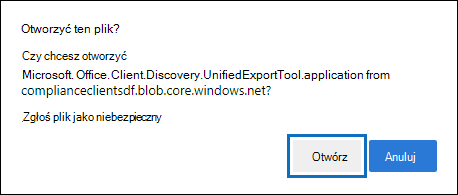
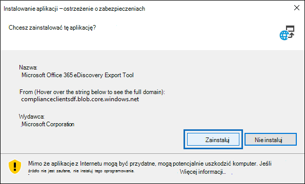

# Korzystanie z narzędzia eksportu zbierania elektronicznych materiałów dowodowych w Microsoft Edge

[!include[Purview banner](../includes/purview-rebrand-banner.md)]

W wyniku ostatnich zmian w najnowszej wersji Microsoft Edge obsługa ClickOnce nie jest już domyślnie włączona. Aby kontynuować korzystanie z narzędzia eksportu zbierania elektronicznych materiałów dowodowych do pobierania wyników wyszukiwania zawartości lub zbierania elektronicznych materiałów dowodowych, należy użyć programu [Microsoft Internet Explorer](https://support.microsoft.com/help/17621/internet-explorer-downloads) lub włączyć obsługę ClickOnce w najnowszej wersji Microsoft Edge.

## Włączanie obsługi ClickOnce w Microsoft Edge

1. W Microsoft Edge przejdź do **edge://flags/#edge-click-once**.

2. Jeśli istniejąca wartość jest ustawiona na **wartość Domyślna** lub **Wyłączona** na liście rozwijanej, zmień ją na **Włączone**.

   

3. Przewiń w dół do dołu okna przeglądarki i kliknij przycisk **Uruchom ponownie** , aby ponownie uruchomić przeglądarkę Edge.

   

**Uwaga:** Organizacje mogą używać zasady grupy, aby wyłączyć obsługę ClickOnce. Aby sprawdzić, czy istnieją zasady organizacyjne dotyczące ClickOnce pomocy technicznej, przejdź do **edge://policy**. Poniższy zrzut ekranu pokazuje, że ClickOnce jest włączona w całej organizacji. Jeśli ta wartość zasad jest ustawiona na **wartość false**, należy skontaktować się z administratorem w organizacji.

## Instalowanie i uruchamianie narzędzia eksportu zbierania elektronicznych materiałów dowodowych

1. Kliknij **pozycję Pobierz wyniki** na stronie wysuwanej eksportu w wyszukiwaniu zawartości lub w przypadku zbierania elektronicznych materiałów dowodowych.

   

2. Zostanie wyświetlony monit z potwierdzeniem uruchomienia narzędzia Kliknij **przycisk Otwórz**.

   

   Jeśli narzędzie eksportu zbierania elektronicznych materiałów dowodowych nie jest zainstalowane, zostanie wyświetlony monit z ostrzeżeniem o zabezpieczeniach. 

   

3. Kliknij przycisk **Zainstaluj**. Po zainstalowaniu narzędzie eksportu zostanie uruchomione automatycznie.

Aby uzyskać więcej informacji, zobacz następujące tematy:

- [Eksportowanie wyników wyszukiwania zawartości](export-search-results.md)

- [Jak włączyć flagi eksperymentu w Microsoft Edge](https://microsoftedgesupport.microsoft.com/hc/articles/360034075294-How-to-enable-experiment-flags-in-Microsoft-Edge-Insider-channels)
