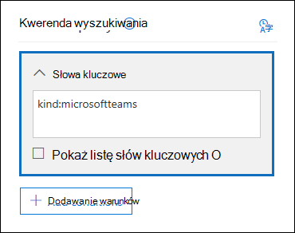

# <a name="feature-reference-for-content-search"></a>Dokumentacja dotycząca funkcji wyszukiwania zawartości

W tym artykule opisano funkcje i funkcje wyszukiwania zawartości.

## <a name="content-search-limits"></a>Limity wyszukiwania zawartości

Aby uzyskać opis limitów stosowanych do wyszukiwania zawartości, zobacz [Limity wyszukiwania zawartości](limits-for-content-search.md).

## <a name="building-a-search-query"></a>Tworzenie zapytania wyszukiwania

Aby uzyskać szczegółowe informacje na temat tworzenia zapytania wyszukiwania, używania operatorów wyszukiwania logicznego i warunków wyszukiwania oraz wyszukiwania poufnych typów informacji i zawartości udostępnionej użytkownikom spoza organizacji, zobacz [Zapytania słów kluczowych i warunki wyszukiwania dla wyszukiwania zawartości](keyword-queries-and-search-conditions.md).

Podczas tworzenia zapytania wyszukiwania należy pamiętać o następujących kwestiach podczas tworzenia zapytania wyszukiwania przy użyciu listy słów kluczowych.

- Musisz zaznaczyć pole wyboru **Pokaż listę słów kluczowych** , a następnie wpisać każde słowo kluczowe w osobnym wierszu, aby utworzyć zapytanie wyszukiwania, w którym słowa kluczowe (lub frazy kluczowe) w każdym wierszu są połączone przez operatora **OR** . Jeśli wklejysz listę słów kluczowych w polu słowa kluczowego lub naciśniesz klawisz **Enter** po wpisaniu słowa kluczowego, nie będą one połączone przez operatora **OR** . Poniżej przedstawiono niepoprawne i poprawne przykłady dodawania listy słów kluczowych.

    **Niepoprawne**

    

    **Poprawne**

    

- Możesz również przygotować listę słów kluczowych lub fraz kluczowych w pliku programu Excel lub pliku zwykłego tekstu, a następnie skopiować i wkleić listę do listy słów kluczowych. W tym celu należy zaznaczyć pole wyboru **Pokaż listę słów kluczowych** . Następnie kliknij pierwszy wiersz na liście słów kluczowych i wklej listę. Każdy wiersz z programu Excel lub pliku tekstowego jest wklejony do oddzielnego wiersza na liście słów kluczowych.

- Po utworzeniu zapytania przy użyciu listy słów kluczowych warto zweryfikować składnię zapytania wyszukiwania, aby zapytanie wyszukiwania było zamierzone. W zapytaniu wyszukiwania wyświetlanym w obszarze **Zapytanie** w okienku szczegółów słowa kluczowe są oddzielone tekstem **(c:s).** Oznacza to, że słowa kluczowe są połączone przez operator logiczny podobny w funkcji do operatora **OR** . Podobnie, jeśli zapytanie wyszukiwania zawiera warunki, słowa kluczowe i warunki są oddzielone tekstem **(c:c)**. Oznacza to, że słowa kluczowe są połączone z warunkami za pomocą operatora logicznego podobnego w funkcji do operatora **AND** . Oto przykład zapytania wyszukiwania (wyświetlanego w okienku Szczegóły), które jest wynikiem użycia listy słów kluczowych i warunku.

    

- Po uruchomieniu wyszukiwania zawartości platforma Microsoft 365 automatycznie sprawdza zapytanie wyszukiwania pod kątem nieobsługiwanych znaków i operatorów logicznych, które mogą nie być wielką literą. Nieobsługiwane znaki są często ukryte i zazwyczaj powodują błąd wyszukiwania lub zwracają niezamierzone wyniki. Aby uzyskać więcej informacji o zaznaczonych nieobsługiwanych znakach, zobacz [Sprawdzanie zapytania wyszukiwania zawartości pod kątem błędów](check-your-content-search-query-for-errors.md).

- Jeśli masz zapytanie wyszukiwania zawierające słowa kluczowe dla znaków innych niż angielski (np. znaki chińskie), możesz kliknąć pozycję **Zapytanie języka kraju/regionu** i wybierz wartość kodu kultury język-kraj dla wyszukiwania. Domyślny język/region jest neutralny. Jak sprawdzić, czy chcesz zmienić ustawienie języka dla wyszukiwania zawartości? Jeśli niektóre lokalizacje zawartości zawierają wyszukiwane znaki inne niż angielskie, ale wyszukiwanie nie zwraca żadnych wyników, przyczyną może być ustawienie języka.

## <a name="partially-indexed-items"></a>Częściowo indeksowane elementy

- Częściowo indeksowane elementy w skrzynkach pocztowych są uwzględniane w szacowanych wynikach wyszukiwania. Częściowo indeksowane elementy z programów SharePoint i OneDrive nie są uwzględniane w szacowanych wynikach wyszukiwania. Aby uzyskać więcej informacji, zobacz [Częściowo zaindeksowane elementy w środowisku zbierania elektronicznych materiałów dowodowych](partially-indexed-items-in-content-search.md).

## <a name="searching-onedrive-accounts"></a>Wyszukiwanie kont usługi OneDrive

- Aby zebrać listę adresów URL witryn usługi OneDrive w organizacji, zobacz [Tworzenie listy wszystkich lokalizacji usługi OneDrive w organizacji](/onedrive/list-onedrive-urls). Ten skrypt w tym artykule tworzy plik tekstowy zawierający listę wszystkich witryn usługi OneDrive. Aby uruchomić ten skrypt, musisz zainstalować powłokę zarządzania usługi SharePoint Online i użyć jej. Pamiętaj, aby dołączyć adres URL domeny MySite organizacji do każdej witryny usługi OneDrive, którą chcesz wyszukać. Jest to domena, która zawiera całą twoją usługę OneDrive. na przykład  `https://contoso-my.sharepoint.com`. Oto przykład adresu URL witryny usługi OneDrive użytkownika:  `https://contoso-my.sharepoint.com/personal/sarad_contoso_onmicrosoft.com`.

    W rzadkich przypadkach zmiany głównej nazwy użytkownika (UPN) danej osoby adres URL lokalizacji usługi OneDrive został zmieniony w celu uwzględnienia nowej nazwy UPN. W takim przypadku należy zmodyfikować wyszukiwanie zawartości, dodając nowy adres URL usługi OneDrive użytkownika i usuwając stary. Aby uzyskać więcej informacji, zobacz [Jak zmiany nazwy UPN wpływają na adres URL usługi OneDrive](/onedrive/upn-changes).

## <a name="searching-microsoft-teams-and-microsoft-365-groups"></a>Wyszukiwanie aplikacji Microsoft Teams i Grupy Microsoft 365

Możesz wyszukać skrzynkę pocztową skojarzoną z zespołem firmy Microsoft lub grupą platformy Microsoft 365. Ponieważ usługa Microsoft Teams jest oparta na Grupy Microsoft 365, wyszukiwanie ich jest podobne. W obu przypadkach przeszukiwana jest tylko skrzynka pocztowa grupy lub zespołu. Skrzynki pocztowe grupy lub członków zespołu nie są przeszukiwane. Aby je wyszukać, musisz dodać je do wyszukiwania.

Podczas wyszukiwania zawartości w usłudze Microsoft Teams i Grupy Microsoft 365 należy pamiętać o następujących kwestiach.

- Aby wyszukać zawartość znajdującą się w usłudze Teams i Grupy Microsoft 365, musisz określić skrzynkę pocztową i witrynę programu SharePoint skojarzoną z zespołem lub grupą.

- Zawartość z kanałów prywatnych jest przechowywana w skrzynce pocztowej każdego użytkownika, a nie w skrzynce pocztowej zespołu. Aby wyszukać zawartość w kanałach prywatnych, zobacz [eDiscovery of private and shared channels (Wykrywanie prywatnych i udostępnionych kanałów](/microsoftteams/ediscovery-investigation#ediscovery-of-private-and-shared-channels)).

- Uruchom polecenie cmdlet **Get-UnifiedGroup** w Exchange Online, aby wyświetlić właściwości zespołu lub grupy platformy Microsoft 365. Jest to dobry sposób na uzyskanie adresu URL witryny skojarzonej z zespołem lub grupą. Na przykład następujące polecenie wyświetla wybrane właściwości grupy platformy Microsoft 365 o nazwie Senior Leadership Team:

  ```text
  Get-UnifiedGroup "Senior Leadership Team" | FL DisplayName,Alias,PrimarySmtpAddress,SharePointSiteUrl
  DisplayName            : Senior Leadership Team
  Alias                  : seniorleadershipteam
  PrimarySmtpAddress     : seniorleadershipteam@contoso.onmicrosoft.com
  SharePointSiteUrl      : https://contoso.sharepoint.com/sites/seniorleadershipteam
  ```

    > [!NOTE]
    > Aby uruchomić polecenie cmdlet **Get-UnifiedGroup**, musisz mieć przypisaną rolę adresatów View-Only w Exchange Online lub być członkiem grupy ról przypisanej do roli adresatów View-Only.

- Po przeszukaniu skrzynki pocztowej użytkownika nie będzie wyszukiwany żaden zespół lub grupa platformy Microsoft 365, do którego należy użytkownik. Podobnie podczas wyszukiwania zespołu lub grupy platformy Microsoft 365 przeszukiwana jest tylko określona skrzynka pocztowa grupy i określona witryna grupy. Skrzynki pocztowe i konta OneDrive dla Firm członków grupy nie są przeszukiwane, chyba że jawnie dodasz je do wyszukiwania.

- Aby uzyskać listę członków zespołu lub grupy platformy Microsoft 365, możesz wyświetlić właściwości na stronie <a href="https://go.microsoft.com/fwlink/p/?linkid=2052855" target="_blank">**Grupy**</a> **główne** \> w Centrum administracyjne platformy Microsoft 365. Alternatywnie możesz uruchomić następujące polecenie w programie Exchange Online programu PowerShell:

  ```powershell
  Get-UnifiedGroupLinks <group or team name> -LinkType Members | FL DisplayName,PrimarySmtpAddress
  ```

    > [!NOTE]
    > Aby uruchomić polecenie cmdlet **Get-UnifiedGroupLinks**, musisz mieć przypisaną rolę adresatów View-Only w Exchange Online lub być członkiem grupy ról przypisanej do roli adresatów View-Only.

- Konwersacje będące częścią kanału usługi Teams są przechowywane w skrzynce pocztowej skojarzonej z zespołem. Podobnie pliki udostępniane przez członków zespołu w kanale są przechowywane w witrynie programu SharePoint zespołu. W związku z tym należy dodać skrzynkę pocztową zespołu i witrynę programu SharePoint jako lokalizację zawartości do wyszukiwania konwersacji i plików w kanale.

- Alternatywnie konwersacje, które są częścią listy czatów w usłudze Teams, są przechowywane w Exchange Online skrzynce pocztowej użytkowników biorących udział w czacie. Pliki, które użytkownik udostępnia w konwersacjach czatu, są przechowywane na koncie OneDrive dla Firm użytkownika, który udostępnia plik. W związku z tym musisz dodać skrzynki pocztowe poszczególnych użytkowników i konta OneDrive dla Firm jako lokalizacje zawartości, aby wyszukiwać konwersacje i pliki na liście czatów.

    > [!NOTE]
    > W przypadku wdrożenia hybrydowego programu Exchange użytkownicy z lokalną skrzynką pocztową mogą uczestniczyć w konwersacjach, które są częścią listy czatów w usłudze Teams. W takim przypadku zawartość z tych konwersacji jest również przeszukiwalna, ponieważ jest zapisywana w obszarze magazynu opartym na chmurze (nazywanym *chmurową skrzynką pocztową dla użytkowników lokalnych*) dla użytkowników, którzy mają lokalną skrzynkę pocztową. Aby uzyskać więcej informacji, zobacz [Wyszukiwanie danych czatu w usłudze Teams dla użytkowników lokalnych](search-cloud-based-mailboxes-for-on-premises-users.md).

- Każdy kanał zespołu lub zespołu zawiera witrynę typu wiki do tworzenia notatek i współpracy. Zawartość witryny typu wiki jest automatycznie zapisywana w pliku w formacie mht. Ten plik jest przechowywany w bibliotece dokumentów usługi Teams Wiki Data w witrynie programu SharePoint zespołu. Za pomocą narzędzia do wyszukiwania zawartości możesz wyszukać witrynę typu wiki, określając witrynę programu SharePoint zespołu jako lokalizację zawartości do wyszukania.

    > [!NOTE]
    > Możliwość wyszukiwania w witrynie typu wiki zespołu lub kanału (podczas wyszukiwania witryny programu SharePoint zespołu) została wydana 22 czerwca 2017 r. Strony typu wiki, które zostały zapisane lub zaktualizowane w tym dniu lub później, są dostępne do przeszukiwania. Strony typu wiki ostatnio zapisane lub zaktualizowane przed tą datą nie są dostępne do wyszukiwania.

- Informacje podsumowujące dotyczące spotkań i połączeń w kanale usługi Teams są również przechowywane w skrzynkach pocztowych użytkowników, którzy wybrali się na spotkanie lub połączenie. Oznacza to, że możesz użyć wyszukiwania zawartości do wyszukiwania tych rekordów podsumowania. Informacje podsumowujące obejmują:

  - Data, godzina rozpoczęcia, godzina zakończenia i czas trwania spotkania lub połączenia

  - Data i godzina dołączenia do spotkania lub rozmowy przez każdego uczestnika

  - Połączenia wysyłane do poczty głosowych

  - Nieodebrane lub bez odpowiedzi połączenia

  - Transfery wywołań, które są reprezentowane jako dwa oddzielne wywołania

  Wyszukiwanie rekordów podsumowania spotkań i wywołań może potrwać do 8 godzin.

  W wynikach wyszukiwania podsumowania spotkań są identyfikowane jako **Spotkanie** w **polu Typ**, a podsumowania wywołań są identyfikowane jako **Wywołanie**. Ponadto konwersacje będące częścią kanału usługi Teams i czaty 1xN są identyfikowane jako wiadomości **błyskawiczne** w polu **Typ** .

  

   Aby uzyskać więcej informacji, zobacz [Microsoft Teams launches eDiscovery for calls and meetings (Usługa Microsoft Teams uruchamia funkcję zbierania elektronicznych materiałów dowodowych na potrzeby połączeń i spotkań](https://techcommunity.microsoft.com/t5/microsoft-teams-blog/microsoft-teams-launches-ediscovery-for-calling-and-meetings/ba-p/210947)).

- Zawartość kart generowana przez aplikacje w kanałach usługi Teams, czatach 1:1 i czatach 1xN jest przechowywana w skrzynkach pocztowych i może być przeszukiwana. *Karta* jest kontenerem interfejsu użytkownika dla krótkich fragmentów zawartości. Karty mogą mieć wiele właściwości i załączników oraz mogą zawierać przyciski, które mogą wyzwalać akcje karty. Aby uzyskać więcej informacji, zobacz [Karty](/microsoftteams/platform/task-modules-and-cards/what-are-cards)

  Podobnie jak w przypadku innej zawartości usługi Teams, miejsce przechowywania zawartości karty zależy od miejsca użycia karty. Zawartość kart używanych w kanale usługi Teams jest przechowywana w skrzynce pocztowej grupy Usługi Teams. Zawartość karty dla czatów 1:1 i 1xN jest przechowywana w skrzynkach pocztowych uczestników czatu.

  Aby wyszukać zawartość karty, możesz użyć warunków `kind:microsoftteams` wyszukiwania lub `itemclass:IPM.SkypeTeams.Message` . Podczas przeglądania wyników wyszukiwania zawartość karty wygenerowana przez boty w kanale usługi Teams ma właściwość e-mail **Nadawca/Autor** jako `<appname>@teams.microsoft.com`, gdzie `appname` jest nazwą aplikacji, która wygenerowała zawartość karty. Jeśli zawartość karty została wygenerowana przez użytkownika, wartość **nadawcy/autora** identyfikuje użytkownika.

  Podczas wyświetlania zawartości karty w wynikach wyszukiwania zawartości zawartość jest wyświetlana jako załącznik do wiadomości. Załącznik ma nazwę `appname.html`, gdzie `appname` jest nazwą aplikacji, która wygenerowała zawartość karty. Poniższe zrzuty ekranu pokazują, jak zawartość karty (dla aplikacji o nazwie Asana) jest wyświetlana w aplikacji Teams i w wynikach wyszukiwania.

  **Zawartość karty w usłudze Teams**

  

  **Zawartość karty w wynikach wyszukiwania**

  

  > [!NOTE]
  > Aby w tej chwili wyświetlać obrazy z zawartości karty w wynikach wyszukiwania (na przykład znaczniki wyboru na poprzednim zrzucie ekranu), musisz zalogować się do aplikacji Teams (na https://teams.microsoft.com) innej karcie w tej samej sesji przeglądarki, która służy do wyświetlania wyników wyszukiwania. W przeciwnym razie zostaną wyświetlone symbole zastępcze obrazu.

- Możesz użyć właściwości **Kind** email lub warunku wyszukiwania **typu Wiadomość** , aby wyszukać zawartość w aplikacji Teams.

  - Aby użyć właściwości **Kind** jako części zapytania wyszukiwania słów kluczowych, w polu **Słowa kluczowe** zapytania wyszukiwania wpisz `kind:microsoftteams`.

    

  - Aby użyć warunku wyszukiwania, dodaj warunek **Rodzaj komunikatu** i użyj wartości `microsoftteams`.

    

   Warunki są logicznie połączone z zapytaniem słowa kluczowego przez operatora **AND** . Oznacza to, że element musi być zgodny zarówno z zapytaniem słowa kluczowego, jak i warunkiem wyszukiwania, który ma zostać zwrócony w wynikach wyszukiwania. Aby uzyskać więcej informacji, zobacz sekcję "Wytyczne dotyczące używania warunków" w [temacie Zapytania dotyczące słów kluczowych i warunki wyszukiwania dla wyszukiwania zawartości.](keyword-queries-and-search-conditions.md#guidelines-for-using-conditions)

## <a name="searching-yammer-groups"></a>Wyszukiwanie grup usługi Yammer

Aby wyszukać elementy konwersacji w grupach usługi Yammer, możesz użyć właściwości e-mail **ItemClass** lub warunku wyszukiwania **typu** .

  - Aby użyć właściwości **ItemClass** jako części zapytania wyszukiwania słów kluczowych, w polu **Słowa kluczowe** zapytania wyszukiwania możesz wpisać jedną (lub wszystkie) następujące pary właściwości:value:

     - ItemClass:IPM. Yammer.message
     - ItemClass:IPM. Yammer.poll
     - ItemClass:IPM. Yammer.praise
     - ItemClass:IPM. Yammer.question

    Możesz na przykład użyć następującego zapytania wyszukiwania, aby zwrócić komunikaty usługi Yammer i elementy uwielbienia usługi Yammer:

    

  - Alternatywnie możesz użyć warunku **Wpisz** wiadomość e-mail i wybrać pozycję **Wiadomości usługi Yammer** , aby zwrócić elementy usługi Yammer. Na przykład następujące zapytanie wyszukiwania zwróci wszystkie elementy konwersacji usługi Yammer zawierające słowo kluczowe "poufne".

    

## <a name="searching-inactive-mailboxes"></a>Wyszukiwanie nieaktywnych skrzynek pocztowych

Nieaktywne skrzynki pocztowe można wyszukiwać w wyszukiwaniu zawartości. Aby uzyskać listę nieaktywnych skrzynek pocztowych w organizacji, uruchom polecenie `Get-Mailbox -InactiveMailboxOnly` w Exchange Online programu PowerShell. Alternatywnie możesz przejść do pozycji **Przechowywanie** **zarządzania cyklem** \> życia danych w portal zgodności Microsoft Purview, a następnie kliknąć pozycję **Więcej** \>**Nieaktywne skrzynki pocztowe**.

Oto kilka kwestii, o których należy pamiętać podczas wyszukiwania nieaktywnych skrzynek pocztowych.

- Jeśli istniejące wyszukiwanie zawartości zawiera skrzynkę pocztową użytkownika i ta skrzynka pocztowa jest nieaktywna, wyszukiwanie zawartości będzie nadal przeszukiwać nieaktywną skrzynkę pocztową po ponownym uruchomieniu wyszukiwania po tym, jak stanie się ona nieaktywna.

- Czasami użytkownik może mieć aktywną skrzynkę pocztową i nieaktywną skrzynkę pocztową z tym samym adresem SMTP. W takim przypadku przeszukiwana jest tylko określona skrzynka pocztowa wybrana jako lokalizacja wyszukiwania zawartości. Innymi słowy, jeśli dodasz skrzynkę pocztową użytkownika do wyszukiwania, nie można zakładać, że przeszukiwane są zarówno aktywne, jak i nieaktywne skrzynki pocztowe. Przeszukiwana jest tylko skrzynka pocztowa jawnie dodana do wyszukiwania.

- Program PowerShell & Zgodności zabezpieczeń umożliwia utworzenie wyszukiwania zawartości w celu wyszukania nieaktywnej skrzynki pocztowej. W tym celu należy wstępnie dołączyć okres ( . ) na adres e-mail nieaktywnej skrzynki pocztowej. Na przykład następujące polecenie tworzy wyszukiwanie zawartości, które wyszukuje nieaktywną skrzynkę pocztową z adresem e-mail pavelb@contoso.onmicrosoft.com:

   ```powershell
   New-ComplianceSearch -Name InactiveMailboxSearch -ExchangeLocation .pavelb@contoso.onmicrosoft.com -AllowNotFoundExchangeLocationsEnabled $true
   ```

- Zdecydowanie zalecamy unikanie aktywnej skrzynki pocztowej i nieaktywnej skrzynki pocztowej z tym samym adresem SMTP. Jeśli musisz ponownie użyć adresu SMTP przypisanego do nieaktywnej skrzynki pocztowej, zalecamy odzyskanie nieaktywnej skrzynki pocztowej lub przywrócenie zawartości nieaktywnej skrzynki pocztowej do aktywnej skrzynki pocztowej (lub archiwum aktywnej skrzynki pocztowej), a następnie usunięcie nieaktywnej skrzynki pocztowej. Aby uzyskać więcej informacji, zobacz jeden z następujących tematów:

  - [Odzyskiwanie nieaktywnej skrzynki pocztowej w Office 365](recover-an-inactive-mailbox.md)

  - [Przywracanie nieaktywnej skrzynki pocztowej w Office 365](restore-an-inactive-mailbox.md)

  - [Usuwanie nieaktywnej skrzynki pocztowej w Office 365](delete-an-inactive-mailbox.md)

## <a name="searching-disconnected-or-de-licensed-mailboxes"></a>Wyszukiwanie rozłączonych lub anulowanych licencji skrzynek pocztowych

Jeśli licencja Exchange Online (lub cała licencja platformy Microsoft 365) zostanie usunięta z konta użytkownika lub w usłudze Azure Active Directory, skrzynka pocztowa użytkownika stanie się *odłączaną* skrzynką pocztową. Oznacza to, że skrzynka pocztowa nie jest już skojarzona z kontem użytkownika. Oto, co się stanie podczas wyszukiwania rozłączonych skrzynek pocztowych:

- Jeśli licencja zostanie usunięta ze skrzynki pocztowej, skrzynka pocztowa nie będzie już przeszukiwana.

- Jeśli istniejące wyszukiwanie zawartości zawiera skrzynkę pocztową, w której licencja zostanie usunięta, wyniki wyszukiwania z rozłączonej skrzynki pocztowej nie zostaną zwrócone po ponownym uruchomieniu wyszukiwania zawartości.

- Jeśli użyjesz polecenia cmdlet **New-ComplianceSearch** , aby utworzyć wyszukiwanie zawartości i określić rozłączona skrzynkę pocztową jako lokalizację zawartości programu Exchange do wyszukiwania, wyszukiwanie zawartości nie zwróci żadnych wyników wyszukiwania z rozłączonej skrzynki pocztowej.

Jeśli musisz zachować dane w odłączonej skrzynce pocztowej, aby można je było przeszukiwać, przed usunięciem licencji należy umieścić blokadę w skrzynce pocztowej. Pozwala to zachować dane i umożliwia wyszukiwanie rozłączonej skrzynki pocztowej do momentu usunięcia blokady. Aby uzyskać więcej informacji na temat blokad, zobacz [How to identify the type of hold placed on an Exchange Online mailbox (Jak zidentyfikować typ blokady umieszczonej w skrzynce pocztowej Exchange Online](identify-a-hold-on-an-exchange-online-mailbox.md)).

## <a name="searching-for-content-in-a-sharepoint-multi-geo-environment"></a>Wyszukiwanie zawartości w środowisku SharePoint Multi-Geo

Jeśli menedżer zbierania elektronicznych materiałów dowodowych musi wyszukać zawartość w programie SharePoint i usłudze OneDrive w różnych regionach w [środowisku z wieloma obszarami geograficznymi programu SharePoint](../enterprise/multi-geo-capabilities-in-onedrive-and-sharepoint-online-in-microsoft-365.md), musisz wykonać następujące czynności, aby tak się stało:

1. Utwórz oddzielne konto użytkownika dla każdej lokalizacji geograficznej satelity, które menedżer zbierania elektronicznych materiałów dowodowych musi wyszukać. Aby wyszukać zawartość w witrynach w tej lokalizacji geograficznej, menedżer zbierania elektronicznych materiałów dowodowych musi zalogować się do konta utworzonego dla danej lokalizacji, a następnie uruchomić wyszukiwanie zawartości.

2. Utwórz filtr uprawnień wyszukiwania dla każdej lokalizacji geograficznej satelity (i odpowiedniego konta użytkownika), które menedżer zbierania elektronicznych materiałów dowodowych musi wyszukać. Każdy z tych filtrów uprawnień wyszukiwania ogranicza zakres wyszukiwania zawartości do określonej lokalizacji geograficznej, gdy menedżer zbierania elektronicznych materiałów dowodowych jest zalogowany do konta użytkownika skojarzonego z tą lokalizacją.

> [!TIP]
> Nie musisz używać tej strategii podczas korzystania z narzędzia wyszukiwania w [usłudze eDiscovery (Premium)](overview-ediscovery-20.md). Dzieje się tak, ponieważ wszystkie centra danych są przeszukiwane podczas wyszukiwania witryn programu SharePoint i kont usługi OneDrive w Zbieranie elektronicznych materiałów dowodowych w Microsoft Purview (Premium). Musisz użyć tej strategii kont użytkowników specyficznych dla regionu i filtrów uprawnień wyszukiwania tylko wtedy, gdy używasz narzędzia do wyszukiwania zawartości i uruchamiasz wyszukiwania [skojarzone z przypadkami zbierania elektronicznych materiałów dowodowych](./get-started-core-ediscovery.md).

Załóżmy na przykład, że menedżer zbierania elektronicznych materiałów dowodowych musi wyszukiwać zawartość programu SharePoint i usługi OneDrive w lokalizacjach satelitarnych w Ameryce Północnej, Europie i regionie Azji i Pacyfiku. Pierwszym krokiem jest utworzenie trzech kont użytkowników, po jednym dla każdej lokalizacji. Następnym krokiem jest utworzenie trzech filtrów uprawnień wyszukiwania, po jednym dla każdej lokalizacji *i* odpowiedniego konta użytkownika. Oto przykłady trzech filtrów uprawnień wyszukiwania dla tego scenariusza. W każdym z tych przykładów **region** określa lokalizację centrum danych programu SharePoint dla tego obszaru geograficznego, a parametr **Użytkownicy** określa odpowiednie konto użytkownika.

**Ameryka Północna**

```powershell
New-ComplianceSecurityFilter -FilterName "SPMultiGeo-NAM" -Users ediscovery-nam@contoso.com -Region NAM -Action ALL
```

**Europie**

```powershell
New-ComplianceSecurityFilter -FilterName "SPMultiGeo-EUR" -Users ediscovery-eur@contoso.com -Region EUR -Action ALL
```

**Azja i Pacyfik**

```powershell
New-ComplianceSecurityFilter -FilterName "SPMultiGeo-APC" -Users ediscovery-apc@contoso.com -Region APC -Action ALL
```

Podczas korzystania z filtrów uprawnień wyszukiwania do wyszukiwania zawartości w środowiskach z wieloma obszarami geograficznymi należy pamiętać o następujących kwestiach:

- Parametr **Region** kieruje wyszukiwania do określonej lokalizacji satelitarnej. Jeśli menedżer zbierania elektronicznych materiałów dowodowych wyszukuje tylko witryny programu SharePoint i OneDrive poza regionem określonym w filtrze uprawnień wyszukiwania, nie są zwracane żadne wyniki wyszukiwania.

- Parametr **Region** nie kontroluje wyszukiwań skrzynek pocztowych programu Exchange. Wszystkie centra danych są przeszukiwane podczas wyszukiwania skrzynek pocztowych.

Aby uzyskać więcej informacji na temat korzystania z filtrów uprawnień wyszukiwania w środowisku z wieloma obszarami geograficznymi, zobacz sekcję "Wyszukiwanie i eksportowanie zawartości w środowiskach z wieloma lokalizacjami geograficznymi" w [temacie Konfigurowanie granic zgodności dla badań zbierania elektronicznych materiałów dowodowych](set-up-compliance-boundaries.md#searching-and-exporting-content-in-multi-geo-environments).
