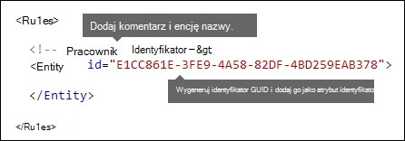

# <a name="create-a-custom-sensitive-information-type-using-powershell"></a>Tworzenie niestandardowego typu informacji poufnych przy użyciu programu PowerShell

[!include[Purview banner](../includes/purview-rebrand-banner.md)]

W tym artykule przedstawiono sposób tworzenia pliku *pakietu reguł* XML, który definiuje niestandardowe [typy informacji poufnych](sensitive-information-type-entity-definitions.md). W tym artykule opisano niestandardowy typ informacji poufnych, który identyfikuje identyfikator pracownika. Przykładowego kodu XML w tym artykule można użyć jako punktu początkowego dla własnego pliku XML.

Aby uzyskać więcej informacji na temat typów informacji poufnych, zobacz [Informacje o typach informacji poufnych](sensitive-information-type-learn-about.md).

Po utworzeniu dobrze sformułowanego pliku XML możesz przekazać go do Microsoft 365 przy użyciu programu PowerShell. Następnie możesz użyć niestandardowego typu informacji poufnych w zasadach. Możesz przetestować jego skuteczność w wykrywaniu poufnych informacji zgodnie z oczekiwaniami.

> [!NOTE]
> Jeśli nie potrzebujesz szczegółowej kontrolki zapewnianej przez program PowerShell, możesz utworzyć niestandardowe typy informacji poufnych w portalu zgodności usługi Microsoft Purview. Aby uzyskać więcej informacji, zobacz [Tworzenie niestandardowego typu informacji poufnych](create-a-custom-sensitive-information-type.md).

## <a name="important-disclaimer"></a>Ważne zastrzeżenie

pomoc techniczna firmy Microsoft nie może pomóc w tworzeniu definicji pasujących do zawartości.

W przypadku niestandardowego tworzenia, testowania i debugowania zawartości należy użyć własnych wewnętrznych zasobów IT lub skorzystać z usług konsultingowych, takich jak Microsoft Consulting Services (MCS). pomoc techniczna firmy Microsoft inżynierowie mogą zapewnić ograniczoną obsługę tej funkcji, ale nie mogą zagwarantować, że niestandardowe sugestie dopasowywania zawartości w pełni spełnią Twoje potrzeby.

Usługa MCS może dostarczać wyrażenia regularne do celów testowych. Mogą również zapewnić pomoc w rozwiązywaniu problemów z istniejącym wzorcem regex, który nie działa zgodnie z oczekiwaniami w przypadku jednego przykładu konkretnej zawartości.

Zobacz [Potencjalne problemy z weryfikacją, o które należy pamiętać](#potential-validation-issues-to-be-aware-of) w tym artykule.

Aby uzyskać więcej informacji na temat aparatu Boost.RegEx (wcześniej znanego jako RegEx++), który jest używany do przetwarzania tekstu, zobacz [Boost.Regex 5.1.3](https://www.boost.org/doc/libs/1_68_0/libs/regex/doc/html/).

> [!NOTE]
> Jeśli używasz znaku ampersand (&) jako części słowa kluczowego w niestandardowym typie informacji poufnych, musisz dodać dodatkowy termin ze spacjami wokół znaku. Na przykład _nie_ `L&P`używaj polecenia `L & P` .

## <a name="sample-xml-of-a-rule-package"></a>Przykładowy kod XML pakietu reguł

Oto przykładowy kod XML pakietu reguł, który utworzymy w tym artykule. Elementy i atrybuty zostały wyjaśnione w poniższych sekcjach.

```xml
<?xml version="1.0" encoding="UTF-16"?>
<RulePackage xmlns="http://schemas.microsoft.com/office/2011/mce">
<RulePack id="DAD86A92-AB18-43BB-AB35-96F7C594ADAA">
  <Version build="0" major="1" minor="0" revision="0"/>
  <Publisher id="619DD8C3-7B80-4998-A312-4DF0402BAC04"/>
  <Details defaultLangCode="en-us">
    <LocalizedDetails langcode="en-us">
      <PublisherName>Contoso</PublisherName>
      <Name>Employee ID Custom Rule Pack</Name>
      <Description>
      This rule package contains the custom Employee ID entity.
      </Description>
    </LocalizedDetails>
  </Details>
</RulePack>
<Rules>
<!-- Employee ID -->
  <Entity id="E1CC861E-3FE9-4A58-82DF-4BD259EAB378" patternsProximity="300" recommendedConfidence="75">
    <Pattern confidenceLevel="65">
      <IdMatch idRef="Regex_employee_id"/>
    </Pattern>
    <Pattern confidenceLevel="75">
      <IdMatch idRef="Regex_employee_id"/>
      <Match idRef="Func_us_date"/>
    </Pattern>
    <Pattern confidenceLevel="85">
      <IdMatch idRef="Regex_employee_id"/>
      <Match idRef="Func_us_date"/>
      <Any minMatches="1">
        <Match idRef="Keyword_badge" minCount="2"/>
        <Match idRef="Keyword_employee"/>
      </Any>
      <Any minMatches="0" maxMatches="0">
        <Match idRef="Keyword_false_positives_local"/>
        <Match idRef="Keyword_false_positives_intl"/>
      </Any>
    </Pattern>
  </Entity>
  <Regex id="Regex_employee_id">(\s)(\d{9})(\s)</Regex>
  <Keyword id="Keyword_employee">
    <Group matchStyle="word">
      <Term>Identification</Term>
      <Term>Contoso Employee</Term>
    </Group>
  </Keyword>
  <Keyword id="Keyword_badge">
    <Group matchStyle="string">
      <Term>card</Term>
      <Term>badge</Term>
      <Term caseSensitive="true">ID</Term>
    </Group>
  </Keyword>
  <Keyword id="Keyword_false_positives_local">
    <Group matchStyle="word">
      <Term>credit card</Term>
      <Term>national ID</Term>
    </Group>
  </Keyword>
  <Keyword id="Keyword_false_positives_intl">
    <Group matchStyle="word">
      <Term>identity card</Term>
      <Term>national ID</Term>
      <Term>EU debit card</Term>
    </Group>
  </Keyword>
  <LocalizedStrings>
    <Resource idRef="E1CC861E-3FE9-4A58-82DF-4BD259EAB378">
      <Name default="true" langcode="en-us">Employee ID</Name>
      <Description default="true" langcode="en-us">
      A custom classification for detecting Employee IDs.
      </Description>
      <Description default="false" langcode="de-de">
      Description for German locale.
      </Description>
    </Resource>
  </LocalizedStrings>
</Rules>
</RulePackage>
```

## <a name="what-are-your-key-requirements-rule-entity-pattern-elements"></a>Jakie są Twoje kluczowe wymagania? [Reguła, Jednostka, Elementy wzorca]

Ważne jest, aby poznać podstawową strukturę schematu XML dla reguły. Zrozumienie struktury pomoże niestandardowemu typowi informacji poufnych zidentyfikować właściwą zawartość.

Reguła definiuje co najmniej jedną jednostkę (znaną również jako typy informacji poufnych). Każda jednostka definiuje co najmniej jeden wzorc. Wzorzec jest tym, czego szukają zasady podczas oceniania zawartości (na przykład wiadomości e-mail i dokumenty).

W znacznikach XML "reguły" oznaczają wzorce definiujące typ informacji poufnych. Nie kojarzyj odwołań do reguł w tym artykule z "warunkami" lub "akcjami", które są powszechne w innych funkcjach firmy Microsoft.

### <a name="simplest-scenario-entity-with-one-pattern"></a>Najprostszy scenariusz: jednostka z jednym wzorcem

Oto prosty scenariusz: chcesz, aby zasady identyfikowały zawartość zawierającą dziewięciocyfrowe identyfikatory pracowników używane w organizacji. Wzorzec odwołuje się do wyrażenia regularnego w regule, które identyfikuje liczby dziewięciocyfrowe. Każda zawartość zawierająca 9-cyfrową liczbę spełnia wzorzec.


Jednak ten wzorzec może identyfikować **dowolną** dziewięciocyfrową liczbę, w tym dłuższe liczby lub inne typy liczb dziewięciocyfrowych, które nie są identyfikatorami pracowników. Ten typ niechcianego dopasowania jest znany jako *wynik fałszywie dodatni*.

### <a name="more-common-scenario-entity-with-multiple-patterns"></a>Bardziej typowy scenariusz: jednostka z wieloma wzorcami

Ze względu na potencjał wyników fałszywie dodatnich zwykle do definiowania jednostki jest używany więcej niż jeden wzorzec. Wiele wzorców dostarcza dowodów potwierdzających dla jednostki docelowej. Na przykład dodatkowe słowa kluczowe, daty lub inny tekst mogą pomóc w zidentyfikowaniu oryginalnej jednostki (na przykład dziewięciocyfrowego numeru pracownika).

Aby na przykład zwiększyć prawdopodobieństwo zidentyfikowania zawartości zawierającej identyfikator pracownika, można zdefiniować inne wzorce do wyszukania:

- Wzorzec, który identyfikuje datę zatrudnienia.
- Wzorzec, który identyfikuje zarówno datę zatrudnienia, jak i słowo kluczowe "identyfikator pracownika".


Istnieją ważne kwestie, które należy wziąć pod uwagę w przypadku wielu dopasowań wzorca:

- Wzorce, które wymagają większej liczby dowodów, mają wyższy poziom ufności. Na podstawie poziomu ufności można wykonać następujące akcje:
  - Użyj bardziej restrykcyjnych akcji (takich jak zawartość blokowa) z dopasowaniami o większej pewności.
  - Używaj mniej restrykcyjnych akcji (takich jak wysyłanie powiadomień) z dopasowaniami o niższym poziomie ufności.

- Elementy pomocnicze `IdMatch` i `Match` odwołują się do wyrażeń regularnych i słów kluczowych, które są w rzeczywistości elementami podrzędnymi `Rule` elementu, a `Pattern`nie . Te elementy pomocnicze są przywoływane przez `Pattern`element , ale są uwzględniane w elem.`Rule` To zachowanie oznacza, że do pojedynczej definicji elementu pomocniczego, takiego jak wyrażenie regularne lub lista słów kluczowych, można odwoływać się przez wiele jednostek i wzorców.

## <a name="what-entity-do-you-need-to-identify-entity-element-id-attribute"></a>Jaką jednostkę należy zidentyfikować? [Element jednostki, atrybut ID]

Jednostka jest typem informacji poufnych, takim jak numer karty kredytowej, który ma dobrze zdefiniowany wzorzec. Każda jednostka ma unikatowy identyfikator GUID jako swój identyfikator.

### <a name="name-the-entity-and-generate-its-guid"></a>Nadaj jednostce nazwę i wygeneruj jej identyfikator GUID

1. W wybranym edytorze XML dodaj elementy `Rules` i `Entity` .
2. Dodaj komentarz zawierający nazwę jednostki niestandardowej, na przykład Identyfikator pracownika. Później dodasz nazwę jednostki do sekcji zlokalizowanych ciągów, a ta nazwa będzie wyświetlana w centrum administracyjnym podczas tworzenia zasad.
3. Wygeneruj unikatowy identyfikator GUID dla jednostki. Na przykład w Windows PowerShell możesz uruchomić polecenie `[guid]::NewGuid()`. Później dodasz również identyfikator GUID do sekcji zlokalizowanych ciągów jednostki.



## <a name="what-pattern-do-you-want-to-match-pattern-element-idmatch-element-regex-element"></a>Jaki wzorzec chcesz dopasować? [Pattern, IdMatch, Regex, element]

Wzorzec zawiera listę informacji poufnych, których szuka typ. Wzorzec może zawierać wyrażenia regex, słowa kluczowe i wbudowane funkcje. Funkcje wykonują zadania, takie jak uruchamianie funkcji RegExes, aby znaleźć daty lub adresy. Typy informacji poufnych mogą mieć wiele wzorców z unikatowymi ufnościami.

Na poniższym diagramie wszystkie wzorce odwołują się do tego samego wyrażenia regularnego. Ta funkcja RegEx szuka 9-cyfrowej liczby `(\d{9})` otoczonej białym znakiem `(\s) ... (\s)`. To wyrażenie regularne jest przywoływane przez `IdMatch` element i jest typowym wymaganiem dla wszystkich wzorców, które poszukają jednostki Employee ID. `IdMatch` to identyfikator, który ma być zgodny ze wzorcem. Element `Pattern` musi mieć dokładnie jeden `IdMatch` element.


Zgodne dopasowanie wzorca zwraca poziom liczby i ufności, którego można użyć w warunkach w zasadach. Po dodaniu warunku wykrywania typu informacji poufnych do zasad można edytować poziom liczby i ufności, jak pokazano na poniższym diagramie. Poziom ufności (nazywany również dokładnością dopasowania) został wyjaśniony w dalszej części tego artykułu.


Wyrażenia regularne są zaawansowane, więc istnieją problemy, o których musisz wiedzieć. Na przykład regex, który identyfikuje zbyt dużą ilość zawartości, może mieć wpływ na wydajność. Aby dowiedzieć się więcej na temat tych problemów, zobacz [sekcję Potencjalne problemy z weryfikacją, o czym należy pamiętać w dalszej](#potential-validation-issues-to-be-aware-of) części tego artykułu.

## <a name="do-you-want-to-require-additional-evidence-match-element-mincount-attribute"></a>Czy chcesz wymagać dodatkowych dowodów? [Match, element, atrybut minCount]

Oprócz `IdMatch`tego wzorzec może używać `Match` elementu w celu wymagania dodatkowych dowodów potwierdzających, takich jak słowo kluczowe, regex, data lub adres.

Element `Pattern` może zawierać wiele `Match` elementów:

- Bezpośrednio w elemencie `Pattern` .
- Połączone przy użyciu `Any` elementu.

`Match` elementy są sprzężone przez niejawny operator AND. Innymi słowy, wszystkie `Match` elementy muszą być spełnione, aby można było dopasować wzorzec.

Za pomocą `Any` elementu można wprowadzić operatory AND lub OR. Element `Any` został opisany w dalszej części tego artykułu.

Możesz użyć opcjonalnego `minCount` atrybutu, aby określić, ile wystąpień dopasowania należy znaleźć dla poszczególnych `Match` elementów. Można na przykład określić, że wzorzec jest spełniony tylko wtedy, gdy znaleziono co najmniej dwa słowa kluczowe z listy słów kluczowych.


### <a name="keywords-keyword-group-and-term-elements-matchstyle-and-casesensitive-attributes"></a>Słowa kluczowe [elementy słowa kluczowego, grupy i terminu, atrybuty matchStyle i caseSensitive]

Jak opisano wcześniej, identyfikacja informacji poufnych często wymaga dodatkowych słów kluczowych jako dowodów potwierdzających. Na przykład oprócz dopasowania liczby dziewięciocyfrowej można wyszukiwać wyrazy takie jak "card", "badge" lub "ID" przy użyciu elementu Keyword. Element `Keyword` ma `ID` atrybut, do którego może odwoływać się wiele `Match` elementów w wielu wzorcach lub jednostkach.

Słowa kluczowe są uwzględniane jako lista elementów `Term` w elemencie `Group` . Element `Group` ma `matchStyle` atrybut z dwiema możliwymi wartościami:

- **matchStyle="word"**: Dopasowanie wyrazów identyfikuje całe wyrazy otoczone białym znakiem lub innymi ogranicznikami. Zawsze należy używać **słowa** , chyba że musisz dopasować części wyrazów lub słów w językach azjatyckich.

- **matchStyle="string"**: dopasowanie ciągu identyfikuje ciągi bez względu na to, przez co są otoczone. Na przykład wartość "ID" będzie zgodna z wartościami "bid" i "idea". Używaj `string` tylko wtedy, gdy musisz dopasować słowa azjatyckie lub jeśli słowo kluczowe może zostać uwzględnione w innych ciągach.

Na koniec możesz użyć atrybutu `caseSensitive` `Term` elementu, aby określić, że zawartość musi być dokładnie zgodna ze słowem kluczowym, w tym małymi literami i wielkimi literami.


### <a name="regular-expressions-regex-element"></a>Wyrażenia regularne [regex, element]

W tym przykładzie jednostka pracownika `ID` już używa `IdMatch` tego elementu do odwoływania się do wyrażenia regularnego wzorca: dziewięciocyfrowej liczby otoczonej białym znakiem. Ponadto wzorzec może używać `Match` elementu do odwoływania się do dodatkowego `Regex` elementu w celu zidentyfikowania dowodów potwierdzających, takich jak pięciocyfrowy lub dziewięciocyfrowy numer w formacie amerykańskiego kodu pocztowego.

### <a name="additional-patterns-such-as-dates-or-addresses-built-in-functions"></a>Dodatkowe wzorce, takie jak daty lub adresy [wbudowane funkcje]

Typy informacji poufnych mogą również używać wbudowanych funkcji do identyfikowania dowodów potwierdzających. Na przykład data, data UE, data wygaśnięcia lub adres USA. Microsoft 365 nie obsługuje przekazywania własnych funkcji niestandardowych. Jednak podczas tworzenia niestandardowego typu informacji poufnych jednostka może odwoływać się do wbudowanych funkcji.

Na przykład wskaźnik identyfikatora pracownika ma datę zatrudnienia, więc ta jednostka niestandardowa może używać wbudowanej `Func_us_date` funkcji do identyfikowania daty w formacie powszechnie używanym w Stanach Zjednoczonych.

Aby uzyskać więcej informacji, zobacz [Funkcje typów informacji poufnych](sit-functions.md).


## <a name="different-combinations-of-evidence-any-element-minmatches-and-maxmatches-attributes"></a>Różne kombinacje dowodów [Dowolny element, minMatches i atrybuty maxMatches]

W elemencie `Pattern` wszystkie `IdMatch` elementy i `Match` są przyłączone przez niejawny operator AND. Innymi słowy, wszystkie dopasowania muszą być spełnione, zanim wzorzec będzie mógł zostać spełniony.

Możesz utworzyć bardziej elastyczną logikę `Any` dopasowywania, używając elementu do grupowania `Match` elementów. Na przykład można użyć `Any` elementu, aby dopasować wszystkie, brak lub dokładny podzbiór jego elementów podrzędnych `Match` .

Element `Any` ma opcjonalne `minMatches` i `maxMatches` atrybuty, których można użyć do zdefiniowania liczby elementów podrzędnych `Match` , które muszą zostać spełnione przed dopasowaniem wzorca. Te atrybuty definiują *liczbę* elementów `Match` , a nie liczbę wystąpień dowodów znalezionych dla dopasowań. Aby zdefiniować minimalną liczbę wystąpień dla określonego dopasowania, na przykład dwa słowa kluczowe z listy, użyj atrybutu `minCount` elementu `Match` (zobacz powyżej).

### <a name="match-at-least-one-child-match-element"></a>Dopasuj co najmniej jeden podrzędny element Match

Aby wymagać tylko minimalnej liczby elementów `Match` , możesz użyć atrybutu `minMatches` . W efekcie te `Match` elementy są sprzężone przez niejawny operator OR. Ten `Any` element jest spełniony, jeśli znaleziono datę sformatowaną w Stanach Zjednoczonych lub słowo kluczowe z dowolnej listy.

```xml
<Any minMatches="1" >
     <Match idRef="Func_us_date" />
     <Match idRef="Keyword_employee" />
     <Match idRef="Keyword_badge" />
</Any>
```

### <a name="match-an-exact-subset-of-any-children-match-elements"></a>Dopasuj dokładny podzbiór elementów podrzędnych Dopasuj elementy

Aby wymagać dokładnej liczby elementów `Match` , ustaw `minMatches` wartość i `maxMatches` na tę samą wartość. Ten `Any` element jest spełniony tylko wtedy, gdy znaleziono dokładnie jedną datę lub słowo kluczowe. Jeśli istnieje więcej dopasowań, wzorzec nie jest dopasowany.

```xml
<Any minMatches="1" maxMatches="1" >
     <Match idRef="Func_us_date" />
     <Match idRef="Keyword_employee" />
     <Match idRef="Keyword_badge" />
</Any>
```

### <a name="match-none-of-children-match-elements"></a>Dopasuj żaden z elementów podrzędnych Dopasuj elementy

Jeśli chcesz wymagać braku konkretnych dowodów, aby wzorzec był spełniony, możesz ustawić wartość minMatches i maxMatches na 0. Może to być przydatne, jeśli masz listę słów kluczowych lub inne dowody, które mogą wskazywać na wynik fałszywie dodatni.

Na przykład jednostka identyfikatora pracownika wyszuka słowa kluczowego "card", ponieważ może odnosić się do "karty identyfikatora". Jeśli jednak karta pojawia się tylko w frazie "karta kredytowa", "karta" w tej zawartości jest mało prawdopodobne, aby oznaczała "dowód osobisty". Dzięki temu możesz dodać "kartę kredytową" jako słowo kluczowe do listy terminów, które chcesz wykluczyć z spełniania wzorca.

```xml
<Any minMatches="0" maxMatches="0" >
    <Match idRef="Keyword_false_positives_local" />
    <Match idRef="Keyword_false_positives_intl" />
</Any>
```

### <a name="match-a-number-of-unique-terms"></a>Dopasuj liczbę unikatowych terminów

Jeśli chcesz dopasować kilka unikatowych terminów, użyj parametru *uniqueResults* i ustaw wartość *true*, jak pokazano w poniższym przykładzie:

```xml
<Pattern confidenceLevel="75">
    <IdMatch idRef="Salary_Revision_terms" />
    <Match idRef=" Salary_Revision_ID " minCount="3" uniqueResults="true" />
</Pattern>
```

W tym przykładzie zdefiniowano wzorzec dla korekty wynagrodzenia przy użyciu co najmniej trzech unikatowych dopasowań.

## <a name="how-close-to-the-entity-must-the-other-evidence-be-patternsproximity-attribute"></a>Jak blisko jednostki muszą znajdować się inne dowody? [patternsProximity, atrybut]

Typ informacji poufnych szuka wzorca reprezentującego identyfikator pracownika, a w ramach tego wzorca szuka również dowodów potwierdzających, takich jak słowo kluczowe, takie jak "ID". To ma sens, że im bliżej siebie ten dowód jest, tym bardziej prawdopodobne jest, że wzorzec jest rzeczywisty identyfikator pracownika. Możesz określić, jak blisko innych dowodów we wzorcu musi być jednostka przy użyciu wymaganego atrybutu patternsProximity elementu Entity.


Dla każdego wzorca w jednostce wartość atrybutu patternsProximity definiuje odległość (w znakach Unicode) od lokalizacji IdMatch dla wszystkich innych dopasowań określonych dla tego wzorca. Okno zbliżeniowe jest zakotwiczone przez lokalizację IdMatch, a okno rozciąga się na lewo i prawo od elementu IdMatch.


W poniższym przykładzie pokazano, jak okno zbliżeniowe wpływa na dopasowanie wzorca, w którym element IdMatch dla jednostki niestandardowej identyfikatora pracownika wymaga co najmniej jednego potwierdzenia dopasowania słowa kluczowego lub daty. Tylko identyfikator ID1 jest zgodny, ponieważ w przypadku identyfikatorów ID2 i ID3 w oknie zbliżeniowym nie znaleziono żadnych lub tylko częściowych dowodów potwierdzających.


Pamiętaj, że w przypadku wiadomości e-mail treść wiadomości i każdy załącznik są traktowane jako osobne elementy. Oznacza to, że okno zbliżeniowe nie wykracza poza koniec każdego z tych elementów. Dla każdego elementu (załącznika lub treści) zarówno element idMatch, jak i dowody potwierdzające muszą znajdować się w tym elemencie.

## <a name="what-are-the-right-confidence-levels-for-different-patterns-confidencelevel-attribute-recommendedconfidence-attribute"></a>Jakie są odpowiednie poziomy ufności dla różnych wzorców? [confidenceLevel, atrybut recommendedConfidence]

Tym więcej dowodów, że wzorzec wymaga, tym większa pewność, że rzeczywista jednostka (na przykład identyfikator pracownika) została zidentyfikowana, gdy wzorzec jest dopasowany. Na przykład masz większe zaufanie do wzorca, który wymaga dziewięciocyfrowego numeru identyfikatora, daty zatrudnienia i słowa kluczowego w pobliżu, niż w przypadku wzorca, który wymaga tylko 9-cyfrowego numeru identyfikatora.

Element Pattern ma wymagany atrybut confidenceLevel. Wartość confidenceLevel (liczba całkowita z zakresu od 1 do 100) można traktować jako unikatowy identyfikator dla każdego wzorca w jednostce — wzorce w jednostce muszą mieć różne poziomy ufności przypisane. Dokładna wartość liczby całkowitej nie ma znaczenia — wystarczy wybrać liczby, które mają sens dla zespołu ds. zgodności. Po przekazaniu niestandardowego typu informacji poufnych, a następnie utworzeniu zasad można odwołać się do tych poziomów zaufania w warunkach utworzonych reguł.


Oprócz funkcji confidenceLevel dla każdego wzorca jednostka ma atrybut recommendedConfidence. Zalecany atrybut ufności można traktować jako domyślny poziom ufności dla reguły. Gdy tworzysz regułę w zasadach, jeśli nie określisz poziomu ufności dla reguły do użycia, ta reguła będzie zgodna na podstawie zalecanego poziomu ufności dla jednostki. Należy pamiętać, że atrybut recommendedConfidence jest obowiązkowy dla każdego identyfikatora jednostki w pakiecie reguł, jeśli go brakuje, nie będzie można zapisać zasad korzystających z typu informacji poufnych.

## <a name="do-you-want-to-support-other-languages-in-the-ui-of-the-compliance-center-localizedstrings-element"></a>Czy chcesz obsługiwać inne języki w interfejsie użytkownika Centrum zgodności? [LocalizedStrings, element]

Jeśli zespół ds. zgodności używa portalu zgodności usługi Microsoft Purview do tworzenia zasad w różnych ustawieniach regionalnych i w różnych językach, możesz podać zlokalizowane wersje nazwy i opisu niestandardowego typu informacji poufnych. Gdy zespół ds. zgodności używa Microsoft 365 w obsługiwanym języku, zobaczy zlokalizowaną nazwę w interfejsie użytkownika.


Element Reguły musi zawierać element LocalizedStrings, który zawiera element Resource odwołujący się do identyfikatora GUID jednostki niestandardowej. Z kolei każdy element Resource zawiera co najmniej jeden element Name i Description, z których każdy używa atrybutu langcode, aby podać zlokalizowany ciąg dla określonego języka.


Pamiętaj, że używasz zlokalizowanych ciągów tylko w celu wyświetlania niestandardowego typu informacji poufnych w interfejsie użytkownika Centrum zgodności. Nie można używać zlokalizowanych ciągów do udostępniania różnych zlokalizowanych wersji listy słów kluczowych lub wyrażenia regularnego.

## <a name="other-rule-package-markup-rulepack-guid"></a>Inne znaczniki pakietu reguł [RulePack GUID]

Na koniec początek każdego pakietu RulePackage zawiera pewne ogólne informacje, które należy wypełnić. Możesz użyć następujących znaczników jako szablonu i zastąpić element ". . ." symbole zastępcze z własnymi informacjami.

Co najważniejsze, musisz wygenerować identyfikator GUID dla pakietu RulePack. Powyżej wygenerowano identyfikator GUID dla jednostki; Jest to drugi identyfikator GUID pakietu RulePack. Istnieje kilka sposobów generowania identyfikatorów GUID, ale można to łatwo zrobić w programie PowerShell, wpisując ciąg [guid]::NewGuid().

Element Version jest również ważny. Podczas przekazywania pakietu reguł po raz pierwszy Microsoft 365 zwraca numer wersji. Później, jeśli zaktualizujesz pakiet reguł i przekażesz nową wersję, zaktualizuj numer wersji lub Microsoft 365 nie wdrożysz pakietu reguł.

```xml
<?xml version="1.0" encoding="utf-16"?>
<RulePackage xmlns="http://schemas.microsoft.com/office/2011/mce">
  <RulePack id=". . .">
    <Version major="1" minor="0" build="0" revision="0" />
    <Publisher id=". . ." />
    <Details defaultLangCode=". . .">
      <LocalizedDetails langcode=" . . . ">
         <PublisherName>. . .</PublisherName>
         <Name>. . .</Name>
         <Description>. . .</Description>
      </LocalizedDetails>
    </Details>
  </RulePack>

 <Rules>
  . . .
 </Rules>
</RulePackage>
```

Po zakończeniu element RulePack powinien wyglądać następująco.


## <a name="validators"></a>Walidatory

Microsoft 365 uwidacznia procesory funkcji dla często używanych interfejsów SIC jako modułów walidatorów. Oto ich lista.

### <a name="list-of-currently-available-validators"></a>Lista aktualnie dostępnych modułów walidatorów

- `Func_credit_card`
- `Func_ssn`
- `Func_unformatted_ssn`
- `Func_randomized_formatted_ssn`
- `Func_randomized_unformatted_ssn`
- `Func_aba_routing`
- `Func_south_africa_identification_number`
- `Func_brazil_cpf`
- `Func_iban`
- `Func_brazil_cnpj`
- `Func_swedish_national_identifier`
- `Func_india_aadhaar`
- `Func_uk_nhs_number`
- `Func_Turkish_National_Id`
- `Func_australian_tax_file_number`
- `Func_usa_uk_passport`
- `Func_canadian_sin`
- `Func_formatted_itin`
- `Func_unformatted_itin`
- `Func_dea_number_v2`
- `Func_dea_number`
- `Func_japanese_my_number_personal`
- `Func_japanese_my_number_corporate`

Dzięki temu możesz zdefiniować własne regex i zweryfikować je. Aby użyć modułów walidatorów, zdefiniuj własne regex i użyj `Validator` właściwości , aby dodać wybrany procesor funkcji. Po zdefiniowaniu tego wyrażenia regex można użyć w usłudze SIT.

W poniższym przykładzie wyrażenie regularne — Regex_credit_card_AdditionalDelimiters jest zdefiniowane dla karty kredytowej, która jest następnie weryfikowana przy użyciu funkcji sumy kontrolnej dla karty kredytowej przy użyciu Func_credit_card jako walidatora.

```xml
<Regex id="Regex_credit_card_AdditionalDelimiters" validators="Func_credit_card"> (?:^|[\s,;\:\(\)\[\]"'])([0-9]{4}[ -_][0-9]{4}[ -_][0-9]{4}[ -_][0-9]{4})(?:$|[\s,;\:\(\)\[\]"'])</Regex>
<Entity id="675634eb7-edc8-4019-85dd-5a5c1f2bb085" patternsProximity="300" recommendedConfidence="85">
<Pattern confidenceLevel="85">
<IdMatch idRef="Regex_credit_card_AdditionalDelimiters" />
<Any minMatches="1">
<Match idRef="Keyword_cc_verification" />
<Match idRef="Keyword_cc_name" />
<Match idRef="Func_expiration_date" />
</Any>
</Pattern>
</Entity>
```

Microsoft 365 udostępnia dwa ogólne moduły sprawdzania poprawności

### <a name="checksum-validator"></a>Sprawdzanie poprawności sumy kontrolnej

W tym przykładzie moduł sprawdzania poprawności sumy kontrolnej dla identyfikatora pracownika jest zdefiniowany w celu zweryfikowania wartości RegEx dla identyfikatora EmployeeID.

```xml
<Validators id="EmployeeIDChecksumValidator">
<Validator type="Checksum">
<Param name="Weights">2, 2, 2, 2, 2, 1</Param>
<Param name="Mod">28</Param>
<Param name="CheckDigit">2</Param> <!-- Check 2nd digit -->
<Param name="AllowAlphabets">1</Param> <!— 0 if no Alphabets -->
</Validator>
</Validators>
<Regex id="Regex_EmployeeID" validators="ChecksumValidator">(\d{5}[A-Z])</Regex>
<Entity id="675634eb7-edc8-4019-85dd-5a5c1f2bb085" patternsProximity="300" recommendedConfidence="85">
<Pattern confidenceLevel="85">
<IdMatch idRef="Regex_EmployeeID"/>
</Pattern>
</Entity>
```

### <a name="date-validator"></a>Moduł sprawdzania poprawności dat

W tym przykładzie moduł sprawdzania poprawności daty jest zdefiniowany dla części RegEx, której częścią jest data.

```xml
<Validators id="date_validator_1"> <Validator type="DateSimple"> <Param name="Pattern">DDMMYYYY</Param> <!—supported patterns DDMMYYYY, MMDDYYYY, YYYYDDMM, YYYYMMDD, DDMMYYYY, DDMMYY, MMDDYY, YYDDMM, YYMMDD --> </Validator> </Validators>
<Regex id="date_regex_1" validators="date_validator_1">\d{8}</Regex>
```

## <a name="changes-for-exchange-online"></a>Zmiany dotyczące Exchange Online

Wcześniej można było użyć Exchange Online programu PowerShell do zaimportowania niestandardowych typów informacji poufnych dla programu DLP. Teraz niestandardowe typy informacji poufnych mogą być używane zarówno w <a href="https://go.microsoft.com/fwlink/p/?linkid=2059104" target="_blank">centrum administracyjnym Exchange</a>, jak i w Centrum zgodności. W ramach tego udoskonalenia należy użyć programu PowerShell security & Compliance do zaimportowania niestandardowych typów informacji poufnych — nie można ich już importować z programu Exchange Online programu PowerShell. Niestandardowe typy informacji poufnych będą nadal działać tak samo jak wcześniej. Jednak może upłynąć do jednej godziny, zanim zmiany wprowadzone w niestandardowych typach informacji poufnych w Centrum zgodności pojawią się w centrum administracyjnym Exchange.

Należy pamiętać, że w Centrum zgodności użyj polecenia cmdlet **[New-DlpSensitiveInformationTypeRulePackage](/powershell/module/exchange/new-dlpsensitiveinformationtyperulepackage)** , aby przekazać pakiet reguł. (Wcześniej w centrum administracyjnym Exchange użyto polecenia cmdlet **ClassificationRuleCollection**).

## <a name="upload-your-rule-package"></a>Przekazywanie pakietu reguł

Aby przekazać pakiet reguł, wykonaj następujące czynności:

1. Zapisz go jako plik .xml z kodowaniem Unicode.

2. [Połączenie do programu PowerShell zgodności & zabezpieczeń](/powershell/exchange/exchange-online-powershell)

3. Należy stosować następującą składnię:

   ```powershell
   New-DlpSensitiveInformationTypeRulePackage -FileData ([System.IO.File]::ReadAllBytes('PathToUnicodeXMLFile'))
   ```

   Ten przykład przekazuje plik XML Unicode o nazwie MyNewRulePack.xml z pliku C:\Moje dokumenty.

   ```powershell
   New-DlpSensitiveInformationTypeRulePackage -FileData ([System.IO.File]::ReadAllBytes('C:\My Documents\MyNewRulePack.xml'))
   ```

   Aby uzyskać szczegółowe informacje o składni i parametrach, zobacz [New-DlpSensitiveInformationTypeRulePackage](/powershell/module/exchange/new-dlpsensitiveinformationtyperulepackage).

   > [!NOTE]
   > Maksymalna liczba obsługiwanych pakietów reguł wynosi 10, ale każdy pakiet może zawierać definicję wielu typów informacji poufnych.

4. Aby sprawdzić, czy pomyślnie utworzono nowy typ informacji poufnych, wykonaj dowolne z następujących kroków:

   - Uruchom polecenie cmdlet [Get-DlpSensitiveInformationTypeRulePackage](/powershell/module/exchange/get-dlpsensitiveinformationtyperulepackage) , aby sprawdzić, czy nowy pakiet reguł znajduje się na liście:

     ```powershell
     Get-DlpSensitiveInformationTypeRulePackage
     ```

   - Uruchom polecenie cmdlet [Get-DlpSensitiveInformationType](/powershell/module/exchange/get-dlpsensitiveinformationtype) , aby sprawdzić, czy typ informacji poufnych znajduje się na liście:

     ```powershell
     Get-DlpSensitiveInformationType
     ```

     W przypadku niestandardowych typów informacji poufnych wartość właściwości Publisher będzie inna niż Microsoft Corporation.

   - Zastąp \<Name\> wartością Nazwa typu informacji poufnych (przykład: Identyfikator pracownika) i uruchom polecenie cmdlet [Get-DlpSensitiveInformationType](/powershell/module/exchange/get-dlpsensitiveinformationtype) :

     ```powershell
     Get-DlpSensitiveInformationType -Identity "<Name>"
     ```

## <a name="potential-validation-issues-to-be-aware-of"></a>Potencjalne problemy z weryfikacją, o które należy pamiętać

Podczas przekazywania pliku XML pakietu reguł system weryfikuje kod XML i sprawdza, czy występują znane nieprawidłowe wzorce i oczywiste problemy z wydajnością. Poniżej przedstawiono kilka znanych problemów sprawdzanych przez walidację — wyrażenie regularne:

- Asercje Lookbehind w wyrażeniu regularnym powinny mieć tylko stałą długość. Asercje o zmiennej długości spowodują błędy.

  Na przykład `"(?<=^|\s|_)"` nie przejdzie weryfikacji. Pierwszy wzorzec (`^`) ma zero długości, a dwa następne wzorce (`\s` i `_`) mają długość jednego. Alternatywnym sposobem napisania tego wyrażenia regularnego jest `"(?:^|(?<=\s|_))"`.

- Nie można rozpocząć lub zakończyć z alternatorem `|`, który pasuje do wszystkiego, ponieważ jest uważany za puste dopasowanie.

  Na przykład `|a` lub `b|` nie przejdzie weryfikacji.

- Nie można rozpocząć lub zakończyć wzorcem `.{0,m}` , który nie ma celu funkcjonalnego i tylko obniża wydajność.

  Na przykład `.{0,50}ASDF` lub `ASDF.{0,50}` nie przejdzie weryfikacji.

- Nie można mieć `.{0,m}` lub `.{1,m}` w grupach i nie może mieć `.\*` ani `.+` w grupach.

  Na przykład `(.{0,50000})` nie przejdzie weryfikacji.

- Nie można mieć żadnych znaków z `{0,m}` lub `{1,m}` powtarzaczy w grupach.

  Na przykład `(a\*)` nie przejdzie weryfikacji.

- Nie można rozpocząć ani zakończyć od `.{1,m}`; zamiast tego użyj polecenia `.`.

  Na przykład `.{1,m}asdf` nie przejdzie weryfikacji. Zamiast tego użyj polecenia `.asdf`.

- Nie można mieć niepowiązanego powtarzacza (takiego jak `*` lub `+`) w grupie.

  Na przykład `(xx)\*` i `(xx)+` nie przejdzie weryfikacji.

- Słowa kluczowe mają maksymalnie 50 znaków w obszarze Długość.  Jeśli w grupie znajduje się słowo kluczowe przekraczające to, sugerowanym rozwiązaniem jest utworzenie grupy terminów jako [słownika słów kluczowych](./create-a-keyword-dictionary.md) i odwołanie się do identyfikatora GUID słownika słów kluczowych w strukturze XML w ramach elementu Entity for Match lub idMatch w pliku.

- Każdy niestandardowy typ informacji poufnych może mieć maksymalnie 2048 słów kluczowych.

- Maksymalny rozmiar słowników słów kluczowych w jednej dzierżawie to 480 KB skompresowanych w celu zapewnienia zgodności z limitami schematu usługi AD. Odwołaj się do tego samego słownika tyle razy, ile jest to konieczne podczas tworzenia niestandardowych typów informacji poufnych. Zacznij od utworzenia niestandardowych list słów kluczowych w typie informacji poufnych i użyj słowników słów kluczowych, jeśli masz więcej niż 2048 słów kluczowych na liście słów kluczowych lub słowo kluczowe ma długość większą niż 50 znaków.

- Maksymalnie 50 typów informacji poufnych opartych na słowniku słów kluczowych jest dozwolonych w dzierżawie.

- Upewnij się, że każdy element jednostki zawiera atrybut recommendedConfidence.

- W przypadku korzystania z polecenia cmdlet programu PowerShell maksymalny rozmiar zwracanych danych deserializowanych wynosi około 1 megabajt.   Wpłynie to na rozmiar pliku XML pakietu reguł. Pozostaw przekazany plik ograniczony do maksymalnej liczby 770 kilobajtów jako sugerowany limit spójnych wyników bez błędów podczas przetwarzania.

- Struktura XML nie wymaga formatowania znaków, takich jak spacje, karty ani wpisy powrotu karetki/kanału wiersza.  Zanotuj to podczas optymalizowania miejsca podczas przekazywania. Narzędzia, takie jak Microsoft Visual Code, udostępniają funkcje linii sprzężenia w celu kompaktowania pliku XML.

Jeśli niestandardowy typ informacji poufnych zawiera problem, który może mieć wpływ na wydajność, nie zostanie przekazany i może zostać wyświetlony jeden z następujących komunikatów o błędach:

- `Generic quantifiers which match more content than expected (e.g., '+', '*')`

- `Lookaround assertions`

- `Complex grouping in conjunction with general quantifiers`

## <a name="recrawl-your-content-to-identify-the-sensitive-information"></a>Przeszukuj ponownie zawartość, aby zidentyfikować informacje poufne

Microsoft 365 używa przeszukiwarki do identyfikowania i klasyfikowania poufnych informacji w zawartości witryny. Zawartość w witrynach SharePoint Online i OneDrive dla Firm jest automatycznie ponownie przeszukiwana po każdej aktualizacji. Aby jednak zidentyfikować nowy niestandardowy typ informacji poufnych w całej istniejącej zawartości, ta zawartość musi zostać ponownie zszokowana.

W Microsoft 365 nie można ręcznie zażądać ponownego zszyfrowania całej organizacji, ale możesz ręcznie zażądać ponownego zszukania zbioru witryn, listy lub biblioteki. Aby uzyskać więcej informacji, zobacz [Ręczne przeszukiwanie żądań i ponowne indeksowanie witryny, biblioteki lub listy](/sharepoint/crawl-site-content).

## <a name="reference-rule-package-xml-schema-definition"></a>Odwołanie: Definicja schematu XML pakietu reguł

Możesz skopiować ten znacznik, zapisać go jako plik XSD i użyć go do zweryfikowania pliku XML pakietu reguł.

```xml
<?xml version="1.0" encoding="utf-8"?>
<xs:schema xmlns:mce="http://schemas.microsoft.com/office/2011/mce"
           targetNamespace="http://schemas.microsoft.com/office/2011/mce"
           xmlns:xs="https://www.w3.org/2001/XMLSchema"
           elementFormDefault="qualified"
           attributeFormDefault="unqualified"
           id="RulePackageSchema">
  <!-- Use include if this schema has the same target namespace as the schema being referenced, otherwise use import -->
  <xs:element name="RulePackage" type="mce:RulePackageType"/>
  <xs:simpleType name="LangType">
    <xs:union memberTypes="xs:language">
      <xs:simpleType>
        <xs:restriction base="xs:string">
          <xs:enumeration value=""/>
        </xs:restriction>
      </xs:simpleType>
    </xs:union>
  </xs:simpleType>
  <xs:simpleType name="GuidType" final="#all">
    <xs:restriction base="xs:token">
      <xs:pattern value="[0-9a-fA-F]{8}\-([0-9a-fA-F]{4}\-){3}[0-9a-fA-F]{12}"/>
    </xs:restriction>
  </xs:simpleType>
  <xs:complexType name="RulePackageType">
    <xs:sequence>
      <xs:element name="RulePack" type="mce:RulePackType"/>
      <xs:element name="Rules" type="mce:RulesType">
        <xs:key name="UniqueRuleId">
          <xs:selector xpath="mce:Entity|mce:Affinity|mce:Version/mce:Entity|mce:Version/mce:Affinity"/>
          <xs:field xpath="@id"/>
        </xs:key>
        <xs:key name="UniqueProcessorId">
          <xs:selector xpath="mce:Regex|mce:Keyword|mce:Fingerprint"></xs:selector>
          <xs:field xpath="@id"/>
        </xs:key>
        <xs:key name="UniqueResourceIdRef">
          <xs:selector xpath="mce:LocalizedStrings/mce:Resource"/>
          <xs:field xpath="@idRef"/>
        </xs:key>
        <xs:keyref name="ReferencedRuleMustExist" refer="mce:UniqueRuleId">
          <xs:selector xpath="mce:LocalizedStrings/mce:Resource"/>
          <xs:field xpath="@idRef"/>
        </xs:keyref>
        <xs:keyref name="RuleMustHaveResource" refer="mce:UniqueResourceIdRef">
          <xs:selector xpath="mce:Entity|mce:Affinity|mce:Version/mce:Entity|mce:Version/mce:Affinity"/>
          <xs:field xpath="@id"/>
        </xs:keyref>
      </xs:element>
    </xs:sequence>
  </xs:complexType>
  <xs:complexType name="RulePackType">
    <xs:sequence>
      <xs:element name="Version" type="mce:VersionType"/>
      <xs:element name="Publisher" type="mce:PublisherType"/>
      <xs:element name="Details" type="mce:DetailsType">
        <xs:key name="UniqueLangCodeInLocalizedDetails">
          <xs:selector xpath="mce:LocalizedDetails"/>
          <xs:field xpath="@langcode"/>
        </xs:key>
        <xs:keyref name="DefaultLangCodeMustExist" refer="mce:UniqueLangCodeInLocalizedDetails">
          <xs:selector xpath="."/>
          <xs:field xpath="@defaultLangCode"/>
        </xs:keyref>
      </xs:element>
      <xs:element name="Encryption" type="mce:EncryptionType" minOccurs="0" maxOccurs="1"/>
    </xs:sequence>
    <xs:attribute name="id" type="mce:GuidType" use="required"/>
  </xs:complexType>
  <xs:complexType name="VersionType">
    <xs:attribute name="major" type="xs:unsignedShort" use="required"/>
    <xs:attribute name="minor" type="xs:unsignedShort" use="required"/>
    <xs:attribute name="build" type="xs:unsignedShort" use="required"/>
    <xs:attribute name="revision" type="xs:unsignedShort" use="required"/>
  </xs:complexType>
  <xs:complexType name="PublisherType">
    <xs:attribute name="id" type="mce:GuidType" use="required"/>
  </xs:complexType>
  <xs:complexType name="LocalizedDetailsType">
    <xs:sequence>
      <xs:element name="PublisherName" type="mce:NameType"/>
      <xs:element name="Name" type="mce:RulePackNameType"/>
      <xs:element name="Description" type="mce:OptionalNameType"/>
    </xs:sequence>
    <xs:attribute name="langcode" type="mce:LangType" use="required"/>
  </xs:complexType>
  <xs:complexType name="DetailsType">
    <xs:sequence>
      <xs:element name="LocalizedDetails" type="mce:LocalizedDetailsType" maxOccurs="unbounded"/>
    </xs:sequence>
    <xs:attribute name="defaultLangCode" type="mce:LangType" use="required"/>
  </xs:complexType>
  <xs:complexType name="EncryptionType">
    <xs:sequence>
      <xs:element name="Key" type="xs:normalizedString"/>
      <xs:element name="IV" type="xs:normalizedString"/>
    </xs:sequence>
  </xs:complexType>
  <xs:simpleType name="RulePackNameType">
    <xs:restriction base="xs:token">
      <xs:minLength value="1"/>
      <xs:maxLength value="64"/>
    </xs:restriction>
  </xs:simpleType>
  <xs:simpleType name="NameType">
    <xs:restriction base="xs:normalizedString">
      <xs:minLength value="1"/>
      <xs:maxLength value="256"/>
    </xs:restriction>
  </xs:simpleType>
  <xs:simpleType name="OptionalNameType">
    <xs:restriction base="xs:normalizedString">
      <xs:minLength value="0"/>
      <xs:maxLength value="256"/>
    </xs:restriction>
  </xs:simpleType>
  <xs:simpleType name="RestrictedTermType">
    <xs:restriction base="xs:string">
      <xs:minLength value="1"/>
      <xs:maxLength value="100"/>
    </xs:restriction>
  </xs:simpleType>
  <xs:complexType name="RulesType">
    <xs:sequence>
      <xs:choice maxOccurs="unbounded">
        <xs:element name="Entity" type="mce:EntityType"/>
        <xs:element name="Affinity" type="mce:AffinityType"/>
        <xs:element name="Version" type="mce:VersionedRuleType"/>
      </xs:choice>
      <xs:choice minOccurs="0" maxOccurs="unbounded">
        <xs:element name="Regex" type="mce:RegexType"/>
        <xs:element name="Keyword" type="mce:KeywordType"/>
        <xs:element name="Fingerprint" type="mce:FingerprintType"/>
        <xs:element name="ExtendedKeyword" type="mce:ExtendedKeywordType"/>
      </xs:choice>
      <xs:element name="LocalizedStrings" type="mce:LocalizedStringsType"/>
    </xs:sequence>
  </xs:complexType>
  <xs:complexType name="EntityType">
    <xs:sequence>
      <xs:element name="Pattern" type="mce:PatternType" maxOccurs="unbounded"/>
      <xs:element name="Version" type="mce:VersionedPatternType" minOccurs="0" maxOccurs="unbounded" />
    </xs:sequence>
    <xs:attribute name="id" type="mce:GuidType" use="required"/>
    <xs:attribute name="patternsProximity" type="mce:ProximityType" use="required"/>
    <xs:attribute name="recommendedConfidence" type="mce:ProbabilityType"/>
    <xs:attribute name="workload" type="mce:WorkloadType"/>
  </xs:complexType>
  <xs:complexType name="PatternType">
    <xs:sequence>
      <xs:element name="IdMatch" type="mce:IdMatchType"/>
      <xs:choice minOccurs="0" maxOccurs="unbounded">
        <xs:element name="Match" type="mce:MatchType"/>
        <xs:element name="Any" type="mce:AnyType"/>
      </xs:choice>
    </xs:sequence>
    <xs:attribute name="confidenceLevel" type="mce:ProbabilityType" use="required"/>
  </xs:complexType>
  <xs:complexType name="AffinityType">
    <xs:sequence>
      <xs:element name="Evidence" type="mce:EvidenceType" maxOccurs="unbounded"/>
      <xs:element name="Version" type="mce:VersionedEvidenceType" minOccurs="0" maxOccurs="unbounded" />
    </xs:sequence>
    <xs:attribute name="id" type="mce:GuidType" use="required"/>
    <xs:attribute name="evidencesProximity" type="mce:ProximityType" use="required"/>
    <xs:attribute name="thresholdConfidenceLevel" type="mce:ProbabilityType" use="required"/>
    <xs:attribute name="workload" type="mce:WorkloadType"/>
  </xs:complexType>
  <xs:complexType name="EvidenceType">
    <xs:sequence>
      <xs:choice maxOccurs="unbounded">
        <xs:element name="Match" type="mce:MatchType"/>
        <xs:element name="Any" type="mce:AnyType"/>
      </xs:choice>
    </xs:sequence>
    <xs:attribute name="confidenceLevel" type="mce:ProbabilityType" use="required"/>
  </xs:complexType>
  <xs:complexType name="IdMatchType">
    <xs:attribute name="idRef" type="xs:string" use="required"/>
  </xs:complexType>
  <xs:complexType name="MatchType">
    <xs:attribute name="idRef" type="xs:string" use="required"/>
    <xs:attribute name="minCount" type="xs:positiveInteger" use="optional"/>
    <xs:attribute name="uniqueResults" type="xs:boolean" use="optional"/>
  </xs:complexType>
  <xs:complexType name="AnyType">
    <xs:sequence>
      <xs:choice maxOccurs="unbounded">
        <xs:element name="Match" type="mce:MatchType"/>
        <xs:element name="Any" type="mce:AnyType"/>
      </xs:choice>
    </xs:sequence>
    <xs:attribute name="minMatches" type="xs:nonNegativeInteger" default="1"/>
    <xs:attribute name="maxMatches" type="xs:nonNegativeInteger" use="optional"/>
  </xs:complexType>
  <xs:simpleType name="ProximityType">
    <xs:union>
      <xs:simpleType>
        <xs:restriction base='xs:string'>
          <xs:enumeration value="unlimited"/>
        </xs:restriction>
      </xs:simpleType>
      <xs:simpleType>
        <xs:restriction base="xs:positiveInteger">
          <xs:minInclusive value="1"/>
        </xs:restriction>
      </xs:simpleType>
    </xs:union>
  </xs:simpleType>
  <xs:simpleType name="ProbabilityType">
    <xs:restriction base="xs:integer">
      <xs:minInclusive value="1"/>
      <xs:maxInclusive value="100"/>
    </xs:restriction>
  </xs:simpleType>
  <xs:simpleType name="WorkloadType">
    <xs:restriction base="xs:string">
      <xs:enumeration value="Exchange"/>
      <xs:enumeration value="Outlook"/>
    </xs:restriction>
  </xs:simpleType>
  <xs:simpleType name="EngineVersionType">
    <xs:restriction base="xs:token">
      <xs:pattern value="^\d{2}\.01?\.\d{3,4}\.\d{1,3}$"/>
    </xs:restriction>
  </xs:simpleType>
  <xs:complexType name="VersionedRuleType">
    <xs:choice maxOccurs="unbounded">
      <xs:element name="Entity" type="mce:EntityType"/>
      <xs:element name="Affinity" type="mce:AffinityType"/>
    </xs:choice>
    <xs:attribute name="minEngineVersion" type="mce:EngineVersionType" use="required" />
  </xs:complexType>
  <xs:complexType name="VersionedPatternType">
    <xs:sequence>
      <xs:element name="Pattern" type="mce:PatternType" maxOccurs="unbounded"/>
    </xs:sequence>
    <xs:attribute name="minEngineVersion" type="mce:EngineVersionType" use="required" />
  </xs:complexType>
  <xs:complexType name="VersionedEvidenceType">
    <xs:sequence>
      <xs:element name="Evidence" type="mce:EvidenceType" maxOccurs="unbounded"/>
    </xs:sequence>
    <xs:attribute name="minEngineVersion" type="mce:EngineVersionType" use="required" />
  </xs:complexType>
  <xs:simpleType name="FingerprintValueType">
    <xs:restriction base="xs:string">
      <xs:minLength value="2732"/>
      <xs:maxLength value="2732"/>
    </xs:restriction>
  </xs:simpleType>
  <xs:complexType name="FingerprintType">
    <xs:simpleContent>
      <xs:extension base="mce:FingerprintValueType">
        <xs:attribute name="id" type="xs:token" use="required"/>
        <xs:attribute name="threshold" type="mce:ProbabilityType" use="required"/>
        <xs:attribute name="shingleCount" type="xs:positiveInteger" use="required"/>
        <xs:attribute name="description" type="xs:string" use="optional"/>
      </xs:extension>
    </xs:simpleContent>
  </xs:complexType>
  <xs:complexType name="RegexType">
    <xs:simpleContent>
      <xs:extension base="xs:string">
        <xs:attribute name="id" type="xs:token" use="required"/>
      </xs:extension>
    </xs:simpleContent>
  </xs:complexType>
  <xs:complexType name="KeywordType">
    <xs:sequence>
      <xs:element name="Group" type="mce:GroupType" maxOccurs="unbounded"/>
    </xs:sequence>
    <xs:attribute name="id" type="xs:token" use="required"/>
  </xs:complexType>
  <xs:complexType name="GroupType">
    <xs:sequence>
      <xs:choice>
        <xs:element name="Term" type="mce:TermType" maxOccurs="unbounded"/>
      </xs:choice>
    </xs:sequence>
    <xs:attribute name="matchStyle" default="word">
      <xs:simpleType>
        <xs:restriction base="xs:NMTOKEN">
          <xs:enumeration value="word"/>
          <xs:enumeration value="string"/>
        </xs:restriction>
      </xs:simpleType>
    </xs:attribute>
  </xs:complexType>
  <xs:complexType name="TermType">
    <xs:simpleContent>
      <xs:extension base="mce:RestrictedTermType">
        <xs:attribute name="caseSensitive" type="xs:boolean" default="false"/>
      </xs:extension>
    </xs:simpleContent>
  </xs:complexType>
  <xs:complexType name="ExtendedKeywordType">
    <xs:simpleContent>
      <xs:extension base="xs:string">
        <xs:attribute name="id" type="xs:token" use="required"/>
      </xs:extension>
    </xs:simpleContent>
  </xs:complexType>
  <xs:complexType name="LocalizedStringsType">
    <xs:sequence>
      <xs:element name="Resource" type="mce:ResourceType" maxOccurs="unbounded">
      <xs:key name="UniqueLangCodeUsedInNamePerResource">
        <xs:selector xpath="mce:Name"/>
        <xs:field xpath="@langcode"/>
      </xs:key>
      <xs:key name="UniqueLangCodeUsedInDescriptionPerResource">
        <xs:selector xpath="mce:Description"/>
        <xs:field xpath="@langcode"/>
      </xs:key>
    </xs:element>
    </xs:sequence>
  </xs:complexType>
  <xs:complexType name="ResourceType">
    <xs:sequence>
      <xs:element name="Name" type="mce:ResourceNameType" maxOccurs="unbounded"/>
      <xs:element name="Description" type="mce:DescriptionType" minOccurs="0" maxOccurs="unbounded"/>
    </xs:sequence>
    <xs:attribute name="idRef" type="mce:GuidType" use="required"/>
  </xs:complexType>
  <xs:complexType name="ResourceNameType">
    <xs:simpleContent>
      <xs:extension base="xs:string">
        <xs:attribute name="default" type="xs:boolean" default="false"/>
        <xs:attribute name="langcode" type="mce:LangType" use="required"/>
      </xs:extension>
    </xs:simpleContent>
  </xs:complexType>
  <xs:complexType name="DescriptionType">
    <xs:simpleContent>
      <xs:extension base="xs:string">
        <xs:attribute name="default" type="xs:boolean" default="false"/>
        <xs:attribute name="langcode" type="mce:LangType" use="required"/>
      </xs:extension>
    </xs:simpleContent>
  </xs:complexType>
</xs:schema>
```

## <a name="more-information"></a>Więcej informacji

- [Dowiedz się więcej o zapobieganiu utracie danych w usłudze Microsoft Purview](dlp-learn-about-dlp.md)
- [Definicje jednostek typu informacji poufnych](sensitive-information-type-entity-definitions.md)
- [Funkcje typu informacji poufnych](sit-functions.md)
