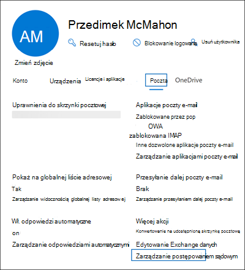

# <a name="create-a-litigation-hold"></a>Twórz archiwizację w związku z postępowaniem sądowym

Skrzynkę pocztową można wstrzymać, aby zachować całą zawartość skrzynki pocztowej, w tym usunięte elementy i oryginalne wersje zmodyfikowanych elementów. Po umieszczeniu skrzynki pocztowej użytkownika w blokadzie postępowania sądowego zawartość w archiwum skrzynki pocztowej użytkownika (jeśli jest włączona) jest również zachowywana. Podczas tworzenia blokady można określić czas przechowywania (nazywany również *blokadą czasową*), aby usunięte i zmodyfikowane elementy były przechowywane przez określony okres, a następnie trwale usuwane ze skrzynki pocztowej. Możesz też zachować zawartość przez czas nieokreślony (nazywaną *nieskończoną blokadą*) lub do momentu usunięcia blokady postępowania sądowego. Jeśli określisz okres przechowywania, jest on obliczany na podstawie daty odebrania wiadomości lub utworzenia elementu skrzynki pocztowej. 
  
Oto, co się stanie po utworzeniu blokady postępowania sądowego.
  
- Elementy, które są trwale usuwane przez użytkownika, są przechowywane w folderze Elementy możliwe do odzyskania w skrzynce pocztowej użytkownika przez czas przechowywania.

- Elementy przeczyszczane z folderu Elementy możliwe do odzyskania przez użytkownika są przechowywane przez czas przechowywania.

- Zwiększono limit przydziału magazynu dla folderu Elementy możliwe do odzyskania z 30 GB do 110 GB.

- Elementy w podstawowych i archiwalnych skrzynkach pocztowych użytkownika są zachowywane

## <a name="assign-an-exchange-online-plan-2-license"></a>Przypisywanie licencji planu Exchange Online 2

Aby umieścić skrzynkę pocztową Exchange Online w stanie wstrzymania postępowania sądowego, musi mieć przypisaną licencję Exchange Online plan 2. Jeśli skrzynka pocztowa ma przypisaną licencję Exchange Online plan 1, musisz przypisać jej oddzielną licencję Exchange Online — archiwum, aby ją wstrzymać.

> [!NOTE]
> W przypadku Office 365 Education organizacji blokada postępowania sądowego jest obsługiwana w Office 365 A1 subskrypcjach, które obejmują licencję Exchange Online plan 1 z dodatkowymi funkcjami. Aby uzyskać więcej informacji, zobacz sekcję "funkcje Exchange Online" w [opisie usługi Office 365 Education](/office365/servicedescriptions/office-365-platform-service-description/office-365-education#exchange-online-features).

## <a name="place-a-mailbox-on-litigation-hold"></a>Umieszczanie skrzynki pocztowej w blokadzie postępowania sądowego

Poniżej przedstawiono kroki, aby umieścić skrzynkę pocztową w blokadzie postępowania sądowego przy użyciu Centrum administracyjne platformy Microsoft 365.

1. Przejdź do <a href="https://go.microsoft.com/fwlink/p/?linkid=834822" target="_blank">Centrum administracyjne platformy Microsoft 365</a>, a następnie kliknij pozycję **Użytkownicy** > **aktywni użytkownicy**.

2. Wybierz użytkownika, który chcesz umieścić w blokadzie postępowania sądowego.

3. Na stronie wysuwanej właściwości kliknij kartę **Poczta** , a następnie w obszarze **Więcej akcji** kliknij pozycję **Zarządzaj blokadą sporów sądowych**.

   

4. Na stronie Zarządzaj wysuwem **blokady sporów** wybierz pole wyboru **Włącz wstrzymanie sporów sądowych** , a następnie wprowadź następujące opcjonalne informacje:

    1. **Czas przechowywania (dni)**: użyj tego pola, aby utworzyć blokadę opartą na czasie i określić, jak długo elementy skrzynki pocztowej są przechowywane, gdy skrzynka pocztowa zostanie wstrzymana. Czas trwania jest obliczany na podstawie daty odebrania lub utworzenia elementu skrzynki pocztowej. Gdy czas przechowywania wygaśnie dla określonego elementu, ten element nie będzie już zachowywany. Jeśli to pole pozostanie puste, elementy zostaną zachowane na czas nieokreślony lub do momentu usunięcia blokady. Użyj dni, aby określić czas trwania.

    2. **Uwaga widoczna dla użytkownika**: użyj tego pola, aby poinformować użytkownika, że jego skrzynka pocztowa jest w stanie wstrzymania postępowania sądowego. Uwaga zostanie wyświetlona na stronie Informacje o koncie w skrzynce pocztowej użytkownika, jeśli korzysta z programu Outlook 2010 lub nowszego. Aby uzyskać dostęp do tej strony, użytkownicy mogą kliknąć pozycję **Plik** w programie Outlook.

    3. **Strona sieci Web z większą ilością informacji dla użytkownika**: użyj tego pola, aby skierować użytkownika do witryny internetowej, aby uzyskać więcej informacji o blokadzie postępowania sądowego. Ten adres URL jest wyświetlany na stronie Informacje o koncie w skrzynce pocztowej użytkownika, jeśli używa programu Outlook 2010 lub nowszego. Aby uzyskać dostęp do tej strony, użytkownicy mogą kliknąć pozycję **Plik** w programie Outlook.

. Kliknij **pozycję Zapisz zmiany** na stronie wysuwanej **Blokada postępowania sądowego** , aby utworzyć blokadę.

   System wyświetla baner z informacją, że może upłynąć do 240 minut, aż zmiana zostanie wprowadzona.

### <a name="create-a-litigation-hold-using-powershell"></a>Tworzenie blokady postępowania sądowego przy użyciu programu PowerShell

Możesz również utworzyć blokadę postępowania sądowego, uruchamiając następujące polecenie w [programie Exchange Online programu PowerShell](/powershell/exchange/connect-to-exchange-online-powershell):

```powershell
Set-Mailbox <username> -LitigationHoldEnabled $true
```

Poprzednie polecenie zachowuje elementy przez czas nieokreślony, ponieważ czas trwania blokady nie jest określony. Aby utworzyć blokadę opartą na czasie, użyj następującego polecenia:

```powershell
Set-Mailbox <username> -LitigationHoldEnabled $true -LitigationHoldDuration <number of days>
```

Możesz również uruchomić następujące polecenie, aby sprawdzić, czy skrzynka pocztowa została wstrzymana w postępowaniu sądowym:

```powershell
Get-Mailbox <username> | FL LitigationHoldEnabled
```

Wartość *True* wskazuje, że skrzynka pocztowa jest wstrzymana/

Aby uzyskać więcej informacji, zobacz [Set-Mailbox (Set-Mailbox](/powershell/module/exchange/set-mailbox)).

## <a name="how-does-litigation-hold-work"></a>Jak działa postępowanie sądowe?

W normalnym przepływie pracy usuniętego elementu element skrzynki pocztowej jest przenoszony do podfolderu Deletions w folderze Elementy możliwe do odzyskania, gdy użytkownik trwale go usunie (Shift + Delete) lub usunie go z folderu Elementy usunięte. Zasady usuwania (czyli tag przechowywania skonfigurowany z akcją Usuwania przechowywania) również przenosi elementy do podfolderu Usuwania po upływie okresu przechowywania. Gdy użytkownik przeczyści element w folderze Elementy możliwe do odzyskania lub gdy okres przechowywania usuniętego elementu wygaśnie dla elementu, zostanie on przeniesiony do podfolderu Przeczyszczanie w folderze Elementy możliwe do odzyskania i oznaczony do trwałego usunięcia. Zostanie ona przeczyszczona z programu Exchange przy następnym przetworzeniu skrzynki pocztowej przez asystenta folderów zarządzanych (MFA).

Gdy skrzynka pocztowa zostanie wstrzymana, elementy w podfoldecie Przeczyszczanie zostaną zachowane przez czas przechowywania określony przez blokadę postępowania sądowego. Czas przechowywania jest obliczany na podstawie oryginalnej daty odebrania lub utworzenia elementu i określa czas przechowywania elementów w podfoldecie Przeczyszczanie. Gdy czas przechowywania wygaśnie dla elementu w podfolderze Przeczyszczanie, element zostanie oznaczony do trwałego usunięcia i zostanie usunięty z programu Exchange przy następnym przetworzeniu skrzynki pocztowej przez usługę MFA. Jeśli w skrzynce pocztowej zostanie umieszczona blokada bezterminowa, elementy nigdy nie zostaną usunięte z podfolderu Przeczyszczanie.

Na poniższej ilustracji przedstawiono podfoldery w folderach Elementy do odzyskania i w procesie przepływu pracy przechowywania.


> [!NOTE]
> Jeśli blokada skojarzona ze sprawą zbierania elektronicznych materiałów dowodowych zostanie umieszczona w skrzynce pocztowej, przeczyszczane elementy zostaną przeniesione z podfolderu Deletions do podfolderu DiscoveryHolds i zostaną zachowane do momentu zwolnienia skrzynki pocztowej z blokady zbierania elektronicznych materiałów dowodowych.
