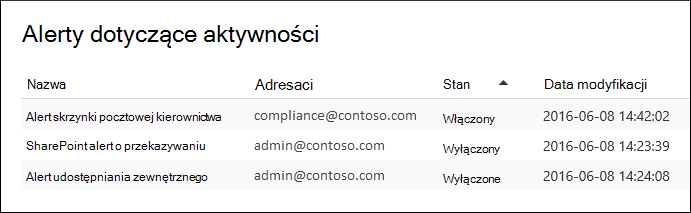

# Tworzenie alertów aktywności

Możesz utworzyć alert działania, który wyśle Ci powiadomienie e-mail, gdy użytkownicy będą wykonywać określone działania w Office 365. Alerty dotyczące działań są podobne do wyszukiwania zdarzeń w dzienniku inspekcji, z tą różnicą, że otrzymasz wiadomość e-mail, gdy wystąpi zdarzenie dla działania, dla których utworzono alert.

 **Dlaczego warto używać alertów aktywności zamiast przeszukiwania dziennika inspekcji?** Mogą istnieć pewne rodzaje działań lub działań wykonywanych przez określonych użytkowników, o których naprawdę chcesz wiedzieć. Zamiast pamiętać o przeszukiwaniu dziennika inspekcji dla tych działań, możesz użyć alertów aktywności, aby Microsoft 365 wysłać wiadomość e-mail, gdy użytkownicy wykonują te działania. Możesz na przykład utworzyć alert aktywności, aby powiadomić Użytkownika, gdy użytkownik usunie pliki w SharePoint, lub utworzyć alert w celu powiadomienia, gdy użytkownik trwale usunie wiadomości ze swojej skrzynki pocztowej. Wysłane do Ciebie powiadomienie e-mail zawiera informacje o tym, które działanie zostało wykonane, oraz o użytkowniku, który go wykonał.

> [!NOTE]
> Alerty aktywności są przestarzałe. Zalecamy rozpoczęcie korzystania z zasad alertów w centrum zabezpieczeń i zgodności zamiast tworzenia nowych alertów dotyczących działań. Zasady alertów zapewniają dodatkowe funkcje, takie jak możliwość tworzenia zasad alertów, które wyzwalają alert, gdy dowolny użytkownik wykonuje określone działanie, oraz wyświetlanie alertów na stronie **Wyświetlanie alertów** w Centrum zabezpieczeń i zgodności. Aby uzyskać więcej informacji, zobacz [Zasady alertów](alert-policies.md).

## Potwierdzanie ról i konfigurowanie rejestrowania inspekcji

- Aby zarządzać alertami aktywności, musisz mieć przypisaną rolę Konfiguracja organizacji w portalu zgodności usługi Microsoft Purview. Domyślnie ta rola jest przypisywana do grup ról Administrator zgodności i Zarządzanie organizacją. Aby uzyskać więcej informacji na temat dodawania członków do grup ról, zobacz [Udzielanie użytkownikom dostępu do portalu zgodności usługi Microsoft Purview](../security/office-365-security/grant-access-to-the-security-and-compliance-center.md).

- Przed rozpoczęciem korzystania z alertów aktywności użytkownik (lub inny administrator) musi najpierw włączyć rejestrowanie inspekcji dla swojej organizacji. W tym celu kliknij pozycję **Rozpocznij rejestrowanie aktywności użytkownika i administratora** na stronie **Alerty dotyczące działań** . (Jeśli nie widzisz tego linku, inspekcja została już włączona dla Twojej organizacji). Inspekcję można również włączyć na stronie **wyszukiwania dzienników inspekcji** w portalu zgodności (przejdź do sekcji **Inspekcja**). Musisz to zrobić tylko raz dla swojej organizacji.

- Możesz tworzyć alerty dla tych samych działań, które można wyszukać w dzienniku inspekcji. Zobacz sekcję [Więcej informacji](#more-information) , aby uzyskać listę typowych scenariuszy (i określonego działania do monitorowania), dla których można tworzyć alerty.

- Na stronie **Alerty aktywności** w <a href="https://go.microsoft.com/fwlink/p/?linkid=2077149" target="_blank">portalu zgodności</a> można tworzyć alerty tylko dla działań wykonywanych przez użytkowników wymienionych w książce adresowej organizacji. Nie można użyć tej strony do tworzenia alertów dotyczących działań wykonywanych przez użytkowników zewnętrznych, którzy nie są wymienieni w książce adresowej.

## Tworzenie alertu działania

1. Przejdź do <a href="https://go.microsoft.com/fwlink/p/?linkid=2077149" target="_blank">portalu zgodności</a>.

2. Zaloguj się przy użyciu konta służbowego.

3. Na stronie **Alerty aktywności** kliknij pozycję Dodaj ikonę  **Nowość**.

   Zostanie wyświetlona strona wysuwana w celu utworzenia alertu działania.

    

4. Wypełnij następujące pola, aby utworzyć alert działania:

    1. **Nazwa** — wpisz nazwę alertu. Nazwy alertów muszą być unikatowe w organizacji.

    1. **Opis** (opcjonalnie) — opisz alert, taki jak działania i użytkownicy, do których są śledzeni, oraz użytkownicy, do których są wysyłane powiadomienia e-mail. Opisy zapewniają szybki i łatwy sposób opisywania przeznaczenia alertu dla innych administratorów.

    1. **Typ alertu** — upewnij się, że wybrano opcję **Niestandardowe** .

    1. **Wyślij ten alert, gdy** — kliknij pozycję **Wyślij ten alert, kiedy** , a następnie skonfiguruj te dwa pola:

       - **Działania** — kliknij listę rozwijaną, aby wyświetlić działania, dla których można utworzyć alert. Jest to ta sama lista działań wyświetlana podczas przeszukiwania dziennika inspekcji. Możesz wybrać co najmniej jedno konkretne działanie lub kliknąć nazwę grupy działań, aby wybrać wszystkie działania w grupie. Opis tych działań można znaleźć w sekcji "Działania inspekcji" w temacie [Wyszukaj dziennik inspekcji](search-the-audit-log-in-security-and-compliance.md#audited-activities). Gdy użytkownik wykonuje dowolne z działań dodanych do alertu, wysyłane jest powiadomienie e-mail.

       - **Użytkownicy** — kliknij to pole, a następnie wybierz co najmniej jednego użytkownika. Jeśli użytkownicy w tym polu wykonają działania dodane do pola **Działania** , zostanie wysłany alert. Pozostaw pole **Użytkownicy** puste, aby wysłać alert, gdy dowolny użytkownik w organizacji wykonuje działania określone przez alert.

    1. **Wyślij ten alert do** — kliknij pozycję **Wyślij ten alert**, a następnie kliknij pole **Adresaci** i wpisz nazwę, aby dodać użytkowników, którzy otrzymają powiadomienie e-mail, gdy użytkownik (określony w polu **Użytkownicy** ) wykona działanie (określone w polu **Działania** ). Pamiętaj, że domyślnie dodano Cię do listy adresatów. Możesz usunąć swoją nazwę z tej listy.

5. Kliknij przycisk **Zapisz** , aby utworzyć alert.

    Nowy alert zostanie wyświetlony na liście na stronie **Alerty dotyczące działań** .

    

    Stan alertu jest ustawiony na **Włączone**. Należy pamiętać, że na liście są również adresaci, którzy otrzymają powiadomienie e-mail po wysłaniu alertu.

## Wyłączanie alertu działania

Możesz wyłączyć alert działania, aby nie było wysyłane powiadomienie e-mail. Po wyłączeniu alertu dotyczącego działania będzie on nadal wyświetlany na liście alertów dotyczących działań dla organizacji i nadal możesz wyświetlać jego właściwości.

1. Przejdź do <a href="https://go.microsoft.com/fwlink/p/?linkid=2077149" target="_blank">portalu zgodności</a>.

2. Zaloguj się przy użyciu konta służbowego.

3. Na liście alertów dotyczących działań dla organizacji kliknij alert, który chcesz wyłączyć.

4. Na stronie **Edytowanie alertu** kliknij przełącznik **Włącz** , aby zmienić stan na **Wył.**, a następnie kliknij przycisk **Zapisz**.

    Stan alertu na stronach **Alerty aktywności** jest ustawiony na **wartość Wyłączone**.

Aby ponownie włączyć alert aktywności, po prostu powtórz te kroki i kliknij przełącznik **Wyłącz** , aby zmienić stan **na Włączone**.

## Więcej informacji

- Oto przykład powiadomienia e-mail wysyłanego do użytkowników określonego w polu Wysłane ten alert do (i wyświetlonego w obszarze **Adresaci** na stronie **Alerty aktywności** ) w portalu zgodności.

    

- Poniżej przedstawiono niektóre typowe działania związane z dokumentami i wiadomościami e-mail, dla których można tworzyć alerty aktywności. W tabelach opisano działanie, nazwę działania, dla którego ma zostać utworzony alert, oraz nazwę grupy działań, dla których działanie znajduje się na liście rozwijanej **Działania** . Aby wyświetlić pełną listę działań, dla których można tworzyć alerty aktywności, zobacz sekcję "Działania inspekcji" w [temacie Wyszukaj dziennik inspekcji](search-the-audit-log-in-security-and-compliance.md#audited-activities).

    > [!TIP]
    > Możesz utworzyć alert aktywności dla tylko jednego działania wykonywanego przez dowolnego użytkownika. Możesz też utworzyć alert aktywności, który śledzi wiele działań wykonywanych przez co najmniej jednego użytkownika.

    W poniższej tabeli wymieniono niektóre typowe działania związane z dokumentami w SharePoint lub OneDrive dla Firm.

    | Gdy użytkownik to robi... | Tworzenie alertu dla tego działania | Grupa działań |
    |:-----|:-----|:-----|
    |Wyświetla dokument w witrynie.  |Dostęp do pliku  |Działania dotyczące plików i folderów  |
    |Edytuje lub zmienia dokument.  |Zmodyfikowany plik  |Działania dotyczące plików i folderów  |
    |Udostępnia dokument użytkownikowi spoza organizacji.  |Udostępnianie pliku, folderu lub witryny    I    Zaproszenie do udostępniania utworzone    Aby uzyskać więcej informacji, zobacz [Używanie inspekcji udostępniania w dzienniku inspekcji](use-sharing-auditing.md).  |Działania dotyczące udostępniania i uzyskiwania dostępu do żądań  |
    |Przekazuje lub pobiera dokument.  |Przekazany plik    Lub    Pobrany plik  |Działania dotyczące plików i folderów  |
    |Zmienia uprawnienia dostępu do witryny.  |Zmodyfikowane uprawnienia witryny  |Działania administracji lokacji  |

    W poniższej tabeli wymieniono niektóre typowe działania związane z pocztą e-mail w Exchange Online.

    | Gdy użytkownik to robi... | Tworzenie alertu dla tego działania | Grupa działań |
    |:-----|:-----|:-----|
    |Trwale usuwa (przeczyszcza) wiadomość e-mail ze skrzynki pocztowej.  |Przeczyszczane wiadomości ze skrzynki pocztowej  | działania Exchange skrzynki pocztowej  |
    |Wysyła wiadomość e-mail z udostępnionej skrzynki pocztowej.  |Wysłano wiadomość przy użyciu uprawnień Wyślij jako    I    Wysłano wiadomość przy użyciu uprawnień Wyślij w imieniu  | działania Exchange skrzynki pocztowej  |

- Możesz również użyć poleceń cmdlet **New-ActivityAlert** i **Set-ActivityAlert** w programie PowerShell Security & Compliance Center, aby tworzyć i edytować alerty dotyczące działań. Jeśli używasz tych poleceń cmdlet do tworzenia lub edytowania alertów aktywności, pamiętaj o następujących kwestiach:

  - Jeśli użyjesz polecenia cmdlet, aby dodać działanie do alertu, którego nie ma na liście rozwijanej **Działania** , zostanie wyświetlony komunikat na stronie właściwości alertu z komunikatem "Ten alert ma niestandardowe operacje niewymienione w selektorze".

  - Dobrym powodem używania poleceń cmdlet do tworzenia lub edytowania alertu aktywności jest wysyłanie powiadomień e-mail do osoby spoza organizacji. Ten użytkownik zewnętrzny zostanie wyświetlony na liście adresatów alertu. Jeśli jednak usuniesz tego użytkownika zewnętrznego z alertu, nie będzie można go ponownie dodać do alertu przy użyciu strony **Edytuj alert** . Musisz ponownie dodać użytkownika zewnętrznego przy użyciu polecenia cmdlet **Set-ActivityAlert** lub użyć polecenia cmdlet **New-ActivityAlert** , aby dodać tego samego (lub innego) użytkownika zewnętrznego do nowego alertu.
