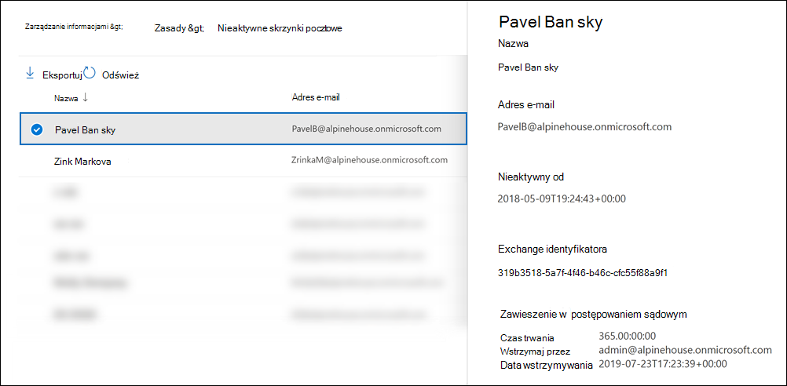

# <a name="create-and-manage-inactive-mailboxes"></a>Tworzenie nieaktywnych skrzynek pocztowych i zarządzanie nimi

Nieaktywne skrzynki pocztowe umożliwiają zachowanie poczty e-mail byłych pracowników po opuszczeniu organizacji i są dostępne dla autoryzowanych osób[](assign-ediscovery-permissions.md), którym udzielono uprawnień zbierania elektronicznych materiałów dowodowych w celu zachowania zgodności z przepisami lub ze względów prawnych. Na przykład administratorzy, menedżerowie zgodności i menedżerowie rekordów, którzy mogą następnie wyszukiwać i eksportować zawartość nieaktywnej skrzynki pocztowej za pomocą wyszukiwania zawartości. Nieaktywne skrzynki pocztowe nie mogą otrzymywać wiadomości e-mail i nie są wyświetlane w udostępnionej książce adresowej organizacji ani na innych listach.

Aby uzyskać więcej informacji o nieaktywnych skrzynkach pocztowych, zobacz [Informacje o nieaktywnych skrzynkach pocztowych](inactive-mailboxes-in-office-365.md).

## <a name="create-an-inactive-mailbox"></a>Tworzenie nieaktywnej skrzynki pocztowej

Nieaktywność skrzynki pocztowej wymaga trzymania skrzynki pocztowej, a następnie usunięcia skrzynki pocztowej lub odpowiedniego konta użytkownika.

Aby skrzynka pocztowa była nieaktywna, należy ją przypisać do skrzynki pocztowej w planie Exchange Online 2 Exchange Online (lub licencję planu 1 z licencją dodatkową programu Exchange Online — archiwum), aby można było zastosować do skrzynki pocztowej hold przed jej usunięciem. Po usunięciu konta użytkownika wszystkie Exchange Online skojarzone z tym kontem użytkownika będą dostępne do przypisania noweowi użytkownikowi.

Zalecamy stosowanie stosowania Microsoft 365 do skrzynki pocztowej przy użyciu funkcji przechowywania. Inne metody o których powiesz [na temat nieaktywnych skrzynek pocztowych](inactive-mailboxes-in-office-365.md).

Najlepszym sposobem na usunięcie skrzynki pocztowej jest usunięcie odpowiedniego konta <a href="https://go.microsoft.com/fwlink/p/?linkid=2024339" target="_blank">użytkownika z centrum administracyjne platformy Microsoft 365</a>. Aby uzyskać informacje na temat usuwania kont użytkowników, [zobacz Usuwanie użytkownika z organizacji](../admin/add-users/delete-a-user.md). Można jednak również usunąć skrzynkę pocztową za pomocą polecenia cmdlet **Remove-Mailbox** w programie Exchange Online PowerShell. Aby uzyskać więcej informacji, zobacz [Usuwanie lub przywracanie skrzynek pocztowych użytkowników w aplikacji Exchange Online](/exchange/recipients-in-exchange-online/delete-or-restore-mailboxes).

W poniższej tabeli podsumowano proces tworzenia nieaktywnej skrzynki pocztowej w różnych scenariuszach przechowywania.

<br/>

|To...|Zrób to...|Result (Wynik)|
|---|---|---|
|Zachowywanie zawartości skrzynki pocztowej przez czas nieograniczony po odejechi pracownika z organizacji|1. Zastosuj Microsoft 365 przechowywania z akcjami przechowywania dla skrzynki pocztowej (zasady przechowywania) lub określonymi elementami poczty e-mail (co najmniej jedną etykietą przechowywania). <br /><br> 2. Poczekaj na zastosowanie ustawień przechowywania. <br /><br> 3. Usunięcie konta Microsoft 365 użytkownika.|Cała zawartość nieaktywnej skrzynki pocztowej, która ma zastosowane ustawienia przechowywania, łącznie z elementami w folderze Elementy do odzyskania, jest zachowywana przez nieograniczony czas.|
|Zachowywanie całej zawartości skrzynki pocztowej przez określony czas po odjęniu przez pracownika od organizacji, a następnie usunięciu skrzynki pocztowej|1. Stosowanie zasad Microsoft 365 przechowywania do skrzynki pocztowej z ustawieniami przechowywania, które zachowują i usuwają elementy po wygaśnięciu okresu przechowywania. <br /><br> 2. Poczekaj na zastosowanie ustawień przechowywania. <br /><br> 3. Usunięcie konta Microsoft 365 użytkownika.|Okres przechowywania elementu skrzynki pocztowej wygasa, jest przenoszony do folderu Elementy do odzyskania, a następnie trwale usuwany (usuwany) z nieaktywnej skrzynki pocztowej po wygaśnięciu okresu przechowywania elementów usuniętych (w przypadku skrzynek pocztowych programu Exchange). Okres przechowywania zasad przechowywania Microsoft 365 jest zawsze oparty na pierwotnym dniu, w którym odebrano lub utworzono element skrzynki pocztowej.|


> [!NOTE]
> Jeśli ustawienia przechowywania usługi Microsoft 365 skonfigurowane w taki sposób, aby zachowywać, zachowywać i usuwać zawartość, zostały już zastosowane do skrzynki pocztowej lub elementów skrzynki pocztowej lub jeśli do skrzynki pocztowej jest już zastosowana skrzynka pocztowa w związku z postępowaniem sądowym, albo wystarczy zrobić to, aby utworzyć nieaktywną skrzynkę pocztową, albo usunąć odpowiednie konto użytkownika.


## <a name="view-a-list-of-inactive-mailboxes"></a>Wyświetlanie listy nieaktywnych skrzynek pocztowych

Aby wyświetlić listę nieaktywnych skrzynek pocztowych w organizacji:

1. Przejdź do <a href="https://go.microsoft.com/fwlink/p/?linkid=2077149" target="_blank">Centrum zgodności platformy Microsoft 365</a> i zaloguj się przy użyciu poświadczeń administratora globalnego lub konta administratora zgodności w organizacji.

2. W lewym okienku nawigacji kliknij pozycję **Pokaż wszystko**, a następnie kliknij pozycję **Zarządzanie informacjamiRetention** > .

   

3. Na stronie **Przechowywanie** kliknij pozycję Nieaktywna skrzynka **pocztowa** , aby wyświetlić listę nieaktywnych skrzynek pocztowych.

4. Wybierz nieaktywną skrzynkę pocztową, aby wyświetlić stronę wysuwu z informacjami o nieaktywnej skrzynce pocztowej.

     

Możesz kliknąć ikonę  **Eksportuj** , aby wyświetlić lub pobrać plik CSV zawierający dodatkowe informacje o nieaktywnych skrzynkach pocztowych w Twojej organizacji.

W programie PowerShell możesz również uruchomić następujące polecenie w programie Exchange Online, aby wyświetlić listę nieaktywnych skrzynek pocztowych.

```powershell
 Get-Mailbox -InactiveMailboxOnly | FT DisplayName,PrimarySMTPAddress,WhenSoftDeleted
```

Możesz również uruchomić następujące polecenie, aby wyeksportować listę nieaktywnych skrzynek pocztowych i inne informacje do pliku CSV. W tym przykładzie plik CSV jest tworzony w bieżącym katalogu.

```powershell
Get-Mailbox -InactiveMailboxOnly | Select Displayname,PrimarySMTPAddress,DistinguishedName,ExchangeGuid,WhenSoftDeleted | Export-Csv InactiveMailboxes.csv -NoType
```

> [!NOTE]
> Nieaktywna skrzynka pocztowa może mieć taki sam adres SMTP, jak skrzynka pocztowa aktywnego użytkownika. W takim przypadku wartość właściwości **DistinguishedName** (Nazwa wyróżniająca) lub **ExchangeGuid** (Nazwa wyróżniająca) może być użyta do unikatowego identyfikowania nieaktywnej skrzynki pocztowej.
  
## <a name="search-and-export-the-contents-of-an-inactive-mailbox"></a>Wyszukiwanie i eksportowanie zawartości nieaktywnej skrzynki pocztowej

Do zawartości nieaktywnej skrzynki pocztowej można uzyskać dostęp przy użyciu narzędzia Wyszukiwanie zawartości w Centrum zgodności platformy Microsoft 365. Podczas wyszukiwania nieaktywnej skrzynki pocztowej możesz utworzyć zapytanie wyszukiwania słów kluczowych w celu wyszukania określonych elementów lub zwrócenia całej zawartości nieaktywnej skrzynki pocztowej. Możesz wyświetlić podgląd wyników wyszukiwania lub wyeksportować je do pliku danych Outlook (PST) lub jako poszczególnych wiadomości e-mail. Aby uzyskać procedury krok po kroku dotyczące wyszukiwania skrzynek pocztowych i eksportowania wyników wyszukiwania, zobacz następujące tematy:
  
- [Przeszukiwanie zawartości](content-search.md)

- [Eksportowanie wyników wyszukiwania](export-search-results.md)

Oto kilka rzeczy, o których należy pamiętać podczas wyszukiwania nieaktywnych skrzynek pocztowych.
  
- Jeśli przeszukiwanie zawartości obejmuje skrzynkę pocztową użytkownika i ta skrzynka pocztowa zostanie nieaktywny, przeszukiwanie zawartości będzie nadal przeszukiwać nieaktywną skrzynkę pocztową po jej ponownie uruchomić, gdy zostanie ona nieaktywna.

- W niektórych przypadkach użytkownik może mieć aktywną skrzynkę pocztową i nieaktywną skrzynkę pocztową o tym samym adresie SMTP. W takim przypadku przeszukana zostanie tylko ta skrzynka pocztowa, która została wybrane jako lokalizacja wyszukiwania zawartości. Innymi słowy, jeśli dodasz skrzynkę pocztową użytkownika do wyszukiwania, nie możesz zakładać, że będą przeszukiwane zarówno aktywne, jak i nieaktywne skrzynki pocztowe. przeszukana zostanie tylko skrzynka pocztowa, która została jawnie do dodania do wyszukiwania.

- Zdecydowanie zalecamy, aby nie mieć aktywnej i nieaktywnej skrzynki pocztowej z tym samym adresem SMTP. Jeśli chcesz ponownie użyć adresu SMTP, który jest obecnie przypisany do nieaktywnej skrzynki pocztowej, zalecamy odzyskanie nieaktywnej skrzynki pocztowej lub przywrócenie zawartości nieaktywnej skrzynki pocztowej do aktywnej skrzynki pocztowej (lub archiwum aktywnej skrzynki pocztowej), a następnie usunięcie nieaktywnej skrzynki pocztowej.

## <a name="change-the-hold-duration-for-an-inactive-mailbox"></a>Zmienianie czasu trwania wstrzymywania nieaktywnej skrzynki pocztowej

Po tym, jak skrzynka pocztowa zostanie nieaktywna, możesz zmienić czas trwania stosowania do nieaktywnej skrzynki pocztowej.

Aby uzyskać procedury krok po kroku, zobacz [Zmienianie czasu trwania blokowania nieaktywnej skrzynki pocztowej](change-the-hold-duration-for-an-inactive-mailbox.md).
  
## <a name="recover-an-inactive-mailbox"></a>Odzyskiwanie nieaktywnej skrzynki pocztowej

Jeśli były pracownik powraca do organizacji lub gdy nowy pracownik jest zatrudniony do odpowiedzialność za pracę odchodzącego pracownika, można odzyskać zawartość nieaktywnej skrzynki pocztowej. 

Po odzyskaniu nieaktywnej skrzynki pocztowej jest ona konwertowana na nową skrzynkę pocztową, a zawartość i struktura folderów nieaktywnej skrzynki pocztowej jest zachowywana, a skrzynka pocztowa jest połączona z nowym kontem użytkownika. Po ich odzyskaniu nieaktywna skrzynka pocztowa już nie istnieje. 

Aby uzyskać procedury krok po kroku i uzyskać więcej informacji na temat dzieje się podczas odzyskiwania nieaktywnej skrzynki pocztowej, zobacz Odzyskiwanie [nieaktywnej skrzynki pocztowej](recover-an-inactive-mailbox.md).
  
## <a name="restore-the-contents-of-an-inactive-mailbox-to-another-mailbox"></a>Przywracanie zawartości nieaktywnej skrzynki pocztowej do innej skrzynki pocztowej

Jeśli inny pracownik przejmie obowiązki byłego pracownika lub jeśli inna osoba potrzebuje dostępu do zawartości nieaktywnej skrzynki pocztowej, możesz przywrócić (lub scalić) zawartość nieaktywnej skrzynki pocztowej z istniejącą skrzynką pocztową. 

Po przywróceniu nieaktywnej skrzynki pocztowej zawartość jest kopiowana do innej skrzynki pocztowej. Nieaktywna skrzynka pocztowa jest zachowywana i pozostaje nieaktywną skrzynką pocztową. Nieaktywną skrzynkę pocztową nadal można przeszukiwać przy użyciu zbierania elektronicznych materiałów dowodowych, przywrócić jej zawartość do innej skrzynki pocztowej lub można ją odzyskać lub usunąć później. 

Aby uzyskać procedury krok po kroku, zobacz [Przywracanie nieaktywnej skrzynki pocztowej](restore-an-inactive-mailbox.md).
  
## <a name="delete-an-inactive-mailbox"></a>Usuwanie nieaktywnej skrzynki pocztowej

Jeśli nie potrzebujesz już zachowywać zawartości nieaktywnej skrzynki pocztowej, możesz trwale usunąć nieaktywną skrzynkę pocztową, usuwając ją z zastosowanego do nieaktywnej skrzynki pocztowej. Skrzynka pocztowa zostanie zachowana przez 183 dni po usunięciu zasad przechowywania lub blokowania i w tym czasie będzie można ją odzyskać. Po 183 dniach skrzynka pocztowa zostanie oznaczona do trwałego usunięcia i nie będzie można jej odzyskać. 

Aby uzyskać procedury krok po kroku dotyczące usuwania blokowania lub zasad przechowywania w celu trwałego usuwania nieaktywnej skrzynki pocztowej, zobacz [Usuwanie nieaktywnej skrzynki pocztowej](delete-an-inactive-mailbox.md).
