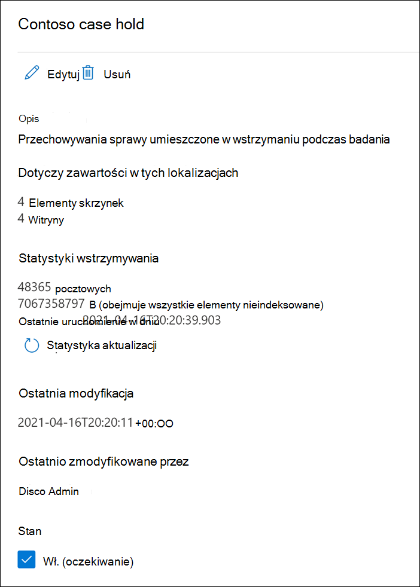

# <a name="create-an-ediscovery-hold"></a>Tworzenie blokady zbierania elektronicznych materiałów dowodowych

Możesz użyć przypadku zbierania elektronicznych materiałów dowodowych w usłudze Microsoft Purview (Standardowa), aby utworzyć blokady w celu zachowania zawartości, która może być istotna dla danego przypadku. Możesz wstrzymać skrzynki pocztowe Exchange i OneDrive dla Firm konta osób, które badasz w tej sprawie. Możesz również wstrzymać skrzynki pocztowe i witryny skojarzone z Microsoft Teams, grupami Office 365 i grupami Yammer. Po wstrzymaniu lokalizacji zawartości zawartość jest zachowywana do momentu usunięcia lokalizacji zawartości z blokady lub do momentu usunięcia blokady.

Po utworzeniu blokady zbierania elektronicznych materiałów dowodowych może upłynąć do 24 godzin, aż blokada zostanie wprowadzona w życie.

Podczas tworzenia blokady dostępne są następujące opcje określania zakresu zawartości, która jest zachowywana w określonych lokalizacjach zawartości:
  
- Utwórz nieskończoną blokadę, w której cała zawartość w określonych lokalizacjach zostanie wstrzymana. Alternatywnie można utworzyć blokadę opartą na zapytaniach, w której tylko zawartość w określonych lokalizacjach pasujących do zapytania wyszukiwania jest wstrzymana.

- Określ zakres dat, aby zachować tylko zawartość, która została wysłana, odebrana lub utworzona w tym zakresie dat. Alternatywnie można przechowywać całą zawartość w określonych lokalizacjach, niezależnie od tego, kiedy została wysłana, odebrana lub utworzona.
  
## <a name="how-to-create-an-ediscovery-hold"></a>Jak utworzyć blokadę zbierania elektronicznych materiałów dowodowych

Aby utworzyć blokadę zbierania elektronicznych materiałów dowodowych skojarzoną z przypadkiem zbierania elektronicznych materiałów dowodowych (w warstwie Standardowa):
  
1. Przejdź do <a href="https://go.microsoft.com/fwlink/p/?linkid=2077149" target="_blank">portalu zgodności usługi Microsoft Purview</a> i zaloguj się przy użyciu poświadczeń konta użytkownika, do których przypisano odpowiednie uprawnienia zbierania elektronicznych materiałów dowodowych.

2. W okienku nawigacji po lewej stronie kliknij pozycję **Pokaż wszystko**, a następnie kliknij pozycję **eDiscovery > Core**.

3. Na stronie **eDiscovery (Standard)** kliknij nazwę przypadku, w ramach którego chcesz utworzyć blokadę.

4. Na stronie **głównej** sprawy kliknij kartę **Przytrzymaj** .
  
5. Na stronie **Blokada** kliknij pozycję **Utwórz**.

6. Na stronie Nazwa kreatora **przechowywania nadaj** blokadzie nazwę i dodaj opcjonalny opis, a następnie kliknij przycisk **Dalej**. Nazwa blokady musi być unikatowa w organizacji.

7. Na stronie Kreator **wybierania lokalizacji** wybierz lokalizacje zawartości, które mają zostać wstrzymane. Skrzynki pocztowe, witryny i foldery publiczne można wstrzymać.

    
  
   1. **Exchange skrzynki pocztowe**: ustaw przełącznik **na Włączone**, a następnie kliknij pozycję **Wybierz użytkowników, grupy lub zespoły,** aby określić skrzynki pocztowe, które mają zostać wstrzymane. Użyj pola wyszukiwania, aby znaleźć skrzynki pocztowe użytkowników i grupy dystrybucyjne (aby zatrzymać skrzynki pocztowe członków grupy), aby zostać wstrzymane. Możesz również umieścić blokadę w skojarzonej skrzynce pocztowej dla zespołu firmy Microsoft, grupy Office 365 i grupy Yammer. Aby uzyskać więcej informacji na temat danych aplikacji, które są zachowywane po wstrzymaniu skrzynki pocztowej, zobacz [Zawartość przechowywana w skrzynkach pocztowych w celu zbierania elektronicznych materiałów dowodowych](what-is-stored-in-exo-mailbox.md).

   2. **SharePoint witryn**: ustaw przełącznik **na Wł**., a następnie kliknij pozycję **Wybierz witryny**, aby określić, SharePoint witryny i konta OneDrive, które mają zostać wstrzymane. Wpisz adres URL każdej witryny, która ma zostać wstrzymana. Możesz również dodać adres URL witryny SharePoint dla zespołu firmy Microsoft, grupy Office 365 lub grupy Yammer.
  
   3. **Exchange folderów publicznych**: ustaw przełącznik **na Wł**., aby wstrzymać wszystkie foldery publiczne w organizacji Exchange Online. Nie można wybrać określonych folderów publicznych do wstrzymania. Pozostaw przełącznik wyłączony, jeśli nie chcesz wstrzymać folderów publicznych.

   > [!IMPORTANT]
   > Podczas dodawania Exchange skrzynek pocztowych lub witryn SharePoint do blokady należy jawnie dodać co najmniej jedną lokalizację zawartości do blokady. Innymi słowy, jeśli dla skrzynek pocztowych lub witryn ustawisz przełącznik **włączone** , musisz wybrać określone skrzynki pocztowe lub witryny, aby dodać je do blokady. W przeciwnym razie zostanie utworzona blokada zbierania elektronicznych materiałów dowodowych, ale żadne skrzynki pocztowe ani witryny nie zostaną dodane do blokady, a statystyki pokazują, że żadne lokalizacje zawartości ani elementy nie są zawieszone.

8. Po zakończeniu dodawania lokalizacji do blokady kliknij przycisk **Dalej**.

9. Aby utworzyć blokadę opartą na zapytaniach przy użyciu słów kluczowych lub warunków, wykonaj następujące kroki. Aby zachować całą zawartość w określonych lokalizacjach zawartości, kliknij przycisk **Dalej**.

    
  
    1. W polu **Słowa kluczowe** wpisz zapytanie, aby zachować tylko zawartość zgodną z kryteriami zapytania. Możesz określić słowa kluczowe, właściwości wiadomości e-mail lub właściwości witryny, takie jak nazwy plików. Można również użyć bardziej złożonych zapytań, które używają operatora logicznego, takiego jak **AND**, **OR** lub **NOT**.

    2. Kliknij **pozycję Dodaj warunek** , aby dodać co najmniej jeden warunek, aby zawęzić zapytanie dotyczące blokady. Każdy warunek dodaje klauzulę do zapytania wyszukiwania KQL, które jest tworzone i uruchamiane podczas tworzenia blokady. Można na przykład określić zakres dat, aby dokumenty poczty e-mail lub witryny utworzone w zakresie dat zostały zachowane. Warunek jest logicznie połączony z zapytaniem słowa kluczowego (określonym w polu Słowa kluczowe) i innymi **warunkami** przez operatora **AND** . Oznacza to, że elementy muszą spełniać zarówno zapytanie słowa kluczowego, jak i warunek, który ma zostać zachowany.

    Aby uzyskać więcej informacji na temat tworzenia zapytania wyszukiwania i używania [warunków, zobacz Zapytania słów kluczowych i warunki wyszukiwania dla zbierania elektronicznych materiałów dowodowych](keyword-queries-and-search-conditions.md).

10. Po skonfigurowaniu blokady opartej na zapytaniach kliknij przycisk **Dalej**.

11. Przejrzyj ustawienia (i w razie potrzeby edytuj je), a następnie kliknij przycisk **Prześlij**.

> [!NOTE]
> Podczas tworzenia blokady opartej na zapytaniach cała zawartość z wybranych lokalizacji jest początkowo wstrzymana. Następnie każda zawartość, która nie jest zgodna z określonym zapytaniem, jest usuwana z blokady co siedem do 14 dni. Jednak blokada oparta na zapytaniach nie wyczyści zawartości, jeśli do lokalizacji zawartości zostanie zastosowanych więcej niż pięć blokad dowolnego typu lub jeśli jakikolwiek element ma problemy z indeksowaniem.

## <a name="query-based-holds-placed-on-sites"></a>Blokady oparte na zapytaniach umieszczone w witrynach

Podczas umieszczania opartego na zapytaniach elektronicznego zbierania elektronicznych materiałów dowodowych należy pamiętać o następujących kwestiach w dokumentach znajdujących się w witrynach SharePoint:

- Blokada oparta na zapytaniach początkowo zachowuje wszystkie dokumenty w witrynie przez krótki okres czasu po ich usunięciu. Oznacza to, że po usunięciu dokumentu zostanie on przeniesiony do biblioteki archiwum zachowywania, nawet jeśli nie spełnia kryteriów blokady opartej na zapytaniach. Jednak usunięte dokumenty, które nie pasują do blokady opartej na zapytaniach, zostaną usunięte przez zadanie czasomierza, które przetwarza bibliotekę archiwum zachowywania. Zadanie czasomierza jest uruchamiane okresowo i porównuje wszystkie dokumenty w bibliotece archiwizacji zachowania z blokadami zbierania elektronicznych materiałów dowodowych opartych na zapytaniach (i innymi typami zasad przechowywania i blokad). Zadanie czasomierza usuwa dokumenty, które nie są zgodne z blokadą opartą na zapytaniach, i zachowuje dokumenty, które to robią.

- Blokad opartych na zapytaniach nie należy używać do wykonywania docelowego zachowania, takiego jak zachowywanie dokumentów w określonym folderze lub lokacji lub przy użyciu innych kryteriów przechowywania opartych na lokalizacji. Może to mieć niezamierzone wyniki. Zalecamy używanie kryteriów przechowywania innych niż oparte na lokalizacji, takich jak słowa kluczowe, zakresy dat lub inne właściwości dokumentu, aby zachować dokumenty witryny.

## <a name="ediscovery-hold-statistics"></a>Statystyki zbierania elektronicznych materiałów dowodowych

Po utworzeniu blokady zbierania elektronicznych materiałów dowodowych informacje o nowym blokadzie są wyświetlane na stronie wysuwanej dla wybranego blokady. Informacje te obejmują liczbę skrzynek pocztowych i witryn, które zostały wstrzymane, oraz statystyki dotyczące zawartości, która została wstrzymana, takie jak całkowita liczba i rozmiar elementów umieszczonych w blokadzie oraz czas ostatniego obliczenia statystyk blokady. Te statystyki przechowywania pomagają zidentyfikować ilość zawartości związanej ze sprawą jest zachowywana.
  

  
Należy pamiętać o następujących kwestiach dotyczących statystyk zbierania elektronicznych materiałów dowodowych:
  
- Całkowita liczba wstrzymanych elementów wskazuje liczbę elementów ze wszystkich źródeł zawartości, które są wstrzymane. Jeśli utworzono blokadę opartą na zapytaniach, ta statystyka wskazuje liczbę elementów zgodnych z zapytaniem.

- Liczba wstrzymanych elementów obejmuje również elementy bez certyfikatu znalezione w lokalizacjach zawartości. Jeśli utworzysz blokadę opartą na zapytaniach, wszystkie elementy niezawłaszczone w lokalizacjach zawartości zostaną wstrzymane. Obejmuje to elementy niezainicjowane, które nie spełniają kryteriów wyszukiwania blokady opartej na zapytaniach i elementów niewyświetlonych, które mogą wykraczać poza warunek zakresu dat. Różni się to od tego, co dzieje się po uruchomieniu wyszukiwania, w którym niezainicjowane elementy, które nie są zgodne z zapytaniem wyszukiwania lub są wykluczone przez warunek zakresu dat, nie są uwzględniane w wynikach wyszukiwania. Aby uzyskać więcej informacji na temat elementów niezaindeksowanych, zobacz [Częściowo zaindeksowane elementy](partially-indexed-items-in-content-search.md).

- Najnowsze statystyki blokady można uzyskać, klikając pozycję **Aktualizuj statystyki** , aby ponownie uruchomić oszacowanie wyszukiwania, które oblicza bieżącą liczbę wstrzymanych elementów.

- Jest to normalne, że liczba wstrzymanych elementów rośnie wraz z upływem czasu, ponieważ użytkownicy, których skrzynka pocztowa lub witryna jest wstrzymana, zazwyczaj wysyłają lub odbierają nową wiadomość e-mail oraz tworzą nowe dokumenty w SharePoint i OneDrive.

- Jeśli skrzynka pocztowa Exchange, SharePoint lokacja lub konto OneDrive zostaną przeniesione do innego regionu w środowisku z wieloma obszarami geograficznymi, statystyki dla tej witryny nie zostaną uwzględnione w statystykach blokady. Jednak zawartość w tych lokalizacjach będzie nadal zachowywana. Ponadto jeśli skrzynka pocztowa lub witryna zostanie przeniesiona do innego regionu, adres SMTP lub adres URL wyświetlany w blokadzie nie zostaną automatycznie zaktualizowane. Musisz edytować blokadę i zaktualizować adres URL lub adres SMTP, aby lokalizacje zawartości zostały ponownie uwzględnione w statystykach blokady

## <a name="search-locations-on-ediscovery-hold"></a>Wyszukiwanie lokalizacji w blokadzie zbierania elektronicznych materiałów dowodowych

[Podczas wyszukiwania zawartości](search-for-content-in-core-ediscovery.md) w przypadku zbierania elektronicznych materiałów dowodowych (Standardowa) można szybko skonfigurować wyszukiwanie tak, aby przeszukiwało tylko lokalizacje zawartości umieszczone w blokadzie skojarzonej ze sprawą.

Wybierz opcję **Lokalizacje wstrzymane** , aby przeszukać wszystkie lokalizacje zawartości, które zostały wstrzymane. Jeśli przypadek zawiera wiele blokad zbierania elektronicznych materiałów dowodowych, lokalizacje zawartości ze wszystkich blokad zostaną przeszukane po wybraniu tej opcji. Ponadto jeśli lokalizacja zawartości została umieszczona w blokadzie opartej na zapytaniach, podczas uruchamiania wyszukiwania będą przeszukiwane tylko elementy zgodne z zapytaniem blokady. Innymi słowy, tylko zawartość zgodna z kryteriami blokady i kryteriami wyszukiwania jest zwracana z wynikami wyszukiwania. Jeśli na przykład użytkownik został umieszczony w blokadzie sprawy opartej na zapytaniach, która zachowuje elementy, które zostały wysłane lub utworzone przed określoną datą, przeszukiwane byłyby tylko te elementy. Jest to realizowane przez połączenie zapytania dotyczącego blokady sprawy i zapytania wyszukiwania przez operatora **AND** .

Oto kilka innych kwestii, o których należy pamiętać podczas wyszukiwania lokalizacji w blokadzie zbierania elektronicznych materiałów dowodowych:

- Jeśli lokalizacja zawartości jest częścią wielu blokad w tym samym przypadku, zapytania dotyczące blokady są łączone przez operatory **OR** podczas wyszukiwania tej lokalizacji zawartości przy użyciu opcji zawartości wszystkich przypadków. Podobnie, jeśli lokalizacja zawartości jest częścią dwóch różnych blokad, gdzie jedna jest oparta na zapytaniach, a druga jest nieskończoną blokadą (gdzie cała zawartość jest wstrzymana), cała zawartość jest przeszukiwana z powodu nieskończonego blokady.

- Jeśli wyszukiwanie jest skonfigurowane do wyszukiwania lokalizacji wstrzymanych, a następnie zmieniasz blokadę zbierania elektronicznych materiałów dowodowych w przypadku (przez dodanie lub usunięcie lokalizacji lub zmianę zapytania blokady), konfiguracja wyszukiwania zostanie zaktualizowana przy użyciu tych zmian. Należy jednak ponownie uruchomić wyszukiwanie po zmianie blokady, aby zaktualizować wyniki wyszukiwania.

- Jeśli wiele blokad zbierania elektronicznych materiałów dowodowych zostanie umieszczonych w jednej lokalizacji w przypadku zbierania elektronicznych materiałów dowodowych i wybierzesz opcję wyszukiwania lokalizacji wstrzymanych, maksymalna liczba słów kluczowych dla tego zapytania wyszukiwania wynosi 500. Wynika to z faktu, że wyszukiwanie łączy wszystkie blokady oparte na zapytaniach przy użyciu operatora **OR** . Jeśli w połączonych zapytaniach blokady i zapytaniu wyszukiwania znajduje się więcej niż 500 słów kluczowych, przeszukiwana jest cała zawartość w skrzynce pocztowej, a nie tylko zawartość zgodna ze sprawą opartą na zapytaniach.

- Jeśli blokada zbierania elektronicznych materiałów dowodowych ma stan **Włączone (Oczekujące),** możesz nadal przeszukiwać lokalizacje wstrzymane, gdy blokada jest włączona.

## <a name="preserve-content-in-microsoft-teams"></a>Zachowywanie zawartości w Microsoft Teams

Konwersacje będące częścią kanału Microsoft Teams są przechowywane w skrzynce pocztowej skojarzonej z zespołem firmy Microsoft. Podobnie pliki udostępniane przez członków zespołu w kanale są przechowywane w SharePoint lokacji zespołu. W związku z tym należy umieścić skrzynkę pocztową zespołu i witrynę SharePoint w usłudze eDiscovery, aby zachować konwersacje i pliki w kanale.

Alternatywnie konwersacje, które są częścią listy czatów w Teams (zwane *czatami 1:1* lub *czatami grupowymi 1:N*) są przechowywane w skrzynkach pocztowych użytkowników biorących udział w czacie. Pliki, które użytkownicy udostępniają w konwersacjach czatu, są przechowywane na koncie OneDrive użytkownika, który udostępnia plik. W związku z tym należy dodać skrzynki pocztowe poszczególnych użytkowników i konta OneDrive do blokady zbierania elektronicznych materiałów dowodowych, aby zachować konwersacje i pliki na liście czatów. Dobrym pomysłem jest wstrzymanie skrzynek pocztowych członków zespołu firmy Microsoft, a także wstrzymanie skrzynki pocztowej i witryny zespołu.

> [!NOTE]
> Jeśli Twoja organizacja ma wdrożenie hybrydowe Exchange (lub organizacja synchronizuje lokalną organizację Exchange z Office 365) i włączyła Microsoft Teams, użytkownicy lokalni mogą korzystać z aplikacji Teams czatu i uczestniczyć w czatach 1:1 i czatach grupowych 1:N. Te konwersacje są przechowywane w magazynie opartym na chmurze, który jest skojarzony z użytkownikiem lokalnym. Jeśli użytkownik lokalny zostanie umieszczony w blokadzie zbierania elektronicznych materiałów dowodowych, zawartość Teams czatu w magazynie opartym na chmurze zostanie zachowana. Aby uzyskać więcej informacji, zobacz [Wyszukiwanie Teams danych czatu dla użytkowników lokalnych](search-cloud-based-mailboxes-for-on-premises-users.md).

Aby uzyskać więcej informacji na temat zachowania zawartości Teams, zobacz [Umieszczanie użytkownika lub zespołu Microsoft Teams w stan archiwizacji ze względów prawnych](/MicrosoftTeams/legal-hold).

### <a name="preserve-card-content"></a>Zachowywanie zawartości karty

Podobnie zawartość kart generowana przez aplikacje w kanałach Teams, czatach 1:1 i czatach grupowych 1:N jest przechowywana w skrzynkach pocztowych i jest zachowywana, gdy skrzynka pocztowa jest umieszczana w blokadzie zbierania elektronicznych materiałów dowodowych. *Karta* jest kontenerem interfejsu użytkownika dla krótkich fragmentów zawartości. Karty mogą mieć wiele właściwości i załączników oraz mogą zawierać przyciski wyzwalające akcje karty. Aby uzyskać więcej informacji, zobacz [Karty](/microsoftteams/platform/task-modules-and-cards/what-are-cards). Podobnie jak w przypadku innych Teams zawartości, miejsce przechowywania zawartości karty zależy od miejsca użycia karty. Zawartość kart używanych w kanale Teams jest przechowywana w skrzynce pocztowej grupy Teams. Zawartość karty dla czatów 1:1 i 1xN jest przechowywana w skrzynkach pocztowych uczestników czatu.

### <a name="preserve-meeting-and-call-information"></a>Zachowywanie informacji o spotkaniu i wywołaniu

Informacje podsumowujące dotyczące spotkań i połączeń w kanale Teams są również przechowywane w skrzynkach pocztowych użytkowników, którzy wybrali się na spotkanie lub połączenie. Ta zawartość jest również zachowywana, gdy blokada zbierania elektronicznych materiałów dowodowych jest umieszczana w skrzynkach pocztowych użytkowników.

### <a name="preserve-content-in-private-channels"></a>Zachowywanie zawartości w kanałach prywatnych

Od lutego 2020 r. włączyliśmy również możliwość zachowania zawartości w kanałach prywatnych. Ponieważ czaty kanału prywatnego są przechowywane w skrzynkach pocztowych uczestników czatu, umieszczenie skrzynki pocztowej użytkownika w blokadzie zbierania elektronicznych materiałów dowodowych zachowa czaty kanału prywatnego. Ponadto jeśli skrzynka pocztowa użytkownika została umieszczona w blokadzie zbierania elektronicznych materiałów dowodowych przed lutym 2020 r., blokada będzie teraz automatycznie stosowana do wiadomości kanału prywatnego przechowywanych w tej skrzynce pocztowej. Obsługiwane jest również zachowywanie plików udostępnionych w kanałach prywatnych.

### <a name="preserve-wiki-content"></a>Zachowywanie zawartości witryny typu wiki

Każdy kanał zespołu lub zespołu zawiera również witrynę typu wiki do podejmowania notatek i współpracy. Zawartość witryny typu wiki jest automatycznie zapisywana w pliku w formacie mht. Ten plik jest przechowywany w bibliotece dokumentów Teams Wiki Data w witrynie SharePoint zespołu. Zawartość witryny typu wiki można zachować, dodając witrynę SharePoint zespołu do blokady zbierania elektronicznych materiałów dowodowych.

> [!NOTE]
> 22 czerwca 2017 r. wydano możliwość zachowania zawartości witryny typu wiki dla kanału zespołu lub zespołu (gdy witryna SharePoint zespołu została wstrzymana). Jeśli witryna zespołu jest wstrzymana, zawartość witryny typu wiki zostanie zachowana począwszy od tego dnia. Jeśli jednak witryna zespołu jest wstrzymana, a zawartość witryny typu wiki została usunięta przed 22 czerwca 2017 r., zawartość witryny typu wiki nie została zachowana.

### <a name="office-365-groups"></a>Grupy usługi Office 365

Teams jest oparta na grupach Office 365. W związku z tym umieszczenie grup Office 365 w blokadzie zbierania elektronicznych materiałów dowodowych jest podobne do umieszczania zawartości Teams w zawieszeniu.

Podczas umieszczania grup Teams i Office 365 należy pamiętać o następujących kwestiach:

- Jak wyjaśniono wcześniej, aby zawartość znajdująca się w grupach Teams i Office 365 została wstrzymana, należy określić skrzynkę pocztową i SharePoint witrynę skojarzoną z grupą lub zespołem.

- Uruchom polecenie cmdlet **Get-UnifiedGroup** w [programie Exchange Online programu PowerShell](/powershell/exchange/connect-to-exchange-online-powershell), aby wyświetlić właściwości dla grup Teams i Office 365. Jest to dobry sposób na uzyskanie adresu URL witryny skojarzonej z zespołem lub grupą Office 365. Na przykład następujące polecenie wyświetla wybrane właściwości grupy Office 365 o nazwie Senior Leadership Team:

    ```text
    Get-UnifiedGroup "Senior Leadership Team" | FL DisplayName,Alias,PrimarySmtpAddress,SharePointSiteUrl

    DisplayName            : Senior Leadership Team
    Alias                  : seniorleadershipteam
    PrimarySmtpAddress     : seniorleadershipteam@contoso.onmicrosoft.com
    SharePointSiteUrl      : https://contoso.sharepoint.com/sites/seniorleadershipteam
    ```

    > [!NOTE]
    > Aby uruchomić polecenie cmdlet **Get-UnifiedGroup**, musisz mieć przypisaną rolę adresatów View-Only w Exchange Online lub być członkiem grupy ról przypisanej do roli adresatów View-Only. 
  
- Po przeszukaniu skrzynki pocztowej użytkownika nie będą przeszukiwane żadne zespoły lub Office 365 grupy, do których należy użytkownik. Podobnie w przypadku umieszczenia zespołu lub grupy Office 365 w blokadzie zbierania elektronicznych materiałów dowodowych tylko skrzynka pocztowa grupy i witryna grupy są wstrzymane. Skrzynki pocztowe i witryny OneDrive dla Firm członków grupy nie są zawieszone, chyba że jawnie dodasz je do blokady zbierania elektronicznych materiałów dowodowych. Jeśli więc musisz zawiesić zespół lub grupę Office 365 z przyczyn prawnych, rozważ dodanie skrzynek pocztowych i OneDrive kont członków zespołu lub grupy w tej samej blokadzie.

- Aby uzyskać listę członków zespołu lub grupy Office 365, możesz wyświetlić właściwości na stronie <a href="https://go.microsoft.com/fwlink/p/?linkid=2052855" target="_blank">**Grupy**</a> w Centrum administracyjne platformy Microsoft 365. Alternatywnie możesz uruchomić następujące polecenie w programie Exchange Online programu PowerShell:

    ```powershell
    Get-UnifiedGroupLinks <group or team name> -LinkType Members | FL DisplayName,PrimarySmtpAddress
    ```

    > [!NOTE]
    > Aby uruchomić polecenie cmdlet **Get-UnifiedGroupLinks**, musisz mieć przypisaną rolę adresatów View-Only w Exchange Online lub być członkiem grupy ról przypisanej do roli adresatów View-Only.

## <a name="preserve-content-in-onedrive-accounts"></a>Zachowywanie zawartości na kontach OneDrive

Aby zebrać listę adresów URL witryn OneDrive dla Firm w organizacji, aby można było dodać je do blokady lub wyszukiwania skojarzonego ze sprawą zbierania elektronicznych materiałów dowodowych, zobacz [Tworzenie listy wszystkich OneDrive lokalizacji w organizacji](/onedrive/list-onedrive-urls). Skrypt w tym artykule tworzy plik tekstowy zawierający listę wszystkich witryn OneDrive w organizacji. Aby uruchomić ten skrypt, należy zainstalować usługę SharePoint Online Management Shell i użyć jej. Pamiętaj, aby dołączyć adres URL domeny MySite organizacji do każdej witryny OneDrive, którą chcesz wyszukać. Jest to domena, która zawiera wszystkie OneDrive, `https://contoso-my.sharepoint.com`na przykład . Oto przykład adresu URL witryny OneDrive użytkownika: `https://contoso-my.sharepoint.com/personal/sarad_contoso_onmicrosoft.com`.

> [!IMPORTANT]
> Adres URL konta OneDrive użytkownika zawiera jego główną nazwę użytkownika (UPN) (na przykład `https://alpinehouse-my.sharepoint.com/personal/sarad_alpinehouse_onmicrosoft_com`). W rzadkich przypadkach, gdy nazwa UPN danej osoby zostanie zmieniona, jej adres URL OneDrive również zmieni się, aby włączyć nową nazwę UPN. Jeśli konto OneDrive użytkownika jest częścią blokady zbierania elektronicznych materiałów dowodowych, stare i jego nazwa UPN została zmieniona, musisz zaktualizować blokadę i zaktualizować blokadę, dodać nowy adres URL OneDrive użytkownika i usunąć stary. Aby uzyskać więcej informacji, zobacz [Jak zmiany nazwy UPN wpływają na adres URL OneDrive](/onedrive/upn-changes).

## <a name="removing-content-locations-from-an-ediscovery-hold"></a>Usuwanie lokalizacji zawartości z blokady zbierania elektronicznych materiałów dowodowych

Po usunięciu skrzynki pocztowej, witryny SharePoint lub konta OneDrive z blokady zbierania elektronicznych materiałów dowodowych zastosowano *blokadę opóźnienia*. Oznacza to, że rzeczywiste usunięcie blokady jest opóźnione o 30 dni, aby zapobiec trwałemu usuwaniu danych (czyszczonych) z lokalizacji zawartości. Daje to administratorom możliwość wyszukiwania lub odzyskiwania zawartości, która zostanie przeczyszczana po usunięciu blokady zbierania elektronicznych materiałów dowodowych. Szczegóły dotyczące sposobu działania blokady opóźnienia dla skrzynek pocztowych i witryn są różne.

- **Skrzynek pocztowych:** Blokada opóźnienia jest umieszczana w skrzynce pocztowej przy następnym przetwarzaniu skrzynki pocztowej przez Asystenta folderów zarządzanych i wykryciu usunięcia blokady zbierania elektronicznych materiałów dowodowych. W szczególności blokada opóźnienia jest stosowana do skrzynki pocztowej, gdy asystent folderów zarządzanych ustawia jedną z następujących właściwości skrzynki pocztowej na **wartość True**:

   - **DelayHoldApplied:** Ta właściwość dotyczy zawartości związanej z pocztą e-mail (generowanej przez osoby korzystające z Outlook i Outlook w sieci Web), która jest przechowywana w skrzynce pocztowej użytkownika.

   - **DelayReleaseHoldApplied:** Ta właściwość dotyczy zawartości opartej na chmurze (generowanej przez aplikacje inne niż Outlook, takie jak Microsoft Teams, Microsoft Forms i Microsoft Yammer), która jest przechowywana w skrzynce pocztowej użytkownika. Dane w chmurze generowane przez aplikację firmy Microsoft są zwykle przechowywane w ukrytym folderze w skrzynce pocztowej użytkownika.

   Po umieszczeniu blokady opóźnienia w skrzynce pocztowej (gdy jedna z poprzednich właściwości jest ustawiona na **wartość True**), skrzynka pocztowa jest nadal uważana za wstrzymaną przez nieograniczony czas przechowywania, tak jakby skrzynka pocztowa była wstrzymana przez spory sądowe. Po upływie 30 dni wstrzymanie opóźnienia wygaśnie, a Microsoft 365 automatycznie spróbuje usunąć blokadę opóźnienia (ustawiając właściwość DelayHoldApplied lub DelayReleaseHoldApplied na **wartość False**), aby blokada została usunięta. Po ustawieniu jednej z tych właściwości na **wartość False** odpowiednie elementy oznaczone do usunięcia zostaną wyczyszczone przy następnym przetworzeniu skrzynki pocztowej przez Asystenta folderów zarządzanych.

   Aby uzyskać więcej informacji, zobacz [Zarządzanie skrzynkami pocztowymi w przypadku opóźnienia blokady](identify-a-hold-on-an-exchange-online-mailbox.md#managing-mailboxes-on-delay-hold).

- **witryny SharePoint i OneDrive:** wszelkie SharePoint lub OneDrive zawartości przechowywanej w bibliotece archiwum konserwacji nie są usuwane podczas 30-dniowego okresu wstrzymania opóźnienia po usunięciu witryny z blokady zbierania elektronicznych materiałów dowodowych. Jest to podobne do tego, co dzieje się, gdy witryna zostanie zwolniona z zasad przechowywania. Ponadto nie można ręcznie usunąć tej zawartości w bibliotece archiwum konserwacji podczas 30-dniowego okresu wstrzymania opóźnienia. 

   Aby uzyskać więcej informacji, zobacz [Wydawanie zasad przechowywania](retention.md#releasing-a-policy-for-retention).

Blokada opóźnienia jest również stosowana do lokalizacji zawartości wstrzymanych po zamknięciu sprawy zbierania elektronicznych materiałów dowodowych (Standardowa), ponieważ blokady są wyłączone po zamknięciu sprawy. Aby uzyskać więcej informacji na temat zamykania sprawy, zobacz [Zamykanie, ponowne otwieranie i usuwanie sprawy zbierania elektronicznych materiałów dowodowych (Standardowa](close-reopen-delete-core-ediscovery-cases.md)).

## <a name="ediscovery-hold-limits"></a>Limity blokad zbierania elektronicznych materiałów dowodowych

W poniższej tabeli wymieniono limity dotyczące spraw zbierania elektronicznych materiałów dowodowych i spraw.

  | Opis limitu | Limit |
  |:-----|:-----|
  |Maksymalna liczba przypadków dla organizacji.  <br/> |Brak limitu  <br/> |
  |Maksymalna liczba zasad przechowywania zbierania elektronicznych materiałów dowodowych dla organizacji. Ten limit obejmuje łączną sumę zasad blokady w przypadkach zbierania elektronicznych materiałów dowodowych (Standard) i eDiscovery (Premium).  <br/> |10 <sup>0001</sup>  <br/> |
  |Maksymalna liczba skrzynek pocztowych w jednym archiwum zbierania elektronicznych materiałów dowodowych. Ten limit obejmuje łączną sumę skrzynek pocztowych użytkowników oraz skrzynki pocztowe skojarzone z grupami Grupy Microsoft 365, Microsoft Teams i Yammer.  <br/> |1,000  <br/> |
  |Maksymalna liczba witryn w jednym archiwum zbierania elektronicznych materiałów dowodowych. Ten limit obejmuje łączną sumę witryn OneDrive dla Firm, witryn SharePoint oraz witryn skojarzonych z grupami Grupy Microsoft 365, Microsoft Teams i Yammer.  <br/> |100  <br/> |
  |Maksymalna liczba przypadków wyświetlanych na stronie głównej zbierania elektronicznych materiałów dowodowych oraz maksymalna liczba elementów wyświetlanych na kartach Blokady, Wyszukiwania i Eksport w danym przypadku.  |10001<sup></sup>|

   > [!NOTE]
   > <sup>1</sup> Aby wyświetlić listę ponad 1000 przypadków, blokad, wyszukiwań lub eksportów, możesz użyć odpowiedniego polecenia cmdlet programu PowerShell & Zgodności z zabezpieczeniami:
   >
   > - [Get-ComplianceCase](/powershell/module/exchange/get-compliancecase)
   > - [Get-CaseHoldPolicy](/powershell/module/exchange/get-caseholdpolicy)
   > - [Get-ComplianceSearch](/powershell/module/exchange/get-compliancesearch)
   > - [Get-ComplianceSearchAction](/powershell/module/exchange/get-compliancesearchaction)
