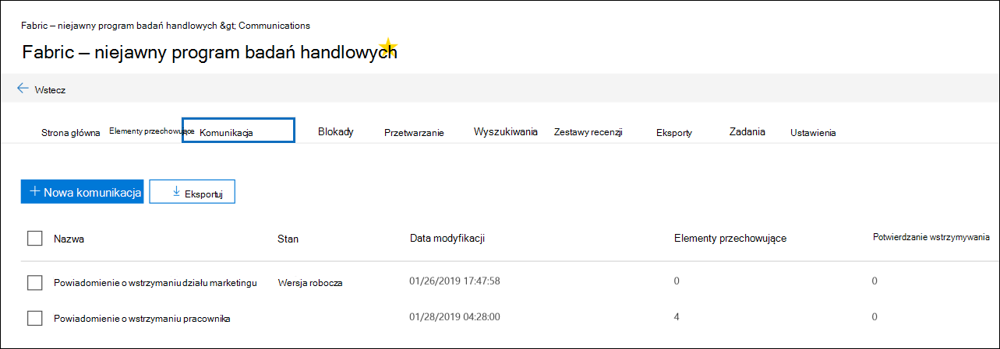
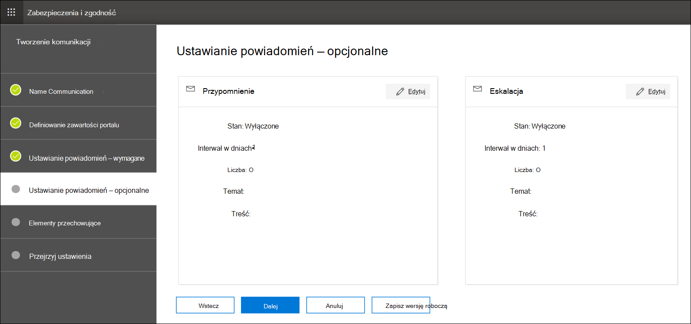

# Tworzenie powiadomienia o blokadzie prawnej

Korzystając z komunikacji z opiekunami zbierania elektronicznych materiałów dowodowych (Premium), organizacje mogą zarządzać przepływem pracy podczas komunikowania się z opiekunami. Za pośrednictwem narzędzia Do komunikacji zespoły prawne mogą systematycznie wysyłać, zbierać i śledzić powiadomienia o blokadzie prawnej. Elastyczny proces tworzenia umożliwia również zespołom dostosowywanie przepływu pracy powiadomień o blokadzie i zawartości w powiadomieniach wysyłanych do opiekunów.

W tym artykule opisano kroki w przepływie pracy powiadamiania o blokadzie.

## Krok 1. Określanie szczegółów komunikacji

Pierwszym krokiem jest określenie odpowiednich szczegółów dotyczących prawnych powiadomień o wstrzymaniu lub innych komunikatów opiekunów.

1. W portal zgodności Microsoft Purview przejdź do obszaru **eDiscovery > Advanced**, aby wyświetlić listę przypadków w organizacji.

2. Wybierz przypadek, kliknij kartę **Komunikacja** , a następnie kliknij pozycję **Nowa komunikacja**.

3. Na stronie **komunikacji Nazwa** określ następujące ustawienia komunikacji.

    - **Nazwa**: jest to nazwa komunikacji.

    - **Urzędnik wystawiający**: lista rozwijana zawiera użytkowników w organizacji, którzy mogą zostać wybrani do komunikacji jako wystawiający certyfikaty. Każda wiadomość wysłana do opiekunów zostanie wysłana w imieniu wybranego urzędnika wystawiającego. Lista użytkowników na liście rozwijanej składa się z członków sprawy i pracowników wystawiających certyfikaty w całej organizacji. Ci urzędnicy wystawiający certyfikaty są dodawani przez administratora zbierania elektronicznych materiałów dowodowych i są dostępni we wszystkich przypadkach zbierania elektronicznych materiałów dowodowych (Premium) w organizacji. Aby uzyskać więcej informacji, zobacz [Manage issuing officers (Zarządzanie urzędnikami wystawiającym certyfikaty](advanced-ediscovery-issuing-officers.md)).

    - **Wybierz szablon komunikacji**: na liście rozwijanej są wyświetlane szablony z biblioteki Communications na stronie ustawień zbierania elektronicznych materiałów dowodowych (Premium). Jeśli wybierzesz szablon, zostanie on wyświetlony w **zawartości Definiowanie portalu** jako punkt początkowy dla tekstu tworzonej powiadomienia. Jeśli nie wybierzesz szablonu, musisz utworzyć powiadomienie samodzielnie od podstaw. Aby uzyskać więcej informacji na temat szablonów komunikacji, zobacz [Zarządzanie szablonami komunikacji opiekuna](advanced-ediscovery-communications-library.md).

4. Kliknij **Dalej**.

## Krok 2. Definiowanie zawartości portalu

Następnie możesz utworzyć i dodać zawartość powiadomienia o blokadzie. Na stronie **Definiowanie zawartości portalu** w **kreatorze tworzenia komunikacji** określ zawartość powiadomienia o blokadzie. Ta zawartość zostanie automatycznie dołączona do powiadomień o wystawianiu, ponownym problemie, przypomnieniu i eskalacji. Ponadto ta zawartość będzie wyświetlana w portalu zgodności opiekuna. Jeśli wybierzesz szablon z biblioteki Communications, zostanie on wyświetlony i będzie stanowić punkt początkowy dla tworzonej powiadomienia.

Aby utworzyć zawartość portalu:

1. Wpisz (lub wytnij i wklej z innego dokumentu) powiadomienie o wstrzymaniu w polu tekstowym zawartości portalu. Jeśli na poprzedniej stronie kreatora wybrano szablon komunikacji, zostanie wyświetlony szablon. Zawartość szablonu można edytować w razie potrzeby.

2. Wstaw zmienne scalania do powiadomienia, aby dostosować powiadomienie i udostępnić portal zgodności opiekuna.

3. Kliknij **Dalej**.

  > [!TIP]
  > Aby dowiedzieć się więcej na temat dostosowywania zawartości i formatu zawartości portalu, zobacz [Korzystanie z Edytora komunikacji](using-communications-editor.md).

## Krok 3. Ustawianie wymaganych powiadomień

Po zdefiniowaniu zawartości powiadomienia o wstrzymaniu można skonfigurować przepływy pracy dotyczące wysyłania procesu powiadomień i zarządzania nim. Powiadomienia to wiadomości e-mail wysyłane w celu powiadamiania opiekunów i śledzenia ich. Każdy opiekun dodany do komunikacji otrzyma to samo powiadomienie.

Aby skonfigurować i wysłać powiadomienie o wstrzymaniach, należy uwzględnić powiadomienia o wystawianiach, ponownych wystawiania i wydaniach.

### Powiadomienie o wystawianiu

Po utworzeniu komunikacji **powiadomienie o wystawieniu** jest inicjowane przez określonego inspektora wystawiającego. Powiadomienie o wystawieniu jest pierwszym komunikatem przesłanym do opiekuna w celu poinformowania go o obowiązkach zachowania.

Aby utworzyć powiadomienie o wystawieniu:

1. Na kafelku **Wystawianie** kliknij pozycję **Edytuj**.

2. W razie potrzeby dodaj dodatkowych członków lub pracowników spraw do pól **DW** i **Bcc** . Aby dodać wielu użytkowników do tych pól, oddziel adresy e-mail średnikami.

3. Określ **podmiot** powiadomienia (wymagane).

4. Określ zawartość lub dodatkowe instrukcje, które chcesz przekazać opiekunowi (wymagane). Zawartość portalu zdefiniowana w kroku 2 jest dodawana na końcu powiadomienia o wystawieniu.

5. Kliknij **Zapisz**.

### powiadomienie Re-Issuance

W miarę postępów sprawy opiekunowie mogą być zobowiązani do zachowania dodatkowych lub mniejszych danych, niż zostało to wcześniej poinstruowane. Po zaktualizowaniu zawartości portalu wysyłane jest powiadomienie o ponownym wydaniu i powiadamia opiekunów o wszelkich zmianach w ich obowiązkach zachowania.

Aby utworzyć powiadomienie o ponownym wysłaniu:

1. Na kafelku **Reissue** kliknij pozycję **Edytuj**.

2. W razie potrzeby dodaj dodatkowych członków lub pracowników spraw do pól **DW** i **Bcc** . Aby dodać wielu użytkowników do tych pól, oddziel adresy e-mail średnikami.

3. Określ **podmiot** powiadomienia (wymagane).

4. Określ zawartość lub dodatkowe instrukcje, które chcesz przekazać opiekunowi (wymagane). Zawartość portalu zdefiniowana w kroku 2 jest dodawana na końcu powiadomienia o ponownym uruchomieniu.

5. Kliknij **Zapisz**.

> [!NOTE]
> Jeśli zawartość portalu zostanie zmodyfikowana (na stronie **Definiowanie zawartości portalu** w kreatorze **komunikacji edycji** ), powiadomienie o ponownym wydaniu zostanie automatycznie wysłane do wszystkich opiekunów przypisanych do powiadomienia. Po wysłaniu powiadomienia opiekunowie zostaną poproszeni o ponowne potwierdzenie powiadomienia o wstrzymaniu. Jeśli skonfigurowano jakiekolwiek przepływy pracy przypomnienia lub eskalacji, zostaną one również ponownie uruchomione. Aby uzyskać więcej informacji na temat innych zdarzeń zarządzania przypadkami wyzwalających komunikację, zobacz [Zdarzenia wyzwalające powiadomienia](#events-that-trigger-notifications).

### Powiadomienie o wersji

Po rozwiązaniu sprawy lub jeśli opiekun nie podlega już zachowaniu treści, możesz zwolnić opiekuna ze sprawy. Jeśli opiekun otrzymał wcześniej powiadomienie o wstrzymaniu, powiadomienie o zwolnieniu może służyć do powiadamiania opiekunów, że zostali zwolnieni ze swojego obowiązku.

Aby utworzyć powiadomienie o wersji:

1. Na kafelku **Wydanie** kliknij pozycję **Edytuj**.

2. W razie potrzeby dodaj dodatkowych członków lub pracowników spraw do pól **DW** i **Bcc** . Aby dodać wielu użytkowników do tych pól, oddziel adresy e-mail średnikami.

3. Określ **podmiot** powiadomienia (wymagane).

4. Określ zawartość lub dodatkowe instrukcje, które chcesz przekazać opiekunowi (wymagane).

5. Kliknij **przycisk Zapisz** i przejdź do następnego kroku.

## (Opcjonalnie) Krok 4. Ustawianie opcjonalnych powiadomień

Opcjonalnie możesz uprościć przepływ pracy, aby śledzić brak odpowiedzi opiekunów, tworząc i planując automatyczne powiadomienia o przypomnieniu i eskalacji.

### Przypomnienia

Po wysłaniu powiadomienia o wstrzymaniu możesz śledzić brak odpowiedzi opiekunów, definiując przepływ pracy przypomnienia.

Aby zaplanować przypomnienia:

1. Na kafelku **Przypomnienie** kliknij pozycję **Edytuj**.

2. Włącz przepływ pracy **przypomnienia** , włączając przełącznik **Stan** (wymagane).

3. Określ **interwał przypomnienia (w dniach)** (wymagany). Jest to liczba dni oczekiwania przed wysłaniem pierwszego powiadomienia o przypomnieniu i monitowania. Jeśli na przykład ustawisz interwał przypomnienia na siedem dni, pierwsze przypomnienie zostanie wysłane siedem dni po początkowym wydaniu powiadomienia o blokadzie. Wszystkie kolejne przypomnienia będą również wysyłane co siedem dni.

4. Określ **liczbę przypomnień** (wymagane). To pole określa liczbę przypomnień wysyłanych do opiekunów, którzy nie odpowiadają. Jeśli na przykład ustawisz liczbę przypomnień na 3, opiekun otrzyma maksymalnie trzy przypomnienia. Gdy opiekun potwierdzi powiadomienie o blokadzie, przypomnienia nie będą już wysyłane do tego użytkownika.

5. Określ **podmiot** powiadomienia (wymagane).

6. Określ zawartość lub dodatkowe instrukcje, które chcesz przekazać opiekunowi (wymagane). Zawartość portalu zdefiniowana w kroku 2 jest dodawana na końcu powiadomienia o przypomnieniu.

7. Kliknij **przycisk Zapisz** i przejdź do następnego kroku.

### Eskalacji

W niektórych sytuacjach może być konieczne dodatkowe sposoby, aby śledzić nie odpowiada opiekunów. Jeśli opiekun nie potwierdzi powiadomienia o wstrzymaniu po otrzymaniu określonej liczby przypomnień, zespół prawny może określić przepływ pracy, aby automatycznie wysłać powiadomienie o eskalacji do opiekuna i jego menedżera.

Aby zaplanować eskalacje:

1. Na kafelku **Eskalacja** kliknij pozycję **Edytuj**.

2. Włącz przepływ pracy **eskalacji** , włączając przełącznik **Stan** .

3. Określ **interwał eskalacji (w dniach)** (wymagany).

4. Określ **liczbę eskalacji** (wymagane). To pole określa liczbę eskalacji do wysłania do opiekunów, którzy nie odpowiadają. Jeśli na przykład ustawisz liczbę eskalacji na 3, powiadomienie o eskalacji zostanie wysłane do opiekuna i jego menedżera maksymalnie trzy razy. Gdy opiekun potwierdzi powiadomienie o blokadzie, eskalacje nie będą już wysyłane.

5. Określ **podmiot** powiadomienia (wymagane).

6. Określ zawartość lub dodatkowe instrukcje, które chcesz przekazać opiekunowi (wymagane). Zawartość portalu zdefiniowana w kroku 2 jest dodawana na końcu powiadomienia o eskalacji.

7. Kliknij **przycisk Zapisz** i przejdź do następnego kroku.

## Krok 5. Przypisywanie opiekunów do otrzymywania powiadomień

Po sfinalizowaniu zawartości powiadomień wybierz opiekunów, do których chcesz wysyłać powiadomienia.

Aby dodać opiekunów:

1. Przypisz opiekunów do komunikacji, klikając pole wyboru obok ich nazwy.

    Po utworzeniu komunikacji przepływ pracy powiadomień zostanie automatycznie zastosowany do wybranych opiekunów.

2. Kliknij przycisk **Dalej** , aby przejrzeć ustawienia komunikacji i szczegóły.

> [!NOTE]
> Możesz dodać tylko opiekunów, którzy zostali dodani do sprawy i nie otrzymali kolejnego powiadomienia w tej sprawie.

## Krok 6. Przeglądanie ustawień

Po przejrzeniu ustawień i kliknięciu przycisku **Wyślij** , aby zakończyć komunikację, system automatycznie uruchomi przepływ pracy komunikacji, wysyłając powiadomienie o wystawieniu.

## Zdarzenia wyzwalające powiadomienia

W poniższej tabeli opisano zdarzenia w procesie zarządzania przypadkami wyzwalane, gdy różne typy powiadomień są wysyłane do opiekunów.

|Typ komunikacji|Wyzwalacz |
|:---------|:---------|
|Powiadomienia o wystawianiach|Początkowe utworzenie powiadomienia. Możesz również ręcznie ponownie wyślić powiadomienie o blokadzie. |
|Powiadomienia o ponownym wydawaniu|Aktualizowanie zawartości portalu na stronie **Definiowanie zawartości portalu** w kreatorze **edytuj komunikację** .|
|Informacje o wersji|Opiekun zostaje zwolniony ze sprawy.|
|Przypomnienia|Interwał i liczba przypomnień skonfigurowanych dla przypomnienia.|
|Eskalacji|Interwał i liczba przypomnień skonfigurowanych dla eskalacji.|
|||
