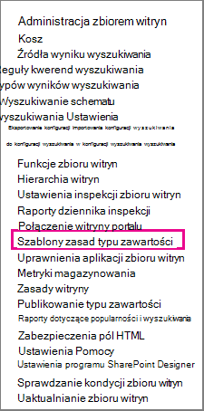
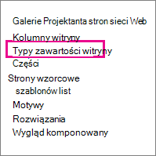
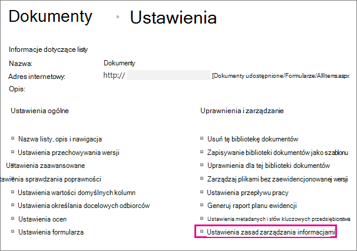

# Tworzenie i stosowanie zasad zarządzania informacjami

Zasady zarządzania informacjami umożliwiają organizacji kontrolowanie czasu przechowywania zawartości, przeprowadzanie inspekcji zawartości oraz dodawanie kodów kreskowych lub etykiet do dokumentów. Zasady mogą pomóc w egzekwowaniu zgodności z przepisami prawnymi i rządowymi lub wewnętrznymi procesami biznesowymi. Jako administrator możesz skonfigurować zasady umożliwiające kontrolowanie sposobu śledzenia dokumentów i czasu przechowywania dokumentów.

Zasady zarządzania informacjami można utworzyć w trzech różnych lokalizacjach w hierarchii lokacji, od najszerszej do najwęższej:

- Utwórz zasady do użycia w wielu typach zawartości w zbiorze witryn.
- Utwórz zasady dla typu zawartości witryny.
- Utwórz zasady dla listy lub biblioteki.

Aby uzyskać więcej informacji, zobacz [Wprowadzenie do zasad zarządzania informacjami](intro-to-info-mgmt-policies.md).

## Tworzenie zasad dla wielu typów zawartości w zbiorze witryn

Aby upewnić się, że zasady informacji są stosowane do wszystkich dokumentów określonego typu w zbiorze witryn, rozważ utworzenie zasad na poziomie zbioru witryn, a następnie zastosowanie zasad do typów zawartości. Są one określane jako zasady zbioru witryn.

1. Na stronie \> głównej zbioru witryn **Ustawienia** \>**Ustawienia witryny**.

    W SharePoint lokacji połączonej z grupą kliknij **pozycję Ustawienia**, kliknij pozycję **Zawartość witryny**, a następnie kliknij pozycję **Ustawienia witryny**.

2. Na stronie Ustawienia witryny w obszarze **Szablony zasad typów zawartości** **administracja zbiorem** \> witryn.

   

3. Na stronie \> Zasady **utwórz**.

4. Wprowadź nazwę i opis zasad, a następnie napisz krótką instrukcję zasad, która wyjaśnia użytkownikom, do czego są przeznaczone zasady.

5. Zobacz następną sekcję dotyczącą tworzenia zasad dla typu zawartości witryny, aby dowiedzieć się, jak skonfigurować funkcje, które chcesz skojarzyć z zasadami.

6. Wybierz pozycję **OK**.

## Tworzenie zasad dla typu zawartości witryny

Dodanie zasad zarządzania informacjami do typu zawartości ułatwia kojarzenie funkcji zasad z wieloma listami lub bibliotekami. Możesz dodać istniejące zasady zarządzania informacjami do typu zawartości lub utworzyć unikatowe zasady specyficzne dla pojedynczego typu zawartości.

 Można również dodać zasady zarządzania informacjami do typu zawartości specyficznego dla list. Skutkuje to zastosowaniem zasad tylko do elementów na tej liście, które używają typu zawartości.

1. Na stronie \> głównej zbioru witryn **Ustawienia** \>**Ustawienia witryny**.

    W SharePoint lokacji połączonej z grupą kliknij **pozycję Ustawienia**, kliknij pozycję **Zawartość witryny**, a następnie kliknij pozycję **Ustawienia witryny**.

2. Na stronie Ustawienia witryny w obszarze **Galerie projektanta** \> sieci Web **Typy zawartości witryny**.

   

3. Na stronie Typ zawartości witryny Ustawienia wybierz typ zawartości, do których chcesz dodać zasady.

4. Na stronie Typ zawartości witryny w obszarze **Ustawienia** \> **Ustawienia zasad zarządzania informacjami**.

5. Na stronie Edytowanie zasad wprowadź nazwę i opis zasad, a następnie napisz krótki opis wyjaśniający użytkownikom, do czego są przeznaczone zasady.

6. W następnych sekcjach wybierz poszczególne funkcje zasad, które chcesz dodać do zasad zarządzania informacjami.

   

7. Aby określić okres przechowywania dokumentów i elementów podlegających tym zasadom, wybierz pozycję **Włącz przechowywanie**, a następnie określ okres przechowywania i akcje, które mają wystąpić po wygaśnięciu elementów.

   Aby określić okres przechowywania:

   1. Wybierz **pozycję Dodaj etap przechowywania dla rekordów**.

   2. Wybierz opcję okresu przechowywania, aby określić, kiedy dokumenty lub elementy mają wygasnąć. Wykonaj jedną z następujących czynności:
      - Aby ustawić datę wygaśnięcia na podstawie właściwości date, w obszarze **Zdarzenie** \> **Ten etap jest oparty na właściwości daty dla elementu**, a następnie wybierz akcję dokumentu lub elementu (na przykład Utworzono lub Zmodyfikowano) oraz przyrost czasu po tej akcji (na przykład liczbę dni, miesięcy lub lat), gdy element ma wygasnąć.
      - Aby określić wygaśnięcie za pomocą niestandardowej formuły przechowywania, wybierz **pozycję Ustaw według niestandardowej formuły przechowywania zainstalowanej na tym serwerze**.

        > [!NOTE]
        > Ta opcja jest dostępna tylko wtedy, gdy administrator skonfigurował formułę niestandardową.

   3. Opcja **Uruchom przepływ pracy** jest dostępna tylko wtedy, gdy definiujesz zasady dla listy, biblioteki lub typu zawartości, który ma już skojarzony przepływ pracy. Następnie otrzymasz wybór przepływów pracy do wyboru.

   4. W sekcji **Cykl** wybierz pozycję **Powtórz akcję tego etapu...**, a następnie wprowadź częstotliwość ponownego wystąpienia akcji.

      > [!NOTE]
      >  Ta opcja jest dostępna tylko wtedy, gdy wybrana akcja może zostać powtórzona. Na przykład nie można ustawić cyklu dla akcji **Trwale usuń**.

   5. Wybierz pozycję **OK**.

8. Aby włączyć inspekcję dla dokumentów i elementów podlegających tym zasadom, wybierz pozycję **Włącz inspekcję**, a następnie określ zdarzenia, które chcesz przechować.

   Aby włączyć inspekcję:

   1. Na stronie Edytuj zasady w obszarze **Inspekcja** wybierz pozycję **Włącz inspekcję**, a następnie zaznacz pola wyboru obok zdarzeń, dla które chcesz zachować dziennik inspekcji.

   2. Aby monitować użytkowników o wstawianie tych kodów kreskowych do dokumentów, wybierz pozycję **Monituj użytkowników o wstawienie kodu kreskowego przed zapisaniem lub drukowaniem**.

   3. Wybierz przycisk **OK** , aby zastosować funkcję inspekcji do zasad.

   Funkcja Zasady inspekcji umożliwia organizacjom tworzenie i analizowanie dzienników inspekcji dla dokumentów oraz wyświetlanie listy elementów, takich jak listy zadań, listy problemów, grupy dyskusji i kalendarze. Ta funkcja zasad udostępnia dziennik inspekcji, który rejestruje zdarzenia, takie jak wyświetlanie, edytowanie lub usuwanie zawartości.

   Po włączeniu inspekcji w ramach zasad zarządzania informacjami administratorzy mogą wyświetlać dane inspekcji w raportach użycia zasad opartych na Microsoft Excel, które podsumowują bieżące użycie. Administratorzy mogą używać tych raportów do określania sposobu używania informacji w organizacji. Te raporty mogą również ułatwić organizacjom weryfikowanie i dokumentowanie zgodności z przepisami lub badanie potencjalnych problemów.

   Dziennik inspekcji rejestruje następujące informacje: nazwę zdarzenia, datę i godzinę zdarzenia oraz nazwę systemu użytkownika, który wykonał akcję.

9. Gdy kody kreskowe są włączone jako część zasad, są dodawane do właściwości dokumentu i wyświetlane w obszarze nagłówka dokumentu, do którego jest stosowany kod kreskowy. Podobnie jak etykiety, kody kreskowe można również ręcznie usunąć z dokumentu. Można określić, czy użytkownicy powinni być monitowane o uwzględnienie kodu kreskowego podczas drukowania lub zapisywania elementu lub czy kod kreskowy powinien zostać wstawiony ręcznie przy użyciu karty **Wstawianie** w programach wersji Office 2010.

   Aby włączyć kody kreskowe:

   1. Na stronie **Edytowanie zasad** w obszarze **Kody kreskowe** wybierz pozycję **Włącz kody kreskowe**.

   2. Aby monitować użytkowników o wstawianie tych kodów kreskowych do dokumentów, wybierz pozycję **Monituj użytkowników o wstawienie kodu kreskowego przed zapisaniem lub drukowaniem**.

   3. Wybierz przycisk **OK** , aby zastosować funkcję kodu kreskowego do zasad.

   Zasady kodu kreskowego generują kod 39 standardowych kodów kreskowych. Każdy obraz kodu kreskowego zawiera tekst poniżej symbolu kodu kreskowego, który reprezentuje wartość kodu kreskowego. Dzięki temu dane kodu kreskowego mogą być używane nawet wtedy, gdy skanowanie sprzętu jest niedostępne. Użytkownicy mogą ręcznie wpisać numer kodu kreskowego w polu wyszukiwania, aby zlokalizować element w witrynie.    |

10. Aby wymagać, aby dokumenty podlegające tym zasadom miały etykiety, wybierz pozycję **Włącz etykiety**, a następnie określ ustawienia dla etykiet.

    Aby włączyć etykiety:

    1. Aby wymagać od użytkowników dodania etykiety do dokumentu, wybierz pozycję **Monituj użytkowników o wstawienie etykiety przed zapisaniem lub drukowaniem**.

       > [!NOTE]
       > Jeśli chcesz, aby etykiety były opcjonalne, nie zaznaczaj tego pola wyboru.

    2. Aby zablokować etykietę, aby nie można jej było zmienić po jej wstawieniu, wybierz pozycję **Zapobiegaj zmianom etykiet po ich dodaniu**.

       To ustawienie uniemożliwia aktualizowanie tekstu etykiety po wstawieniu etykiety do elementu w aplikacji klienckiej, takiej jak Word, Excel lub PowerPoint. Jeśli chcesz, aby etykieta była aktualizowana podczas aktualizowania właściwości tego dokumentu lub elementu, nie zaznaczaj tego pola wyboru.

    3. W polu Format etykiety wprowadź tekst etykiety, który ma być wyświetlany. Etykiety mogą zawierać maksymalnie 10 odwołań do kolumn, z których każda może mieć długość do 255 znaków. Aby utworzyć format etykiety, wykonaj następujące kroki:
       - Wpisz nazwy kolumn, które mają zostać uwzględnione w etykiecie w kolejności, w której mają być wyświetlane. Umieść nazwy kolumn w nawiasach klamrowych ({}), jak pokazano w przykładzie na stronie Edytowanie zasad.
       - Wpisz wyrazy, aby zidentyfikować kolumny poza nawiasami kwadratowymi, jak pokazano w przykładzie na stronie Edytowanie zasad.

    4. Aby dodać podział wiersza, wprowadź **\n** , w którym ma zostać wyświetlony podział wiersza.

    5. Wybierz żądany rozmiar czcionki i styl, a następnie określ, czy etykieta ma być umieszczona w lewym, środkowym lub prawym rogu dokumentu.

       Wybierz czcionkę i styl, które są dostępne na komputerach użytkowników. Rozmiar czcionki ma wpływ na ilość tekstu, jaką można wyświetlić na etykiecie.

    6. Wprowadź wysokość i szerokość etykiety. Wysokość etykiety może wynosić od 0,25 cala do 20 cali, a szerokość etykiety może wynosić od 0,25 cala do 20 cali. Tekst etykiety jest zawsze wyśrodkowany w pionie w obrazie etykiety.

    7. Wybierz **pozycję Odśwież** , aby wyświetlić podgląd zawartości etykiety.

11. Wybierz pozycję **OK**.

## Tworzenie zasad dla listy, biblioteki lub folderu (zasady przechowywania oparte na lokalizacji)

Można zdefiniować zasady przechowywania, które mają zastosowanie tylko do określonej listy, biblioteki lub folderu. Jeśli jednak w ten sposób utworzysz zasady przechowywania, nie będzie można ponownie używać tych zasad na innych listach, bibliotekach, folderach lub lokacjach i nie można zastosować zasad zbioru witryn do zasad opartych na lokalizacji.

Jeśli chcesz zastosować pojedyncze zasady przechowywania do wszystkich typów zawartości w jednej lokalizacji, najprawdopodobniej będziesz chciał użyć przechowywania opartego na lokalizacji. W większości innych przypadków należy sprawdzić, czy zasady przechowywania są określone dla wszystkich typów zawartości.

Każdy podfolder dziedziczy zasady przechowywania elementu nadrzędnego, chyba że zdecydujesz się przerwać dziedziczenie i zdefiniować nowe zasady przechowywania na poziomie podrzędnym.

Jeśli chcesz zdefiniować zasady zarządzania informacjami inne niż przechowywanie na liście lub w bibliotece, musisz zdefiniować zasady zarządzania informacjami dla każdego typu zawartości listy skojarzonego z tą listą lub biblioteką.

Jeśli w dowolnym momencie zdecydujesz się na przełączenie z typu zawartości na zasady oparte na lokalizacji dla listy lub biblioteki, tylko zasady przechowywania będą używane jako zasady oparte na lokalizacji. Wszystkie inne zasady zarządzania (inspekcje, kody kreskowe i kody kreskowe) zostaną dziedziczone ze skojarzonych typów zawartości.

Zasady oparte na lokalizacji można wyłączyć dla zbioru witryn, dezaktywując funkcję przechowywania opartego na bibliotece i folderze. Dzięki temu administratorzy zbioru witryn mogą upewnić się, że zasady typów zawartości nie są zastępowane przez zasady oparte na lokalizacji administratora listy.

Aby zmienić ustawienia zasad zarządzania informacjami dla listy lub biblioteki, musisz mieć co najmniej uprawnienie Zarządzaj listami.

1. Przejdź do listy lub biblioteki, dla której chcesz określić zasady zarządzania informacjami.

2. Na wstążce wybierz kartę \> **Biblioteka** lub **Lista** **Ustawienia** lub **List Ustawienia**.

   W SharePoint Online kliknij **pozycję Ustawienia**, a następnie kliknij pozycję **Ustawienia listy** lub **Ustawienia biblioteki**.

3. W obszarze Ustawienia **zasad zarządzania informacjami** **o uprawnieniach i zarządzaniu**\>.

   

4. Na stronie Zasady zarządzania informacjami Ustawienia upewnij się, że źródło przechowywania listy lub biblioteki ma ustawioną wartość Biblioteka i foldery.

   Jeśli **typ zawartości** jest wyświetlany jako źródło, kliknij pozycję **Zmień źródło**, a następnie kliknij pozycję **Biblioteka i foldery**. Zostanie wyświetlony alert informujący o tym, że zasady przechowywania typów zawartości zostaną zignorowane. Wybierz pozycję **OK**.

5. Na stronie Edytowanie zasad w obszarze **Harmonogram przechowywania opartego na bibliotece** wprowadź krótki opis utworzonych zasad.

6. Wybierz **pozycję Dodaj etap przechowywania...**

   Należy pamiętać, że w obszarze Rekordy można zdefiniować różne zasady przechowywania rekordów, wybierając opcję Zdefiniuj różne etapy przechowywania rekordów.

7. W oknie dialogowym Właściwości etapu wybierz opcję okresu przechowywania, aby określić, kiedy dokumenty lub elementy mają wygasnąć. Wykonaj jeden z następujących kroków:

   - Aby ustawić datę wygaśnięcia na podstawie właściwości date, w obszarze **Zdarzenie** \> **Ten etap jest oparty na właściwości daty dla elementu**, a następnie wybierz akcję dokumentu lub elementu (na przykład Utworzono lub Zmodyfikowano) oraz przyrost czasu po tej akcji (na przykład liczbę dni, miesięcy lub lat), gdy element ma wygasnąć.

   - Aby określić wygaśnięcie za pomocą niestandardowej formuły przechowywania, wybierz **pozycję Ustaw według niestandardowej formuły przechowywania zainstalowanej na tym serwerze**.

     > [!NOTE]
     >  Ta opcja jest dostępna tylko wtedy, gdy administrator skonfigurował formułę niestandardową.

   - W obszarze **Akcja** określ, co ma się zdarzyć, gdy dokument lub element wygaśnie. Aby włączyć określoną akcję w dokumencie lub elemencie (takim jak usunięcie), wybierz akcję z listy.

8. Opcja **Uruchom przepływ pracy** jest dostępna tylko wtedy, gdy definiujesz zasady dla listy, biblioteki lub typu zawartości, który ma już skojarzony przepływ pracy. Następnie otrzymasz wybór przepływów pracy do wyboru.

9. W obszarze **Cykl** wybierz pozycję **Powtórz akcję tego etapu...** i wprowadź, jak często akcja ma się powtarzać.

   > [!NOTE]
   >  Ta opcja jest dostępna tylko wtedy, gdy wybrana akcja może zostać powtórzona. Na przykład nie można ustawić cyklu dla akcji **Trwale usuń**.

10. Wybierz pozycję **OK**.

## Stosowanie zasad zbioru witryn do typu zawartości

Jeśli zasady zarządzania informacjami zostały już utworzone dla twojej witryny jako zasady zbioru witryn, możesz zastosować jedną z zasad do typu zawartości. W ten sposób można zastosować te same zasady do wielu typów zawartości w zbiorze witryn, które nie współużytkują tego samego nadrzędnego typu zawartości.

 Jeśli chcesz zastosować zasady do wielu typów zawartości w zbiorze witryn i masz skonfigurowaną usługę zarządzanych metadanych, możesz użyć funkcji publikowania typu zawartości, aby opublikować zasady zarządzania informacjami w wielu zbiorach witryn. Aby uzyskać więcej informacji, zobacz [sekcję Stosowanie zasad w zbiorach witryn](#apply-a-policy-across-site-collections) .

1. Przejdź do listy lub biblioteki zawierającej typ zawartości, do którego chcesz zastosować zasady.

2. Na wstążce wybierz kartę \> **Biblioteka** lub **Lista** **Ustawienia** lub **List Ustawienia**.

   W SharePoint Online kliknij **pozycję Ustawienia**, a następnie kliknij pozycję **Ustawienia listy** lub **Ustawienia biblioteki**.

3. W obszarze Ustawienia **zasad zarządzania informacjami** **o uprawnieniach i zarządzaniu**\>.

   

4. Sprawdź, czy źródło zasad ma ustawioną wartość **Typy zawartości**, a w obszarze **Zasady typu zawartości** wybierz typ zawartości, do których chcesz zastosować zasady.

5. W obszarze **Określ zasady** \> **Użyj zasad zbioru witryn**, a następnie wybierz zasady, które chcesz zastosować z listy.

   > [!NOTE]
   >  Jeśli opcja **Użyj zasad zbioru witryn** jest niedostępna, dla zbioru witryn nie zdefiniowano żadnych zasad zbioru witryn.

6. Wybierz pozycję **OK**.

   Jeśli lista lub biblioteka, z którą pracujesz, obsługuje zarządzanie wieloma typami zawartości, w obszarze **Typy zawartości** możesz wybrać typ zawartości, dla którego chcesz określić zasady zarządzania informacjami. Spowoduje to bezpośrednie wykonanie kroku 5 powyżej.

## Stosowanie zasad w zbiorach witryn

Udostępnianie typów zawartości w zbiorach witryn przy użyciu aplikacji usługi zarządzanych metadanych w celu skonfigurowania publikowania typu zawartości. Publikowanie typu zawartości ułatwia spójne zarządzanie zawartością i metadanymi w witrynach, ponieważ typy zawartości można tworzyć i aktualizować centralnie, a aktualizacje można publikować w wielu subskrybujących zbiorach witryn lub aplikacjach internetowych.

## Tworzenie szablonu na podstawie istniejących zasad do użycia w zbiorach witryn

Możesz zdefiniować zasady zarządzania informacjami, a następnie utworzyć na jego podstawie szablon, który będzie używany zgodnie z potrzebami w wielu zbiorach witryn. Ta metoda może być używana, jeśli chcesz utworzyć kopię zapasową zasad informacji lub może być również używana jako alternatywna metoda do używania publikowania typu zawartości do stosowania jednej zasady w zbiorach witryn. Szablon lub kopię zapasową zasad można utworzyć, eksportując zasady z jednego zbioru witryn, a następnie importując je do zapisanej lokalizacji lub do innego zbioru witryn.

> [!IMPORTANT]
> Jeśli używasz funkcji eksportowania/importowania jako sposobu tworzenia zestawu szablonów zasad, pamiętaj, że w pliku .xml zasad istnieje unikatowy identyfikator. Z tego powodu nie można zaimportować tych zasad do lokacji więcej niż raz bez zmiany tego unikatowego identyfikatora.

### Eksportowanie zasad

1. Na stronie głównej zbioru witryn wybierz **pozycję Ustawienia**\> **Ustawienia witryny**.

   W SharePoint lokacji połączonej z grupą kliknij **pozycję Ustawienia**, kliknij pozycję **Zawartość witryny**, a następnie kliknij pozycję **Ustawienia witryny**.

2. Na stronie Ustawienia witryny w obszarze **Szablony zasad typów zawartości** **administracja zbiorem** \> witryn.

   

3. Wybierz zasady, które chcesz wyeksportować\>, przewiń do dolnego **eksportu**\>.

4. W wierszu polecenia, aby zapisać lub otworzyć plik, wybierz pozycję **Zapisz**, a następnie wybierz lokalizację do zapisania pliku. Pamiętaj, aby wybrać lokalizację, która jest dostępna dla zbiorów witryn importujących zasady.

5. Po wyświetleniu okna dialogowego Pobieranie ukończone wybierz pozycję **Zamknij**.

### Importowanie zasad do innego zbioru witryn

Zaimportowanie zasad zarządzania informacjami umożliwia zastosowanie ich do wielu typów zawartości na poziomie witryny lub listy w danym zbiorze witryn. Zalety tego działania są dwojakie: nie trzeba ponownie definiować i stosować zasad dla każdego typu zawartości i można łatwiej zarządzać modyfikacjami zasad, wprowadzając zmiany w zasadach tylko w jednym miejscu.

1. Na stronie głównej zbioru witryn, do którego chcesz zastosować zasady, wybierz **pozycję Ustawienia**\> **Ustawienia witryny**.

   W SharePoint lokacji połączonej z grupą kliknij **pozycję Ustawienia**, kliknij pozycję **Zawartość witryny**, a następnie kliknij pozycję **Ustawienia witryny**.

2. Na stronie Ustawienia witryny w obszarze **Szablony zasad typów zawartości** **administracja zbiorem** \> witryn.

3. Na stronie \> Zasady **zaimportuj** \> **przeglądanie** , aby znaleźć plik XML dla zasad.

4. Wybierz plik XML, w którym zasady zostały zapisane \> **Otwórz**.

5. Na stronie \> Importowanie zasad zbioru witryn **zaimportuj** , aby dodać zasady do zbioru witryn.

Zaimportowane zasady mogą być teraz stosowane do jednego lub wielu typów zawartości na poziomie witryny lub listy.

Zasady zarządzania informacjami umożliwiają organizacji kontrolowanie czasu przechowywania zawartości, przeprowadzanie inspekcji zawartości oraz dodawanie kodów kreskowych lub etykiet do dokumentów. Zasady mogą pomóc w egzekwowaniu zgodności z przepisami prawnymi i rządowymi lub wewnętrznymi procesami biznesowymi. Jako administrator możesz skonfigurować zasady umożliwiające kontrolowanie sposobu śledzenia dokumentów i czasu przechowywania dokumentów.

Zasady zarządzania informacjami można utworzyć w trzech różnych lokalizacjach w hierarchii lokacji, od najszerszej do najwęższej:

- Utwórz zasady do użycia w wielu typach zawartości w zbiorze witryn.
- Utwórz zasady dla typu zawartości witryny.
- Utwórz zasady dla listy lub biblioteki.

Aby uzyskać więcej informacji, zobacz [Wprowadzenie do zasad zarządzania informacjami](intro-to-info-mgmt-policies.md).
