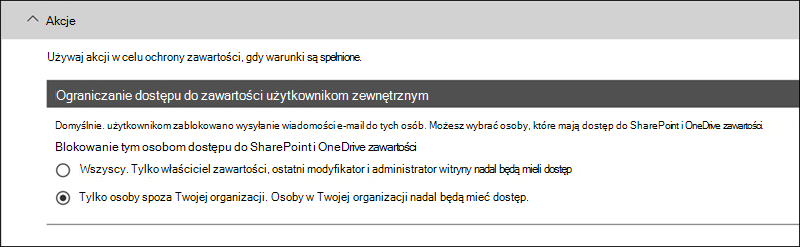
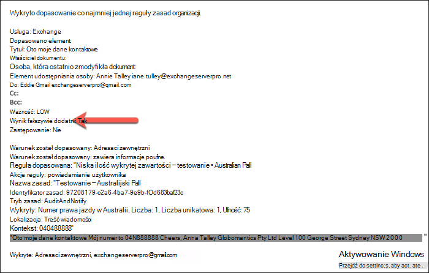
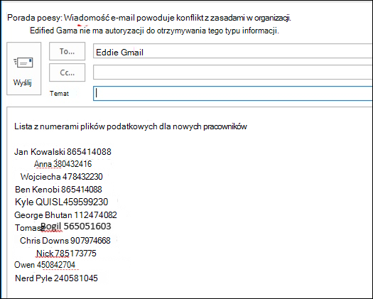

# <a name="create-test-and-tune-a-dlp-policy"></a>Twórz, testuj i dostrajaj zasady DLP

[!include[Purview banner](../includes/purview-rebrand-banner.md)]

Ochrona przed utratą danych w Microsoft Purview (DLP) pomaga zapobiegać przypadkowemu lub przypadkowemu udostępnianiu informacji poufnych.

DLP sprawdza wiadomości e-mail i pliki pod kątem informacji poufnych, takich jak numer karty kredytowej. Przy użyciu DLP można wykrywać poufne informacje i podejmować działania, takie jak:

- Rejestrowanie zdarzenia do celów inspekcji
- Wyświetl ostrzeżenie dla użytkownika końcowego, który wysyła wiadomość e-mail lub udostępnia plik
- Aktywne blokowanie udostępniania wiadomości e-mail lub plików

## <a name="permissions"></a>Uprawnienia

Członkowie zespołu ds. zgodności, którzy będą tworzyć zasady DLP, potrzebują uprawnień do Centrum zgodności. Domyślnie administrator dzierżawy będzie miał dostęp, aby zapewnić dostęp funkcjonariuszom ds. zgodności i innym osobom. Wykonaj następujące czynności:
  
1. Utwórz grupę w Microsoft 365 i dodaj do niej funkcjonariuszy zgodności.
    
2. Utwórz grupę ról na stronie **Uprawnienia** Centrum zgodności zabezpieczeń &amp; . 

3. Podczas tworzenia grupy ról użyj sekcji **Wybierz role** , aby dodać następującą rolę do grupy ról: **Zarządzanie zgodnością DLP**.
    
4. Użyj sekcji **Wybieranie członków**, aby dodać utworzoną wcześniej grupę Microsoft 365 do grupy ról.

Użyj roli **Zarządzanie zgodnością DLP tylko do wyświetlania** , aby utworzyć grupę ról z uprawnieniami tylko do wyświetlania do zasad DLP i raportów DLP.

Aby uzyskać więcej informacji, zobacz [Udzielanie użytkownikom dostępu do Centrum zgodności Office 365](../security/office-365-security/grant-access-to-the-security-and-compliance-center.md).
  
Te uprawnienia są wymagane do utworzenia i zastosowania zasad DLP, aby nie wymuszać zasad.

### <a name="roles-and-role-groups-in-preview"></a>Role i grupy ról w wersji zapoznawczej

W wersji zapoznawczej dostępne są role i grupy ról, które można przetestować, aby dostosować mechanizmy kontroli dostępu.

Oto lista odpowiednich ról w wersji zapoznawczej. Aby dowiedzieć się więcej na ich temat, zobacz [Role w Centrum zgodności & zabezpieczeń](../security/office-365-security/permissions-in-the-security-and-compliance-center.md#roles-in-the-security--compliance-center)

- administrator Information Protection
- analityk Information Protection
- badacz Information Protection
- czytelnik Information Protection

Oto lista odpowiednich grup ról, które są w wersji zapoznawczej. Aby dowiedzieć się więcej, zobacz [Grupy ról w Centrum zgodności & zabezpieczeń](../security/office-365-security/permissions-in-the-security-and-compliance-center.md#role-groups-in-the-security--compliance-center)

- Information Protection
- administratorzy Information Protection
- analitycy Information Protection
- Information Protection śledczy
- czytniki Information Protection

## <a name="how-sensitive-information-is-detected-by-dlp"></a>Jak poufne informacje są wykrywane przez DLP

DLP znajduje poufne informacje według dopasowania wzorca wyrażeń regularnych (RegEx) w połączeniu z innymi wskaźnikami, takimi jak bliskość niektórych słów kluczowych do pasujących wzorców. Na przykład numer karty kredytowej VISA ma 16 cyfr. Jednak te cyfry można pisać na różne sposoby, takie jak 1111-1111-1111-1111, 1111 1111 1111 1111 lub 1111111111111111.

Dowolny 16-cyfrowy ciąg niekoniecznie jest numerem karty kredytowej, może to być numer biletu z systemu pomocy technicznej lub numer seryjny sprzętu. Aby odróżnić numer karty kredytowej od nieszkodliwego 16-cyfrowego ciągu, wykonywane jest obliczenie (sumy kontrolnej), aby potwierdzić, że liczby są zgodne ze znanym wzorcem różnych marek kart kredytowych.

Jeśli DLP znajdzie słowa kluczowe, takie jak "VISA" lub "AMEX", w pobliżu wartości daty, które mogą być datą wygaśnięcia karty kredytowej, DLP również używa tych danych, aby pomóc mu zdecydować, czy ciąg jest numerem karty kredytowej, czy nie.

Innymi słowy, DLP jest wystarczająco inteligentny, aby rozpoznać różnicę między tymi dwoma ciągami tekstu w wiadomości e-mail:

- "Czy możesz zamówić mi nowy laptop. Użyj mojego numeru VISA 1111-1111-1111-1111, wygasaj 11/22 i wyślij mi szacowaną datę dostawy, gdy ją masz."
- "Mój numer seryjny laptopa to 2222-2222-2222-2222 i został zakupiony 11/2010. Przy okazji, czy moja wiza podróżna jest jeszcze zatwierdzona?"

Zobacz [Definicje jednostek typów informacji poufnych](sensitive-information-type-entity-definitions.md) , które objaśniają sposób wykrywania poszczególnych typów informacji.

## <a name="where-to-start-with-data-loss-prevention"></a>Od czego zacząć od zapobiegania utracie danych

Gdy ryzyko wycieku danych nie jest do końca oczywiste, trudno jest ustalić, gdzie dokładnie należy zacząć od zaimplementowania DLP. Na szczęście zasady DLP można uruchamiać w "trybie testowym", co pozwala ocenić ich skuteczność i dokładność przed ich włączeniem.

Zasady DLP dla Exchange Online można zarządzać za pośrednictwem centrum administracyjnego Exchange. Można jednak skonfigurować zasady DLP dla wszystkich obciążeń za pośrednictwem portal zgodności Microsoft Purview, więc tego właśnie użyję na potrzeby pokazów w tym artykule. W portal zgodności Microsoft Purview zasady DLP znajdziesz w obszarze **Ochrona przed** >  utratą **danychZasady**. Wybierz **pozycję Utwórz zasady,** aby rozpocząć.

Microsoft 365 udostępnia szereg [szablonów zasad DLP, których](what-the-dlp-policy-templates-include.md) można użyć do tworzenia zasad. Załóżmy, że jesteś australijską firmą. Szablony można filtrować w Australii, a następnie wybierać pozycje Finansowe, Medyczne i Zdrowotne oraz Prywatność.


Na potrzeby tej demonstracji wybierzę dane australijskich danych osobowych (PII), które obejmują typy informacji australijskiego numeru pliku podatkowego (TFN) i numeru prawa jazdy.


Nadaj nowej zasadom DLP nazwę. Nazwa domyślna będzie zgodna z szablonem zasad DLP, ale należy wybrać własną bardziej opisową nazwę, ponieważ można utworzyć wiele zasad na podstawie tego samego szablonu.


Wybierz lokalizacje, do których będą stosowane zasady. Zasady DLP mogą mieć zastosowanie do Exchange Online, SharePoint Online i OneDrive dla Firm. Pozostawię te zasady skonfigurowane tak, aby były stosowane do wszystkich lokalizacji.


W pierwszym kroku **Ustawienia zasad** po prostu zaakceptuj na razie wartości domyślne. Można dostosować zasady DLP, ale wartości domyślne są dobrym miejscem do rozpoczęcia.


Po kliknięciu przycisku Dalej** zostanie wyświetlona strona **Ustawienia zasad** z większą ilością opcji dostosowywania. W przypadku zasad, które właśnie testujesz, możesz zacząć wprowadzać pewne zmiany.

- Na razie wyłączyłem wskazówki dotyczące zasad, co jest rozsądnym krokiem do wykonania, jeśli po prostu testujesz rzeczy i nie chcesz jeszcze wyświetlać niczego użytkownikom. Porady dotyczące zasad zawierają ostrzeżenia dla użytkowników, że mają zamiar naruszać zasady DLP. Na przykład użytkownik Outlook zobaczy ostrzeżenie, że dołączony plik zawiera numery kart kredytowych i spowoduje odrzucenie wiadomości e-mail. Celem porad dotyczących zasad jest zatrzymanie niezgodnego zachowania przed jego wystąpieniem.
- Zmniejszyłam również liczbę wystąpień z 10 do 1, dzięki czemu te zasady wykryje wszelkie udostępnianie australijskich danych osobowych, a nie tylko zbiorcze udostępnianie danych.
- Do wiadomości e-mail raportu o zdarzeniu dodano również innego adresata.


Na koniec skonfigurowano te zasady tak, aby początkowo były uruchamiane w trybie testowym. Zwróć uwagę, że w tym miejscu jest również dostępna opcja wyłączenia porad dotyczących zasad w trybie testowym. Dzięki temu możesz mieć możliwość włączenia porad dotyczących zasad w zasadach, ale następnie zdecyduj, czy chcesz je pokazać, czy pominąć podczas testowania.


Na ekranie przeglądu końcowego kliknij pozycję **Utwórz** , aby zakończyć tworzenie zasad.

## <a name="test-a-dlp-policy"></a>Testowanie zasad DLP

Możesz usiąść i poczekać na wyzwolenie zasad przez normalną aktywność użytkownika lub spróbować wyzwolić je samodzielnie. Wcześniej łączyłem się z [definicjami jednostek typów informacji poufnych](sensitive-information-type-entity-definitions.md), co zapewnia informacje o sposobie wyzwalania dopasowań DLP.

Na przykład zasady DLP utworzone dla tego artykułu wykryje numery australijskich plików podatkowych (TFN). Zgodnie z dokumentacją dopasowanie jest oparte na następujących kryteriach.


 
Aby zademonstrować wykrywanie tfn w dość tępy sposób, wiadomość e-mail z napisem "Numer pliku podatkowego" i dziewięciocyfrowym ciągiem w bliskim sąsiedztwie przepłynie bez żadnych problemów. Powodem, dla którego zasady DLP nie są wyzwalane, jest to, że dziewięciocyfrowy ciąg musi przekazać sumę kontrolną, która wskazuje, że jest to prawidłowa nazwa TFN, a nie tylko nieszkodliwy ciąg liczb.


Dla porównania, wiadomość e-mail z wyrazami "Numer pliku podatkowego" i prawidłowa nazwa TFN, która przekazuje sumę kontrolną, wyzwoli zasady. W przypadku rekordu tutaj używana przeze mnie nazwa TFN została pobrana z witryny internetowej, która generuje prawidłowe, ale nie oryginalne nazwy TFN. Takie witryny są przydatne, ponieważ jednym z najczęstszych błędów podczas testowania zasad DLP jest użycie fałszywego numeru, który jest nieprawidłowy i nie przejdzie sumy kontrolnej (a zatem nie wyzwoli zasad).


Wiadomość e-mail z raportem o zdarzeniu zawiera typ wykrytych poufnych informacji, liczbę wykrytych wystąpień oraz poziom ufności wykrywania.


Jeśli pozostawisz zasady DLP w trybie testowym i przeanalizujesz wiadomości e-mail z raportami o zdarzeniach, możesz zacząć odczuwać dokładność zasad DLP i ich skuteczność, gdy zostaną wymuszone. Oprócz raportów o zdarzeniach możesz [użyć raportów DLP](view-the-dlp-reports.md) , aby wyświetlić zagregowany widok dopasowań zasad w całej dzierżawie.

## <a name="tune-a-dlp-policy"></a>Dostrajanie zasad DLP

Podczas analizowania trafień zasad warto wprowadzić pewne zmiany w sposobie zachowania zasad. W prostym przykładzie można określić, że jeden tfn w wiadomości e-mail nie jest problemem (myślę, że nadal jest, ale przejdźmy z nim w celu demonstracji), ale dwa lub więcej wystąpień jest problemem. Wiele wystąpień może być ryzykownym scenariuszem, takim jak wysłanie przez pracownika wiadomości e-mail eksportu CSV z bazy danych HR do zewnętrznej firmy, na przykład zewnętrznej usługi księgowej. Zdecydowanie coś, co wolisz wykryć i zablokować.

W Centrum zgodności można edytować istniejące zasady, aby dostosować zachowanie.


 
Ustawienia lokalizacji można dostosować tak, aby zasady były stosowane tylko do określonych obciążeń lub do określonych witryn i kont.


Możesz również dostosować ustawienia zasad i edytować reguły, aby lepiej odpowiadać twoim potrzebom.


Podczas edytowania reguły w ramach zasad DLP można zmienić:

- Warunki, w tym typ i liczba wystąpień poufnych danych, które będą wyzwalać regułę.
- Podejmowane akcje, takie jak ograniczanie dostępu do zawartości.
- Powiadomienia użytkownika, które są wskazówkami dotyczącymi zasad wyświetlanymi użytkownikowi w kliencie poczty e-mail lub przeglądarce internetowej.
- Przesłonięcia użytkowników określają, czy użytkownicy mogą mimo to kontynuować udostępnianie poczty e-mail lub plików.
- Raporty o zdarzeniach w celu powiadamiania administratorów.


Na potrzeby tej demonstracji dodano powiadomienia użytkowników do zasad (należy zachować ostrożność bez odpowiedniego szkolenia w zakresie świadomości użytkownika) i zezwoliłem użytkownikom na zastąpienie zasad uzasadnieniem biznesowym lub przez oflagowanie ich jako fałszywie dodatnich. Możesz również dostosować tekst porad dotyczących poczty e-mail i zasad, jeśli chcesz uwzględnić dodatkowe informacje o zasadach organizacji lub monitować użytkowników o kontakt z pomocą techniczną, jeśli mają pytania.


Zasady zawierają dwie reguły obsługi dużych i małych woluminów, dlatego pamiętaj, aby edytować obie akcje. Jest to okazja do odmiennego traktowania przypadków w zależności od ich cech. Na przykład można zezwolić na przesłonięcia dla naruszeń małej ilości woluminów, ale nie zezwalać na przesłonięcia w przypadku naruszeń dużej liczby woluminów.


Ponadto, jeśli chcesz faktycznie zablokować lub ograniczyć dostęp do zawartości, która narusza zasady, musisz skonfigurować akcję w regule, aby to zrobić.



Po zapisaniu tych zmian w ustawieniach zasad muszę również wrócić do strony ustawień głównych zasad i włączyć opcję pokazywania porad dotyczących zasad użytkownikom, gdy zasady są w trybie testowym. Jest to skuteczny sposób wprowadzenia zasad DLP dla użytkowników końcowych i trenowania świadomości użytkowników bez ryzyka zbyt wielu wyników fałszywie dodatnich, które mają wpływ na ich produktywność.


Po stronie serwera (lub po stronie chmury, jeśli wolisz), zmiana może nie zostać natychmiast wprowadzona ze względu na różne interwały przetwarzania. Jeśli wprowadzasz zmianę zasad DLP, która będzie wyświetlać użytkownikowi nowe wskazówki dotyczące zasad, użytkownik może nie widzieć, że zmiany zaczęły obowiązywać natychmiast w kliencie Outlook, który sprawdza zmiany zasad co 24 godziny. Jeśli chcesz przyspieszyć testowanie, możesz użyć tej poprawki rejestru, aby [wyczyścić sygnaturę czasową ostatniego pobierania z klucza PolicyNudges](https://support.microsoft.com/en-au/help/2823261/changes-to-a-data-loss-prevention-policy-don-t-take-effect-in-outlook?__hstc=18650278.46377037dc0a82baa8a30f0ef07a7b2f.1538687978676.1538693509953.1540315763430.3&__hssc=18650278.1.1540315763430&__hsfp=3446956451). Outlook pobierze najnowsze informacje o zasadach przy następnym ponownym uruchomieniu i rozpoczniesz tworzenie wiadomości e-mail.

Jeśli masz włączone wskazówki dotyczące zasad, użytkownik zacznie widzieć wskazówki w Outlook i może zgłaszać Ci wyniki fałszywie dodatnie, gdy wystąpią.


## <a name="investigate-false-positives"></a>Badanie wyników fałszywie dodatnich

Szablony zasad DLP nie są idealne od razu. Prawdopodobnie w środowisku wystąpią fałszywie dodatnie wyniki, dlatego tak ważne jest, aby ułatwić sobie przejście do wdrożenia DLP, poświęcając czas na odpowiednie przetestowanie i dostrojenie zasad.

Oto przykład fałszywie dodatniego wyniku. Ten adres e-mail jest nieszkodliwy. Użytkownik podaje komuś swój numer telefonu komórkowego, w tym sygnaturę e-mail.


 
Użytkownik widzi jednak poradę dotyczącą zasad ostrzegającą, że wiadomość e-mail zawiera poufne informacje, w szczególności numer australijskiego prawa jazdy.


Użytkownik może zgłosić wynik fałszywie dodatni, a administrator może sprawdzić, dlaczego tak się stało. W wiadomości e-mail raportu o zdarzeniu wiadomość e-mail jest oflagowana jako fałszywie dodatnia.



Ten przypadek prawa jazdy jest dobrym przykładem, aby zagłębić się w. Przyczyną tego fałszywie dodatniego wyniku jest to, że typ "Australijskie prawo jazdy" zostanie wyzwolony przez dowolny ciąg 9-cyfrowy (nawet taki, który jest częścią ciągu 10-cyfrowego), w odległości 300 znaków od słów kluczowych "Sydney nsw" (nie uwzględnia wielkość liter). Jest więc wyzwalany przez numer telefonu i podpis e-mail, tylko dlatego, że użytkownik jest w Sydney.


Jedną z opcji jest usunięcie z zasad typu informacji o australijskich prawach jazdy. Jest tam, ponieważ jest częścią szablonu zasad DLP, ale nie musimy go używać. Jeśli interesuje Cię tylko numer pliku podatkowego, a nie prawa jazdy, możesz po prostu je usunąć. Można na przykład usunąć ją z reguły niskiego woluminu w zasadach, ale pozostawić ją w regule dużego woluminu, aby listy wielu licencji kierowców były nadal wykrywane.
 
Inną opcją jest zwiększenie liczby wystąpień, tak aby wykryto małą liczbę praw jazdy tylko wtedy, gdy istnieje wiele wystąpień.


Oprócz zmiany liczby wystąpień można również dostosować dokładność dopasowania (lub poziom ufności). Jeśli typ informacji poufnych ma wiele wzorców, możesz dostosować dokładność dopasowania w regule, tak aby reguła odpowiadała tylko określonym wzorcom. Aby na przykład zmniejszyć liczbę wyników fałszywie dodatnich, można ustawić dokładność dopasowania reguły tak, aby była zgodna tylko ze wzorcem o najwyższym poziomie ufności. Aby uzyskać więcej informacji na temat poziomów ufności, zobacz [How to use confidence level to tune your rules (Jak dostroić reguły przy użyciu poziomu ufności](data-loss-prevention-policies.md#match-accuracy)).

Na koniec, jeśli chcesz uzyskać jeszcze bardziej zaawansowane, możesz dostosować dowolny typ informacji poufnych — na przykład możesz usunąć "Sydney NSW" z listy słów kluczowych dla [australijskiego numeru prawa jazdy](sensitive-information-type-entity-definitions.md#australia-drivers-license-number), aby wyeliminować fałszywie dodatni wyzwalany powyżej. Aby dowiedzieć się, jak to zrobić przy użyciu kodu XML i programu PowerShell, zobacz [dostosowywanie wbudowanego typu informacji poufnych](customize-a-built-in-sensitive-information-type.md).

## <a name="turn-on-a-dlp-policy"></a>Włączanie zasad DLP

Jeśli zasady DLP są dokładne i efektywnie wykrywają typy informacji poufnych, a użytkownicy końcowi są gotowi do radzenia sobie z wprowadzonymi zasadami, możesz włączyć zasady.


 
Jeśli czekasz, aby zobaczyć, kiedy zasady zostaną zastosowane, [Połączenie do programu PowerShell Centrum zgodności & zabezpieczeń](/powershell/exchange/connect-to-scc-powershell) i uruchom [polecenie cmdlet Get-DlpCompliancePolicy](/powershell/module/exchange/get-dlpcompliancepolicy), aby wyświetlić element DistributionStatus.

 ```powershell
 Get-DlpCompliancePolicy "Testing -Australia PII" -DistributionDetail | Select distributionstatus
 ```
Po włączeniu zasad DLP należy uruchomić własne testy końcowe, aby upewnić się, że mają miejsce oczekiwane akcje zasad. Jeśli próbujesz przetestować takie rzeczy jak dane karty kredytowej, w internecie znajdują się witryny internetowe z informacjami na temat sposobu generowania przykładowej karty kredytowej lub innych danych osobowych, które będą przekazywać sumy kontrolne i wyzwalać zasady.

Zasady, które zezwalają na przesłonięcia użytkowników, będą przedstawiać tę opcję użytkownikowi w ramach porady dotyczącej zasad.


Zasady ograniczające zawartość będą stanowić ostrzeżenie dla użytkownika w ramach porady dotyczącej zasad i uniemożliwią mu wysyłanie wiadomości e-mail.



## <a name="summary"></a>Podsumowanie

Zasady zapobiegania utracie danych są przydatne w organizacjach wszystkich typów. Testowanie niektórych zasad DLP jest ćwiczeniem o niskim ryzyku ze względu na kontrolę nad elementami, takimi jak porady dotyczące zasad, przesłonięcia użytkowników końcowych i raporty o zdarzeniach. Możesz po cichu przetestować niektóre zasady DLP, aby sprawdzić, jakiego typu naruszenia już występują w organizacji, a następnie utworzyć zasady z niskimi wskaźnikami fałszywie dodatnimi, edukować użytkowników na temat tego, co jest dozwolone i niedozwolone, a następnie wdrożyć zasady DLP w organizacji.
