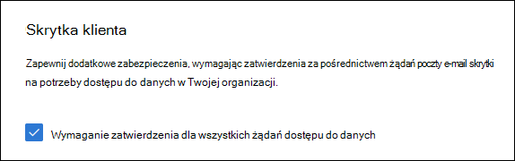
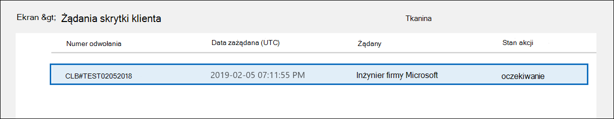
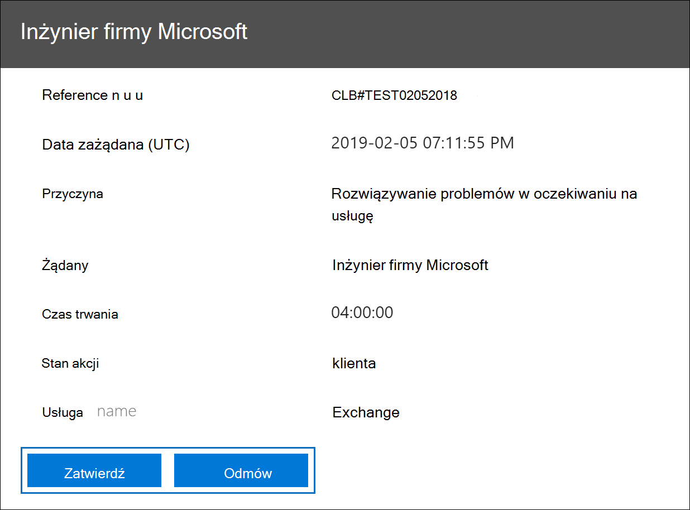

# <a name="microsoft-purview-customer-lockbox"></a>Skrytka klienta w Microsoft Purview

Ten artykuł zawiera wskazówki dotyczące wdrażania i konfiguracji dla skrytki klienta. Skrytka klienta obsługuje żądania dostępu do danych w usługach Exchange Online, SharePoint Online, OneDrive dla Firm i Teams. Aby zalecić obsługę innych usług, prześlij żądanie w [portalu opinii](https://feedbackportal.microsoft.com).

Aby wyświetlić opcje licencjonowania użytkowników w celu skorzystania z ofert usługi Microsoft Purview, zobacz [wskazówki dotyczące licencjonowania platformy Microsoft 365 dotyczące zgodności & zabezpieczeń](/office365/servicedescriptions/microsoft-365-service-descriptions/microsoft-365-tenantlevel-services-licensing-guidance/microsoft-365-security-compliance-licensing-guidance).

Skrytka klienta zapewnia, że firma Microsoft nie może uzyskać dostępu do Zawartości w celu wykonywania operacji usług bez twojej jawnej zgody. Skrytka klienta umożliwia przejście do procesu przepływu pracy zatwierdzania używanego przez firmę Microsoft w celu zapewnienia, że tylko autoryzowane żądania zezwalają na dostęp do zawartości. Aby dowiedzieć się więcej na temat procesu przepływu pracy firmy Microsoft, zobacz [Privileged access management (Zarządzanie dostępem uprzywilejowanym](privileged-access-management-solution-overview.md)).

Od czasu do czasu inżynierowie firmy Microsoft pomagają rozwiązywać problemy występujące w usłudze. Zazwyczaj inżynierowie rozwiązują problemy z używaniem rozbudowanych narzędzi telemetrycznych i debugowania, które firma Microsoft ma w swoich usługach. Jednak w niektórych przypadkach inżynier firmy Microsoft musi uzyskać dostęp do zawartości w celu ustalenia głównej przyczyny i rozwiązania problemu. Skrytka klienta wymaga od inżyniera żądania dostępu od Ciebie jako ostatniego kroku w przepływie pracy zatwierdzania. Daje to możliwość zatwierdzenia lub odrzucenia żądania dla organizacji i zapewnienia bezpośredniej kontroli dostępu do zawartości.

## <a name="customer-lockbox-overview-video"></a>Wideo z omówieniem skrytki klienta

> [!VIDEO https://www.microsoft.com/videoplayer/embed/8fecf10b-1f03-4849-8b67-76d3d2a43f26?autoplay=false]

## <a name="customer-lockbox-workflow"></a>Przepływ pracy skrzynki blokady klienta

Te kroki przedstawiają typowy przepływ pracy, gdy inżynier firmy Microsoft uruchamia żądanie skrytki klienta:

1. Ktoś w organizacji napotyka problem ze swoją skrzynką pocztową platformy Microsoft 365.

2. Gdy użytkownik rozwiąże problem, ale nie może go rozwiązać, otwiera żądanie pomocy technicznej z pomoc techniczna firmy Microsoft.

3. Inżynier pomocy technicznej firmy Microsoft przegląda żądanie obsługi i określa potrzebę uzyskania dostępu do dzierżawy organizacji w celu rozwiązania problemu.

4. Inżynier pomocy technicznej firmy Microsoft loguje się do narzędzia żądania skrzynki odbiorczej i wysyła żądanie dostępu do danych, które obejmuje nazwę dzierżawy organizacji, numer żądania obsługi i szacowany czas, przez który inżynier potrzebuje dostępu do danych.

5. Po zatwierdzeniu żądania przez menedżera pomoc techniczna firmy Microsoft skrytka klienta wysyła wyznaczonemu osobie zatwierdzającej w organizacji powiadomienie e-mail o oczekującym żądaniu dostępu od firmy Microsoft.

    

   Każdy, kto ma przypisaną rolę administratora [osoby zatwierdzającą dostęp do skrytki klienta](/office365/admin/add-users/about-admin-roles) w Centrum administracyjne platformy Microsoft 365, może zatwierdzać żądania skrytki klienta.

6. Osoba zatwierdzająca loguje się do Centrum administracyjne platformy Microsoft 365 i zatwierdza żądanie. Ten krok wyzwala tworzenie rekordu inspekcji dostępnego przez przeszukanie dziennika inspekcji. Aby uzyskać więcej informacji, zobacz [Auditing Customer Lockbox requests (Inspekcja żądań skrytki klienta](#auditing-customer-lockbox-requests)).

   Jeśli klient odrzuci żądanie lub nie zatwierdzi żądania w ciągu 12 godzin, żądanie wygaśnie i żaden dostęp nie zostanie udzielony inżynierowi firmy Microsoft.

   > [!IMPORTANT]
   > Firma Microsoft nie zawiera żadnych linków w powiadomieniach e-mail dotyczących skrzynki blokady klienta, które wymagają zalogowania się do Office 365.

7. Gdy osoba zatwierdzająca z organizacji zatwierdzi żądanie, inżynier firmy Microsoft otrzyma komunikat o zatwierdzeniu, zaloguje się do dzierżawy i rozwiąze problem klienta. Inżynierowie firmy Microsoft mają żądany czas trwania, aby rozwiązać problem, po którym dostęp zostanie automatycznie odwołany.

> [!NOTE]
> Wszystkie akcje wykonywane przez inżyniera firmy Microsoft są rejestrowane w dzienniku inspekcji. Możesz wyszukać i przejrzeć te rekordy inspekcji.

## <a name="turn-customer-lockbox-requests-on-or-off"></a>Włączanie lub wyłączanie żądań skrytki klienta

Kontrolki Skrytka klienta można włączyć w Centrum administracyjne platformy Microsoft 365. Po włączeniu skrytki klienta firma Microsoft musi uzyskać zgodę organizacji przed uzyskaniem dostępu do dowolnej zawartości dzierżawy.

1. Korzystając z konta służbowego z przypisaną rolą administratora globalnego lub **osoby zatwierdzającą dostęp do skrytki klienta** , przejdź do [https://admin.microsoft.com](https://admin.microsoft.com) strony i zaloguj się.

2. Wybierz pozycję **Ustawienia** >  ustawienia  > **organizacji****Zabezpieczenia & prywatność**.

3. Wybierz pozycję **Zabezpieczenia & prywatność**, a następnie wybierz pozycję **Skrytka klienta** w lewej kolumnie. Zaznacz pole wyboru **Wymagaj zatwierdzenia dla wszystkich żądań dostępu do danych** i zapisz zmiany, aby włączyć funkcję.

    

## <a name="approve-or-deny-a-customer-lockbox-request"></a>Zatwierdzanie lub odrzucanie żądania skrytki klienta

1. Korzystając z konta służbowego z przypisaną rolą administratora globalnego lub **osoby zatwierdzającą dostęp do skrytki klienta** , przejdź do [https://admin.microsoft.com](https://admin.microsoft.com) strony i zaloguj się.

2. Wybierz pozycję **Pomoc techniczna > żądania skrytki klienta**.

    

    Zostanie wyświetlona lista żądań skrytki klienta.

    

3. Wybierz żądanie skrytki klienta, a następnie wybierz pozycję **Zatwierdź** lub **Odmów**.

    

    Zostanie wyświetlony komunikat potwierdzający zatwierdzenie żądania skrytki klienta.

    

> [!NOTE]
> Użyj polecenia cmdlet Set-AccessToCustomerDataRequest, aby zatwierdzać, odrzucać lub anulować żądania skrytki klienta usługi Microsoft Purview kontrolujące dostęp do danych przez inżynierów pomocy technicznej firmy Microsoft. Aby uzyskać więcej informacji, zobacz [Set-AccessToCustomerDataRequest](/powershell/module/exchange/set-accesstocustomerdatarequest).

## <a name="auditing-customer-lockbox-requests"></a>Inspekcja żądań skrytki klienta

Rekordy inspekcji odpowiadające żądaniom skrytki klienta są rejestrowane w dzienniku inspekcji platformy Microsoft 365. Dostęp do tych dzienników można uzyskać za pomocą [narzędzia do wyszukiwania dzienników inspekcji](search-the-audit-log-in-security-and-compliance.md) w portal zgodności Microsoft Purview. Akcje związane z akceptowaniem lub odrzucaniem żądania skrytki klienta oraz akcjami wykonywanymi przez inżynierów firmy Microsoft (po zatwierdzeniu żądań dostępu) są również rejestrowane w dzienniku inspekcji. Możesz wyszukać i przejrzeć te rekordy inspekcji.

### <a name="search-the-audit-log-for-activity-related-to-customer-lockbox-requests"></a>Wyszukaj w dzienniku inspekcji aktywność związaną z żądaniami skrzynki blokady klienta

Zanim będzie można użyć dziennika inspekcji do śledzenia żądań dotyczących skrytki klienta, należy wykonać kilka kroków w celu skonfigurowania rejestrowania inspekcji, w tym przypisania uprawnień do przeszukiwania dziennika inspekcji. Aby uzyskać więcej informacji, zobacz [Konfigurowanie Inspekcja w Microsoft Purview (standardowa)](set-up-basic-audit.md). Po zakończeniu konfiguracji wykonaj następujące kroki, aby utworzyć zapytanie wyszukiwania dzienników inspekcji w celu zwrócenia rekordów inspekcji związanych ze skrytą klienta:

1. Przejdź do <https://compliance.microsoft.com>.
  
2. Zaloguj się przy użyciu konta, do których przypisano odpowiednie uprawnienia do przeszukiwania dziennika inspekcji.

3. W okienku po lewej stronie centrum zgodności wybierz pozycję **Inspekcja**.

    Zostanie wyświetlona karta **Wyszukiwanie** na stronie **Inspekcja** .

    
  
4. Skonfiguruj następujące kryteria wyszukiwania:

   1. **Data rozpoczęcia** i **data zakończenia**. Wybierz zakres dat i godzin, aby wyświetlić zdarzenia, które wystąpiły w tym okresie.  

   2. **Działania**. Pozostaw to pole puste, aby wyszukiwanie zwracało rekordy inspekcji dla wszystkich działań. Jest to niezbędne do zwrócenia wszelkich rekordów inspekcji związanych z żądaniami skrytki klienta i odpowiadających im działań wykonywanych przez inżynierów firmy Microsoft.

   3. **Użytkownicy**. Pozostaw to pole puste.

   4. **Plik, folder lub witryna**. Pozostaw to pole puste.

5. Kliknij pozycję **Wyszukaj** , aby uruchomić wyszukiwanie przy użyciu kryteriów wyszukiwania.

    Wyniki wyszukiwania są wyświetlane po kilku chwilach. Więcej wyników wyszukiwania zostanie dodanych do strony do momentu zakończenia wyszukiwania.

6. Kliknij nagłówek w kolumnie **Działanie** , aby posortować wyniki alfabetycznie na podstawie wartości w kolumnie **Działanie** .

7. Przewiń w dół i poszukaj rekordów inspekcji z działaniem **Set-AccessToCustomerDataRequest**. Rekordy z tym działaniem są powiązane z osobą zatwierdzającą w organizacji zatwierdzającą lub odmawiającą żądania skrytki klienta.

8. Możesz też kliknąć nagłówek w kolumnie **Użytkownik** , aby posortować wyniki alfabetycznie przy użyciu wartości w kolumnie **Użytkownik** . Poszukaj wartości **operatora firmy Microsoft**, która wskazuje działania wykonywane przez inżyniera firmy Microsoft w odpowiedzi na zatwierdzone żądanie skrytki klienta. W kolumnie **Activity (Działanie** ) jest wyświetlana akcja wykonywana przez inżyniera.

      

9. Na liście wyników kliknij rekord inspekcji, aby go wyświetlić.

### <a name="export-the-audit-log-search-results"></a>Eksportowanie wyników wyszukiwania dziennika inspekcji

Możesz również wyeksportować wyniki wyszukiwania dziennika inspekcji do pliku CSV, a następnie otworzyć plik w programie Excel, aby skorzystać z funkcji filtrowania i sortowania, aby ułatwić znajdowanie i wyświetlanie rekordów inspekcji związanych z żądaniem dostępu do skrytki klienta.

Aby wyeksportować rekordy inspekcji, wykonaj poprzednie kroki, aby przeszukać dziennik inspekcji. Po zakończeniu wyszukiwania wybierz pozycję **Eksportuj > Pobierz wszystkie wyniki** w górnej części strony wyników wyszukiwania. Po zakończeniu procesu eksportowania można pobrać plik CSV na komputer lokalny. Aby uzyskać bardziej szczegółowe instrukcje, zobacz [Eksportowanie, konfigurowanie i wyświetlanie rekordów dziennika inspekcji](export-view-audit-log-records.md).

Po pobraniu pliku możesz otworzyć go w programie Excel, a następnie filtrować w kolumnie **Operacje** , aby wyświetlić rekordy inspekcji dla działań **Set-AccessToCustomerDataRequest** . Możesz również filtrować kolumnę **UserIds** (przy użyciu wartości **Operator firmy Microsoft**), aby wyświetlić rekordy inspekcji dla działań wykonywanych przez inżynierów firmy Microsoft.

> [!NOTE]
> Podczas wyświetlania rekordów inspekcji w pliku CSV dodatkowe informacje znajdują się w kolumnie **AuditData** . Informacje w tej kolumnie znajdują się w obiekcie JSON, który zawiera wiele właściwości skonfigurowanych jako pary *property:value* rozdzielone przecinkami. Funkcja przekształcania JSON w Edytor Power Query w programie Excel umożliwia podzielenie każdej właściwości obiektu JSON w kolumnie **AuditData** na wiele kolumn, dzięki czemu każda właściwość ma własną kolumnę. Ułatwia to interpretowanie tych informacji. Aby uzyskać szczegółowe instrukcje, zobacz [Formatowanie wyeksportowanego dziennika inspekcji przy użyciu Edytor Power Query](export-view-audit-log-records.md#step-2-format-the-exported-audit-log-using-the-power-query-editor).

### <a name="use-powershell-to-search-and-export-audit-records"></a>Wyszukiwanie i eksportowanie rekordów inspekcji przy użyciu programu PowerShell

Alternatywą dla używania narzędzia do wyszukiwania inspekcji w portal zgodności Microsoft Purview jest uruchomienie polecenia cmdlet [Search-UnifiedAuditLog](/powershell/module/exchange/search-unifiedauditlog) w programie Exchange Online programu PowerShell. Jedną z zalet korzystania z programu PowerShell jest możliwość wyszukiwania działań lub działań **set-AccessToCustomerDataRequest** wykonywanych przez inżynierów firmy Microsoft związanych z żądaniem skrytki klienta.

Po [nawiązaniu połączenia z programem Exchange Online programu PowerShell](/powershell/exchange/connect-to-exchange-online-powershell) uruchom jedno z następujących poleceń. Zastąp symbole zastępcze określonym zakresem dat.

`Set-AccessToCustomerDataRequest` Wyszukiwanie działań

```powershell
Search-UnifiedAuditLog -StartDate xx/xx/xxxx -EndDate xx/xx/xxxx -Operations Set-AccessToCustomerDataRequest
```

Wyszukiwanie działań wykonywanych przez inżynierów firmy Microsoft

```powershell
Search-UnifiedAuditLog -StartDate xx/xx/xxxx -EndDate xx/xx/xxxx -UserIds "Microsoft Operator"
```

Aby uzyskać więcej informacji i przykładów, zobacz [Używanie programu PowerShell do wyszukiwania i eksportowania rekordów dziennika inspekcji](export-view-audit-log-records.md#use-powershell-to-search-and-export-audit-log-records).

Udostępniamy również skrypt programu PowerShell, którego można użyć do przeszukiwania dziennika inspekcji i eksportowania wyników do pliku CSV. Aby uzyskać więcej informacji, zobacz [Używanie skryptu programu PowerShell do przeszukiwania dziennika inspekcji](audit-log-search-script.md).

### <a name="audit-record-for-a-customer-lockbox-request"></a>Rekord inspekcji żądania skrytki klienta

Gdy osoba w organizacji zatwierdza lub odrzuca żądanie skrzynki zabezpieczającej klienta, rekord inspekcji jest rejestrowany w dzienniku inspekcji zawiera następujące informacje.

| Właściwość rekordu inspekcji| Opis|
|:---------- |:----------|
| Data       | Data i godzina zatwierdzenia lub odrzucenia żądania skrzynki zabezpieczającej klienta.
| Adres IP | Adres IP maszyny, której osoba zatwierdzająca użyła do zatwierdzenia lub odrzucenia żądania. |
| Użytkownik       | Konto usługi BOXServiceAccount@\[customerforest.prod.outlook.com\].            |
| Działanie   | Set-AccessToCustomerDataRequest; jest to działanie inspekcji rejestrowane podczas zatwierdzania lub odrzucania żądania skrytki klienta.                                |
| Element       | Identyfikator GUID żądania skrzynki blokady klienta                             |

Poniższy zrzut ekranu przedstawia przykład rekordu inspekcji, który odpowiada zatwierdzonemu żądaniu skrzynki skrytki klienta. Jeśli żądanie skrytki klienta zostało odrzucone, wartość parametru `ApprovalDecision` to `Deny`.


### <a name="audit-record-for-an-action-performed-by-a-microsoft-engineer"></a>Rekord inspekcji dla akcji wykonanej przez inżyniera firmy Microsoft

Akcje wykonywane przez inżyniera firmy Microsoft po zatwierdzeniu żądania skrytki klienta (co może spowodować uzyskanie dostępu do zawartości klienta) są rejestrowane w dzienniku inspekcji. Te rekordy zawierają następujące informacje.

| Właściwość rekordu inspekcji| Opis|
|:---------- |:----------|
| Data       | Data wykonania akcji. Czas wykonania tej akcji będzie upływał w ciągu 4 godzin od zatwierdzenia żądania skrzynki zabezpieczającej klienta.              |
| Adres IP | Adres IP maszyny użytej przez inżyniera firmy Microsoft. |
| Użytkownik       | Microsoft Operator; ta wartość wskazuje, że rekord jest powiązany z żądaniem skrytki klienta.                                  |
| Działanie   | Nazwa działania wykonywanego przez inżyniera firmy Microsoft.|
| Element       | \<empty\>                                             |

## <a name="frequently-asked-questions"></a>Często zadawane pytania

### <a name="which-microsoft-365-services-does-customer-lockbox-apply-to"></a>Do których usług platformy Microsoft 365 ma zastosowanie skrytka klienta?

Skrytka klienta jest obecnie obsługiwana w usługach Exchange Online, SharePoint Online, OneDrive dla Firm i Teams.

### <a name="is-customer-lockbox-available-to-all-customers"></a>Czy skrytka klienta jest dostępna dla wszystkich klientów?

Skrytka klienta jest dołączona do subskrypcji platformy Microsoft 365 lub Office 365 E5 i może zostać dodana do innych planów z subskrypcją Information Protection i zgodności lub subskrypcją dodatku Zgodność zaawansowana. Aby uzyskać więcej informacji, zobacz [Plany i cennik](https://products.office.com/business/office-365-enterprise-e5-business-software) .

### <a name="what-is-customer-content"></a>Co to jest zawartość klienta?

Zawartość klienta to dane tworzone przez użytkowników usług i aplikacji platformy Microsoft 365. Przykłady zawartości klienta to:

- Treść wiadomości e-mail lub załączniki wiadomości e-mail

- Zawartość witryny programu SharePoint

- Informacje w treści pliku programu SharePoint

- treść pliku prezentacji Skype dla firm

- Wiadomości błyskawiczne lub konwersacje głosowe

- Tekst wprowadzony w czatach i kanałach usługi Teams w usłudze Teams, na przykład czaty 1:1, czaty grupowe, kanały udostępnione, kanały prywatne i czat na spotkania

- Inne dane wklejone do wątków czatu w usłudze Teams, takie jak fragmenty kodu, obrazy, wiadomości audio i wideo oraz linki

- Dane aplikacji i botów w czatach i kanałach usługi Teams

- Kanał aktywności usługi Teams

- Nagrania i transkrypcje spotkań w usłudze Teams

- Poczta głosowa

- Pliki publikowane w czatach i kanałach usługi Teams

- Wygenerowany przez klienta obiekt blob lub dane magazynu strukturalnego (na przykład kontenery SQL)

- Informacje o zabezpieczeniach należące do klienta (na przykład certyfikaty, klucze szyfrowania i hasła)

- Wnioskowania i wszystkie kolejne wnioski, jeśli zawartość klienta pozostaje

Aby uzyskać więcej informacji na temat zawartości klienta w Office 365, zobacz [centrum zaufania Office 365](https://products.office.com/business/office-365-trust-center-privacy/).

### <a name="who-is-notified-when-there-is-a-request-to-access-my-content"></a>Kto jest powiadamiany o żądaniu dostępu do mojej zawartości?

Administratorzy globalni i każda osoba, której przypisano rolę administratora osoby zatwierdzającą dostęp do skrzynki odbiorczej, są powiadamiani. Są to również ci sami użytkownicy, którzy mogą zatwierdzać żądania skrytki klienta.

### <a name="who-can-approve-or-reject-these-requests-in-my-organization"></a>Kto może zatwierdzić lub odrzucić te żądania w mojej organizacji?

Administratorzy globalni i każdy, kto ma przypisaną rolę administratora osoby zatwierdzającą dostęp do skrytki klienta, może zatwierdzać żądania skrytki klienta. Klienci kontrolują te przypisania ról w swoich organizacjach.

### <a name="how-do-i-opt-in-to-customer-lockbox"></a>Jak mogę zrezygnować ze skrytki klienta?

Administrator globalny może włączyć i skonfigurować skrytkę klienta w Centrum administracyjne platformy Microsoft 365.

### <a name="if-i-approve-a-customer-lockbox-request-what-can-the-engineer-do-and-how-will-i-know-what-the-microsoft-engineer-did"></a>Jeśli zatwierdzę żądanie skrzynki odbiorczej, co może zrobić inżynier i jak będę wiedzieć, co zrobił inżynier firmy Microsoft?

Po zatwierdzeniu żądania skrytki klienta inżynier firmy Microsoft przyznał te uprawnienia niezbędne do uzyskiwania dostępu do zawartości klienta przy użyciu wstępnie zatwierdzonych poleceń cmdlet. Działania wykonywane przez inżynierów firmy Microsoft w odpowiedzi na żądania skrzynki blokady klienta są rejestrowane i dostępne w dzienniku inspekcji w Centrum zgodności & zabezpieczeń.

### <a name="how-do-i-know-that-microsoft-follows-the-approval-process"></a>Jak mogę wiedzieć, że firma Microsoft jest zgodna z procesem zatwierdzania?

Możesz odwoływać się do powiadomień dotyczących zatwierdzania wiadomości e-mail wysyłanych do administratorów i osób zatwierdzających w organizacji za pomocą historii żądań skrzynki blokady klienta w [Centrum administracyjne platformy Microsoft 365](https://go.microsoft.com/fwlink/p/?linkid=2024339).

Skrytka klienta jest uwzględniona w najnowszym [raporcie inspekcji SOC 1 SSAE 16](https://servicetrust.microsoft.com/ViewPage/MSComplianceGuide?command=Download&downloadType=Document&downloadId=91592749-e86a-43ac-801e-121382614681&docTab=4ce99610-c9c0-11e7-8c2c-f908a777fa4d_SOC%20%2F%20SSAE%2016%20Reports). Aby uzyskać więcej informacji, najnowsze raporty można znaleźć w [portalu zaufania usługi firmy Microsoft](https://servicetrust.microsoft.com/ViewPage/MSComplianceGuide?command=Download&downloadType=Document&downloadId=91592749-e86a-43ac-801e-121382614681&docTab=4ce99610-c9c0-11e7-8c2c-f908a777fa4d_SOC%20%2F%20SSAE%2016%20Reports).

### <a name="can-microsoft-modify-the-list-of-approvers-for-my-tenant-if-not-how-is-it-prevented"></a>Czy firma Microsoft może zmodyfikować listę osób zatwierdzających dla mojej dzierżawy? Jeśli nie, w jaki sposób jest to zapobiec?

Tylko administrator globalny w organizacji może określić, kto może zatwierdzać żądania skrytki klienta. Oznacza to, że tylko członkowie grupy administrator globalny w usłudze Azure Active Directory mogą określić, kto może zatwierdzić żądanie. Członkostwo w grupie administrator globalny w usłudze Azure Active Directory jest zarządzane tylko przez organizację.

### <a name="what-if-i-need-more-information-about-a-content-access-request-to-approve-it"></a>Co zrobić, jeśli potrzebuję więcej informacji na temat żądania dostępu do zawartości, aby je zatwierdzić?

Każde żądanie skrytki klienta zawiera numer żądania obsługi platformy Microsoft 365. Aby uzyskać więcej informacji na temat żądania, możesz skontaktować się z pomoc techniczna firmy Microsoft i odwołać się do tego numeru usługi.

### <a name="when-a-customer-lockbox-request-is-approved-how-long-are-the-permissions-valid"></a>Jak długo uprawnienia są prawidłowe po zatwierdzeniu żądania skrytki klienta?

Obecnie maksymalny okres uprawnień dostępu udzielonych inżynierowi firmy Microsoft wynosi 4 godziny. Inżynier firmy Microsoft może również zażądać krótszego okresu.

### <a name="how-can-i-get-a-history-of-all-customer-lockbox-requests"></a>Jak mogę uzyskać historię wszystkich żądań skrytki klienta?

Wszystkie żądania skrytki klienta są wyświetlane w [Centrum administracyjne platformy Microsoft 365](https://go.microsoft.com/fwlink/p/?linkid=2024339).

### <a name="how-do-i-correlate-the-content-access-requests-with-the-related-audit-logs"></a>Jak mogę skorelować żądania dostępu do zawartości z powiązanymi dziennikami inspekcji?

Kanał informacyjny aktywności Centrum zgodności zawiera działania dziennika skrytki klienta. Klienci mogą odwoływać się do działań dziennika skrytki klienta z kanału aktywności względem otrzymanego żądania e-mail.

### <a name="what-happens-when-a-customer-doesnt-respond-to-a-customer-lockbox-request"></a>Co się stanie, gdy klient nie odpowie na żądanie skrytki klienta?

Żądania skrytki klienta mają domyślny czas trwania wynoszący 12 godzin. Jeśli nie odpowiesz na żądanie w ciągu 12 godzin, żądanie wygaśnie.

### <a name="what-does-microsoft-do-when-a-customer-rejects-a-customer-lockbox-request"></a>Co robi firma Microsoft, gdy klient odrzuci żądanie skrytki klienta?

Jeśli klient odrzuci żądanie skrytki klienta, nie ma dostępu do zawartości klienta. Jeśli użytkownik w organizacji nadal napotyka problem z usługą, który wymaga od firmy Microsoft dostępu do zawartości klienta w celu rozwiązania problemu, problem z usługą może się powtarzać, a firma Microsoft poinformuje o tym użytkownika.

### <a name="how-do-i-set-up-alerts-whenever-a-request-has-been-approved"></a>Jak mogę skonfigurować alerty za każdym razem, gdy żądanie zostało zatwierdzone?

Nie ma wbudowanej opcji powiadamiania administratorów. Administratorzy mogą jednak konfigurować alerty przy użyciu [Microsoft Defender for Cloud Apps](/cloud-app-security/getting-started-with-cloud-app-security#to-create-policies).

### <a name="does-customer-lockbox-protect-against-data-requests-from-law-enforcement-agencies-or-other-third-parties"></a>Czy blokada klienta chroni przed żądaniami danych ze strony organów ścigania lub innych osób trzecich?

L.p. Firma Microsoft poważnie traktuje żądania innych firm dotyczące danych klientów. Jako dostawca usług w chmurze firma Microsoft zawsze opowiada się za prywatnością danych klientów. W przypadku otrzymania wezwania do sądu firma Microsoft zawsze próbuje przekierować stronę trzecią do klienta w celu uzyskania informacji. (Przeczytaj blog Brada Smitha: [Ochrona danych klientów przed szpiegowaniem przez rząd](https://blogs.microsoft.com/blog/2013/12/04/protecting-customer-data-from-government-snooping/)). Okresowo publikujemy [szczegółowe informacje](https://www.microsoft.com/corporate-responsibility/lerr) o żądaniach organów ścigania, które otrzymuje firma Microsoft.

Aby uzyskać więcej informacji, zobacz [Centrum zaufania firmy Microsoft](https://www.microsoft.com/trustcenter/default.aspx) dotyczące żądań danych innych firm oraz sekcję "Ujawnianie danych klienta" w [Warunkach usług online](https://www.microsoft.com/Licensing/product-licensing/products.aspx) .

### <a name="how-does-microsoft-ensure-that-a-member-of-its-staff-doesnt-have-standing-access-to-customer-content-in-office-365-applications"></a>W jaki sposób firma Microsoft zapewnia, że członek jej personelu nie ma stałego dostępu do zawartości klienta w aplikacjach Office 365?

Firma Microsoft wdraża szeroko zakrojone środki zapobiegawcze za pośrednictwem systemów kontroli dostępu i środków detektywistycznych w celu identyfikowania i rozwiązywania problemów z próbami obejścia tych systemów kontroli dostępu. Platforma Microsoft 365 działa z zasadami najniższych uprawnień i dostępu just in time. W związku z tym żaden personel firmy Microsoft nie ma uprawnień dostępu do zawartości klienta na bieżąco. Jeśli udzielono uprawnień, jest ono przez ograniczony czas trwania.

Platforma Microsoft 365 używa systemu kontroli dostępu o nazwie *Skrytka* do przetwarzania żądań uprawnień, które umożliwiają wykonywanie funkcji operacyjnych i administracyjnych w ramach usługi. Operator musi zażądać dostępu do zawartości klienta przy użyciu skrytki, co wymaga od drugiej osoby podjęcia działań w ramach żądania (na przykład zatwierdzenia go) przed udzieleniem dostępu. Ta druga osoba nie może być osobą żądająca i musi zostać wyznaczona w celu zatwierdzenia dostępu do zawartości klienta. Tylko w przypadku zatwierdzenia żądania operator uzyskuje tymczasowy dostęp do zawartości klienta. Po upływie okresu podniesienia uprawnień skrytka odwołuje dostęp.

Aby uzyskać więcej informacji na temat ogólnych praktyk w zakresie zabezpieczeń firmy Microsoft, zapoznaj się z [postanowieniami dotyczącymi usług online](https://www.microsoft.com/licensing/product-licensing/products) .

### <a name="under-what-circumstances-do-microsoft-engineers-need-access-to-my-content"></a>W jakich okolicznościach inżynierowie firmy Microsoft potrzebują dostępu do mojej zawartości?

Najbardziej typowym scenariuszem, w którym inżynierowie firmy Microsoft potrzebują dostępu do zawartości klienta, jest wysłanie przez klienta wniosku o pomoc techniczną, który wymaga dostępu do rozwiązywania problemów. Podstawową zasadą platformy Microsoft 365 jest to, że usługa działa bez dostępu firmy Microsoft do zawartości klienta. Prawie wszystkie operacje usług wykonywane przez firmę Microsoft są w pełni zautomatyzowane, a zaangażowanie człowieka jest wysoce kontrolowane i abstrakcyjne z dala od zawartości klienta. Celem usługi Microsoft 365 jest dostęp do zawartości klienta w celu obsługi usługi, dopóki klient nie zatwierdzi konkretnego żądania dostępu firmy Microsoft.

### <a name="i-already-thought-my-data-was-secure-with-the-microsoft-cloud-so-why-do-i-need-customer-lockbox"></a>Myślałem już, że moje dane są bezpieczne w chmurze firmy Microsoft, więc dlaczego potrzebuję skrytki klienta?

Skrytka klienta zapewnia dodatkową warstwę kontroli, oferując klientom możliwość udzielenia jawnej autoryzacji dostępu dla operacji usługi. Dzięki wykazaniu, że istnieją procedury jawnego autoryzacji dostępu do danych, skrytka klienta pomaga również klientom spełnić pewne zobowiązania w zakresie zgodności, takie jak HIPAA i FEDRAMP.
