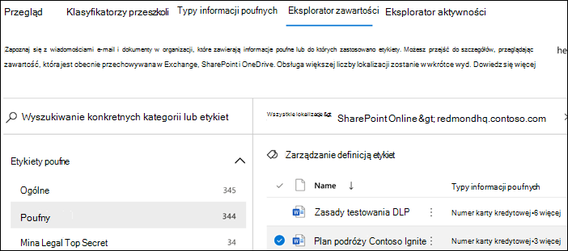

# Wprowadzenie do Eksploratora zawartości

Eksplorator zawartości klasyfikacji danych umożliwia natywnie wyświetlanie elementów podsumowanych na stronie przeglądu.

## Wymagania wstępne

Każde konto, które uzyskuje dostęp i używa klasyfikacji danych, musi mieć przypisaną do niego licencję z jednej z tych subskrypcji:

- Microsoft 365 (E5)
- Office 365 (E5)
- Dodatek Advanced Compliance (E5)
- Dodatek Zaawansowana inteligencja zagrożeń (E5)
- Ochrona Microsoft 365 E5/A5 na & informacji
- zgodność Microsoft 365 E5/A5

### Uprawnienia

Aby uzyskać dostęp do karty Eksplorator zawartości, należy przypisać członkostwo w dowolnej z tych ról lub grup ról. 

**Microsoft 365 grup ról**

- Administrator globalny
- Administrator zgodności
- Administrator zabezpieczeń
- Administrator danych zgodności

> [!IMPORTANT]
> Członkostwo w tych grupach ról nie umożliwia wyświetlania listy elementów w Eksploratorze zawartości ani wyświetlania zawartości elementów w Eksploratorze zawartości.

> [!IMPORTANT]
> Tylko administratorzy globalni mogą zarządzać uprawnieniami innych użytkowników w Centrum zgodności lub przypisywać je innym użytkownikom. Aby uzyskać więcej informacji, zobacz [Zapewnianie użytkownikom](../security/office-365-security/grant-access-to-the-security-and-compliance-center.md) dostępu do Centrum & zabezpieczeń.
> 
### Wymagane uprawnienia dostępu do elementów w Eksploratorze zawartości

Dostęp do Eksploratora zawartości jest bardzo ograniczony, ponieważ umożliwia czytanie zawartości zeskanowanych plików.

> [!IMPORTANT]
> Te uprawnienia wykraczają poza uprawnienia przypisane lokalnie do elementów, co umożliwia wyświetlanie zawartości. 

Istnieją dwie role, które przyznają dostęp do Eksploratora zawartości i są udzielane <a href="https://go.microsoft.com/fwlink/p/?linkid=2173597" target="_blank">przy użyciu Centrum zgodności platformy Microsoft 365</a>:

- **Przeglądarka list Eksploratora zawartości**: Członkostwo w tej grupie ról umożliwia wyświetlanie poszczególnych elementów i ich lokalizacji w widoku listy. Rola `data classification list viewer` została wstępnie przypisana do tej grupy ról.

- **Przeglądarka zawartości Eksploratora zawartości**: Członkostwo w tej grupie ról umożliwia wyświetlanie zawartości każdego elementu na liście. Rola `data classification content viewer` została wstępnie przypisana do tej grupy ról.

Konto, za pomocą których uzyskujesz dostęp do Eksploratora zawartości, musi znajdować się w jednej lub obu grupach ról. Są to niezależne grupy ról, które nie są skumulowane. Jeśli na przykład chcesz przyznać kontu możliwość wyświetlania tylko elementów i ich lokalizacji, ujmij w uprawnienia podglądu listy Eksploratora zawartości. Jeśli chcesz, aby to samo konto również wyświetlało zawartość elementów na liście, także przyznaj uprawnienia podglądu zawartości Eksploratora zawartości.

Możesz także przypisać jedną lub obie role do niestandardowej grupy ról, aby dostosować dostęp do Eksploratora zawartości.

Administrator globalny może przypisać niezbędne członkostwo w grupach ról Przeglądarki list Eksploratora zawartości i Przeglądarki zawartości.

#### Role i grupy ról w wersji Preview

W wersji Preview są dostępne role i grupy ról, które możesz przetestować, aby precyzyjnie dostosować kontrolki dostępu.

Oto lista dostępnych w wersji Microsoft Information Protection (MIP), które są dostępne w wersji zapoznawczej. Aby dowiedzieć się więcej na ich temat, zobacz [Role w Centrum & zabezpieczeń](../security/office-365-security/permissions-in-the-security-and-compliance-center.md#roles-in-the-security--compliance-center)

- Administrator ochrony informacji
- Analityk ochrony informacji
- Ochrona informacji
- Czytnik ochrony informacji

Poniżej znajdziesz listę grup ról miP, które są dostępne w wersji Preview. Aby dowiedzieć się więcej na ten temat, [zobacz Grupy ról w Centrum & zabezpieczeń.](../security/office-365-security/permissions-in-the-security-and-compliance-center.md#role-groups-in-the-security--compliance-center)

- Ochrona informacji
- Administratorzy ochrony informacji
- Analitycy ochrony informacji
- Schoweki ochrony informacji
- Czytniki informacji

## Eksplorator zawartości

Eksplorator zawartości pokazuje bieżącą migawkę elementów, które mają etykietę wrażliwości, etykietę przechowywania lub zostały sklasyfikowane jako typ informacji poufnych w organizacji.

### Typy informacji poufnych

Zasady [DLP pomagają](dlp-learn-about-dlp.md) chronić informacje poufne, zdefiniowane jako **typ informacji poufnych**. Microsoft 365 zawiera [definicje wielu typowych typów informacji poufnych](sensitive-information-type-entity-definitions.md) z wielu różnych regionów, które są gotowe do użycia. Może to być na przykład numer karty kredytowej, numery kont bankowych, identyfikatory państwowe Windows numery usług Live ID.

> [!NOTE]
> Eksplorator zawartości obecnie nie skanuje w poszukiwaniu typów informacji poufnych w programie Exchange Online.

### Etykiety wrażliwości

[Etykieta wrażliwości](sensitivity-labels.md) to po prostu tag wskazujący wartość elementu dla organizacji. Można go stosować ręcznie lub automatycznie. Po zastosowaniu zostanie on osadzony w dokumencie i będzie go obserwować wszędzie, gdziekolwiek się on znajdzie. Etykieta wrażliwości zapewnia różne sposoby ochrony, takie jak obowiązkowy znak wodny lub szyfrowanie.

Etykiety wrażliwości muszą być włączone dla plików w SharePoint i OneDrive, aby odpowiadające im dane zostały surface na stronie klasyfikacji danych. Aby uzyskać więcej informacji, zobacz [Włączanie etykiet wrażliwości Office plików w SharePoint i OneDrive](sensitivity-labels-sharepoint-onedrive-files.md).

### Etykiety przechowywania

[Etykieta przechowywania](retention.md) pozwala określić, jak długo jest przechowywany element oznaczony etykietą oraz jakie czynności należy wykonać przed jego usunięciem. Są one stosowane ręcznie lub automatycznie za pośrednictwem zasad. Mogą one pełnić rolę pomagającą organizacji w pozostawaniu w zrównaniu się z wymaganiami prawnymi i prawnymi.

### Jak używać Eksploratora zawartości

1. Otwórz **Centrum zgodności platformy Microsoft 365**  >  **KlasyfikacjaDanychUkońcowy** >  **Eksplorator.**
2. Jeśli znasz nazwę etykiety lub typ informacji poufnych, możesz wpisać ją w polu filtru.
3. Możesz również przejść do elementu, rozwijając typ etykiety i wybierając etykietę z listy.
4. Wybierz lokalizację w **obszarze Wszystkie lokalizacje** i przejdź do szczegółów struktury folderów do elementu.
5. Kliknij dwukrotnie, aby otworzyć element natywnie w Eksploratorze zawartości.

### Eksportowanie
**Kontrolka** eksportu utworzy plik .csv, który zawiera listę wszystkich pozycji pokazywanych w **okienku Wszystkie** lokalizacje.

### Wyszukiwanie

Po przechodzeniu do szczegółów w lokalizacji, takiej Exchange, folderze programu SharePoint lub OneDrive, zostanie **wyświetlone narzędzie wyszukiwania**.

Zakres narzędzia wyszukiwania jest wyświetlany w okienku Wszystkie lokalizacje,  a zakres opcji, według których można wyszukiwać, zależy od wybranej lokalizacji. 

Gdy **Exchange** wybraną lokalizacją, możesz na przykład wyszukać pełny adres e-mail skrzynki pocztowej`user@domainname.com`.

Gdy lokalizacja **SharePoint** lub OneDrive zaznaczona, narzędzie wyszukiwania zostanie wyświetlone podczas przechodzenia do szczegółów nazw witryn, folderów i plików. 

> [!NOTE]
> **OneDrive** wysłuchaliśmy Twojej cennej opinii na temat integracji OneDrive w trakcie programu w wersji Preview. Na podstawie tych opinii funkcje OneDrive będą dostępne w wersji Preview do momentu, aż będą dostępne wszystkie poprawki. W zależności od Twojej dzierżawy niektórzy klienci mogą nie OneDrive jako lokalizacji. Będziemy wdzięczni za dalsze wsparcie w tym związku.

Możesz wyszukiwać w:

|wartość|przykład  |
|---------|---------|
|pełna nazwa witryny    |`https://contoso.onmicrosoft.com/sites/sitename`    |
|nazwa folderu głównego — pobiera wszystkie podfoldery    | `/sites`        |
|nazwa pliku    |    `RES_Resume_1234.txt`     |
|tekst na początku nazwy pliku| `RES`|
|Tekst po znaku podkreślenia (_) w nazwie pliku|`Resume` lub `1234`| 
|rozszerzenie pliku|`txt`|

## Zobacz też

- [Dowiedz się więcej o etykietach poufności](sensitivity-labels.md)
- [Informacje o zasadach przechowywania i etykietach przechowywania](retention.md)
- [Jednostka typu informacji poufnych definitions.md](sensitive-information-type-entity-definitions.md)
- [Informacje na temat ochrony przed utratą danych](dlp-learn-about-dlp.md)
