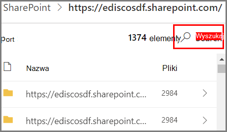

# Wprowadzenie do eksploratora zawartości

[!include[Purview banner](../includes/purview-rebrand-banner.md)]

Eksplorator zawartości umożliwia natywne wyświetlanie elementów podsumowanych na stronie przeglądu.

## Wymagania wstępne

Aby zapoznać się z wymaganiami dotyczącymi licencjonowania, zobacz [Information Protection: Analiza klasyfikacji danych: Omówienie Eksploratora aktywności & zawartości](/office365/servicedescriptions/microsoft-365-service-descriptions/microsoft-365-tenantlevel-services-licensing-guidance/microsoft-365-security-compliance-licensing-guidance#information-protection-data-classification-analytics-overview-content--activity-explorer)

### Uprawnienia

Aby uzyskać dostęp do karty eksploratora zawartości, konto musi mieć przypisane członkostwo w dowolnej z tych ról lub grup ról. 

**Microsoft 365 grupy ról**

- Administrator globalny
- Administrator zgodności
- Administrator zabezpieczeń
- Administrator danych zgodności

> [!IMPORTANT]
> Członkostwo w tych grupach ról nie umożliwia wyświetlania listy elementów w Eksploratorze zawartości ani wyświetlania zawartości elementów w Eksploratorze zawartości.

> [!IMPORTANT]
> Tylko administratorzy globalni mogą zarządzać uprawnieniami lub przypisywać je innym użytkownikom w portalu zgodności. Aby uzyskać więcej informacji, zobacz [Uprawnienia w portal zgodności Microsoft Purview](microsoft-365-compliance-center-permissions.md).
> 
### Wymagane uprawnienia dostępu do elementów w Eksploratorze zawartości

Dostęp do Eksploratora zawartości jest wysoce ograniczony, ponieważ umożliwia odczytywanie zawartości zeskanowanych plików.

> [!IMPORTANT]
> Te uprawnienia zawłaszczają uprawnienia, które są przypisywane lokalnie do elementów, co umożliwia wyświetlanie zawartości. 

Istnieją dwie role, które udzielają dostępu do Eksploratora zawartości i są przyznawane przy użyciu <a href="https://go.microsoft.com/fwlink/p/?linkid=2173597" target="_blank">portal zgodności Microsoft Purview</a>:

- **Przeglądarka listy Eksploratora zawartości**: członkostwo w tej grupie ról umożliwia wyświetlanie każdego elementu i jego lokalizacji w widoku listy. Rola `data classification list viewer` została wstępnie przypisana do tej grupy ról.

- **Przeglądarka zawartości Eksplorator zawartości**: członkostwo w tej grupie ról umożliwia wyświetlanie zawartości każdego elementu na liście. Rola `data classification content viewer` została wstępnie przypisana do tej grupy ról.

Konto używane do uzyskiwania dostępu do Eksploratora zawartości musi znajdować się w jednej lub obu grupach ról. Są to niezależne grupy ról i nie są skumulowane. Jeśli na przykład chcesz przyznać kontu możliwość wyświetlania tylko elementów i ich lokalizacji, przyznaj uprawnienia przeglądarki listy Eksploratora zawartości. Jeśli chcesz, aby to samo konto mogło również wyświetlać zawartość elementów na liście, przyznaj również uprawnienia przeglądarki zawartości Eksploratora zawartości.

Możesz również przypisać jedną lub obie role do niestandardowej grupy ról, aby dostosować dostęp do Eksploratora zawartości.

Administrator globalny może przypisać niezbędną przeglądarkę list Eksploratora zawartości oraz członkostwo w grupie roli Podgląd zawartości Eksploratora zawartości.

#### Role i grupy ról w wersji zapoznawczej

W wersji zapoznawczej dostępne są role i grupy ról, które można przetestować, aby dostosować mechanizmy kontroli dostępu.

Oto lista odpowiednich ról w wersji zapoznawczej. Aby dowiedzieć się więcej na ich temat, zobacz [Role w Centrum zgodności & zabezpieczeń](../security/office-365-security/permissions-in-the-security-and-compliance-center.md#roles-in-the-security--compliance-center)

- administrator Information Protection
- analityk Information Protection
- badacz Information Protection
- czytelnik Information Protection

Oto lista odpowiednich grup ról, które są w wersji zapoznawczej. Aby dowiedzieć się więcej, zobacz [Grupy ról w Centrum zgodności & zabezpieczeń](../security/office-365-security/permissions-in-the-security-and-compliance-center.md#role-groups-in-the-security--compliance-center)

- Information Protection
- administratorzy Information Protection
- analitycy Information Protection
- Information Protection śledczy
- czytniki Information Protection

## Eksplorator zawartości

Eksplorator zawartości pokazuje bieżącą migawkę elementów, które mają etykietę poufności, etykietę przechowywania lub zostały sklasyfikowane jako typ informacji poufnych w organizacji.

### Typy informacji poufnych

[Zasady DLP](dlp-learn-about-dlp.md) mogą pomóc w ochronie informacji poufnych, które są definiowane jako **typ informacji poufnych**. Microsoft 365 zawiera [definicje wielu typowych typów informacji poufnych](sensitive-information-type-entity-definitions.md) z wielu różnych regionów, które są gotowe do użycia. Na przykład numer karty kredytowej, numery kont bankowych, krajowe numery identyfikatorów i Windows numerów usług Live ID.

### Etykiety wrażliwości

[Etykieta poufności](sensitivity-labels.md) to po prostu tag, który wskazuje wartość elementu dla organizacji. Można go zastosować ręcznie lub automatycznie. Po zastosowaniu etykieta zostanie osadzona w dokumencie i będzie podążać za dokumentem wszędzie tam, gdzie się pojawi. Etykieta poufności umożliwia różne zachowania ochronne, takie jak obowiązkowe znakowanie wodne lub szyfrowanie.

Etykiety poufności muszą być włączone dla plików znajdujących się w SharePoint i OneDrive, aby odpowiednie dane były wyświetlane na stronie klasyfikacji danych. Aby uzyskać więcej informacji, zobacz [Włączanie etykiet poufności dla plików Office w SharePoint i OneDrive](sensitivity-labels-sharepoint-onedrive-files.md).

### Etykiety przechowywania

[Etykieta przechowywania](retention.md) pozwala określić, jak długo element oznaczony etykietą jest przechowywany i jakie kroki należy wykonać przed jego usunięciem. Są one stosowane ręcznie lub automatycznie za pośrednictwem zasad. Mogą one odgrywać rolę w pomaganiu organizacji w utrzymaniu zgodności z wymaganiami prawnymi i prawnymi.

### Jak używać eksploratora zawartości

1. Otwórz **eksploratora** **portal zgodności Microsoft Purview**  >  **DataContent** > .
2. Jeśli znasz nazwę etykiety lub typ informacji poufnych, możesz wpisać ją w polu filtru.
3. Alternatywnie możesz wyszukać element, rozszerzając typ etykiety i wybierając etykietę z listy.
4. Wybierz lokalizację w obszarze **Wszystkie lokalizacje** i przejdź do szczegółów struktury folderów dla elementu.
5. Kliknij dwukrotnie, aby otworzyć element natywnie w Eksploratorze zawartości.

### Eksportowanie
**Kontrolka eksportu** utworzy plik .csv zawierający listę zawartości okienka.

> [!NOTE]
> Aktualizowanie liczby w Eksploratorze zawartości może potrwać do *siedmiu dni* .

### Filtrowanie

Podczas przechodzenia do szczegółów lokalizacji, takiej jak folder Exchange lub Teams, lub witryny SharePoint lub OneDrive, zostanie **wyświetlone narzędzie Filtr**.

Zakres narzędzia wyszukiwania jest wyświetlany w okienku **Wszystkie lokalizacje** , a zakres wyszukiwania zależy od wybranej lokalizacji. 

Gdy **wybraną** lokalizacją jest Exchange lub **Teams**, możesz wyszukać pełny adres e-mail skrzynki pocztowej, na przykład `user@domainname.com`.

Po **wybraniu lokalizacji SharePoint** lub **OneDrive** narzędzie wyszukiwania będzie wyświetlane podczas przechodzenia do szczegółów nazw witryn, folderów i plików. 

Możesz wyszukać następujące pozycje:

|Wartość|Przykład  |
|---------|---------|
|pełna nazwa witryny    |`https://contoso.onmicrosoft.com/sites/sitename`    |
|nazwa pliku    |    `RES_Resume_1234.txt`     |
|tekst na początku nazwy pliku| `RES`|
|tekst po znaku podkreślenia ( _ ) w nazwie pliku|`Resume` Lub `1234`| 
|Formatem|`txt`|

## Zobacz też

- [Dowiedz się więcej o etykietach poufności](sensitivity-labels.md)
- [Dowiedz się więcej o zasadach przechowywania i etykietach przechowywania](retention.md)
- [Jednostka typu informacji poufnych definitions.md](sensitive-information-type-entity-definitions.md)
- [Dowiedz się więcej o Ochrona przed utratą danych w Microsoft Purview](dlp-learn-about-dlp.md)
