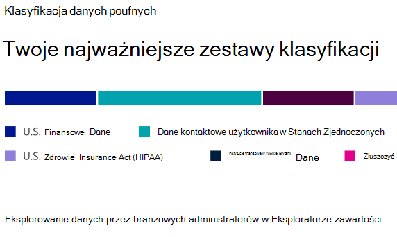
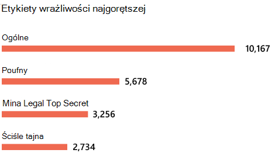
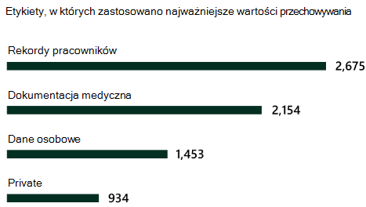

# Dowiedz się więcej o klasyfikacji danych

Jako administrator lub administrator zgodności platformy Microsoft 365 możesz oceniać, a następnie tagować zawartość w organizacji, aby kontrolować, dokąd zmierza, chronić ją niezależnie od tego, gdzie się znajduje, i upewnić się, że została zachowana i usunięta zgodnie z potrzebami organizacji. Można to zrobić za pośrednictwem stosowania [etykiet poufności](sensitivity-labels.md), [etykiet przechowywania](retention.md#retention-labels) i klasyfikacji typów informacji poufnych. Istnieją różne sposoby odnajdywania, oceny i tagowania, ale wynikiem końcowym jest to, że możesz mieć bardzo dużą liczbę dokumentów i wiadomości e-mail, które są oznakowane i klasyfikowane przy użyciu jednej lub obu tych etykiet. Po zastosowaniu etykiet przechowywania i etykiet poufności warto zobaczyć, jak etykiety są używane w dzierżawie i co robi się z tymi elementami. Strona klasyfikacji danych zapewnia wgląd w tę treść zawartości, w szczególności:

- liczba elementów, które zostały sklasyfikowane jako typ informacji poufnych i jakie są te klasyfikacje
- najczęściej stosowane etykiety poufności zarówno na platformie Microsoft 365, jak i na platformie Azure Information Protection
- górne zastosowane etykiety przechowywania
- podsumowanie działań wykonywanych przez użytkowników w ramach poufnej zawartości
- lokalizacje poufnych i zachowanych danych

Te funkcje można również zarządzać na stronie klasyfikacji danych:

- [klasyfikatory z możliwością trenowania](classifier-learn-about.md)
- [typy informacji poufnych](sensitive-information-type-learn-about.md)
- [Dowiedz się więcej o dokładnych typach informacji poufnych opartych na dopasowaniu danych](sit-learn-about-exact-data-match-based-sits.md#learn-about-exact-data-match-based-sensitive-information-types)
- [Eksplorator zawartości](data-classification-content-explorer.md)
- [Eksplorator działań](data-classification-activity-explorer.md)

Klasyfikację danych można znaleźć w <a href="https://go.microsoft.com/fwlink/p/?linkid=2077149" target="_blank">portal zgodności Microsoft Purview</a> lub <a href="https://go.microsoft.com/fwlink/p/?linkid=2077139" target="_blank">Microsoft 365 Defender portalu</a> > **Klasyfikacja danych klasyfikacji** > .

Zapoznaj się z wideo z naszymi funkcjami klasyfikacji danych.

> [!VIDEO https://www.microsoft.com/videoplayer/embed/RE4vx8x]

Klasyfikacja danych przeskanuje poufną zawartość i zawartość oznaczoną etykietą przed utworzeniem jakichkolwiek zasad. Jest to **nazywane zarządzaniem zerową zmianą**. Dzięki temu można zobaczyć wpływ, jakie mają wszystkie etykiety przechowywania i poufności w środowisku, i umożliwić rozpoczęcie oceny potrzeb w zakresie zasad ochrony i ładu.

## Wymagania wstępne

### Uprawnienia

 Aby uzyskać dostęp do strony klasyfikacji danych, konto musi mieć przypisane członkostwo w dowolnej z tych ról lub grup ról.

**Grupy ról platformy Microsoft 365**

- Administrator globalny
- Administrator zgodności
- Administrator zabezpieczeń
- Administrator danych zgodności

> [!NOTE]
> Najlepszym rozwiązaniem jest zawsze używanie roli z najniższymi uprawnieniami w celu udzielenia dostępu do klasyfikacji danych platformy Microsoft 365.

#### Role i grupy ról w wersji zapoznawczej

W wersji zapoznawczej dostępne są role i grupy ról, które można przetestować, aby dostosować mechanizmy kontroli dostępu.

Oto lista odpowiednich ról w wersji zapoznawczej. Aby dowiedzieć się więcej na ich temat, zobacz [Role w Centrum zgodności & zabezpieczeń](../security/office-365-security/permissions-in-the-security-and-compliance-center.md#roles-in-the-security--compliance-center)

- Information Protection Administracja
- analityk Information Protection
- badacz Information Protection
- czytelnik Information Protection

Oto lista odpowiednich grup ról, które są w wersji zapoznawczej. Aby dowiedzieć się więcej na ich temat, zobacz [Grupy ról w Centrum zgodności & zabezpieczeń](../security/office-365-security/permissions-in-the-security-and-compliance-center.md#role-groups-in-the-security--compliance-center)

- Information Protection
- administratorzy Information Protection
- analitycy Information Protection
- Information Protection śledczy
- czytniki Information Protection

## Typy informacji poufnych używane najczęściej w zawartości

Platforma Microsoft 365 zawiera wiele definicji typów informacji poufnych, takich jak element zawierający numer ubezpieczenia społecznego lub numer karty kredytowej. Aby uzyskać więcej informacji na temat typów informacji poufnych, zobacz [Definicje jednostek typów informacji poufnych](sensitive-information-type-entity-definitions.md).

Karta typów informacji poufnych zawiera najważniejsze typy informacji poufnych, które zostały znalezione i oznaczone etykietami w całej organizacji.

Aby dowiedzieć się, ile elementów znajduje się w dowolnej kategorii klasyfikacji, umieść kursor na pasku dla kategorii.

> [!NOTE]
> Jeśli na karcie jest wyświetlany komunikat "Nie znaleziono danych z informacjami poufnymi", oznacza to, że w organizacji nie ma żadnych elementów, które zostały sklasyfikowane jako typ informacji poufnych lub że nie zostały przeszukane żadne elementy. Aby rozpocząć pracę z etykietami, zobacz:
>- [Wprowadzenie do etykiet poufności](get-started-with-sensitivity-labels.md)
>- [Wprowadzenie do zarządzania rekordami](get-started-with-records-management.md)
>- [Definicje jednostek typu informacji poufnych](sensitive-information-type-entity-definitions.md)

## Górne etykiety poufności zastosowane do zawartości

Po zastosowaniu etykiety poufności do elementu za pośrednictwem usługi Microsoft 365 lub Azure Information Protection (AIP) dzieje się dwie rzeczy:

- Tag wskazujący wartość elementu organizacji jest osadzony w dokumencie i będzie go obserwować wszędzie tam, gdzie jest.
- Obecność tagu umożliwia różne zachowania ochronne, takie jak obowiązkowe znakowanie wodne lub szyfrowanie. Dzięki włączonej ochronie punktu końcowego można nawet uniemożliwić pozostawienie kontroli organizacyjnej przez element.

Aby uzyskać więcej informacji na temat etykiet poufności, zobacz: [Dowiedz się więcej o etykietach poufności](sensitivity-labels.md)

Etykiety poufności muszą być włączone dla plików w programach SharePoint i OneDrive, aby odpowiednie dane były wyświetlane na stronie klasyfikacji danych. Aby uzyskać więcej informacji, zobacz [Włączanie etykiet poufności dla plików pakietu Office w programach SharePoint i OneDrive](sensitivity-labels-sharepoint-onedrive-files.md).

Karta etykiety poufności pokazuje liczbę elementów (wiadomości e-mail lub dokumentu) według poziomu poufności.

> [!NOTE]
> Jeśli nie utworzono ani nie opublikowano żadnych etykiet poufności lub żadna zawartość nie miała zastosowanej etykiety poufności, na tej karcie zostanie wyświetlony komunikat "Nie wykryto etykiet poufności". Aby rozpocząć pracę z etykietami poufności, zobacz:
>- [Rozpoczynanie pracy z etykietami poufności](get-started-with-sensitivity-labels.md) lub [konfigurowanie zasad ochrony informacji platformy Azure przez usługę](/azure/information-protection/configure-policy) AIP

## Górne etykiety przechowywania zastosowane do zawartości

Etykiety przechowywania służą do zarządzania przechowywaniem i dyspozycją zawartości w organizacji. Po zastosowaniu mogą one służyć do kontrolowania, jak długo element będzie przechowywany przed usunięciem, czy powinien zostać przejrzany przed usunięciem, kiedy wygasa jego okres przechowywania i czy powinien być oznaczony jako rekord. Aby uzyskać więcej informacji, zobacz [Informacje o zasadach przechowywania i etykietach przechowywania](retention.md).

Karta górnych zastosowanych etykiet przechowywania pokazuje, ile elementów ma daną etykietę przechowywania.

> [!NOTE]
> Jeśli na tej karcie zostanie wyświetlony komunikat "Nie wykryto etykiet przechowywania", oznacza to, że nie utworzono ani nie opublikowano żadnych etykiet przechowywania lub żadna zawartość nie miała zastosowanej etykiety przechowywania. Aby rozpocząć pracę z etykietami przechowywania, zobacz:
>- [Wprowadzenie do zarządzania cyklem życia danych](get-started-with-data-lifecycle-management.md)

## Wykryto najważniejsze działania

Ta karta zawiera krótkie podsumowanie najpopularniejszych akcji wykonywanych przez użytkowników w przypadku elementów oznaczonych etykietami poufności. Za pomocą [Eksploratora działań](data-classification-activity-explorer.md) możesz przejść do szczegółów różnych działań, które platforma Microsoft 365 śledzi w zawartości i zawartości oznaczonej etykietą, która znajduje się w Windows 10 punktach końcowych.

> [!NOTE]
> Jeśli na tej karcie zostanie wyświetlony komunikat "Nie wykryto żadnego działania", oznacza to, że nie było żadnych działań w plikach lub że inspekcja użytkownika i administratora nie jest włączona. Aby włączyć dzienniki inspekcji, zobacz:
>- [Przeszukiwanie dziennika inspekcji w centrum zgodności & zabezpieczeń](search-the-audit-log-in-security-and-compliance.md)

## Dane z etykietami poufności i przechowywania według lokalizacji

Celem raportowania klasyfikacji danych jest zapewnienie wglądu w liczbę elementów, które mają etykietę, a także ich lokalizację. Te karty pozwalają dowiedzieć się, ile elementów oznaczonych etykietami znajduje się w programach Exchange, SharePoint i OneDrive itp.

> [!NOTE]
> Jeśli na tej karcie zostanie wyświetlony komunikat "Nie wykryto żadnych lokalizacji, oznacza to, że nie utworzono ani nie opublikowano żadnych etykiet poufności lub żadna zawartość nie miała zastosowanej etykiety przechowywania. Aby rozpocząć pracę z etykietami poufności, zobacz:
>- [Etykiety wrażliwości](sensitivity-labels.md)

## Informacje o wersji publicznej wersji zapoznawczej 

> [!NOTE]
> **Liczba skrzynek pocztowych programu Exchange**: podczas przechodzenia do skrzynek pocztowych programu Exchange zostanie wyświetlona mała porada narzędzia. Ma to na celu wywołanie faktu, że łączna liczba wyświetlana dla typu informacji poufnych, etykiety poufności i etykiety przechowywania może nie być dokładnie zgodna z liczbą elementów, które znajdziesz w skrzynce pocztowej. Dzieje się tak, ponieważ przechodzenie do szczegółów w folderze pobiera widok zawartości na żywo, który jest klasyfikowany, podczas gdy zagregowana liczba jest obliczana. Informacje, które użytkownik powinien zauważyć, nawet jeśli skimming

> [!NOTE]
> **Renderowanie zaszyfrowanych dokumentów**: pliki programu SharePoint, programu Exchange i usługi OneDrive, które są szyfrowane, nie są renderowane w Eksploratorze zawartości. Jest to poufny problem, który wymaga równowagi między koniecznością wyświetlenia zawartości pliku w Eksploratorze zawartości a koniecznością zachowania zaszyfrowanej zawartości. Dzięki uprawnieniom udzielonym przez **przeglądarkę list Eksploratora zawartości** i grupy ról **Przeglądarki zawartości Eksploratora zawartości** zostanie wyświetlony widok listy plików, metadane pliku i link, którego można użyć do uzyskiwania dostępu do zawartości za pośrednictwem klienta internetowego. Informacje, które użytkownik powinien zauważyć, nawet jeśli skimming

> [!NOTE]
> **Obsługiwane znaki w nazwach etykiet przechowywania w wyszukiwaniu programu SharePoint**: wyszukiwanie w programie SharePoint nie obsługuje nazw etykiet przechowywania w `-`programie lub `_` w nich. Na przykład `Label-MIP` i `Label_MIP` nie są obsługiwane. Wyszukiwanie w programie SharePoint obsługuje te znaki w nazwach etykiet poufności i nazwach typów informacji poufnych.

> [!NOTE]
> **Usługa OneDrive pozostaje w wersji zapoznawczej**: Dziękujemy za cenne opinie na temat integracji z usługą OneDrive podczas naszego programu w wersji zapoznawczej. Podczas pracy z danymi szczegółowymi możesz napotkać niespójne dane/przepływy. Będziemy nadal prezentować usługę OneDrive w wersji zapoznawczej, dopóki nie zostaną wprowadzone wszystkie poprawki. Doceniamy Wasze ciągłe wsparcie.

## Zobacz też

- [Wyświetlanie działania etykiety](data-classification-activity-explorer.md)
- [Wyświetlanie zawartości oznaczonej etykietą](data-classification-content-explorer.md)
- [Dowiedz się więcej o etykietach poufności](sensitivity-labels.md)
- [Dowiedz się więcej o zasadach przechowywania i etykietach przechowywania](retention.md)
- [Dowiedz się więcej o typach informacji poufnych](sensitive-information-type-learn-about.md)
- [Definicje jednostek typu informacji poufnych](sensitive-information-type-entity-definitions.md)
- [Dowiedz się więcej o klasyfikatorach z możliwością trenowania (wersja zapoznawcza)](classifier-learn-about.md)

Aby dowiedzieć się, jak używać klasyfikacji danych w celu zachowania zgodności z przepisami dotyczącymi prywatności danych, zobacz [Wdrażanie ochrony informacji dla przepisów dotyczących prywatności danych za pomocą usługi Microsoft 365](../solutions/information-protection-deploy.md)  (aka.ms/m365dataprivacy).
