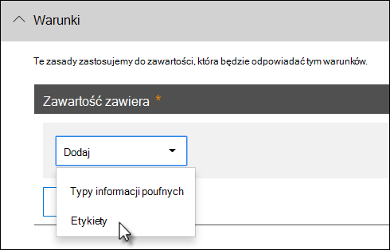
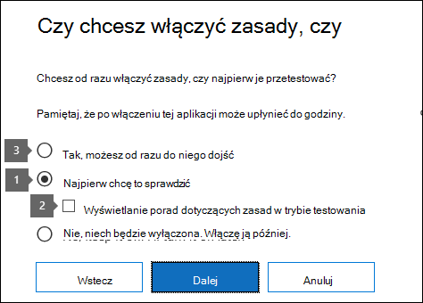
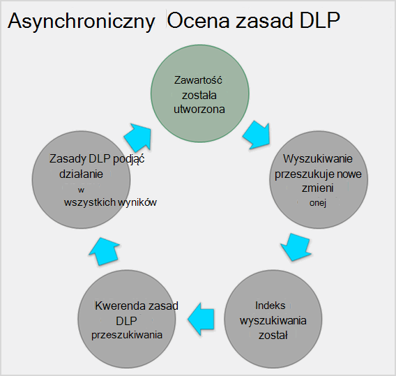

# Dokumentacja zapobiegania utracie danych

[!include[Purview banner](../includes/purview-rebrand-banner.md)]

> [!IMPORTANT]
> Ten temat referencyjny nie jest już głównym zasobem informacji o zapobieganiu utracie danych (DLP) w usłudze Microsoft Purview. Zestaw zawartości DLP jest aktualizowany i zmieniany w strukturze. Tematy omówione w tym artykule zostaną przeniesione do nowych, zaktualizowanych artykułów. Aby uzyskać więcej informacji na temat ochrony przed [utratą danych, zobacz Dowiedz się więcej o zapobieganiu utracie danych](dlp-learn-about-dlp.md).

<!-- this topic needs to be split into smaller, more coherent ones. It is confusing as it is. -->
<!-- move this note to a more appropriate place, no topic should start with a note -->
> [!NOTE]
> Niedawno dodano możliwości zapobiegania utracie danych do Microsoft Teams wiadomości czatu i kanału dla użytkowników licencjonowanych na Office 365 Advanced Compliance, która jest dostępna jako opcja autonomiczna i jest uwzględniona w Office 365 E5 i Zgodność platformy Microsoft 365 E5. Aby dowiedzieć się więcej na temat wymagań dotyczących licencjonowania, zobacz [Microsoft 365 Tenant-Level Services Licensing Guidance (Wskazówki dotyczące licencjonowania usług Microsoft 365 Tenant-Level](/office365/servicedescriptions/microsoft-365-service-descriptions/microsoft-365-tenantlevel-services-licensing-guidance)).

<!-- MOVED TO LEARN ABOUT To comply with business standards and industry regulations, organizations must protect sensitive information and prevent its inadvertent disclosure. Sensitive information can include financial data or personally identifiable information (PII) such as credit card numbers, social security numbers, or health records. With a data loss prevention (DLP) policy in the Microsoft Purview compliance portal, you can identify, monitor, and automatically protect sensitive information across Office 365.

With a DLP policy, you can:

- **Identify sensitive information across many locations, such as Exchange Online, SharePoint Online, OneDrive for Business, and Microsoft Teams.**

    For example, you can identify any document containing a credit card number that's stored in any OneDrive for Business site, or you can monitor just the OneDrive sites of specific people.

- **Prevent the accidental sharing of sensitive information**.

    For example, you can identify any document or email containing a health record that's shared with people outside your organization, and then automatically block access to that document or block the email from being sent.

- **Monitor and protect sensitive information in the desktop versions of Excel, PowerPoint, and Word.**

    Just like in Exchange Online, SharePoint Online, and OneDrive for Business, these Office desktop programs include the same capabilities to identify sensitive information and apply DLP policies. DLP provides continuous monitoring when people share content in these Office programs.

- **Help users learn how to stay compliant without interrupting their workflow.**

    You can educate your users about DLP policies and help them remain compliant without blocking their work. For example, if a user tries to share a document containing sensitive information, a DLP policy can both send them an email notification and show them a policy tip in the context of the document library that allows them to override the policy if they have a business justification. The same policy tips also appear in Outlook on the web, Outlook, Excel, PowerPoint, and Word.

- **View DLP alerts and reports showing content that matches your organization’s DLP policies.**

    To view alerts and metadata related to your DLP policies you can use the [DLP Alerts Management Dashboard](dlp-configure-view-alerts-policies.md). You can also view policy match reports to assess how your organization is complying with a DLP policy. If a DLP policy allows users to override a policy tip and report a false positive, you can also view what users have reported

-->
## Tworzenie zasad DLP i zarządzanie nimi

Zasady DLP można tworzyć i zarządzać nimi na stronie zapobiegania utracie danych w portalu zgodności usługi Microsoft Purview.

<!-- MOVED TO LEARN ABOUT ## What a DLP policy contains

A DLP policy contains a few basic things:

- Where to protect the content: **locations** such as Exchange Online, SharePoint Online, and OneDrive for Business sites, as well as Microsoft Teams chat and channel messages.

- When and how to protect the content by enforcing **rules** comprised of:

  - **Conditions** the content must match before the rule is enforced. For example, a rule might be configured to look only for content containing Social Security numbers that's been shared with people outside your organization.

  - **Actions** that you want the rule to take automatically when content matching the conditions is found. For example, a rule might be configured to block access to a document and send both the user and compliance officer an email notification.

You can use a rule to meet a specific protection requirement, and then use a DLP policy to group together common protection requirements, such as all of the rules needed to comply with a specific regulation.

For example, you might have a DLP policy that helps you detect the presence of information subject to the Health Insurance Portability and Accountability Act (HIPAA). This DLP policy could help protect HIPAA data (the what) across all SharePoint Online sites and all OneDrive for Business sites (the where) by finding any document containing this sensitive information that's shared with people outside your organization (the conditions) and then blocking access to the document and sending a notification (the actions). These requirements are stored as individual rules and grouped together as a DLP policy to simplify management and reporting.

 -->

<!-- MOVED TO LEARN ABOUT ### Locations

DLP policies are applied to sensitive items across Microsoft 365 locations and can be further scoped as detailed in this table.

|Location | Include/exclude by|
|---------|---------|
|Exchange email| distribution groups|
|SharePoint sites |sites |
|OneDrive accounts |accounts |
|Teams chat and channel messages |accounts |
|Windows 10 devices |user or group |
|Microsoft Cloud App Security |instance |
 -->

<!-- moved to dlp-policy-reference.md
If you choose to include specific distribution groups in Exchange, the DLP policy will be scoped only to the members of that group. Similarly excluding a distribution group will exclude all the members of that distribution group from policy evaluation. You can choose to scope a policy to the members of distribution lists, dynamic distribution groups, and security groups. A DLP policy can contain no more than 50 such inclusions and exclusions.

If you choose to include or exclude specific SharePoint sites, a DLP policy can contain no more than 100 such inclusions and exclusions. Although this limit exists, you can exceed this limit by applying either an org-wide policy or a policy that applies to entire locations.

If you choose to include or exclude specific OneDrive accounts or groups, a DLP policy can contain no more than 100 user accounts or 50 groups as inclusion or exclusion.

### Rules

> [!NOTE]
> The default behavior of a DLP policy, when there is no alert configured, is not to alert or trigger. This applies only to default information types. For custom information types, the system will alert even if there is no action defined in the policy.

Rules are what enforce your business requirements on your organization's content. A policy contains one or more rules, and each rule consists of conditions and actions. For each rule, when the conditions are met, the actions are taken automatically. Rules are executed sequentially, starting with the highest-priority rule in each policy.

A rule also provides options to notify users (with policy tips and email notifications) and admins (with email incident reports) that content has matched the rule.

Here are the components of a rule, each explained below.

#### Conditions

Conditions are important because they determine what types of information you're looking for, and when to take an action. For example, you might choose to ignore content containing passport numbers unless the content contains more than 10 such numbers and is shared with people outside your organization.

Conditions focus on the **content**, such as what types of sensitive information you're looking for, and also on the **context**, such as who the document is shared with. You can use conditions to assign different actions to different risk levels. For example, sensitive content shared internally might be lower risk and require fewer actions than sensitive content shared with people outside the organization.

The conditions now available can determine if:

- Content contains a type of sensitive information.

- Content contains a label. For more information, see the below section [Using a retention label as a condition in a DLP policy](#using-a-retention-label-as-a-condition-in-a-dlp-policy).

- Content is shared with people outside or inside your organization.

  > [!NOTE]
  > Users who have non-guest accounts in a host organization's Active Directory or Azure Active Directory tenant are considered as people inside the organization.

#### Types of sensitive information

A DLP policy can help protect sensitive information, which is defined as a **sensitive information type**. Microsoft 365 includes definitions for many common sensitive information types across many different regions that are ready for you to use, such as a credit card number, bank account numbers, national ID numbers, and passport numbers.

When a DLP policy looks for a sensitive information type such as a credit card number, it doesn't simply look for a 16-digit number. Each sensitive information type is defined and detected by using a combination of:

- Keywords.

- Internal functions to validate checksums or composition.

- Evaluation of regular expressions to find pattern matches.

- Other content examination.

This helps DLP detection achieve a high degree of accuracy while reducing the number of false positives that can interrupt peoples' work.

#### Actions

When content matches a condition in a rule, you can apply actions to automatically protect the content.

With the actions now available, you can:

- **Restrict access to the content** Depending on your need, you can restrict access to content in three ways:

  1. Restrict access to content for everyone.
  2. Restrict access to content for people outside the organization.
  3. Restrict access to "Anyone with the link."

  For site content, this means that permissions for the document are restricted for everyone except the primary site collection administrator, document owner, and person who last modified the document. These people can remove the sensitive information from the document or take other remedial action. When the document is in compliance, the original permissions are automatically restored. When access to a document is blocked, the document appears with a special policy tip icon in the library on the site.

  

  For email content, this action blocks the message from being sent. Depending on how the DLP rule is configured, the sender sees an NDR or (if the rule uses a notification) a policy tip and/or email notification.

  

#### User notifications and user overrides

You can use notifications and overrides to educate your users about DLP policies and help them remain compliant without blocking their work. For example, if a user tries to share a document containing sensitive information, a DLP policy can both send them an email notification and show them a policy tip in the context of the document library that allows them to override the policy if they have a business justification.

The email can notify the person who sent, shared, or last modified the content and, for site content, the primary site collection administrator and document owner. In addition, you can add or remove whomever you choose from the email notification.

In addition to sending an email notification, a user notification displays a policy tip:

- In Outlook and Outlook on the web.

- For the document on a SharePoint Online or OneDrive for Business site.

- In Excel, PowerPoint, and Word, when the document is stored on a site included in a DLP policy.

The email notification and policy tip explain why content conflicts with a DLP policy. If you choose, the email notification and policy tip can allow users to override a rule by reporting a false positive or providing a business justification. This can help you educate users about your DLP policies and enforce them without preventing people from doing their work. Information about overrides and false positives is also logged for reporting (see below about the DLP reports) and included in the incident reports (next section), so that the compliance officer can regularly review this information.

Here's what a policy tip looks like in a OneDrive for Business account.

 To learn more about user notifications and policy tips in DLP policies, see [Use notifications and policy tips](use-notifications-and-policy-tips.md).

#### Alerts and Incident reports

When a rule is matched, you can send an alert email to your compliance officer (or any person(s) you choose) with details of the alert. This alert email will carry a link of the [DLP Alerts Management Dashboard](dlp-configure-view-alerts-policies.md) which the compliance officer can go to view the details of alert and events. The dashboard contains details of the event that triggered the alert along with details of the DLP policy matched and the sensitive content detected.

In addition, you can also send an incident report with details of the event. This report includes information about the item that was matched, the actual content that matched the rule, and the name of the person who last modified the content. For email messages, the report also includes as an attachment the original message that matches a DLP policy.

> [!div class="mx-imgBorder"]
> 

DLP scans email differently from items in SharePoint Online or OneDrive for Business. In SharePoint Online and OneDrive for Business, DLP scans existing items as well as new ones and generates an alert and incident report whenever a match is found. In Exchange Online, DLP only scans new email messages and generates a report if there is a policy match. DLP ***does not*** scan or match previously existing email items that are stored in a mailbox or archive.

## Grouping and logical operators

Often your DLP policy has a straightforward requirement, such as to identify all content that contains a U.S. Social Security Number. However, in other scenarios, your DLP policy might need to identify more loosely defined data.

For example, to identify content subject to the U.S. Health Insurance Act (HIPAA), you need to look for:

- Content that contains specific types of sensitive information, such as a U.S. Social Security Number or Drug Enforcement Agency (DEA) Number.

    AND

- Content that's more difficult to identify, such as communications about a patient's care or descriptions of medical services provided. Identifying this content requires matching keywords from very large keyword lists, such as the International Classification of Diseases (ICD-9-CM or ICD-10-CM).

You can easily identify such loosely defined data by using grouping and logical operators (AND, OR). When you create a DLP policy, you can:

- Group sensitive information types.

- Choose the logical operator between the sensitive information types within a group and between the groups themselves.

### Choosing the operator within a group

Within a group, you can choose whether any or all of the conditions in that group must be satisfied for the content to match the rule.

### Adding a group

You can quickly add a group, which can have its own conditions and operator within that group.

### Choosing the operator between groups

Between groups, you can choose whether the conditions in just one group or all of the groups must be satisfied for the content to match the rule.

For example, the built-in **U.S. HIPAA** policy has a rule that uses an **AND** operator between the groups so that it identifies content that contains:

- from the group **PII Identifiers** (at least one SSN number **OR** DEA number)

    **AND**

- from the group **Medical Terms** (at least one ICD-9-CM keyword **OR** ICD-10-CM keyword)

## The priority by which rules are processed

When you create rules in a policy, each rule is assigned a priority in the order in which it's created — meaning, the rule created first has first priority, the rule created second has second priority, and so on.

> [!div class="mx-imgBorder"]
> 

After you have set up more than one DLP policy, you can change the priority of one or more policies. To do that, select a policy, choose **Edit policy**, and use the **Priority** list to specify its priority.

> [!div class="mx-imgBorder"]
> 

When content is evaluated against rules, the rules are processed in priority order. If content matches multiple rules, the rules are processed in priority order and the most restrictive action is enforced. For example, if content matches all of the following rules, Rule 3 is enforced because it's the highest priority, most restrictive rule:

- Rule 1: only notifies users

- Rule 2: notifies users, restricts access, and allows user overrides

- Rule 3: notifies users, restricts access, and does not allow user overrides

- Rule 4: only notifies users

- Rule 5: restricts access

- Rule 6: notifies users, restricts access, and does not allow user overrides

In this example, note that matches for all of the rules are recorded in the audit logs and shown in the DLP reports, even though only the most restrictive rule is enforced.

Regarding policy tips, note that:

- Only the policy tip from the highest priority, most restrictive rule will be shown. For example, a policy tip from a rule that blocks access to content will be shown over a policy tip from a rule that simply sends a notification. This prevents people from seeing a cascade of policy tips.

- If the policy tips in the most restrictive rule allow people to override the rule, then overriding this rule also overrides any other rules that the content matched.

-->

## Dostrajanie reguł w celu ułatwienia lub utrudnienia dopasowania

Po utworzeniu i włączeniu zasad DLP czasami pojawiają się następujące problemy:

- Zbyt duża ilość zawartości, która **nie jest** poufnymi informacjami, jest zgodna z regułami — innymi słowy, zbyt wiele wyników fałszywie dodatnich.

- Zbyt mała zawartość, która **jest** poufnymi informacjami, jest zgodna z regułami. Innymi słowy, działania ochronne nie są wymuszane na poufnych informacjach.

Aby rozwiązać te problemy, możesz dostosować reguły, dostosowując liczbę wystąpień i dokładność dopasowania, aby utrudnić lub ułatwić dopasowanie zawartości do reguł. Każdy typ informacji poufnych używany w regule ma zarówno liczbę wystąpień, jak i dokładność dopasowania.

### Liczba wystąpień

Liczba wystąpień oznacza po prostu liczbę wystąpień określonego typu informacji poufnych, aby zawartość była zgodna z regułą. Na przykład zawartość jest zgodna z regułą pokazaną poniżej, jeśli istnieje od 1 do 9 unikatowych stanów USA lub Wielkiej Brytanii. identyfikowane są numery paszportów.

> [!NOTE]
> Liczba wystąpień obejmuje tylko **unikatowe** dopasowania dla typów informacji poufnych i słów kluczowych. Jeśli na przykład wiadomość e-mail zawiera 10 wystąpień tego samego numeru karty kredytowej, te 10 wystąpień jest liczone jako pojedyncze wystąpienie numeru karty kredytowej.

Aby użyć liczby wystąpień do dostrajania reguł, wskazówki są proste:

- Aby ułatwić dopasowanie reguły, zmniejsz liczbę **minut** i/lub zwiększ **maksymalną** liczbę. Możesz również ustawić **wartość maksymalną** na **dowolną** , usuwając wartość liczbową.

- Aby utrudnić dopasowanie reguły, zwiększ liczbę **minut** .

Zazwyczaj używasz mniej restrykcyjnych akcji, takich jak wysyłanie powiadomień użytkowników, w regule z mniejszą liczbą wystąpień (na przykład 1–9). Ponadto używasz bardziej restrykcyjnych akcji, takich jak ograniczanie dostępu do zawartości bez zezwalania na przesłonięcia użytkowników, w regule z większą liczbą wystąpień (na przykład 10-dowolnych).

### Dokładność dopasowania

Jak opisano powyżej, typ informacji poufnych jest definiowany i wykrywany przy użyciu kombinacji różnych rodzajów dowodów. Często typ informacji poufnych jest definiowany przez wiele takich kombinacji, nazywanych wzorcami. Wzorzec, który wymaga mniejszej ilości dowodów, ma niższą dokładność dopasowania (lub poziom ufności), podczas gdy wzorzec, który wymaga większej liczby dowodów, ma wyższą dokładność dopasowania (lub poziom ufności). Aby dowiedzieć się więcej na temat rzeczywistych wzorców i poziomów ufności używanych przez każdy typ informacji poufnych, zobacz [Definicje jednostek typów informacji poufnych](sensitive-information-type-entity-definitions.md).

Na przykład typ informacji poufnych o nazwie Numer karty kredytowej jest definiowany przez dwa wzorce:

- Wzorzec z 65% pewnością, który wymaga:

  - Liczba w formacie numeru karty kredytowej.

  - Liczba, która przekazuje sumę kontrolną.

- Wzorzec z 85% pewnością, który wymaga:

  - Liczba w formacie numeru karty kredytowej.

  - Liczba, która przekazuje sumę kontrolną.

  - Słowo kluczowe lub data wygaśnięcia w odpowiednim formacie.

Możesz użyć tych poziomów ufności (lub dopasować dokładność) w swoich regułach. Zazwyczaj używasz mniej restrykcyjnych akcji, takich jak wysyłanie powiadomień użytkowników, w regule z mniejszą dokładnością dopasowania. Ponadto używasz bardziej restrykcyjnych akcji, takich jak ograniczanie dostępu do zawartości bez zezwalania na przesłonięcia użytkowników, w regule z większą dokładnością dopasowania.

Ważne jest, aby zrozumieć, że gdy określony typ informacji poufnych, takich jak numer karty kredytowej, jest identyfikowany w zawartości, zwracany jest tylko jeden poziom ufności:

- Jeśli wszystkie dopasowania dotyczą jednego wzorca, zwracany jest poziom ufności dla tego wzorca.

- Jeśli istnieją dopasowania dla więcej niż jednego wzorca (oznacza to, że istnieją dopasowania z dwoma różnymi poziomami ufności), zwracany jest poziom ufności wyższy niż którykolwiek z pojedynczych wzorców. Jest to trudna część. Na przykład w przypadku karty kredytowej, jeśli zarówno wzorce 65%, jak i 85% są dopasowane, poziom ufności zwrócony dla tego typu informacji poufnych jest większy niż 90%, ponieważ więcej dowodów oznacza większe zaufanie.

Jeśli więc chcesz utworzyć dwie wzajemnie wykluczające się reguły dla kart kredytowych, jedną dla dokładności dopasowania 65% i jedną dla dokładności dopasowania 85%, zakresy dokładności dopasowania będą wyglądać następująco. Pierwsza reguła pobiera tylko dopasowania wzorca 65%. Druga reguła odbiera dopasowania z **co najmniej jednym** dopasowaniem 85% i **potencjalnie może mieć** inne dopasowania o niższym poziomie ufności.

Z tych powodów wskazówki dotyczące tworzenia reguł z różnymi dopasowaniami są następujące:

- Najniższy poziom ufności zwykle używa tej samej wartości dla **wartości minimalnej** i **maksymalnej** (a nie zakresu).

- Najwyższy poziom ufności to zazwyczaj zakres od nieco powyżej niższego poziomu ufności do 100.

- Wszystkie poziomy ufności między zazwyczaj wahają się od tuż powyżej niższego poziomu ufności do nieco poniżej wyższego poziomu ufności.

## Używanie etykiety przechowywania jako warunku w zasadach DLP

Jeśli używasz wcześniej utworzonej i opublikowanej [etykiety przechowywania](retention.md#retention-labels) jako warunku w zasadach DLP, należy pamiętać o kilku elementach:

- Etykieta przechowywania musi zostać utworzona i opublikowana przed podjęciem próby użycia jej jako warunku w zasadach DLP.
- Synchronizacja opublikowanych etykiet przechowywania może potrwać od jednego do siedmiu dni. Aby uzyskać więcej informacji, zobacz [Kiedy etykiety przechowywania stają się dostępne do zastosowania](create-apply-retention-labels.md#when-retention-labels-become-available-to-apply) dla etykiet przechowywania opublikowanych w zasadach przechowywania oraz [Jak długo trwa stosowanie etykiet przechowywania](apply-retention-labels-automatically.md#how-long-it-takes-for-retention-labels-to-take-effect) dla etykiet przechowywania, które są automatycznie publikowane.
- Używanie etykiety przechowywania w zasadach **jest obsługiwane tylko w przypadku elementów w SharePoint i OneDrive***.

  

  Możesz użyć etykiety przechowywania w zasadach DLP, jeśli masz elementy, które są w trakcie przechowywania i dyspozycji, a także chcesz zastosować do nich inne kontrolki, na przykład:

  - Opublikowano etykietę przechowywania o nazwie **rok podatkowy 2018**, która stosowana do dokumentów podatkowych z 2018 r., które są przechowywane w SharePoint zachowuje je przez 10 lat, a następnie je usuwa. Nie chcesz również, aby te elementy były udostępniane poza organizacją, co można zrobić z zasadami DLP.

  > [!IMPORTANT]
  > Ten błąd zostanie wyświetlony, jeśli określisz etykietę przechowywania jako warunek w zasadach DLP, a także uwzględnisz Exchange i/lub Teams jako lokalizację: **"Ochrona zawartości oznaczonej etykietą w wiadomościach e-mail i wiadomościach zespołów nie jest obsługiwana. Usuń poniższą etykietę lub wyłącz Exchange i Teams jako lokalizację".** Dzieje się tak, ponieważ transport Exchange nie ocenia metadanych etykiet podczas przesyłania i dostarczania komunikatów.

### Używanie etykiety poufności jako warunku w zasadach DLP

[Dowiedz się więcej](./dlp-sensitivity-label-as-condition.md) o używaniu etykiety poufności jako warunku w zasadach DLP.

### Jak ta funkcja odnosi się do innych funkcji

Do zawartości zawierającej informacje poufne można zastosować kilka funkcji:

- [Etykieta przechowywania i zasady przechowywania](retention.md) mogą wymuszać akcje **przechowywania** dla tej zawartości.

- Zasady DLP mogą wymuszać akcje **ochrony** dla tej zawartości. A przed wymuszeniem tych akcji zasady DLP mogą wymagać spełnienia innych warunków oprócz zawartości zawierającej etykietę.

Należy pamiętać, że zasady DLP mają bogatszą funkcję wykrywania niż zasady etykietowania lub przechowywania stosowane do informacji poufnych. Zasady DLP mogą wymuszać akcje ochronne dotyczące zawartości zawierającej informacje poufne, a jeśli poufne informacje zostaną usunięte z zawartości, te akcje ochronne zostaną cofnięte przy następnym skanowaniu zawartości. Jeśli jednak zasady przechowywania lub etykieta zostaną zastosowane do zawartości zawierającej informacje poufne, jest to jednorazowa akcja, która nie zostanie cofnięta, nawet jeśli informacje poufne zostaną usunięte.

Używając etykiety jako warunku w zasadach DLP, można wymusić akcje przechowywania i ochrony zawartości z tą etykietą. Zawartość zawierająca etykietę można traktować dokładnie tak, jak zawartość zawierającą informacje poufne — zarówno etykieta, jak i typ informacji poufnych są właściwościami używanymi do klasyfikowania zawartości, dzięki czemu można wymuszać akcje dotyczące tej zawartości.

## Ustawienia proste a ustawienia zaawansowane

Podczas tworzenia zasad DLP wybierasz między prostymi lub zaawansowanymi ustawieniami:

- **Proste ustawienia** ułatwiają tworzenie najbardziej typowych typów zasad DLP bez używania edytora reguł do tworzenia lub modyfikowania reguł.

- **Ustawienia zaawansowane** używają edytora reguł, aby zapewnić pełną kontrolę nad każdym ustawieniem zasad DLP.

Nie martw się, w obszarze okładek proste ustawienia i ustawienia zaawansowane działają dokładnie tak samo, wymuszając reguły składające się z warunków i akcji — tylko w przypadku prostych ustawień edytor reguł nie jest widoczny. Jest to szybki sposób tworzenia zasad DLP.

### Ustawienia proste

Zdecydowanie najbardziej typowym scenariuszem DLP jest utworzenie zasad ułatwiających ochronę zawartości zawierającej poufne informacje przed udostępnianiem osobom spoza organizacji oraz automatyczne korygowanie akcji, takie jak ograniczanie dostępu do zawartości, wysyłanie powiadomień użytkowników końcowych lub administratorów oraz przeprowadzanie inspekcji zdarzenia w celu późniejszego zbadania. Ludzie używają DLP, aby zapobiec przypadkowemu ujawnieniu poufnych informacji.

Aby uprościć osiągnięcie tego celu, podczas tworzenia zasad DLP możesz wybrać pozycję **Użyj prostych ustawień**. Te ustawienia zapewniają wszystko, czego potrzebujesz, aby zaimplementować najbardziej typowe zasady DLP bez konieczności przechodzenia do edytora reguł.

### Ustawienia zaawansowane

Jeśli musisz utworzyć bardziej dostosowane zasady DLP, możesz wybrać pozycję **Użyj ustawień zaawansowanych**.

Ustawienia zaawansowane zawierają edytor reguł, w którym masz pełną kontrolę nad każdą możliwą opcją, w tym liczbą wystąpień i dokładnością dopasowania (poziom ufności) dla każdej reguły.

Aby szybko przejść do sekcji, kliknij element w górnej części nawigacji edytora reguł, aby przejść do tej sekcji poniżej.

## Szablony zasad DLP

Pierwszym krokiem tworzenia zasad DLP jest wybranie informacji do ochrony. Zaczynając od szablonu DLP, można zapisać pracę tworzenia nowego zestawu reguł od podstaw i dowiedzieć się, które typy informacji powinny być uwzględniane domyślnie. Następnie możesz dodać lub zmodyfikować te wymagania, aby dostosować regułę zgodnie z określonymi wymaganiami organizacji.

Wstępnie skonfigurowany szablon zasad DLP może pomóc w wykrywaniu określonych typów informacji poufnych, takich jak dane HIPAA, dane PCI-DSS, dane Gramm-Leach-Bliley Act, a nawet dane osobowe specyficzne dla ustawień regionalnych (P.I.). Aby ułatwić znajdowanie i ochronę typowych typów informacji poufnych, szablony zasad zawarte w Microsoft 365 zawierają już najbardziej typowe typy informacji poufnych niezbędne do rozpoczęcia pracy.

Twoja organizacja może również mieć własne specyficzne wymagania, w którym to przypadku można utworzyć zasady DLP od podstaw, wybierając opcję **Zasady niestandardowe** . Zasady niestandardowe są puste i nie zawierają wstępnie utworzonych reguł.

<!-- ## Roll out DLP policies gradually with test mode

rehomed to Plan for DLP

When you create your DLP policies, you should consider rolling them out gradually to assess their impact and test their effectiveness before fully enforcing them. For example, you don't want a new DLP policy to unintentionally block access to thousands of documents that people require access to in order to get their work done.

If you're creating DLP policies with a large potential impact, we recommend following this sequence:

1. **Start in test mode without Policy Tips** and then use the DLP reports and any incident reports to assess the impact. You can use DLP reports to view the number, location, type, and severity of policy matches. Based on the results, you can fine tune the rules as needed. In test mode, DLP policies will not impact the productivity of people working in your organization.

2. **Move to Test mode with notifications and Policy Tips** so that you can begin to teach users about your compliance policies and prepare them for the rules that are going to be applied. At this stage, you can also ask users to report false positives so that you can further refine the rules.

3. **Start full enforcement on the policies** so that the actions in the rules are applied and the content's protected. Continue to monitor the DLP reports and any incident reports or notifications to make sure that the results are what you intend.

    

    You can turn off a DLP policy at any time, which affects all rules in the policy. However, each rule can also be turned off individually by toggling its status in the rule editor.

    

    You can also change the priority of multiple rules in a policy. To do that, open a policy for editing. In a row for a rule, choose the ellipses (**...**), and then choose an option, such as **Move down** or **Bring to last**.

    > [!div class="mx-imgBorder"]
    > -->

## Raporty DLP

Po utworzeniu i włączeniu zasad DLP należy sprawdzić, czy działają one zgodnie z oczekiwaniami i pomagają zachować zgodność. Raporty DLP umożliwiają szybkie wyświetlanie liczby dopasowań zasad i reguł DLP w czasie oraz liczby wyników fałszywie dodatnich i przesłonięcia. Dla każdego raportu można filtrować te dopasowania według lokalizacji, przedziału czasowego, a nawet zawęzić je do określonych zasad, reguł lub akcji.

Dzięki raportom DLP możesz uzyskać szczegółowe informacje biznesowe i:

- Skoncentruj się na określonych okresach i poznaj przyczyny wzrostów i trendów.

- Odnajdywanie procesów biznesowych naruszających zasady zgodności organizacji.

- Informacje o wpływie zasad DLP na działalność biznesową.

Ponadto możesz użyć raportów DLP, aby dostosować zasady DLP podczas ich uruchamiania.

## Jak działają zasady DLP

DLP wykrywa poufne informacje przy użyciu głębokiej analizy zawartości (nie tylko prostego skanowania tekstu). Ta głęboka analiza zawartości używa dopasowań słów kluczowych, dopasowań słowników, oceny wyrażeń regularnych, funkcji wewnętrznych i innych metod do wykrywania zawartości zgodnej z zasadami DLP. Potencjalnie tylko niewielki procent danych jest uznawany za poufny. Zasady DLP mogą identyfikować, monitorować i automatycznie chronić tylko te dane, nie utrudniając ani nie wpływając na osoby, które pracują z resztą zawartości.

### Zasady są synchronizowane

Po utworzeniu zasad DLP w portalu zgodności usługi Microsoft Purview są one przechowywane w centralnym magazynie zasad, a następnie synchronizowane z różnymi źródłami zawartości, w tym:

- Exchange Online, a stamtąd do Outlook w sieci Web i Outlook.

- OneDrive dla Firm witryn.

- SharePoint witryny online.

- Office programów klasycznych (Excel, PowerPoint i Word).

- Microsoft Teams kanałów i wiadomości czatu.

Po zsynchronizowanym z odpowiednimi lokalizacjami zasady zaczynają oceniać zawartość i wymuszać akcje.
<!-- what is the time delay for first deployment of a policy and what is the sync schedule? -->

### Ocena zasad w witrynach OneDrive dla Firm i SharePoint Online

We wszystkich witrynach SharePoint Online i witrynach OneDrive dla Firm dokumenty stale się zmieniają — są one stale tworzone, edytowane, udostępniane itd. Oznacza to, że dokumenty mogą w dowolnym momencie powodować konflikty lub stać się zgodne z zasadami DLP. Na przykład osoba może przekazać dokument, który nie zawiera poufnych informacji do witryny zespołu, ale później inna osoba może edytować ten sam dokument i dodawać do niego informacje poufne.

Z tego powodu zasady DLP często sprawdzają dokumenty pod kątem dopasowań zasad w tle. Można to traktować jako asynchroniczną ocenę zasad.
<!-- what is the frequency? looks like it is tied to the search crawl schedule -->

#### Jak to działa

Gdy użytkownicy dodają lub zmieniają dokumenty w swoich witrynach, wyszukiwarka skanuje zawartość, aby można było wyszukać ją później. Chociaż tak się dzieje, zawartość jest również skanowana pod kątem poufnych informacji i sprawdzania, czy jest udostępniona. Wszelkie znalezione poufne informacje są bezpiecznie przechowywane w indeksie wyszukiwania, dzięki czemu tylko zespół ds. zgodności może uzyskać do nich dostęp, ale nie są typowymi użytkownikami. Każda włączona zasada DLP działa w tle (asynchronicznie), często sprawdzając wyszukiwanie dowolnej zawartości zgodnej z zasadami i stosując akcje w celu ochrony przed niezamierzonymi przeciekami.

<!-- conflict with a DLP policy is bad wording -->
Na koniec dokumenty mogą powodować konflikt z zasadami DLP, ale mogą również stać się zgodne z zasadami DLP. Jeśli na przykład dana osoba doda numery kart kredytowych do dokumentu, może to spowodować automatyczne zablokowanie dostępu do dokumentu przez zasady DLP. Jeśli jednak osoba później usunie poufne informacje, akcja (w tym przypadku blokowanie) zostanie automatycznie cofnięta przy następnym ocenie dokumentu względem zasad.

DLP ocenia dowolną zawartość, która może być indeksowana. Aby uzyskać więcej informacji na temat typów plików przeszukiwanych domyślnie, zobacz [Domyślne rozszerzenia nazw plików przeszukanych i analizowane typy plików na serwerze SharePoint](/SharePoint/technical-reference/default-crawled-file-name-extensions-and-parsed-file-types).

> [!NOTE]
> Aby zapobiec udostępnianiu dokumentów, zanim zasady DLP będą mogły je analizować, udostępnianie nowych plików w SharePoint może zostać zablokowane do momentu indeksowania zawartości. Aby uzyskać szczegółowe informacje, zobacz [Domyślne oznaczanie nowych plików jako poufnych](/sharepoint/sensitive-by-default) .

### Ocena zasad w Exchange Online, Outlook i Outlook w sieci Web

Podczas tworzenia zasad DLP, które obejmują Exchange Online jako lokalizację, zasady są synchronizowane z portalu zgodności usługi Microsoft Purview z Exchange Online, a następnie z Exchange Online do Outlook w sieci Web i Outlook.

Gdy komunikat jest tworzony w Outlook, użytkownik może zobaczyć wskazówki dotyczące zasad, ponieważ tworzone treści są oceniane pod kątem zasad DLP. Po wysłaniu wiadomości jest ona oceniana pod kątem zasad DLP jako normalna część przepływu poczty, a także reguły przepływu poczty Exchange (nazywane również regułami transportu) i zasady DLP utworzone w <a href="https://go.microsoft.com/fwlink/p/?linkid=2059104" target="_blank">centrum administracyjnym Exchange</a>. Zasady DLP skanują zarówno komunikat, jak i wszelkie załączniki.

### Ocena zasad w programach klasycznych Office

<!-- same capability to identify sensitive information line conflates sensitive information types and such -->
Excel, PowerPoint i Word obejmują tę samą możliwość identyfikowania poufnych informacji i stosowania zasad DLP co SharePoint Online i OneDrive dla Firm. Te Office programy synchronizują swoje zasady DLP bezpośrednio z centralnego magazynu zasad, a następnie stale oceniają zawartość pod kątem zasad DLP, gdy użytkownicy pracują z dokumentami otwartymi z witryny, która jest uwzględniona w zasadach DLP.

Ocena zasad DLP w Office ma na celu niewpływanie na wydajność programów ani na produktywność osób pracujących nad zawartością. Jeśli pracują nad dużym dokumentem lub komputer użytkownika jest zajęty, wyświetlenie porady dotyczącej zasad może potrwać kilka sekund.

### Ocena zasad w Microsoft Teams
 <!--what do you mean that it's synched to user accounts?  I thought DLP policies were applied to locations not users like sensitivity labels are  -->

Podczas tworzenia zasad DLP, które obejmują Microsoft Teams jako lokalizację, zasady są synchronizowane z portalu zgodności usługi Microsoft Purview z kontami użytkowników oraz Microsoft Teams kanałami i wiadomościami rozmów. W zależności od sposobu konfigurowania zasad DLP, gdy ktoś próbuje udostępnić poufne informacje w Microsoft Teams wiadomości czatu lub kanału, wiadomość może zostać zablokowana lub odwołana. Ponadto dokumenty zawierające poufne informacje i udostępniane gościom (użytkownikom zewnętrznym) nie będą otwierane dla tych użytkowników. Aby dowiedzieć się więcej, zobacz [Zapobieganie utracie danych i Microsoft Teams](dlp-microsoft-teams.md).

## Uprawnienia

Domyślnie administratorzy globalni, administratorzy zabezpieczeń i administratorzy zgodności będą mieli dostęp do tworzenia i stosowania zasad DLP. Inni członkowie zespołu ds. zgodności, którzy będą tworzyć zasady DLP, potrzebują uprawnień do portalu zgodności usługi Microsoft Purview. Domyślnie administrator dzierżawy będzie miał dostęp do tej lokalizacji i może udzielić urzędnikom ds. zgodności i innym osobom dostępu do portalu zgodności usługi Microsoft Purview bez udzielania im wszystkich uprawnień administratora dzierżawy. W tym celu zalecamy wykonanie następujących czynności:

1. Utwórz grupę w Microsoft 365 i dodaj do niej funkcjonariuszy zgodności.

2. Utwórz grupę ról na stronie **Uprawnienia** w portalu zgodności usługi Microsoft Purview.

3. Podczas tworzenia grupy ról użyj sekcji **Wybierz role** , aby dodać następującą rolę do grupy ról: **Zarządzanie zgodnością DLP**.

4. Użyj sekcji **Wybieranie członków**, aby dodać utworzoną wcześniej grupę Microsoft 365 do grupy ról.

Możesz również utworzyć grupę ról z uprawnieniami tylko do wyświetlania dla zasad DLP i raportów DLP, udzielając roli **Zarządzanie zgodnością DLP tylko do wyświetlania** .

Aby uzyskać więcej informacji, zobacz [Udzielanie użytkownikom dostępu do Centrum zgodności Office 365](../security/office-365-security/grant-access-to-the-security-and-compliance-center.md).

Te uprawnienia są wymagane tylko do utworzenia i zastosowania zasad DLP. Wymuszanie zasad nie wymaga dostępu do zawartości.

## Znajdowanie poleceń cmdlet DLP

Aby użyć większości poleceń cmdlet dla portalu zgodności usługi Microsoft Purview, należy wykonać następujące czynności:

1. [Połączenie do programu PowerShell zgodności & zabezpieczeń](/powershell/exchange/connect-to-scc-powershell).

2. Użyj dowolnego z tych [poleceń cmdlet policy-and-compliance-dlp](/powershell/module/exchange/export-dlppolicycollection).

Jednak raporty DLP wymagają ściągania danych z różnych Microsoft 365, w tym Exchange Online. Z tego powodu ***polecenia cmdlet raportów DLP są dostępne w Exchange Online programie PowerShell — a nie w portalu zgodności usługi Microsoft Purview programu PowerShell***. W związku z tym, aby używać poleceń cmdlet dla raportów DLP, należy:

1. [Połączenie do Exchange Online programu PowerShell](/powershell/exchange/connect-to-exchange-online-powershell).

2. Użyj dowolnego z tych poleceń cmdlet dla raportów DLP:

    - [Get-DlpDetectionsRaport](/powershell/module/exchange/Get-DlpDetectionsReport)

    - [Get-DlpDetailReport](/powershell/module/exchange/Get-DlpDetailReport)

## Więcej informacji

- [Twórz zasady DLP na podstawie szablonu](create-a-dlp-policy-from-a-template.md)

- [Wysyłanie powiadomień i wyświetlanie wskazówek dotyczących zasad dotyczących zasad DLP](use-notifications-and-policy-tips.md)

- [Twórz zasady DLP w celu ochrony dokumentów z właściwościami FCI lub innymi](protect-documents-that-have-fci-or-other-properties.md)

- [Co obejmują szablony zasad DLP](what-the-dlp-policy-templates-include.md)

- [Definicje jednostek typu informacji poufnych](sensitive-information-type-entity-definitions.md)

- [Funkcje typu informacji poufnych](sit-functions.md)

- [Tworzenie niestandardowego typu informacji poufnych](create-a-custom-sensitive-information-type.md)
