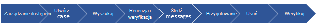
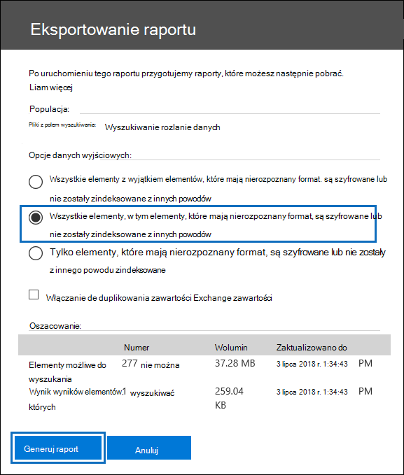
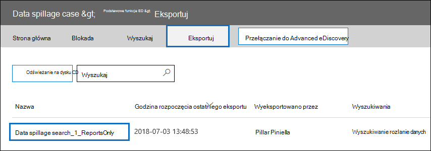
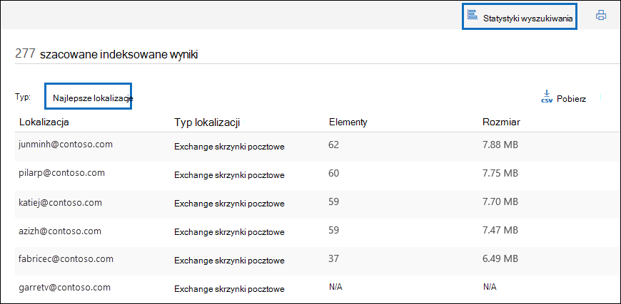
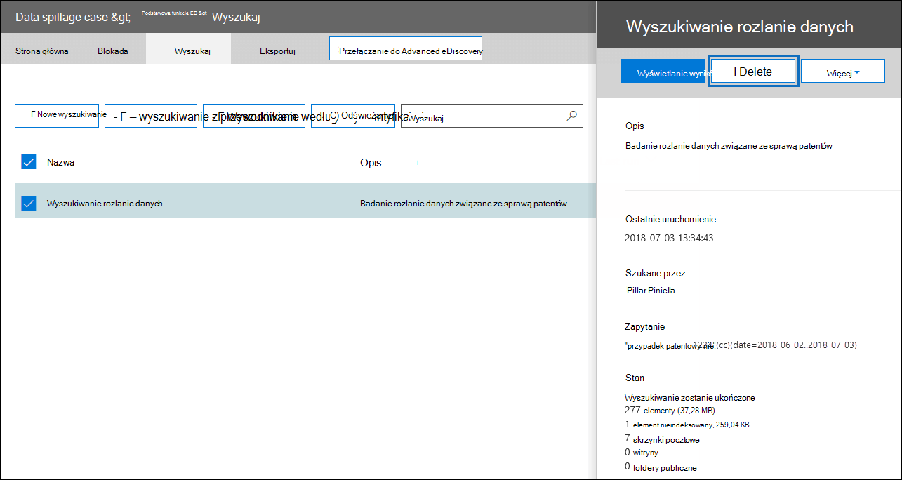

# Seria rozwiązań zbierania elektronicznych materiałów dowodowych: scenariusz rozlania danych — wyszukiwanie i przeczyszczanie

 **Co to jest wyciek danych i dlaczego warto się tym zająć?** Wyciek danych występuje, gdy poufny dokument jest uwalniany do niezaufanego środowiska. Po wykryciu zdarzenia wycieku danych ważne jest, aby szybko ocenić rozmiar i lokalizację wycieku, zbadać działania użytkowników wokół niego, a następnie trwale oczyścić rozlane dane z systemu.
  
## Scenariusz rozlania danych

Jesteś głównym oficerem ds. zabezpieczeń informacji w firmie Contoso. Otrzymujesz informacje o sytuacji wycieku danych, w której pracownik nieświadomie udostępnił bardzo poufny dokument wielu osobom za pośrednictwem poczty e-mail. Chcesz szybko ocenić, kto otrzymał ten dokument wewnętrznie i zewnętrznie. Po zidentyfikowaniu chcesz podzielić się ustaleniami sprawy z innymi badaczami, aby przejrzeć, a następnie trwale usunąć dane z Office 365. Po zakończeniu badania chcesz wygenerować raport z dowodami trwałego usunięcia i innymi szczegółami sprawy dla każdego przyszłego odwołania.
  
### Zakres tego artykułu

Ten dokument zawiera listę instrukcji dotyczących trwałego usuwania komunikatu z Microsoft 365, aby nie był dostępny ani możliwy do odzyskania. Aby usunąć wiadomość i umożliwić jej odzyskanie do czasu wygaśnięcia okresu przechowywania usuniętego elementu, zobacz [Wyszukiwanie i usuwanie wiadomości e-mail w organizacji](search-for-and-delete-messages-in-your-organization.md).
  
## Przepływ pracy do zarządzania zdarzeniami wycieku danych

Poniżej przedstawiono sposób zarządzania zdarzeniem wycieku danych:

  
[(Opcjonalnie) Krok 1. Zarządzanie tym, kto może uzyskać dostęp do sprawy i ustawianie granic zgodności](#optional-step-1-manage-who-can-access-the-case-and-set-compliance-boundaries) 
[Krok 2. Tworzenie sprawy zbierania elektronicznych materiałów dowodowych](#step-2-create-an-ediscovery-case) 
[Krok 3. Wyszukiwanie rozlanych danych](#step-3-search-for-the-spilled-data) 
[Krok 4. Przejrzyj i zweryfikuj ustalenia sprawy](#step-4-review-and-validate-case-findings) 
[Krok 5. Sprawdzanie sposobu udostępniania rozlanych danych za pomocą dziennika śledzenia komunikatów](#step-5-use-message-trace-log-to-check-how-spilled-data-was-shared) 
[Krok 6. Przygotowywanie skrzynek pocztowych](#step-6-prepare-the-mailboxes) 
[Krok 7. Trwałe usuwanie rozlanych danych](#step-7-permanently-delete-the-spilled-data) 
[Krok 8. Weryfikowanie, dostarczanie dowodu usunięcia i inspekcji](#step-8-verify-provide-a-proof-of-deletion-and-audit) 

## Co należy wiedzieć przed rozpoczęciem

- Gdy skrzynka pocztowa jest wstrzymana, usunięta wiadomość pozostaje w folderze Elementy możliwe do odzyskania do czasu wygaśnięcia okresu przechowywania lub zwolnienia blokady. [W kroku 6](#step-6-prepare-the-mailboxes) opisano sposób usuwania blokady ze skrzynek pocztowych. Przed usunięciem blokady skontaktuj się z działami zarządzania rekordami lub działami prawnymi. Organizacja może mieć zasady określające, czy skrzynka pocztowa jest wstrzymana, czy zdarzenie wycieku danych ma priorytet. 
    
- Aby kontrolować, które skrzynki pocztowe użytkowników mogą wyszukiwać osoby, które mogą uzyskiwać dostęp do sprawy i zarządzać nimi, możesz skonfigurować granice zgodności i utworzyć niestandardową grupę ról opisaną w [kroku 1](#optional-step-1-manage-who-can-access-the-case-and-set-compliance-boundaries). W tym celu musisz być członkiem grupy ról Zarządzanie organizacją lub mieć przypisaną rolę zarządzania rolami. Jeśli Ty lub administrator w organizacji już ustawiłeś granice zgodności, możesz pominąć krok 1.
    
- Aby utworzyć przypadek, musisz być członkiem grupy ról menedżera zbierania elektronicznych materiałów dowodowych lub być członkiem niestandardowej grupy ról przypisanej do roli Zarządzania sprawami. Jeśli nie jesteś członkiem, poproś administratora Microsoft 365 o [dodanie Cię do grupy ról menedżera zbierania elektronicznych materiałów dowodowych](assign-ediscovery-permissions.md).
    
- Aby utworzyć i uruchomić wyszukiwanie zawartości, musisz być członkiem grupy ról menedżera zbierania elektronicznych materiałów dowodowych lub mieć przypisaną rolę zarządzania wyszukiwaniem zgodności. Aby usunąć komunikaty, musisz być członkiem grupy ról Zarządzanie organizacją lub mieć przypisaną rolę zarządzania wyszukiwaniem i przeczyszczaniem. Aby uzyskać informacje na temat dodawania użytkowników do grupy ról, zobacz [Przypisywanie uprawnień zbierania elektronicznych materiałów dowodowych](./assign-ediscovery-permissions.md).
    
- Aby przeszukać działania zbierania elektronicznych materiałów dowodowych dziennika inspekcji w kroku 8, inspekcja musi być włączona dla twojej organizacji. Możesz wyszukać działania, które zostały wykonane w ciągu ostatnich 90 dni. Aby dowiedzieć się więcej na temat włączania i używania inspekcji, zobacz sekcję [Auditing the data spillage investigation process (Inspekcja procesu badania wycieku danych](#auditing-the-data-spillage-investigation-process) ) w kroku 8. 
    
## (Opcjonalnie) Krok 1. Zarządzanie tym, kto może uzyskać dostęp do sprawy i ustawianie granic zgodności

W zależności od praktyki organizacyjnej należy kontrolować, kto może uzyskiwać dostęp do przypadku zbierania elektronicznych materiałów dowodowych używanego do badania zdarzenia wycieku danych i skonfigurowania granic zgodności. Najprostszym sposobem na to jest dodanie badaczy jako członków istniejącej grupy ról w Centrum zgodności platformy Microsoft 365, a następnie dodanie grupy ról jako członka sprawy zbierania elektronicznych materiałów dowodowych. Aby uzyskać informacje o wbudowanych grupach ról zbierania elektronicznych materiałów dowodowych i sposobie dodawania członków do sprawy zbierania elektronicznych materiałów dowodowych, zobacz [Przypisywanie uprawnień zbierania elektronicznych materiałów dowodowych](assign-ediscovery-permissions.md).
  
Możesz również utworzyć nową grupę ról, która będzie zgodna z potrzebami organizacji. Na przykład może być konieczne, aby grupa badaczy wycieków danych w organizacji uzyskiwała dostęp do wszystkich przypadków wycieku danych i współpracowała nad nimi. Można to zrobić, tworząc grupę ról "Data Spillage Investigator", przypisując odpowiednie role (Export, RMS Decrypt, Review, Preview, Compliance Search i Case Management), dodając badaczy wycieków danych do grupy ról, a następnie dodając grupę ról jako członka sprawy zbierania elektronicznych materiałów dowodowych. Aby uzyskać szczegółowe instrukcje dotyczące tego sposobu, zobacz [Konfigurowanie granic zgodności dla badań zbierania elektronicznych materiałów dowodowych w Office 365](set-up-compliance-boundaries.md). 
  
## Krok 2. Tworzenie sprawy zbierania elektronicznych materiałów dowodowych

Przypadek zbierania elektronicznych materiałów dowodowych zapewnia skuteczny sposób zarządzania badaniem wycieku danych. Możesz dodać członków do grupy ról utworzonej w kroku 1, dodać grupę ról jako członka nowej sprawy zbierania elektronicznych materiałów dowodowych, przeprowadzić iteracyjne wyszukiwania w celu znalezienia rozlanych danych, wyeksportować raport do udostępnienia, śledzić stan sprawy, a następnie w razie potrzeby odwołać się do szczegółów sprawy. Rozważ ustanowienie konwencji nazewnictwa dla przypadków zbierania elektronicznych materiałów dowodowych używanych do zdarzeń związanych z wyciekiem danych i podaj jak najwięcej informacji w nazwie i opisie sprawy, aby w razie potrzeby można było zlokalizować i odwołać się do nich w przyszłości.
  
Aby utworzyć nowy przypadek, możesz użyć zbierania elektronicznych materiałów dowodowych w centrum zabezpieczeń i zgodności. Zobacz "Create a new case" in [Wprowadzenie with Core eDiscovery (Tworzenie nowego przypadku) w Wprowadzenie z podstawowymi funkcjami zbierania elektronicznych materiałów dowodowych](get-started-core-ediscovery.md#step-3-create-a-core-ediscovery-case).
  
## Krok 3. Wyszukiwanie rozlanych danych

Po utworzeniu sprawy i dostępu zarządzanego można użyć przypadku do iteracyjnego wyszukiwania w celu znalezienia rozlanych danych i zidentyfikowania skrzynek pocztowych zawierających rozlane dane. Użyjesz tego samego zapytania wyszukiwania, które zostało użyte do znalezienia wiadomości e-mail w celu usunięcia tych samych wiadomości w [kroku 7](#step-7-permanently-delete-the-spilled-data).
  
Aby utworzyć wyszukiwanie zawartości skojarzone ze sprawą zbierania elektronicznych materiałów dowodowych, zobacz [Wyszukiwanie zawartości w przypadku podstawowego zbierania elektronicznych materiałów dowodowych](search-for-content-in-core-ediscovery.md).
  
> [!IMPORTANT]
> Słowa kluczowe używane w zapytaniu wyszukiwania mogą zawierać rzeczywiste rozlane dane, których szukasz. Jeśli na przykład wyszukujesz dokumenty zawierające numer ubezpieczenia społecznego i użyjesz go jako słowa kluczowego wyszukiwania, musisz później usunąć zapytanie, aby uniknąć dalszego rozlania. Zobacz [Usuwanie zapytania wyszukiwania](#deleting-the-search-query) w kroku 8.
  
## Krok 4. Przejrzyj i zweryfikuj ustalenia sprawy

Po utworzeniu wyszukiwania zawartości należy przejrzeć i sprawdzić, czy wyniki wyszukiwania i sprawdzić, czy składają się one tylko z wiadomości e-mail, które muszą zostać usunięte. W wyszukiwaniu zawartości można wyświetlić podgląd losowego próbkowania 1000 wiadomości e-mail bez eksportowania wyników wyszukiwania, aby uniknąć dalszego rozlania danych. Więcej informacji na temat ograniczeń wersji zapoznawczej można znaleźć w [artykułach Limits for Content Search (Limity wyszukiwania zawartości](limits-for-content-search.md)).
  
Jeśli masz więcej niż 1000 skrzynek pocztowych lub więcej niż 100 wiadomości e-mail na skrzynkę pocztową do przejrzenia, możesz podzielić początkowe wyszukiwanie na wiele wyszukiwań przy użyciu dodatkowych słów kluczowych lub warunków, takich jak zakres dat lub nadawca/odbiorca, i przejrzeć wyniki każdego wyszukiwania osobno. Pamiętaj, aby zanotować wszystkie zapytania wyszukiwania do użycia podczas usuwania komunikatów w [kroku 7](#step-7-permanently-delete-the-spilled-data).

Po znalezieniu wiadomości e-mail zawierającej rozlane dane sprawdź adresatów wiadomości, aby ustalić, czy została udostępniona zewnętrznie. Aby dalej śledzić komunikat, możesz zbierać informacje o nadawcy i zakresy dat, aby można było używać dzienników śledzenia komunikatów. Ten proces został opisany w [kroku 5](#step-5-use-message-trace-log-to-check-how-spilled-data-was-shared).

Po zweryfikowaniu wyników wyszukiwania możesz udostępnić swoje wyniki innym osobom na potrzeby przeglądu pomocniczego. Osoby, które zostały przypisane do sprawy w kroku 1, mogą przejrzeć zawartość sprawy zarówno w sekcji eDiscovery, jak i Advanced eDiscovery oraz zatwierdzić ustalenia sprawy. Raport można również wygenerować bez eksportowania rzeczywistej zawartości. Możesz również użyć tego samego raportu jako dowodu usunięcia, który został opisany w [kroku 8](#step-8-verify-provide-a-proof-of-deletion-and-audit).
  
 **Aby wygenerować raport statystyczny:**
  
1. Przejdź do strony **Wyszukaj** w przypadku zbierania elektronicznych materiałów dowodowych i kliknij wyszukiwanie, dla których chcesz wygenerować raport. 
    
2. Na stronie wysuwanej kliknij pozycję **Więcej > Eksportuj raport**.
 
      Zostanie wyświetlona strona Eksportuj raport.

    
    
3. Wybierz pozycję **Wszystkie elementy, w tym te, które mają nierozpoznany format, są zaszyfrowane lub nie zostały zindeksowane z innych powodów,** a następnie kliknij pozycję **Generuj raport**.

4. W przypadku zbierania elektronicznych materiałów dowodowych kliknij pozycję **Eksportuj** , aby wyświetlić listę zadań eksportu. Może być konieczne **kliknięcie** przycisku Odśwież, aby zaktualizować listę, aby wyświetlić utworzone zadanie eksportu.

5. Kliknij zadanie eksportu, a następnie kliknij pozycję **Pobierz** raport na stronie wysuwanej.
 
    

Raport **Podsumowanie eksportu** zawiera liczbę znalezionych lokalizacji z wynikami i rozmiar wyników wyszukiwania. Można go użyć do porównania z raportem wygenerowanym po usunięciu i dostarczenia jako dowód usunięcia. Raport **Wyniki** zawiera bardziej szczegółowe podsumowanie wyników wyszukiwania, w tym temat, nadawcę, adresatów, jeśli wiadomość e-mail została przeczytana, daty i rozmiar każdej wiadomości. Jeśli którykolwiek ze szczegółów w tym raporcie zawiera rzeczywiste rozlane dane, pamiętaj, aby trwale usunąć plik Results.csv po zakończeniu badania.

Aby uzyskać więcej informacji na temat eksportowania raportów, zobacz [Eksportowanie raportu wyszukiwania zawartości](export-a-content-search-report.md).
    
## Krok 5. Sprawdzanie sposobu udostępniania rozlanych danych za pomocą dziennika śledzenia komunikatów

Aby dokładniej zbadać, czy wiadomość e-mail z rozlanymi danymi została udostępniona, możesz opcjonalnie wykonać zapytanie dotyczące dzienników śledzenia komunikatów przy użyciu informacji nadawcy i informacji o zakresie dat zebranych w kroku 4. Okres przechowywania śledzenia komunikatów wynosi 30 dni dla danych w czasie rzeczywistym i 90 dni dla danych historycznych.
  
Możesz użyć śledzenia komunikatów w centrum zabezpieczeń i zgodności lub użyć odpowiednich poleceń cmdlet w programie Exchange Online programu PowerShell. Należy pamiętać, że śledzenie komunikatów nie zapewnia pełnych gwarancji kompletności zwracanych danych. Aby uzyskać więcej informacji na temat korzystania ze śledzenia komunikatów, zobacz: 
  
- [Śledzenie komunikatów w Centrum zgodności & zabezpieczeń](../security/office-365-security/message-trace-scc.md)
    
- [Nowy ślad komunikatów w Centrum zgodności & zabezpieczeń](https://techcommunity.microsoft.com/t5/exchange-team-blog/new-message-trace-in-office-365-security-038-compliance-center/ba-p/607893)
    
## Krok 6. Przygotowywanie skrzynek pocztowych

Po przejrzeniu i zweryfikowaniu, czy wyniki wyszukiwania zawierają tylko wiadomości, które muszą zostać usunięte, należy zebrać listę adresów e-mail skrzynek pocztowych, których dotyczy problem, do użycia w kroku 7 po usunięciu rozlanych danych. Może być również konieczne przygotowanie skrzynek pocztowych przed trwałym usunięciem wiadomości e-mail w zależności od tego, czy odzyskiwanie pojedynczego elementu jest włączone w skrzynkach pocztowych zawierających rozlane dane lub czy którakolwiek z tych skrzynek pocztowych jest wstrzymana.
  
### Pobieranie listy adresów skrzynek pocztowych z rozlanymi danymi

Istnieją dwa sposoby zbierania listy adresów e-mail skrzynek pocztowych z rozlanymi danymi.

**Opcja 1. Pobieranie listy adresów skrzynek pocztowych z rozlanymi danymi**

1. Otwórz przypadek zbierania elektronicznych materiałów dowodowych, przejdź do strony **Wyszukiwanie** i wybierz odpowiednie wyszukiwanie zawartości. 
    
2. Na stronie wysuwanej kliknij pozycję **Wyświetl wyniki**.
    
3. Na liście rozwijanej **Indywidualne wyniki** kliknij pozycję **Statystyki wyszukiwania**.
    
4. Na liście rozwijanej **Typ** kliknij pozycję **Lokalizacje główne**.
    
    

    Zostanie wyświetlona lista skrzynek pocztowych zawierających wyniki wyszukiwania. Zostanie również wyświetlona liczba elementów w każdej skrzynce pocztowej, które pasują do zapytania wyszukiwania.
    
5. Skopiuj informacje na liście i zapisz je w pliku lub kliknij pozycję **Pobierz** , aby pobrać informacje do pliku CSV. 
    
**Opcja 2. Pobieranie lokalizacji skrzynek pocztowych z raportu eksportu**

Otwórz raport Podsumowanie eksportu pobrany w [kroku 4](#step-4-review-and-validate-case-findings). W pierwszej kolumnie raportu adres e-mail każdej skrzynki pocztowej znajduje się w obszarze **Lokalizacje**.
  
### Przygotuj skrzynki pocztowe, aby można było usunąć rozlane dane

Jeśli odzyskiwanie pojedynczego elementu jest włączone lub jeśli skrzynka pocztowa zostanie wstrzymana, trwale usunięta (przeczyszczana) wiadomość zostanie zachowana w folderze Elementy możliwe do odzyskania. Dlatego przed przeczyszczeniem rozlanych danych należy sprawdzić istniejące konfiguracje skrzynek pocztowych i wyłączyć odzyskiwanie pojedynczego elementu oraz usunąć wszelkie zasady przechowywania lub przechowywania. Pamiętaj, że możesz przygotować jedną skrzynkę pocztową jednocześnie, a następnie uruchomić to samo polecenie w różnych skrzynkach pocztowych lub utworzyć skrypt programu PowerShell w celu przygotowania wielu skrzynek pocztowych w tym samym czasie.

- Zobacz "Krok 1: Zbieranie informacji o skrzynce pocztowej" w temacie [Usuwanie elementów w folderze Elementy możliwe do odzyskania w chmurowych skrzynkach pocztowych wstrzymanych](delete-items-in-the-recoverable-items-folder-of-mailboxes-on-hold.md#step-1-collect-information-about-the-mailbox) , aby uzyskać instrukcje dotyczące sprawdzania, czy odzyskiwanie pojedynczego elementu jest włączone, czy skrzynka pocztowa jest wstrzymana lub jest przypisana do zasad przechowywania. 

- Aby uzyskać instrukcje dotyczące wyłączania odzyskiwania pojedynczego elementu, zobacz "Krok 2. Przygotowywanie skrzynki pocztowej" [w folderze Usuń elementy w folderze Elementy możliwe do odzyskania w chmurowych skrzynkach pocztowych](delete-items-in-the-recoverable-items-folder-of-mailboxes-on-hold.md#step-2-prepare-the-mailbox) . 

- Aby uzyskać instrukcje dotyczące usuwania zasad przechowywania lub przechowywania ze skrzynki pocztowej, zobacz "Krok 3: usuwanie wszystkich blokad ze skrzynki pocztowej" [w folderze Usuń elementy w folderze Elementy możliwe do odzyskania w chmurowych skrzynkach pocztowych](delete-items-in-the-recoverable-items-folder-of-mailboxes-on-hold.md#step-3-remove-all-holds-from-the-mailbox) . 

- Zobacz "Krok 4: Usuwanie blokady opóźnienia ze skrzynki pocztowej" w [folderze Usuń elementy w folderze Elementy możliwe do odzyskania w chmurowych skrzynkach pocztowych,](delete-items-in-the-recoverable-items-folder-of-mailboxes-on-hold.md#step-4-remove-the-delay-hold-from-the-mailbox) aby uzyskać instrukcje dotyczące usuwania blokady opóźnienia umieszczonej w skrzynce pocztowej po usunięciu dowolnego typu blokady.

> [!IMPORTANT]
> Przed usunięciem zasad wstrzymania lub przechowywania sprawdź, czy działy zarządzania rekordami lub działy prawne zostały zlikwidowane. Organizacja może mieć zasady określające, czy skrzynka pocztowa jest wstrzymana, czy zdarzenie wycieku danych ma priorytet. 
  
Pamiętaj, aby przywrócić skrzynkę pocztową do poprzednich konfiguracji po sprawdzeniu, czy rozlane dane zostały trwale usunięte. Zobacz szczegóły w [kroku 7](#step-7-permanently-delete-the-spilled-data).

## Krok 7. Trwałe usuwanie rozlanych danych

Korzystając z lokalizacji skrzynek pocztowych zebranych i przygotowanych w kroku 6 oraz zapytania wyszukiwania utworzonego i udoskonalonego w kroku 3 w celu znalezienia wiadomości e-mail zawierających rozlane dane, możesz teraz trwale usunąć rozlane dane.  Jak wcześniej wyjaśniono, aby usunąć komunikaty, musisz być członkiem grupy ról Zarządzanie organizacją lub mieć przypisaną rolę zarządzania wyszukiwaniem i przeczyszczaniem. Aby uzyskać informacje na temat dodawania użytkowników do grupy ról, zobacz [Przypisywanie uprawnień zbierania elektronicznych materiałów dowodowych](./assign-ediscovery-permissions.md).

Aby usunąć rozlane wiadomości, zobacz [Wyszukiwanie i usuwanie wiadomości e-mail](search-for-and-delete-messages-in-your-organization.md).

Podczas usuwania rozlanych danych należy pamiętać o następujących limitach:

- Maksymalna liczba skrzynek pocztowych w wyszukiwaniu, których można użyć do usunięcia elementów, wykonując akcję wyszukiwania i przeczyszczania, wynosi 50 000. Jeśli wyszukiwanie utworzone w kroku 3 wyszukuje ponad 50 000 skrzynek pocztowych, akcja przeczyszczania zakończy się niepowodzeniem. Wyszukiwanie ponad 50 000 skrzynek pocztowych w jednym wyszukiwaniu może zazwyczaj nastąpić podczas konfigurowania wyszukiwania tak, aby uwzględniało wszystkie skrzynki pocztowe w organizacji. To ograniczenie nadal ma zastosowanie nawet wtedy, gdy mniej niż 50 000 skrzynek pocztowych zawiera elementy zgodne z zapytaniem wyszukiwania.

- Jednocześnie można usunąć maksymalnie 10 elementów na skrzynkę pocztową. Ponieważ możliwość wyszukiwania i usuwania wiadomości ma być narzędziem reagowania na zdarzenia, ten limit pomaga zapewnić szybkie usunięcie wiadomości ze skrzynek pocztowych. Ta funkcja nie jest przeznaczona do czyszczenia skrzynek pocztowych użytkowników.

> [!IMPORTANT]
> Nie można usunąć elementów wiadomości e-mail w zestawie przeglądów w Advanced eDiscovery przypadku przy użyciu procedur w tym artykule. Dzieje się tak dlatego, że elementy w zestawie przeglądów są kopiami elementów w usłudze na żywo, które są kopiowane i przechowywane w lokalizacji Storage platformy Azure. Oznacza to, że nie zostaną one zwrócone przez wyszukiwanie zawartości utworzone w kroku 3. Aby usunąć elementy w zestawie przeglądów, należy usunąć przypadek Advanced eDiscovery zawierający zestaw przeglądów. Aby uzyskać więcej informacji, zobacz [Zamykanie lub usuwanie Advanced eDiscovery przypadku](close-or-delete-case.md).
  
## Krok 8. Weryfikowanie, dostarczanie dowodu usunięcia i inspekcji

Ostatnim krokiem w przepływie pracy do zarządzania zdarzeniem wycieku danych jest sprawdzenie, czy rozlane dane zostały trwale usunięte ze skrzynki pocztowej, przechodząc do sprawy zbierania elektronicznych materiałów dowodowych i ponownie uruchamiając to samo zapytanie wyszukiwania, które zostało użyte do usunięcia tych danych, aby potwierdzić, że nie są zwracane żadne wyniki. Po upewnieniu się, że rozlane dane zostały trwale usunięte, możesz wyeksportować raport i dołączyć go (wraz z oryginalnym raportem) jako dowód usunięcia. Następnie możesz [zamknąć sprawę](close-reopen-delete-core-ediscovery-cases.md) , która pozwoli ci otworzyć ją ponownie, jeśli musisz się do niej odwołać w przyszłości. Ponadto można również przywrócić skrzynki pocztowe do ich poprzedniego stanu, usunąć zapytanie wyszukiwania użyte do znalezienia rozlanych danych i wyszukać rekordy inspekcji zadań wykonywanych podczas zarządzania zdarzeniem wycieku danych.
  
### Przywracanie skrzynek pocztowych do poprzedniego stanu

Jeśli w kroku 6 zmieniono konfigurację skrzynki pocztowej w celu przygotowania skrzynek pocztowych przed usunięciem rozlanych danych, należy przywrócić ich poprzedni stan. Zobacz "Krok 6: Przywracanie skrzynki pocztowej do poprzedniego stanu" w [folderze Usuń elementy w folderze Elementy możliwe do odzyskania w chmurowych skrzynkach pocztowych, które są wstrzymane](delete-items-in-the-recoverable-items-folder-of-mailboxes-on-hold.md#step-6-revert-the-mailbox-to-its-previous-state).
  
### Usuwanie zapytania wyszukiwania

Jeśli słowa kluczowe w zapytaniu wyszukiwania, które zostały utworzone i użyte w kroku 3, zawierają niektóre z wszystkich rzeczywistych rozlanych danych, należy usunąć zapytanie wyszukiwania, aby zapobiec dalszemu wyciekowi danych.
  
1. W centrum zabezpieczeń i zgodności otwórz przypadek zbierania elektronicznych materiałów dowodowych, przejdź do strony **Wyszukiwanie** i wybierz odpowiednie wyszukiwanie zawartości.

2. Na stronie wysuwanej kliknij pozycję **Usuń**.

    

### Inspekcja procesu badania wycieku danych

W dzienniku inspekcji można wyszukać działania zbierania elektronicznych materiałów dowodowych, które zostały wykonane podczas badania. Możesz również przeszukać dziennik inspekcji, aby zwrócić rekordy inspekcji dla polecenia **New-ComplianceSearchAction -Purge** uruchomionego w kroku 7 w celu usunięcia rozlanych danych. Więcej informacji można znaleźć w następujących artykułach:

- [Przeszukaj dziennik inspekcji](search-the-audit-log-in-security-and-compliance.md)

- [Wyszukaj działania zbierania elektronicznych materiałów dowodowych w dzienniku inspekcji](search-for-ediscovery-activities-in-the-audit-log.md)
