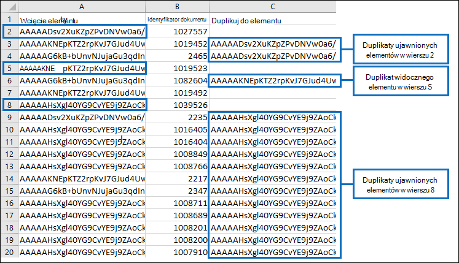

# Usuwanie duplikowania w wynikach wyszukiwania zbierania elektronicznych materiałów dowodowych

W tym artykule opisano sposób działania de-duplikowania wyników wyszukiwania zbierania elektronicznych materiałów dowodowych i objaśniono ograniczenia algorytmu de-duplikacji.
  
W przypadku korzystania z narzędzi zbierania elektronicznych materiałów dowodowych do eksportowania wyników wyszukiwania zbierania elektronicznych materiałów dowodowych można usunąć zduplikowane wyniki. Co to oznacza? Po włączeniu funkcji de-duplikowania (domyślnie de-duplikowanie nie jest włączone), eksportowana jest tylko jedna kopia wiadomości e-mail, mimo że w przeszukanych skrzynkach pocztowych mogło zostać znalezionych wiele wystąpień tej samej wiadomości. De-duplikowanie pomaga zaoszczędzić czas, zmniejszając liczbę elementów, które należy przejrzeć i przeanalizować po wyeksportowaniu wyników wyszukiwania. Jednak ważne jest, aby zrozumieć, jak działa duplikowanie, i mieć świadomość, że istnieją ograniczenia algorytmu, które mogą powodować oznaczenie unikatowego elementu jako duplikatu podczas procesu eksportowania.
  
## Jak są identyfikowane zduplikowane komunikaty

Narzędzia zbierania elektronicznych materiałów dowodowych używają kombinacji następujących właściwości poczty e-mail, aby określić, czy wiadomość jest duplikatem:
  
- **InternetMessageId** — ta właściwość określa identyfikator komunikatu internetowego wiadomości e-mail, który jest unikatowym identyfikatorem globalnym, który odwołuje się do określonej wersji określonej wiadomości. Ten identyfikator jest generowany przez program klienta poczty e-mail nadawcy lub system poczty e-mail hosta, który wysyła wiadomość. Jeśli dana osoba wyśle wiadomość do więcej niż jednego adresata, identyfikator wiadomości internetowej będzie taki sam dla każdego wystąpienia wiadomości. Kolejne poprawki oryginalnego komunikatu otrzymają inny identyfikator komunikatu. 

- **ConversationTopic** — ta właściwość określa temat wątku konwersacji komunikatu. Wartość właściwości **ConversationTopic** to ciąg opisujący ogólny temat konwersacji. Konwersacja składa się z początkowej wiadomości i wszystkich wiadomości wysłanych w odpowiedzi na początkową wiadomość. Komunikaty w tej samej konwersacji mają tę samą wartość dla właściwości **ConversationTopic** . Wartość tej właściwości to zazwyczaj wiersz tematu z początkowego komunikatu, który zduplikował konwersację. 

- **BodyTagInfo** — jest to wewnętrzna właściwość magazynu exchange. Wartość tej właściwości jest obliczana przez sprawdzenie różnych atrybutów w treści komunikatu. Ta właściwość służy do identyfikowania różnic w treści komunikatów. 

Podczas procesu eksportowania zbierania elektronicznych materiałów dowodowych te trzy właściwości są porównywane dla każdego komunikatu zgodnego z kryteriami wyszukiwania. Jeśli te właściwości są identyczne dla dwóch (lub większej liczby) komunikatów, te komunikaty są określane jako duplikaty, a wynik jest taki, że tylko jedna kopia komunikatu zostanie wyeksportowana, jeśli zostanie włączona deduplikacja. Wyeksportowany komunikat jest nazywany "elementem źródłowym". Informacje o zduplikowanych komunikatach są zawarte w **raportachResults.csv** i **Manifest.xml** dołączonych do wyeksportowanych wyników wyszukiwania. W pliku **Results.csv** zduplikowany komunikat jest identyfikowany przez wartość w kolumnie **Duplikuj do elementu** . Wartość w tej kolumnie jest zgodna z wartością w kolumnie **Tożsamość elementu** dla wyeksportowanego komunikatu. 
  
Poniższa grafika pokazuje sposób wyświetlania zduplikowanych komunikatów w **Results.csv** i **Manifest.xml** raportów eksportowanych z wynikami wyszukiwania. Te raporty nie zawierają wcześniej opisanych właściwości poczty e-mail, które są używane w algorytmie de-duplikowania. Zamiast tego raporty zawierają **właściwość Item Identity** przypisaną do elementów przez magazyn programu Exchange. 
  
 ### Results.csv raport (wyświetlany w programie Excel)
  

  
 ### Manifest.xml raport (wyświetlany w programie Excel)
  

  
Ponadto inne właściwości z zduplikowanych komunikatów są uwzględniane w raportach eksportu. Obejmuje to skrzynkę pocztową, w którą znajduje się zduplikowana wiadomość, niezależnie od tego, czy wiadomość została wysłana do grupy dystrybucyjnej, oraz to, czy wiadomość była cc'd, czy Bcc'd do innego użytkownika.
  
## Ograniczenia algorytmu de-duplikacji

Istnieją pewne znane ograniczenia algorytmu cofania duplikowania, które mogą powodować oznaczanie unikatowych elementów jako duplikatów. Ważne jest, aby zrozumieć te ograniczenia, aby można było zdecydować, czy korzystać z opcjonalnej funkcji de-duplikowania.
  
Istnieje jedna sytuacja, w której funkcja de-duplikowania może błędnie zidentyfikować komunikat jako duplikat i nie wyeksportować go (ale nadal przytoczyć go jako duplikat w raportach eksportu). Są to komunikaty, które użytkownik edytuje, ale nie wysyła. Załóżmy na przykład, że użytkownik wybiera komunikat w programie Outlook, kopiuje zawartość wiadomości, a następnie wkleja ją w nowej wiadomości. Następnie użytkownik zmienia jedną z kopii, usuwając lub dodając załącznik lub zmieniając wiersz tematu lub samą treść. Jeśli te dwa komunikaty są zgodne z zapytaniem wyszukiwania zbierania elektronicznych materiałów dowodowych, tylko jeden z komunikatów zostanie wyeksportowany, jeśli po wyeksportowaniu wyników wyszukiwania zostanie włączona deduplikacja. Mimo że oryginalna wiadomość lub skopiowana wiadomość została zmieniona, żadne ze zmienionych komunikatów nie zostało wysłane i dlatego wartości właściwości **InternetMessageId**, **ConversationTopic** i **BodyTagInfo** nie zostały zaktualizowane. Jednak jak wyjaśniono wcześniej, oba komunikaty zostaną wyświetlone w raportach eksportu 
  
Unikatowe wiadomości mogą być również oznaczane jako duplikaty, gdy włączono funkcję ochrony strony kopiowania na zapis, tak jak w przypadku skrzynki pocztowej, która znajduje się w blokadzie postępowania sądowego lub In-Place blokadzie. Funkcja kopiowania przy zapisie kopiuje oryginalny komunikat (i zapisuje go w folderze wersje folderu Elementy możliwe do odzyskania użytkownika) przed zapisaniem poprawki oryginalnego elementu. W takim przypadku poprawiona kopia i oryginalny komunikat (w folderze Elementy możliwe do odzyskania) można uznać za zduplikowane komunikaty, dlatego tylko jeden z nich zostanie wyeksportowany.
  
> [!IMPORTANT]
> Jeśli ograniczenia algorytmu deduplikacji mogą mieć wpływ na jakość wyników wyszukiwania, nie należy włączać wycofywania duplikacji podczas eksportowania elementów. Jeśli sytuacje opisane w tej sekcji prawdopodobnie nie będą czynnikiem w wynikach wyszukiwania i chcesz zmniejszyć liczbę elementów, które najprawdopodobniej będą duplikatami, rozważ włączenie deduplikacji. 
  
## Więcej informacji

- Informacje zawarte w tym artykule mają zastosowanie podczas eksportowania wyników wyszukiwania przy użyciu jednego z następujących narzędzi zbierania elektronicznych materiałów dowodowych:

  - Wyszukiwanie zawartości w Centrum zgodności w Office 365

  - In-Place zbierania elektronicznych materiałów dowodowych w Exchange Online

  - Centrum zbierania elektronicznych materiałów dowodowych w usłudze SharePoint Online

- Aby uzyskać więcej informacji na temat eksportowania wyników wyszukiwania, zobacz:

  - [Eksportowanie wyszukiwania zawartości](export-search-results.md)

  - [Eksportowanie raportu wyszukiwania zawartości](export-a-content-search-report.md)

  - [Eksportowanie wyników wyszukiwania zbierania elektronicznych materiałów dowodowych In-Place do pliku PST](/exchange/security-and-compliance/in-place-ediscovery/export-search-results)

  - [Eksportowanie zawartości i tworzenie raportów w Centrum zbierania elektronicznych materiałów dowodowych](/SharePoint/governance/export-content-and-create-reports-in-the-ediscovery-center)
