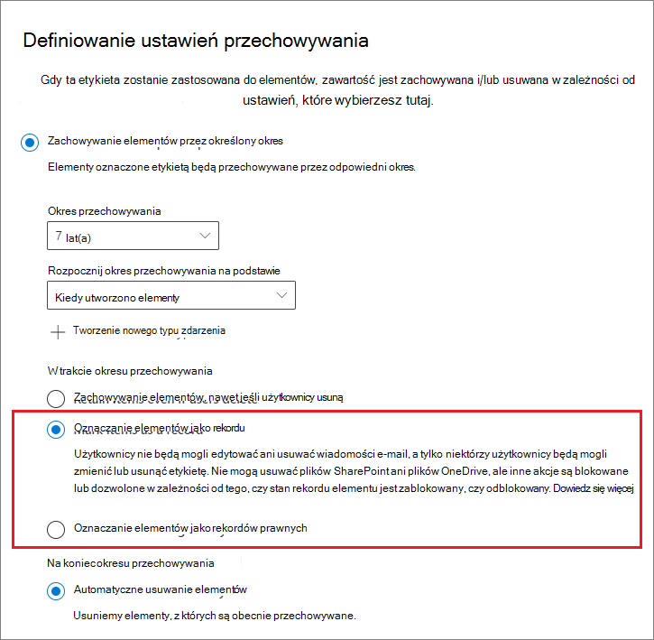

# <a name="declare-records-by-using-retention-labels"></a>Deklarowanie rekordów przy użyciu etykiet przechowywania

>*[Microsoft 365 licencjonowania w zakresie zabezpieczeń & zgodności](/office365/servicedescriptions/microsoft-365-service-descriptions/microsoft-365-tenantlevel-services-licensing-guidance/microsoft-365-security-compliance-licensing-guidance).*

Aby zadeklarować dokumenty i wiadomości e-mail jako [](retention.md#retention-labels) [rekordy](records-management.md#records), należy użyć etykiet przechowywania, które oznaczają zawartość jako **rekord lub** **rekord przepisów prawa**.

Jeśli nie masz pewności, czy użyć rekordu, czy rekordu prawnego, zobacz Porównanie ograniczeń dotyczących dozwolonych lub [zablokowanych akcji](records-management.md#compare-restrictions-for-what-actions-are-allowed-or-blocked). Aby korzystać z rekordów prawa, należy najpierw uruchomić polecenie programu PowerShell zgodnie z opisem w następnej sekcji.

Następnie można opublikować te etykiety w zasadach etykiet przechowywania, aby użytkownicy i administratorzy mogą je stosować do zawartości, lub w przypadku etykiet oznaczanych jako rekordy (ale nie rekordy prawne), automatycznie zastosować te etykiety do zawartości, którą chcesz zadeklarować jako rekord.

## <a name="how-to-display-the-option-to-mark-content-as-a-regulatory-record"></a>Jak wyświetlić opcję oznaczania zawartości jako rekordu prawnego

> [!NOTE]
> Poniżej przedstawiono akcję, która podlega inspekcji, opcję rejestrowania  Włączoną regulacyjną opcję [](search-the-audit-log-in-security-and-compliance.md#retention-policy-and-retention-label-activities) rekordu dla etykiet przechowywania w sekcji Zasady przechowywania i działania etykiet przechowywania w dzienniku inspekcji.

Domyślnie opcja etykiety przechowywania oznaczania zawartości jako rekordu prawnego nie jest wyświetlana w Kreatorze etykiet przechowywania. Aby wyświetlić tę opcję, należy najpierw uruchomić polecenie programu PowerShell:

1. [Połączenie się z centrum Office 365 zabezpieczeń & w programie PowerShell](/powershell/exchange/office-365-scc/connect-to-scc-powershell/connect-to-scc-powershell).

2. Uruchom następujące polecenie cmdlet:

    ```powershell
    Set-RegulatoryComplianceUI -Enabled $true
    ````

    Nie zostanie wyświetlony monit o potwierdzenie, a ustawienie zostanie wprowadzone natychmiast.

Jeśli zmienisz zdanie na temat tej opcji w Kreatorze etykiet przechowywania, możesz ją ponownie ukryć, uruchamiając to samo polecenie cmdlet z **wartością fałszywą** : `Set-RegulatoryComplianceUI -Enabled $false`

## <a name="configuring-retention-labels-to-declare-records"></a>Konfigurowanie etykiet przechowywania w celu deklarowania rekordów

Podczas tworzenia etykiety przechowywania na podstawie rozwiązania **do** zarządzania rekordami w skoroszycie Centrum zgodności platformy Microsoft 365 można oznaczyć elementy jako rekord. Jeśli w poprzedniej sekcji uruchomiono polecenie programu PowerShell, możesz również oznaczyć elementy jako rekord przepisów prawa.

Przykład:



Za pomocą tej etykiety przechowywania możesz teraz stosować ją do dokumentów SharePoint i OneDrive e-mail Exchange e-mail, zgodnie z potrzebami.

Aby uzyskać pełne instrukcje:

- [Tworzenie etykiet przechowywania i stosowanie ich w aplikacjach](create-apply-retention-labels.md)

- [Automatyczne stosowanie etykiet przechowywania do zawartości](apply-retention-labels-automatically.md) (nie jest obsługiwane w przypadku rekordów prawnych)

## <a name="tenant-setting-for-editing-record-properties"></a>Ustawienie dzierżawy do edytowania właściwości rekordu

Jeśli za pomocą etykiet przechowywania będziesz deklarować elementy jako rekordy (a nie rekordy prawne) w programach SharePoint i OneDrive, rozważ, czy musisz zmienić domyślne ustawienie dzierżawy, które umożliwia użytkownikom edytowanie właściwości zablokowanego rekordu, gdy rozmiar [](record-versioning.md) plików jest większy niż 0 bajtów.

Aby zmienić to ustawienie domyślne, przejdź do ustawień zarządzania rekordami Centrum zgodności platformy Microsoft 365 RekordyUzyskania zarządzania Etykiety ustawieńWłaściwość właściwości rekordu zezwalaj na edytowanie właściwości rekordu, [a](https://compliance.microsoft.com/) >  >  >  >  następnie wyłącz ustawienie Zezwalaj użytkownikom na edytowanie właściwości **rekordu**.

## <a name="applying-the-configured-retention-label-to-content"></a>Stosowanie skonfigurowanej etykiety przechowywania do zawartości

W przypadku korzystania z etykiet przechowywania oznaczanych elementami jako rekordu lub rekordu prawnego użytkownicy mogą je stosować w aplikacjach:

- Na Exchange każdy użytkownik z dostępem do zapisu w skrzynce pocztowej może zastosować te etykiety.
- Na SharePoint i OneDrive każdy użytkownik w domyślnej grupie Członkowie (poziom uprawnień Współtwoerowanie) może zastosować te etykiety.

Przykład dokumentu oznaczonego jako rekord za pomocą etykiety przechowywania:


## <a name="searching-the-audit-log-for-labeled-items-that-were-declared-records"></a>Przeszukiwanie dziennika inspekcji w poszukiwaniu elementów oznaczonych etykietą, które zostały zadeklarowane jako rekordy

Akcje dotyczące oznaczania elementów jako rekordów są rejestrowane w dzienniku inspekcji.

W SharePoint elementów:
- Na **stronie i w działaniach pliku** wybierz pozycję **Zmieniono etykietę przechowywania dla pliku**. To zdarzenie inspekcji dotyczy etykiet przechowywania, które oznaczają elementy jako rekordy, rekordy prawne lub są standardowymi etykietami przechowywania.

W Exchange elementów:
- W **Exchange skrzynki pocztowej** wybierz pozycję **Wiadomość oznaczona etykietą jako rekord**. To zdarzenie inspekcji dotyczy etykiet przechowywania, które oznaczają elementy jako rekordy lub rekordy prawne.

Aby uzyskać więcej informacji na temat wyszukiwania tych zdarzeń, zobacz Przeszukiwanie dziennika inspekcji w [Centrum & zabezpieczeń](search-the-audit-log-in-security-and-compliance.md#file-and-page-activities).

## <a name="next-steps"></a>Następne kroki

Dowiedz się, jak używać przechowywania [wersji rekordów w celu aktualizowania rekordów](record-versioning.md) przechowywanych w SharePoint lub OneDrive.