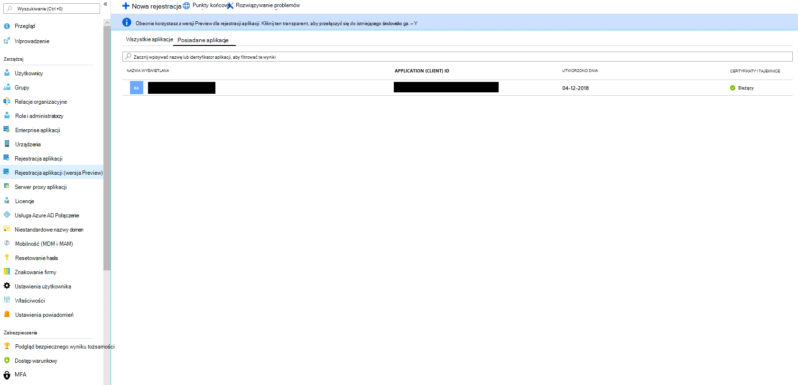

# Wdrażanie łącznika w celu archiwizacji danych stron biznesowych usługi Facebook

[!include[Purview banner](../includes/purview-rebrand-banner.md)]

Ten artykuł zawiera krok po kroku proces wdrażania łącznika, który używa usługi Office 365 Import do importowania danych ze stron biznesowych serwisu Facebook do Microsoft 365. Aby zapoznać się z ogólnym omówieniem tego procesu i listą wymagań wstępnych wymaganych do wdrożenia łącznika usługi Facebook, zobacz [Konfigurowanie łącznika w celu archiwizowania danych serwisu Facebook](archive-facebook-data-with-sample-connector.md).

## Krok 1. Tworzenie aplikacji w Azure Active Directory

1. Przejdź do strony <https://portal.azure.com> i zaloguj się przy użyciu poświadczeń konta administratora globalnego.

    

2. W okienku nawigacji po lewej stronie kliknij pozycję **Azure Active Directory**.

    

3. W okienku nawigacji po lewej stronie kliknij pozycję **Rejestracje aplikacji (wersja zapoznawcza),** a następnie kliknij pozycję **Nowa rejestracja**.

    

4. Zarejestruj aplikację. W obszarze Identyfikator URI przekierowania wybierz pozycję Sieć Web na liście rozwijanej typ aplikacji, a następnie wpisz <https://portal.azure.com> w polu identyfikator URI.

   

5. Skopiuj **identyfikator aplikacji (klienta)** i **identyfikator katalogu (dzierżawy)** i zapisz je w pliku tekstowym lub innej bezpiecznej lokalizacji. Te identyfikatory są używane w kolejnych krokach.

   

6. Przejdź do pozycji **Certyfikaty & wpisów tajnych dla nowej aplikacji.**

   

7. Kliknij pozycję **Nowy klucz tajny klienta**

   

8. Utwórz nowy wpis tajny. W polu opisu wpisz wpis tajny, a następnie wybierz okres wygaśnięcia.

    

9. Skopiuj wartość wpisu tajnego i zapisz ją w pliku tekstowym lub innej lokalizacji magazynu. Jest to AAD wpis tajny aplikacji używany w kolejnych krokach.

   

## Krok 2. Wdrażanie usługi internetowej łącznika z GitHub na koncie platformy Azure

1. Przejdź do [tej witryny GitHub](https://github.com/microsoft/m365-sample-connector-csharp-aspnet) i kliknij pozycję **Wdróż na platformie Azure**.

    

2. Po kliknięciu **przycisku Wdróż na platformie Azure** nastąpi przekierowanie do Azure Portal przy użyciu niestandardowej strony szablonu. Wypełnij szczegóły **podstawowe** i **Ustawienia**, a następnie kliknij przycisk **Kup**.

   - **Subskrypcji:** Wybierz subskrypcję platformy Azure, w ramach którą chcesz wdrożyć usługę internetową łącznika stron biznesowych w serwisie Facebook.

   - **Grupa zasobów:** Wybierz lub utwórz nową grupę zasobów. Grupa zasobów to kontener, który przechowuje powiązane zasoby dla rozwiązania platformy Azure.

   - **Lokalizacji:** Wybierz lokalizację.

   - **Nazwa aplikacji internetowej:** Podaj unikatową nazwę aplikacji internetowej łącznika. Nazwa musi mieć długość od 3 do 18 znaków. Ta nazwa jest używana do tworzenia adresu URL usługi Azure App Service. Jeśli na przykład podasz nazwę aplikacji internetowej **fbconnector** , adres URL usługi Azure App Service zostanie **fbconnector.azurewebsites.net**.

   - **tenantId:** Identyfikator dzierżawy organizacji Microsoft 365 skopiowany po utworzeniu aplikacji łącznika Facebook w Azure Active Directory w kroku 1.

   - **Klucz APISecretKey:** Dowolną wartość można wpisać jako wpis tajny. Służy do uzyskiwania dostępu do aplikacji internetowej łącznika w kroku 5.

     

3. Po pomyślnym wdrożeniu strona będzie wyglądać podobnie do poniższego zrzutu ekranu:

   

## Krok 3. Rejestrowanie aplikacji Facebook

1. Przejdź do <https://developers.facebook.com>obszaru , zaloguj się przy użyciu poświadczeń konta dla stron biznesowych facebookowej organizacji, a następnie kliknij pozycję **Dodaj nową aplikację**.

   

2. Utwórz nowy identyfikator aplikacji.

   

3. W okienku nawigacji po lewej stronie kliknij pozycję **Dodaj produkty** , a następnie kliknij pozycję **Skonfiguruj** na kafelku **Facebook Login** .

   

4. Na stronie Integrowanie logowania do serwisu Facebook kliknij pozycję **Sieć Web**.

   

5. Dodaj adres URL usługi Azure App Service; na przykład `https://fbconnector.azurewebsites.net`.

   

6. Ukończ sekcję Szybki start konfiguracji logowania na Facebooku.

   

7. W okienku nawigacji po lewej stronie w obszarze **Logowanie do serwisu Facebook** kliknij pozycję **Ustawienia** i dodaj identyfikator URI przekierowania OAuth w polu **Prawidłowe identyfikatory URI przekierowania OAuth**. Użyj formatu **\<connectorserviceuri>/Views/FacebookOAuth**, gdzie wartość connectorserviceuri to adres URL usługi Azure App Service dla twojej organizacji, na przykład `https://fbconnector.azurewebsites.net`.

   

8. W okienku nawigacji po lewej stronie kliknij pozycję **Dodaj produkty** , a następnie kliknij pozycję **Elementy webhook.** W menu rozwijanym **Strona** kliknij pozycję **Strona**.

   

9. Dodaj adres URL wywołania zwrotnego elementów webhook i dodaj token weryfikacji. Format adresu URL wywołania zwrotnego, użyj formatu `<connectorserviceuri>/api/FbPageWebhook`, gdzie wartość connectorserviceuri to adres URL usługi Azure App Service dla organizacji, na przykład `https://fbconnector.azurewebsites.net`.

   Token weryfikacji powinien być podobny do silnego hasła. Skopiuj token weryfikacji do pliku tekstowego lub innej lokalizacji magazynu.

   

10. Testowanie i subskrybowanie punktu końcowego na potrzeby kanału informacyjnego.

    

11. Dodaj adres URL prywatności, ikonę aplikacji i użycie biznesowe. Ponadto skopiuj identyfikator aplikacji i wpis tajny aplikacji do pliku tekstowego lub innej lokalizacji magazynu.

    

12. Upublicznij aplikację.

    

13. Dodaj użytkownika do roli administratora lub testera.

    

14. Dodaj uprawnienie **Dostęp do zawartości publicznej strony** .

    

15. Dodaj uprawnienie Zarządzaj stronami.

    

16. Przejrzyj aplikację przez serwis Facebook.

    

## Krok 4. Konfigurowanie aplikacji internetowej łącznika

1. Przejdź do strony `https://<AzureAppResourceName>.azurewebsites.net` (gdzie AzureAppResourceName to nazwa zasobu aplikacji platformy Azure nazwanego w kroku 4). Jeśli na przykład nazwa to **fbconnector**, przejdź do pozycji `https://fbconnector.azurewebsites.net`. Strona główna aplikacji będzie wyglądać podobnie do poniższego zrzutu ekranu:

   

2. Kliknij pozycję **Konfiguruj** , aby wyświetlić stronę logowania.

   

3. W polu Identyfikator dzierżawy wpisz lub wklej identyfikator dzierżawy (uzyskany w kroku 2). W polu hasła wpisz lub wklej klucz APISecretKey (uzyskany w kroku 2), a następnie kliknij pozycję **Ustaw konfigurację Ustawienia**, aby wyświetlić stronę szczegółów konfiguracji.

    

4. Wprowadź następujące ustawienia konfiguracji

   - **Identyfikator aplikacji Facebook:** Identyfikator aplikacji dla aplikacji facebookowej uzyskany w kroku 3.

   - **Wpis tajny aplikacji Facebook:** Wpis tajny aplikacji dla aplikacji Facebook uzyskany w kroku 3.

   - **Elementy webhook serwisu Facebook weryfikują token:** Token weryfikacji utworzony w kroku 3.

   - **AAD identyfikator aplikacji:** identyfikator aplikacji dla aplikacji Azure Active Directory utworzonej w kroku 1.

   - **AAD wpis tajny aplikacji:** wartość klucza tajnego APISecretKey utworzonego w kroku 1.

5. Kliknij **przycisk Zapisz** , aby zapisać ustawienia łącznika.

## Krok 5. Konfigurowanie łącznika usługi Facebook w portalu zgodności

1. Przejdź do portalu zgodności usługi Microsoft Purview, a następnie wybierz pozycję <a href="https://go.microsoft.com/fwlink/p/?linkid=2173865" target="_blank">**Łączniki danych**</a.

2. Na stronie **Łączniki danych** w obszarze **Strony biznesowe serwisu Facebook** kliknij pozycję **Wyświetl**.

3. Na stronie **Strony biznesowe w serwisie Facebook** kliknij pozycję **Dodaj łącznik**.

4. Na stronie **Warunki korzystania z usługi** kliknij pozycję **Akceptuj**.

5. Na stronie **Dodawanie poświadczeń dla aplikacji łącznika** wprowadź następujące informacje, a następnie kliknij pozycję **Weryfikuj połączenie**.

   

   - W polu **Nazwa** wpisz nazwę łącznika, na przykład **stronę z wiadomościami na Facebooku**.

   - W polu **Adres URL połączenia** wpisz lub wklej adres URL usługi Azure App Service; na przykład `https://fbconnector.azurewebsites.net`.

   - W polu **Hasło** wpisz lub wklej wartość klucza APISecretKey, który został dodany w kroku 2.

   - W **polu identyfikatora aplikacja systemu Azure** wpisz lub wklej wartość identyfikatora aplikacji (klienta) nazywanego również identyfikatorem aplikacji AAD utworzonym w kroku 1.

6. Po pomyślnym zweryfikowaniu połączenia kliknij przycisk **Dalej**.

7. Na stronie **Autoryzowanie Microsoft 365 importowania danych** ponownie wpisz lub wklej ciąg APISecretKey, a następnie kliknij pozycję **Zaloguj aplikację internetową**.

8. Na stronie **Konfigurowanie aplikacji łącznika Facebooka** kliknij pozycję **Zaloguj się przy użyciu serwisu Facebook** i zaloguj się przy użyciu poświadczeń konta dla stron biznesowych Facebook w organizacji. Upewnij się, że konto facebookowe, na które zalogowano się, ma przypisaną rolę administratora dla stron biznesowych Facebook w organizacji.

   

9. Zostanie wyświetlona lista stron biznesowych zarządzanych przez zalogowane konto na Facebooku. Wybierz stronę do archiwizacji, a następnie kliknij przycisk **Dalej**.

   

10. Kliknij przycisk **Kontynuuj** , aby zakończyć konfigurację aplikacji usługi łącznika.

11. Na stronie **Ustaw filtry** możesz zastosować filtr, aby początkowo importować elementy o określonym wieku. Wybierz wiek, a następnie kliknij przycisk **Dalej**.

12. Na stronie **Wybieranie lokalizacji magazynu** wpisz adres e-mail Microsoft 365 skrzynki pocztowej, do których zostaną zaimportowane elementy serwisu Facebook, a następnie kliknij przycisk **Dalej**.

13. Kliknij **przycisk Dalej** , aby przejrzeć ustawienia łącznika, a następnie kliknij przycisk **Zakończ** , aby ukończyć konfigurację łącznika.

14. W centrum zgodności przejdź do strony **Łączniki danych** i kliknij kartę **Łączniki** , aby zobaczyć postęp procesu importowania.
