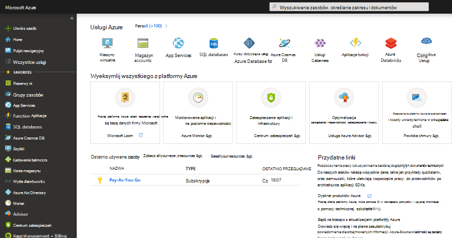
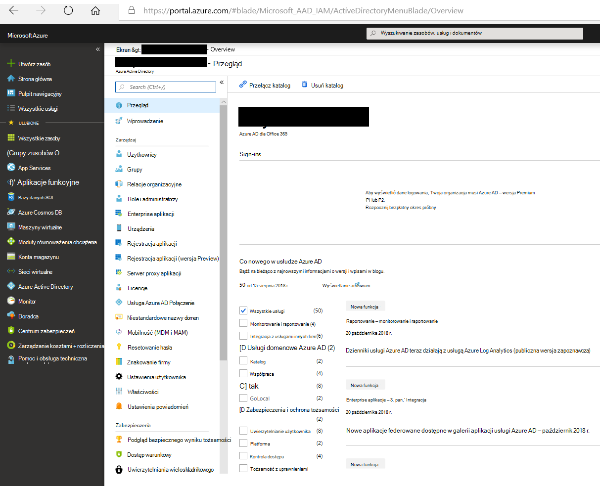
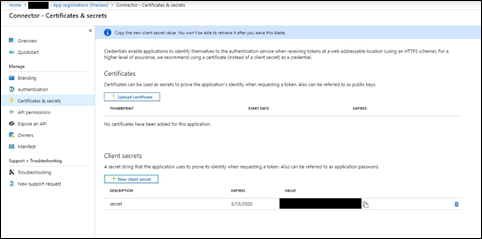

# Wdrażanie łącznika w celu archiwizowania danych z usługi Twitter

Ten artykuł zawiera szczegółowe instrukcje dotyczące wdrażania łącznika, który używa usługi importowania Office 365 w celu importowania danych z konta w serwisie Twitter Twojej organizacji w celu Microsoft 365. Aby uzyskać ogólne omówienie tego procesu i listę wymagań wstępnych wymaganych do wdrożenia łącznika usługi Twitter, zobacz Konfigurowanie łącznika do archiwizowania danych usługi [Twitter ](archive-twitter-data-with-sample-connector.md).

## Krok 1. Tworzenie aplikacji w aplikacji Azure Active Directory

1. Przejdź do <https://portal.azure.com> konta administratora globalnego i zaloguj się przy użyciu poświadczeń administratora globalnego.

   

2. W lewym okienku nawigacji kliknij pozycję **Azure Active Directory**.

   

3. W lewym okienku nawigacji kliknij pozycję Rejestracje **aplikacji (wersja Preview),** a następnie kliknij **pozycję Nowa rejestracja**.

   

4. Zarejestruj aplikację. W **obszarze Przekierowywanie URI (** opcjonalnie)wybierz pozycję **Sieć Web** na liście `https://portal.azure.com` rozwijanej typu aplikacji, a następnie wpisz w polu dla URI.

   

5. Skopiuj identyfikator **aplikacji (klienta) i** identyfikator katalogu (dzierżawy **)** i zapisz go w pliku tekstowym lub w innej bezpiecznej lokalizacji. Te identyfikatory należy stosować w kolejnych krokach.

    

6. Przejdź do **sekretów & nowych** aplikacji i w obszarze Tajemnice **klienta** kliknij **pozycję Klucz tajny nowego klienta**.

   

7. Utwórz nową tajemnicę. W polu Opis wpisz klucz tajny, a następnie wybierz okres wygasania.

   

8. Skopiuj wartość tajemnicy i zapisz ją w pliku tekstowym lub innej lokalizacji przechowywania. Jest to klucz AAD tajny, z których korzystasz w kolejnych krokach.

   

## Krok 2. Wdrażanie usługi sieci Web łącznika z programu GitHub do konta Azure

1. Przejdź do [tej witryny GitHub i](https://github.com/microsoft/m365-sample-twitter-connector-csharp-aspnet) kliknij pozycję **Wdeksuj na platformie Azure**.

    

2. Po kliknięciu **przycisku Wdeksuj** w usłudze Azure nastąpi przekierowanie do portalu Azure Portal z stroną szablonu niestandardowego. Wprowadź informacje podstawowe **i szczegóły** **Ustawienia** a następnie kliknij pozycję **Zakup**.

   

    - **Subskrypcja:** Wybierz subskrypcję platformy Azure, w której chcesz wdrożyć usługę internetową łącznika serwisu Twitter.

    - **Grupa zasobów:** Wybierz lub utwórz nową grupę zasobów. Grupa zasobów to kontener, który zawiera pokrewne zasoby dla rozwiązania platformy Azure.

    - **Lokalizacja:** Wybierz lokalizację.

    - **Nazwa aplikacji sieci Web:** Nadaj unikatową nazwę aplikacji sieci Web łącznika. Ta nazwa musi mieć od 3 do 18 znaków. Ta nazwa służy do tworzenia adresu URL usługi aplikacji Azure; Jeśli na przykład po podajesz nazwę aplikacji internetowej **twitterconnector** , adres URL usługi aplikacji Azure będzie **twitterconnector.azurewebsites.net**.

    - **tenantId:** Identyfikator dzierżawy organizacji Microsoft 365, która została skopiowana po utworzeniu aplikacji łącznika serwisu Facebook w usłudze Azure Active Directory w kroku 1.

   - **APISecretKey:** Jako klucz tajny możesz wpisać dowolną wartość. Służy to do uzyskiwania dostępu do aplikacji sieci Web łącznika w kroku 5.

3. Po pomyślnym wdrożeniu strona będzie wyglądać podobnie do poniższego zrzutu ekranu:

    

## Krok 3. Tworzenie aplikacji Twitter

1. Przejdź do https://developer.twitter.comusługi , zaloguj się przy użyciu poświadczeń dla konta dewelopera w organizacji, a następnie kliknij pozycję **Aplikacje**.

   
2. Kliknij **pozycję Utwórz aplikację**.

   

3. W **obszarze Szczegóły** aplikacji dodaj informacje o aplikacji.

   

4. Na pulpicie nawigacyjnym dewelopera usługi Twitter wybierz właśnie utworzoną aplikację, a następnie kliknij pozycję **Szczegóły**.

   

5. Na karcie **Klucze i tokeny** w obszarze Klucze interfejsu **API** klienta skopiuj zarówno klucz interfejsu API, jak i klucz tajny interfejsu API i zapisz je w pliku tekstowym lub innej lokalizacji przechowywania. Następnie kliknij przycisk **Utwórz,** aby wygenerować token dostępu i klucz tajny tokenu dostępu oraz skopiować go do pliku tekstowego lub innej lokalizacji przechowywania.

   

   Następnie kliknij pozycję **Utwórz** , aby wygenerować token dostępu i tajny token dostępu, a następnie skopiuj je do pliku tekstowego lub innej lokalizacji przechowywania.

6. Kliknij **kartę Uprawnienia** i skonfiguruj uprawnienia, jak pokazano na poniższym zrzucie ekranu:

   

7. Po zapisaniu ustawień uprawnień kliknij kartę **Szczegóły** aplikacji, a następnie kliknij pozycję Edytuj > **Szczegóły**.

   

8. Wykonaj następujące zadania:

   - Zaznacz pole wyboru, aby zezwolić aplikacji łącznik na logowanie się w serwisie Twitter.

   - Dodaj adres Uri przekierowywania protokołu OAuth, używając następującego formatu: **\<connectorserviceuri>/Views/TwitterOAuth**, gdzie wartość *connectorserviceuri* to adres URL usługi aplikacji Azure dla Organizacji, https://twitterconnector.azurewebsites.net/Views/TwitterOAuthna przykład .

    

Aplikacja dewelopera usługi Twitter jest teraz gotowa do użycia.

## Krok 4. Konfigurowanie aplikacji sieci Web Łącznik

1. Przejdź do https://\<AzureAppResourceName>.azurewebsites.net (gdzie **nazwa AzureAppResourceName** to nazwa zasobu aplikacji platformy Azure, której nazwa została nadana w kroku 4). Jeśli na przykład nazwa to **twitterconnector**, przejdź do https://twitterconnector.azurewebsites.net. Strona główna aplikacji wygląda jak na poniższym zrzucie ekranu:

   

2. Kliknij **pozycję** Konfiguruj, aby wyświetlić stronę logowania.

   

3. W polu Identyfikator dzierżawy wpisz lub wklej identyfikator dzierżawy (uzyskany w kroku 2). W polu hasła wpisz lub wklej kod APISecretKey (uzyskany w kroku 2), a następnie kliknij pozycję Ustaw konfigurację **Ustawienia**, aby wyświetlić stronę szczegółów konfiguracji.

   

4. Wprowadź następujące ustawienia konfiguracji

   - **Klucz interfejsu API twittera:** Klucz interfejsu API aplikacji w serwisie Twitter utworzony w kroku 3.

   - **Klucz tajny interfejsu Api twittera:** Klucz tajny interfejsu API dla aplikacji usługi Twitter utworzonej w kroku 3.

   - **Token dostępu do twittera:** Token dostępu utworzony w kroku 3.

   - **Token dostępu do Twittera Tajna:** Token dostępu tajny utworzony w kroku 3.

   - **AAD identyfikatora aplikacji:** Identyfikator aplikacji dla aplikacji Azure Active Directory utworzonej w kroku 1

   - **AAD klucz tajny aplikacji:** wartość klucza tajnego interfejsu APISecretKey utworzonego w kroku 1.

5. Kliknij **przycisk Zapisz** , aby zapisać ustawienia łącznika.

## Krok 5. Konfigurowanie łącznika konta Twitter w Centrum zgodności platformy Microsoft 365

1. Przejdź do Centrum zgodności platformy Microsoft 365 i wybierz stronę <a href="https://go.microsoft.com/fwlink/p/?linkid=2173865" target="_blank">**Łączniki** danych,</a.

2. Na stronie **Łączniki danych** w obszarze **Twitter** kliknij pozycję **Wyświetl**.

3. Na stronie **w serwisie Twitter** kliknij **pozycję Dodaj łącznik**.

4. Na stronie **Warunki użytkowania usługi** kliknij pozycję **Zaakceptuj**.

5. Na **stronie Dodawanie poświadczeń dla aplikacji łącznika** wprowadź następujące informacje, a następnie kliknij pozycję **Sprawdź poprawność połączenia**.

   

    - W **polu Nazwa** wpisz nazwę łącznika, na przykład uchwyt pomocy **w serwisie Twitter**.

    - W polu **Adres URL** łącznika wpisz lub wklej adres URL usługi aplikacji Azure; na przykład `https://twitterconnector.azurewebsites.net`.

    - W **polu Hasło** wpisz lub wklej wartość klucza APISecretKey utworzonego w kroku 2.

    - W polu **Identyfikator aplikacji Azure** wpisz lub wklej wartość identyfikatora aplikacji aplikacji platformy Azure (nazywanego również identyfikatorem *klienta), który* uzyskano w kroku 1.

6. Po pomyślnym weryfikacji połączenia kliknij przycisk **Dalej**.

7. Na stronie **Authorize Microsoft 365 to import data** (Autoryzowanie Microsoft 365 importowania danych) ponownie wpisz lub wklej kod APISecretKey, a następnie kliknij pozycję **Zaloguj się w aplikacji sieci Web**.

8. Kliknij pozycję **Zaloguj się za pomocą konta w serwisie Twitter**.

9. Na stronie logowania w serwisie Twitter zaloguj się przy użyciu poświadczeń konta w serwisie Twitter swojej organizacji.

   

   Po zalogowaniu na stronie w serwisie Twitter zostanie wyświetlony następujący komunikat "Zadanie łącznika usługi Twitter pomyślnie skonfiguruje".

10. Kliknij **przycisk Kontynuuj** , aby zakończyć konfigurowanie łącznika w serwisie Twitter.

11. Na stronie **Ustawianie filtrów** możesz zastosować filtr, aby początkowo zaimportować elementy, które mają określony wiek. Wybierz wiek, a następnie kliknij przycisk **Dalej**.

12. Na stronie **Wybierz lokalizację przechowywania** wpisz adres e-mail skrzynki Microsoft 365, do których będą importowane elementy z usługi Twitter, a następnie kliknij przycisk **Dalej**.

13. Kliknij **przycisk Dalej** , aby przejrzeć ustawienia łącznika, a następnie kliknij przycisk **Zakończ,** aby zakończyć konfigurację łącznika.

14. W centrum zgodności przejdź do strony **Łączniki** danych i kliknij kartę Łączniki, aby wyświetlić postęp procesu importowania.
