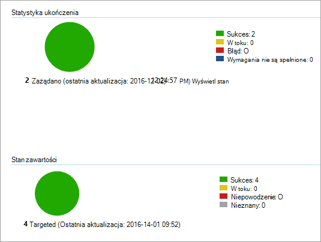

# <a name="onboard-windows-10-and-windows-11-devices-using-configuration-manager"></a>Urządzenia Windows 10 i Windows 11 urządzeń korzystających z Menedżer konfiguracji

**Dotyczy:**

- [Microsoft 365 punktu końcowego ochrony przed utratą danych (DLP)](./endpoint-dlp-learn-about.md)
- [Zarządzanie ryzykiem w niejawnym programie testów](insider-risk-management.md#learn-about-insider-risk-management-in-microsoft-365)

### <a name="onboard-devices-using-system-center-configuration-manager"></a>Urządzenia wyniesiene przy użyciu System Center Configuration Manager

1. Pobierz pakiet konfiguracji do .zip (*DeviceComplianceOnboardingPackage.zip*) z [Centrum zgodności firmy Microsoft](https://compliance.microsoft.com/).

2. W okienku nawigacji wybierz pozycję <a href="https://go.microsoft.com/fwlink/p/?linkid=2174201" target="_blank">**Ustawienia**</a> >  **Device OnboardingOnboarding** > .

3. W **polu Metoda wdrażania** Microsoft Endpoint Configuration Manager **2012-2012 R2/1511/1602**.

4. Wybierz **pozycję Pobierz pakiet** i zapisz .zip pliku.

5. Wyodrębnianie zawartości pliku .zip do udostępnionej lokalizacji tylko do odczytu, do której dostęp mogą uzyskać administratorzy sieci, którzy wdrożyą pakiet. Plik powinien mieć nazwę *DeviceComplianceOnboardingScript.cmd*.

6. Wdeksuj pakiet, korzystając z procedury opisanej w artykule pakiety i programy [System Center 2012 R2 Menedżer konfiguracji](/previous-versions/system-center/system-center-2012-R2/gg699369(v=technet.10)) pakietu.

7. Wybierz wstępnie zdefiniowaną kolekcję urządzeń, w których chcesz wdrożyć pakiet.

> [!NOTE]
> Microsoft 365 informacji nie obsługuje dołączania w fazie "[Out-of-Box Experience" (OOBE](https://answers.microsoft.com/en-us/windows/wiki/windows_10/how-to-complete-the-windows-10-out-of-box/47e3f943-f000-45e3-8c5c-9d85a1a0cf87)). Upewnij się, że użytkownicy zakończyli działanie programu OOBE po Windows instalacji lub uaktualnieniu.

> [!TIP]
> Po włoceniu urządzenia możesz uruchomić test wykrywania w celu sprawdzenia, czy urządzenie jest prawidłowo podłączone do usługi. Aby uzyskać więcej informacji, zobacz Uruchamianie testu wykrywania na nowo włodarzony [program Microsoft Defender dla urządzenia końcowego](/windows/security/threat-protection/microsoft-defender-atp/run-detection-test).
>
> W aplikacji mobilnej można utworzyć regułę wykrywania w celu ciągłego sprawdzania Menedżer konfiguracji czy urządzenie zostało w nim włoone. Aplikacja to inny typ obiektu niż pakiet i program.
> Jeśli urządzenie nie zostało jeszcze naniesone (ze względu na oczekiwanie na ukończenie zadania WOOBE lub z dowolnego innego powodu), program Menedżer konfiguracji spróbuje ponownie wniesieć urządzenie, dopóki reguła nie wykryje zmiany statusu.
>
> Takie działanie można osiągnąć, tworząc sprawdzanie reguły wykrywania, jeśli wartość rejestru "OnboardingState" (wartość typu REG_DWORD) = 1.
> Ta wartość rejestru znajduje się w folderze "HKLM\SOFTWARE\Microsoft\Windows Threat Protection\Status".
Aby uzyskać więcej informacji, zobacz Konfigurowanie metod wykrywania [w programie System Center 2012 R2 Menedżer konfiguracji](/previous-versions/system-center/system-center-2012-R2/gg682159(v=technet.10)#step-4-configure-detection-methods-to-indicate-the-presence-of-the-deployment-type).

### <a name="configure-sample-collection-settings"></a>Konfigurowanie ustawień kolekcji przykładowych

Dla każdego urządzenia możesz ustawić wartość konfiguracji tak, aby określić, czy próbki mogą być pobierane z urządzenia w przypadku złożenia żądania za pośrednictwem programu Centrum zabezpieczeń usługi Microsoft Defender w celu przesłania pliku do dogłębnej analizy.

> [!NOTE]
> Te ustawienia konfiguracji są zwykle wykonywane za pośrednictwem Menedżer konfiguracji.

Możesz ustawić regułę zgodności dla elementu konfiguracji w programie Menedżer konfiguracji, aby zmienić przykładowe ustawienie udostępniania na urządzeniu.

Ta reguła powinna dotyczyć  elementu konfiguracji reguły zgodności, który ustawia wartość klucza rejestru na docelowych urządzeniach w celu upewninia się, że jest to skarga.

Konfigurację można skonfigurować za pomocą następującego wpisu klucza rejestru:

```
Path: “HKLM\SOFTWARE\Policies\Microsoft\Windows Advanced Threat Protection”
Name: "AllowSampleCollection"
Value: 0 or 1
```
Gdzie:<br>
Typ klucza to D-WORD. <br>
Dopuszczalne wartości:
- 0 — nie zezwala na przykładowe udostępnianie z tego urządzenia
- 1. Umożliwia udostępnianie wszystkich typów plików z tego urządzenia

Wartość domyślna w przypadku, gdy klucz rejestru nie istnieje, to 1.

Aby uzyskać więcej informacji na System Center Configuration Manager zgodności, zobacz Wprowadzenie do ustawień zgodności w [programie System Center 2012 R2 Menedżer konfiguracji](/previous-versions/system-center/system-center-2012-R2/gg682139(v=technet.10)).


## <a name="other-recommended-configuration-settings"></a>Inne zalecane ustawienia konfiguracji
Po dojechania urządzeń do usługi ważne jest, aby korzystać z zawartych w nich możliwości ochrony przed zagrożeniami, włączając je z następującymi zalecanymi ustawieniami konfiguracji.

### <a name="device-collection-configuration"></a>Konfiguracja kolekcji urządzeń
Jeśli korzystasz z programu Endpoint Menedżer konfiguracji w wersji 2002 lub nowszej, możesz poszerzyć wdrożenie tak, aby uwzględniało serwery lub klientów  down-level.


### <a name="next-generation-protection-configuration"></a>Konfiguracja ochrony następnej generacji

Zalecane są następujące ustawienia konfiguracji:

**Skanowanie**

- Skanowanie wymiennych urządzeń magazynujących, takich jak dyski USB: Tak

**Ochrona w czasie rzeczywistym**

- Włączanie monitorowania zachowania: Tak
- Włączanie ochrony przed potencjalnie niechcianymi aplikacjami podczas pobierania i przed instalacją: Tak

**Usługa ochrony w chmurze**

- Typ członkostwa w usłudze Cloud Protection: Członkostwo zaawansowane

**Zmniejszenie powierzchni ataków** Skonfiguruj wszystkie dostępne reguły do inspekcji.

> [!NOTE]
> Zablokowanie tych działań może przerwać legalne procesy biznesowe. Najlepszym rozwiązaniem jest ustawienie wszystkich funkcji inspekcji, określenie tych, które można bezpiecznie włączyć, a następnie włączenie tych ustawień dla punktów końcowych, które nie mają wykrywanie wyników fałszywie dodatnich.

**Ochrona sieci**

Przed włączeniem ochrony sieci w trybie inspekcji lub blokowania upewnij się, że zainstalowano aktualizację platformy ochrony przed złośliwym oprogramowaniem, którą można uzyskać na [stronie pomocy technicznej](https://support.microsoft.com/en-us/help/4560203/windows-defender-anti-malware-platform-binaries-are-missing).


**Kontrolowany dostęp do folderu**

Włącz funkcję w trybie inspekcji przez co najmniej 30 dni. Po upływie tego okresu przejrzyj wykrywanie i utwórz listę aplikacji, które mogą pisać w chronionych katalogach.

Aby uzyskać więcej informacji, zobacz [Szacowanie kontrolowanego dostępu do folderu](/windows/security/threat-protection/microsoft-defender-atp/evaluate-controlled-folder-access).


## <a name="offboard-devices-using-configuration-manager"></a>Urządzenia wye korzystające z Menedżer konfiguracji

Ze względów bezpieczeństwa pakiet używany na urządzeniach offboardowych wygaśnie po 30 dniach od daty jego pobrania. Pakiety wynoszące wygasłe wysłane na urządzenie zostaną odrzucone. Podczas pobierania pakietu wynegocjowego będziesz o nich powiadamiać o dacie wygaśnięcia pakietów oraz o tym, że zostanie on także uwzględniony w nazwie pakietu.

> [!NOTE]
> Zasad wnoszeń i wynoszeń nie można wdrażać jednocześnie na tym samym urządzeniu, w przeciwnym razie spowoduje to nieprzewidywalne błędy.

### <a name="offboard-devices-using-microsoft-endpoint-configuration-manager-current-branch"></a>Urządzenia wye korzystające Microsoft Endpoint Configuration Manager bieżącej gałęzi

Jeśli korzystasz z Microsoft Endpoint Configuration Manager, zobacz [Tworzenie pliku konfiguracji wye dołączania](/configmgr/protect/deploy-use/windows-defender-advanced-threat-protection#create-an-offboarding-configuration-file).

### <a name="offboard-devices-using-system-center-2012-r2-configuration-manager"></a>Urządzenia przenośne korzystające z System Center 2012 R2 Menedżer konfiguracji

1. Pobierz pakiet wywęszania z <a href="https://go.microsoft.com/fwlink/p/?linkid=2077149" target="_blank">Centrum zgodności platformy Microsoft 365</a>:

2. W okienku nawigacji wybierz pozycję <a href="https://go.microsoft.com/fwlink/p/?linkid=2174201" target="_blank">**Ustawienia**</a> >   **Device onboardingOffboarding**> .

3. Wybierz Windows 10 systemu operacyjnego.

4. W **polu Metoda wdrażania** Microsoft Endpoint Configuration Manager **2012-2012 R2/1511/1602**.

5. Wybierz **pozycję Pobierz pakiet** i zapisz .zip pliku.

6. Wyodrębnianie zawartości pliku .zip do udostępnionej lokalizacji tylko do odczytu, do której dostęp mogą uzyskać administratorzy sieci, którzy wdrożyą pakiet. Plik powinien mieć nazwę *: DeviceComplianceOffboardingScript_valid_until_YYYY-MM-DD.cmd*.

7. Wdeksuj pakiet, korzystając z procedury opisanej w artykule pakiety i programy [System Center 2012 R2 Menedżer konfiguracji](/previous-versions/system-center/system-center-2012-R2/gg699369(v=technet.10)) pakietu.

8. Wybierz wstępnie zdefiniowaną kolekcję urządzeń, w których chcesz wdrożyć pakiet.

> [!IMPORTANT]
> Wynoszenie powoduje, że urządzenie przestaje wysyłać dane czujnika do portalu, ale dane z urządzenia, w tym odwołania do wszelkich posiadanych alertów, będą przechowywane przez maksymalnie 6 miesięcy.


## <a name="monitor-device-configuration"></a>Monitorowanie konfiguracji urządzenia

Jeśli korzystasz z Microsoft Endpoint Configuration Manager, użyj wbudowanego pulpitu nawigacyjnego programu Microsoft Defender for Endpoint w konsoli Menedżer konfiguracji końcowych. Aby uzyskać więcej informacji, zobacz [Zaawansowana ochrona przed zagrożeniami w programie Microsoft Defender — Monitor](/configmgr/protect/deploy-use/windows-defender-advanced-threat-protection#monitor).

Jeśli używasz programu System Center 2012 R2 Menedżer konfiguracji, monitorowanie składa się z dwóch części:

1. Potwierdzanie, że pakiet konfiguracji został poprawnie wdrożony i działa (lub został pomyślnie uruchomiony) na urządzeniach w sieci.

2. Sprawdzanie, czy urządzenia są zgodne z usługą dołączania Microsoft 365 (dzięki temu urządzenie może ukończyć proces dołączania i może nadal zgłaszać dane do usługi).

### <a name="confirm-the-configuration-package-has-been-correctly-deployed"></a>Upewnij się, że pakiet konfiguracji został poprawnie wdrożony

1. W konsoli Menedżer konfiguracji nawigacji kliknij pozycję **Monitorowanie** w dolnej części okienka nawigacji.

2. Wybierz **pozycję Omówienie** , a **następnie Pozycję Wdrożenia**.

3. Wybierz wdrożenie z nazwą pakietu.

4. Przejrzyj wskaźniki stanu w obszarze **Statystyka ukończenia** i **Stan zawartości**.

    W przypadku wdrożeń nieudanych (urządzeń z błędem **, wymagań** lub stanu niepowodzeniem **) może** być konieczne rozwiązanie problemów z urządzeniami. Aby uzyskać więcej informacji, zobacz Rozwiązywanie problemów z dołączaniem do zaawansowanej ochrony przed zagrożeniami w [programie Microsoft Defender](/windows/security/threat-protection/microsoft-defender-atp/troubleshoot-onboarding).

    

### <a name="check-that-the-devices-are-compliant-with-the-microsoft-365-endpoint-data-loss-prevention-service"></a>Sprawdzanie, czy urządzenia są zgodne z usługą ochrony przed utratą danych Microsoft 365 punktów końcowych

Możesz ustawić regułę zgodności dla elementu konfiguracji w programie System Center 2012 R2 Menedżer konfiguracji monitorowanie wdrożenia.

> [!NOTE]
> Ta procedura i wpis rejestru dotyczą zasad DLP w przypadku punktów końcowych, a także programu Defender for Endpoint.

Ta reguła powinna *być elementem* konfiguracji reguły zgodności, który nie naprawia działania, który monitoruje wartość klucza rejestru na urządzeniach docelowych.

Monitoruj następujący wpis klucza rejestru:
```
Path: “HKLM\SOFTWARE\Microsoft\Windows Advanced Threat Protection\Status”
Name: “OnboardingState”
Value: “1”
```
Aby uzyskać więcej informacji, [zobacz Wprowadzenie do ustawień zgodności w programie System Center 2012 R2 Menedżer konfiguracji](/previous-versions/system-center/system-center-2012-R2/gg682139(v=technet.10)).

## <a name="related-topics"></a>Tematy pokrewne
- [Urządzenia Windows 10 i Windows 11 urządzeń korzystających z zasady grupy](device-onboarding-gp.md)
- [Dołączanie Windows 10 i Windows 11 urządzeń za pomocą narzędzi do zarządzania urządzeniami przenośnymi](device-onboarding-mdm.md)
- [Dołączanie Windows 10 i Windows 11 urządzeń przy użyciu skryptu lokalnego](device-onboarding-script.md)
- [Dołączanie nietrwałych urządzeń infrastruktury pulpitów wirtualnych (VDI, Non-persistent Virtual Desktop Infrastructure)](device-onboarding-vdi.md)
- [Uruchamianie testu wykrywania na nowo w urządzeniu z uruchomionym programem Microsoft Defender dla punktu końcowego](/windows/security/threat-protection/microsoft-defender-atp/run-detection-test)
- [Rozwiązywanie problemów z dołączaniem do zaawansowanej ochrony przed zagrożeniami w u programie Microsoft Defender](/windows/security/threat-protection/microsoft-defender-atp/troubleshoot-onboarding)