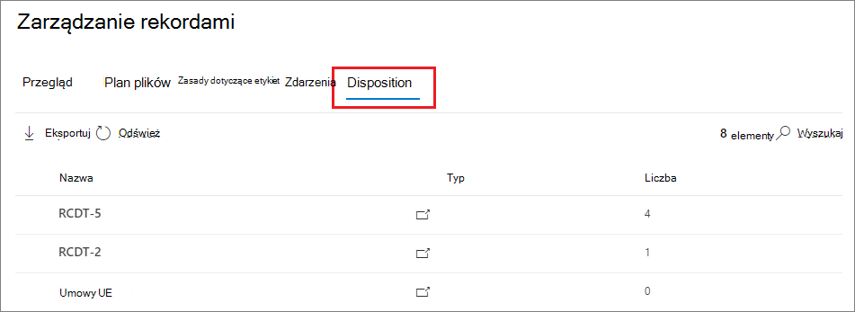
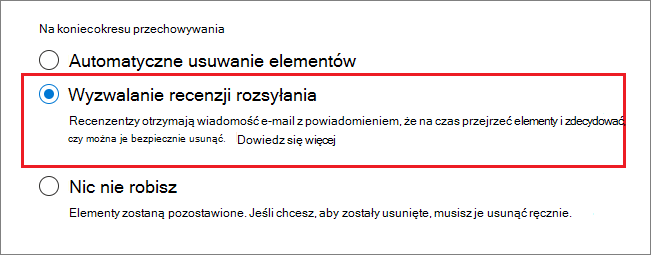
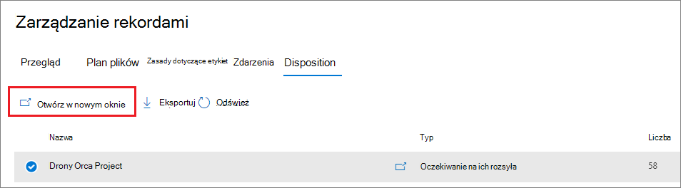
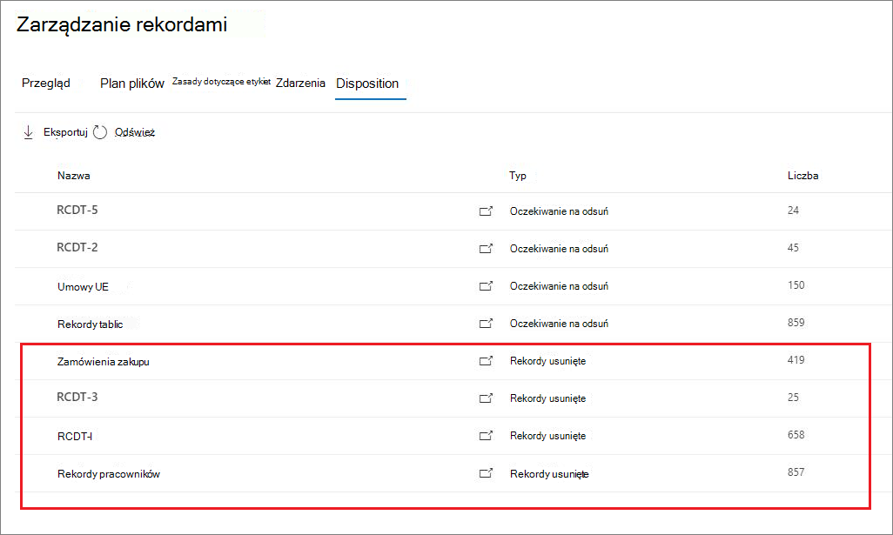

# <a name="disposition-of-content"></a>Dyspozycja zawartości

>*[Microsoft 365 wskazówki dotyczące licencjonowania dotyczące zgodności & zabezpieczeń](/office365/servicedescriptions/microsoft-365-service-descriptions/microsoft-365-tenantlevel-services-licensing-guidance/microsoft-365-security-compliance-licensing-guidance).*

[!include[Purview banner](../includes/purview-rebrand-banner.md)]

Użyj strony **Dyspozycja** z **zarządzania rekordami** w portal zgodności Microsoft Purview, aby zarządzać przeglądami dyspozycji i wyświetlać metadane [rekordów](records-management.md#records), które zostały automatycznie usunięte po zakończeniu okresu przechowywania.

## <a name="prerequisites-for-viewing-content-dispositions"></a>Wymagania wstępne dotyczące wyświetlania usposobień zawartości

Aby zarządzać przeglądami dyspozycji i potwierdzić, że rekordy zostały usunięte, musisz mieć wystarczające uprawnienia, a inspekcja musi być włączona. Należy również pamiętać o wszelkich [ograniczeniach](retention-limits.md#maximum-number-of-items-for-disposition) dotyczących dyspozycji.

### <a name="permissions-for-disposition"></a>Uprawnienia do dyspozycji

Aby pomyślnie uzyskać dostęp do karty **Dyspozycja** w portal zgodności Microsoft Purview, użytkownicy muszą mieć rolę **Zarządzanie dyspozycjami**. Od grudnia 2020 r. ta rola jest teraz uwzględniana w domyślnej grupie ról **Zarządzanie rekordami** .

> [!NOTE]
> Domyślnie administrator globalny nie otrzymuje roli **Zarządzanie dyspozycjami** . 

Aby przyznać użytkownikom tylko uprawnienia potrzebne do przeglądów dyspozycji bez przyznawania im uprawnień do wyświetlania i konfigurowania innych funkcji zarządzania przechowywaniem i rekordami, utwórz niestandardową grupę ról (na przykład o nazwie "Recenzenci dyspozycji") i przyznaj tej grupie rolę **Zarządzanie dyspozycjami** .

Aby uzyskać instrukcje dodawania użytkowników do ról domyślnych lub tworzenia własnych grup ról, zobacz [Uprawnienia w portal zgodności Microsoft Purview](microsoft-365-compliance-center-permissions.md).

Dodatkowo:

- Aby wyświetlić zawartość elementów podczas procesu dyspozycji, dodaj użytkowników do grupy ról **Podgląd zawartości Eksploratora zawartości** . Jeśli użytkownicy nie mają uprawnień z tej grupy ról, nadal mogą wybrać akcję przeglądu dyspozycji, aby ukończyć przegląd dyspozycji, ale muszą to zrobić bez możliwości wyświetlania zawartości elementu w okienku mini-podglądu w portal zgodności Microsoft Purview.

- Domyślnie każda osoba uzyskująca dostęp do strony **Dyspozycja** widzi tylko elementy, które są przypisane do przeglądu. Aby administrator zarządzania rekordami wyświetlał wszystkie elementy przypisane do wszystkich użytkowników oraz wszystkie etykiety przechowywania skonfigurowane do przeglądu dyspozycji: Przejdź do **pozycji Ustawienia** >  zarządzania **rekordamiWybierz**, a następnie włącz grupę zabezpieczeń z włączoną obsługą poczty zawierającą konta administratorów.
    
    Microsoft 365 grupy i grupy zabezpieczeń, które nie obsługują poczty, nie obsługują tej funkcji i nie są wyświetlane na liście do wybrania. Jeśli chcesz utworzyć nową grupę zabezpieczeń z obsługą poczty, użyj linku do <a href="https://go.microsoft.com/fwlink/p/?linkid=2024339" target="_blank">Centrum administracyjne platformy Microsoft 365</a>, aby utworzyć nową grupę. 
    
    > [!IMPORTANT]
    > Po włączeniu grupy nie można jej zmienić w portal zgodności Microsoft Purview. Zobacz następną sekcję, aby dowiedzieć się, jak włączyć inną grupę przy użyciu programu PowerShell.

- Opcja **Ustawienia zarządzania rekordami** jest widoczna tylko dla administratorów zarządzania rekordami. 

#### <a name="enabling-another-security-group-for-disposition"></a>Włączanie innej grupy zabezpieczeń na potrzeby dyspozycji

Po włączeniu grupy zabezpieczeń do dyspozycji z **ustawień zarządzania rekordami** w portal zgodności Microsoft Purview nie można wyłączyć tego uprawnienia dla grupy ani zastąpić wybranej grupy w portal zgodności Microsoft Purview. Można jednak włączyć inną grupę zabezpieczeń obsługującą pocztę za pomocą polecenia cmdlet [Enable-ComplianceTagStorage](/powershell/module/exchange/enable-compliancetagstorage) .

Przykład: 

```PowerShell
Enable-ComplianceTagStorage -RecordsManagementSecurityGroupEmail dispositionreviewers@contosoi.com
````

### <a name="enable-auditing"></a>Włączanie inspekcji

Upewnij się, że inspekcja jest włączona co najmniej jeden dzień przed pierwszą akcją dyspozycji. Aby uzyskać więcej informacji, zobacz [Przeszukiwanie dziennika inspekcji w portal zgodności Microsoft Purview](search-the-audit-log-in-security-and-compliance.md). 

## <a name="disposition-reviews"></a>Przeglądy dyspozycji

Gdy zawartość osiągnie koniec okresu przechowywania, istnieje kilka powodów, dla których warto przejrzeć tę zawartość i potwierdzić, czy można ją trwale usunąć ("usunięte"). Na przykład zamiast usuwać zawartość, może być konieczne:
  
- Wstrzymywanie usuwania odpowiedniej zawartości na potrzeby sporów sądowych lub inspekcji.

- Przypisz do zawartości inny okres przechowywania, być może dlatego, że oryginalne ustawienia przechowywania były rozwiązaniem tymczasowym lub tymczasowym.

- Przenieś zawartość z istniejącej lokalizacji do lokalizacji archiwum, na przykład jeśli ta zawartość ma wartość badawczą lub historyczną.

Gdy przegląd dyspozycji zostanie wyzwolony po zakończeniu okresu przechowywania, wybrani recenzenci otrzymają powiadomienie e-mail z informacją o zawartości do przejrzenia. Mogą to być poszczególni użytkownicy lub grupy zabezpieczeń z obsługą poczty e-mail.

Możesz dostosować wiadomość e-mail z powiadomieniem otrzymywaną przez recenzentów, w tym instrukcje w różnych językach. W przypadku obsługi wielu języków należy samodzielnie określić tłumaczenia, a ten tekst niestandardowy jest wyświetlany wszystkim recenzentom niezależnie od ich ustawień regionalnych.

Użytkownicy otrzymują początkowe powiadomienie e-mail na etykietę na końcu okresu przechowywania elementu z przypomnieniem na etykietę raz w tygodniu o wszystkich przypisanych im przeglądach dyspozycji. Mogą kliknąć link w wiadomościach e-mail z powiadomieniami i przypomnieniami, aby przejść bezpośrednio do strony **Zarządzanie rekordamiDisposition** >  w portal zgodności Microsoft Purview, aby przejrzeć zawartość i podjąć akcję. Recenzenci mogą również przejść do tej strony **Dyspozycja** w portal zgodności Microsoft Purview. Następnie:

- Recenzenci widzą tylko przeglądy dyspozycji, które są do nich przypisane, podczas gdy administratorzy, którzy są dodawani do wybranej grupy zabezpieczeń dla menedżera rekordów, widzą wszystkie przeglądy dyspozycji.

- Recenzenci mogą dodawać nowych użytkowników do tego samego przeglądu dyspozycji. Należy pamiętać, że ta akcja nie udziela automatycznie dodanym użytkownikom [wymaganych uprawnień](#permissions-for-disposition).

- W przypadku procesu przeglądu dyspozycji okienko minirecenzowania dla każdego elementu wyświetla podgląd zawartości, jeśli ma uprawnienia do jej wyświetlenia. Jeśli nie mają uprawnień, mogą wybrać link do zawartości i zażądać uprawnień. W tym okienku minirecenzowania znajdują się również karty umożliwiające dodatkowe informacje o zawartości:
   - **Szczegóły** dotyczące wyświetlania indeksowanych właściwości, miejsca jego lokalizacji, tego, kto go utworzył, kiedy, kto ostatnio je zmodyfikował i kiedy.
   - **Historia** przedstawiająca historię wszelkich dotychczasowych akcji przeglądu dyspozycji z komentarzami recenzentów, jeśli są dostępne.

Przegląd dyspozycji może obejmować zawartość w Exchange skrzynkach pocztowych, witrynach SharePoint i kontach OneDrive. Zawartość oczekująca na przegląd dyspozycji w tych lokalizacjach jest trwale usuwana dopiero po tym, jak recenzent na ostatnim etapie dyspozycji zdecyduje się trwale usunąć zawartość.

> [!NOTE]
> Skrzynka pocztowa musi mieć co najmniej 10 MB danych, aby obsługiwać przeglądy dyspozycji.

Administratorzy mogą wyświetlić przegląd wszystkich oczekujących dyspozycji na karcie **Przegląd** . Recenzenci widzą tylko swoje elementy oczekujące na dyspozycję. Przykład:


Po wybraniu pozycji **Wyświetl wszystkie oczekujące dyspozycje** zostanie wyświetlona strona **Dyspozycja** . Przykład:




### <a name="workflow-for-a-disposition-review"></a>Przepływ pracy na potrzeby przeglądu dyspozycji

Na poniższym diagramie przedstawiono podstawowy przepływ pracy dla przeglądu dyspozycji (w jednym etapie), gdy etykieta przechowywania jest publikowana, a następnie ręcznie stosowana przez użytkownika. Alternatywnie etykietę przechowywania skonfigurowaną na potrzeby przeglądu dyspozycji można automatycznie zastosować do zawartości.
  


### <a name="how-to-configure-a-retention-label-for-disposition-review"></a>Jak skonfigurować etykietę przechowywania na potrzeby przeglądu dyspozycji

Wyzwalanie przeglądu dyspozycji na końcu okresu przechowywania jest opcją konfiguracji dostępną tylko z etykietą przechowywania. Przegląd dyspozycji nie jest dostępny dla zasad przechowywania. Aby uzyskać więcej informacji na temat tych dwóch rozwiązań przechowywania, zobacz [Dowiedz się więcej o zasadach przechowywania i etykietach przechowywania](retention.md).

Na stronie **Wybierz, co się stanie po okresie przechowywania** etykiety przechowywania:


 
Po wybraniu opcji **Rozpocznij przegląd dyspozycji** wybierz pozycję **+ Utwórz etapy i przypisz recenzentów**. Na następnej stronie konfiguracji określisz liczbę kolejnych etapów dyspozycji i recenzenci dyspozycji dla każdego etapu:

 

Wybierz **pozycję + Dodaj etap** i nadaj etapowi nazwę na potrzeby identyfikacji. Następnie określ recenzentów dla tego etapu.

W przypadku recenzentów określ maksymalnie 10 pojedynczych użytkowników lub grupy zabezpieczeń z obsługą poczty e-mail. grupy Microsoft 365 ([wcześniej Office 365 grupy](https://techcommunity.microsoft.com/t5/microsoft-365-blog/office-365-groups-will-become-microsoft-365-groups/ba-p/1303601)) nie są obsługiwane dla tej opcji.

Jeśli potrzebujesz więcej niż jednej osoby do przejrzenia elementu na końcu okresu przechowywania, wybierz pozycję **Dodaj kolejny etap** i powtórz proces konfiguracji dla wymaganej liczby etapów z maksymalnie pięcioma etapami. 

W ramach każdego indywidualnego etapu dyspozycji każdy z użytkowników określonych dla tego etapu jest upoważniony do wykonania następnej akcji dla elementu na koniec okresu przechowywania. Ci użytkownicy mogą również dodawać innych użytkowników do etapu przeglądu dyspozycji.

> [!NOTE]
> Jeśli skonfigurowano etykiety przechowywania przed udostępnieniem wieloeparacyjnego przeglądu dyspozycji, możesz uaktualnić etykiety do obsługi tej funkcji: Edytuj etykietę i wybierz pozycję **Edytuj etapy i recenzentów** na stronie **Wybierz, co się stanie po okresie przechowywania** .

W fazie konfiguracji dla każdego określonego etapu można zmienić jego nazwę, zmienić jego kolejność lub usunąć, wybierając pozycję **Edytuj etapy i recenzentów** , które są teraz wyświetlane dla opcji **Rozpocznij przegląd dyspozycji** . Następnie dla każdego etapu możesz wybrać opcję Akcje etapów (**...**): 


Nie można jednak zmienić kolejności ani usunąć etapu po utworzeniu etykiety przechowywania. Zobaczysz dostępne tylko opcje **Dodaj etap** i **Zmień nazwę etapu** . Nadal możesz edytować recenzentów.

Po określeniu recenzentów pamiętaj, aby przyznać im uprawnienie roli **Zarządzanie dyspozycjami** . Aby uzyskać więcej informacji, zobacz sekcję [Uprawnienia do dyspozycji](#permissions-for-disposition) na tej stronie.

### <a name="how-to-customize-email-messages-for-disposition-review"></a>Jak dostosować wiadomości e-mail do przeglądu dyspozycji

Przykładowe domyślne powiadomienie e-mail wysyłane do recenzenta:


Możesz dostosować wiadomości e-mail wysyłane do recenzentów dyspozycji dla początkowego powiadomienia, a następnie przypomnień.

Na dowolnej ze stron zarządzania rekordami w portal zgodności Microsoft Purview wybierz pozycję **Ustawienia zarządzania rekordami**:  


Na karcie **Dyspozycja** w sekcji **Powiadomienia e-mail dotyczące przeglądów dyspozycji** wybierz i określ, czy chcesz używać tylko domyślnej wiadomości e-mail, czy dodać własny tekst do wiadomości domyślnej. Tekst niestandardowy jest dodawany do instrukcji wiadomości e-mail po informacjach o etykiecie przechowywania i przed następnymi instrukcjami.

Tekst dla wszystkich języków można dodać, ale formatowanie i obrazy nie są obsługiwane. Adresy URL i adresy e-mail można wprowadzić jako tekst i w zależności od klienta poczty e-mail wyświetlać jako hiperlinki lub niesformatowany tekst w dostosowanej wiadomości e-mail.

Przykładowy tekst do dodania:

```console
If you need additional information, visit the helpdesk website (https://support.contoso.com) or send them an email (helpdesk@contoso.com).
```

Wybierz pozycję **Zapisz** , aby zapisać wszelkie zmiany.

### <a name="viewing-and-disposing-of-content"></a>Wyświetlanie i usuwanie zawartości

Gdy recenzent zostanie powiadomiony pocztą e-mail, że zawartość jest gotowa do przejrzenia, może kliknąć link w wiadomości e-mail, który przeniesie go bezpośrednio do strony **Dyspozycja** z **obszaru Zarządzanie rekordami** w portal zgodności Microsoft Purview. W tym miejscu recenzenci mogą zobaczyć, ile elementów dla każdej etykiety przechowywania oczekuje na dyspozycję z **typem** wyświetlającym **oczekujące usposobienie**. Następnie wybierają etykietę przechowywania i **otwierają w nowym oknie** , aby wyświetlić całą zawartość z tą etykietą:



Na stronie **Oczekujące dyspozycje** widzą wszystkie oczekujące dyspozycje dla tej etykiety. Po wybraniu co najmniej jednego elementu mogą oni użyć okienka mini-podglądu oraz karty **Źródło**, **Szczegóły** i **Historia** , aby sprawdzić zawartość przed podjęciem na niej akcji:


Jeśli używasz poziomego paska przewijania lub zamkniesz okienko min-review, zobaczysz więcej kolumn zawierających datę wygaśnięcia i nazwę etapu przeglądu dyspozycji.

Jak widać w pokazanym przykładzie, obsługiwane akcje to: 
  
- **Zatwierdź usuwanie**:
    - Gdy ta akcja zostanie wybrana do tymczasowego etapu przeglądu dyspozycji (skonfigurowano wiele etapów): element przechodzi do następnego etapu dyspozycji.
    - Gdy ta akcja jest wybrana do końcowego etapu przeglądu dyspozycji lub jest tylko jeden etap dyspozycji: element jest oznaczony jako kwalifikujący się do trwałego usunięcia, które zadanie czasomierza następnie działa w ciągu 7 dni. Dokładny czas trwałego usunięcia elementu zależy od obciążenia. Aby uzyskać więcej informacji, zobacz [How retention works for SharePoint and OneDrive](retention-policies-sharepoint.md#how-retention-works-for-sharepoint-and-onedrive) and [How retention works for Exchange (Jak działa przechowywanie dla SharePoint i OneDrive) oraz How retention works for Exchange (Jak działa przechowywanie dla Exchange](retention-policies-exchange.md#how-retention-works-for-exchange)).

- **Etykieta ponownie**:
    - Po wybraniu tej akcji element kończy proces przeglądu dyspozycji dla oryginalnej etykiety. Element podlega następnie ustawieniu przechowywania nowo wybranej etykiety przechowywania.

- **Rozszerzanie**:
    - Po wybraniu tej akcji przegląd dyspozycji jest skutecznie zawieszony do końca dłuższego okresu, a następnie przegląd dyspozycji jest wyzwalany ponownie od pierwszego etapu.

- **Dodaj recenzentów**:
    - Po wybraniu tej akcji użytkownik jest monitowany o określenie i dodanie innych użytkowników do przeglądu.
    > [!NOTE]
    > Ta akcja nie udziela automatycznie [wymaganych uprawnień do dodanych](#permissions-for-disposition) użytkowników. Jeśli nie mają tych uprawnień, nie mogą uczestniczyć w przeglądzie dyspozycji.

Każda podjęta akcja ma odpowiednie zdarzenie inspekcji w grupie Działań inspekcji [działań przeglądu dyspozycji](search-the-audit-log-in-security-and-compliance.md#disposition-review-activities) .

Podczas przeglądu dyspozycji zawartość nigdy nie jest przenoszona z pierwotnej lokalizacji i nie jest oznaczona do trwałego usunięcia, dopóki ta akcja nie zostanie wybrana przez recenzenta na etap ostatecznej lub jedynej dyspozycji.

## <a name="disposition-of-records"></a>Dyspozycja rekordów

Na stronie głównej **zarządzania rekordami** > karcie **Dyspozycja** można zidentyfikować:

- Elementy usunięte w wyniku przeglądu dyspozycji.
- Elementy oznaczone jako rekord lub rekord regulacyjny, które zostały automatycznie usunięte po zakończeniu okresu przechowywania.

Te elementy wyświetlają **rekordy usunięte** w kolumnie **Typ** . Przykład:



> [!NOTE]
> Ta funkcja używa informacji z [ujednoliconego dziennika inspekcji](search-the-audit-log-in-security-and-compliance.md) i dlatego wymaga [włączenia inspekcji i możliwości wyszukiwania](turn-audit-log-search-on-or-off.md) , aby odpowiednie zdarzenia zostały przechwycone.

Na potrzeby inspekcji usuniętych elementów, które zostały oznaczone jako rekordy lub rekordy regulacyjne, wyszukaj **pozycję Usunięty plik oznaczony jako rekord** w kategorii **Działania dotyczące plików i stron** . To zdarzenie inspekcji ma zastosowanie do dokumentów i wiadomości e-mail.

## <a name="filter-and-export-the-views"></a>Filtrowanie i eksportowanie widoków

Po wybraniu etykiety przechowywania na stronie **Dyspozycja** karta **Oczekujące rozporządzanie** (jeśli ma zastosowanie) i karta **Unieszkodliwiane elementy** umożliwiają filtrowanie widoków, aby ułatwić znajdowanie elementów.

W przypadku oczekujących dyspozycji zakres czasu jest oparty na dacie wygaśnięcia. W przypadku usuniętych elementów zakres czasu jest oparty na dacie usunięcia.
  
Możesz wyeksportować informacje o elementach w obu widokach jako plik .csv, który można następnie sortować i zarządzać przy użyciu Excel.
