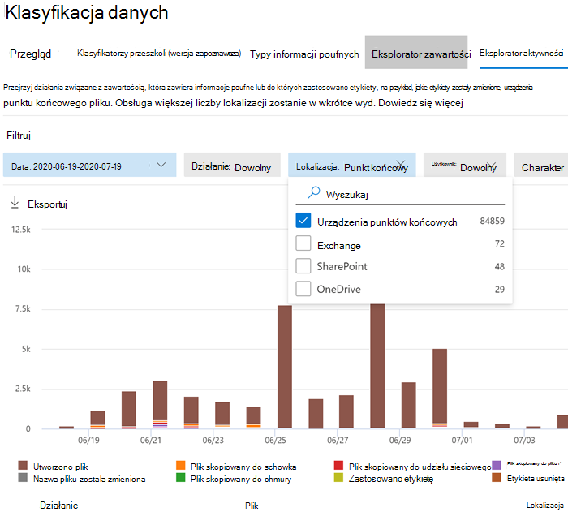

# Wprowadzenie do rozszerzenia Microsoft Purview

Użyj tych procedur, aby wdrożyć rozszerzenie Microsoft Purview.

## Przed rozpoczęciem

Aby korzystać z rozszerzenia Microsoft Purview, urządzenie musi zostać dołączone do punktu końcowego DLP. Przejrzyj te artykuły, jeśli jesteś nowym użytkownikem DLP lub punktu końcowego DLP

- [Dowiedz się więcej o rozszerzeniu Microsoft Purview](dlp-chrome-learn-about.md)
- [Dowiedz się więcej o Ochrona przed utratą danych w Microsoft Purview](dlp-learn-about-dlp.md)
- [Twórz, testuj i dostrajaj zasady DLP](create-test-tune-dlp-policy.md)
- [Twórz zasady DLP na podstawie szablonu](create-a-dlp-policy-from-a-template.md)
- [Dowiedz się więcej o zapobieganiu utracie danych punktu końcowego](endpoint-dlp-learn-about.md)
- [Wprowadzenie do ochrony przed utratą danych punktu końcowego](endpoint-dlp-getting-started.md)
- [Narzędzia i metody dołączania dla urządzeń Windows 10](device-onboarding-overview.md)
- [Konfiguruj ustawienia serwera proxy urządzenia i połączenia internetowego dla usługi Information Protection](device-onboarding-configure-proxy.md#configure-device-proxy-and-internet-connection-settings-for-information-protection)
- [Korzystanie z ochrony przed utratą danych punktu końcowego](endpoint-dlp-using.md)

### Licencjonowanie jednostek SKU/subskrypcji

Przed rozpoczęciem należy potwierdzić [subskrypcję platformy Microsoft 365](https://www.microsoft.com/microsoft-365/compare-microsoft-365-enterprise-plans?rtc=1) i wszelkie dodatki. Aby uzyskać dostęp do funkcji DLP punktu końcowego i korzystać z nich, musisz mieć jedną z tych subskrypcji lub dodatków.

- Microsoft 365 E5
- Microsoft 365 A5 (EDU)
- zgodność Microsoft 365 E5
- zgodność Microsoft 365 A5
- Microsoft 365 E5 ochrona informacji i ład
- Microsoft 365 A5 ochrony informacji i ładu

Aby uzyskać szczegółowe wskazówki dotyczące licencjonowania, zobacz [Wskazówki dotyczące licencjonowania platformy Microsoft 365 dotyczące zgodności & zabezpieczeń](/office365/servicedescriptions/microsoft-365-service-descriptions/microsoft-365-tenantlevel-services-licensing-guidance/microsoft-365-security-compliance-licensing-guidance#information-protection).

- Organizacja musi mieć licencję na DLP punktu końcowego
- Urządzenia muszą działać Windows 10 kompilacji x64 1809 lub nowszej.
- Urządzenie musi mieć wersję klienta ochrony przed złośliwym kodem w wersji 4.18.2202.x lub nowszej. Sprawdź bieżącą wersję, otwierając **aplikację Zabezpieczenia Windows**, wybierz ikonę **Ustawienia**, a następnie wybierz pozycję **Informacje**.

### Uprawnienia

Dane z punktu końcowego DLP można wyświetlić w [Eksploratorze działań](data-classification-activity-explorer.md). Istnieje siedem ról, które udzielają uprawnień do Eksploratora działań. Konto używane do uzyskiwania dostępu do danych musi być członkiem dowolnej z nich.

- Administrator globalny
- Administrator zgodności
- Administrator zabezpieczeń
- Administrator danych dot. zgodności
- Czytelnik globalny
- Czytelnik zabezpieczeń
- Czytelnik raportów

#### Role i grupy ról w wersji zapoznawczej

W wersji zapoznawczej dostępne są role i grupy ról, które można przetestować, aby dostosować mechanizmy kontroli dostępu.

Oto lista odpowiednich ról w wersji zapoznawczej. Aby dowiedzieć się więcej na ich temat, zobacz [Role w Centrum zgodności & zabezpieczeń](../security/office-365-security/permissions-in-the-security-and-compliance-center.md#roles-in-the-security--compliance-center)

- Information Protection Administracja
- analityk Information Protection
- badacz Information Protection
- czytelnik Information Protection

Oto lista odpowiednich grup ról, które są w wersji zapoznawczej. Aby dowiedzieć się więcej na temat programu , zobacz [Grupy ról w Centrum zgodności & zabezpieczeń](../security/office-365-security/permissions-in-the-security-and-compliance-center.md#role-groups-in-the-security--compliance-center)

- Information Protection
- administratorzy Information Protection
- analitycy Information Protection
- Information Protection śledczy
- czytniki Information Protection

### Ogólny przepływ pracy instalacji

Wdrażanie rozszerzenia jest procesem wielofazowym. Możesz zdecydować się na instalację na jednej maszynie jednocześnie lub użyć usługi Microsoft Endpoint Manager lub zasady grupy w przypadku wdrożeń w całej organizacji.

1. [Przygotowywanie urządzeń](#prepare-your-devices).
2. [Konfiguracja podstawowa — samoobsługowe hostowanie jednokrotne](#basic-setup-single-machine-selfhost)
3. [Wdrażanie przy użyciu usługi Microsoft Endpoint Manager](#deploy-using-microsoft-endpoint-manager)
4. [Wdrażanie przy użyciu zasady grupy](#deploy-using-group-policy)
5. [Testowanie rozszerzenia](#test-the-extension)
6. [Wyświetlanie alertów DLP w przeglądarce Chrome przy użyciu pulpitu nawigacyjnego zarządzania alertami](#use-the-alerts-management-dashboard-to-viewing-chrome-dlp-alerts)
7. [Wyświetlanie danych DLP przeglądarki Chrome w Eksploratorze działań](#viewing-chrome-dlp-data-in-activity-explorer)

### Przygotowywanie infrastruktury

Jeśli wdrażasz rozszerzenie na wszystkich monitorowanych urządzeniach Windows 10, należy usunąć przeglądarkę Google Chrome z listy niedozwolonych aplikacji i nieobjętych przeglądarek. Aby uzyskać więcej informacji, zobacz [Niedozwolone przeglądarki](dlp-configure-endpoint-settings.md#unallowed-browsers). Jeśli wdrażasz ją tylko na kilku urządzeniach, możesz pozostawić przeglądarkę Chrome na listach niedozwolonych lub niezamówionych aplikacji. Rozszerzenie pomija ograniczenia obu list dla tych komputerów, na których jest zainstalowany.

### Przygotowywanie urządzeń

1. Procedury opisane w tych tematach umożliwiają dołączanie urządzeń:
    1. [Wprowadzenie do ochrony przed utratą danych punktu końcowego](endpoint-dlp-getting-started.md)
    1. [Dołączanie urządzeń Windows 10 i Windows 11](device-onboarding-overview.md)
    1. [Konfiguruj ustawienia serwera proxy urządzenia i połączenia internetowego dla usługi Information Protection](device-onboarding-configure-proxy.md#configure-device-proxy-and-internet-connection-settings-for-information-protection)

### Konfiguracja podstawowa — samoobsługowe hostowanie jednokrotne

Jest to zalecana metoda.

1. Przejdź do obszaru [Rozszerzenie usługi Microsoft Purview — Sklep internetowy Chrome (google.com)](https://chrome.google.com/webstore/detail/microsoft-compliance-exte/echcggldkblhodogklpincgchnpgcdco).

2. Zainstaluj rozszerzenie, korzystając z instrukcji na stronie sklepu internetowego Chrome.

### Wdrażanie przy użyciu usługi Microsoft Endpoint Manager

Użyj tej metody konfiguracji dla wdrożeń w całej organizacji.

#### Microsoft Endpoint Manager Wymuszanie kroków instalacji

Przed dodaniem rozszerzenia do listy rozszerzeń zainstalowanych na siłę ważne jest, aby pozyskiwać program Chrome ADMX. Kroki tego procesu w usłudze Microsoft Endpoint Manager są udokumentowane przez firmę Google: [Zarządzanie przeglądarką Chrome za pomocą Microsoft Intune — Google Chrome Enterprise Help](https://support.google.com/chrome/a/answer/9102677?hl=en#zippy=%2Cstep-ingest-the-chrome-admx-file-into-intune).

 Po pozyskaniu zestawu ADMX można wykonać poniższe kroki, aby utworzyć profil konfiguracji dla tego rozszerzenia.

1. Zaloguj się do Centrum Endpoint Manager Administracja Firmy Microsoft (https://endpoint.microsoft.com).

2. Przejdź do pozycji Profile konfiguracji.

3. Wybierz pozycję **Utwórz profil**.

4. Wybierz **Windows 10** jako platformę.

5. Wybierz pozycję **Niestandardowy** jako typ profilu.

6. Wybierz kartę **Ustawienia** .

7. Wybierz opcję **Dodaj**.

8. Wprowadź następujące informacje o zasadach.

    Identyfikator OMA-URI: `./Device/Vendor/MSFT/Policy/Config/Chrome~Policy~googlechrome~Extensions/ExtensionInstallForcelist` 
    Typ danych: `String` 
    Wartość: `<enabled/><data id="ExtensionInstallForcelistDesc" value="1&#xF000; echcggldkblhodogklpincgchnpgcdco;https://clients2.google.com/service/update2/crx"/>`

9. Kliknij pozycję Utwórz.

### Wdrażanie przy użyciu zasady grupy

Jeśli nie chcesz używać usługi Microsoft Endpoint Manager, możesz użyć zasad grupy, aby wdrożyć rozszerzenie w całej organizacji.

#### Dodawanie rozszerzenia chrome do listy ForceInstall

1. W edytorze zarządzania zasady grupy przejdź do jednostki organizacyjnej.

2. Rozwiń następującą ścieżkę **Zasady** >  **konfiguracji** >  komputera/użytkownika **Szablony administracyjne Klasyczne szablony** >  administracyjne Google **Chrome** > **Extensions** >  > . Ta ścieżka może się różnić w zależności od konfiguracji.

3. Wybierz **pozycję Konfiguruj listę rozszerzeń zainstalowanych na siłę**.

4. Kliknij prawym przyciskiem myszy i wybierz pozycję **Edytuj**.

5. Wybierz pozycję **Włączone**.

6. Wybierz pozycję **Pokaż**.

7. W obszarze **Wartość** dodaj następujący wpis: `echcggldkblhodogklpincgchnpgcdco;https://clients2.google.com/service/update2/crx`

8. Wybierz przycisk **OK** , a następnie **pozycję Zastosuj**.

### Testowanie rozszerzenia

#### Przekazywanie do usługi w chmurze lub dostęp przez niedozwolone przeglądarki Ruch wychodzący w chmurze

1. Utwórz lub pobierz poufny element i spróbuj przekazać plik do jednej z domen usługi z ograniczeniami w organizacji. Dane poufne muszą być zgodne z jednym z naszych [wbudowanych typów informacji poufnych](sensitive-information-type-entity-definitions.md) lub jednym z typów informacji poufnych organizacji. Na testowym urządzeniu powinno zostać wyświetlone wyskakujące powiadomienie DLP pokazujące, że ta akcja nie jest dozwolona, gdy plik jest otwarty.

#### Testowanie innych scenariuszy DLP w przeglądarce Chrome

Po usunięciu programu Chrome z listy niedozwolonych przeglądarek/aplikacji możesz przetestować poniższe scenariusze, aby potwierdzić, że zachowanie spełnia wymagania organizacji:

- Kopiowanie danych z elementu poufnego do innego dokumentu przy użyciu Schowka
  - Aby przetestować, otwórz plik chroniony przed kopiowaniem do akcji schowka w przeglądarce Chrome i spróbuj skopiować dane z pliku.
  - Oczekiwany wynik: Wyskakujące powiadomienie DLP pokazujące, że ta akcja jest niedozwolona, gdy plik jest otwarty.
- Drukowanie dokumentu
  - Aby przetestować, otwórz plik chroniony przed akcjami drukowania w przeglądarce Chrome i spróbuj wydrukować plik.
  - Oczekiwany wynik: Wyskakujące powiadomienie DLP pokazujące, że ta akcja jest niedozwolona, gdy plik jest otwarty.
- Kopiowanie na nośnik wymienny USB
  - Aby przetestować, spróbuj zapisać plik w magazynie nośników możliwych do usunięcia.
  - Oczekiwany wynik: Wyskakujące powiadomienie DLP pokazujące, że ta akcja jest niedozwolona, gdy plik jest otwarty.
- Kopiowanie do udziału sieciowego
  - Aby przetestować, spróbuj zapisać plik w udziale sieciowym.
  - Oczekiwany wynik: Wyskakujące powiadomienie DLP pokazujące, że ta akcja jest niedozwolona, gdy plik jest otwarty.

### Wyświetlanie alertów DLP w przeglądarce Chrome przy użyciu pulpitu nawigacyjnego zarządzania alertami

1. Otwórz stronę **Zapobieganie utracie danych** w <a href="https://go.microsoft.com/fwlink/p/?linkid=2077149" target="_blank">portal zgodności Microsoft Purview</a> i wybierz pozycję **Alerty**.

2. Zapoznaj się z procedurami w temacie [How to configure and view alerts for your DLP policies to view alerts for your Endpoint DLP policies (Jak skonfigurować i wyświetlić alerty dla zasad DLP](dlp-configure-view-alerts-policies.md) punktu końcowego).

### Wyświetlanie danych DLP przeglądarki Chrome w Eksploratorze działań

1. Otwórz [stronę Klasyfikacja danych](https://compliance.microsoft.com/dataclassification?viewid=overview) dla domeny w <a href="https://go.microsoft.com/fwlink/p/?linkid=2077149" target="_blank">portal zgodności Microsoft Purview</a> i wybierz pozycję **Eksplorator działań**.

2. Zapoznaj się z procedurami w temacie [Wprowadzenie do Eksploratora działań](data-classification-activity-explorer.md) , aby uzyskać dostęp do wszystkich danych dla urządzeń punktu końcowego i filtrować je.

   > [!div class="mx-imgBorder"]
   > 

### Znane problemy i ograniczenia

1. Tryb Incognito nie jest obsługiwany i musi być wyłączony.

## Następne kroki

Teraz, gdy masz dołączone urządzenia i możesz wyświetlać dane aktywności w Eksploratorze działań, możesz przejść do następnego kroku, w którym utworzysz zasady DLP, które chronią poufne elementy.

- [Korzystanie z ochrony przed utratą danych punktu końcowego](endpoint-dlp-using.md)

## Zobacz też

- [Dowiedz się więcej o ochronie przed utratą danych punktu końcowego](endpoint-dlp-learn-about.md)
- [Korzystanie z ochrony przed utratą danych punktu końcowego](endpoint-dlp-using.md)
- [Dowiedz się więcej o ochronie przed utratą danych](dlp-learn-about-dlp.md)
- [Twórz, testuj i dostrajaj zasady DLP](create-test-tune-dlp-policy.md)
- [Wprowadzenie do Eksploratora działań](data-classification-activity-explorer.md)
- [Ochrona punktu końcowego w usłudze Microsoft Defender](/windows/security/threat-protection/)
- [Narzędzia i metody dołączania maszyn Windows 10](/windows/security/threat-protection/microsoft-defender-atp/configure-endpoints)
- [Subskrypcja platformy Microsoft 365](https://www.microsoft.com/microsoft-365/compare-microsoft-365-enterprise-plans?rtc=1)
- [urządzenia przyłączone Azure AD](/azure/active-directory/devices/concept-azure-ad-join)
- [Pobierz nową przeglądarkę Microsoft Edge na podstawie Chromium](https://support.microsoft.com/help/4501095/download-the-new-microsoft-edge-based-on-chromium)
