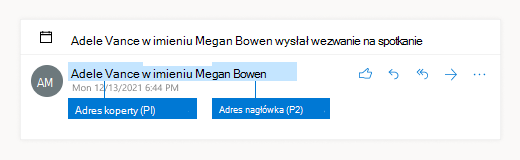

# <a name="dlp-policy-conditions-exceptions-and-actions"></a>Warunki, wyjątki i akcje zasad DLP

[!include[Purview banner](../includes/purview-rebrand-banner.md)]

Warunki i wyjątki w zasadach DLP identyfikują poufne elementy, do których są stosowane zasady. Akcje definiują, co się dzieje w wyniku spełnienia warunku wyjątku.

- Warunki definiują, co należy uwzględnić
- Wyjątki definiują, co należy wykluczyć.
- Akcje definiują, co się dzieje w wyniku spełnienia warunku lub wyjątku

Większość warunków i wyjątków ma jedną właściwość, która obsługuje co najmniej jedną wartość. Jeśli na przykład zasady DLP są stosowane do Exchange wiadomości e-mail, warunek **Nadawca** wymaga nadawcy wiadomości. Niektóre warunki mają dwie właściwości. Na przykład **nagłówek komunikatu A zawiera dowolny z tych warunków wyrazów** wymaga jednej właściwości do określenia pola nagłówka komunikatu, a drugiej właściwości określającej tekst do wyszukania w polu nagłówka. Niektóre warunki lub wyjątki nie mają żadnych właściwości. Na przykład **warunek Załącznik jest chroniony hasłem** po prostu szuka załączników w wiadomościach chronionych hasłem.

Akcje zwykle wymagają dodatkowych właściwości. Na przykład gdy reguła zasad DLP przekierowuje komunikat, należy określić miejsce przekierowania komunikatu.
<!-- Some actions have multiple properties that are available or required. For example, when the rule adds a header field to the message header, you need to specify both the name and value of the header. When the rule adds a disclaimer to messages, you need to specify the disclaimer text, but you can also specify where to insert the text, or what to do if the disclaimer can't be added to the message. Typically, you can configure multiple actions in a rule, but some actions are exclusive. For example, one rule can't reject and redirect the same message.-->

## <a name="conditions-and-exceptions-for-dlp-policies"></a>Warunki i wyjątki dotyczące zasad DLP

Tabele w poniższych sekcjach opisują warunki i wyjątki dostępne w programie DLP.

- [Nadawców](#senders)
- [Adresatów](#recipients)
- [Temat lub treść wiadomości](#message-subject-or-body)
- [Załączniki](#attachments)
- [Nagłówki komunikatów](#message-headers)
- [Właściwości komunikatu](#message-properties)

### <a name="senders"></a>Nadawców

Jeśli używasz adresu nadawcy jako warunku lub wyjątku, rzeczywiste pole, w którym jest wyszukiwana wartość, różni się w zależności od skonfigurowanej lokalizacji adresu nadawcy. Domyślnie reguły DLP używają adresu nagłówka jako adresu nadawcy.



Na poziomie dzierżawy można skonfigurować lokalizację adresu nadawcy, która ma być używana we wszystkich regułach, chyba że zostanie zastąpiona przez jedną regułę. Aby ustawić konfigurację zasad DLP dzierżawy w celu oceny adresu nadawcy z koperty we wszystkich regułach, można uruchomić następujące polecenie:

```PowerShell
Set-PolicyConfig -SenderAddressLocation Envelope
```

Aby skonfigurować lokalizację adresu nadawcy na poziomie reguły DLP, parametr to *SenderAddressLocation*. Dostępne wartości to:

- **Nagłówek**: sprawdź tylko nadawców w nagłówkach wiadomości (na przykład w polach **Od**, **Nadawca** lub **Odpowiedz do** ). Jest to wartość domyślna.

- **Koperta**: sprawdź tylko nadawców z koperty wiadomości (wartość **MAIL FROM** użyta w transmisji SMTP, która jest zwykle przechowywana w polu **Return-Path** ).

- **Nagłówek lub koperta** (`HeaderOrEnvelope`) Sprawdź nadawców w nagłówku wiadomości i kopercie wiadomości.

|warunek lub wyjątek w DLP|parametry warunku/wyjątku w programie Microsoft 365 programu PowerShell|typ właściwości|Opis|
|---|---|---|---|
|Nadawca jest|warunek: *Od* <br/><br/> wyjątek: *ExceptIfFromom*|Adresy|Wiadomości wysyłane przez określone skrzynki pocztowe, użytkowników poczty, kontakty poczty lub grupy Microsoft 365 w organizacji.|
|Nadawca jest członkiem |*FromMemberOf* <br/><br/> *ExceptIfFromMemberOf*|Adresy|Wiadomości wysyłane przez członka określonej grupy dystrybucyjnej, grupy zabezpieczeń z obsługą poczty lub grupy Microsoft 365.|
|Adres IP nadawcy jest|warunek: *SenderIPRanges*<br/><br/> wyjątek: *ExceptIfSenderIPRanges*|IpAddressRanges|Komunikaty, w których adres IP nadawcy jest zgodny z określonym adresem IP lub mieści się w określonym zakresie adresów IP.|
|Adres nadawcy zawiera wyrazy|warunek: *FromAddressContainsWords* <br/><br/> wyjątek: *ExceptIfFromAddressContainsWords*|Słowy|Wiadomości zawierające określone wyrazy na adresie e-mail nadawcy.|
|Adres nadawcy pasuje do wzorców|warunek: *FromAddressMatchesPatterns* <br/><br/> wyjątek: *ExceptFromAddressMatchesPatterns*|Wzorców|Wiadomości, w których adres e-mail nadawcy zawiera wzorce tekstowe zgodne z określonymi wyrażeniami regularnymi.|
|Domena nadawcy jest|warunek: *SenderDomainIs* <br/><br/> wyjątek: *ExceptIfSenderDomainIs*|Nazwa_domeny|Wiadomości, w których domena adresu e-mail nadawcy jest zgodna z określoną wartością. Jeśli musisz znaleźć domeny nadawcy *zawierające* określoną domenę (na przykład dowolną poddomenę domeny), użyj warunku **Dopasowania adresu nadawcy** (*FromAddressMatchesPatterns*) i określ domenę przy użyciu składni: "\.domaincom\.$".|
|Zakres nadawcy|warunek: *FromScope* <br/><br/> wyjątek: *ExceptIfFromScope*|UserScopeFromom|Komunikaty wysyłane przez nadawców wewnętrznych lub zewnętrznych.|
|Określone właściwości nadawcy obejmują dowolne z tych wyrazów|warunek: *SenderADAttributeContainsWords* <br/><br/> wyjątek: *ExceptIfSenderADAttributeContainsWords*|Pierwsza właściwość: `ADAttribute` <br/><br/> Druga właściwość: `Words`|Komunikaty, w których określony atrybut usługi Active Directory nadawcy zawiera dowolne z określonych słów.|
|Określone właściwości nadawcy są zgodne z tymi wzorcami tekstowymi|warunek: *SenderADAttributeMatchesPatterns* <br/><br/> wyjątek: *ExceptIfSenderADAttributeMatchesPatterns*|Pierwsza właściwość: `ADAttribute` <br/><br/> Druga właściwość: `Patterns`|Komunikaty, w których określony atrybut usługi Active Directory nadawcy zawiera wzorce tekstowe zgodne z określonymi wyrażeniami regularnymi.|

### <a name="recipients"></a>Adresatów

|warunek lub wyjątek w DLP|parametry warunku/wyjątku w programie Microsoft 365 programu PowerShell|typ właściwości|Opis|
|---|---|---|---|
|Adresat jest|warunek: *SentTo* <br/><br/> wyjątek: *ExceptIfSentTo*|Adresy|Wiadomości, w których jednym z adresatów jest określona skrzynka pocztowa, użytkownik poczty lub kontakt pocztowy w organizacji. Adresaci mogą znajdować się w polach **Do**, **DW** lub **BCC** wiadomości.|
|Domena adresata jest|warunek: *RecipientDomainIs* <br/><br/> wyjątek: *ExceptIfRecipientDomainIs*|Nazwa_domeny|Wiadomości, w których domena adresu e-mail adresata jest zgodna z określoną wartością.|
|Adres odbiorcy zawiera wyrazy|warunek: *AnyOfRecipientAddressContainsWords* <br/><br/> wyjątek: *ExceptIfAnyOfRecipientAddressContainsWords*|Słowy|Wiadomości zawierające określone wyrazy na adres e-mail adresata. <br/><br/>**Uwaga**: ten warunek nie uwzględnia komunikatów wysyłanych do adresów proxy adresatów. Pasuje tylko do wiadomości wysyłanych na podstawowy adres e-mail adresata.|
|Adres odbiorcy pasuje do wzorców|warunek: *AnyOfRecipientAddressMatchesPatterns* <br/><br/> wyjątek: *ExceptIfAnyOfRecipientAddressMatchesPatterns*|Wzorców|Wiadomości, w których adres e-mail adresata zawiera wzorce tekstowe zgodne z określonymi wyrażeniami regularnymi. <br/><br/> **Uwaga**: ten warunek nie uwzględnia komunikatów wysyłanych do adresów proxy adresatów. Pasuje tylko do wiadomości wysyłanych na podstawowy adres e-mail adresata.|
|Wysłane do członka|warunek: *SentToMemberOf* <br/><br/> wyjątek: *ExceptIfSentToMemberOf*|Adresy|Wiadomości zawierające adresatów będących członkami określonej grupy dystrybucyjnej, grupy zabezpieczeń z obsługą poczty lub grupy Microsoft 365. Grupa może znajdować się w polach **Do**, **DW** lub **Bcc** komunikatu.|
|Określone właściwości adresata obejmują dowolne z tych wyrazów |*AdresatADAttributeContainsWords* <br/><br/> *ExceptIfRecipientADAttributeContainsWords*|Pierwsza właściwość: `ADAttribute` <br/><br/> Druga właściwość: `Words`|Komunikaty, w których określony atrybut usługi Active Directory adresata zawiera dowolne z określonych wyrazów. <br/><br/> Należy pamiętać, że atrybut **Country** wymaga dwuliterowej wartości kodu kraju (na przykład DE dla Niemiec).|
|Określone właściwości adresata są zgodne z tymi wzorcami tekstowymi |*AdresatADAttributeMatchesPatterns* <br/><br/> *ExceptIfRecipientADAttributeMatchesPatterns*|Pierwsza właściwość: `ADAttribute` <br/><br/> Druga właściwość: `Patterns`|Komunikaty, w których określony atrybut usługi Active Directory adresata zawiera wzorce tekstowe zgodne z określonymi wyrażeniami regularnymi.|

### <a name="message-subject-or-body"></a>Temat lub treść wiadomości

|warunek lub wyjątek w DLP|parametry warunku/wyjątku w programie Microsoft 365 programu PowerShell|typ właściwości|Opis|
|---|---|---|---|
|Temat zawiera wyrazy lub frazy|warunek: *SubjectContainsWords* <br/> wyjątek: *ExceptIf SubjectContainsWords*|Słowy|Komunikaty, które mają określone wyrazy w polu Temat.|
|Temat pasuje do wzorców|warunek: *SubjectMatchesPatterns* <br/> wyjątek: *ExceptIf SubjectMatchesPatterns*|Wzorców|Komunikaty, w których pole Temat zawiera wzorce tekstowe zgodne z określonymi wyrażeniami regularnymi.|
|Zawartość zawiera|warunek: *ContentContainsSensitiveInformation* <br/> exception *ExceptIfContentContainsSensitiveInformation*|SensitiveInformationTypes|Komunikaty lub dokumenty zawierające poufne informacje zdefiniowane przez zasady ochrony przed utratą danych (DLP) w usłudze Microsoft Purview.|
|Temat lub treść pasują do wzorca|warunek: *SubjectOrBodyMatchesPatterns* <br/> wyjątek: *ExceptIfSubjectOrBodyMatchesPatterns*|Wzorców|Komunikaty, w których pole tematu lub treść wiadomości zawierają wzorce tekstowe zgodne z określonymi wyrażeniami regularnymi.|
|Temat lub treść zawiera wyrazy|warunek: *SubjectOrBodyContainsWords* <br/> wyjątek: *ExceptIfSubjectOrBodyContainsWords*|Słowy|Komunikaty z określonymi wyrazami w polu tematu lub treści komunikatu|
|

### <a name="attachments"></a>Załączniki

|warunek lub wyjątek w DLP|parametry warunku/wyjątku w programie Microsoft 365 programu PowerShell|typ właściwości|Opis|
|---|---|---|---|
|Załącznik jest chroniony hasłem|warunek: *DocumentIsPasswordProtected* <br/><br/> wyjątek: *ExceptIfDocumentIsPasswordProtected*|Brak|Komunikaty, w których załącznik jest chroniony hasłem (dlatego nie można go skanować). Wykrywanie haseł działa tylko w przypadku dokumentów Office, plików .zip i plików 7z.|
|Rozszerzenie pliku załącznika to|warunek: *ContentExtensionMatchesWords* <br/><br/> wyjątek: *ExceptIfContentExtensionMatchesWords*|Słowy|Komunikaty, w których rozszerzenie pliku załącznika pasuje do dowolnego z określonych wyrazów.|
|Nie można skanować zawartości załącznika wiadomości e-mail|warunek: *DocumentIsUnsupported* <br/><br/>wyjątek: *ExceptIf DocumentIsUnsupported*|nie dotyczy|Komunikaty, w których załącznik nie jest natywnie rozpoznawany przez Exchange Online.|
|Zawartość załącznika wiadomości e-mail nie została ukończona podczas skanowania|warunek: *ProcessingLimitExceeded* <br/><br/> wyjątek: *ExceptIfProcessingLimitExceeded*|nie dotyczy|Komunikaty, w których aparat reguł nie mógł ukończyć skanowania załączników. Ten warunek służy do tworzenia reguł, które współpracują ze sobą w celu identyfikowania i przetwarzania komunikatów, w których nie można w pełni skanować zawartości.|
|Nazwa dokumentu zawiera wyrazy|warunek: *DocumentNameMatchesWords* <br/><br/> wyjątek: *ExceptIfDocumentNameMatchesWords*|Słowy|Komunikaty, w których nazwa pliku załącznika jest zgodna z dowolnym z określonych wyrazów.|
|Nazwa dokumentu jest zgodna z wzorcami|warunek: *DocumentNameMatchesPatterns* <br/><br/> wyjątek: *ExceptIfDocumentNameMatchesPatterns*|Wzorców|Komunikaty, w których nazwa pliku załącznika zawiera wzorce tekstowe zgodne z określonymi wyrażeniami regularnymi.|
|Właściwość dokumentu jest|warunek: *ContentPropertyContainsWords* <br/><br/> wyjątek: *ExceptIfContentPropertyContainsWords*|Słowy|Komunikaty lub dokumenty, w których rozszerzenie pliku załącznika pasuje do dowolnego z określonych wyrazów.|
|Rozmiar dokumentu jest równy lub większy niż|warunek: *DocumentSizeOver* <br/><br/> wyjątek: *ExceptIfDocumentSizeOver*|Rozmiar|Komunikaty, w których dowolny załącznik jest większy lub równy określonej wartości.|
|Zawartość załącznika zawiera dowolne z tych słów|warunek: *DocumentContainsWords* <br/><br/> wyjątek: *ExceptIfDocumentContainsWords*|`Words`|Komunikaty, w których załącznik zawiera określone wyrazy.|
|Zawartość załączników pasuje do tych wzorców tekstowych|warunek: *DocumentMatchesPatterns* <br/><br/> wyjątek: *ExceptIfDocumentMatchesPatterns*|`Patterns`|Komunikaty, w których załącznik zawiera wzorce tekstowe zgodne z określonymi wyrażeniami regularnymi.|

### <a name="message-headers"></a>Nagłówki komunikatów

|warunek lub wyjątek w DLP|parametry warunku/wyjątku w programie Microsoft 365 programu PowerShell|typ właściwości|Opis|
|---|---|---|---|
|Nagłówek zawiera wyrazy lub frazy|warunek: *HeaderContainsWords* <br/><br/> wyjątek: *ExceptIfHeaderContainsWords*|Tabela skrótów|Komunikaty zawierające określone pole nagłówka i wartość tego pola nagłówka zawierają określone wyrazy.|
|Nagłówek pasuje do wzorców|warunek: *HeaderMatchesPatterns* <br/><br/> wyjątek: *ExceptIfHeaderMatchesPatterns*|Tabela skrótów|Komunikaty zawierające określone pole nagłówka i wartość tego pola nagłówka zawierają określone wyrażenia regularne.|

### <a name="message-properties"></a>Właściwości komunikatu

|warunek lub wyjątek w DLP|parametry warunku/wyjątku w programie Microsoft 365 programu PowerShell|typ właściwości|Opis|
|---|---|---|---|
|Z ważnością|warunek: *WithImportance* <br/><br/> wyjątek: *ExceptIfWithImportance*|Znaczenie|Komunikaty oznaczone określonym poziomem ważności.|
|Zestaw znaków zawartości zawiera wyrazy|warunek: *ContentCharacterSetContainsWords* <br/><br/> *ExceptIfContentCharacterSetContainsWords*|Zestawy znaków|Komunikaty, które mają dowolną z określonych nazw zestawów znaków.|
|Ma przesłonięcia nadawcy|warunek: *HasSenderOverride* <br/><br/> wyjątek: *ExceptIfHasSenderOverride*|nie dotyczy|Komunikaty, w których nadawca zdecydował się zastąpić zasady ochrony przed utratą danych (DLP). Aby uzyskać więcej informacji na temat zasad DLP, zobacz [Dowiedz się więcej o zapobieganiu utracie danych](./dlp-learn-about-dlp.md)|
|Dopasowania typu komunikatu|warunek: *MessageTypeMatches* <br/><br/> wyjątek: *ExceptIfMessageTypeMatches*|Messagetype|Komunikaty określonego typu. **Uwaga**: Dostępne typy wiadomości to Automatyczna odpowiedź, Automatyczne przekazywanie, Szyfrowane (S/MIME), Kalendarze, Kontrolowane uprawnienia (zarządzanie prawami), Poczta głosowa, Podpisane, Potwierdzenie odczytu i Żądanie zatwierdzenia. |
|Rozmiar komunikatu jest większy lub równy|warunek: *MessageSizeOver* <br/><br/> wyjątek: *ExceptIfMessageSizeOver*|`Size`|Komunikaty, w których całkowity rozmiar (komunikat plus załączniki) jest większy lub równy określonej wartości. **Uwaga**: Limity rozmiaru wiadomości dla skrzynek pocztowych są oceniane przed regułami przepływu poczty. Wiadomość, która jest zbyt duża dla skrzynki pocztowej, zostanie odrzucona, zanim reguła z tym warunkiem będzie mogła działać na wiadomości.|

## <a name="actions-for-dlp-policies"></a>Akcje dla zasad DLP

W tej tabeli opisano akcje dostępne w programie DLP.

|akcja w programie DLP|parametry akcji w programie Microsoft 365 PowerShell|typ właściwości|Opis|
|---|---|---|---|
|Ustaw nagłówek|SetHeader|Pierwsza właściwość: *Nazwa nagłówka* <br/><br/> Druga właściwość: *Wartość nagłówka*|Parametr SetHeader określa akcję reguły DLP, która dodaje lub modyfikuje pole nagłówka i wartość w nagłówku komunikatu. Ten parametr używa składni "HeaderName:HeaderValue". Można określić wiele par nazw nagłówków i wartości rozdzielonych przecinkami|
|Usuń nagłówek|RemoveHeader|Pierwsza właściwość: *MessageHeaderField*<br/><br/> Druga właściwość: *String*|Parametr RemoveHeader określa akcję reguły DLP, która usuwa pole nagłówka z nagłówka komunikatu. Ten parametr używa składni "HeaderName" lub "HeaderName:HeaderValue". Można określić wiele nazw nagłówków lub nazw nagłówków i par wartości rozdzielonych przecinkami|
|Przekierowywanie komunikatu do określonych użytkowników|*RedirectMessageTo*|Adresy|Przekierowuje wiadomość do określonych adresatów. Wiadomość nie jest dostarczana do oryginalnych adresatów i żadne powiadomienie nie jest wysyłane do nadawcy ani do oryginalnych adresatów.|
|Przekazywanie komunikatu do zatwierdzenia do menedżera nadawcy|Umiarkowane|Pierwsza właściwość: *ModerateMessageByManager*<br/><br/> Druga właściwość: *Wartość logiczna*|Parametr Moderate określa akcję reguły DLP, która wysyła wiadomość e-mail do moderatora. Ten parametr używa składni: @{ModerateMessageByManager = <$true \|$false>;|
|Przekazywanie komunikatu do zatwierdzenia do określonych osób zatwierdzających|Umiarkowane|Pierwsza właściwość: *ModerateMessageByUser*<br/><br/>Druga właściwość: *Adresy*|Parametr Moderate określa akcję reguły DLP, która wysyła wiadomość e-mail do moderatora. Ten parametr używa składni: @{ ModerateMessageByUser = @("emailaddress1","emailaddress2",..."emailaddressN")}|
|Dodawanie adresata|AddRecipients|Pierwsza właściwość: *Pole*<br/><br/>Druga właściwość: *Adresy*|Dodaje co najmniej jednego adresata do pola To/Cc/Bcc wiadomości. Ten parametr używa składni: @{<AddToRecipients \<CopyTo \| BlindCopyTo\> = "emailaddress"}|
|Dodawanie menedżera nadawcy jako adresata|AddRecipients|Pierwsza właściwość: *AddedManagerAction*<br/><br/>Druga właściwość: *Pole*|Dodaje menedżera nadawcy do wiadomości jako określony typ adresata (Do, DW, Bcc) lub przekierowuje wiadomość do menedżera nadawcy bez powiadamiania nadawcy lub odbiorcy. Ta akcja działa tylko wtedy, gdy atrybut Menedżera nadawcy jest zdefiniowany w usłudze Active Directory. Ten parametr używa składni: @{AddManagerAsRecipientType = "\<To \| Cc \| Bcc\>"}|
Temat przedpłaty|PreendSubject|Ciąg|Dodaje określony tekst na początku pola Temat wiadomości. Rozważ użycie spacji lub dwukropka (:) jako ostatni znak określonego tekstu, aby odróżnić go od oryginalnego tekstu tematu.<br/><br/>Aby zapobiec dodawaniu tego samego ciągu do komunikatów, które już zawierają tekst w temacie (na przykład odpowiedzi), dodaj wyjątek "Temat zawiera słowa" (ExceptIfSubjectContainsWords) do reguły.|
|Stosowanie zastrzeżenia HTML|ApplyHtmlDisclaimer|Pierwsza właściwość: *Tekst*<br/><br/>Druga właściwość: *Lokalizacja*<br/><br/>Trzecia właściwość: *akcja rezerwowa*|Stosuje określone zastrzeżenie HTML do wymaganej lokalizacji komunikatu.<br/><br/>Ten parametr używa składni: @{ Text = " " ; Lokalizacja = \<Append \| Prepend\>; FallbackAction = \<Wrap \| Ignore \| Reject\> }|
|Usuwanie szyfrowania komunikatów i ochrony praw|RemoveRMSTemplate|nie dotyczy|Usuwa szyfrowanie wiadomości zastosowane w wiadomości e-mail|
|Dostarczanie komunikatu do hostowanej kwarantanny |*Kwarantanna*|nie dotyczy| Ta akcja jest obecnie w **publicznej wersji zapoznawczej**. W tej fazie wiadomości e-mail poddane kwarantannie przez zasady DLP będą pokazywać typ zasad jako ExchangeTransportRule.<br/><br/> Dostarcza komunikat do kwarantanny w ramach operacji EOP. Aby uzyskać więcej informacji, zobacz [Kwarantanna wiadomości e-mail w EOP](/microsoft-365/security/office-365-security/quarantine-email-messages).|
|Modyfikowanie tematu|ModifySubject|PswsHashTable | Usuń tekst z wiersza tematu, który pasuje do określonego wzorca, i zastąp go innym tekstem. Zobacz poniższy przykład. Można: <br/><br/>- **Zastąp** wszystkie dopasowania w temacie tekstem zastępczym <br/><br/>- **Dołącz** , aby usunąć wszystkie dopasowania w temacie i wstawia tekst zastępczy na końcu tematu. <br/><br/>- **Przedstaw** , aby usunąć wszystkie dopasowania i wstawia tekst zastępczy na początku tematu. Zobacz ModifySubject parameter in, /powershell/module/exchange/new-dlpcompliancerule|
