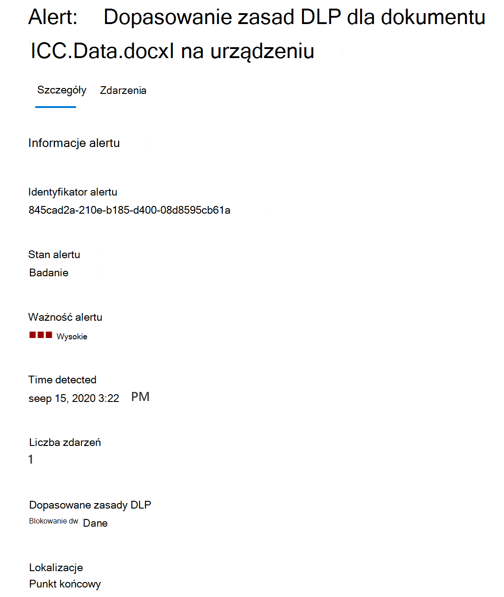

# Informacje na temat ochrony przed utratą danych

Organizacje mają pod swoją kontrolą poufne informacje, takie jak dane finansowe, dane zastrzeżone, numery kart kredytowych, dokumentację opiekę zdrowotnej lub numery PESEL. Aby chronić te poufne dane i zmniejszyć ryzyko, potrzebują sposobu, aby uniemożliwić użytkownikom niewłaściwe udostępnianie tych danych osobom, które nie powinny ich udostępniać. Takie rozwiązanie nazywa się zapobieganiem utracie danych (DLP).

W Microsoft 365 zasady ochrony przed utratą danych należy zaimplementować, definiując i stosując zasady DLP. Dzięki zasadom DLP możesz identyfikować, monitorować i automatycznie chronić poufne elementy w różnych krajach:

- Microsoft 365, takie jak Teams, Exchange, SharePoint i OneDrive
- Office, takich jak Word, Excel i PowerPoint
- Windows 10, Windows 11 i macOS (Catalina 10.15 lub wyższa)
- aplikacje w chmurze inne niż firmy Microsoft
- lokalne udziały plików i lokalne SharePoint.

Microsoft 365 elementów poufnych przy użyciu dogłębnej analizy zawartości, a nie za pomocą prostego skanowania tekstu. Zawartość jest analizowana pod pomocą dopasowań danych podstawowych do słów kluczowych, przez ocenę wyrażeń regularnych, wewnętrzną weryfikację funkcji oraz przez dane pomocnicze zgodne z danymi pomocniczym, które znajdują się w odległości od dopasowania danych podstawowych. Ponadto ponadto zasady DLP wykryją zawartość, która jest taka inna jak w przypadku algorytmów maszynowego uczenia oraz innych metod.

## Zasady DLP są częścią większej Microsoft 365 zgodności

Microsoft 365 DLP to tylko jedno z narzędzi do ochrony Microsoft 365 zgodności, które są pomocne w ochronie poufnych elementów niezależnie od miejsca zamieszkania lub podróży. Należy zrozumieć pozostałe narzędzia w zestawie narzędzi do Microsoft 365 zgodności, sposób ich wzajemnego działania i lepszą współpracę.  Zobacz Microsoft 365 [zgodności,](protect-information.md) aby dowiedzieć się więcej o procesie ochrony informacji.

## Działania zabezpieczające zasad DLP

Microsoft 365 DLP to sposób monitorowania działań, jakie użytkownicy podjmują w spoczynku, poufne elementy podczas transportu lub gdy są one w użyciu poufne, i podjąć działania zabezpieczające. Na przykład w przypadku próby podjęcia przez użytkownika działań zabronionych, takich jak skopiowanie poufnego elementu do lokalizacji bez dokumentacji lub udostępnienie informacji medycznych w wiadomości e-mail bądź w innych warunkach określonych w zasadach, zasady DLP mogą:

- pokaż użytkownikowi podręczną poradę o zasadach z ostrzeżeniem, że być może próbuje on niewłaściwie udostępnić poufny element
- zablokować udostępnianie i za pośrednictwem porady dotyczącej zasad zezwolić użytkownikowi na zastąpienie bloku i przechwytywanie uzasadnienia użytkowników.
- blokowanie udostępniania bez zastępowania opcji
- w przypadku danych w spoczynku, poufne elementy można zablokować i przenieść do bezpiecznej lokalizacji kwarantanny
- w Teams czatach, informacje poufne nie będą wyświetlane

Wszystkie działania monitorowane przez zasady DLP są domyślnie rejestrowane [Microsoft 365](search-the-audit-log-in-security-and-compliance.md) inspekcji i kierowane do [Eksploratora aktywności](data-classification-activity-explorer.md). Jeśli użytkownik wykona akcję spełnia warunki określone przez zasady DLP i masz skonfigurowane alerty, zasady DLP będą zawierały alerty na pulpicie [nawigacyjnym zarządzania alertami](dlp-configure-view-alerts-policies.md) ochrony przed ryzykiem.

## Cykl życia usługi DLP

Implementacja DLP zazwyczaj odbywa się zgodnie z tymi głównymi etapami.

- [Planowanie na rzecz zasad DLP](#plan-for-dlp)
- [Przygotowywanie się na DLP](#prepare-for-dlp)
- [Wdrażanie zasad w środowisku produkcyjnym](#deploy-your-policies-in-production)

<!--ADD DIAGRAM OF THE DLP LIFECYCLE WORK ON WITH MAS-->

### Planowanie na rzecz zasad DLP

Microsoft 365 monitorowanie i ochrona przed DLP są natywne w aplikacjach, z których użytkownicy korzystają codziennie. Pomaga to chronić poufne elementy organizacji przed ryzykowną aktywnością, nawet jeśli użytkownicy nie są do nich dostępni. Jeśli w Twojej organizacji i u użytkowników nie wytyczysz zasad ochrony przed utratą danych, wdrożenie ochrony przed utratą danych może wymagać zmiany procesów biznesowych i dla użytkowników pojawi się zmiana kultury. Jednak po odpowiednim zaplanowaniu, testowaniu i dostrajeniu zasady ochrony przed zagrożeniami dLP chronią poufne elementy, minimalizując przy tym potencjalne zakłócenia w trakcie procesu biznesowego.

**Planowanie technologii na platformie DLP**

Pamiętaj, że technologia DLP może monitorować i chronić dane w spoczynku, dane w użyciu i w ruchu między usługami Microsoft 365, Windows 10, Windows 11 i macOS (Catalina 10.15 lub wyższymi), lokalnymi udziałami plików i lokalnymi SharePoint. Istnieje wpływ planowania na różne lokalizacje, typ danych, które chcesz monitorować i chronić, oraz akcje, które mają być podejmowane w przypadku wystąpienia dopasowania zasad.

**Planowanie procesów biznesowych na potrzeby zasad DLP**

Zasady DLP mogą blokować niedozwolone działania, takie jak nieodpowiednie udostępnianie informacji poufnych za pośrednictwem poczty e-mail. Podczas planowania zasad DLP musisz zidentyfikować procesy biznesowe dotyczące poufnych elementów. Właściciele procesów biznesowych mogą pomóc w zidentyfikowaniu odpowiednich zachowań użytkowników, które powinny być dozwolone i nieodpowiednie dla użytkowników, przed którymi powinny być chronione. Należy zaplanować zasady i wdrożyć je w trybie testowania, a następnie ocenić ich  wpływ za pośrednictwem Eksploratora aktywności, zanim będą one stosowane w bardziej restrykcyjnych trybach.

**Planowanie kultury organizacji w przypadku zasad DLP**

Pomyślna implementacja ochrony przed utratą danych w dużym stopniu zależy od przeszkolenia użytkowników i przyciągnia ich do praktyk ochrony przed utratą danych, ponieważ jest ona w dobrze zaplanowanych i dostosowanych zasadach. Twoi użytkownicy są w dużym stopniu zaangażowani, więc należy także zaplanować dla nich szkolenia. Możesz w sposób strategiczny skorzystać z porad dotyczących zasad, aby podnieść świadomość użytkowników przed zmianą wymuszania zasad z trybu testowania na bardziej restrykcyjne tryby.

<!--For more information on planning for DLP, including suggestions for deployment based on your needs and resources, see [Planning for Microsoft 365 data loss prevention](dlp-plan-for-dlp.md).-->

### Przygotowywanie się na DLP

Zasady DLP można stosować do danych w spoczynku, danych w użyciu oraz do danych w ruchu w lokalizacjach, takich jak:

- Exchange Online-mail
- SharePoint witryny online
- OneDrive konta
- Teams wiadomości czatu i kanałów
- Microsoft Cloud App Security
- Windows 10, Windows 11 i macOS (Catalina 10.15 lub wyższa)
- Repozytoria lokalne
- Witryny usługi PowerBI

Każdy z nich ma inne wymagania wstępne. Poufne elementy w niektórych lokalizacjach, takich Exchange online, można mieć dostęp do zasad ochrony przed zasadami ochrony przed prywatnością, konfigurując dotyczące ich zasady. Inne, takie jak lokalne repozytoria plików, wymagają wdrożenia skanera Azure Information Protection (AIP). Przed aktywowaniem akcji blokowania musisz przygotować środowisko, kodować wersje robocze zasad i przetestować je dokładnie.

### Wdrażanie zasad w środowisku produkcyjnym

#### Projektowanie zasad

Zacznij od zdefiniowania celów kontroli i sposobu ich stosowania we wszystkich odpowiednich obciążeniach pracą. Wersja robocza zasad uajmuje cele. Możesz rozpocząć od jednego obciążenia pracą na raz lub dla wszystkich obciążeń — nie ma jeszcze żadnego wpływu.

#### Implementowanie zasad w trybie testowania

Oceń wpływ kontrolek, implementując je przy użyciu zasad DLP w trybie testowania. Możesz zastosować te zasady do wszystkich obciążeń w trybie testowania, aby uzyskać pełny zakres wyników, ale w razie potrzeby możesz rozpocząć od jednego obciążenia pracą.

#### Monitorowanie wyników i dostosowywanie zasad

Monitoruj wyniki zasad w trybie testowania i dostrajaj je, aby spełniały cele kontroli, zapewniając przy tym niekorzystanie z nieprawidłowych lub niezamierzonych działań użytkowników i zwiększając ich produktywność. Poniżej przedstawiono kilka przykładów do precyzyjnego dostosowania:

- dostosowywanie lokalizacji oraz osób/miejsc, które znajdują się w zakresie lub poza zakresem
- dostosowywanie warunków i wyjątków używanych w celu określenia, czy element i co jest wykonywane za jego pomocą, jest zgodnie z zasadami
- definicje informacji poufnych
- akcje
- poziom ograniczeń
- dodawanie nowych kontrolek
- dodawanie nowych osób
- dodawanie nowych aplikacji z ograniczeniami
- dodawanie nowych witryn z ograniczeniami

#### Włączanie kontroli i dostosowywanie zasad

Gdy zasady spełnią wszystkie Twoje cele, włącz je. W dalszym ciągu monitoruj wyniki działania aplikacji zasad i dostrajaj je zgodnie z potrzebami. 

> [!NOTE]
> Ogólnie rzecz biorąc, zasady są skuteczne po około godzinie od jej włączeniu.

<!--See, LINK TO topic for SLAs for location specific  details-->

## Omówienie konfiguracji zasad DLP

Masz elastyczność w zakresie tworzenia i konfigurowania zasad DLP. Możesz zacząć od wstępnie zdefiniowanego szablonu i utworzyć zasady za pomocą kilku kliknięć lub możesz zaprojektować własny od podstaw. Niezależnie od tego, którą opcję wybierzesz, wszystkie zasady DLP wymagają tych samych informacji od Ciebie.

1. **Wybierz, co chcesz monitorować — Microsoft 365** zawiera wiele wstępnie zdefiniowanych szablonów zasad, które ułatwiają rozpoczynanie pracy, lub tworzenie zasad niestandardowych.
    - Wstępnie zdefiniowany szablon zasad: Dane finansowe, Dane medyczne i medyczne, Dane dotyczące prywatności we wszystkich krajach i regionach.
    - Zasady niestandardowe, które wykorzystują dostępne typy informacji poufnych, etykiety przechowywania i etykiety wrażliwości.
2. **Wybierz lokalizację do monitorowania —** możesz wybrać jedną lub więcej lokalizacji, w których dane dotyczące zasad DLP mają być monitorowane pod celu monitorowania informacji poufnych. Możesz monitorować:

lokalizacja | uwzględnij/wyklucz do|
|---------|---------|
|Exchange-mail| grupy dystrybucyjne|
|SharePoint witryn |witryny |
|OneDrive konta |konta lub grupy dystrybucyjne |
|Teams wiadomości czatu i kanałów |konto lub grupa dystrybucyjna |
|Windows 10, Windows 11 i macOS (Catalina 10.15 lub wyższa) |użytkownik lub grupa |
|Microsoft Cloud App Security |wystąpienie |
|Repozytoria lokalne| ścieżka pliku repozytorium|

3. **Wybierz warunki, które muszą być zgodne z** zasadami, aby zostały zastosowane do elementu — możesz zaakceptować wstępnie skonfigurowane warunki lub zdefiniować warunki niestandardowe. Oto kilka przykładów:

- element zawiera określony rodzaj informacji poufnych, który jest używany w określonym kontekście. Na przykład 95 numerów PESEL, które są przekazywane do adresatów spoza organizacji.
- element ma określoną etykietę wrażliwości
- Element z informacjami poufnymi jest udostępniany wewnętrznie lub zewnętrznie

4. **Wybierz akcję do podjęcia, gdy** warunki zasad zostaną spełnione — te akcje zależą od miejsca, w którym odbywa się działanie.  Oto kilka przykładów:

- SharePoint/Exchange/OneDrive: Blokowanie dostępu do zawartości osobom spoza organizacji. Pokaż użytkownikowi poradę i wyślij do użytkownika wiadomość e-mail z powiadomieniem, że podejmowanie przez nie akcji jest zabronione przez zasady DLP.
- Teams czatów i kanałów: Zablokuj możliwość udostępniania poufnych informacji w czacie lub kanale
- Windows 10, Windows 11 i macOS (Catalina 10.15 lub wyższa) Urządzenia: Inspekcja lub ograniczanie kopiowania poufnego elementu do urządzenia USB, które można usunąć
- Office Aplikacje: Pokaż wyskakujące okienko z powiadomieniem użytkownika, że angażują się oni w ryzykowne zachowanie oraz blokują lub blokują, ale zezwalają na zastępowanie.
- Lokalne udziały plików: przenoszenie pliku z miejsca, w którym jest on przechowywany, do folderu kwarantanny

> [!NOTE]
> Warunki i akcje do podjęcia są zdefiniowane w obiekcie nazywanym regułą.

<!--## Create a DLP policy

All DLP policies are created and maintained in the Microsoft 365 Compliance center. See, INSERT LINK TO ARTICLE THAT WILL START WALKING THEM THROUGH THE POLICY CREATION PROCEDURES for more information.-->

Po utworzeniu zasad DLP w Centrum zgodności są one przechowywane w centralnym magazynie zasad, a następnie synchronizowane z różnymi źródłami zawartości, w tym:

- Exchange Online, a następnie do Outlook w sieci Web i Outlook.
- OneDrive dla Firm witryn internetowych.
- SharePoint witryny online.
- Office programów klasycznych (Excel, PowerPoint i Word).
- Microsoft Teams kanałów i wiadomości czatu.

Po zsynchronizowaniu zasad z właściwymi lokalizacjami zaczyna ona oceniać zawartość i wymuszać akcje.

## Wyświetlanie wyników aplikacji zasad

Zasady DLP raportuje ogromną ilość informacji do Microsoft 365 monitorowanie, dopasowania do zasad i działań oraz działań użytkowników. Musisz korzystać z tych informacji i działać na ich podstawie, aby dostosować swoje zasady i przeszukić działania podejmowane na poufnych elementach. Telemetria najpierw przechodzi [do centrum Microsoft 365](search-the-audit-log-in-security-and-compliance.md#search-the-audit-log-in-the-compliance-center) zgodności dzienniki inspekcji, jest przetwarzana i przechodzi do różnych narzędzi do raportowania. Każde narzędzie do raportowania ma inne przeznaczenie.

### Pulpit nawigacyjny alertów DLP

Gdy aplikacja DLP podejmuje akcję na poufnym elementze, możesz o tym uzyskać powiadomienie, korzystając z konfigurowalnego alertu. Zamiast alertów, które chcesz przesietować, Centrum zgodności udostępnia je na pulpicie nawigacyjnym zarządzania [alertami DLP](dlp-configure-view-alerts-policies.md). Za pomocą pulpitu nawigacyjnego Alerty DLP możesz konfigurować alerty, je przeglądać, sprawdzać, oceniać i śledzić ich rozdzielczość. Oto przykład alertów generowanych na podstawie dopasowania zasad i działań z Windows 10 urządzeniach.

> [!div class="mx-imgBorder"]
> 

Na tym samym pulpicie nawigacyjnym można również wyświetlać szczegóły skojarzonego zdarzenia z sformatowanych metadanych

> [!div class="mx-imgBorder"]
> 

### Raporty

[Raporty dotyczące zasad DLP](view-the-dlp-reports.md#view-the-reports-for-data-loss-prevention) pokazują ogólne trendy w czasie i zapewniają szczegółowe informacje na temat:

- **Zasady DLP są do dopasowania** w czasie i filtrowane według zakresu dat, lokalizacji, zasad lub akcji
- **Dopasowania zdarzeń ochrony przed incydentem DLP** również pokazują dopasowania w czasie, ale przesunie się na elementy, a nie na reguły zasad.
- **Wartości fałszywie dodatnie** i zasłonięcia DLP pokazują liczbę wyników fałszywie dodatnich oraz, jeśli to skonfigurowano, zastępowanie przez użytkownika wraz z justowaniem użytkownika.

### Eksplorator aktywności DLP

Karta Eksplorator aktywności na stronie DLP zawiera filtr *Działanie* wstępnie ustawiony dla ustawienia *DLPRuleMatch*. Za pomocą tego narzędzia możesz przeglądać działania związane z zawartością, która zawiera informacje poufne lub do których zastosowano etykiety, takie jak zmiany etykiet, pliki zostały zmodyfikowane i zostały dopasowane do reguły.

Aby uzyskać więcej informacji, zobacz [Wprowadzenie do Eksploratora aktywności.](data-classification-activity-explorer.md)

Aby dowiedzieć się więcej o Microsoft 365 DLP, zobacz:

- [Dowiedz się więcej Microsoft 365 ochrony przed utratą danych w punktach końcowych](endpoint-dlp-learn-about.md)
- [Informacje o domyślnych zasadach ochrony przed utratą danych w aplikacji Microsoft Teams (wersja zapoznawcza)](dlp-teams-default-policy.md)
- [Dowiedz się więcej Microsoft 365 ochrony przed utratą danych w środowisku lokalnym (wersja Preview)](dlp-on-premises-scanner-learn.md)
- [Dowiedz się więcej o rozszerzeniu zgodności firmy Microsoft (wersja zapoznawcza)](dlp-chrome-learn-about.md)
- [Informacje na temat pulpitu nawigacyjnego alertów dotyczących ochrony przed utratą danych](dlp-alerts-dashboard-learn.md)

Aby dowiedzieć się, jak korzystać z funkcji ochrony przed utratą danych w celu zachowania zgodności z przepisami dotyczącymi prywatności danych, zobacz Wdrażanie przepisów dotyczących ochrony danych osobowych za pomocą [Microsoft 365 (aka.ms/m365dataprivacy](../solutions/information-protection-deploy.md)).

## Licencjonowanie i subskrypcje

Zobacz wymagania [licencyjne dotyczące ochrony informacji](/office365/servicedescriptions/microsoft-365-service-descriptions/microsoft-365-tenantlevel-services-licensing-guidance/microsoft-365-security-compliance-licensing-guidance#information-protection) , aby uzyskać szczegółowe informacje na temat subskrypcji, które obsługują ochronę przed prywatnością.
