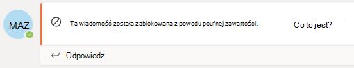
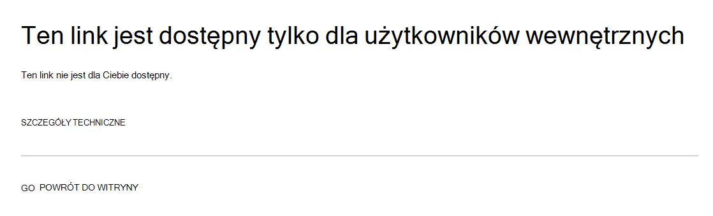

# Zapobieganie utracie danych i usługa Microsoft Teams

Jeśli Twoja organizacja ma Ochrona przed utratą danych w Microsoft Purview (DLP), możesz zdefiniować zasady, które uniemożliwiają użytkownikom udostępnianie poufnych informacji w kanale usługi Microsoft Teams lub sesji czatu. Oto kilka przykładów działania tej ochrony:

- **Przykład 1: Ochrona poufnych informacji w komunikatach**. Załóżmy, że ktoś próbuje udostępnić poufne informacje na czacie lub kanale usługi Teams gościom (użytkownikom zewnętrznym). Jeśli masz zdefiniowane zasady DLP, aby temu zapobiec, komunikaty z poufnymi informacjami, które są wysyłane do użytkowników zewnętrznych, są usuwane. Dzieje się tak automatycznie i w ciągu kilku sekund zgodnie ze sposobem konfigurowania zasad DLP.

    > [!NOTE]
    > Program DLP dla usługi Microsoft Teams blokuje poufne treści, gdy są udostępniane użytkownikom usługi Microsoft Teams, którzy: - [dostęp gościa](/MicrosoftTeams/guest-access) w zespołach i kanałach; Lub - [dostęp zewnętrzny](/MicrosoftTeams/manage-external-access) podczas spotkań i sesji czatu. 
DLP dla zewnętrznych sesji czatu będzie działać tylko wtedy, gdy nadawca i odbiorca są w trybie Tylko teams i używają [federacji natywnej usługi Microsoft Teams](/microsoftteams/manage-external-access). Usługa DLP dla usługi Teams nie blokuje komunikatów w [interop](/microsoftteams/teams-and-skypeforbusiness-coexistence-and-interoperability#interoperability-of-teams-and-skype-for-business) z Skype dla firm lub nienatywnymi federacyjnymi sesjami czatu.

- **Przykład 2. Ochrona poufnych informacji w dokumentach**. Załóżmy, że ktoś próbuje udostępnić dokument gościom w kanale lub czacie usługi Microsoft Teams, a dokument zawiera informacje poufne. Jeśli masz zdefiniowane zasady DLP, aby temu zapobiec, dokument nie zostanie otwarty dla tych użytkowników. Aby zapewnić ochronę, zasady DLP muszą obejmować program SharePoint i usługę OneDrive. Jest to przykład DLP dla programu SharePoint, który jest wyświetlany w usłudze Microsoft Teams i dlatego wymaga, aby użytkownicy byli licencjonowani na Office 365 DLP (dołączonych do Office 365 E3), ale nie wymagają licencji użytkowników na Office 365 Advanced Compliance).

- **Przykład 3: Ochrona komunikacji w udostępnionych kanałach usługi Teams**. W przypadku kanałów udostępnionych są stosowane zasady DLP zespołu usługi Teams hosta. Załóżmy na przykład, że istnieje udostępniony kanał należący do zespołu TeamA firmy Contoso. Usługa TeamA ma zasady DLP P1. Istnieją 3 sposoby udostępniania kanału:
    - **Udostępnij członkowi**: zapraszasz użytkownika user1 z firmy Contoso do dołączenia do udostępnionego kanału bez wprowadzania go do zespołu TeamA. Wszyscy użytkownicy tego udostępnionego kanału, w tym użytkownik1, będą objęci P1.
    - **Udostępnianie zespołowi (wewnętrznie)**: kanał jest udostępniany innemu zespołowi TeamB w usłudze Contoso. Że inny zespół może mieć inne zasady DLP, ale to nie ma znaczenia. P1 będzie miał zastosowanie do wszystkich w tym udostępnionym kanale, w tym zarówno użytkowników TeamA, jak i TeamB.
    - **Udostępnianie zespołowi (między dzierżawami)**: kanał jest udostępniany zespołowi TeamF w firmie Fabrikam. Firma Fabrikam może mieć własne zasady DLP, ale to nie ma znaczenia. P1 będzie miał zastosowanie do wszystkich użytkowników tego udostępnionego kanału, w tym użytkowników TeamA (Contoso) i TeamF (Fabrikam).
 
## Licencjonowanie DLP dla usługi Microsoft Teams

[Funkcje zapobiegania utracie danych](dlp-learn-about-dlp.md) obejmują czat i komunikaty kanałów w usłudze Microsoft Teams, **w tym wiadomości z kanału prywatnego** dla:

- Office 365 E5/A5/G5
- Microsoft 365 E5/A5/G5
- Information Protection i ład Microsoft 365 E5/A5/G5
- zgodność Microsoft 365 E5/A5/G5/F5 i zgodność & zabezpieczeń F5

Office 365 i Microsoft 365 E3 obejmują ochronę DLP dla usług SharePoint Online, OneDrive i Exchange Online. Dotyczy to również plików udostępnianych za pośrednictwem usługi Teams, ponieważ usługa Teams używa usług SharePoint Online i OneDrive do udostępniania plików.

Obsługa ochrony DLP w aplikacji Teams Chat wymaga E5.

Aby dowiedzieć się więcej na temat wymagań dotyczących licencjonowania, zobacz [Wskazówki dotyczące licencjonowania usług Tenant-Level Services platformy Microsoft 365](/office365/servicedescriptions/microsoft-365-service-descriptions/microsoft-365-tenantlevel-services-licensing-guidance/microsoft-365-security-compliance-licensing-guidance).

> [!IMPORTANT]
> Protokół DLP ma zastosowanie tylko do rzeczywistych komunikatów w wątku czatu lub kanału. Powiadomienia o działaniach— które obejmują krótką wersję zapoznawczą komunikatów i są wyświetlane na podstawie ustawień powiadomień użytkownika — **nie** są uwzględniane w usłudze Teams DLP. Wszelkie poufne informacje znajdujące się w części komunikatu wyświetlane w wersji zapoznawczej pozostaną widoczne w powiadomieniu nawet po zastosowaniu zasad DLP i usunięciu poufnych informacji samego komunikatu.

## Zakres ochrony DLP

Ochrona DLP jest stosowana inaczej do jednostek usługi Teams.

|Gdy zasady są objęte zakresem |Te jednostki usługi Teams |Będzie mieć dostępną ochronę DLP|
|---------|---------|---------|
|Indywidualne konta użytkowników     |Czaty 1:1/n         |Tak         |
|     |Komunikaty standardowego i udostępnionego kanału         |Nie         |
|     |Komunikaty kanału prywatnego         |Tak         |
|Grupy zabezpieczeń/listy dystrybucyjne  | Czaty 1:1/n         |Tak         |
|     |Komunikaty standardowego i udostępnionego kanału  |Nie         |
|     |Komunikaty kanału prywatnego         |Tak        |
|Grupa platformy Microsoft 365    |Czaty 1:1/n          |Nie         |
|     |Komunikaty standardowego i udostępnionego kanału          |Tak        |
|     |Komunikaty kanału prywatnego|Nie| 

## Porady dotyczące zasad pomagają edukować użytkowników

Podobnie jak w przypadku programu [Exchange, Outlook, Outlook w sieci Web,](data-loss-prevention-policies.md#policy-evaluation-in-exchange-online-outlook-and-outlook-on-the-web) [SharePoint Online, witryn OneDrive dla Firm](data-loss-prevention-policies.md#policy-evaluation-in-onedrive-for-business-and-sharepoint-online-sites) i [klientów klasycznych pakietu Office](data-loss-prevention-policies.md#policy-evaluation-in-the-office-desktop-programs), wskazówki dotyczące zasad są wyświetlane, gdy akcja jest wyzwalana przy użyciu zasad DLP. Oto przykład porady dotyczącej zasad:

W tym miejscu nadawca próbował udostępnić numer ubezpieczenia społecznego w kanale usługi Microsoft Teams. Link **Co mogę zrobić?** otwiera okno dialogowe z opcjami rozwiązania problemu przez nadawcę. Zwróć uwagę, że nadawca może zdecydować się na zastąpienie zasad lub powiadomić administratora o ich przejrzeniu i rozwiązaniu.

W organizacji możesz zezwolić użytkownikom na zastępowanie zasad DLP. Podczas konfigurowania zasad DLP możesz użyć domyślnych wskazówek dotyczących zasad lub [dostosować wskazówki dotyczące zasad](#to-customize-policy-tips) dla swojej organizacji.

Wracając do naszego przykładu, w którym nadawca udostępnił numer ubezpieczenia społecznego w kanale usługi Teams, oto co zobaczył odbiorca:

> [!div class="mx-imgBorder"]
> 

### Aby dostosować porady dotyczące zasad

Aby wykonać to zadanie, musisz mieć przypisaną rolę, która ma uprawnienia do edytowania zasad DLP. Aby dowiedzieć się więcej, zobacz [Uprawnienia](data-loss-prevention-policies.md#permissions).

1. Przejdź do Centrum zgodności usługi Purview ([https://compliance.microsoft.com](https://compliance.microsoft.com)) i zaloguj się.

2. Wybierz **pozycję Zasady ochrony przed utratą** >  danych.

3. Wybierz zasady, a następnie obok pozycji **Ustawienia zasad** wybierz pozycję **Edytuj**.

4. Utwórz nową regułę lub edytuj istniejącą regułę dla zasad.

5. Na karcie **Powiadomienia użytkownika** wybierz pozycję **Dostosuj tekst wiadomości e-mail** i/lub **Dostosuj opcje tekstu porad dotyczących zasad** .

6. Określ tekst, którego chcesz użyć na potrzeby powiadomień e-mail i/lub wskazówek dotyczących zasad, a następnie wybierz pozycję **Zapisz**.

7. Na karcie **Ustawienia zasad** wybierz pozycję **Zapisz**.

Zaczekaj około godziny na pracę zmian w centrum danych i synchronizowanie ich z kontami użytkowników.
 <!-- why are these syncing to user accounts? -->

## Dodawanie aplikacji Microsoft Teams jako lokalizacji do istniejących zasad DLP

Aby wykonać to zadanie, musisz mieć przypisaną rolę, która ma uprawnienia do edytowania zasad DLP. Aby dowiedzieć się więcej, zobacz [Uprawnienia](data-loss-prevention-policies.md#permissions).

1. Przejdź do Centrum zgodności ([https://compliance.microsoft.com](https://compliance.microsoft.com)) i zaloguj się.

2. Wybierz **pozycję Zasady ochrony przed utratą** >  danych.

3. Wybierz zasady i przyjrzyj się wartościom w obszarze **Lokalizacje**. Jeśli widzisz **komunikaty czatu i kanału usługi Teams**, wszystko jest ustawione. Jeśli tego nie zrobisz, kliknij pozycję **Edytuj**.

4. W kolumnie **Stan** włącz zasady dla **wiadomości czatu i kanału usługi Teams**.

5. Na **karcie Wybierz lokalizacje zachowaj domyślne** ustawienie wszystkich kont lub wybierz pozycję **Pozwól mi wybrać określone lokalizacje**. Możesz określić:

    1. Do 1000 indywidualnych kont do uwzględnienia lub wykluczenia
    1. Listy dystrybucyjne i grupy zabezpieczeń do uwzględnienia lub wykluczenia. 
    <!-- 1. the shared mailbox of a shared channel. **This is a public preview feature.**--> 
    
6. Następnie wybierz pozycję **Dalej**.

7. Kliknij **Zapisz**.

Zaczekaj około godziny na pracę zmian w centrum danych i synchronizowanie ich z kontami użytkowników.
<!-- again, why user accounts? -->

## Definiowanie nowych zasad DLP dla usługi Microsoft Teams

Aby wykonać to zadanie, musisz mieć przypisaną rolę, która ma uprawnienia do edytowania zasad DLP. Aby dowiedzieć się więcej, zobacz [Uprawnienia](data-loss-prevention-policies.md#permissions).

1. Przejdź do Centrum zgodności ([https://compliance.microsoft.com](https://compliance.microsoft.com)) i zaloguj się.

2. Wybierz pozycję **Zasady** >  **ochrony przed** >  **utratą danych+ Utwórz zasady**.

3. Wybierz [szablon](data-loss-prevention-policies.md#dlp-policy-templates), a następnie wybierz pozycję **Dalej**.

    W naszym przykładzie wybraliśmy szablon Danych osobowych w Stanach Zjednoczonych.

4. Na karcie **Nazwa zasad** określ nazwę i opis zasad, a następnie wybierz pozycję **Dalej**.

5. Na **karcie Wybierz lokalizacje zachowaj domyślne** ustawienie wszystkich kont lub wybierz pozycję **Pozwól mi wybrać określone lokalizacje**. Możesz określić:

    1. Do 1000 indywidualnych kont do uwzględnienia lub wykluczenia
    1. Listy dystrybucyjne i grupy zabezpieczeń do uwzględnienia lub wykluczenia. **Jest to funkcja publicznej wersji zapoznawczej.**
    <!-- 1. the shared mailbox of a shared channel. **This is a public preview feature.**-->  

 
    > [!NOTE]
    > Jeśli chcesz upewnić się, że dokumenty zawierające poufne informacje nie są niewłaściwie udostępniane w usłudze Teams, upewnij się, że **witryny programu SharePoint** i **konta usługi OneDrive** są włączone wraz z **komunikatami czatu i kanału usługi Teams**.

6. Na karcie **Ustawienia zasad** w obszarze **Dostosuj typ zawartości, którą chcesz chronić**, zachowaj domyślne proste ustawienia lub wybierz pozycję **Użyj ustawień zaawansowanych**, a następnie wybierz pozycję **Dalej**. Jeśli wybierzesz ustawienia zaawansowane, możesz utworzyć lub edytować reguły dla zasad. Aby uzyskać pomoc w tym zakresie, zobacz [Ustawienia proste a ustawienia zaawansowane](data-loss-prevention-policies.md#simple-settings-vs-advanced-settings).

7.  Na karcie **Ustawienia zasad** w obszarze **Co chcesz zrobić, jeśli wykryjemy informacje poufne?**, przejrzyj ustawienia. W tym miejscu możesz zachować domyślne [wskazówki dotyczące zasad i powiadomienia e-mail](use-notifications-and-policy-tips.md) lub dostosować je.

    Po zakończeniu przeglądania lub edytowania ustawień wybierz pozycję **Dalej**.

8. Na karcie **Ustawienia zasad** w obszarze **Czy chcesz najpierw włączyć zasady lub przetestować elementy?**, wybierz, czy włączyć zasady, [przetestować je najpierw](dlp-overview-plan-for-dlp.md#policy-deployment), czy wyłączyć je na razie, a następnie wybierz pozycję **Dalej**.

9. Na karcie **Przeglądanie ustawień** przejrzyj ustawienia nowych zasad. Wybierz pozycję **Edytuj** , aby wprowadzić zmiany. Po zakończeniu wybierz pozycję **Utwórz**.

Zaczekaj około godziny, aby nowe zasady działały w centrum danych i synchronizowane z kontami użytkowników.

## Zapobieganie dostępowi zewnętrznemu do poufnych dokumentów

Aby upewnić się, że domyślnie goście zewnętrzni z programu SharePoint lub Teams nie będą mogli uzyskiwać dostępu do dokumentów programu SharePoint zawierających informacje poufne, wybierz następujące opcje:

- Możesz upewnić się, że dokumenty są chronione, dopóki protokół DLP nie przeskanuje i nie oznaczy ich jako bezpiecznych do udostępnienia, [domyślnie oznaczając nowe pliki jako poufne](/sharepoint/sensitive-by-default).

- Zalecana struktura zasad DLP

    - **Warunki**
        - Zawartość zawiera dowolny z tych typów informacji poufnych: [Wybierz wszystkie, które mają zastosowanie]
        
        - Zawartość jest udostępniana z platformy Microsoft 365 osobom spoza mojej organizacji
        
          > [!div class="mx-imgBorder"]
          > 

    - **Działania**
        - Ograniczanie dostępu do zawartości dla użytkowników zewnętrznych
        
        - Powiadamianie użytkowników za pomocą wiadomości e-mail i wskazówek dotyczących zasad
        
        - Wysyłanie raportów o zdarzeniach do administratora
        
        > [!div class="mx-imgBorder"]
        > 

Zasady DLP w działaniu podczas próby udostępnienia dokumentu w programie SharePoint zawierającego informacje poufne gościu zewnętrznemu:

> [!div class="mx-imgBorder"]
> 

<!--DLP policy in action when guest attempts to open a document in Teams with block external:
can't use the below image it contains a non-approved name.
> [!div class="mx-imgBorder"]
> -->

## Powiązane artykuły:

- [Twórz, testuj i dostrajaj zasady DLP](create-test-tune-dlp-policy.md)
- [Wyślij powiadomienia e-mail i pokaż porady dotyczące zasad dla zasad DLP](use-notifications-and-policy-tips.md)
