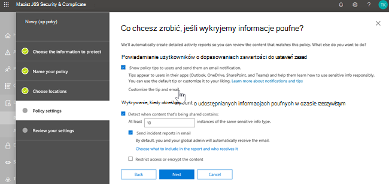
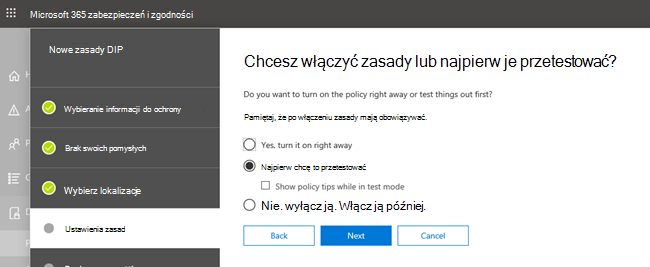

# Ochrona przed utratą danych i Microsoft Teams

Jeśli Twoja organizacja korzysta z ochrony przed utratą danych (DLP, data loss prevention), możesz zdefiniować zasady uniemożliwiające innym osobom udostępnianie poufnych informacji w Microsoft Teams kanale lub sesji czatu. Oto kilka przykładów działania tej ochrony:

- **Przykład 1. Ochrona informacji poufnych w wiadomościach**. Załóżmy, że ktoś próbuje udostępnić poufne informacje na Teams lub kanale gościom (użytkownikom zewnętrznym). Jeśli masz zdefiniowane zasady DLP, aby temu zapobiec, wiadomości z informacjami poufnymi wysyłane do użytkowników zewnętrznych są usuwane. Dzieje się tak automatycznie i w ciągu kilku sekund, zgodnie z konfiguracją zasad DLP.

    > [!NOTE]
    > DLP for Microsoft Teams blocks sensitive content when shared with Microsoft Teams users who have: - [dostęp gościa](/MicrosoftTeams/guest-access) w zespołach i kanałach; lub - [dostęp zewnętrzny na](/MicrosoftTeams/manage-external-access) spotkaniach i sesjach czatu. 
DLP w przypadku zewnętrznych sesji czatu działa tylko wtedy, gdy zarówno nadawca, jak i odbiorca są w trybie Teams i mają natywny [Microsoft Teams federacji](/microsoftteams/manage-external-access). DLP dla Teams nie blokuje wiadomości w sesjach Skype dla firm ani  w nienatywnych federowanych sesjach czatu.

- **Przykład 2. Ochrona informacji poufnych w dokumentach**. Załóżmy, że ktoś próbuje udostępnić dokument gościom w kanale Microsoft Teams lub czacie, a dokument zawiera informacje poufne. Jeśli masz zdefiniowane zasady DLP, aby temu zapobiec, dokument nie zostanie otwarty dla tych użytkowników. Zasady DLP muszą obejmować SharePoint i OneDrive, aby zapewnić ochronę. Jest to przykład zasad DLP dla systemu SharePoint, który pojawia się w programie Microsoft Teams i dlatego wymaga, aby użytkownicy posiadali licencje na produkt Office 365 DLP (który jest zawarty w programie Office 365 E3), ale nie wymagały od nich licencji na Office 365 Advanced Compliance).

- **Przykład 3. Ochrona komunikacji w Teams kanałach udostępnionych**. W przypadku kanałów udostępnionych zasady Teams zasad DLP zespołu. Załóżmy na przykład, że kanał udostępniony należy do Zespołu A firmy Contoso. ZespółA ma zasady DLP P1. Istnieją 3 sposoby udostępniania kanału:
    - **Udostępnij członkowskiemu**: Zapraszasz użytkownika 1 od firmy Contoso do dołączenia do kanału udostępnionego bez nacjedyńsku na członka zespołu TeamA. Wszystkie osoby korzystające z tego kanału udostępnionego, w tym użytkownik1, zostaną objęte przez P1.
    - **Udostępnianie zespołowi (wewnętrznie)**: Udostępniasz kanał inowi zespołowi TeamB w firmie Contoso. Inny zespół może mieć inne zasady ochrony przed zasadami DLP, ale to nie ma znaczenia. P1 dotyczy wszystkich osób w tym kanale udostępnionym, w tym użytkowników TeamA i TeamB.
    - **Udostępnij zespołowi (między dzierżawami)**: Udostępnij kanał zespołowi TeamF w firmie Fabrikam. Firma Fabrikam może mieć własne zasady ochrony przed zasadami DLP, ale to nie ma znaczenia. P1 zostanie zastosować do wszystkich osób w tym kanale udostępnionym, włącznie z użytkownikami TeamA (Contoso) i TeamF (Fabrikam).
 
## Licencjonowanie DLP dla Microsoft Teams

[Funkcje ochrony przed utratą](dlp-learn-about-dlp.md) danych zostały rozszerzone o Microsoft Teams czatów i wiadomości kanałów, **w tym wiadomości kanału prywatnego dla**:

- Office 365 E5/A5/G5
- Microsoft 365 E5/A5/G5
- Microsoft 365 E5/A5/G5 Ochrona informacji i zarządzanie informacjami
- Microsoft 365 E5/A5/G5/F5 i zgodności z zabezpieczeniami F5 & zgodności

Office 365 i Microsoft 365 E3 ochrony przed DLP dla usług SharePoint online, OneDrive i Exchange Online. Dotyczy to również plików udostępnianych za pośrednictwem usługi Teams ponieważ Teams plików jest SharePoint Online OneDrive w celu udostępniania plików.

Obsługa ochrony przed DLP w czacie Teams wymaga programu E5.

Aby dowiedzieć się więcej o wymaganiach licencjonowania, zobacz [Microsoft 365 Tenant-Level licencjonowania usług firmy Microsoft](/office365/servicedescriptions/microsoft-365-service-descriptions/microsoft-365-tenantlevel-services-licensing-guidance/microsoft-365-security-compliance-licensing-guidance).

> [!IMPORTANT]
> Zasady DLP mają zastosowanie tylko do rzeczywistych wiadomości na czacie lub w wątku kanału. Powiadomienia dotyczące aktywności, które zawierają krótki podgląd wiadomości i są wyświetlane na podstawie ustawień powiadomień użytkownika, nie są  uwzględniane w Teams DLP. Wszelkie informacje poufne w części wiadomości wyświetlanej w podglądzie pozostaną widoczne w powiadomieniu nawet po zastosowaniu zasad DLP i usunięciu poufnych informacji w samej wiadomości.

## Zakres ochrony przed DLP

Ochrona przed DLP jest stosowana w inny sposób Teams jednostkach.

|Gdy zasady są objęte zakresem |Te Teams jednostki |Będzie dostępna ochrona przed DLP|
|---------|---------|---------|
|Konta poszczególnych użytkowników     |Czaty 1:1/n         |Tak         |
|     |Standardowe i udostępnione wiadomości w kanałach         |Nie         |
|     |Wiadomości z kanału prywatnego         |Tak         |
|Grupy zabezpieczeń/listy dystrybucyjne  | Czaty 1:1/n         |Tak         |
|     |Standardowe i udostępnione wiadomości w kanałach  |Nie         |
|     |Wiadomości z kanału prywatnego         |Tak        |
|Microsoft 365 grupy    |Czaty 1:1/n          |Nie         |
|     |Standardowe i udostępnione wiadomości w kanałach          |Tak        |
|     |Wiadomości z kanału prywatnego|Nie| 

## Porady dotyczące zasad ułatwiają pomaganie użytkownikom

Podobnie jak w przypadku klientów komputerowych usług [Exchange, Outlook, Outlook w sieci Web](data-loss-prevention-policies.md#policy-evaluation-in-exchange-online-outlook-and-outlook-on-the-web), [SharePoint Online, OneDrive dla Firm](data-loss-prevention-policies.md#policy-evaluation-in-onedrive-for-business-and-sharepoint-online-sites) i klientów komputerowych programu [Office](data-loss-prevention-policies.md#policy-evaluation-in-the-office-desktop-programs), porady dotyczące zasad są wyświetlane, gdy wyzwalacze akcji są wyzwalane przy użyciu zasad DLP. Oto przykład porady dotyczącej zasad:

W tym miejscu nadawca próbował udostępnić numer PE PESZ w kanale Microsoft Teams sieci. Link **Co mogę zrobić?** powoduje otwarcie okna dialogowego z opcjami dla nadawcy rozwiązania tego problemu. Nadawca może zastąpić zasady lub powiadomić administratora o przejrzenia i rozwiązaniu problemu.

W Twojej organizacji możesz zezwolić użytkownikom na zastępowanie zasad DLP. Podczas konfigurowania zasad DLP można używać domyślnych porad dotyczących zasad lub [dostosowywać porady dotyczące zasad](#to-customize-policy-tips) dla organizacji.

Wracając do naszego przykładu, w którym nadawca współużytkuje numer PEZEt w kanale Teams, adresat zobaczy te informacje:

> [!div class="mx-imgBorder"]
> 

### Aby dostosować porady dotyczące zasad

Aby wykonać to zadanie, musisz mieć przypisaną rolę z uprawnieniami do edytowania zasad DLP. Aby dowiedzieć się więcej, zobacz [Uprawnienia](data-loss-prevention-policies.md#permissions).

1. Przejdź do Centrum zgodności ([https://compliance.microsoft.com](https://compliance.microsoft.com)) i zaloguj się.

2. Wybierz **pozycję Data loss** **preventionPolicy (Zapobieganie utracie** >  danychPolicy).

3. Wybierz zasady, a następnie obok **ustawień zasad** wybierz pozycję **Edytuj**.

4. Utwórz nową regułę lub edytuj istniejącą regułę zasad.

    > [!div class="mx-imgBorder"]
    > 

5. Na karcie **Powiadomienia użytkownika** wybierz pozycję **Dostosuj** tekst wiadomości e-mail i/lub **Dostosuj opcje tekstu porady dotyczącej** zasad.

    > [!div class="mx-imgBorder"]
    >    

6. Określ tekst, którego chcesz używać do powiadomień e-mail i/lub porad dotyczących zasad, a następnie wybierz pozycję **Zapisz**.

7. Na karcie **Ustawienia zasad** wybierz pozycję **Zapisz**.

Zezwalaj około godziny, aby wprowadzone zmiany działały w centrum danych i synchronizowały się z kontami użytkowników.
 <!-- why are these syncing to user accounts? -->

## Dodawanie Microsoft Teams jako lokalizacji do istniejących zasad DLP

Aby wykonać to zadanie, musisz mieć przypisaną rolę z uprawnieniami do edytowania zasad DLP. Aby dowiedzieć się więcej, zobacz [Uprawnienia](data-loss-prevention-policies.md#permissions).

1. Przejdź do Centrum zgodności ([https://compliance.microsoft.com](https://compliance.microsoft.com)) i zaloguj się.

2. Wybierz **pozycję Data loss** **preventionPolicy (Zapobieganie utracie** >  danychPolicy).

3. Wybierz zasady i sprawdź wartości w **obszarze Lokalizacje**. Jeśli widzisz czat **Teams wiadomości na kanale**, wszystko jest już tak ustawione. Jeśli nie, kliknij pozycję **Edytuj**.

    > [!div class="mx-imgBorder"]
    > 

4. W kolumnie **Stan** włącz zasady czatów i **Teams wiadomości na czacie**.

    > [!div class="mx-imgBorder"]
    > 

5. Na **karcie Wybierz lokalizacje** zachowaj domyślne ustawienie wszystkich kont lub wybierz pozycję Pozwól **mi wybrać określone lokalizacje**. Możesz określić:

    1. Do 1000 pojedynczych kont do dołączyć lub wykluczyć
    1. Listy dystrybucyjne i grupy zabezpieczeń, które należy uwzględnić lub wykluczyć. 
    <!-- 1. the shared mailbox of a shared channel. **This is a public preview feature.**--> 
    
6. Następnie wybierz przycisk **Dalej**.

7. Kliknij **Zapisz**.

Zezwalaj około godziny, aby wprowadzone zmiany działały w centrum danych i synchronizowały się z kontami użytkowników.
<!-- again, why user accounts? -->

## Definiowanie nowych zasad DLP dla Microsoft Teams

Aby wykonać to zadanie, musisz mieć przypisaną rolę z uprawnieniami do edytowania zasad DLP. Aby dowiedzieć się więcej, zobacz [Uprawnienia](data-loss-prevention-policies.md#permissions).

1. Przejdź do Centrum zgodności ([https://compliance.microsoft.com](https://compliance.microsoft.com)) i zaloguj się.

2. Wybierz **pozycję Zapobieganie utracie** >  **danychPolicy** > **+ Utwórz zasady**.

3. Wybierz [szablon,](data-loss-prevention-policies.md#dlp-policy-templates) a następnie wybierz przycisk **Dalej**.

    W naszym przykładzie wybraliśmy szablon danych umożliwiających identyfikację użytkownika w Stanach Zjednoczonych.

    > [!div class="mx-imgBorder"]
    >  

4. Na karcie **Nadaj nazwę** zasadom określ nazwę i opis zasad, a następnie wybierz przycisk **Dalej**.

5. Na **karcie Wybierz lokalizacje** zachowaj domyślne ustawienie wszystkich kont lub wybierz pozycję Pozwól **mi wybrać określone lokalizacje**. Możesz określić:

    1. Do 1000 pojedynczych kont do dołączyć lub wykluczyć
    1. Listy dystrybucyjne i grupy zabezpieczeń, które należy uwzględnić lub wykluczyć. **Jest to funkcja publicznej wersji Preview.**
    <!-- 1. the shared mailbox of a shared channel. **This is a public preview feature.**-->  

    

    > [!NOTE]
    > Jeśli chcesz upewnić się, że dokumenty zawierające informacje poufne nie są udostępniane w programie Teams w nieodpowiedni sposób, upewnij się,  że są włączone witryny SharePoint i konta **OneDrive**, Teams wiadomości czatu i **kanałów**.

6. Na karcie **Ustawienia zasad** w obszarze Dostosuj typ **zawartości, który** chcesz chronić, zachowaj domyślne ustawienia proste lub wybierz pozycję Użyj ustawień **zaawansowanych, a** następnie wybierz pozycję **Dalej**. Jeśli wybierzesz ustawienia zaawansowane, możesz tworzyć lub edytować reguły zasad. Aby uzyskać pomoc w tym związku, zobacz [Ustawienia proste a ustawienia zaawansowane](data-loss-prevention-policies.md#simple-settings-vs-advanced-settings).

7.  Na karcie **Ustawienia zasad** w **obszarze Co chcesz zrobić** w przypadku wykrycia informacji poufnych? przejrzyj ustawienia. Tutaj możesz wybrać zachowanie domyślnych porad dotyczących zasad i powiadomień [e-mail](use-notifications-and-policy-tips.md) lub ich dostosowanie.

    > [!div class="mx-imgBorder"]
    > 

    Po zakończeniu przeglądania lub edytowania ustawień wybierz pozycję **Dalej**.

8. Na karcie **Ustawienia zasad** w obszarze Czy chcesz włączyć zasady, czy najpierw je przetestować **?** wybierz, czy chcesz włączyć [zasady, najpierw](dlp-overview-plan-for-dlp.md#policy-deployment) je przetestować, czy wyłączyć na razie, a następnie wybierz przycisk **Dalej**.

    > [!div class="mx-imgBorder"]
    > 

9. Na **karcie Przeglądanie ustawień** przejrzyj ustawienia nowych zasad. Wybierz **pozycję Edytuj,** aby wprowadzić zmiany. Po zakończeniu wybierz pozycję **Utwórz**.

Zezwalaj na około godzinę, aby nowe zasady działały przez Twoje centrum danych i synchronizowały się z kontami użytkowników.

## Uniemożliwianie dostępu zewnętrznego do poufnych dokumentów

Aby zapewnić, SharePoint, które zawierają informacje poufne, nie będą domyślnie dostępne dla gości zewnętrznych z programu SharePoint lub Teams, wybierz następujące polecenie:

- Możesz zapewnić ochronę przed skanowaniem DLP i oznaczać je jako bezpieczne do udostępnienia, oznaczając domyślnie nowe pliki [jako poufne](/sharepoint/sensitive-by-default).

- Zalecana struktura zasad DLP

    - **Warunki**
        - Zawartość zawiera dowolny z tych typów informacji poufnych: [Zaznacz wszystkie, które mają zastosowanie]
        
        - Zawartość jest udostępniana przez Microsoft 365 osobom spoza mojej organizacji
        
          > [!div class="mx-imgBorder"]
          > 

    - **Akcje**
        - Ograniczanie dostępu do zawartości użytkownikom zewnętrznym
        
        - Powiadamianie użytkowników za pomocą poczty e-mail i porad dotyczących zasad
        
        - Wysyłanie raportów o incydentach do administratora
        
        > [!div class="mx-imgBorder"]
        > 

Zasady DLP w działaniu podczas próby udostępnienia dokumentu w programie SharePoint zawierającego informacje poufne gościowi zewnętrzneowi:

> [!div class="mx-imgBorder"]
> 

Zasady DLP w działaniu, gdy gość próbuje otworzyć dokument w programie Teams bloku zewnętrznego:

> [!div class="mx-imgBorder"]
> 

## Artykuły pokrewne

- [Twórz, testuj i dostrajaj zasady DLP](create-test-tune-dlp-policy.md)
- [Wyślij powiadomienia e-mail i pokaż porady dotyczące zasad dla zasad DLP](use-notifications-and-policy-tips.md)
