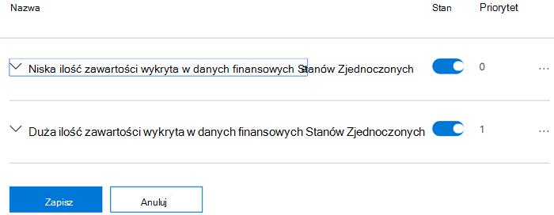
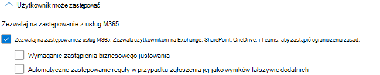

# Informacje dotyczące zasad ochrony przed utratą danych

Zasady ochrony przed utratą danych (DLP) mają wiele składników do skonfigurowania. Aby utworzyć skuteczne zasady, musisz zrozumieć, do czego jest każdy składnik i jak jego konfiguracja zmienia zachowanie zasad. W tym artykule szczegółowo oonomiono zasady DLP.

## Szablony zasad 

Szablony zasad DLP są wstępnie sortowane według czterech kategorii:

- Te, które mogą wykrywać i chronić **typy informacji finansowych** .
- Te, które mogą wykrywać i chronić typy **informacji medycznych i zdrowia** .
- Te, które mogą wykrywać i chronić **typy informacji prywatności** .
- Szablon **niestandardowy** , za pomocą który można tworzyć własne zasady, jeśli jedna z pozostałych nie spełnia wymagań Twojej organizacji.

W poniższej tabeli wymieniono wszystkie szablony zasad oraz informacje poufne (SIT, sensitive information types), które obejmują. 

zaktualizowano: 2021-06-23

|Kategoria| Szablon | SIT |
|---------|---------|---------|
|Finanse| Australia Dane finansowe| - [Kod SWIFT](sensitive-information-type-entity-definitions.md#swift-code)   - [Numer pliku podatkowego w Australii](sensitive-information-type-entity-definitions.md#australia-tax-file-number)   - [Numer konta bankowego w Australii](sensitive-information-type-entity-definitions.md#australia-bank-account-number)   - [Numer karty kredytowej](sensitive-information-type-entity-definitions.md#credit-card-number)|
|Finanse| Dane finansowe z Kanady |- [Numer karty kredytowej](sensitive-information-type-entity-definitions.md#credit-card-number)   - [Numer konta bankowego w Kanadzie](sensitive-information-type-entity-definitions.md#canada-bank-account-number)|
|Finanse| Dane finansowe dotyczące Francji |- [Numer karty kredytowej](sensitive-information-type-entity-definitions.md#credit-card-number)   - [Numer karty debetowej UE](sensitive-information-type-entity-definitions.md#eu-debit-card-number)|
|Finanse| Dane finansowe w Niemczech |- [Numer karty kredytowej](sensitive-information-type-entity-definitions.md#credit-card-number)   - [Numer karty debetowej UE](sensitive-information-type-entity-definitions.md#eu-debit-card-number)|
|Finanse| Dane finansowe Izraela |- [Izrael : numer konta bankowego](sensitive-information-type-entity-definitions.md#israel-bank-account-number)   - [Kod SWIFT](sensitive-information-type-entity-definitions.md#swift-code)   - [Numer karty kredytowej](sensitive-information-type-entity-definitions.md#credit-card-number)|
|Finanse| Japonia - dane finansowe |- [Numer konta bankowego w Japonii](sensitive-information-type-entity-definitions.md#japan-bank-account-number)   - [Numer karty kredytowej](sensitive-information-type-entity-definitions.md#credit-card-number)|
|Finanse| PCI Data Security Standard (PCI DSS)|- [Numer karty kredytowej](sensitive-information-type-entity-definitions.md#credit-card-number)|
|Finanse| Prawo do ochrony przed cyberprzestępczością Arabia Saudyjska|- [Kod SWIFT](sensitive-information-type-entity-definitions.md#swift-code)   - [Numer konta bankowego międzynarodowego (IBAN)](sensitive-information-type-entity-definitions.md#international-banking-account-number-iban) |
|Finanse| Dane finansowe z Arabia Saudyjska |- [Numer karty kredytowej](sensitive-information-type-entity-definitions.md#credit-card-number)   - [Kod SWIFT](sensitive-information-type-entity-definitions.md#swift-code)   - [Numer konta bankowego międzynarodowego (IBAN)](sensitive-information-type-entity-definitions.md#international-banking-account-number-iban)|
|Finanse| Dane finansowe Zjednoczonego Królestwa|- [Numer karty kredytowej](sensitive-information-type-entity-definitions.md#credit-card-number)   - [Numer karty debetowej UE](sensitive-information-type-entity-definitions.md#eu-debit-card-number)   - [Kod SWIFT](sensitive-information-type-entity-definitions.md#swift-code)|
|Finanse| Dane finansowe Stanów Zjednoczonych|- [Numer karty kredytowej](sensitive-information-type-entity-definitions.md#credit-card-number)   - [Numer konta bankowego w Stanach Zjednoczonych](sensitive-information-type-entity-definitions.md#us-bank-account-number)  - [Numer routingu ABA](sensitive-information-type-entity-definitions.md#aba-routing-number)|
|Finanse| Reguły amerykańskiej Federal Trade Commission (FTC)|- [Numer karty kredytowej](sensitive-information-type-entity-definitions.md#credit-card-number)   - [Numer konta bankowego w Stanach Zjednoczonych](sensitive-information-type-entity-definitions.md#us-bank-account-number)  - [Numer routingu ABA](sensitive-information-type-entity-definitions.md#aba-routing-number)|
|Finanse| Ulepszona amerykańska ustawa Gramm-Leach-Bliley Act (GLBA)|- [Numer karty kredytowej](sensitive-information-type-entity-definitions.md#credit-card-number)   - [Numer konta bankowego w Stanach Zjednoczonych](sensitive-information-type-entity-definitions.md#us-bank-account-number)  - [Numer identyfikacyjny identyfikacji indywidualnej (ITIN) Stanów Zjednoczonych](sensitive-information-type-entity-definitions.md#us-individual-taxpayer-identification-number-itin)    - [Numer SSN (U.SSN)](sensitive-information-type-entity-definitions.md#us-social-security-number-ssn)  - [Numer paszportu Stanów Zjednoczonych](sensitive-information-type-entity-definitions.md#usuk-passport-number)   -[Numer prawa jazdy w Stanach Zjednoczonych](sensitive-information-type-entity-definitions.md#us-drivers-license-number)  - [Wszystkie imię i nazwisko](sensitive-information-type-entity-definitions.md#all-full-names)  - [Adresy fizyczne w Stanach Zjednoczonych](sensitive-information-type-entity-definitions.md#us-physical-addresses)|
|Finanse| U.S. Gramm-Leach-Bliley Act (GLBA)|- [Numer karty kredytowej](sensitive-information-type-entity-definitions.md#credit-card-number)   - [Numer konta bankowego w Stanach Zjednoczonych](sensitive-information-type-entity-definitions.md#us-bank-account-number)  - [Numer identyfikacyjny identyfikacji indywidualnej (ITIN) Stanów Zjednoczonych](sensitive-information-type-entity-definitions.md#us-individual-taxpayer-identification-number-itin)    - [Numer SSN (U.SSN)](sensitive-information-type-entity-definitions.md#us-social-security-number-ssn)|
|Medyczne i medyczne| Rozszerzona ustawa Australia Health Records Act (HRIP Act) |- [Numer pliku podatkowego w Australii](sensitive-information-type-entity-definitions.md#australia-tax-file-number)   - [Numer konta medycznego w Australii](sensitive-information-type-entity-definitions.md#australia-medical-account-number)   - [Wszystkie imię i nazwisko](sensitive-information-type-entity-definitions.md#all-full-names)   - [Wszystkie warunki i postanowienia medyczne](sensitive-information-type-entity-definitions.md#all-medical-terms-and-conditions)   - [Adresy fizyczne (Australia)](sensitive-information-type-entity-definitions.md#australia-physical-addresses)|
|Medyczne i medyczne| Australia Health Records Act (HRIP Act)|- [Numer pliku podatkowego w Australii](sensitive-information-type-entity-definitions.md#australia-tax-file-number)   - [Numer konta medycznego w Australii](sensitive-information-type-entity-definitions.md#australia-medical-account-number)|
|Medyczne i medyczne| Canada Health Information Act (HIA) |- [Numer paszportu Kanady](sensitive-information-type-entity-definitions.md#canada-passport-number)  - [Kanada numer ubezpieczenia społecznego](sensitive-information-type-entity-definitions.md#canada-social-insurance-number)   - [Numer usługi zdrowia w Kanadzie](sensitive-information-type-entity-definitions.md#canada-health-service-number)   - [Numer identyfikacyjny zdrowia osobistego w Kanadzie](sensitive-information-type-entity-definitions.md#canada-personal-health-identification-number-phin)|
|Medyczne i medyczne| Canada Personal Health Information Act (PHIA) Manitoba|- [Kanada numer ubezpieczenia społecznego](sensitive-information-type-entity-definitions.md#canada-social-insurance-number)   - [Numer usługi zdrowia w Kanadzie](sensitive-information-type-entity-definitions.md#canada-health-service-number)   - [Numer identyfikacyjny zdrowia osobistego w Kanadzie](sensitive-information-type-entity-definitions.md#canada-personal-health-identification-number-phin)|
|Medyczne i medyczne| Canada Personal Health Act (PHIPA) Ontario |- [Numer paszportu Kanady](sensitive-information-type-entity-definitions.md#canada-passport-number)  - [Kanada numer ubezpieczenia społecznego](sensitive-information-type-entity-definitions.md#canada-social-insurance-number)   - [Numer usługi zdrowia w Kanadzie](sensitive-information-type-entity-definitions.md#canada-health-service-number)   - [Numer identyfikacyjny zdrowia osobistego w Kanadzie](sensitive-information-type-entity-definitions.md#canada-personal-health-identification-number-phin)|
|Medyczne i medyczne| Zjednoczone Emiraty Zjednoczone Access to Medical Reports Act|- [Numer usługi zdrowia państwowego w Wielkiej Brytanii](sensitive-information-type-entity-definitions.md#uk-national-health-service-number)   - [Amerykański numer ubezpieczenia państwowego (NINO)](sensitive-information-type-entity-definitions.md#uk-national-insurance-number-nino)|
|Medyczne i medyczne| Ulepszona amerykańska ustawa HIPAA (Health Insurance Act)|  - [Międzynarodowa klasyfikacja kwalifikacji (ICD-9-CM)](sensitive-information-type-entity-definitions.md#international-classification-of-diseases-icd-9-cm)   - [Międzynarodowa klasyfikacja kwalifikacji (ICD-10-CM)](sensitive-information-type-entity-definitions.md#international-classification-of-diseases-icd-10-cm)   - [Wszystkie imię i nazwisko](sensitive-information-type-entity-definitions.md#all-full-names)   - [Wszystkie warunki i postanowienia medyczne](sensitive-information-type-entity-definitions.md#all-medical-terms-and-conditions)   - [Adresy fizyczne w Stanach Zjednoczonych](sensitive-information-type-entity-definitions.md#us-physical-addresses)|
|Medyczne i medyczne| Amerykańska ustawa HIPAA (Health Insurance Act)| - [Międzynarodowa klasyfikacja kwalifikacji (ICD-9-CM)](sensitive-information-type-entity-definitions.md#international-classification-of-diseases-icd-9-cm)   - [Międzynarodowa klasyfikacja kwalifikacji (ICD-10-CM)](sensitive-information-type-entity-definitions.md#international-classification-of-diseases-icd-10-cm)|
|Prywatność| Rozszerzona aktu prywatności Australia|- [Numer prawa jazdy w Australii](sensitive-information-type-entity-definitions.md#australia-drivers-license-number)   - [Numer paszportu Australii](sensitive-information-type-entity-definitions.md#australia-passport-number)   - [Wszystkie imię i nazwisko](sensitive-information-type-entity-definitions.md#all-full-names)   - [Wszystkie warunki i postanowienia medyczne](sensitive-information-type-entity-definitions.md#all-medical-terms-and-conditions)   - [Adresy fizyczne (Australia)](sensitive-information-type-entity-definitions.md#australia-physical-addresses)|
|Prywatność| Australia Privacy Act|- [Numer prawa jazdy w Australii](sensitive-information-type-entity-definitions.md#australia-drivers-license-number)   - [Numer paszportu Australii](sensitive-information-type-entity-definitions.md#australia-passport-number)|
|Prywatność| Dane umożliwiające identyfikację użytkownika (PII) w Australii|- [Numer pliku podatkowego w Australii](sensitive-information-type-entity-definitions.md#australia-tax-file-number)   - [Numer prawa jazdy w Australii](sensitive-information-type-entity-definitions.md#australia-drivers-license-number)|
|Prywatność| Dane umożliwiające identyfikację użytkownika (PII) w Kanadzie|- [Numer prawa jazdy z Kanady](sensitive-information-type-entity-definitions.md#canada-drivers-license-number)  - [Numer konta bankowego w Kanadzie](sensitive-information-type-entity-definitions.md#canada-bank-account-number)   - [Numer paszportu Kanady](sensitive-information-type-entity-definitions.md#canada-passport-number)  - [Kanada numer ubezpieczenia społecznego](sensitive-information-type-entity-definitions.md#canada-social-insurance-number)   - [Numer usługi zdrowia w Kanadzie](sensitive-information-type-entity-definitions.md#canada-health-service-number)   - [Numer identyfikacyjny zdrowia osobistego w Kanadzie](sensitive-information-type-entity-definitions.md#canada-personal-health-identification-number-phin)|
|Prywatność| Canada Personal Information Protection Act (PIPA)|- [Numer paszportu Kanady](sensitive-information-type-entity-definitions.md#canada-passport-number)  - [Kanada numer ubezpieczenia społecznego](sensitive-information-type-entity-definitions.md#canada-social-insurance-number)   - [Numer usługi zdrowia w Kanadzie](sensitive-information-type-entity-definitions.md#canada-health-service-number)   - [Numer identyfikacyjny zdrowia osobistego w Kanadzie](sensitive-information-type-entity-definitions.md#canada-personal-health-identification-number-phin)|
|Prywatność| Canada Personal Information Protection Act (PIPEDA)|- [Numer prawa jazdy z Kanady](sensitive-information-type-entity-definitions.md#canada-drivers-license-number)   - [Numer konta bankowego w Kanadzie](sensitive-information-type-entity-definitions.md#canada-bank-account-number)   - [Numer paszportu Kanady](sensitive-information-type-entity-definitions.md#canada-passport-number)  - [Kanada numer ubezpieczenia społecznego](sensitive-information-type-entity-definitions.md#canada-social-insurance-number)   - [Numer usługi zdrowia w Kanadzie](sensitive-information-type-entity-definitions.md#canada-health-service-number)   - [Numer identyfikacyjny zdrowia osobistego w Kanadzie](sensitive-information-type-entity-definitions.md#canada-personal-health-identification-number-phin)|
|Prywatność| France Data Protection Act|- [France national id card (CNI)](sensitive-information-type-entity-definitions.md#france-national-id-card-cni)   - [Numer PE PESZ we Francji (INSEE)](sensitive-information-type-entity-definitions.md#france-social-security-number-insee)|
|Prywatność| Dane umożliwiające identyfikację użytkownika (PII) we Francji|- [Numer PE PESZ we Francji (INSEE)](sensitive-information-type-entity-definitions.md#france-social-security-number-insee)   - [Numer prawa jazdy we Francji](sensitive-information-type-entity-definitions.md#france-drivers-license-number)   - [Numer paszportu Francji](sensitive-information-type-entity-definitions.md#france-passport-number)   - [France national id card (CNI)](sensitive-information-type-entity-definitions.md#france-national-id-card-cni)|
|Prywatność| Rozszerzone Ogólne Rozporządzenie o Ochronie Danych (RODO)|- [Austria Physical Addresses](sensitive-information-type-entity-definitions.md#austria-physical-addresses)   - [Adresy fizyczne w Belii](sensitive-information-type-entity-definitions.md#belgium-physical-addresses)  - [Bułgaria Adresy fizyczne](sensitive-information-type-entity-definitions.md#bulgaria-physical-addresses)  - [Chorwacja adresy fizyczne](sensitive-information-type-entity-definitions.md#croatia-physical-addresses)  - [Adresy fizyczne Cypru](sensitive-information-type-entity-definitions.md#cyprus-physical-addresses)  - [Adresy fizyczne w Czechach](sensitive-information-type-entity-definitions.md#czech-republic-physical-addresses)  - [Dania ( adresy fizyczne)](sensitive-information-type-entity-definitions.md#denmark-physical-addresses)  - [Estoński adres fizyczny](sensitive-information-type-entity-definitions.md#estonia-physical-addresses)  - [Finlandia ( adresy fizyczne)](sensitive-information-type-entity-definitions.md#finland-physical-addresses)  - [Fizyczne adresy we Francji](sensitive-information-type-entity-definitions.md#france-physical-addresses)  - [Germany Physical Addresses](sensitive-information-type-entity-definitions.md#germany-physical-addresses)  - [Grecja ( adresy fizyczne)](sensitive-information-type-entity-definitions.md#greece-physical-addresses)  - [Adresy fizyczne Węgry](sensitive-information-type-entity-definitions.md#hungary-physical-addresses)  - [Adresy fizyczne w Irlandii](sensitive-information-type-entity-definitions.md#ireland-physical-addresses)  - [Włochy adresy fizyczne](sensitive-information-type-entity-definitions.md#italy-physical-addresses)  - [Łotewskie adresy fizyczne](sensitive-information-type-entity-definitions.md#latvia-physical-addresses)  - [Adresy fizyczne Litwy](sensitive-information-type-entity-definitions.md#lithuania-physical-addresses)  - [Adresy fizyczne w Luksemburgu](sensitive-information-type-entity-definitions.md#luxemburg-physical-addresses)  - [Adresy fizyczne na Malta](sensitive-information-type-entity-definitions.md#malta-physical-addresses)  - [Holenderskie adresy fizyczne](sensitive-information-type-entity-definitions.md#netherlands-physical-addresses)  - [Adresy fizyczne w Polsce](sensitive-information-type-entity-definitions.md#poland-physical-addresses)  - [Portugalskie adresy fizyczne](sensitive-information-type-entity-definitions.md#portugal-physical-addresses)  - [Adresy fizyczne Rumunii](sensitive-information-type-entity-definitions.md#romania-physical-addresses)  - [Słowacja Adresy fizyczne](sensitive-information-type-entity-definitions.md#slovakia-physical-addresses)  - [Adresy fizyczne w Słowenii](sensitive-information-type-entity-definitions.md#slovenia-physical-addresses)  - [Fizyczne adresy Hiszpanii](sensitive-information-type-entity-definitions.md#spain-physical-addresses)  - [Szwecja adresy fizyczne](sensitive-information-type-entity-definitions.md#sweden-physical-addresses)  - [Austria Social Security Number](sensitive-information-type-entity-definitions.md#austria-social-security-number)  - [Numer UBEZPIECZENIA SPOŁECZNEGO we Francji (INSEE)](sensitive-information-type-entity-definitions.md#france-social-security-number-insee)  - [Numer PE PEŁ (AMKA)](sensitive-information-type-entity-definitions.md#greece-social-security-number-amka)  - [Węgierski numer PE PEZ](sensitive-information-type-entity-definitions.md#hungary-social-security-number-taj)  - [Hiszpania Numer PE PEŁ(SSN)](sensitive-information-type-entity-definitions.md#spain-social-security-number-ssn)  - [Austria Identity Card](sensitive-information-type-entity-definitions.md#austria-identity-card)  - [Karta tożsamości cypryjna](sensitive-information-type-entity-definitions.md#cyprus-identity-card)  - [Numer karty tożsamości w Niemczech](sensitive-information-type-entity-definitions.md#germany-identity-card-number)  - [Numer karty tożsamości malta](sensitive-information-type-entity-definitions.md#malta-identity-card-number)  - [France National ID Card (CNI)](sensitive-information-type-entity-definitions.md#france-national-id-card-cni)  - [Karta kredytowa państwowa Grecja](sensitive-information-type-entity-definitions.md#greece-national-id-card)  - [Finland National ID](sensitive-information-type-entity-definitions.md#finland-national-id)  - [Identyfikator narodowy w Polsce (PESEL)](sensitive-information-type-entity-definitions.md#poland-national-id-pesel)  - [Identyfikator narodowy Szwecja](sensitive-information-type-entity-definitions.md#sweden-national-id)  - [Numer identyfikacyjny OIB (Chorwacja)](sensitive-information-type-entity-definitions.md#croatia-personal-identification-oib-number)  - [Czeski numer tożsamości osobistej](sensitive-information-type-entity-definitions.md#czech-personal-identity-number)  - [Dania Osobisty numer identyfikacyjny](sensitive-information-type-entity-definitions.md#denmark-personal-identification-number)  - [Estonia Personal Identification Code](sensitive-information-type-entity-definitions.md#estonia-personal-identification-code)  - [Węgry Osobisty numer identyfikacyjny](sensitive-information-type-entity-definitions.md#hungary-personal-identification-number)  - [Luxemburg National Identification Number (Osoby naturalne)](sensitive-information-type-entity-definitions.md#luxemburg-national-identification-number-natural-persons)  - [Luxemburg National Identification Number (Osoby nie naturalne)](sensitive-information-type-entity-definitions.md#luxemburg-national-identification-number-non-natural-persons)  - [Kod obrachunkowy Włoch](sensitive-information-type-entity-definitions.md#italy-fiscal-code)  - [Kod osobisty Łotwa](sensitive-information-type-entity-definitions.md#latvia-personal-code)  - [Litwa Kod osobisty](sensitive-information-type-entity-definitions.md#lithuania-personal-code)  - [Rumunia Personal Numerical Code (CNP)](sensitive-information-type-entity-definitions.md#romania-personal-numeric-code-cnp)  - [Numer usługi holenderskiej (BSN)](sensitive-information-type-entity-definitions.md#netherlands-citizens-service-bsn-number)  - [Numer usługi publicznej w Irlandii (PPS)](sensitive-information-type-entity-definitions.md#ireland-personal-public-service-pps-number)  - [Bułgaria ( jednolity numer cywilny)](sensitive-information-type-entity-definitions.md#bulgaria-uniform-civil-number)  - [Numer narodowy w Belgia](sensitive-information-type-entity-definitions.md#belgium-national-number)  - [Hiszpania DNI](sensitive-information-type-entity-definitions.md#spain-dni)  - [Unikatowy numer dla masterów w słowenii](sensitive-information-type-entity-definitions.md#slovenia-unique-master-citizen-number)  - [Słowacja Numer osobisty](sensitive-information-type-entity-definitions.md#slovakia-personal-number)  - [Numer karty Wi-Wi-Do](sensitive-information-type-entity-definitions.md#portugal-citizen-card-number)  - [Numer identyfikacyjny podatku Malta](sensitive-information-type-entity-definitions.md#malta-tax-identification-number)  - [Austria Tax Identification Number](sensitive-information-type-entity-definitions.md#austria-tax-identification-number)  - [Numer identyfikacji podatkowej Cypru](sensitive-information-type-entity-definitions.md#cyprus-tax-identification-number)  - [Numer identyfikacji podatkowej Francji (numéro SPI.](sensitive-information-type-entity-definitions.md#france-tax-identification-number)  - [Niemiecki numer identyfikacyjny podatku](sensitive-information-type-entity-definitions.md#germany-tax-identification-number)  - [Grecki numer identyfikacyjny podatku](sensitive-information-type-entity-definitions.md#greece-tax-identification-number)  - [Numer identyfikacji podatkowej Węgry](sensitive-information-type-entity-definitions.md#hungary-tax-identification-number)  - [Holenderski numer identyfikacyjny podatku](sensitive-information-type-entity-definitions.md#netherlands-tax-identification-number)  - [Numer identyfikacji podatkowej w Polsce](sensitive-information-type-entity-definitions.md#poland-tax-identification-number)  - [Numer identyfikacji podatkowej Portugalia](sensitive-information-type-entity-definitions.md#portugal-tax-identification-number)  - [Numer identyfikacji podatkowej w Słowenii](sensitive-information-type-entity-definitions.md#slovenia-tax-identification-number)  - [Numer identyfikacji podatkowej Hiszpanii](sensitive-information-type-entity-definitions.md#spain-tax-identification-number)  - [Szwecja Numer identyfikacyjny podatku](sensitive-information-type-entity-definitions.md#sweden-tax-identification-number)  - [Austria Driver's License](sensitive-information-type-entity-definitions.md#austria-drivers-license-number)  - [Numer prawa jazdy w Belgia](sensitive-information-type-entity-definitions.md#belgium-drivers-license-number)  - [Numer prawa jazdy w Bułgarii](sensitive-information-type-entity-definitions.md#bulgaria-drivers-license-number)  - [Numer prawa jazdy Chorwacja](sensitive-information-type-entity-definitions.md#croatia-drivers-license-number)  - [Numer prawa jazdy Cypru](sensitive-information-type-entity-definitions.md#cyprus-drivers-license-number)  - [Numer prawa jazdy czeskiego](sensitive-information-type-entity-definitions.md#czech-drivers-license-number)  - [Dania Numer prawa jazdy](sensitive-information-type-entity-definitions.md#denmark-drivers-license-number)  - [Estoński numer prawa jazdy](sensitive-information-type-entity-definitions.md#estonia-drivers-license-number)  - [Numer prawa jazdy w Finlandia](sensitive-information-type-entity-definitions.md#finland-drivers-license-number)  - [Numer prawa jazdy we Francji](sensitive-information-type-entity-definitions.md#france-drivers-license-number)  - [Niemiecki numer prawa jazdy](sensitive-information-type-entity-definitions.md#germany-drivers-license-number)  - [Numer prawa jazdy w Grecji](sensitive-information-type-entity-definitions.md#greece-drivers-license-number)  - [Numer prawa jazdy na Węgry](sensitive-information-type-entity-definitions.md#hungary-drivers-license-number)  - [Numer prawa jazdy Irlandii](sensitive-information-type-entity-definitions.md#ireland-drivers-license-number)  - [Włochy Numer prawa jazdy](sensitive-information-type-entity-definitions.md#italy-drivers-license-number)  - [Łotewski numer prawa jazdy](sensitive-information-type-entity-definitions.md#latvia-drivers-license-number)  - [Litwa Numer prawa jazdy](sensitive-information-type-entity-definitions.md#lithuania-drivers-license-number)  - [Luxemburg Driver's License Number](sensitive-information-type-entity-definitions.md#luxemburg-drivers-license-number)  - [Numer prawa jazdy w Malta](sensitive-information-type-entity-definitions.md#malta-drivers-license-number)  - [Holenderski numer prawa jazdy](sensitive-information-type-entity-definitions.md#netherlands-drivers-license-number)  - [Polski numer prawa jazdy](sensitive-information-type-entity-definitions.md#poland-drivers-license-number)  - [Numer prawa jazdy portugalia](sensitive-information-type-entity-definitions.md#portugal-drivers-license-number)  - [Numer prawa jazdy Rumunii](sensitive-information-type-entity-definitions.md#romania-drivers-license-number)  - [Słowacja Numer prawa jazdy](sensitive-information-type-entity-definitions.md#slovakia-drivers-license-number)  - [Numer prawa jazdy w Słowenii](sensitive-information-type-entity-definitions.md#slovenia-drivers-license-number)  - [Numer prawa jazdy w Hiszpanii](sensitive-information-type-entity-definitions.md#spain-drivers-license-number)  - [Szwecja Numer prawa jazdy](sensitive-information-type-entity-definitions.md#sweden-drivers-license-number)  - [Numer paszportu Austrii](sensitive-information-type-entity-definitions.md#austria-passport-number)  - [Numer paszportu Belgia](sensitive-information-type-entity-definitions.md#belgium-passport-number)  - [Numer paszportu Bułgarii](sensitive-information-type-entity-definitions.md#bulgaria-passport-number)  - [Numer paszportu Chorwacja](sensitive-information-type-entity-definitions.md#croatia-passport-number)  - [Numer paszportu Cypru](sensitive-information-type-entity-definitions.md#cyprus-passport-number)  - [Numer paszportu Czech](sensitive-information-type-entity-definitions.md#czech-passport-number)  - [Numer paszportu w Danii](sensitive-information-type-entity-definitions.md#denmark-passport-number)  - [Numer paszportu Estońskiego](sensitive-information-type-entity-definitions.md#estonia-passport-number)  - [Numer paszportu Finlandia](sensitive-information-type-entity-definitions.md#finland-passport-number)  - [Numer paszportu Francji](sensitive-information-type-entity-definitions.md#france-passport-number)  - [Numer paszportu niemieckiego](sensitive-information-type-entity-definitions.md#germany-passport-number)  - [Numer paszportu Grecja](sensitive-information-type-entity-definitions.md#greece-passport-number)  - [Numer paszportu Węgry](sensitive-information-type-entity-definitions.md#hungary-passport-number)  - [Numer paszportu Irlandii](sensitive-information-type-entity-definitions.md#ireland-passport-number)  - [Numer paszportu Włoch](sensitive-information-type-entity-definitions.md#italy-passport-number)  - [Numer paszportu Łotwy](sensitive-information-type-entity-definitions.md#latvia-passport-number)  - [Numer paszportu Litwy](sensitive-information-type-entity-definitions.md#lithuania-passport-number)  - [Numer paszportu w Luksemburgu](sensitive-information-type-entity-definitions.md#luxemburg-passport-number)  - [Numer paszportu Malta](sensitive-information-type-entity-definitions.md#malta-passport-number)  - [Numer paszportu Holenderskiego](sensitive-information-type-entity-definitions.md#netherlands-passport-number)  - [Paszport Polski](sensitive-information-type-entity-definitions.md#poland-passport-number)  - [Numer paszportu Portugalia](sensitive-information-type-entity-definitions.md#portugal-passport-number)  - [Numer paszportu Rumunii](sensitive-information-type-entity-definitions.md#romania-passport-number)  - [Numer paszportu Słowacja](sensitive-information-type-entity-definitions.md#slovakia-passport-number)  - [Numer paszportu Słowenii](sensitive-information-type-entity-definitions.md#slovenia-passport-number)  - [Numer paszportu Hiszpanii](sensitive-information-type-entity-definitions.md#spain-passport-number)  - [Numer paszportu Szwecja](sensitive-information-type-entity-definitions.md#sweden-passport-number)  - [Numer karty debetowej UE](sensitive-information-type-entity-definitions.md#eu-debit-card-number)  - [Wszystkie imię i nazwisko](sensitive-information-type-entity-definitions.md#all-full-names)|
|Prywatność| Ogólne Rozporządzenie o Ochronie Danych (RODO)|- [Numer karty debetowej UE](sensitive-information-type-entity-definitions.md#eu-debit-card-number)   - [Numer prawa jazdy w UE](sensitive-information-type-entity-definitions.md#eu-drivers-license-number)   - [Krajowy numer identyfikacyjny UE](sensitive-information-type-entity-definitions.md#eu-national-identification-number)  - [Numer paszportu UE](sensitive-information-type-entity-definitions.md#eu-passport-number)   - [Numer PE PE PEŁ LUB równoważna identyfikacja](sensitive-information-type-entity-definitions.md#eu-social-security-number-or-equivalent-identification)  - [Numer identyfikacyjny podatku UE](sensitive-information-type-entity-definitions.md#eu-tax-identification-number)|
|Prywatność| Dane umożliwiające identyfikację użytkownika (PII) w Niemczech|- [Niemiecki numer prawa jazdy](sensitive-information-type-entity-definitions.md#germany-drivers-license-number)   - [Numer paszportu Niemiec](sensitive-information-type-entity-definitions.md#germany-passport-number)| 
|Prywatność| Dane umożliwiające identyfikację użytkownika (PII) w Izraelu|- [Numer identyfikacyjny kraju Izrael](sensitive-information-type-entity-definitions.md#israel-national-identification-number)| 
|Prywatność| Izrael : ochrona prywatności|- [Numer identyfikacyjny kraju Izrael](sensitive-information-type-entity-definitions.md#israel-national-identification-number)  - [Izrael : numer konta bankowego](sensitive-information-type-entity-definitions.md#israel-bank-account-number)|
|Prywatność| Rozszerzone dane umożliwiające identyfikację użytkownika (PII) w Japonii|- [Japoński numer ubezpieczenia społecznego (SIN)](sensitive-information-type-entity-definitions.md#japan-social-insurance-number-sin)  - [Japonia — Mój numer — Osobiste](sensitive-information-type-entity-definitions.md#japan-my-number---personal)  - [Numer paszportu Japonii](sensitive-information-type-entity-definitions.md#japan-passport-number)  - [Numer prawa jazdy w Japonii](sensitive-information-type-entity-definitions.md#japan-drivers-license-number)  - [Wszystkie imię i nazwisko](sensitive-information-type-entity-definitions.md#all-full-names)  - [Japońskie adresy fizyczne](sensitive-information-type-entity-definitions.md#all-physical-addresses)|
|Prywatność| Dane umożliwiające identyfikację użytkownika (PII) w Japonii|- [Numer rejestracji rezydenta Japonii](sensitive-information-type-entity-definitions.md#japan-resident-registration-number)   - [Japoński numer ubezpieczenia społecznego (SIN)](sensitive-information-type-entity-definitions.md#japan-social-insurance-number-sin)|
|Prywatność| Rozszerzona ochrona informacji osobistych w Japonii|- [Japoński numer ubezpieczenia społecznego (SIN)](sensitive-information-type-entity-definitions.md#japan-social-insurance-number-sin)   - [Japonia — Mój numer — Osobiste](sensitive-information-type-entity-definitions.md#japan-my-number---personal)  - [Numer paszportu Japonii](sensitive-information-type-entity-definitions.md#japan-passport-number)   - [Numer prawa jazdy w Japonii](sensitive-information-type-entity-definitions.md#japan-drivers-license-number)  - [Wszystkie imię i nazwisko](sensitive-information-type-entity-definitions.md#all-full-names)  - [Japońskie adresy fizyczne](sensitive-information-type-entity-definitions.md#all-physical-addresses)|
|Prywatność| Japonia ochrona informacji osobistych|- [Numer rejestracji rezydenta Japonii](sensitive-information-type-entity-definitions.md#japan-resident-registration-number)  - [Japoński numer ubezpieczenia społecznego (SIN)](sensitive-information-type-entity-definitions.md#japan-social-insurance-number-sin)|
|Prywatność| Dane umożliwiające identyfikację użytkownika (PII) w Arabia Saudyjska|- [Arabia Saudyjska](sensitive-information-type-entity-definitions.md#saudi-arabia-national-id)|
|Prywatność| Zjednoczone Emiraty Zjednoczone Data Protection Act|- [Amerykański numer ubezpieczenia państwowego (NINO)](sensitive-information-type-entity-definitions.md#uk-national-insurance-number-nino)   - [Numer paszportu Stanów Zjednoczonych](sensitive-information-type-entity-definitions.md#usuk-passport-number)   - [Kod SWIFT](sensitive-information-type-entity-definitions.md#swift-code)|
|Prywatność| Zjednoczone Emiraty Zjednoczone Zasady ochrony prywatności i komunikacji elektronicznej|- [Kod SWIFT](sensitive-information-type-entity-definitions.md#swift-code)|
|Prywatność| Zjednoczone Emiraty Zjednoczone Dane umożliwiające identyfikację użytkownika|- [Amerykański numer ubezpieczenia państwowego (NINO)](sensitive-information-type-entity-definitions.md#uk-national-insurance-number-nino)   - [Numer paszportu Stanów Zjednoczonych](sensitive-information-type-entity-definitions.md#usuk-passport-number)|
|Prywatność| Zjednoczone Emiraty Zjednoczone Praktyki dotyczące informacji osobistych w trybie online (PIOCP)|- [Amerykański numer ubezpieczenia państwowego (NINO)](sensitive-information-type-entity-definitions.md#uk-national-insurance-number-nino)   - [Numer usługi zdrowia państwowego w Wielkiej Brytanii](sensitive-information-type-entity-definitions.md#uk-national-health-service-number)   - [Kod SWIFT](sensitive-information-type-entity-definitions.md#swift-code)|
|Prywatność| Ulepszona amerykańska ustawa|- [Numer karty kredytowej](sensitive-information-type-entity-definitions.md#credit-card-number)   - [Numer konta bankowego w Stanach Zjednoczonych](sensitive-information-type-entity-definitions.md#us-bank-account-number)  - [Numer identyfikacyjny identyfikacji indywidualnej (ITIN) Stanów Zjednoczonych](sensitive-information-type-entity-definitions.md#us-individual-taxpayer-identification-number-itin)    - [Numer SSN (U.SSN)](sensitive-information-type-entity-definitions.md#us-social-security-number-ssn)  - [Wszystkie imię i nazwisko](sensitive-information-type-entity-definitions.md#all-full-names)  - [Adresy fizyczne w Stanach Zjednoczonych](sensitive-information-type-entity-definitions.md#us-physical-addresses)|
|Prywatność| Stany Zjednoczone|- [Numer karty kredytowej](sensitive-information-type-entity-definitions.md#credit-card-number)   - [Numer konta bankowego w Stanach Zjednoczonych](sensitive-information-type-entity-definitions.md#us-bank-account-number)  - [Numer identyfikacyjny identyfikacji indywidualnej (ITIN) Stanów Zjednoczonych](sensitive-information-type-entity-definitions.md#us-individual-taxpayer-identification-number-itin)    - [Numer SSN (U.SSN)](sensitive-information-type-entity-definitions.md#us-social-security-number-ssn)|
|Prywatność| Rozszerzone dane umożliwiające identyfikację użytkownika (PII)|- [Numer identyfikacyjny identyfikacji indywidualnej (ITIN) Stanów Zjednoczonych](sensitive-information-type-entity-definitions.md#us-individual-taxpayer-identification-number-itin)    - [Numer SSN (U.SSN)](sensitive-information-type-entity-definitions.md#us-social-security-number-ssn)  - [Numer paszportu Stanów Zjednoczonych](sensitive-information-type-entity-definitions.md#usuk-passport-number)  - [Wszystkie imię i nazwisko](sensitive-information-type-entity-definitions.md#all-full-names)  - [Adresy fizyczne w Stanach Zjednoczonych](sensitive-information-type-entity-definitions.md#us-physical-addresses)|
|Prywatność| Dane umożliwiające identyfikację użytkownika (PII)|- [Numer identyfikacyjny identyfikacji indywidualnej (ITIN) Stanów Zjednoczonych](sensitive-information-type-entity-definitions.md#us-individual-taxpayer-identification-number-itin)    - [Numer SSN (U.SSN)](sensitive-information-type-entity-definitions.md#us-social-security-number-ssn)  - [Numer paszportu Stanów Zjednoczonych](sensitive-information-type-entity-definitions.md#usuk-passport-number)|
|Prywatność| Rozszerzone przepisy dotyczące powiadomień o naruszeniu stanu Stanów Zjednoczonych|- [Numer karty kredytowej](sensitive-information-type-entity-definitions.md#credit-card-number)   - [Numer konta bankowego w Stanach Zjednoczonych](sensitive-information-type-entity-definitions.md#us-bank-account-number)  -[Numer prawa jazdy w Stanach Zjednoczonych](sensitive-information-type-entity-definitions.md#us-drivers-license-number)   - [Numer SSN (U.SSN)](sensitive-information-type-entity-definitions.md#us-social-security-number-ssn)  - [Wszystkie imię i nazwisko](sensitive-information-type-entity-definitions.md#all-full-names)   - [Numer paszportu Stanów Zjednoczonych](sensitive-information-type-entity-definitions.md#usuk-passport-number)  - [Wszystkie warunki i postanowienia medyczne](sensitive-information-type-entity-definitions.md#all-medical-terms-and-conditions)|
|Prywatność| Przepisy dotyczące powiadomień o naruszeniu zabezpieczeń (UA)|- [Numer karty kredytowej](sensitive-information-type-entity-definitions.md#credit-card-number)   - [Numer konta bankowego w Stanach Zjednoczonych](sensitive-information-type-entity-definitions.md#us-bank-account-number)  -[Numer prawa jazdy w Stanach Zjednoczonych](sensitive-information-type-entity-definitions.md#us-drivers-license-number)   - [Numer SSN (U.SSN)](sensitive-information-type-entity-definitions.md#us-social-security-number-ssn)|
|Prywatność| Przepisy dotyczące poufności informacji dotyczące numeru PE PEŁ STANÓW ZJEDNOCZONYCH|- [Numer SSN (U.SSN)](sensitive-information-type-entity-definitions.md#us-social-security-number-ssn)|

## Lokalizacje

Zasady DLP mogą znaleźć i chronić elementy zawierające poufne informacje w wielu lokalizacjach.

|Lokalizacja  |Uwzględnianie/wykluczanie zakresu  |Stan danych  |Dodatkowe wymagania wstępne |
|---------|---------|---------|---------|
|Exchange-mail online |grupa dystrybucyjna | data-in-motion| Nie |
|SharePoint witryn online   |witryny       | data-at-rest   data-in-use | Nie|
|OneDrive dla Firm konta| konto lub grupa dystrybucyjna |data-at-rest   data-in-use|Nie|
|Teams wiadomości czatu i kanałów     | konto lub grupa dystrybucyjna |data-in-motion   data-in-use |  Nie       |
|Usługa Microsoft Defender dla aplikacji w chmurze   | wystąpienie aplikacji w chmurze       |data-at-rest         | - [Korzystanie z zasad ochrony przed utratą danych dla aplikacji w chmurze innych niż firmy Microsoft](dlp-use-policies-non-microsoft-cloud-apps.md#use-data-loss-prevention-policies-for-non-microsoft-cloud-apps)        |
|Urządzenia  |użytkownik lub grupa         |data-at-rest    data-in-use    data-in-motion         |- [Dowiedz się więcej Microsoft 365 ochrony przed utratą danych w punktach końcowych](endpoint-dlp-learn-about.md#learn-about-microsoft-365-endpoint-data-loss-prevention)  - [Wprowadzenie do ochrony przed utratą danych w punkcie końcowym](endpoint-dlp-getting-started.md#get-started-with-endpoint-data-loss-prevention)  - [Konfigurowanie ustawień serwera proxy urządzenia i połączenia internetowego w celu ochrony informacji](device-onboarding-configure-proxy.md#configure-device-proxy-and-internet-connection-settings-for-information-protection) |
|Repozytoria lokalne (udziały plików i SharePoint)    |repozytorium         | data-at-rest         | - [Dowiedz się więcej Microsoft 365 ochrony przed utratą danych w środowisku lokalnym](dlp-on-premises-scanner-learn.md#learn-about-the-microsoft-365-data-loss-prevention-on-premises-scanner)   - [Wprowadzenie do lokalnego skanera ochrony przed utratą danych](dlp-on-premises-scanner-get-started.md#get-started-with-the-data-loss-prevention-on-premises-scanner)         |
|PowerBI| obszary robocze | data-in-use | Nie|

Jeśli zdecydujesz się uwzględnić określone grupy dystrybucyjne Exchange, zasady DLP będą obejmować tylko członków tej grupy. Podobnie wykluczenie grupy dystrybucyjnej spowoduje wykluczenie wszystkich członków tej grupy dystrybucyjnej z oceny zasad. Możesz określić zakres zasad dla członków list dystrybucyjnych, dynamicznych grup dystrybucyjnych i grup zabezpieczeń. Zasady DLP mogą zawierać nie więcej niż 50 takich dołączeń i wykluczeń.

Jeśli zdecydujesz się uwzględnić lub wykluczyć określone witryny SharePoint lub konta OneDrive, zasady DLP mogą zawierać nie więcej niż 100 takich dołączeń i wykluczeń. Chociaż ten limit istnieje, można go przekroczyć, stosując zasady dotyczące całej organizacji lub zasady dotyczące całych lokalizacji.

Jeśli zdecydujesz się dołączyć lub wykluczyć określone konta lub grupy OneDrive, zasady DLP mogą zawierać nie więcej niż 100 kont użytkowników lub 50 grup jako dołączenie lub wykluczenie.

### Obsługa lokalizacji dla sposobu, w jaki można zdefiniować zawartość

Zasady DLP wykrywają poufne elementy, dopasowując je do typu informacji poufnych (SIT), etykiety wrażliwości lub etykiety przechowywania. Każda lokalizacja obsługuje inne metody definiowania zawartości poufnej. Gdy łączysz lokalizacje w zasadach, sposób, w jaki można zdefiniować zawartość, może się zmienić w sposób, w jaki może zostać zdefiniowana przez jedną lokalizację. 

> [!IMPORTANT]
> W przypadku wybrania wielu lokalizacji zasad wartość "nie" kategorii definicji zawartości ma pierwszeństwo przed wartością "tak". Jeśli na przykład wybierzesz pozycję SharePoint sieci Web, zasady będą obsługiwać wykrywanie poufnych elementów przez co najmniej jeden sit, etykietę wrażliwości lub etykietę przechowywania. Jeśli jednak wybierzesz witryny SharePoint oraz Teams czatów  i kanałów, zasady będą obsługiwać wykrywanie poufnych elementów przez SIT.

|Lokalizacja| Zawartość może być zdefiniowana przez sita| Zawartość można zdefiniować etykietę wrażliwości| Zawartość można zdefiniować za pomocą etykiety przechowywania|
|---------|---------|---------|---------|
|Exchange-mail online|Tak| Tak| Nie|
|SharePoint witryn online| Tak| Tak| Tak|
|OneDrive dla Firm konta| Tak| Tak| Tak|
|Teams wiadomości czatu i kanałów | Tak| Nie| Nie|
|Urządzenia |Tak | Tak|  Nie|
|Usługa Microsoft Defender dla aplikacji w chmurze | Tak| Tak| Tak|
|Repozytoria lokalne| Tak| Tak| Nie|
|PowerBI|Tak | Tak| Nie|

> [!NOTE]
> Zasady DLP obsługują wykrywanie etykiet wrażliwości w wiadomościach e-mail i załącznikach Zobacz Używanie [etykiet wrażliwości jako warunków w zasadach ochrony przed spamem](dlp-sensitivity-label-as-condition.md#use-sensitivity-labels-as-conditions-in-dlp-policies).

## Reguły

<!--This section introduces the classifications of content that, when detected, can be protected. Link out to [Learn about sensitive information types]() and [Sensitive information type entity definitions](sensitive-information-type-entity-definitions.md#sensitive-information-type-entity-definitions) as well as labels (cross referenced by supporting workload). It will touch on the purpose of multiple conditions, confidence levels (link out to [more on confidence levels](sensitive-information-type-learn-about.md#more-on-confidence-levels)) and confidence levels video. How to use the confidence level to change the behavior of a policy in conjunction with the instance count.  eg. if you want your policy to trigger when it encounters situation DEF, set your conditions like HIJ.-->
<!--
- What is a rule in the context of a Policy?
- when and why should I have more than one rule?
- The purpose of rule groups
- How do I tune the behavior of a Policy through the tuning of rules
- what's in a rule-->

Reguły są logiką biznesową zasad DLP. Składają się one z:

- [**Warunki**](#conditions) , które po dopasowano, powodują wyzwolenie zasad
- [**Wyjątki**](#exceptions) od warunków
- [**Akcje**](#actions) do podjęcia w przypadku uruchomienia zasad
- [**Powiadomienia użytkowników**](#user-notifications-and-policy-tips) informujące użytkowników, kiedy coś powodują wyzwolenie zasad i ułatwiają informowanie ich w zakresie sposobu, w jaki Twoja organizacja chce traktować poufne informacje
- [**Użytkownik może zastępować**](#user-overrides) po skonfigurowaniu przez administratora selektywnie zastąpić akcję blokowania.
- [**Raporty o**](#incident-reports) incydentach, które informują administratorów i innych kluczowych uczestników projektu o wystąpienia dopasowania reguł
- [**Dodatkowe opcje**](#additional-options) definiujące priorytet oceny reguły i zatrzymania dalszego przetwarzania reguł i zasad.

 Zasady zawierają jedną lub więcej reguł. Reguły są wykonywane sekwencyjnie, począwszy od reguły o najwyższym priorytecie w każdej z zasad.

### Priorytet przetwarzania reguł

#### Obciążenia usług hostowanych

W przypadku hostowanych obciążeń usług, takich jak Exchange Online, SharePoint Online i OneDrive dla Firm, każda reguła ma przypisany priorytet w kolejności jej utworzenia. Oznacza to, że utworzona najpierw reguła ma pierwszy priorytet, druga reguła ma drugi priorytet i tak dalej. 
  

Podczas oceny zawartości pod względem reguł reguły są przetwarzane w kolejności priorytetowej. Jeśli zawartość jest taka, jak wiele reguł, zostanie wyegzekwowana pierwsza reguła, która *ma najbardziej* restrykcyjne działanie. Jeśli na przykład zawartość jest odpowiada wszystkim następującym regułom, reguła *3* jest wymuszana, ponieważ ma najwyższy priorytet i najbardziej restrykcyjną regułę:
  
- Reguła 1. Powiadomienia tylko dla użytkowników
- Reguła 2. Powiadomienia użytkowników, ograniczanie dostępu i zezwalanie na zastępowanie użytkowników
- *Reguła 3. Powiadomienia dla użytkowników, ograniczenia dostępu i nie zezwalają na zastępowanie użytkowników*
- Reguła 4. ograniczanie dostępu

Reguły 1, 2 i 4 zostaną ocenione, ale nie zostaną zastosowane. W tym przykładzie dopasowania wszystkich reguł są rejestrowane w dziennikach inspekcji i wyświetlane w raportach dotyczących zasad DLP, mimo że stosowana jest tylko najbardziej restrykcyjna reguła.

Za pomocą reguły można spełnić określone wymaganie ochrony, a następnie zastosować zasady DLP w celu zgrupowania razem wspólnych wymagań dotyczących ochrony, takich jak wszystkie reguły wymagane do przestrzegania określonego rozporządzenia.
  
Na przykład zasady DLP mogą ułatwiać wykrywanie obecności informacji podlegających ustawie HIPAA (Health Insurance Portability and Accountability Act). Te zasady DLP mogą pomóc w ochronie danych HIPAA (tym, co jest) we wszystkich witrynach usługi SharePoint Online i wszystkich witrynach OneDrive dla Firm (gdzie), znajdując dowolny dokument zawierający te poufne informacje, który został udostępniony osobom spoza organizacji (warunki), a następnie blokując dostęp do dokumentu i wysyłając powiadomienie (akcje). Te wymagania są przechowywane jako indywidualne reguły i grupowane jako zasady DLP, co upraszcza zarządzanie i raportowanie.
  

#### Dla punktów końcowych

Priorytet reguł dotyczących punktów końcowych jest również przypisywany zgodnie z kolejnością jej tworzenia. Oznacza to, że utworzona najpierw reguła ma pierwszy priorytet, druga reguła ma drugi priorytet i tak dalej. 

Jeśli plik w punkcie końcowym jestowyzgodniany z wieloma zasadami ochrony przed dLP, pierwszą regułą, która jest włączona z ograniczeniami, jest reguła wymuszana na zawartości. Jeśli na przykład zawartość jest taka jak każda z poniższych reguł, reguła 2 jest wymuszana, ponieważ jest to reguła o najwyższym priorytecie skonfigurowana *z ograniczeniem*.
  
- Reguła 1. Powiadomienia tylko dla użytkowników
- *Reguła 2. Powiadomienia użytkowników, ograniczanie dostępu i zezwalanie na zastępowanie użytkowników*
- Reguła 3. Powiadomienia dla użytkowników, ograniczenia dostępu i nie zezwalają na zastępowanie użytkowników
- Reguła 4. ograniczanie dostępu

Reguły 1, 3 i 4 zostaną ocenione, ale nie zostaną zastosowane. W tym przykładzie dopasowania wszystkich reguł są rejestrowane w dziennikach inspekcji i wyświetlane w raportach dotyczących zasad DLP, mimo że stosowana jest tylko pierwsza reguła z ograniczeniem.

W przypadku reguł stosowanych do punktów końcowych można użyć możliwości zmiany priorytetu reguły w celu zapewnienia stosowania ograniczeń, które chcesz zastosować.

### Warunki

Warunki są inkluzywne i są miejsce, w którym definiujesz, czego ma szukać reguła, oraz kontekst, w którym te elementy są używane. Informują one regułę &#8212;, kiedy znajdziesz element, który wygląda tak i jest używany  &#8212; oznacza &#8212; że jest to  dopasowanie, a pozostałe akcje zasad powinny zostać wykonane. Przy użyciu warunków można przypisywać różne akcje do różnych poziomów ryzyka. Na przykład zawartość wrażliwa udostępniana wewnętrznie może być niższa od ryzyka i wymagać mniejszej liczby akcji niż poufnej zawartości udostępnianej osobom spoza organizacji.

> [!NOTE]
> Użytkownicy, którzy mają konta inne niż gości w usłudze Active Directory organizacji hosta lub dzierżawie usługi Azure Active Directory są traktowane jako osoby w organizacji. 

#### Zawartość zawiera

 Wszystkie lokalizacje obsługują **warunek Zawartość zawiera** . Możesz wybrać wiele wystąpień każdego typu zawartości i dodatkowo uściślić warunki, używając dowolnego z **tych (logicznych** LUB) lub **wszystkich** tych (logicznych ORAZ) operatorów:

- [typy informacji poufnych](sensitive-information-type-learn-about.md#learn-about-sensitive-information-types)
- [etykiety wrażliwości](sensitivity-labels.md)
- [etykiety przechowywania](retention.md#using-a-retention-label-as-a-condition-in-a-dlp-policy)

w zależności [od lokalizacji,](#location-support-for-how-content-can-be-defined) do których chcesz zastosować zasady. 

Ta reguła będzie szukać tylko tych etykiet wrażliwości i etykiet  **przechowywania**, które wybierzemy. 

Te informacje mają wstępnie zdefiniowany [**poziom ufności**](https://www.microsoft.com/videoplayer/embed/RE4Hx60) , który w razie potrzeby można zmienić. Aby uzyskać więcej informacji, zobacz [Więcej informacji na temat poziomów ufności](sensitive-information-type-learn-about.md#more-on-confidence-levels). 

> [!IMPORTANT]
> Typy SIT mają dwa różne sposoby definiowania parametrów maksymalnej liczby unikatowych wystąpień. Aby dowiedzieć się więcej, zobacz [Obsługiwane wartości liczby wystąpień dla usługi SIT](create-a-custom-sensitive-information-type.md#instance-count-supported-values-for-sit).

#### Kontekst warunków

Dostępne opcje kontekstowe zmieniają się w zależności od wybranej lokalizacji. Jeśli wybierzesz wiele lokalizacji, dostępne będą tylko warunki wspólne dla tych lokalizacji.

##### Warunki Exchange obsługuje

- Zawartość zawiera
- Zawartość jest udostępniana z Microsoft 365
- Zawartość jest odbierana z
- Adres IP nadawcy to
- Czy nadawca zastąpić poradę o zasadach
- Nadawca:
- Domena nadawcy to
- Adres nadawcy zawiera wyrazy
- Adres nadawcy zawiera wzorce
- Atrybut AD nadawcy zawiera wyrazy lub frazy
- Atrybut Sender AD jest dosyć do wzorców
- Sender is a member of
- Nie można było zeskanować zawartości dowolnego załącznika wiadomości e-mail
- Zawartość każdego załącznika wiadomości e-mail nie ukończono skanowania
- Załącznik jest chroniony hasłem
- Rozszerzenie pliku to
- Adresat jest członkiem
- Domena adresata to
- Adresatem jest
- Adres adresata zawiera wyrazy
- Adres adresata pasuje do wzorców
- Atrybut AD adresata zawiera wyrazy lub frazy
- Atrybut Ad adresata jest do dopasowania wzorców
- Nazwa dokumentu zawiera wyrazy lub frazy
- Nazwa dokumentu pasuje do wzorców
- Właściwość dokumentu to
- Rozmiar dokumentu jest równy lub większy niż
- Zawartość dokumentu zawiera wyrazy lub frazy
- Zawartość dokumentu jest do dopasowania do wzorców
- Temat zawiera wyrazy lub frazy
- Temat odpowiada wzorcom
- Temat lub Treść zawiera wyrazy lub frazy
- Temat lub treść pasuje do wzorców
- Zestaw znaków zawartości zawiera wyrazy
- Nagłówek zawiera wyrazy lub frazy
- Nagłówek odpowiada wzorcom
- Rozmiar wiadomości jest równy lub większy niż
- Typ wiadomości to
- Ważność wiadomości to

##### Warunki SharePoint lub warunki
 
- Zawartość zawiera
- Zawartość jest udostępniana z Microsoft 365
- Rozszerzenie pliku to
- Właściwość dokumentu to

##### Warunki OneDrive obsługuje konta

- Zawartość zawiera
- Zawartość jest udostępniana z Microsoft 365
- Rozszerzenie pliku to
- Właściwość dokumentu to

##### Warunki Teams i obsługa wiadomości kanału

- Zawartość zawiera
- Zawartość jest udostępniana z Microsoft 365
- Nadawca jest (wersja zapoznawcza)
- Domena nadawcy jest (wersja Preview)
- Domena adresata to (wersja Preview)
- Adresat jest (wersja zapoznawcza)

##### Warunki, które obsługują urządzenia

- Zawartość zawiera
- Zobacz Działania [punktu końcowego, które można monitorować i podjąć działania w związku z](endpoint-dlp-learn-about.md#endpoint-activities-you-can-monitor-and-take-action-on)

##### Warunki, jakie obsługuje program Microsoft Defender for Cloud Apps

- Zawartość zawiera
- Zawartość jest udostępniana z Microsoft 365

##### Warunki Obsługa repozytoriów lokalnych

- Zawartość zawiera
- Rozszerzenie pliku to
- Właściwość dokumentu to

##### Warunki, które obsługuje powerBI

- Zawartość zawiera

#### Grupy warunków

Czasem reguła musi identyfikować tylko jeden rzecz, na przykład całą zawartość zawierającą amerykański numer PESZ, który jest zdefiniowany za pomocą jednego numeru SIT. Jednak w wielu scenariuszach, gdy typy elementów, które próbujesz zidentyfikować, są bardziej złożone, a przez to trudniejsze do zdefiniowania, wymagana jest większa elastyczność w definiowaniu warunków.

Na przykład w celu zidentyfikowania zawartości podlegającej ustawie HIPAA (Health Insurance Act) Stanów Zjednoczonych należy poszukać:
  
- Zawartość zawierająca określone typy informacji poufnych, takie jak numer PEŁ.
    
    AND
    
- Zawartość, która jest trudniejsza do zidentyfikowania, na przykład informacje na temat opieki nad pacjentem lub opisy usług medycznych. Identyfikowanie tej zawartości wymaga dopasowania słów kluczowych z dużych list słów kluczowych, takich jak międzynarodowa klasyfikacja symboli kluczowych (ICD-9-CM lub ICD-10-CM).
    
Dane tego typu można zidentyfikować, grupując warunki i używając operatorów logicznych (AND, OR) między grupami.
    
W przypadku **amerykańskiej ustawy HIPPA (Health Insurance Act)** warunki są pogrupowane w ten sposób:

Pierwsza grupa zawiera te informacje, które identyfikują i identyfikują poszczególne osoby, a druga grupa zawiera te informacje identyfikujące diagnozę medyczną.

### Wyjątki

W zasadach wyjątki określają warunki służące do wykluczania elementu z zasad. Logicznie jest to wyłączność warunków, które są obliczane po warunkami i kontekście dostępnym dla wszystkich. Informują one regułę &#8212;, kiedy znajdziesz element, który wygląda tak i jest używany, że jest on zgodne,  a pozostałe akcje zasad powinny być podejmowane na nim z wyjątkiem sytuacji, ***gdy... &#8212;*** 

Na przykład zgodnie z zasadami HIPPA można zmodyfikować regułę tak, aby nie zawierała żadnego elementu zawierającego numer licencji Dla sterowników Belgia, jak po poniższym przykładzie:

Warunki wyjątków obsługiwane przez lokalizację są identyczne ze wszystkimi warunkami dołączenia z jedyną różnicą, która oznacza, że każdy warunek obsługiwany jest taki sam jak warunek "Z wyjątkiem sytuacji". Jeśli reguła zawiera tylko wyjątki, zostanie ona zastosować do wszystkich wiadomości e-mail lub plików, które nie spełniają kryteriów wykluczeń.

Wszystkie lokalizacje obsługują warunki inkluzywne:

- Zawartość zawiera

Wyjątek stanowi:

- **Za wyjątkiem sytuacji,** gdy zawartość zawiera 

### Akcje 

Każdy element, który go zawiera w ramach filtrów ***warunki** _ i _**_ wyjątków wyłączności, _**_ będzie zawierał wszystkie akcje zdefiniowane w zastosowanej regułce. Musisz skonfigurować opcje wymagane do obsługi akcji. Jeśli na przykład wybierzesz opcję Exchange za pomocą akcji _ *Ogranicz* dostęp lub zaszyfruj zawartość w lokalizacjach Microsoft 365*, należy wybrać jedną z tych opcji:

- Blokowanie użytkownikom dostępu do SharePoint, OneDrive i Teams zawartości
    - Blokuj wszystkich. Tylko właściciel zawartości, ostatni modyfikator i administrator witryny nadal będą mieli dostęp
    - Blokowanie tylko osób spoza organizacji. Użytkownicy w Twojej organizacji nadal będą mieli dostęp.
- Szyfrowanie wiadomości e-mail (dotyczy tylko zawartości w Exchange)

Akcje dostępne w  regułach zależą od zaznaczonych lokalizacji. Jeśli wybierzesz tylko jedną lokalizację, do których mają zostać zastosowane zasady, dostępne akcje będą wymienione poniżej.

> [!IMPORTANT]
> W przypadku usługi SharePoint Online i usługi OneDrive dla Firm dokumenty lokalizacji będą aktywnie blokowane od razu po wykryciu informacji poufnych niezależnie od tego, czy dokument jest udostępniany czy nie, dla wszystkich użytkowników zewnętrznych, natomiast użytkownicy wewnętrzni nadal będą mieli dostęp do dokumentu.

#### Exchange lokalizacji

- Ograniczanie dostępu lub szyfrowanie zawartości w Microsoft 365 lokalizacji
- Ustawianie nagłówków
- Usuwanie nagłówka
- Przekierowywanie wiadomości do konkretnych użytkowników
- Przesyłanie wiadomości dalej do zatwierdzenia do menedżera nadawcy
- Przesyłanie wiadomości do zatwierdzenia określonym zatwierdzającym
- Dodawanie adresata w polu Do
- Dodawanie adresata do pola DW
- Dodawanie adresata do pola UDW
- Dodawanie menedżera nadawcy jako adresata
- Usunięto szyfrowanie wiadomości usługi O365 i ochronę praw
- Przedimek tematu wiadomości e-mail
- Modyfikowanie tematu wiadomości e-mail
- Dodawanie zastrzeżenia html

#### SharePoint lokalizacji witryn

- Ograniczanie dostępu lub szyfrowanie zawartości w Microsoft 365 lokalizacji

#### OneDrive lokalizacji konta

- Ograniczanie dostępu lub szyfrowanie zawartości w Microsoft 365 lokalizacji

#### Teams czatów i wiadomości w kanałach

- Ograniczanie dostępu lub szyfrowanie zawartości w Microsoft 365 lokalizacji

#### Akcje urządzeń

- Inspekcja lub ograniczanie działań na Windows urządzeniach

Aby użyć tych ustawień, musisz skonfigurować opcje w ustawieniach **funkcji DLP** oraz w zasadach, w których chcesz ich używać. Aby uzyskać [więcej informacji](dlp-configure-endpoint-settings.md#restricted-apps-and-app-groups) , zobacz Ograniczone aplikacje i grupy aplikacji.

Lokalizacja urządzeń zapewnia wiele funkcji podrzędnych (warunków) i akcji. Aby dowiedzieć się więcej, zobacz [Działania punktu końcowego, które można monitorować i podjąć działania](endpoint-dlp-learn-about.md#endpoint-activities-you-can-monitor-and-take-action-on).

Po wybraniu opcji **Inspekcja lub ograniczanie działań na Windows** urządzeniach można ograniczyć działania użytkowników według domeny usługi lub przeglądarki oraz określić zakres działań, które będzie podejmowane przez zasady ochrony przed odpowiedzialnością za usługi:

- Wszystkie aplikacje
- Na liście aplikacji z ograniczeniami, które zdefiniowasz
- Zdefiniowana grupa aplikacji z ograniczeniami (wersja zapoznawcza).

##### Działania dotyczące domeny usługi i przeglądarki

Po skonfigurowaniu domen zezwalania **na usługi** w chmurze/blokowania  ich i listy Przeglądarki niedozwolone (zobacz Ograniczenia dotyczące przeglądarek i domen dotyczących poufnych [danych) i](dlp-configure-endpoint-settings.md#browser-and-domain-restrictions-to-sensitive-data) użytkownik próbuje przekazać chroniony plik do domeny usługi w chmurze lub uzyskać do niego dostęp z poziomu niedozwolonej przeglądarki, `Audit only`możesz skonfigurować akcję zasad w celu : lub `Block with override``Block` działania.

##### Działania dotyczące plików dla wszystkich aplikacji

W przypadku **opcji Działania na plikach dla wszystkich** aplikacji wybierz opcję Nie ograniczaj działań **dotyczących plików** lub **Zastosuj ograniczenia do określonych działań**. Jeśli użytkownik wybierze opcję zastosowania ograniczeń do określonych działań, wybrane tutaj akcje będą stosowane, gdy użytkownik uzyska dostęp do elementu chronionego przez zasady DLP. Działanie aplikacji DLP możesz ustawić na `Audit only`, `Block` `Block with override`(akcje) dla tych działań użytkownika:

- **Kopiuj do schowka**
- **Kopiowanie na dysk wymienny USB** 
- **Kopiowanie do udziału sieciowego**
- **Drukowanie**
- **Kopiowanie lub przenoszenie przy użyciu niedozwolonej Bluetooth aplikacji**
- **Usługi pulpitu zdalnego**

##### Działania aplikacji z ograniczeniami  

Wcześniej o nazwie Aplikacje niedozwolone definiujesz listę aplikacji w ustawieniach ochrony przed dlp punktu końcowego, na których chcesz nakładać ograniczenia. Gdy użytkownik próbuje uzyskać dostęp do pliku chronionego DLP przy użyciu aplikacji, która znajduje się na liście, `Audit only`możesz albo , `Block with override`albo działanie `Block` . Akcje DLP zdefiniowane w **działaniach aplikacji z ograniczeniami** zostaną zastąpione, jeśli aplikacja jest członkiem grupy aplikacji z ograniczeniami. Następnie zostaną zastosowane akcje zdefiniowane w grupie aplikacji z ograniczeniami.

##### Działania związane z plikami aplikacji w grupach aplikacji z ograniczeniami (wersja Preview)

Grupy aplikacji z ograniczeniami można zdefiniować w ustawieniach ochrony przed reklamami w punktach końcowych i dodać do zasad grupy aplikacji z ograniczeniami. Podczas dodawania grupy aplikacji z ograniczeniami do zasad należy wybrać jedną z tych opcji:

- Nie ograniczaj aktywności na plikach
- Stosowanie ograniczeń do wszystkich działań
- Stosowanie ograniczeń do konkretnych działań

Po wybraniu jednej z opcji Zastosuj  ograniczenia użytkownik próbuje uzyskać dostęp do pliku chronionego DLP przy użyciu aplikacji, która znajduje się w grupie aplikacji z ograniczeniami, `Audit only``Block with override``Block` możesz albo , albo według działania. Zdefiniowane tutaj akcje DLP zastępują akcje zdefiniowane **w działaniach** aplikacji z ograniczeniami i Działania **na plikach** we wszystkich aplikacjach tej aplikacji.

Aby uzyskać [więcej informacji](dlp-configure-endpoint-settings.md#restricted-apps-and-app-groups) , zobacz Ograniczone aplikacje i grupy aplikacji. 

#### Akcje programu Microsoft Defender dla aplikacji w chmurze

- Ograniczanie dostępu lub szyfrowanie zawartości w Microsoft 365 lokalizacji
- Ogranicz aplikacje innych firm

#### Akcje repozytoriów lokalnych

- Ograniczanie dostępu do plików lokalnych lub usuwanie ich

#### Akcje usługi PowerBI

- Powiadamianie użytkowników za pomocą poczty e-mail i porad dotyczących zasad
- Wysyłanie alertów do administratora

#### Akcje dostępne podczas łączenia lokalizacji

Jeśli wybierzesz Exchange i dowolną inną lokalizację, do których mają zostać zastosowane zasady,

- Ograniczanie dostępu lub szyfrowanie zawartości w Microsoft 365 lokalizacji

i

- wszystkie akcje dla lokalizacji, która nie Exchange.

akcje będą dostępne.

Jeśli wybierzesz co najmniej dwie Exchange, do których mają zostać zastosowane zasady,

- Ograniczanie dostępu lub szyfrowanie zawartości w Microsoft 365 lokalizacji

AND

- wszystkie akcje dla lokalizacji Exchange innych niż 

akcje będą dostępne.

Jeśli na przykład wybierzesz lokalizacje Exchange Urządzenia, będą dostępne następujące akcje:

- Ograniczanie dostępu lub szyfrowanie zawartości w Microsoft 365 lokalizacji
- Inspekcja lub ograniczanie działań na Windows urządzeniach

Jeśli wybierzesz pozycję Urządzenia i program Microsoft Defender dla aplikacji w chmurze, będą dostępne następujące akcje:

- Ograniczanie dostępu lub szyfrowanie zawartości w Microsoft 365 lokalizacji
- Inspekcja lub ograniczanie działań na Windows urządzeniach
- Ogranicz aplikacje innych firm

To, czy akcja zostanie w efekcie, czy nie, zależy od sposobu skonfigurowania trybu zasad. Możesz uruchomić zasady w trybie testowania z poradą o zasadach lub bez jej wyświetlania, wybierając opcję **Przetestuj je jako** pierwsze. Zasady mają być uruchamiane zaraz po godzinie od ich utworzenia przez wybranie opcji Włącz od razu lub  możesz zapisać je i wrócić do niego później, wybierając opcję Zachowaj, wyłącz. 

<!-- This section needs to explain that the actions available depend on the locations selected AND that the observed behavior of a policy is produced through an interaction of the configured actions AND the configured status (off, test, apply) of a policy. It will detail the purpose of each of the available actions and the location/desired outcome interaction and provide examples eg. how to use the Restrict Third Party apps in the context of a policy that is applied to endpoints so that users can't use a upload content to a third party site or the interaction of on-premises scanner with restrict access or remove on-premises files.  Also what happens when I select multiple locations? provide abundant examples for most common scenarios-->

### Powiadomienia użytkowników i porady dotyczące zasad

<!--This section introduces the business need for user notifications, what they are, their benefit, how to use them, how to customize them, and links out to 

- https://docs.microsoft.com/en-us/microsoft-365/compliance/use-notifications-and-policy-tips?view=o365-worldwide
- https://docs.microsoft.com/en-us/microsoft-365/compliance/dlp-policy-tips-reference?view=o365-worldwide

for where they are used/expected behavior-->

<!--You can use notifications and overrides to educate your users about DLP policies and help them remain compliant without blocking their work. For example, if a user tries to share a document containing sensitive information, a DLP policy can both send them an email notification and show them a policy tip in the context of the document library that allows them to override the policy if they have a business justification.-->

Jeśli użytkownik podejmie akcję na poufnym elementie w kontekście spełniającym warunki i wyjątki reguły, możesz go o tym powiadamiania za pośrednictwem wiadomości e-mail z powiadomieniami użytkownika i wyskakujących porad dotyczących zasad kontekstowych. Te powiadomienia są przydatne, ponieważ zwiększają świadomość i pomagają pomagać osobom w edukacji w zakresie zasad ochrony przed zasadami ochrony przed zasadami ochrony przed reklamami w organizacji.

Na przykład zawartość, taka jak skoroszyt Excel w witrynie OneDrive dla Firm, która zawiera informacje umożliwiające identyfikację użytkownika i jest udostępniana gościowi.

> [!NOTE]
> Powiadomienia e-mail są wysyłane bez ochrony.

Możesz także nadać użytkownikom możliwość zastępowania [zasad, aby](#user-overrides) nie były blokowane w przypadku, gdy mają one prawidłowe potrzeby biznesowe lub jeśli zasady wykrywają wynik fałszywie dodatni.

Opcje konfiguracji powiadomień użytkownika i porad dotyczących zasad różnią się w zależności od wybranych lokalizacji monitorowania. Jeśli wybrano opcję:

- Exchange
- SharePoint
- OneDrive
- Teams czat i kanał
- Defender for Cloud Apps

Możesz włączyć/wyłączyć powiadomienia użytkowników dla różnych aplikacji firmy Microsoft. Zobacz porady dotyczące zasad [ochrony przed utratą danych](dlp-policy-tips-reference.md#data-loss-prevention-policy-tips-reference)

- Możesz włączyć/wyłączyć **powiadamianie użytkowników Office 365 w usłudze za** pomocą porady dotyczącej zasad.
    - powiadomienia e-mail do użytkownika, który wysłał, udostępnił lub ostatnio zmodyfikował zawartość LUB
    - powiadamianie określonych osób

i dostosuj tekst wiadomości e-mail, temat oraz tekst porady dotyczącej zasad.

Jeśli wybrano tylko opcję Urządzenia, zostaną wyświetlone wszystkie opcje dostępne dla usług Exchange, SharePoint, OneDrive, Teams Czat oraz Kanał i Defender dla aplikacji w chmurze, a także opcję dostosowania tytułu powiadomienia i zawartości wyświetlanej na urządzeniu z systemem Windows 10.

  

Za pomocą tych parametrów można dostosować tytuł i treść tekstu. Tekst treści obsługuje następujące funkcje:

|Nazwa pospolita  |Parametr  |Przykład
|---------|---------|---------|
|nazwa pliku     |%%FileName%% | Contoso doc 1 |
|nazwa procesu     |%%ProcessName%% | Word |
|nazwa zasad     |%%PolicyName%%| Contoso — poufny |
|akcja | %%AppliedActions%% | Wklejanie zawartości dokumentu ze Schowka do innej aplikacji |

**Wartość %%AppliedActions%%** zastępuje te wartości w treści wiadomości:

|akcja nazwa pospolita |wartość podstawiona za pomocą parametru %%AppliedActions%% |
|---------|---------|
|Kopiowanie do miejsca do magazynowania, które można usunąć    |*zapisywanie na wymienną pamięć*         |
|Kopiowanie do udziału sieciowego     |*zapisywanie do udziału sieciowego*         |
|drukowanie     |*drukowanie*         |
|Wklejanie ze Schowka  |*Wklejanie ze schowka*         |
|kopiowanie przez Bluetooth   |*przenoszenie się za pośrednictwem Bluetooth*         |
|otwieranie za pomocą aplikacji, która nie została allowe     |*otwieranie za pomocą tej aplikacji*         |
|kopiowanie na pulpit zdalny (RDP)     |*przenoszenie się na pulpit zdalny*         |
|przekazywanie do witryny sieci Web, która nie jest allowe     |*przekazywanie do tej witryny*         |
|uzyskiwanie dostępu do elementu za pomocą niedozwolonej przeglądarki     |*otwieranie za pomocą tej przeglądarki*         |

Używanie tego dostosowanego tekstu

*Nazwa pliku %%AppliedActions%% %%FileName%% za pośrednictwem usługi %%ProcessName%% nie jest dozwolona przez Twoją organizację. Kliknij pozycję Zezwalaj, jeśli chcesz pominąć zasady %%PolicyName%%* 

tworzy ten tekst w dostosowanym powiadomieniu:

*Wklejanie ze schowka Nazwa pliku: Contoso doc 1 przez WINWORD.EXE nie jest dozwolone przez Twoją organizację. Kliknij przycisk Zezwalaj, jeśli chcesz pominąć zasady Contoso o wysokim poufnej treści*
 

> [!NOTE]
> Powiadomienia użytkowników i porady dotyczące zasad nie są dostępne dla lokalizacji lokalnej

> [!NOTE]
> Zostaną wyświetlone tylko porady dotyczące zasad dotyczące najwyższego priorytetu i najbardziej restrykcyjnej reguły. Na przykład porada policyjna od reguły, która blokuje dostęp do zawartości, będzie wyświetlana na poradzie dotyczącej zasad od reguły, która po prostu wyśle powiadomienie. Zapobiega to kaskadowemu tworzeniu się porad dotyczących zasad.

Aby dowiedzieć się więcej o konfigurowaniu i używaniu powiadomień użytkownika oraz porad dotyczących zasad, w tym o dostosowywaniu powiadomień i tekstu porady, zobacz 
- [Wysyłaj powiadomienia e-mail i wyświetlaj porady dotyczące zasad DLP](use-notifications-and-policy-tips.md#send-email-notifications-and-show-policy-tips-for-dlp-policies).
  
<!--The email can notify the person who sent, shared, or last modified the content and, for site content, the primary site collection administrator and document owner. In addition, you can add or remove whomever you choose from the email notification.
  
In addition to sending an email notification, a user notification displays a policy tip:
  
- In Outlook and Outlook on the web.
    
- For the document on a SharePoint Online or OneDrive for Business site.
    
- In Excel, PowerPoint, and Word, when the document is stored on a site included in a DLP policy.
    
The email notification and policy tip explain why content conflicts with a DLP policy. If you choose, the email notification and policy tip can allow users to override a rule by reporting a false positive or providing a business justification. This can help you educate users about your DLP policies and enforce them without preventing people from doing their work. Information about overrides and false positives is also logged for reporting (see below about the DLP reports) and included in the incident reports (next section), so that the compliance officer can regularly review this information.
  
Here's what a policy tip looks like in a OneDrive for Business account.
  

 To learn more about user notifications and policy tips in DLP policies, see [Use notifications and policy tips](use-notifications-and-policy-tips.md).

> [!NOTE]
> The default behavior of a DLP policy, when there is no alert configured, is not to alert or trigger. This applies only to default information types. For custom information types, the system will alert even if there is no action defined in the policy.
-->

### Użytkownik może zastępować

Celem zastępowania  użytkowników jest nadanie użytkownikom sposobu na pominięcie zasad DLP blokujących akcje dotyczące elementów poufnych w usługach Exchange, SharePoint, OneDrive lub Teams (tak aby użytkownicy nadal mieli możliwość kontynuowania pracy). Zastępowanie użytkowników jest włączone tylko wtedy, gdy jest włączone powiadamianie użytkowników Office 365 w usługach z poradami dotyczącymi zasad, więc użytkownik może zastąpić je ręcznie, korzystając z porad dotyczących powiadomień i zasad. 

> [!NOTE]
> Zastępowanie użytkowników nie jest dostępne w lokalizacji lokalnej.

Zazwyczaj zastępowanie użytkowników jest przydatne, gdy Twoja organizacja wprowadza zasady po raz pierwszy. Opinie, które należy uzyskać dzięki zastępowaniu justowania i zidentyfikowaniu wyników fałszywie dodatnich, pomagają w dostosowywaniu zasad. 

<!-- This section covers what they are and how to best use them in conjunction with Test/Turn it on right away and link out to where to find the business justification for the override (DLP reports?  https://docs.microsoft.com/en-us/microsoft-365/compliance/view-the-dlp-reports?view=o365-worldwide)  https://docs.microsoft.com/en-us/microsoft-365/compliance/view-the-dlp-reports?view=o365-worldwide#view-the-justification-submitted-by-a-user-for-an-override-->

- Jeśli porady dotyczące zasad w najbardziej restrykcyjnej  regułie umożliwiają użytkownikom zastępowanie tej reguły, zastąpienie tej reguły zastępuje również wszystkie inne reguły, które pasują do zawartości.
 
<!---->
 
Aby dowiedzieć się więcej o zastępowaniu użytkowników, zobacz:

- [Wyświetlanie justowania przesłanego przez użytkownika w celu zastąpienia](view-the-dlp-reports.md#view-the-justification-submitted-by-a-user-for-an-override)

### Raporty o incydentach

<!--DLP interacts with other M365 information protection services, like IR. Link this to a process outline for triaging/managing/resolving DLP incidents

https://docs.microsoft.com/en-us/microsoft-365/compliance/view-the-dlp-reports?view=o365-worldwide
https://docs.microsoft.com/en-us/microsoft-365/compliance/dlp-configure-view-alerts-policies?view=o365-worldwide-->

Gdy reguła zostanie dopasowana, możesz wysłać raport o zdarzeniu do inspektora zgodności (lub dowolnej osoby, która cię wybierze) ze szczegółami zdarzenia. Raport zawiera informacje dotyczące dopasowanego elementu, rzeczywistą zawartość dopasowaną do reguły i imię i nazwisko osoby, która jako ostatnia zmodyfikowała zawartość. W przypadku wiadomości e-mail raport zawiera również jako załącznik oryginalną wiadomość, która jest zgodnie z zasadami DLP.

Ochrona informacji o zabezpieczeniach DLP jest informacją o zdarzeniach Microsoft 365 innych usługach ochrony informacji, takich jak zarządzanie ryzykiem w niejawnym programie testów [w zakresie Microsoft 365](insider-risk-management.md#learn-about-insider-risk-management-in-microsoft-365). Aby uzyskać informacje o incydentach do zarządzania ryzykiem w niejawnym programie testów, musisz ustawić poziom ważności Raporty o incydentach na **Wysoki**.

<!---->

Alerty mogą być wysyłane za każdym razem, gdy działanie jest takie, które może być głośne lub może być łączone z mniejszą liczbą alertów w zależności od liczby trafień lub liczby elementów w okresie.

DLP skanuje wiadomości e-mail inaczej niż SharePoint w trybie online lub OneDrive dla Firm elementach. W SharePoint Online i OneDrive dla Firm aplikacja DLP skanuje istniejące i nowe elementy oraz generuje raport ze zdarzeniami po każdym odnalezioniu dopasowania. W Exchange Online DLP skanuje nowe wiadomości e-mail i generuje raport tylko w przypadku dopasowania do zasad. Dzięki ***zasadom*** DLP nie są skanowane ani do siebie pasują istniejące wcześniej elementy poczty e-mail, które są przechowywane w skrzynce pocztowej lub archiwum.

### Dodatkowe opcje

Jeśli zasady mają wiele reguł, możesz użyć opcji Dodatkowe w celu sterowania  dalszym przetwarzaniem reguł w przypadku, gdy istnieje dopasowanie do edytowanej reguły, a także ustawienie priorytetu dla jej oceny.

## Zobacz też

- [Informacje na temat ochrony przed utratą danych](dlp-learn-about-dlp.md#learn-about-data-loss-prevention)
- [Planowanie ochrony przed utratą danych (DLP)](dlp-overview-plan-for-dlp.md#plan-for-data-loss-prevention-dlp)
- [Tworzenie zasad DLP na podstawie szablonu](create-a-dlp-policy-from-a-template.md#create-a-dlp-policy-from-a-template)
- [Tworzenie, testowanie i dostosowywanie zasad DLP](create-test-tune-dlp-policy.md#create-test-and-tune-a-dlp-policy)
