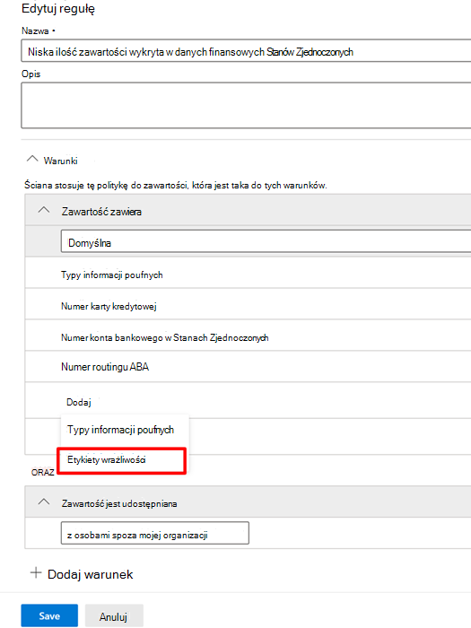

# Używanie etykiet wrażliwości jako warunków zasad DLP

Etykiet wrażliwości [można użyć](sensitivity-labels.md) jako warunku zasad DLP dla tych lokalizacji:

- Exchange Online-mail
- SharePoint Online
- OneDrive dla Firm witryn
- Windows 10 urządzenia

Etykiety wrażliwości są wyświetlane jako opcja na **liście Zawartość** zawiera.

> [!div class="mx-imgBorder"]
> 

> [!IMPORTANT]
> **Etykiety** wrażliwości jako warunku nie będą dostępne, jeśli wybrano opcję  Teams czatów i kanałów jako lokalizację do zastosowania zasad DLP.

## Obsługiwane elementy, scenariusze i porady dotyczące zasad

Etykiet wrażliwości można używać jako warunków dla tych elementów i w tych scenariuszach.

### Obsługiwane elementy

|Usługa  |Typ elementu  |Dostępne do porady dotyczącej zasad  |Można wymusić  |
|---------|---------|---------|---------|
|Exchange    |wiadomość e-mail         |tak         |tak         |
|Exchange    |załącznik wiadomości e-mail         |nie         |tak *         |
|SharePoint Online     |elementy w u SharePoint Online         |tak         |tak         |
|OneDrive dla Firm     |elementy         |tak         |tak         |
|Teams     |Teams wiadomości na kanale         |nie dotyczy         |nie dotyczy         |
|Teams     |załączniki         |tak **         |tak **         |
|Windows 10 urządzenia     |elementy         |tak         |tak         |
|MCAS (wersja zapoznawcza) |elementy         |tak         |tak         |

\*Wykrywanie DLP załączników wiadomości e-mail z etykietami wrażliwości jest obsługiwane tylko Office typów plików.

\** Załączniki wysyłane w Teams 1:1 na czacie lub kanałach są automatycznie przekazywane do OneDrive dla Firm i SharePoint. Jeśli więc SharePoint online lub usługi OneDrive dla Firm zostaną uwzględnione jako lokalizacje w Twoich zasadach DLP, załączniki z etykietami wysłane w programie Teams zostaną automatycznie uwzględnione w zakresie tego warunku. Teams jako lokalizacji nie musi być wybrane w zasadach DLP.

> [!NOTE]
> Możliwość wykrywania etykiet wrażliwości w usługach DLP SharePoint i OneDrive dla firm jest ograniczona. Aby uzyskać więcej informacji, zobacz [Włączanie etykiet wrażliwości Office plików w SharePoint i OneDrive](sensitivity-labels-sharepoint-onedrive-files.md#limitations).

### Obsługiwane scenariusze

- Gdy administrator usługi DLP zdecyduje się dołączyć co najmniej jedną etykietę wrażliwości jako warunek, będzie mógł wyświetlić listę wszystkich etykiet wrażliwości w dzierżawie.

- Używanie etykiet wrażliwości jako warunku jest obsługiwane we wszystkich obciążeniach pracą, jak podano w macierzy pomocy technicznej powyżej.

- Porady dotyczące zasad DLP będą nadal wyświetlane we wszystkich obciążeniach (z wyjątkiem Outlook Win32) w przypadku zasad DLP, które zawierają etykiety wrażliwości jako warunek.

- Etykiety wrażliwości będą również wyświetlane jako część wiadomości e-mail raportu o zdarzeniu, jeśli zasady DLP z etykietą wrażliwości jako warunek są dopasowane.

- Szczegóły etykiet wrażliwości będą również wyświetlane w dzienniku inspekcji dopasowania reguł DLP dla dopasowania zasad DLP, które zawiera etykietę wrażliwości jako warunek.

### Porady dotyczące zasad pomocy technicznej

|Obciążenie pracą  |Obsługiwane/nie obsługiwane porady dotyczące zasad  |
|---------|---------|
|OWA |    obsługiwane     |
|Outlook Win 32    |  nie jest obsługiwane       |
|SharePoint   |   obsługiwane      |
|OneDrive dla Firm    |    obsługiwane     |
|urządzenia punktu końcowego   |  nie jest obsługiwane       |
