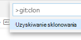
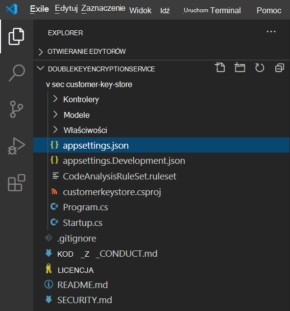
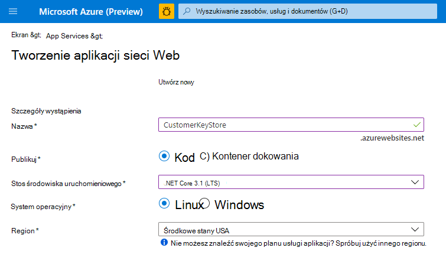
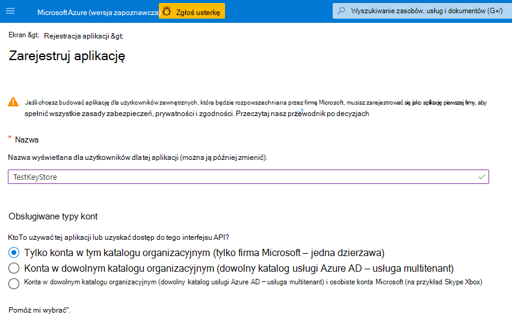

# <a name="double-key-encryption"></a>Podwójne szyfrowanie kluczy

> *Dotyczy: podwójne szyfrowanie kluczy w usłudze Microsoft Purview, [Microsoft Purview](https://www.microsoft.com/microsoft-365/business/compliance-management), [Azure Information Protection](https://azure.microsoft.com/pricing/)*
>
> *Instrukcje dla: [Klient ujednoliconego etykietowania platformy Azure Information Protection dla systemu Windows](/azure/information-protection/faqs#whats-the-difference-between-the-azure-information-protection-classic-and-unified-labeling-clients)*

> *Opis usługi dla: [Microsoft Purview](/office365/servicedescriptions/microsoft-365-service-descriptions/microsoft-365-tenantlevel-services-licensing-guidance/microsoft-365-security-compliance-licensing-guidance)*

Szyfrowanie podwójnym kluczem (DKE) używa dwóch kluczy razem w celu uzyskania dostępu do chronionej zawartości. Firma Microsoft przechowuje jeden klucz na platformie Microsoft Azure, a Ty jesteś w posiadaniu drugiego klucza. Możesz zachować pełną kontrolę nad jednym z kluczy przy użyciu usługi Double Key Encryption. Ochronę stosuje się przy użyciu klienta ujednoliconego etykietowania usługi Azure Information Protection do wysoce wrażliwej zawartości.

Usługa Double Key Encryption obsługuje wdrożenia w chmurze i lokalne. Te wdrożenia pomagają zapewnić, że zaszyfrowane dane pozostaną nieprzezroczysty wszędzie tam, gdzie przechowujesz chronione dane.

Aby uzyskać więcej informacji na temat domyślnych kluczy głównych dzierżawy opartej na chmurze, zobacz [Planowanie i implementowanie klucza dzierżawy usługi Azure Information Protection](/azure/information-protection/plan-implement-tenant-key).

## <a name="when-your-organization-should-adopt-dke"></a>Kiedy organizacja powinna wdrożyć usługę DKE

Szyfrowanie podwójnym kluczem jest przeznaczone dla najbardziej poufnych danych, które podlegają najsurowszym wymaganiom ochrony. Funkcja DKE nie jest przeznaczona dla wszystkich danych. Ogólnie rzecz biorąc, użyjesz szyfrowania podwójnym kluczem, aby chronić tylko niewielką część ogólnych danych. Należy dokładać należytej staranności w identyfikowaniu odpowiednich danych do objęcia tym rozwiązaniem przed wdrożeniem. W niektórych przypadkach może być konieczne zawężenie zakresu i użycie innych rozwiązań dla większości danych, takich jak Microsoft Purview Information Protection za pomocą kluczy zarządzanych przez firmę Microsoft lub BYOK. Te rozwiązania są wystarczające dla dokumentów, które nie podlegają rozszerzonej ochronie i wymaganiom prawnym. Ponadto te rozwiązania umożliwiają korzystanie z najbardziej zaawansowanych usług Office 365; usług, których nie można używać z zaszyfrowaną zawartością DKE. Przykład:

- Reguły transportu, w tym ochrona przed złośliwym oprogramowaniem i spamem, które wymagają wglądu w załącznik
- Microsoft Delve
- Zbierania elektronicznych materiałów dowodowych
- Wyszukiwanie i indeksowanie zawartości
- Web Apps pakietu Office, w tym funkcje współtworzenia

Wszystkie zewnętrzne aplikacje lub usługi, które nie są zintegrowane z usługą DKE za pośrednictwem zestawu SDK Microsoft Information Protection (MIP), nie będą w stanie wykonywać akcji na zaszyfrowanych danych.

Zestaw Microsoft Information Protection SDK 1.7+ obsługuje szyfrowanie podwójnym kluczem. Aplikacje integrujące się z naszym zestawem SDK mogą tworzyć przyczyny dla tych danych z wystarczającymi uprawnieniami i integracjami.

Użyj funkcji Microsoft Purview Information Protection (klasyfikacja i etykietowanie), aby chronić większość poufnych danych i używać tylko funkcji DKE dla danych o znaczeniu krytycznym. Szyfrowanie podwójnym kluczem jest istotne dla danych poufnych w wysoce regulowanych branżach, takich jak usługi finansowe i opieka zdrowotna.

Jeśli Twoje organizacje mają dowolne z następujących wymagań, możesz użyć funkcji DKE, aby zabezpieczyć zawartość:

- Chcesz mieć pewność, że w każdych okolicznościach *tylko ty możesz* odszyfrować chronioną zawartość.
- Nie chcesz, aby firma Microsoft miała dostęp do chronionych danych samodzielnie.
- Masz wymagania prawne dotyczące przechowywania kluczy w granicach geograficznych. Wszystkie klucze przechowywane na potrzeby szyfrowania i odszyfrowywania danych są przechowywane w centrum danych.

## <a name="system-and-licensing-requirements-for-dke"></a>Wymagania systemowe i licencyjne dotyczące usługi DKE

**Szyfrowanie podwójnym kluczem** jest dostarczane z Microsoft 365 E5. Jeśli nie masz licencji Microsoft 365 E5, możesz utworzyć konto [próbne](https://aka.ms/M365E5ComplianceTrial). Aby uzyskać więcej informacji na temat tych licencji, zobacz [Wskazówki dotyczące licencjonowania platformy Microsoft 365 dotyczące zgodności & zabezpieczeń](/office365/servicedescriptions/microsoft-365-service-descriptions/microsoft-365-tenantlevel-services-licensing-guidance/microsoft-365-security-compliance-licensing-guidance).

**Azure Information Protection**. Usługa DKE współpracuje z etykietami poufności i wymaga usługi Azure Information Protection.

Etykiety poufności DKE są udostępniane użytkownikom końcowym za pośrednictwem przycisku poufności w kliencie ujednoliconego etykietowania usługi AIP w usłudze Office Desktop Apps. Zainstaluj te wymagania wstępne na każdym komputerze klienckim, na którym chcesz chronić chronione dokumenty i korzystać z nich.

**Aplikacje pakietu Microsoft Office dla przedsiębiorstw** w wersji 2009 lub nowszej (wersje klasyczne programów Word, PowerPoint i Excel) w systemie Windows.

**Azure Information Protection Unified Labeling Client** w wersji 2.7.93.0 lub nowszej. Pobierz i zainstaluj klienta Unified Labeling z [centrum pobierania firmy Microsoft](https://www.microsoft.com/download/details.aspx?id=53018).

## <a name="supported-environments-for-storing-and-viewing-dke-protected-content"></a>Obsługiwane środowiska do przechowywania i wyświetlania zawartości chronionej przez funkcję DKE

**Obsługiwane aplikacje**. [Aplikacje Microsoft 365 dla przedsiębiorstw](https://www.microsoft.com/microsoft-365/business/microsoft-365-apps-for-enterprise-product) klientów w systemie Windows, w tym programów Word, Excel i PowerPoint.

**Obsługa zawartości online**. Dokumenty i pliki chronione za pomocą szyfrowania podwójnym kluczem można przechowywać w trybie online zarówno w programie Microsoft SharePoint, jak i w OneDrive dla Firm. Przed przekazaniem do tych lokalizacji należy oznaczyć i chronić dokumenty i pliki przy użyciu usługi DKE przy użyciu obsługiwanych aplikacji. Zaszyfrowaną zawartość można udostępniać pocztą e-mail, ale nie można wyświetlać zaszyfrowanych dokumentów i plików w trybie online. Zamiast tego należy wyświetlić chronioną zawartość przy użyciu obsługiwanych aplikacji klasycznych i klientów na komputerze lokalnym.

## <a name="overview-of-deploying-dke"></a>Omówienie wdrażania usługi DKE

Wykonaj te ogólne kroki, aby skonfigurować usługę DKE. Po wykonaniu tych kroków użytkownicy końcowi mogą chronić wysoce poufne dane za pomocą szyfrowania podwójnym kluczem.

1. Wdróż usługę DKE zgodnie z opisem w tym artykule.

2. Utwórz etykietę z podwójnym szyfrowaniem kluczy. W portal zgodności Microsoft Purview przejdź do obszaru **Ochrona informacji** i utwórz nową etykietę z funkcją podwójnego szyfrowania kluczy. Zobacz [Ograniczanie dostępu do zawartości przy użyciu etykiet poufności w celu zastosowania szyfrowania](./encryption-sensitivity-labels.md).

3. Użyj etykiet podwójnego szyfrowania kluczy. Chroń dane, wybierając etykietę Podwójny klucz szyfrowany na wstążce Poufność w pakiecie Microsoft Office.

Istnieje kilka sposobów wykonania niektórych kroków wdrażania szyfrowania podwójnym kluczem. Ten artykuł zawiera szczegółowe instrukcje umożliwiające mniej doświadczonym administratorom pomyślne wdrożenie usługi. Jeśli dobrze ci się to przydaje, możesz użyć własnych metod.

## <a name="deploy-dke"></a>Wdrażanie usługi DKE

Ten artykuł i wideo dotyczące wdrażania używają platformy Azure jako miejsca docelowego wdrożenia dla usługi DKE. Jeśli wdrażasz w innej lokalizacji, musisz podać własne wartości.


Wykonaj te ogólne kroki, aby skonfigurować szyfrowanie podwójnego klucza dla organizacji.

1. [Instalowanie wymagań wstępnych dotyczących oprogramowania dla usługi DKE](#install-software-prerequisites-for-the-dke-service)
1. [Klonowanie repozytorium GitHub z podwójnym szyfrowaniem kluczy](#clone-the-dke-github-repository)
1. [Modyfikowanie ustawień aplikacji](#modify-application-settings)
1. [Generowanie kluczy testowych](#generate-test-keys)
1. [Tworzenie projektu](#build-the-project)
1. [Wdrażanie usługi DKE i publikowanie magazynu kluczy](#deploy-the-dke-service-and-publish-the-key-store)
1. [Sprawdzanie poprawności wdrożenia](#validate-your-deployment)
1. [Rejestrowanie magazynu kluczy](#register-your-key-store)
1. [Tworzenie etykiet poufności przy użyciu usługi DKE](#create-sensitivity-labels-using-dke)
1. [Włączanie funkcji DKE w kliencie](#enable-dke-in-your-client)
1. [Migrowanie chronionych plików z etykiet HYOK do etykiet DKE](#migrate-protected-files-from-hyok-labels-to-dke-labels)

Po zakończeniu możesz szyfrować dokumenty i pliki przy użyciu usługi DKE. Aby uzyskać informacje, zobacz [Stosowanie etykiet poufności do plików i wiadomości e-mail w pakiecie Office](https://support.microsoft.com/office/2f96e7cd-d5a4-403b-8bd7-4cc636bae0f9).

### <a name="install-software-prerequisites-for-the-dke-service"></a>Instalowanie wymagań wstępnych dotyczących oprogramowania dla usługi DKE

Zainstaluj te wymagania wstępne na komputerze, na którym chcesz zainstalować usługę DKE.

**Zestaw .NET Core 3.1 SDK**. Pobierz i zainstaluj zestaw SDK ze [strony Pobierz platformę .NET Core 3.1](https://dotnet.microsoft.com/download/dotnet-core/3.1).

**Visual Studio Code**. Pobierz Visual Studio Code z programu [https://code.visualstudio.com/](https://code.visualstudio.com). Po zainstalowaniu uruchom polecenie Visual Studio Code i wybierz pozycję **Wyświetl** \> **rozszerzenia**. Zainstaluj te rozszerzenia.

- Język C# dla Visual Studio Code

- Menedżer pakietów NuGet

**Zasoby usługi Git**. Pobierz i zainstaluj jedną z następujących opcji.

- [Git](https://git-scm.com/downloads)

- [GitHub Desktop](https://desktop.github.com/)

- [GitHub Enterprise](https://github.com/enterprise)

**Openssl** Aby [wygenerować klucze testowe](#generate-test-keys) po wdrożeniu usługi DKE, należy zainstalować program [OpenSSL](https://slproweb.com/products/Win32OpenSSL.html). Upewnij się, że wywołujesz ją poprawnie ze ścieżki zmiennych środowiskowych. Aby uzyskać szczegółowe informacje, zobacz "Dodawanie katalogu instalacyjnego do ścieżki" [https://www.osradar.com/install-openssl-windows/](https://www.osradar.com/install-openssl-windows/) .

### <a name="clone-the-dke-github-repository"></a>Klonowanie repozytorium GitHub DKE

Firma Microsoft dostarcza pliki źródłowe DKE w repozytorium GitHub. Sklonujesz repozytorium, aby skompilować projekt lokalnie na potrzeby organizacji. Repozytorium GitHub DKE znajduje się pod adresem [https://github.com/Azure-Samples/DoubleKeyEncryptionService](https://github.com/Azure-Samples/DoubleKeyEncryptionService).

Poniższe instrukcje są przeznaczone dla niedoświadczonych użytkowników git lub Visual Studio Code:

1. W przeglądarce przejdź do: [https://github.com/Azure-Samples/DoubleKeyEncryptionService](https://github.com/Azure-Samples/DoubleKeyEncryptionService).

2. W prawej części ekranu wybierz pozycję **Kod**. W twojej wersji interfejsu użytkownika może zostać wyświetlony przycisk **Klonuj lub pobierz** . Następnie na wyświetlonej liście rozwijanej wybierz ikonę kopiowania, aby skopiować adres URL do schowka.

    Przykład:

   > [!div class="mx-imgBorder"]
   > 

3. W Visual Studio Code wybierz pozycję **Wyświetl** \> **paletę poleceń** i wybierz pozycję **Git: Klonuj**. Aby przejść do opcji na liście, rozpocznij wpisywanie `git: clone` , aby filtrować wpisy, a następnie wybierz je z listy rozwijanej. Przykład:

   > [!div class="mx-imgBorder"]
   > 

4. W polu tekstowym wklej adres URL skopiowany z usługi Git i wybierz pozycję **Klonuj z usługi GitHub**.

5. W wyświetlonym oknie dialogowym **Wybieranie folderu** przejdź do i wybierz lokalizację do przechowywania repozytorium. W wierszu polecenia wybierz pozycję **Otwórz**.

    Repozytorium zostanie otwarte w Visual Studio Code i wyświetli bieżącą gałąź Git w lewym dolnym rogu. Na przykład gałąź powinna być **główna**. Przykład:

   

6. Jeśli nie jesteś w gałęzi głównej, musisz ją wybrać. W Visual Studio Code wybierz gałąź i wybierz pozycję **main** z listy wyświetlanych gałęzi.

   > [!IMPORTANT]
   > Wybranie gałęzi głównej gwarantuje, że masz odpowiednie pliki do skompilowania projektu. Jeśli nie wybierzesz odpowiedniej gałęzi, wdrożenie zakończy się niepowodzeniem.

Repozytorium źródłowe DKE jest teraz skonfigurowane lokalnie. Następnie [zmodyfikuj ustawienia aplikacji](#modify-application-settings) dla swojej organizacji.

### <a name="modify-application-settings"></a>Modyfikowanie ustawień aplikacji

Aby wdrożyć usługę DKE, należy zmodyfikować następujące typy ustawień aplikacji:

- [Ustawienia dostępu do klucza](#key-access-settings)
- [Ustawienia dzierżawy i klucza](#tenant-and-key-settings)

Ustawienia aplikacji można modyfikować w pliku appsettings.json. Ten plik znajduje się w repozytorium DoubleKeyEncryptionService sklonowanym lokalnie w obszarze DoubleKeyEncryptionService\src\customer-key-store. Na przykład w Visual Studio Code możesz przejść do pliku, jak pokazano na poniższej ilustracji.



#### <a name="key-access-settings"></a>Ustawienia dostępu do klucza

Określ, czy chcesz używać poczty e-mail, czy autoryzacji roli. Usługa DKE obsługuje jednocześnie tylko jedną z tych metod uwierzytelniania.

- **Autoryzacja wiadomości e-mail**. Umożliwia organizacji autoryzowanie dostępu do kluczy tylko na podstawie adresów e-mail.

- **Autoryzacja roli**. Umożliwia organizacji autoryzowanie dostępu do kluczy na podstawie grup usługi Active Directory i wymaga, aby usługa internetowa mogła wykonywać zapytania dotyczące protokołu LDAP.

##### <a name="to-set-key-access-settings-for-dke-using-email-authorization"></a>Aby ustawić ustawienia dostępu do klucza dla usługi DKE przy użyciu autoryzacji poczty e-mail

1. Otwórz plik **appsettings.json** i znajdź `AuthorizedEmailAddress` to ustawienie.

2. Dodaj adres e-mail lub adresy, które chcesz autoryzować. Rozdziel wiele adresów e-mail podwójnymi cudzysłowami i przecinkami. Przykład:

   ```json
   "AuthorizedEmailAddress": ["email1@company.com", "email2@company.com ", "email3@company.com"]
   ```

3. `LDAPPath` Znajdź ustawienie i usuń tekst `If you use role authorization (AuthorizedRoles) then this is the LDAP path.` między podwójnymi cudzysłowami. Pozostaw podwójny cudzysłów w miejscu. Po zakończeniu ustawienie powinno wyglądać następująco.

   ```json
   "LDAPPath": ""
   ```

4. `AuthorizedRoles` Znajdź ustawienie i usuń cały wiersz.

Ten obraz przedstawia plik **appsettings.json** poprawnie sformatowany pod kątem autoryzacji poczty e-mail.

   

##### <a name="to-set-key-access-settings-for-dke-using-role-authorization"></a>Aby ustawić ustawienia dostępu do klucza dla usługi DKE przy użyciu autoryzacji roli

1. Otwórz plik **appsettings.json** i znajdź `AuthorizedRoles` to ustawienie.

2. Dodaj nazwy grup usługi Active Directory, które chcesz autoryzować. Rozdziel wiele nazw grup za pomocą podwójnych cudzysłowów i przecinków. Przykład:

   ```json
   "AuthorizedRoles": ["group1", "group2", "group3"]
   ```

3. `LDAPPath` Znajdź ustawienie i dodaj domenę usługi Active Directory. Przykład:

   ```json
   "LDAPPath": "contoso.com"
   ```

4. `AuthorizedEmailAddress` Znajdź ustawienie i usuń cały wiersz.

Ten obraz przedstawia plik **appsettings.json** poprawnie sformatowany pod kątem autoryzacji roli.

   

#### <a name="tenant-and-key-settings"></a>Ustawienia dzierżawy i klucza

Ustawienia dzierżawy i klucza usługi DKE znajdują się w pliku **appsettings.json** .

##### <a name="to-configure-tenant-and-key-settings-for-dke"></a>Aby skonfigurować ustawienia dzierżawy i klucza dla usługi DKE

1. Otwórz plik **appsettings.json** .

2. Znajdź ustawienie i zastąp `ValidIssuers` `<tenantid>` ciąg identyfikatorem dzierżawy. Identyfikator dzierżawy można zlokalizować, przechodząc do Azure Portal i wyświetlając [właściwości dzierżawy](https://aad.portal.azure.com/#blade/Microsoft_AAD_IAM/ActiveDirectoryMenuBlade/Properties). Przykład:

   ```json
   "ValidIssuers": [
     "https://sts.windows.net/9c99431e-b513-44be-a7d9-e7b500002d4b/"
   ]
   ```

> [!NOTE]
> Jeśli chcesz włączyć zewnętrzny dostęp B2B do magazynu kluczy, musisz również uwzględnić te dzierżawy zewnętrzne jako część listy prawidłowych wystawców.

Znajdź element `JwtAudience`. Zastąp `<yourhostname>` element nazwą hosta maszyny, na której zostanie uruchomiona usługa DKE. Na przykład: "https://dkeservice.contoso.com"

  > [!IMPORTANT]
  > Wartość musi `JwtAudience` *być dokładnie* zgodna z nazwą hosta.  

- `TestKeys:Name`. Wprowadź nazwę klucza. Przykład: `TestKey1`
- `TestKeys:Id`. Utwórz identyfikator GUID i wprowadź go jako `TestKeys:ID` wartość. Na przykład `DCE1CC21-FF9B-4424-8FF4-9914BD19A1BE`. Aby losowo wygenerować identyfikator GUID, możesz użyć witryny takiej jak [generator identyfikatorów GUID online](https://guidgenerator.com/) .

Ten obraz przedstawia prawidłowy format ustawień dzierżawy i kluczy w **pliku appsettings.json**. `LDAPPath` jest skonfigurowany do autoryzacji roli.


### <a name="generate-test-keys"></a>Generowanie kluczy testowych

Po zdefiniowaniu ustawień aplikacji możesz wygenerować publiczne i prywatne klucze testowe.

Aby wygenerować klucze:

1. Z menu Start systemu Windows uruchom wiersz polecenia OpenSSL.

1. Przejdź do folderu, w którym chcesz zapisać klucze testowe. Pliki utworzone przez wykonanie kroków w tym zadaniu są przechowywane w tym samym folderze.

1. Wygeneruj nowy klucz testowy.

   ```console
   openssl req -x509 -newkey rsa:2048 -keyout key.pem -out cert.pem -days 365
   ```

1. Wygeneruj klucz prywatny.

   Jeśli zainstalowano program OpenSSL w wersji 3 lub nowszej, uruchom następujące polecenie:
  
  ```console
  openssl rsa -in key.pem -out privkeynopass.pem -outform PEM -traditional
  ```
  
>  W przeciwnym razie uruchom następujące polecenie:
>  ```console
>  openssl rsa -in key.pem -out privkeynopass.pem -outform PEM
>  ```

1. Wygeneruj klucz publiczny.

   ```console
   openssl rsa -in key.pem -pubout > pubkeyonly.pem
   ```

1. W edytorze tekstów otwórz **plik pubkeyonly.pem**. Skopiuj całą zawartość pliku **pubkeyonly.pem z wyjątkiem** pierwszego i ostatniego wiersza do `PublicPem` sekcji pliku **appsettings.json** .

1. W edytorze tekstów otwórz **plik privkeynopass.pem**. Skopiuj całą zawartość w pliku **privkeynopass.pem, z wyjątkiem** pierwszego i ostatniego wiersza, do `PrivatePem` sekcji pliku **appsettings.json** .

1. Usuń wszystkie puste spacje i nowe wiersze w `PublicPem` sekcjach i `PrivatePem` .

    > [!IMPORTANT]
    > Podczas kopiowania tej zawartości nie usuwaj żadnych danych PEM.

1. W Visual Studio Code przejdź do pliku **Startup.cs**. Ten plik znajduje się w repozytorium DoubleKeyEncryptionService sklonowanym lokalnie w obszarze DoubleKeyEncryptionService\src\customer-key-store\.

1. Znajdź następujące wiersze:

    ```csharp
        #if USE_TEST_KEYS
        #error !!!!!!!!!!!!!!!!!!!!!! Use of test keys is only supported for testing,
        DO NOT USE FOR PRODUCTION !!!!!!!!!!!!!!!!!!!!!!!!!!!!!
        services.AddSingleton<ippw.IKeyStore, ippw.TestKeyStore>();
        #endif
    ```

1. Zastąp te wiersze następującym tekstem:

    ```csharp
    services.AddSingleton<ippw.IKeyStore, ippw.TestKeyStore>();
    ```

    Wyniki końcowe powinny wyglądać podobnie do następujących.

    

Teraz możesz przystąpić do [tworzenia projektu DKE](#build-the-project).

### <a name="build-the-project"></a>Tworzenie projektu

Użyj następujących instrukcji, aby skompilować projekt DKE lokalnie:

1. W Visual Studio Code w repozytorium usługi DKE wybierz pozycję **Wyświetl** \> **paletę poleceń**, a następnie wpisz **kompilację** w wierszu polecenia.

2. Z listy wybierz pozycję **Zadania: Uruchom zadanie kompilacji**.

   Jeśli nie znaleziono żadnych zadań kompilacji, wybierz pozycję **Konfiguruj zadanie kompilacji** i utwórz je dla platformy .NET Core w następujący sposób.

   

   1. Wybierz pozycję **Utwórz plik tasks.json z szablonu**.

      

   2. Z listy typów szablonów wybierz pozycję **.NET Core**.

      

   3. W sekcji kompilacji znajdź ścieżkę do pliku **customerkeystore.csproj** . Jeśli go tam nie ma, dodaj następujący wiersz:

      ```json
      "${workspaceFolder}/src/customer-key-store/customerkeystore.csproj",
      ```

   4. Uruchom ponownie kompilację.

3. Sprawdź, czy w oknie danych wyjściowych nie występują czerwone błędy.

   Jeśli występują czerwone błędy, sprawdź dane wyjściowe konsoli. Upewnij się, że wszystkie poprzednie kroki zostały wykonane poprawnie, a poprawne wersje kompilacji są obecne.


Konfiguracja została ukończona. Przed opublikowaniem magazynu kluczy w pliku appsettings.json dla ustawienia JwtAudience upewnij się, że wartość nazwy hosta jest dokładnie zgodna z nazwą hosta App Service. 

### <a name="deploy-the-dke-service-and-publish-the-key-store"></a>Wdrażanie usługi DKE i publikowanie magazynu kluczy

W przypadku wdrożeń produkcyjnych wdróż usługę w chmurze innej firmy lub [opublikuj w systemie lokalnym](/aspnet/core/tutorials/publish-to-iis?preserve-view=true&tabs=netcore-cli&view=aspnetcore-3.1).

Możesz preferować inne metody wdrażania kluczy. Wybierz metodę, która najlepiej sprawdza się w twojej organizacji.

W przypadku wdrożeń pilotażowych można wdrażać na platformie Azure i od razu rozpocząć pracę.

#### <a name="to-create-an-azure-web-app-instance-to-host-your-dke-deployment"></a>Aby utworzyć wystąpienie aplikacji internetowej platformy Azure do hostowania wdrożenia DKE

Aby opublikować magazyn kluczy, utworzysz wystąpienie Azure App Service do hostowania wdrożenia DKE. Następnie opublikujesz wygenerowane klucze na platformie Azure.

1. W przeglądarce zaloguj się do [Azure Portal firmy Microsoft](https://ms.portal.azure.com) i przejdź do pozycji **Dodaj usługi App Services** > .

2. Wybierz subskrypcję i grupę zasobów i zdefiniuj szczegóły wystąpienia.

   - Wprowadź nazwę hosta komputera, na którym chcesz zainstalować usługę DKE. Upewnij się, że jest to nazwa zdefiniowana dla ustawienia JwtAudience w pliku [**appsettings.json**](#tenant-and-key-settings) . Podaną wartością nazwy jest również nazwa WebAppInstanceName.

   - W polu **Publikuj** wybierz **kod**, a w polu **Stos środowiska uruchomieniowego** wybierz pozycję **.NET Core 3.1**.

   Przykład:

   > [!div class="mx-imgBorder"]
   > 

3. W dolnej części strony wybierz pozycję **Przejrzyj i utwórz**, a następnie wybierz pozycję **Dodaj**.

4. Wykonaj jedną z następujących czynności, aby opublikować wygenerowane klucze:

   - [Publikowanie za pośrednictwem narzędzia ZipDeployUI](#publish-via-zipdeployui)
   - [Publikowanie za pośrednictwem protokołu FTP](#publish-via-ftp)
   - [Publikowanie za pośrednictwem programu Visual Studio 2019 lub nowszego](/aspnet/core/tutorials/)

#### <a name="publish-via-zipdeployui"></a>Publikowanie za pośrednictwem narzędzia ZipDeployUI

1. Przejdź do `https://<WebAppInstanceName>.scm.azurewebsites.net/ZipDeployUI`.

   Przykład: `https://dkeservice.contoso.scm.azurewebsites.net/ZipDeployUI`

2. W bazie kodu magazynu kluczy przejdź do folderu **customer-key-store\src\customer-key-store** i sprawdź, czy ten folder zawiera plik **customerkeystore.csproj** .

3. Uruchamianie: **publikowanie dotnet**

   W oknie danych wyjściowych zostanie wyświetlony katalog, w którym wdrożono publikowanie.

   Przykład: `customer-key-store\src\customer-key-store\bin\Debug\netcoreapp3.1\publish\`

4. Wyślij wszystkie pliki w katalogu publikowania do pliku .zip. Podczas tworzenia pliku .zip upewnij się, że wszystkie pliki w katalogu znajdują się na poziomie głównym pliku .zip.

5. Przeciągnij i upuść utworzony plik .zip do otwartej powyżej witryny ZipDeployUI. Przykład: `https://dkeservice.scm.azurewebsites.net/ZipDeployUI`

Usługa DKE została wdrożona i możesz przejść do utworzonych kluczy testowych. Kontynuuj [sprawdzanie poprawności wdrożenia](#validate-your-deployment) poniżej.

#### <a name="publish-via-ftp"></a>Publikowanie za pośrednictwem protokołu FTP

1. Połącz się z utworzonym [powyżej](#deploy-the-dke-service-and-publish-the-key-store) App Service.

   W przeglądarce przejdź do obszaru: **Azure Portal** >  **App Service** >  **Deployment Center****Manual Deployment** >  FTP **Dashboard (Pulpit nawigacyjny** **FTP** >  w centrum  >  wdrażania ręcznego).

2. Skopiuj parametry połączenia wyświetlane do pliku lokalnego. Użyjesz tych ciągów, aby nawiązać połączenie z siecią Web App Service i przekazać pliki za pośrednictwem protokołu FTP.

   Przykład:

   

3. W bazie kodu magazynu **kluczy przejdź do katalogu customer-key-store\src\customer-key-store**.

4. Sprawdź, czy ten katalog zawiera plik **customerkeystore.csproj** .

5. Uruchamianie: **publikowanie dotnet**

   Dane wyjściowe zawierają katalog, w którym wdrożono publikowanie.

   Przykład: `customer-key-store\src\customer-key-store\bin\Debug\netcoreapp3.1\publish\`

6. Wyślij wszystkie pliki w katalogu publikowania do pliku zip. Podczas tworzenia pliku .zip upewnij się, że wszystkie pliki w katalogu znajdują się na poziomie głównym pliku .zip.

7. Z poziomu klienta FTP użyj skopiowanych informacji o połączeniu, aby nawiązać połączenie z App Service. Przekaż plik .zip utworzony w poprzednim kroku do katalogu głównego aplikacji internetowej.

Usługa DKE została wdrożona i możesz przejść do utworzonych kluczy testowych. Następnie [zweryfikuj wdrożenie](#validate-your-deployment).

### <a name="validate-your-deployment"></a>Sprawdzanie poprawności wdrożenia

Po wdrożeniu usługi DKE przy użyciu jednej z metod opisanych powyżej zweryfikuj wdrożenie i ustawienia magazynu kluczy.

Uruchomić:

```powershell
src\customer-key-store\scripts\key_store_tester.ps1 dkeserviceurl/mykey
```

Przykład:

```powershell
key_store_tester.ps1 https://dkeservice.contoso.com/TestKey1
```

Upewnij się, że w danych wyjściowych nie są wyświetlane żadne błędy. Gdy wszystko będzie gotowe, [zarejestruj magazyn kluczy](#register-your-key-store).

Nazwa klucza uwzględnia wielkość liter. Wprowadź nazwę klucza wyświetlaną w pliku appsettings.json.

## <a name="register-your-key-store"></a>Rejestrowanie magazynu kluczy

Poniższe kroki umożliwiają zarejestrowanie usługi DKE. Rejestrowanie usługi DKE jest ostatnim krokiem wdrażania usługi DKE przed rozpoczęciem tworzenia etykiet.

Aby zarejestrować usługę DKE:

1. W przeglądarce otwórz [Azure Portal firmy Microsoft](https://ms.portal.azure.com/) i przejdź do pozycji Wszystkie **rejestracje aplikacji** **tożsamości** \> **usług**\>.

2. Wybierz pozycję **Nowa rejestracja** i wprowadź zrozumiałą nazwę.

3. Wybierz typ konta z wyświetlonych opcji.

    Przykład:

   > [!div class="mx-imgBorder"]
   > 

4. W dolnej części strony wybierz pozycję **Zarejestruj** , aby utworzyć nową rejestrację aplikacji.

5. W nowej rejestracji aplikacji w okienku po lewej stronie w obszarze **Zarządzanie** wybierz pozycję **Uwierzytelnianie**.

6. Wybierz **pozycję Dodaj platformę**.

7. W oknie podręcznym **Konfigurowanie platform** wybierz pozycję **Sieć Web**.

8. W obszarze **Identyfikatory URI przekierowania** wprowadź identyfikator URI usługi szyfrowania podwójnego klucza. Wprowadź adres URL App Service, w tym nazwę hosta i domenę.

   Przykład: `https://mydkeservicetest.com`

   - Wprowadzony adres URL musi być zgodny z nazwą hosta, w której wdrożono usługę DKE.
   - Domena musi być [zweryfikowaną domeną](/azure/active-directory/develop/reference-breaking-changes#appid-uri-in-single-tenant-applications-will-require-use-of-default-scheme-or-verified-domains).
    - We wszystkich przypadkach schemat musi być **https**.

   Upewnij się, że nazwa hosta jest dokładnie zgodna z nazwą hosta App Service.

9. W obszarze **Przyznawanie niejawne** zaznacz pole wyboru **Tokeny identyfikatorów** .

10. Wybierz opcję **Zapisz**, aby zapisać zmiany.

11. W okienku po lewej stronie wybierz **pozycję Uwidaczniaj interfejs API** obok pozycji Identyfikator URI aplikacji, wprowadź adres URL App Service, w tym nazwę hosta i domenę, a następnie wybierz pozycję **Ustaw**.

12. Nadal na stronie **Uwidacznianie interfejsu API** w **obszarze Zakresy zdefiniowane przez ten obszar interfejsu API** wybierz **pozycję Dodaj zakres**. W nowym zakresie:

    1. Zdefiniuj nazwę zakresu jako **user_impersonation**.

    2. Wybierz administratorów i użytkowników, którzy mogą wyrazić zgodę.

    3. Zdefiniuj wszystkie pozostałe wymagane wartości.

    4. Wybierz pozycję **Dodaj zakres**.

    5. Wybierz pozycję **Zapisz** u góry, aby zapisać zmiany.

13. Nadal na stronie **Uwidacznianie interfejsu API** w obszarze **Autoryzowane aplikacje klienckie** wybierz **pozycję Dodaj aplikację kliencką**.

    W nowej aplikacji klienckiej:

    1. Zdefiniuj identyfikator klienta jako `d3590ed6-52b3-4102-aeff-aad2292ab01c`. Ta wartość jest identyfikatorem klienta pakietu Microsoft Office i umożliwia pakietowi Office uzyskanie tokenu dostępu dla magazynu kluczy.

    2. W obszarze **Autoryzowane zakresy** wybierz **zakres user_impersonation** .

    3. Wybierz pozycję **Dodaj aplikację**.

    4. Wybierz pozycję **Zapisz** u góry, aby zapisać zmiany.

    5. Powtórz te kroki, ale tym razem zdefiniuj identyfikator klienta jako `c00e9d32-3c8d-4a7d-832b-029040e7db99`. Ta wartość to identyfikator klienta ujednoliconego etykietowania platformy Azure Information Protection.

Twoja usługa DKE jest teraz zarejestrowana. Kontynuuj [, tworząc etykiety przy użyciu usługi DKE](#create-sensitivity-labels-using-dke).

## <a name="create-sensitivity-labels-using-dke"></a>Tworzenie etykiet poufności przy użyciu usługi DKE

W portal zgodności Microsoft Purview utwórz nową etykietę poufności i zastosuj szyfrowanie tak, jak w przeciwnym razie. Wybierz pozycję **Użyj szyfrowania podwójnym kluczem** i wprowadź adres URL punktu końcowego klucza. Musisz uwzględnić nazwę klucza podaną w sekcji "TestKeys" pliku appsettings.json w adresie URL.

Przykład: `https://testingdke1.azurewebsites.net/KEYNAME`

> [!div class="mx-imgBorder"]
> 

Wszystkie dodane etykiety DKE zaczną być wyświetlane dla użytkowników w najnowszych wersjach Aplikacje Microsoft 365 dla przedsiębiorstw.

> [!NOTE]
> Odświeżenie klientów przy użyciu nowych etykiet może potrwać do 24 godzin.

### <a name="enable-dke-in-your-client"></a>Włączanie funkcji DKE w kliencie

Jeśli jesteś niejawnym testerem pakietu Office, funkcja DKE jest włączona. W przeciwnym razie włącz funkcję DKE dla klienta, dodając następujące klucze rejestru:

```console
   [HKEY_LOCAL_MACHINE\SOFTWARE\WOW6432Node\Microsoft\MSIPC\flighting]
   "DoubleKeyProtection"=dword:00000001

   [HKEY_LOCAL_MACHINE\SOFTWARE\Microsoft\MSIPC\flighting]
   "DoubleKeyProtection"=dword:00000001
```

## <a name="migrate-protected-files-from-hyok-labels-to-dke-labels"></a>Migrowanie chronionych plików z etykiet HYOK do etykiet DKE

Jeśli chcesz, po zakończeniu konfigurowania usługi DKE możesz migrować chronioną zawartość przy użyciu etykiet HYOK do etykiet DKE. Aby przeprowadzić migrację, użyjesz skanera usługi AIP. Aby rozpocząć korzystanie ze skanera, zobacz [Co to jest ujednolicony skaner etykietowania usługi Azure Information Protection?](/azure/information-protection/deploy-aip-scanner).

Jeśli nie przeprowadzisz migracji zawartości, zawartość chroniona przez funkcję HYOK pozostanie nienaruszona.

## <a name="other-deployment-options"></a>Inne opcje wdrażania

Zdajemy sobie sprawę, że w przypadku niektórych klientów w branżach wysoce regulowanych ta standardowa implementacja referencyjna przy użyciu kluczy opartych na oprogramowaniu może nie być wystarczająca do spełnienia ich zwiększonych obowiązków i potrzeb w zakresie zgodności. Nawiązaliśmy współpracę z dostawcami sprzętowych modułów zabezpieczeń (HSM) innych firm, aby obsługiwać rozszerzone opcje zarządzania kluczami w usłudze DKE, w tym:

- [Powierzyć](https://www.entrust.com/digital-security/hsm/services/packaged-services/double-key-encryption-integration#:~:text=Entrust%20Double%20Key%20Encryption%20for%20Microsoft%20AIP%2C%20offered,trust%20for%20the%20protection%20of%20sensitive%20cryptographic%20keys.)

- [Thales](https://cpl.thalesgroup.com/cloud-security/encryption/double-key-encryption)

Skontaktuj się bezpośrednio z tymi dostawcami, aby uzyskać więcej informacji i wskazówek dotyczących ich rozwiązań hsm DKE na rynku.
