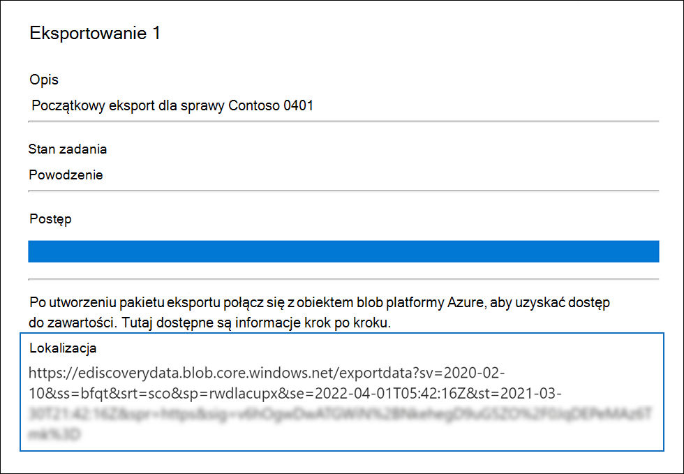
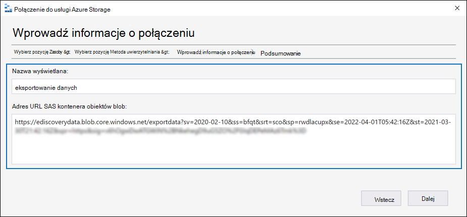
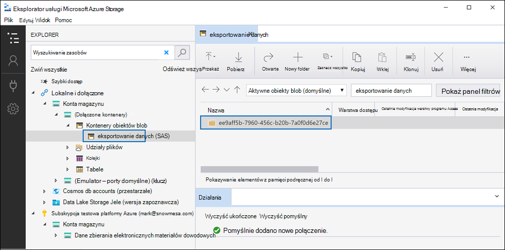

# Eksportowanie dokumentów w zestawie przeglądów do konta usługi Azure Storage

[!include[Purview banner](../includes/purview-rebrand-banner.md)]

Podczas eksportowania dokumentów z zestawu przeglądów w przypadku zbierania elektronicznych materiałów dowodowych (Premium) można je wyeksportować na konto usługi Azure Storage zarządzane przez organizację. Jeśli użyjesz tej opcji, dokumenty zostaną przekazane do lokalizacji Storage platformy Azure. Po ich wyeksportowaniu można uzyskać dostęp do dokumentów (i pobrać je na komputer lokalny lub inną lokalizację) przy użyciu Eksplorator usługi Azure Storage. Ten artykuł zawiera instrukcje dotyczące eksportowania dokumentów na konto usługi Azure Storage oraz korzystania z Eksplorator usługi Azure Storage w celu nawiązania połączenia z lokalizacją Storage platformy Azure w celu pobrania wyeksportowanych dokumentów. Aby uzyskać więcej informacji na temat Eksplorator usługi Azure Storage, zobacz [Korzystanie z Eksplorator usługi Azure Storage](/azure/storage/blobs/storage-quickstart-blobs-storage-explorer).

## Przed wyeksportowaniem dokumentów z zestawu przeglądów

- Należy podać token sygnatury dostępu współdzielonego (SAS) dla konta usługi Azure Storage oraz adres URL określonego kontenera na koncie magazynu w celu wyeksportowania dokumentów z zestawu przeglądów. Pamiętaj, aby mieć je pod ręką (na przykład skopiowane do pliku tekstowego) podczas wykonywania kroku 2

  - **Token sygnatury** dostępu współdzielonego: upewnij się, że token SAS jest przeznaczony dla konta usługi Azure Storage (a nie dla kontenera). Token sygnatury dostępu współdzielonego dla konta można wygenerować w usłudze Azure Storage. W tym celu przejdź do konta usługi Azure Storage i wybierz pozycję **Udostępnij sygnaturę dostępu** w obszarze ustawień **Ustawienia** w bloku konta magazynu. Użyj ustawień domyślnych i zezwalaj na wszystkie typy zasobów podczas generowania tokenu SAS.

  - **Adres URL kontenera**: musisz utworzyć kontener, na który mają zostać przekazane dokumenty zestawu przeglądów, a następnie pobrać kopię adresu URL kontenera; na przykład `https://ediscoverydata.blob.core.windows.net/exportdata`. Aby uzyskać adres URL, przejdź do kontenera w usłudze Azure Storage i wybierz pozycję **Właściwości** w sekcji **Ustawienia** w bloku kontenera.

- Pobierz i zainstaluj Eksplorator usługi Azure Storage. Aby uzyskać instrukcje, zobacz [narzędzie Eksplorator usługi Azure Storage](https://go.microsoft.com/fwlink/p/?LinkId=544842). To narzędzie służy do nawiązywania połączenia z kontenerem na koncie usługi Azure Storage i pobierania dokumentów wyeksportowanych w kroku 1.

## Krok 1. Eksportowanie dokumentów z zestawu przeglądów

Pierwszym krokiem jest utworzenie zadania eksportu w celu wyeksportowania dokumentów z zestawu przeglądów. Aby uzyskać bardziej szczegółowe instrukcje dotyczące wszystkich opcji eksportu, zobacz [Eksportowanie dokumentów z zestawu przeglądów](export-documents-from-review-set.md). Poniższa procedura wyróżnia ustawienia eksportowania dokumentów do konta usługi Azure Storage w organizacji.

1. W portalu zgodności usługi Microsoft Purview otwórz przypadek zbierania elektronicznych materiałów dowodowych (Premium), wybierz kartę **Zestawy przeglądów**, a następnie wybierz zestaw przeglądów, który chcesz wyeksportować.

2. W zestawie przeglądów kliknij pozycję **ActionExport** > .

3. Na wysuwanej stronie **Opcje eksportu** wpisz nazwę (wymagane) i opis (opcjonalnie) eksportu.

4. Skonfiguruj ustawienia w sekcjach dokumenty, metadane, zawartość i opcje. Aby uzyskać więcej informacji na temat tych ustawień, zobacz [Eksportowanie dokumentów z zestawu przeglądów](export-documents-from-review-set.md).

5. W sekcji **Opcje danych wyjściowych** wybierz opcję **Skrócona struktura katalogów wyeksportowana do konta usługi Azure Storage**.

6. Wklej adres URL kontenera i token SAS dla konta magazynu w odpowiednich polach.

   

7. Kliknij **pozycję Eksportuj** , aby utworzyć zadanie eksportu.

## Krok 2. Uzyskiwanie adresu URL sygnatury dostępu współdzielonego z zadania eksportu

Następnym krokiem jest uzyskanie adresu URL sygnatury dostępu współdzielonego wygenerowanego po utworzeniu zadania eksportu w kroku 1. Adres URL sygnatury dostępu współdzielonego służy do nawiązywania połączenia z kontenerem na koncie usługi Azure Storage, na które wyeksportowano dokumenty zestawu przeglądów.

1. Na stronie **eDiscovery (Premium)** przejdź do sprawy, a następnie kliknij kartę **Eksporty**.

2. Na **karcie Eksporty** kliknij zadanie eksportu, które chcesz pobrać. Jest to zadanie eksportu utworzone w kroku 1.

3. Na stronie wysuwanej w obszarze **Lokalizacje skopiuj** wyświetlony adres URL sygnatury dostępu współdzielonego. W razie potrzeby możesz zapisać go w pliku tekstowym, aby uzyskać do niego dostęp w kroku 3.

   

   > [!TIP]
   > Adres URL sygnatury dostępu współdzielonego wyświetlany w zadaniu eksportowania to łączenie adresu URL kontenera i tokenu SAS dla konta usługi Azure Storage. Możesz skopiować go z zadania eksportu lub utworzyć samodzielnie, łącząc adres URL i token SAS.

## Krok 3. Połączenie do kontenera usługi Azure Storage

Ostatnim krokiem jest użycie Eksplorator usługi Azure Storage i adresu URL sygnatury dostępu współdzielonego w celu nawiązania połączenia z kontenerem na koncie usługi Azure Storage i pobrania wyeksportowanych dokumentów na komputer lokalny.

1. Uruchom pobrany i zainstalowany Eksplorator usługi Azure Storage.

2. Kliknij ikonę **Otwórz Połączenie okno dialogowe**.

   

3. Na stronie **Połączenie do usługi Azure Storage** kliknij pozycję **Kontener obiektów blob**.

4. Na stronie **Wybieranie metody uwierzytelniania** wybierz opcję **Sygnatura dostępu współdzielonego (SAS),** a następnie kliknij przycisk **Dalej**.

5. Na stronie **Wprowadź informacje o połączeniu** wklej adres URL sygnatury dostępu współdzielonego (uzyskany w zadaniu eksportowania w kroku 2) w polu **Adres URL sygnatury dostępu współdzielonego kontenera obiektów blob** .

    

    Zwróć uwagę, że nazwa kontenera jest wyświetlana w polu **Nazwa wyświetlana** . Możesz edytować tę nazwę.

6. Kliknij przycisk **Dalej**, aby wyświetlić stronę **podsumowania,** a następnie kliknij pozycję **Połączenie**.

    Węzeł **Kontenery obiektów blob** (w obszarze **Storage Accounts** > **(Attached Containers)** \> jest otwarty.

    

    Zawiera kontener o nazwie z nazwą wyświetlaną z kroku 5. Ten kontener zawiera folder dla każdego zadania eksportu pobranego do kontenera na koncie usługi Azure Storage. Te foldery mają identyfikator odpowiadający identyfikatorowi zadania eksportu. Te identyfikatory eksportu (i nazwa eksportu) można znaleźć w obszarze **Informacje o pomocy technicznej** na stronie wysuwanej dla każdego zadania **przygotowywania danych do eksportu** wymienionego na karcie **Zadania** w przypadku zbierania elektronicznych materiałów dowodowych (Premium).

7. Kliknij dwukrotnie folder zadania eksportu, aby go otworzyć.

   Zostanie wyświetlona lista folderów i raportów eksportu.

    

8. Aby wyeksportować całą zawartość z zadania eksportu, kliknij strzałkę **W górę** , aby wrócić do folderu zadania eksportu, a następnie kliknij przycisk **Pobierz**.

9. Określ lokalizację, w której chcesz pobrać wyeksportowane pliki, a następnie kliknij pozycję Wybierz folder.

    Eksplorator usługi Azure Storage rozpoczyna proces pobierania. Stan pobierania wyeksportowanych elementów jest wyświetlany w okienku **Działania** . Po zakończeniu pobierania zostanie wyświetlony komunikat.

> [!NOTE]
> Zamiast pobierać całe zadanie eksportu w Eksplorator usługi Azure Storage, możesz wybrać określone elementy do pobrania i wyświetlenia.

## Więcej informacji

- Folder zadania eksportu zawiera następujące elementy. Rzeczywiste elementy w folderze eksportu są określane przez opcje eksportu skonfigurowane podczas tworzenia zadania eksportu. Aby uzyskać więcej informacji na temat tych opcji, zobacz [Eksportowanie dokumentów z zestawu przeglądów](export-documents-from-review-set.md).

  - Export_load_file.csv: Ten plik CSV to szczegółowy raport eksportu zawierający informacje o każdym wyeksportowanym dokumencie. Plik składa się z kolumny dla każdej właściwości metadanych dla dokumentu. Aby zapoznać się z listą i opisem metadanych zawartych w tym raporcie, zobacz kolumnę **Nazwa pola wyeksportowanego** w tabeli w [polach Metadane dokumentu w obszarze eDiscovery (Premium)](document-metadata-fields-in-advanced-ediscovery.md).

  - Summary.txt: plik tekstowy zawierający podsumowanie eksportu, w tym statystyki eksportu.

  - Extracted_text_files: ten folder zawiera wersję pliku tekstowego każdego wyeksportowanego dokumentu.

  - NativeFiles: ten folder zawiera natywną wersję pliku każdego wyeksportowanego dokumentu.

  - Error_files: Ten folder zawiera następujące elementy, gdy zadanie eksportu zawiera pliki błędów:

    - ExtractionError.csv: Ten plik CSV zawiera dostępne metadane dla plików, które nie zostały prawidłowo wyodrębnione z elementu nadrzędnego.

    - ProcessingError: ten folder zawiera dokumenty z błędami przetwarzania. Ta zawartość jest na poziomie elementu, co oznacza, że jeśli załącznik miał błąd przetwarzania, dokument zawierający załącznik również zostanie uwzględniony w tym folderze.
