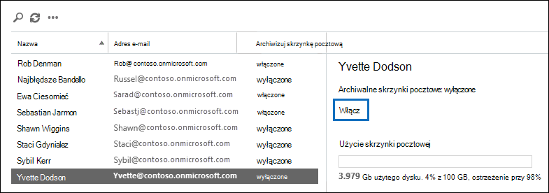

# <a name="enable-archive-mailboxes-in-the-compliance-center"></a>Włączanie archiwalnych skrzynek pocztowych w centrum zgodności

Archiwizowanie w Microsoft 365 (nazywane również *archiwizowaniem w miejscu*) zapewnia użytkownikom dodatkowe miejsce do magazynowania skrzynki pocztowej. Aby uzyskać więcej informacji, zobacz [Dowiedz się więcej o archiwalnych skrzynkach pocztowych](archive-mailboxes.md).

Informacje zawarte w tym artykule umożliwiają włączanie lub wyłączanie archiwum skrzynki pocztowej w Centrum zgodności platformy Microsoft 365 lub przy użyciu programu PowerShell. Dowiedz się również, jak uruchomić automatyczne sprawdzanie diagnostyczne w archiwum skrzynki pocztowej użytkownika w celu zidentyfikowania wszelkich problemów i sugerowanych rozwiązań.

## <a name="get-the-necessary-permissions"></a>Uzyskiwanie niezbędnych uprawnień

Musisz mieć przypisaną rolę Adresaci poczty w Exchange Online, aby włączyć lub wyłączyć archiwalne skrzynki pocztowe. Domyślnie ta rola jest przypisywana do grup ról Zarządzanie adresatami i Zarządzanie organizacją na stronie **Uprawnienia** w <a href="https://go.microsoft.com/fwlink/p/?linkid=2059104" target="_blank">centrum administracyjnym Exchange</a>. 

Jeśli nie widzisz strony **Archiwum** w Centrum zgodności platformy Microsoft 365, poproś administratora o przypisanie Ci niezbędnych uprawnień.

## <a name="enable-an-archive-mailbox"></a>Włączanie archiwum skrzynki pocztowej

1. Przejdź do <a href="https://go.microsoft.com/fwlink/p/?linkid=2077149" target="_blank">Centrum zgodności platformy Microsoft 365</a> i zaloguj się.

2. W lewym okienku Centrum zgodności platformy Microsoft 365 kliknij pozycję **Zarządzanie informacjami**, a następnie kliknij kartę **Archiwum**.

   Zostanie wyświetlona strona **Archiwum** . Kolumna **Archiwum skrzynki pocztowej** wskazuje, czy skrzynka pocztowa archiwum jest włączona, czy wyłączona dla każdego użytkownika.

   > [!NOTE]
   > Strona **Archiwum** zawiera maksymalnie 500 użytkowników.

3. Na liście skrzynek pocztowych wybierz użytkownika, dla któremu chcesz włączyć skrzynkę pocztową archiwum, i wybierz pozycję **Włącz archiwum**.

   


   Zostanie wyświetlone ostrzeżenie informujące, że po włączeniu archiwum skrzynki pocztowej elementy w skrzynce pocztowej użytkownika starsze niż zasady archiwizacji przypisane do skrzynki pocztowej zostaną przeniesione do nowej skrzynki pocztowej archiwum. Domyślne zasady archiwum, które są częścią zasad przechowywania przypisanych do Exchange Online skrzynek pocztowych, przenosi elementy do archiwum skrzynki pocztowej dwa lata po dacie dostarczenia elementu do skrzynki pocztowej lub utworzenia przez użytkownika. Aby uzyskać więcej informacji, zobacz sekcję **Więcej informacji** w tym artykule.

5. Wybierz pozycję **Włącz** , aby włączyć archiwum skrzynki pocztowej.

   Utworzenie archiwum skrzynki pocztowej może potrwać kilka chwil. Po utworzeniu **skrzynka pocztowa Archiwum: włączona** jest wyświetlana w okienku szczegółów wybranego użytkownika. Może być konieczne **kliknięcie ikony Odśwież odświeżanie** , aby zaktualizować informacje w okienku szczegółów.

> [!TIP]
> Możesz również zbiorczo włączyć archiwalne skrzynki pocztowe, wybierając wielu użytkowników z wyłączonymi archiwalnymi skrzynkami pocztowymi (użyj klawiszy Shift lub Ctrl). Po wybraniu wielu skrzynek pocztowych kliknij pozycję **Włącz** w okienku szczegółów.

## <a name="disable-an-archive-mailbox"></a>Wyłączanie archiwum skrzynki pocztowej

Możesz również użyć strony **Archiwum** w Centrum zgodności platformy Microsoft 365, aby wyłączyć skrzynkę pocztową archiwum użytkownika. Po wyłączeniu archiwum skrzynki pocztowej można ponownie połączyć ją z podstawową skrzynką pocztową użytkownika w ciągu 30 dni od jej wyłączenia. W takim przypadku oryginalna zawartość archiwum skrzynki pocztowej są przywracane. Po 30 dniach zawartość oryginalnej skrzynki pocztowej archiwum zostanie trwale usunięta i nie będzie można jej odzyskać. Jeśli więc ponownie włączysz archiwum dłużej niż 30 dni po jego wyłączeniu, zostanie utworzona nowa skrzynka pocztowa archiwum.

Domyślne zasady archiwum przypisane do skrzynek pocztowych użytkowników przenosi elementy do archiwum skrzynki pocztowej dwa lata po dacie dostarczenia elementu. Jeśli wyłączysz archiwum skrzynki pocztowej użytkownika, nie zostaną podjęte żadne akcje dotyczące elementów skrzynki pocztowej i pozostaną one w podstawowej skrzynce pocztowej użytkownika.

Aby wyłączyć skrzynkę pocztową archiwum:

1. Przejdź do <a href="https://go.microsoft.com/fwlink/p/?linkid=2077149" target="_blank">Centrum zgodności platformy Microsoft 365</a> i zaloguj się.

2. W lewym okienku Centrum zgodności platformy Microsoft 365 kliknij pozycję **Zarządzanie informacjami**, a następnie kliknij kartę **Archiwum**.

   Zostanie wyświetlona strona **Archiwum** . Kolumna **Archiwum skrzynki pocztowej** wskazuje, czy skrzynka pocztowa archiwum jest włączona, czy wyłączona dla każdego użytkownika.

   > [!NOTE]
   > Strona **Archiwum** zawiera maksymalnie 500 użytkowników.

3. Na liście skrzynek pocztowych wybierz użytkownika, dla który chcesz wyłączyć skrzynkę pocztową archiwum, a następnie wybierz pozycję **Wyłącz archiwum**.


   Zostanie wyświetlony komunikat ostrzegawczy z informacją, że będziesz mieć 30 dni na ponowne włączenie archiwum skrzynki pocztowej, a po 30 dniach wszystkie informacje w archiwum zostaną trwale usunięte.

5. Wybierz pozycję **Wyłącz** , aby wyłączyć skrzynkę pocztową archiwum.

   Wyłączenie archiwum skrzynki pocztowej może potrwać kilka chwil. Po wyłączeniu **skrzynka pocztowa Archiwum: wyłączona** jest wyświetlana w okienku szczegółów wybranego użytkownika. Może być konieczne **kliknięcie ikony Odśwież odświeżanie** , aby zaktualizować informacje w okienku szczegółów.

> [!TIP]
> Możesz również zbiorczo wyłączyć archiwalne skrzynki pocztowe, wybierając wielu użytkowników z włączonymi archiwalnymi skrzynkami pocztowymi (użyj klawiszy Shift lub Ctrl). Po wybraniu wielu skrzynek pocztowych kliknij pozycję **Wyłącz** w okienku szczegółów.

## <a name="use-exchange-online-powershell-to-enable-or-disable-archive-mailboxes"></a>Używanie Exchange Online programu PowerShell do włączania lub wyłączania archiwalnych skrzynek pocztowych

Do włączania archiwalnych skrzynek pocztowych można również użyć programu Exchange Online PowerShell. Głównym powodem korzystania z programu PowerShell jest szybkie włączenie archiwum skrzynki pocztowej dla wszystkich użytkowników w organizacji.

Pierwszym krokiem jest nawiązanie połączenia z programem Exchange Online programu PowerShell. Aby uzyskać instrukcje, zobacz [Połączenie do Exchange Online programu PowerShell](/powershell/exchange/connect-to-exchange-online-powershell).

Po nawiązaniu połączenia z Exchange Online możesz uruchomić polecenia w poniższych sekcjach, aby włączyć lub wyłączyć archiwalne skrzynki pocztowe.

### <a name="enable-archive-mailboxes"></a>Włącz archiwalne skrzynki pocztowe

Uruchom następujące polecenie, aby włączyć skrzynkę pocztową archiwum dla jednego użytkownika.

```powershell
Enable-Mailbox -Identity <username> -Archive
```

Uruchom następujące polecenie, aby włączyć archiwum skrzynki pocztowej dla wszystkich użytkowników w organizacji (których skrzynka pocztowa archiwum nie jest obecnie włączona).

```powershell
Get-Mailbox -Filter {ArchiveGuid -Eq "00000000-0000-0000-0000-000000000000" -AND RecipientTypeDetails -Eq "UserMailbox"} | Enable-Mailbox -Archive
```

### <a name="disable-archive-mailboxes"></a>Wyłączanie archiwalnych skrzynek pocztowych

Uruchom następujące polecenie, aby wyłączyć skrzynkę pocztową archiwum dla jednego użytkownika.

```powershell
Disable-Mailbox -Identity <username> -Archive
```

Uruchom następujące polecenie, aby wyłączyć skrzynkę pocztową archiwum dla wszystkich użytkowników w organizacji (których skrzynka pocztowa archiwum jest obecnie włączona).

```powershell
Get-Mailbox -Filter {ArchiveGuid -Ne "00000000-0000-0000-0000-000000000000" -AND RecipientTypeDetails -Eq "UserMailbox"} | Disable-Mailbox -Archive
```

## <a name="run-diagnostics-on-archive-mailboxes"></a>Uruchamianie diagnostyki w archiwalnych skrzynkach pocztowych

Możesz uruchomić automatyczne sprawdzanie diagnostyczne w skrzynce pocztowej archiwum użytkownika, aby zidentyfikować wszelkie problemy i sugerowane rozwiązania.

Aby uruchomić test diagnostyczny, kliknij przycisk poniżej. 

> [!div class="nextstepaction"]
> [Uruchamianie testów: archiwum skrzynki pocztowej](https://aka.ms/PillarArchiveMailbox)


W Centrum administracyjne platformy Microsoft 365 zostanie otwarta strona wysuwana. Wprowadź adres e-mail skrzynki pocztowej, którą chcesz sprawdzić, i kliknij pozycję **Uruchom testy**.

> [!NOTE]
> Aby użyć sprawdzania diagnostycznego skrzynki pocztowej archiwum, musisz być administratorem globalnym Microsoft 365. Ponadto ta funkcja nie jest dostępna w chmurach Microsoft 365 government, Microsoft 365 obsługiwanych przez firmę 21Vianet lub Microsoft 365 Niemczech.

## <a name="next-steps"></a>Następne kroki

Rozważ włączenie [automatycznego rozszerzania archiwizacji](autoexpanding-archiving.md) w celu uzyskania dodatkowego miejsca do magazynowania. Aby uzyskać instrukcje, zobacz [Włączanie automatycznego rozszerzania archiwizacji](enable-autoexpanding-archiving.md).
