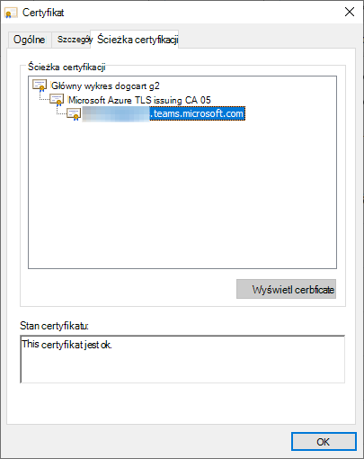

# <a name="office-tls-certificate-changes"></a>Office zmian w certyfikacie TLS

Microsoft 365 aktualizowanie usług za pomocą wiadomości, spotkań, telefonii, połączeń głosowych i wideo w celu używania certyfikatów TLS z innego zestawu głównych urzędów certyfikacji. Ta zmiana jest wdawana, ponieważ bieżący główny urząd certyfikacji wygaśnie w maju 2025 r.

Produkty, których dotyczy problem, to:
- Microsoft Teams
- Skype
- Skype dla firm Online
- Microsoft Dynamics 365
- GroupMe
- Kaizala
- Azure Communication Services

Punkty końcowe, których dotyczy problem, to między innymi:
- *.teams.microsoft.com
- *.skype.com
- *.skypeforbusiness.com
- *.groupme.com
- *.communication.azure.com
- *.operatorconnect.microsoft.com

Ponadto usługi Teams i Skype dla firm Online w wystąpieniach programu Microsoft 365 National Cloud (Rząd Stanów Zjednoczonych) będą wprowadzić tę samą zmianę wpływających na punkty końcowe, takie jak:
- *.gcc.teams.microsoft.com
- *.dod.teams.microsoft.us
- *.gov.teams.microsoft.us
- *.online.dod.skypeforbusiness.us
- *.online.gov.skypeforbusiness.us
- *.um-dod.office365.us
- *.um.office365.us

Ta zmiana nie ma wpływu na certyfikaty, domeny ani usługi używane w wystąpieniach chmury państwowej w Chinach lub Niemczech Microsoft 365.

Wszystkie informacje o certyfikatach w tym artykule były wcześniej udostępniane [w Microsoft 365 szyfrowania nie](./encryption-office-365-certificate-chains.md) później niż w październiku 2020 r.

## <a name="when-will-this-change-happen"></a>Kiedy nastąpi ta zmiana?

Usługi zaczęły przechodzić do nowych głównych zasiedze CA w styczniu 2022 r. i będą kontynuowane do października 2022 r.

## <a name="what-is-changing"></a>Co się zmienia?

Obecnie większość certyfikatów TLS używanych przez usługę Microsoft 365 jest w łańcuchu do następującego głównego urzędu certyfikacji:

| Nazwa pospolita urzędu certyfikacji | Thumbprint (SHA1) |
|--|--|
| [Baltimore CyberTrust Root](https://cacerts.digicert.com/BaltimoreCyberTrustRoot.crt) | d4de20d05e66fc53fe1a50882c78db2852cae474 |

przy użyciu jednego z następujących opisów CA średniozaawansowanych:

| Nazwa pospolita urzędu certyfikacji | Thumbprint (SHA1) |
|--|--|
| [Microsoft RSA TLS CA 01](https://www.microsoft.com/pki/mscorp/Microsoft%20RSA%20TLS%20CA%2001.crt) | 703d7a8f0ebf55aaa59f98eaf4a206004eb2516a |
| [Microsoft RSA TLS CA 02](https://www.microsoft.com/pki/mscorp/Microsoft%20RSA%20TLS%20CA%2002.crt) | b0c2d2d13cdd56cdaa6ab6e2c04440be4a429c75 |

Nowe certyfikaty TLS używane przez Microsoft 365 będą teraz w łańcuchu do jednego z następujących certyfikatów głównych:

| Nazwa pospolita urzędu certyfikacji | Thumbprint (SHA1) |
|--|--|
| [DigiCert Global Root G2](https://cacerts.digicert.com/DigiCertGlobalRootG2.crt) | df3c24f9bfd666761b268073fe06d1cc8d4f82a4 |
| [Główny urząd certyfikacji firmy Microsoft RSA 2017](https://www.microsoft.com/pkiops/certs/Microsoft%20RSA%20Root%20Certificate%20Authority%202017.crt) | 73a5e64a3bff8316ff0edccc618a906e4eae4d74 | 
| [Główny urząd certyfikacji ecc firmy Microsoft 2017](https://www.microsoft.com/pkiops/certs/Microsoft%20ECC%20Root%20Certificate%20Authority%202017.crt) | 999a64c37ff47d9fab95f14769891460eec4c3c5 |

przy użyciu jednego z następujących opisów CA średniozaawansowanych:

| Nazwa pospolita urzędu certyfikacji | Thumbprint (SHA1) |
|--|--|
| [Microsoft Azure TLS issuing CA 01](https://www.microsoft.com/pkiops/certs/Microsoft%20Azure%20TLS%20Issuing%20CA%2001%20-%20xsign.crt) | 2f2877c5d778c31e0f29c7e371df5471bd673173 |
| [Microsoft Azure TLS issuing CA 02](https://www.microsoft.com/pkiops/certs/Microsoft%20Azure%20TLS%20Issuing%20CA%2002%20-%20xsign.crt) | e7eea674ca718e3befd90858e09f8372ad0ae2aa |
| [Microsoft Azure TLS issuing CA 05](https://www.microsoft.com/pkiops/certs/Microsoft%20Azure%20TLS%20Issuing%20CA%2005%20-%20xsign.crt) | 6c3af02e7f269aa73afd0eff2a88a4a1f04ed1e5 |
| [Microsoft Azure TLS issuing CA 06](https://www.microsoft.com/pkiops/certs/Microsoft%20Azure%20TLS%20Issuing%20CA%2006%20-%20xsign.crt) | 30e01761ab97e59a06b41ef20af6f2de7ef4f7b0 |

Na przykład jest to prawidłowy certyfikat z jednym z nowych łańcuchów certyfikatów:



## <a name="will-this-change-affect-me"></a>Czy ta zmiana wpłynie na mnie?

Główny urząd certyfikacji "DigiCert Global Root G2" jest powszechnie zaufany przez systemy operacyjne Windows, macOS, Android i iOS oraz przez przeglądarki, takie jak Microsoft Edge, Chrome, Safari i Firefox. Oczekujemy, że **Microsoft 365 klientów nie wpłynie to**. 

Twoja **aplikacja może jednak mieć wpływ,** jeśli jawnie określa listę akceptowanych CA. Takie rozwiązanie jest nazywane "przypinanie certyfikatów". Klienci, którzy nie mają nowych głównych certyfikatów ca na swojej liście akceptowanych zaszeeń CA, otrzymają błędy sprawdzania poprawności certyfikatu, co może mieć wpływ na dostępność lub funkcję Twojej aplikacji.

Oto kilka sposobów wykrywania, czy aplikacja może mieć wpływ:

- Wyszukaj w kodzie źródłowym kciuk, nazwę pospolitą lub inne właściwości dowolnego z odnalezionych tutaj nazw [pośrednich.](https://www.microsoft.com/pki/mscorp/cps/default.htm) Jeśli zostanie dopasowana, będzie to miało wpływ na aplikację. Aby rozwiązać ten problem, zaktualizuj kod źródłowy, aby dodać właściwości nowych AA. W celu zapewnienia, że będzie można dodawać i edytować za pomocą krótkiego powiadomienia, najlepiej jest dodać lub edytować takie odwołania. Przepisy branżowe wymagają zastąpienia certyfikatów certyfikacji w ciągu siedmiu dni, więc aplikacje wdrażaające przypinanie certyfikatów muszą szybko reagować na te zmiany.

- .NET udostępnia funkcje `System.Net.ServicePointManager.ServerCertificateValidationCallback` `System.Net.HttpWebRequest.ServerCertificateValidationCallback` oraz funkcji wywołań zwrotnej, które umożliwiają deweloperom używanie logiki niestandardowej do określenia, czy certyfikaty są prawidłowe, a nie od standardowych magazynów certyfikatów programu Windows. Deweloper może dodać logikę, która sprawdza konkretną nazwę pospolitą lub usbprint, lub dopuszcza tylko określony główny urząd certyfikacji, taki jak "Baltimore CyberTrust Root". Jeśli aplikacja korzysta z tych funkcji wywołującej, upewnij się, że akceptuje ona zarówno stare, jak i nowe główne oraz pośrednie.

- Być może używasz aplikacji natywnych `WINHTTP_CALLBACK_STATUS_SENDING_REQUEST`, co pozwala aplikacjom natywnym zaimplementować niestandardową logikę sprawdzania poprawności certyfikatu. To powiadomienie jest rzadko spotykane i wymaga znacznej ilości kodu niestandardowego do wdrożenia. Podobnie jak powyżej, upewnij się, że aplikacja akceptuje zarówno starą, jak i nową aplikację cAs główny i pośrednią. 

- Jeśli używasz aplikacji integrowej z interfejsami API usług Microsoft Teams, Skype, Skype dla firm Online lub Microsoft Dynamics i nie masz pewności, czy ta aplikacja korzysta z przypinania certyfikatów, skontaktuj się z dostawcą aplikacji.

- Różne systemy operacyjne i środowiska uruchomieniowe języka, które komunikują się z usługami platformy Azure, mogą wymagać innych kroków w celu poprawnego tworzenia i weryfikowania nowych łańcuchów certyfikatów:
   - **Linux**: wiele dystrybucji wymaga dodania do .`/etc/ssl/certs` Szczegółowe instrukcje można znaleźć w dokumentacji rozpowszechniania.
   - **Java**: Upewnij się, że magazyn kluczy języka Java zawiera wymienione powyżej pliki języka Java.
   - **Windows** w odłączonych środowiskach: Systemy działające w odłączonych środowiskach muszą mieć do swoich magazynów nowe główne zaadane do swoich magazynów oraz nowe CA `Trusted Root Certification Authorities` `Intermediate Certification Authorities` pośrednie, które zostaną dodane do ich magazynu.
   - **Android**: Zapoznaj się z dokumentacją urządzenia i wersji systemu Android.
   - **Urządzenia IoT lub** osadzone: Urządzenia osadzone, takie jak górne pola zestawu telewizyjnego, często są wysyłane z ograniczonym zestawem certyfikatów urzędu głównego i nie mają łatwego sposobu aktualizowania magazynu certyfikatów. Jeśli piszesz kod dla niestandardowych urządzeń osadzonych lub urządzeń IoT lub zarządzasz nimi, upewnij się, że te urządzenia zaufają nowym głównym certyfikatom CA. Może być konieczne skontaktowanie się z producentem urządzenia.

- Jeśli w środowisku reguły zapory zezwalają na połączenia wychodzące tylko do określonych punktów końcowych, zezwalaj na następujące adresy URL listy odwołania certyfikatu (CRL) lub protokołu OCSP (Online Certificate Status Protocol):
   - `http://crl3.digicert.com`
   - `http://crl4.digicert.com`
   - `http://ocsp.digicert.com`
   - `http://crl.microsoft.com`
   - `http://oneocsp.microsoft.com`
   - `http://ocsp.msocsp.com`
   - `http://www.microsoft.com/pkiops`

- Jeśli dotyczy Cię ta zmiana, mogą być wyświetlane komunikaty o błędach w zależności od typu środowiska, w którym pracujesz, i scenariusza, na który masz wpływ. Sprawdź Windows zdarzeń aplikacji, dzienniki zdarzeń CAPI2 i niestandardowe dzienniki aplikacji podejdą do wiadomości, które wyglądają tak:
   ```output
   An operation failed because the following certificate has validation errors:
   
   Subject Name: CN=teams.microsoft.com
   Issuer Name: CN=Microsoft Azure TLS Issuing CA 01, O=Microsoft Corporation, C=US
   
   Errors:
   
   The root of the certificate chain is not a trusted root authority.
   ```

## <a name="when-can-i-retire-the-old-ca-information"></a>Kiedy można wycofać stare informacje certyfikacji?

Bieżące certyfikaty główny urząd certyfikacji, urząd certyfikacji pośredniej i certyfikaty liści nie zostaną odwołane. Istniejące nazwy wspólne ca i/lub thumbprints będą wymagane do co najmniej października 2023 r. w zależności od okresu istnienia istniejących certyfikatów.
