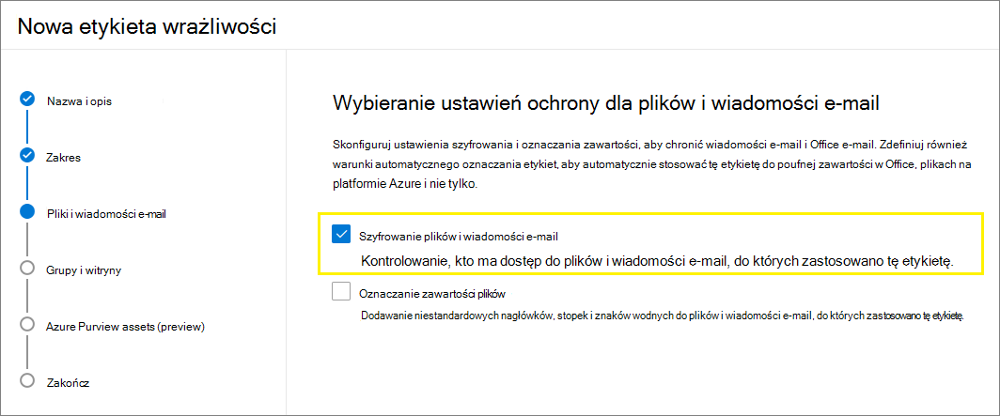
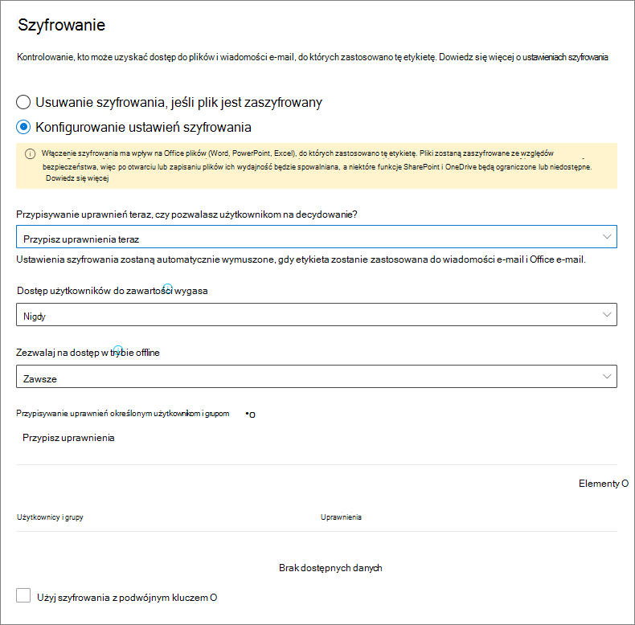
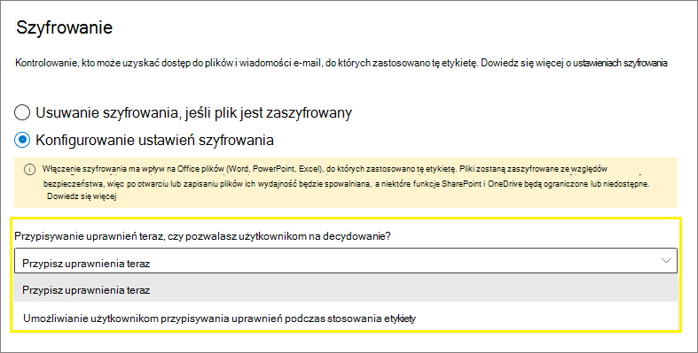
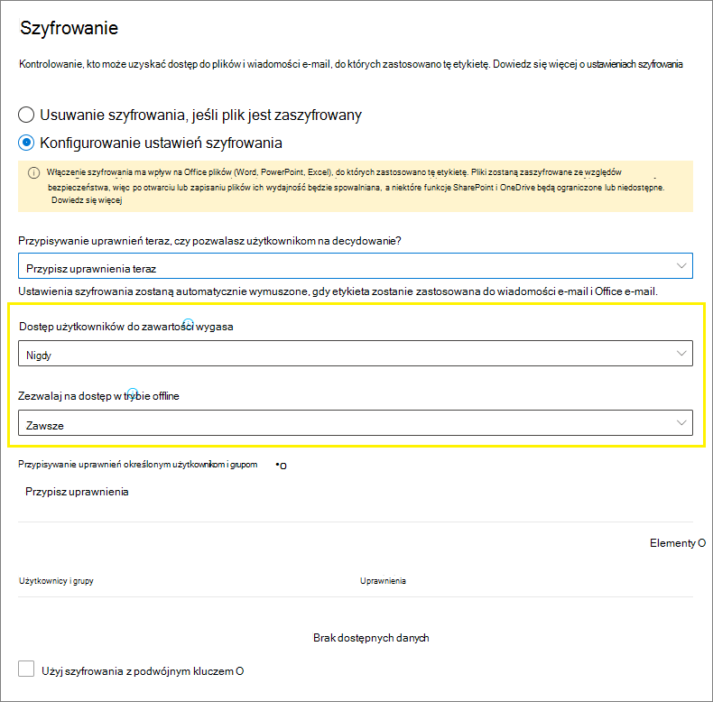
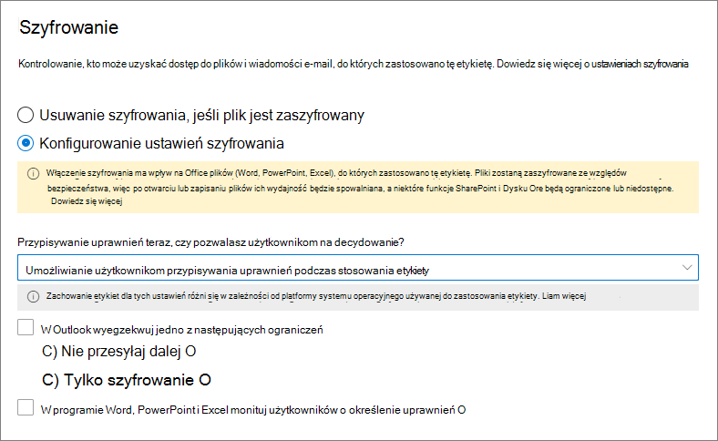
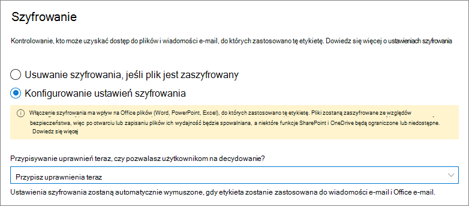

# Ograniczanie dostępu do zawartości przy użyciu etykiet wrażliwości w celu zastosowania szyfrowania

>*[Microsoft 365 licencjonowania w zakresie zabezpieczeń & zgodności](/office365/servicedescriptions/microsoft-365-service-descriptions/microsoft-365-tenantlevel-services-licensing-guidance/microsoft-365-security-compliance-licensing-guidance).*

Po utworzeniu etykiety wrażliwości możesz ograniczyć dostęp do zawartości, do których ta etykieta zostanie zastosowana. Na przykład przy użyciu ustawień szyfrowania dla etykiety wrażliwości możesz chronić zawartość, aby:

- Tylko użytkownicy w Twojej organizacji mogą otworzyć poufny dokument lub wiadomość e-mail.
- Tylko użytkownicy z działu marketingu mogą edytować i drukować dokument z ogłoszeniem promocyjnym lub adres e-mail, podczas gdy wszyscy inni użytkownicy w organizacji mogą tylko go czytać.
- Użytkownicy nie mogą przesyłać dalej wiadomości e-mail ani kopiować z niej informacji, które zawierają informacje o wewnętrznej reorganizacji.
- Po upływie określonej daty nie można otworzyć bieżącego cennika wysyłanego do partnerów biznesowych.

W przypadku zaszyfrowania dokumentu lub wiadomości e-mail dostęp do zawartości jest ograniczony, dlatego:

- Mogą zostać odszyfrowane tylko przez użytkowników autoryzowanych przez ustawienia szyfrowania na etykiecie.
- Pozostaje zaszyfrowany niezależnie od miejsca, w którym się znajduje, wewnątrz lub poza organizacją, nawet jeśli jego nazwa została zmieniona.
- Jest zaszyfrowany zarówno w miejscu (na przykład na koncie OneDrive) jak i podczas przesyłania (na przykład wiadomość e-mail, gdy przechodzi przez Internet).

Podczas konfigurowania etykiety wrażliwości w celu zastosowania szyfrowania jako administrator możesz wybrać jedną z tych opcji:

- **Przypisz uprawnienia teraz**, aby dokładnie określić, którzy użytkownicy uzyskają uprawnienia do zawartości z taką etykietą.
- **Umożliwianie użytkownikom przypisywania** uprawnień podczas stosowania etykiety do zawartości. W ten sposób możesz zapewnić osobom w organizacji elastyczność, na przykład potrzebną do współpracy i wykonanej pracy.

Ustawienia szyfrowania są dostępne po [utworzeniu etykiety wrażliwości](create-sensitivity-labels.md) w Centrum zgodności platformy Microsoft 365. Możesz również korzystać ze starszego portalu , centrum zabezpieczeń & zgodności.

## Zrozumienie sposobu działania szyfrowania

Szyfrowanie korzysta z usługi Azure Rights Management (Azure RMS) z usługi Azure Information Protection. To rozwiązanie ochrony korzysta z zasad szyfrowania, tożsamości i autoryzacji. Aby dowiedzieć się więcej, zobacz [Co to jest usługa Azure Rights Management?](/azure/information-protection/what-is-azure-rms) w dokumentacji usługi Azure Information Protection. 

Podczas korzystania z tego rozwiązania szyfrowania funkcja superuzyfrowanych użytkowników gwarantuje, że uprawnione osoby i usługi zawsze będą odczytywać i sprawdzać dane, które zostały zaszyfrowane dla Twojej organizacji. W razie potrzeby szyfrowanie można następnie usunąć lub zmienić. Aby uzyskać więcej informacji, zobacz [Konfigurowanie superu użytkowników usługi Azure Information Protection i usług odnajdowania lub odzyskiwania danych](/azure/information-protection/configure-super-users).

## Ważne wymagania wstępne

Zanim będzie można używać szyfrowania, może być konieczne wykonywanie niektórych zadań konfiguracyjnych. Po skonfigurowaniu ustawień szyfrowania nie można sprawdzić, czy te wymagania wstępne są spełnione.

- Aktywowanie ochrony z usługi Azure Information Protection
    
    Aby etykiety wrażliwości zastosować szyfrowanie, usługa ochrony (Azure Rights Management) z usługi Azure Information Protection musi zostać aktywowana dla Twojej dzierżawy. W przypadku nowszej dzierżawy jest to ustawienie domyślne, ale może być konieczne ręczne aktywowanie usługi. Aby uzyskać więcej informacji, zobacz [Aktywowanie usługi ochrony z usługi Azure Information Protection](/azure/information-protection/activate-service).

- Sprawdzanie wymagań dotyczących sieci
    
    Może być konieczne wprowadzić pewne zmiany na urządzeniach sieciowych, takich jak zapory. Aby uzyskać szczegółowe informacje, [zobacz Zapory i infrastrukturę sieciową](/azure/information-protection/requirements#firewalls-and-network-infrastructure) w dokumentacji usługi Azure Information Protection.

- Konfigurowanie Exchange dla usługi Azure Information Protection
    
    Exchange usługi Azure Information Protection nie musi być skonfigurowane, aby użytkownicy mogą stosować etykiety w Outlook w celu szyfrowania wiadomości e-mail. Do czasu Exchange usługi Azure Information Protection nie otrzymasz jednak dostępu do wszystkich funkcji korzystania z usługi Azure Rights Management w ramach usługi Exchange.
    
    Na przykład użytkownicy nie mogą wyświetlać zaszyfrowanych wiadomości e-mail na telefonach Outlook w sieci Web ani za pomocą usługi Outlook w sieci Web, zaszyfrowanych wiadomości e-mail nie można indeksować w celu wyszukiwania, ani też nie można konfigurować funkcji DLP na Exchange Online ochrony praw. 
    
    Aby zapewnić, Exchange może obsługiwać te dodatkowe scenariusze, zobacz następujące kwestie:
    
    - Aby Exchange Online, zobacz instrukcje dotyczące [konfigurowania usługi Exchange Online: Konfiguracja usługi IRM](/azure/information-protection/configure-office365#exchangeonline-irm-configuration).
    - Aby Exchange lokalnym, musisz wdrożyć łącznik RMS i skonfigurować Exchange [serwerach](/azure/information-protection/deploy-rms-connector). 

## Jak skonfigurować etykietę szyfrowania

1. Postępuj zgodnie z instrukcjami ogólnymi, [aby](create-sensitivity-labels.md#create-and-configure-sensitivity-labels) utworzyć lub edytować etykietę wrażliwości  i upewnić się& że w zakresie etykiety wybrano pozycję Pliki i wiadomości e-mail: 
    
    

2. Następnie na stronie **Wybieranie ustawień ochrony dla plików** i wiadomości e-mail upewnij się, że jest zaznaczana pozycję **Szyfruj pliki i wiadomości e-mail.**
    
    

4.  Na **stronie Szyfrowanie** wybierz jedną z następujących opcji:
    
    - **Usuń szyfrowanie, jeśli plik jest zaszyfrowany**: Ta opcja jest obsługiwana tylko przez ujednoliconego klienta etykiet usługi Azure Information Protection. Po wybraniu tej opcji i użyciu wbudowanych etykiet etykieta może nie być wyświetlana w aplikacjach lub wyświetlana i nie wprowadzać żadnych zmian szyfrowania.
        
        Aby uzyskać więcej informacji na temat tego scenariusza, zobacz sekcję Co [się stanie z istniejącym szyfrowaniem po zastosowaniu etykiety](#what-happens-to-existing-encryption-when-a-labels-applied) . Należy zrozumieć, że to ustawienie może spowodować, że użytkownicy nie będą mogli stosować etykiety wrażliwości, jeśli nie mają wystarczających uprawnień.
    
    - **Konfigurowanie ustawień szyfrowania**: włącza szyfrowanie i sprawia, że ustawienia szyfrowania są widoczne:
        
        
        
        Instrukcje dotyczące tych ustawień znajdują się w [poniższej sekcji Konfigurowanie ustawień szyfrowania](#configure-encryption-settings) .

### Co się dzieje z istniejącym szyfrowaniem po zastosowaniu etykiety

Jeśli do zawartości niezaszyfrowanej zostanie zastosowana etykieta wrażliwości, wynik opcji szyfrowania, które możesz wybrać, będzie wyjaśnieniem własnym. Jeśli na przykład nie zaznaczysz opcji Szyfruj pliki i wiadomości e-mail **, zawartość** pozostanie niezaszyfrowana.

Jednak zawartość może być już zaszyfrowana. Na przykład inny użytkownik mógł zastosować:

- Własne uprawnienia, które obejmują uprawnienia zdefiniowane przez użytkownika po wyświetleniu monitu o etykietę, uprawnienia niestandardowe przez klienta usługi Azure Information Protection i ochronę  dokumentu Ograniczony dostęp z poziomu aplikacja pakietu Office.
- Szablon usługi Azure Rights Protection, który szyfruje zawartość niezależnie od etykiety. Ta kategoria zawiera reguły przepływu poczty e-mail, które stosują szyfrowanie przy użyciu ochrony praw.
- Etykieta, która stosuje szyfrowanie z uprawnieniami przypisanymi przez administratora.

W poniższej tabeli przedstawiono, co się stanie z istniejącym szyfrowaniem, gdy do tej zawartości zostanie zastosowana etykieta wrażliwości:

| | Szyfrowanie: nie wybrano | Szyfrowanie: skonfigurowane | Szyfrowanie: Usuń \* |
|:-----|:-----|:-----|:-----|
|**Uprawnienia określone przez użytkownika**|Oryginalne szyfrowanie jest zachowywane|Zastosowano nowe szyfrowanie etykiet|Oryginalne szyfrowanie zostało usunięte|
|**Szablon ochrony**|Oryginalne szyfrowanie jest zachowywane|Zastosowano nowe szyfrowanie etykiet|Oryginalne szyfrowanie zostało usunięte|
|**Etykieta z uprawnieniami zdefiniowanymi przez administratora**|Oryginalne szyfrowanie zostało usunięte|Zastosowano nowe szyfrowanie etykiet|Oryginalne szyfrowanie zostało usunięte|

**Przypis dolny:**

\* Obsługiwane tylko przez ujednoliconego klienta etykiet usługi Azure Information Protection

W przypadkach, gdy zastosowano nowe szyfrowanie etykiet lub oryginalne szyfrowanie zostało usunięte, dzieje się tak tylko wtedy, gdy użytkownik stosujący etykietę ma prawo do użycia lub rolę, która obsługuje tę akcję:

- The [usage right](/azure/information-protection/configure-usage-rights#usage-rights-and-descriptions) Export or Full Control.
- Rola wystawcy [zarządzania prawami, właściciela zarządzania prawami](/azure/information-protection/configure-usage-rights#rights-management-issuer-and-rights-management-owner) lub [superuzystego użytkownika](/azure/information-protection/configure-super-users).

Jeśli użytkownik nie ma żadnych takich praw ani ról, etykiety nie można zastosować, co spowoduje, że oryginalne szyfrowanie zostanie zachowane. Użytkownik widzi następujący komunikat: Nie masz uprawnień do zmiany ustawień wrażliwości **. Skontaktuj się z właścicielem zawartości.**

Na przykład osoba, która stosuje w wiadomości e-mail tekst Nie przesyłaj dalej, może zmienić wcięcie w celu zastąpienia szyfrowania lub usunięcia go, ponieważ jest właścicielem zarządzania prawami do wiadomości e-mail. Jednak z wyjątkiem użytkowników superuzyskiwani adresaci tej wiadomości e-mail nie mogą jej ponownie oznaczać, ponieważ nie mają wymaganych praw użytkowania.

#### Załączniki wiadomości e-mail do zaszyfrowanych wiadomości e-mail

Gdy wiadomość e-mail jest szyfrowana przy użyciu dowolnej metody, wszelkie nieszyfrowane Office dołączone do wiadomości e-mail automatycznie dziedziczą te same ustawienia szyfrowania.

Dokumenty, które są już zaszyfrowane, a następnie dodane jako załączniki, zawsze zachowują oryginalne szyfrowanie.

## Konfigurowanie ustawień szyfrowania

Po wybraniu opcji **Konfiguruj ustawienia szyfrowania** na stronie **Szyfrowanie** w celu utworzenia lub edytowania etykiety wrażliwości wybierz jedną z następujących opcji:

- **Przypisz uprawnienia teraz**, aby można było dokładnie określić, którzy użytkownicy uzyskają uprawnienia do zawartości, do której zastosowano etykietę. Aby uzyskać więcej informacji, zobacz następną [sekcję Przypisywanie uprawnień teraz](#assign-permissions-now).
- **Pozwól użytkownikom na przypisywanie** uprawnień, gdy użytkownicy zastosują etykietę do zawartości. Dzięki tej opcji możesz zapewnić osobom w organizacji elastyczność, na przykład potrzebną do współpracy i wykonanej pracy. Aby uzyskać więcej informacji, zobacz [sekcję Umożliwianie](#let-users-assign-permissions) użytkownikom przypisywania uprawnień na tej stronie.

Jeśli na przykład masz etykietę poufności o nazwie Wysoce  poufne, która zostanie zastosowana do najbardziej poufnej zawartości, możesz zdecydować teraz, kto będzie miał uprawnienia do tej zawartości.

Ewentualnie, jeśli masz etykietę wrażliwości o nazwie Umowy **biznesowe, a** przepływ pracy organizacji wymaga natychmiastowej współpracy nad tą zawartością z innymi osobami, możesz zezwolić użytkownikom na decydowanie, kto otrzymuje uprawnienia podczas przypisywania etykiety. Taka elastyczność pomaga zarówno użytkownikom zwiększyć produktywność, jak i zmniejszyć liczbę żądań do administratorów o zaktualizowanie lub utworzenie nowych etykiet wrażliwości w celu rozwiązania określonych scenariuszy.

Wybierając, czy chcesz teraz przypisać uprawnienia, czy pozwolić użytkownikom na przypisywanie uprawnień:

## Przypisz uprawnienia teraz

Za pomocą poniższych opcji możesz kontrolować, kto ma dostęp do wiadomości e-mail lub dokumentów, do których ta etykieta jest stosowana. Można:

- **Zezwalaj na wygasanie** dostępu do zawartości oznaczonej etykietą: określonego dnia lub po określonej liczbie dni po zastosowaniu etykiety. Po tym czasie użytkownicy nie będą mogli otworzyć elementu oznaczonego etykietą. Jeśli określisz datę, obowiązuje ona północ od tej daty w bieżącej strefie czasowej. (Ze względu na mechanizmy buforowania niektóre klienci poczty e-mail mogą nie wymuszać wygasania i pokazywać wiadomości e-mail po dacie wygaśnięcia).

- **Zezwalaj na dostęp w** trybie offline nigdy, zawsze lub przez określoną liczbę dni po zastosowaniu etykiety. Jeśli ograniczasz dostęp w trybie offline do nigdy lub na kilka dni, po osiągnięciu tego progu użytkownicy muszą zostać ponownie uwierzytelniani i ich dostęp zostanie zarejestrowany. Aby uzyskać więcej informacji, zobacz następną sekcję licencji na korzystanie z zarządzania prawami dostępu.

Ustawienia kontroli dostępu dla zaszyfrowanej zawartości:

### Licencja na korzystanie z zarządzania prawami dostępu w trybie offline

Gdy użytkownik otwiera dokument lub wiadomość e-mail chronioną za pomocą szyfrowania usługi Azure Rights Management, użytkownikowi jest udzielana licencja na korzystanie z usługi Azure Rights Management dla tej zawartości. Ta licencja użytkowania to certyfikat zawierający prawa użytkownika do dokumentu lub wiadomości e-mail oraz klucz szyfrowania użyty do zaszyfrowania zawartości. Licencja użytkowania zawiera również datę wygaśnięcia, jeśli została ona ustawiona, oraz czas ważności licencji użytkowania.

Jeśli nie ustawiono daty wygaśnięcia, domyślny okres ważności licencji użytkowania dla dzierżawy wynosi 30 dni. W czasie trwania licencji użytkowania użytkownik nie jest ponownie autorzytowany ani ponownie autoryzowany zawartości. Ten proces umożliwia użytkownikowi kontynuowanie otwierania chronionego dokumentu lub wiadomości e-mail bez połączenia internetowego. Gdy wygasa okres ważności licencji użytkowania, przy następnym uzyskiwaniu dostępu do chronionego dokumentu lub wiadomości e-mail użytkownik musi zostać ponownie uwierzytelniony i ponownie uwierzytelniony.

Oprócz ponownego uwierzytelniania ponownie są ponownievaluowane ustawienia szyfrowania i członkostwo w grupach użytkowników. Oznacza to, że użytkownicy mogą mieć różne wyniki dostępu dla tego samego dokumentu lub wiadomości e-mail w przypadku zmian w ustawieniach szyfrowania lub członkostwie w grupach, gdy ostatnio uzyskiwali dostęp do zawartości.

Aby dowiedzieć się, jak zmienić domyślne ustawienie 30-dniowe, zobacz Licencja [korzystania z zarządzania prawami](/azure/information-protection/configure-usage-rights#rights-management-use-license).

### Przypisywanie uprawnień określonym użytkownikom lub grupom

Możesz udzielić uprawnień określonym osobom, aby tylko one mogą wchodzić w interakcje z zawartością oznaczoną etykietą:

1. Najpierw dodaj użytkowników lub grupy, do których zostaną przypisane uprawnienia do zawartości oznaczonej etykietą.

2. Następnie wybierz uprawnienia, które powinni mieć użytkownicy dla zawartości oznaczonej etykietą.

Przypisywanie uprawnień:

#### Dodawanie użytkowników lub grup

Przypisując uprawnienia, możesz wybrać:

- Wszyscy w organizacji (wszyscy członkowie dzierżawy). To ustawienie nie dotyczy kont gości.

- Dowolni uwierzytelnieni użytkownicy. Przed wybraniem tego ustawienia upewnij się, że [rozumiesz](#requirements-and-limitations-for-add-any-authenticated-users) wymagania i ograniczenia tego ustawienia.

- Dowolna konkretną grupa zabezpieczeń z obsługą poczty e-mail, grupa dystrybucyjna [Microsoft 365 (wcześniej](https://techcommunity.microsoft.com/t5/microsoft-365-blog/office-365-groups-will-become-microsoft-365-groups/ba-p/1303601) Office 365) w usłudze Azure AD. Grupa Microsoft 365 może mieć członkostwo statyczne lub [dynamiczne](/azure/active-directory/users-groups-roles/groups-create-rule). Należy zauważyć, że nie można używać dynamicznej grupy dystrybucyjnej z usługi [Exchange](/Exchange/recipients/dynamic-distribution-groups/dynamic-distribution-groups), ponieważ ten typ grupy nie jest synchronizowany z usługą Azure AD i nie można użyć grupy zabezpieczeń, która nie ma włączonej obsługi poczty e-mail.

- Dowolny adres e-mail lub domena. Użyj tej opcji, aby określić wszystkich użytkowników w innej organizacji korzystających z usługi Azure AD, wprowadzając dowolną nazwę domeny z tej organizacji. Możesz również użyć tej opcji w przypadku dostawców usług społecznościowych, wprowadzając nazwę domeny, taką **jak gmail.com**, **hotmail.com** lub **outlook.com**.

    > [!NOTE]
    > Jeśli określisz domenę z organizacji, która korzysta z usługi Azure AD, nie możesz ograniczyć dostępu do tej konkretnej domeny. Zamiast tego wszystkie zweryfikowane domeny w usłudze Azure AD są automatycznie uwzględniane dla dzierżawy, która jest właścicielem  podać przez Ciebie nazwę domeny.

W przypadku wybrania wszystkich użytkowników i grup w organizacji lub przeglądania katalogu użytkownicy lub grupy muszą mieć adres e-mail.

Najlepszym rozwiązaniem jest używanie grup, a nie użytkowników. Ta strategia ułatwia konfigurację.

##### Wymagania i ograniczenia dotyczące dodawania uwierzytelnionych użytkowników

To ustawienie nie ogranicza dostępu osób, które mogą uzyskiwać dostęp do zawartości szyfrowanej etykiety, a jednocześnie nadal szyfruje zawartość i udostępnia opcje ograniczenia możliwości korzystania z zawartości (uprawnień) oraz uzyskiwania do niej dostępu (dostępu wygasania i dostępu w trybie offline). Jednak aplikacja otwierająca zaszyfrowaną zawartość musi być w stanie obsługiwać używane uwierzytelnianie. Z tego powodu federacyjni dostawcy usług społecznościowych, tacy jak Google, i jednogodzinne uwierzytelnianie kodami dostępu działają tylko w przypadku poczty e-mail i tylko w przypadku korzystania z Exchange Online. Kont Microsoft można używać z aplikacjami Office 365 i [przeglądarką Azure Information Protection](https://portal.azurerms.com/#/download).

> [!NOTE]
> Rozważ użycie tego ustawienia z integracją usług [SharePoint i OneDrive z usługą Azure AD B2B](/sharepoint/sharepoint-azureb2b-integration-preview), gdy etykiety wrażliwości są włączone dla Office w SharePoint i [OneDrive](sensitivity-labels-sharepoint-onedrive-files.md).

Ustawienie niektórych typowych scenariuszy dla uwierzytelnionych użytkowników:

- Nie masz nic przeciwko tym, kto może zobaczyć zawartość, ale chcesz ograniczyć sposób jej stosowania. Nie chcesz na przykład, aby zawartość ta edytować, kopiować ani drukować.
- Nie musisz ograniczać dostępu osób, które mają dostęp do zawartości, ale chcesz mieć możliwość potwierdzenia, kto ją otwiera.
- Wymagane jest zaszyfrowanie zawartości podczas spoczynku i podczas przesyłania, ale nie wymaga to kontroli dostępu.

#### Wybierz uprawnienia

Po wybraniu uprawnień, które mają być zezwalane tym użytkownikom lub grupom, możesz wybrać jedną z tych opcji:

- Wstępnie [zdefiniowany poziom uprawnień ze](/azure/information-protection/configure-usage-rights#rights-included-in-permissions-levels) wstępnie ustawioną grupą praw, na przykład Co-Author lub Recenzent.
- Uprawnienia niestandardowe, w przypadku których wybierzesz co najmniej jedno prawo użytkowania.

Aby uzyskać więcej informacji pomocnych przy wybieraniu odpowiednich uprawnień, zobacz [Prawa i opisy użycia](/azure/information-protection/configure-usage-rights#usage-rights-and-descriptions).  

Ta sama etykieta może przyznać różne uprawnienia różnym użytkownikom. Na przykład pojedyncza etykieta może przypisać niektórych użytkowników jako recenzenta, a innego jako współautora, jak pokazano na poniższym zrzucie ekranu.

W tym celu dodaj użytkowników lub grupy, przypisz im uprawnienia i zapisz te ustawienia. Następnie powtórz te czynności, dodając użytkowników i przypisując im uprawnienia, zapisując ustawienia za każdym razem. Tę konfigurację można powtarzać tak często, jak to konieczne, aby zdefiniować różne uprawnienia dla różnych użytkowników.

#### Wystawca zarządzania prawami (użytkownik stosujący etykietę wrażliwości) zawsze ma pełną kontrolę

Szyfrowanie etykiet wrażliwości korzysta z usługi Azure Rights Management z usługi Azure Information Protection. Gdy użytkownik stosuje etykietę wrażliwości w celu ochrony dokumentu lub wiadomości e-mail przy użyciu szyfrowania, staje się wystawcą usługi zarządzania prawami dostępu dla tej zawartości.

Wystawcy usługi zarządzania prawami dostępu są zawsze udzielane uprawnienia Pełna kontrola do dokumentu lub wiadomości e-mail, a dodatkowo:

- Jeśli ustawienia szyfrowania zawierają datę wygaśnięcia, wystawca usługi zarządzania prawami dostępu może nadal otwierać i edytować dokument lub adres e-mail po tym dniu.
- Wystawca usługi zarządzania prawami dostępu może zawsze uzyskać dostęp do dokumentu lub wiadomości e-mail w trybie offline.
- Wystawca zarządzania prawami dostępu może otworzyć dokument po jego odwołaniu.

Aby uzyskać więcej informacji, zobacz [Wystawca zarządzania prawami i właściciel zarządzania prawami](/azure/information-protection/configure-usage-rights#rights-management-issuer-and-rights-management-owner).

### Szyfrowanie z podwójnym kluczem

> [!NOTE]
> Ta funkcja jest obecnie obsługiwana tylko przez ujednoliconego klienta etykiet usługi Azure Information Protection.

Zaznacz tę opcję dopiero po skonfigurowaniu usługi szyfrowania dwukluczowych i musisz użyć tego szyfrowania dwukluczowych w przypadku plików, do których będzie zastosowana ta etykieta.

Aby uzyskać więcej informacji, wymagania wstępne i instrukcje konfiguracji, zobacz Szyfrowanie [dwucyfrowe](double-key-encryption.md).

## Umożliwianie użytkownikom przypisywania uprawnień

> [!IMPORTANT]
> Nie wszyscy klienci etykiet obsługują wszystkie opcje, które umożliwiają użytkownikom przypisywanie własnych uprawnień. Skorzystaj z tej sekcji, aby dowiedzieć się więcej.

Możesz użyć następujących opcji, aby pozwolić użytkownikom na przypisywanie uprawnień, gdy ręcznie zastosują etykietę wrażliwości do zawartości:

- W Outlook użytkownik może wybrać ograniczenia odpowiadające opcji [Nie](/azure/information-protection/configure-usage-rights#do-not-forward-option-for-emails) przesyłaj dalej lub Szyfruj [tylko](/azure/information-protection/configure-usage-rights#encrypt-only-option-for-emails) dla wybranych adresatów.
    
    Opcja Nie przesyłaj dalej jest obsługiwana przez wszystkich klientów poczty e-mail, którzy obsługują etykiety wrażliwości. Jednak stosowanie opcji **Szyfruj tylko** do etykiet wrażliwości to najnowsza wersja, która jest obsługiwana tylko przez wbudowane etykiety, a nie przez klienta ujednoliconego etykiet usługi Azure Information Protection. W przypadku klientów poczty e-mail, którzy nie obsługują tej funkcji, etykieta nie będzie widoczna.
    
    Aby sprawdzić minimalne wersje aplikacji pakietu Outlook, które korzystają z wbudowanych etykiet, w celu obsługi stosowania opcji Encrypt-Only z etykietą wrażliwości, użyj tabeli możliwości dla programu [Outlook](sensitivity-labels-office-apps.md#sensitivity-label-capabilities-in-outlook) i wiersza Umożliwiaj użytkownikom przypisywanie uprawnień **: —** Tylko szyfrowanie.

- W programie Word, PowerPoint i Excel jest wyświetlany monit o wybranie własnych uprawnień dla określonych użytkowników, grup lub organizacji.

    Ta opcja jest obsługiwana przez klienta ujednoliconej etykiet usługi Azure Information Protection oraz przez niektóre aplikacje, które korzystają z wbudowanych etykiet. W przypadku aplikacji, które nie obsługują tej funkcji, etykieta albo nie będzie widoczna dla użytkowników, albo będzie widoczna dla spójności, ale nie można jej zastosować z komunikatem objaśnienia dla użytkowników.
    
    Aby sprawdzić, które aplikacje, które korzystają z wbudowanych etykiet, obsługują tę opcję, użyj tabeli funkcje dla programów [Word, Excel i PowerPoint](sensitivity-labels-office-apps.md#sensitivity-label-capabilities-in-word-excel-and-powerpoint) oraz wiersza Pozwól użytkownikom na przypisywanie uprawnień **: —** Monituj użytkowników.

Gdy opcje są obsługiwane, skorzystaj z poniższej tabeli, aby określić, kiedy użytkownicy widzą etykietę wrażliwości:

|Ustawienie |Etykieta widoczna w Outlook|Etykieta widoczna w programie Word, Excel, PowerPoint|
|:-----|:-----|:-----|:-----|
|**W Outlook wymusz ograniczenia za pomocą opcji Nie przesyłaj dalej Encrypt-Only wiadomości**|Tak |Nie |
|**W programie Word PowerPoint i Excel monituje użytkowników o określenie uprawnień**|Nie |Tak|

Jeśli oba ustawienia są zaznaczone, etykieta jest zatem widoczna zarówno w programach Word, Outlook, Word, Excel i PowerPoint.

Etykieta wrażliwości, która umożliwia użytkownikom przypisywanie uprawnień, musi zostać zastosowana do zawartości ręcznie przez użytkowników. Nie można go stosować automatycznie ani używać jako zalecanej etykiety.

Konfigurowanie uprawnień przypisanych do użytkownika:

### Outlook ograniczenia

W Outlook, gdy użytkownik stosuje etykietę wrażliwości, która umożliwia mu przypisanie uprawnień do wiadomości, możesz wybrać opcję Nie przesyłaj **dalej** lub **Tylko szyfrowanie**. U góry wiadomości zostanie wyświetlony etykieta i opis, który wskazuje, że zawartość jest chroniona. W przeciwieństwie do PowerPoint, aplikacji Word i Excel (zobacz następną sekcję[),](#word-powerpoint-and-excel-permissions) użytkownikom nie jest wyświetlany monit o wybranie określonych uprawnień.

Po zastosowaniu jednej z tych opcji do wiadomości e-mail ta wiadomość e-mail jest szyfrowana, a adresaci muszą zostać uwierzytelnieni. Następnie adresaci automatycznie mają ograniczone prawa użytkowania:

- **Nie przesyłaj dalej**: Adresaci nie mogą przesyłać dalej wiadomości e-mail, drukować jej ani kopiować z tej wiadomości. Na przykład w kliencie usługi Outlook przycisk Przekaż jest niedostępny, opcje menu Zapisz jako i Drukuj są niedostępne oraz nie można dodawać ani zmieniać adresatów w polach Do, DW i UDW.
    
    Aby uzyskać więcej informacji na temat działania tej opcji, zobacz Opcja [Nie przesyłaj dalej w wiadomościach e-mail](/azure/information-protection/configure-usage-rights#do-not-forward-option-for-emails).

- **Tylko szyfrowanie**: Adresaci mają wszystkie prawa użytkowania z wyjątkiem pozycji Zapisz jako, Eksportuj i Pełna kontrola. Ta kombinacja praw użytkowania oznacza, że adresaci nie mają żadnych ograniczeń z tym wyjątkiem, że nie mogą usunąć ochrony. Adresat może na przykład skopiować wiadomość e-mail, wydrukować ją i przesyłać dalej.
    
    Aby uzyskać więcej informacji na temat działania tej opcji, zobacz [Opcja szyfrowania tylko dla wiadomości e-mail](/azure/information-protection/configure-usage-rights#encrypt-only-option-for-emails).

Te same ograniczenia są automatycznie dziedziczone Office niezaszyfrowanych dokumentach dołączonych do wiadomości e-mail. W przypadku funkcji Nie przesyłaj dalej prawa użytkowania stosowane do tych dokumentów to: Edytowanie zawartości, Edycja; Zapisywanie; Wyświetlanie, Otwieranie, Czytanie; i zezwalaj na makra. Jeśli użytkownik chce mieć inne prawa użytkowania załącznika lub załącznik nie jest dokumentem programu Office, który obsługuje tę dziedziczoną ochronę, musi zaszyfrować plik przed dołączeniu go do wiadomości e-mail.

### Uprawnienia programu Word, PowerPoint i Excel programu Word

W programach Word, PowerPoint i Excel, gdy użytkownik stosuje etykietę wrażliwości, która umożliwia mu przypisanie uprawnień do dokumentu, jest wyświetlany monit o określenie wyboru użytkowników i uprawnień podczas stosowania szyfrowania.

Na przykład w przypadku klienta ujednoliconej etykiet usługi Azure Information Protection, o ile [funkcja](sensitivity-labels-coauthoring.md) współtworowania nie jest włączona, użytkownicy mogą:

- Wybierz poziom uprawnień, na przykład Podgląd (z przypisanym uprawnieniem Tylko wyświetlanie) lub Co-Author (z przypisanymi uprawnieniami Wyświetlanie, Edycja, Kopiowanie i Drukowanie).
- Wybierz użytkowników, grupy lub organizacje. Może to dotyczyć osób z organizacji i spoza nich.
- Ustaw datę wygaśnięcia, po upływie której wybrani użytkownicy nie będą mieć dostępu do zawartości. Aby uzyskać więcej informacji, zobacz sekcję Zarządzanie prawami dostępu w licencji na [dostęp w trybie offline](#rights-management-use-license-for-offline-access).

W przypadku korzystania z wbudowanych etykiet i dla klienta ujednoliconego etykiet usługi Azure Information Protection, gdy funkcja współtworowania jest włączona [, użytkownicy](sensitivity-labels-coauthoring.md) widzą to samo okno dialogowe, co w przypadku, gdy wybrali następujące opcje:

- Windows: **Karta Plik >** **InfoProtect** >  **DocumentRestrict** >  **AccessRestricted** >  Access

- macOS: **Karta Recenzja** > **ProtectionPermissionsRestricted** >  >  **Access**

> [!TIP]
> Jeśli użytkownicy zaznajomili się z konfigurowaniem niestandardowych uprawnień za pomocą klienta ujednoliconego etykiet usługi Azure Information Protection przed włączeniu współtworowania [, pomocne](sensitivity-labels-coauthoring.md) może okazać się przejrzenie mapowania poziomów uprawnień na poszczególne prawa [użytkowania: prawa](/azure/information-protection/configure-usage-rights#rights-included-in-permissions-levels) zawarte w poziomach uprawnień.

## Przykład konfiguracji ustawień szyfrowania

W poniższym przykładzie wykonaj konfigurację na stronie **Szyfrowanie** , gdy jest **zaznaczona** opcja Konfiguruj ustawienia szyfrowania:

### Przykład 1. Etykieta, która dotyczy funkcji Nie przesyłaj dalej w celu wysłania zaszyfrowanej wiadomości e-mail na konto Gmail

Ta etykieta jest wyświetlana tylko Outlook i Outlook w sieci Web, i musisz użyć Exchange Online. Poinstruuj użytkowników, aby zaznaczyli tę etykietę, gdy będą musieli wysłać zaszyfrowaną wiadomość e-mail do osób korzystających z konta Gmail (lub dowolnego innego konta e-mail spoza organizacji).

Użytkownicy wpiszą adres e-mail usługi Gmail w **polu** Do.  Następnie zaznacza etykietę, a opcja Nie przesyłaj dalej jest automatycznie dodawana do wiadomości e-mail. W efekcie adresaci nie mogą przesyłać dalej wiadomości e-mail, drukować jej, kopiować z tej skrzynki pocztowej ani zapisywać wiadomości e-mail poza skrzynką pocztową przy użyciu **opcji Zapisz jako** .

1. Na stronie **Szyfrowanie** : W przypadku opcji **Przypisz uprawnienia teraz lub pozwól** użytkownikom zdecydować? Wybierz pozycję Pozwól użytkownikom na przypisywanie uprawnień, gdy **zastosują etykietę**.

2. Zaznacz pole wyboru: **W Outlook wymusz ograniczenia równoważne z opcją Nie przesyłaj dalej**.

3. Jeśli ta opcja jest zaznaczona, wyczyść pole wyboru: W programie **Word, PowerPoint i Excel monituj użytkowników o określenie uprawnień**.

4. Wybierz **pozycję Dalej** i ukończ konfigurację.

### Przykład 2. Etykieta ograniczająca uprawnienia tylko do odczytu do wszystkich użytkowników w innej organizacji

Ta etykieta nadaje się do udostępniania bardzo poufnych dokumentów jako tylko do odczytu i do ich wyświetlania zawsze jest wymagane połączenie internetowe.

Ta etykieta nie nadaje się do wiadomości e-mail.

1. Na stronie **Szyfrowanie** : W przypadku opcji **Przypisz uprawnienia teraz lub pozwól użytkownikom zdecydować? Wybierz** **pozycję Przypisz uprawnienia teraz**.

2. W **przypadku opcji Zezwalaj na dostęp w trybie offline** wybierz pozycję **Nigdy**.

3. Wybierz **pozycję Przypisz uprawnienia**.

4. W **okienku Przypisz** uprawnienia wybierz **pozycję Dodaj określone adresy e-mail lub domeny**.

5. W polu tekstowym wprowadź nazwę domeny z innej organizacji, na przykład **fabrikam.com.** Następnie wybierz **pozycję Dodaj**.

6. Wybierz **pozycję Wybierz uprawnienia**.

7. W **okienku Wybierz** uprawnienia wybierz pole listy rozwijanej, wybierz pozycję **Przeglądarka**, a następnie wybierz pozycję **Zapisz**.

8. W okienku **Przypisywanie uprawnień** wybierz pozycję **Zapisz**.

9. Na stronie **Szyfrowanie** wybierz pozycję **Dalej** i ukończ konfigurację.

### Przykład 3. Dodawanie użytkowników zewnętrznych do istniejącej etykiety szyfrujące zawartość

Nowi użytkownicy, których dodasz, będą mogli otwierać dokumenty i wiadomości e-mail, które już były chronione za pomocą tej etykiety. Uprawnienia, które przyznasz tym użytkownikom, mogą różnić się od uprawnień posiadanych przez istniejących użytkowników.

1. Na stronie **Szyfrowanie** : W przypadku opcji **Przypisz uprawnienia teraz lub pozwól** użytkownikom zdecydować? upewnij się, że jest zaznaczona opcja **Przypisz** uprawnienia.

2. Wybierz **pozycję Przypisz uprawnienia**.

3. W **okienku Przypisz** uprawnienia wybierz **pozycję Dodaj określone adresy e-mail lub domeny**.

4. W polu tekstowym wprowadź adres e-mail pierwszego użytkownika (lub grupy), który chcesz dodać, a następnie wybierz pozycję **Dodaj**.

5. Wybierz **pozycję Wybierz uprawnienia**.

6. W **okienku Wybierz** uprawnienia wybierz uprawnienia dla tego użytkownika (lub grupy), a następnie wybierz pozycję **Zapisz**.

7. W **okienku Przypisywanie** uprawnień powtórz kroki od 3 do 6 dla każdego użytkownika (lub grupy), którego chcesz dodać do tej etykiety. Następnie kliknij przycisk **Zapisz**.

8. Na stronie **Szyfrowanie** wybierz pozycję **Dalej** i ukończ konfigurację.

### Przykład 4. Etykieta, która szyfruje zawartość, ale nie ogranicza dostępu użytkowników do tej zawartości

Ta konfiguracja ma tę zaletę, że nie musisz określać użytkowników, grup ani domen, aby zaszyfrować wiadomość e-mail lub dokument. Zawartość nadal będzie zaszyfrowana i nadal możesz określić prawa użytkowania, datę wygaśnięcia i dostęp w trybie offline.

Tej konfiguracji należy używać tylko wtedy, gdy nie trzeba ograniczać możliwości otwierania chronionego dokumentu lub wiadomości e-mail. [Więcej informacji o tym ustawieniu](#requirements-and-limitations-for-add-any-authenticated-users)

1. Na stronie **Szyfrowanie** : W przypadku opcji **Przypisz uprawnienia teraz lub pozwól** użytkownikom zdecydować? upewnij się, że jest zaznaczona opcja **Przypisz** uprawnienia.

2. Skonfiguruj ustawienia dla **wygasania dostępu użytkownika do zawartości** i **Zezwalaj na dostęp w trybie offline, jeśli** jest to wymagane.

3. Wybierz **pozycję Przypisz uprawnienia**.

4. W **okienku Przypisz** uprawnienia wybierz **pozycję Dodaj wszystkich uwierzytelnionych użytkowników**.

    W **przypadku użytkowników i** grup zostanie wyświetlony automatycznie dodany użytkownik **uwierzytelniony** . Nie można zmienić tej wartości, tylko ją usunąć, co powoduje anulowanie zaznaczenia **Dodaj wszystkich uwierzytelnionych** użytkowników.

5. Wybierz **pozycję Wybierz uprawnienia**.

6. W **okienku Wybierz** uprawnienia zaznacz pole listy rozwijanej, wybierz odpowiednie uprawnienia, a następnie wybierz pozycję **Zapisz**.

7. W okienku **Przypisywanie uprawnień** wybierz pozycję **Zapisz**.

8. Na stronie **Szyfrowanie** wybierz pozycję **Dalej** i ukończ konfigurację.

## Zagadnienia dotyczące zaszyfrowanej zawartości

Szyfrowanie najbardziej poufnych dokumentów i wiadomości e-mail pozwala zagwarantować, że tylko uprawnione osoby mogą uzyskać dostęp do tych danych. Weź jednak pod uwagę kilka kwestii:

- Jeśli w organizacji nie włączono etykiet wrażliwości dla [Office w SharePoint i OneDrive](sensitivity-labels-sharepoint-onedrive-files.md):

  - Wyszukiwanie, zbierania elektronicznych materiałów dowodowych Delve nie będzie działać w przypadku zaszyfrowanych plików.
  - Zasady DLP działają dla metadanych tych zaszyfrowanych plików (w tym informacji o etykietach przechowywania), ale nie działają w ich zawartości (na przykład numery kart kredytowych w plikach).
  - Użytkownicy nie mogą otwierać zaszyfrowanych plików przy użyciu Office w sieci Web. Gdy etykiety wrażliwości dla plików programu Office w usługach SharePoint i OneDrive są włączone, użytkownicy mogą używać programu Office w sieci Web do otwierania zaszyfrowanych plików. Z pewnymi ograniczeniami,  które obejmują szyfrowanie zastosowane przy użyciu klucza lokalnego (nazywanego jako "hold your own key" lub HYOK[), szyfrowanie](#double-key-encryption) podwójne i szyfrowanie zastosowane niezależnie od etykiety wrażliwości.

- Jeśli udostępniasz zaszyfrowane dokumenty osobom spoza organizacji, może być konieczne utworzenie kont gościa i zmodyfikowanie zasad dostępu warunkowego. Aby uzyskać więcej informacji, zobacz [Udostępnianie zaszyfrowanych dokumentów użytkownikom zewnętrznym](sensitivity-labels-office-apps.md#support-for-external-users-and-labeled-content).

- Gdy autoryzowani użytkownicy otwierają zaszyfrowane dokumenty w Office aplikacji, widzą nazwę etykiety i opis na żółtym pasku komunikatów u góry aplikacji. Gdy uprawnienia szyfrowania rozciągają się na osoby spoza organizacji, dokładnie przejrzyj nazwy etykiet i opisy, które będą widoczne na tym pasku komunikatów po otwarciu dokumentu.

- Aby wielu użytkowników jednocześnie edytować zaszyfrowany plik, wszyscy oni muszą używać Office dla sieci web.  W przypadku komputerów Windows i Mac włączono współtworowanie plików zaszyfrowanych przy użyciu etykiet wrażliwości, a użytkownicy mają wymagane minimalne wersje  programu Word, Excel i PowerPoint. Jeśli nie o to chodzi, a plik jest już otwarty:

  - W Office (w systemie Windows, Mac, Android lub iOS) użytkownikom jest wyświetlany komunikat "Plik w użyciu" z imieniem i nazwiskiem osoby, która wyewidencjonowała plik. Następnie mogą wyświetlić kopię tylko do odczytu lub zapisać i edytować kopię pliku, a także otrzymać powiadomienie, gdy plik będzie dostępny.
  - W Office dla sieci web wyświetlany jest komunikat o błędzie informujący, że nie mogą edytować dokumentu razem z innymi osobami. Następnie mogą wybrać pozycję **Otwórz w widoku do czytania**.

- Funkcja [Autozave w](https://support.office.com/article/what-is-autosave-6d6bd723-ebfd-4e40-b5f6-ae6e8088f7a5) aplikacjach Office dla systemów iOS i Android jest wyłączona w przypadku zaszyfrowanych plików. Ta funkcja jest również wyłączona w przypadku zaszyfrowanych plików na komputerach Windows i Mac, jeśli nie włączono współtworowania plików zaszyfrowanych przy [użyciu etykiet wrażliwości](sensitivity-labels-coauthoring.md). Użytkownicy widzą komunikat z informacjami, że plik ma ograniczone uprawnienia, które muszą zostać usunięte, aby można było włączona funkcja Autozaza zapisu.

- Otwieranie zaszyfrowanych plików w aplikacjach pakietu Office (Windows, Mac, Android i iOS) może trwać dłużej.

- Jeśli etykieta, która stosuje szyfrowanie, zostanie dodana przy użyciu narzędzia aplikacja pakietu Office, gdy dokument jest wyewidencjonowany w programie [SharePoint, a](https://support.microsoft.com/office/check-out-check-in-or-discard-changes-to-files-in-a-library-7e2c12a9-a874-4393-9511-1378a700f6de) użytkownik odrzuci wyewidencjonowanie, dokument pozostanie oznaczony i zaszyfrowany.

- Jeśli nie włączono współtworowania plików zaszyfrowanych przy użyciu etykiet [wrażliwości, następujące](sensitivity-labels-coauthoring.md) akcje dotyczące zaszyfrowanych plików nie są obsługiwane w aplikacjach Office (Windows, Mac, Android i iOS) i użytkownicy widzą komunikat o błędzie, że wystąpił błąd. Można SharePoint jednak użyć jej jako alternatywy:

  - Wyświetlanie, przywracanie i zapisywanie kopii poprzednich wersji. Użytkownicy mogą też wykonać te czynności przy Office w sieci Web w przypadku włączania i konfigurowania obsługi wersji dla [listy lub biblioteki](https://support.office.com/article/enable-and-configure-versioning-for-a-list-or-library-1555d642-23ee-446a-990a-bcab618c7a37).
  - Zmień nazwę lub lokalizację plików. Alternatywnie użytkownicy mogą zmienić [nazwę pliku, folderu lub linku w bibliotece](https://support.microsoft.com/office/rename-a-file-folder-or-link-in-a-document-library-bc493c1a-921f-4bc1-a7f6-985ce11bb185) dokumentów w programie SharePoint.

W celu najlepszego wykorzystania funkcji współpracy w przypadku plików zaszyfrowanych za pomocą etykiet wrażliwości zalecamy używanie etykiet wrażliwości Office plików w plikach SharePoint, [OneDrive](sensitivity-labels-sharepoint-onedrive-files.md) i Office dla sieci web.

## Następne kroki

Chcesz udostępnić oznaczone i zaszyfrowane dokumenty osobom spoza organizacji?  Zobacz [Udostępnianie zaszyfrowanych dokumentów użytkownikom zewnętrznym](sensitivity-labels-office-apps.md#sharing-encrypted-documents-with-external-users).