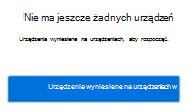

# Dowiedz się więcej Microsoft 365 ochrony przed utratą danych w punktach końcowych

Funkcji Microsoft 365 ochrony przed utratą danych (DLP, data loss prevention) możesz używać do monitorowania działań, które są podejmowane na elementach określonych jako poufne, oraz w celu zapobiegania niezamierzonemu udostępnianiu tych elementów. Aby uzyskać więcej informacji na temat ochrony przed utratą danych, zobacz [Informacje na temat ochrony przed utratą danych](dlp-learn-about-dlp.md).

Ochrona przed utratą danych w punkcie końcowym (Endpoint Data Loss **Prevention**, DLP) rozszerza funkcje monitorowania aktywności i ochrony funkcji DLP na poufne elementy, które są fizycznie przechowywane na urządzeniach z systemami Windows 10, Windows 11 i macOS (Catalina 10.15 lub wyższym). Po dojechiniu urządzeń do rozwiązań zgodności usługi Microsoft 365 informacje o tym, co użytkownicy robią z poufnymi elementami, są widoczne  w Eksploratorze aktywności i można wymusić akcje zabezpieczające przed tymi elementami za pośrednictwem zasad [DLP](create-test-tune-dlp-policy.md).

> [!TIP]
> Jeśli szukasz kontrolki urządzenia do przechowywania wymiennych, zobacz Ochrona punktu końcowego w usłudze Microsoft Defender [Nośnik wymienny kontrolki urządzenia Storage Access Control](../security/defender-endpoint/device-control-removable-storage-access-control.md#microsoft-defender-for-endpoint-device-control-removable-storage-access-control).

> [!NOTE]
> Na Microsoft 365 zgodności zasady DLP dotyczące poufnych elementów są oceny centralnie, więc nie ma czasu na rozpowszechnianie zasad i aktualizacji zasad na poszczególnych urządzeniach. Gdy zasady są aktualizowane w centrum zgodności, synchronizacja tych aktualizacji w całej usłudze trwa zwykle około godziny. Po zsynchronizowaniu aktualizacji zasad elementy na urządzeniach docelowych są automatycznie ponownie sprawdzane przy następnym dostępie do nich lub ich zmodyfikowaniu.

## Działania punktu końcowego, które można monitorować i podjąć w

Funkcja DLP punktu końcowego firmy Microsoft umożliwia inspekcję następujących typów działań, które użytkownicy mogą podjąć na urządzeniach z systemem Windows 10, Windows 11 lub macOS, oraz zarządzać nimi.

|Działanie |Opis  |Windows 10 1809 i nowsze/ Windows 11| System MacOS Catalina 10.15 (wersja preview) | Możliwość inspekcji/ograniczenia|
|---------|---------|---------|---------|---------|
|przekazywanie do usługi w chmurze lub uzyskiwanie dostępu przez niedozwolone przeglądarki    | Wykrywa, kiedy użytkownik próbuje przekazać element do domeny usługi z ograniczeniami lub uzyskać dostęp do elementu za pośrednictwem przeglądarki.  Jeśli użytkownik korzysta z przeglądarki wymienionej w funkcji DLP jako niedozwolonej przeglądarki, działanie przekazywania zostanie zablokowane i użytkownik zostanie przekierowany w celu korzystania z usługi Microsoft Edge. Microsoft Edge następnie zezwolić na przekazywanie lub dostęp albo zablokować go na podstawie konfiguracji zasad DLP         |obsługiwane | obsługiwane|możliwość inspekcji i ograniczenia|
|kopiowanie do innej aplikacji    |Wykrywa, kiedy użytkownik próbuje skopiować informacje z chronionego elementu, a następnie wkleić je do innej aplikacji, procesu lub elementu. To działanie nie wykrywa kopiowania i wklejania informacji w obrębie tej samej aplikacji, procesu lub elementu.|obsługiwane|obsługiwane         | możliwość inspekcji i ograniczenia|
|kopiowanie na nośnik wymienny USB |Wykrywa, kiedy użytkownik próbuje skopiować element lub informacje na nośnik wymienny lub urządzenie USB.|obsługiwane|obsługiwane         | możliwość inspekcji i ograniczenia|
|Kopiowanie do udziału sieciowego    |Wykrywa, kiedy użytkownik próbuje skopiować element do udziału sieciowego lub zamapowany dysk sieciowy. |obsługiwane|obsługiwane         |możliwość inspekcji i ograniczenia|
|drukowanie dokumentu    |Wykrywa, kiedy użytkownik próbuje wydrukować chroniony element na drukarce lokalnej lub sieciowej.|obsługiwane|obsługiwane|możliwość inspekcji i ograniczenia         |
|kopiowanie do sesji zdalnej|Wykrywa, kiedy użytkownik próbuje skopiować element do sesji pulpitu zdalnego. |obsługiwane|nie jest obsługiwane|  możliwość inspekcji i ograniczenia|
|kopiowanie na Bluetooth urządzenia|Wykrywa, kiedy użytkownik próbuje skopiować element do aplikacji usługi Bluetooth (zgodnie z definicją na liście odblokowanych adresów ip usługi Bluetooth w ustawieniach ochrony przed błędami DLP punktu końcowego).|obsługiwane|nie jest obsługiwane| możliwość inspekcji i ograniczenia|
|Tworzenie elementu|Wykrywa, kiedy użytkownik tworzy element|obsługiwane | |mogą być insektowane|
|Zmienianie nazwy elementu|Wykrywa, kiedy użytkownik zmienia nazwę elementu|obsługiwane | |mogą być insektowane|

## Pliki monitorowane

Punkt końcowy DLP obsługuje monitorowanie tych typów plików. DLP przeprowadza inspekcje działań w przypadku tych typów plików, nawet jeśli nie ma dopasowania do zasad. 

- Pliki programu Word
- PowerPoint plików
- Excel plików
- Pliki PDF
- .csv plików
- pliki tsv
- .txt plików
- pliki rtf
- pliki c
- pliki class
- pliki cpp
- pliki cs
- pliki h
- pliki java
 
Jeśli chcesz monitorować tylko dane z dopasowania zasad, możesz wyłączyć działanie Zawsze kontroluj pliki dla urządzeń w ustawieniach globalnych ochrony przed włączeniem ochrony przed prywatnością.

> [!NOTE]
> Jeśli ustawienie **Zawsze** inspekcja plików dla urządzeń jest wł., działania dotyczące dowolnego pliku programu Word, PowerPoint, Excel, PDF i .csv są zawsze insektowane, nawet jeśli urządzenie nie jest kierowane przez żadne zasady.

> [!TIP]
> Aby zapewnić inspekcję działań we wszystkich obsługiwanych typach plików, utwórz [niestandardowe zasady DLP](create-test-tune-dlp-policy.md).

Endpoint DLP monitoruje aktywność na podstawie typu MIME, więc działania będą przechwytywane, nawet jeśli rozszerzenie pliku zostanie zmienione.

### Typy plików (podgląd)

Typy plików to grupowanie formatów plików, które są używane do ochrony określonych przepływów pracy lub obszarów działalności. Jako warunków zasad DLP możesz użyć co najmniej jednego typu pliku.

|Typ pliku |Aplikacja  |monitorowane rozszerzenia plików  |
|---------|---------|---------|
|edytor tekstu |Word, PDF | .doc, .docx, docm, dot, dotx, dotm, docb, .pdf |
|arkusz kalkulacyjny    |Excel, CSV, TSV |.xls, .xlsx, xlt, xlm, xlsm, xltx, xltm, xlsb, xlw, .csv, tsv         |
|prezentacja |PowerPoint|.ppt, .pptx, pos, pps, pptm, potx, potm, ppam, ppsx|
|archiwizowanie  |Narzędzia do archiwizacji i kompresji plików | .zip, zipx, .rar, 0,7z, tar, gz        |
|Adres e-mail    |Outlook |pst, ost, msg         |

### Rozszerzenia plików (wersja Preview)

Jeśli typy plików nie obejmują rozszerzeń plików, których lista jest potrzebna jako warunek zasad, możesz użyć rozszerzeń plików rozdzielonych przecinkami.

> [!IMPORTANT]
> Rozszerzenia i opcje typów plików nie mogą być używane jako warunki w tej samej  regułach. Jeśli chcesz używać ich jako warunków w tych samych zasadach, muszą one być w oddzielnych zasadach. 

> [!IMPORTANT]
> Te Windows obsługują typy plików i funkcje rozszerzenia plików:
>- Windows 10 20H1/20H2/21H1 (KB 5006738)
>- Windows 10 19H1/19H2 (KB 5007189)
>- Windows 10 RS5 (kb 5006744)

## Co się dzieje w programie DLP punktu końcowego

Istnieje kilka dodatkowych pojęć, o których należy pamiętać przed rozpoczęciem pracy z zasadą DLP punktu końcowego.

### Włączanie zarządzania urządzeniami

Zarządzanie urządzeniami to funkcja, która umożliwia zbieranie telemetrii z urządzeń i udostępnia Microsoft 365 rozwiązania zgodności, takie jak zarządzanie ryzykiem w zakresie punktów końcowych i [niejawnego programu testów](insider-risk-management.md). Musisz dodać wszystkie urządzenia, których chcesz używać jako lokalizacji w zasadach DLP.

> [!div class="mx-imgBorder"]
> 

Obsługa wnoszania i wynoszania jest obsługiwanych za pośrednictwem skryptów pobieranych z Centrum zarządzania urządzeniami. Centrum ma skrypty niestandardowe dla każdej z tych metod wdrażania:

- skrypt lokalny (do 10 komputerów)
- Zasady grupy
- System Center Configuration Manager (wersja 1610 lub nowsza)
- Telefony Zarządzanie urządzeniami/Microsoft Intune
- Skrypty dołączania VDI dla komputerów nietrwałych

> [!div class="mx-imgBorder"]
> 

 Skorzystaj z procedur z procedury [wprowadzenie do Microsoft 365 DLP punktu](endpoint-dlp-getting-started.md) końcowego na urządzeniach w onboardach.

Urządzenia, które zostały włoone [za](/windows/security/threat-protection/) pośrednictwem Ochrona punktu końcowego w usłudze Microsoft Defender, będą automatycznie wyświetlane na liście urządzeń. Aby korzystać **z funkcji DLP punktu końcowego,** możesz włączyć monitorowanie urządzeń.

> [!div class="mx-imgBorder"]
> 

### Wyświetlanie danych DLP punktu końcowego

Alerty dotyczące zasad DLP wymuszonych na urządzeniach końcowych można wyświetlać, przechodząc do pulpitu nawigacyjnego zarządzania [alertami DLP](dlp-configure-view-alerts-policies.md).

> [!div class="mx-imgBorder"]
> 

Na tym samym pulpicie nawigacyjnym można również wyświetlać szczegóły skojarzonego zdarzenia z sformatowanych metadanych

> [!div class="mx-imgBorder"]
> 

Po do wdrożeniu urządzenia informacje o działaniach inspekcji przepływają do Eksploratora aktywności jeszcze przed skonfigurowaniem i wdrożeniem wszelkich zasad DLP, które mają urządzenia jako lokalizację.

> [!div class="mx-imgBorder"]
> 

Zasady DLP punktu końcowego zbierają obszerne informacje dotyczące działań pod kontrolą.

Jeśli na przykład plik zostanie skopiowany na nośnik wymienny USB, w szczegółach aktywności zobaczysz następujące atrybuty:

- typ działania
- adres IP klienta
- docelowa ścieżka pliku
- happened timestamp
- nazwa pliku
- użytkownik
- rozszerzenie pliku
- rozmiar pliku
- typ informacji poufnych (jeśli dotyczy)
- wartość sha1
- wartość sha256
- poprzednia nazwa pliku
- lokalizacja
- element nadrzędny
- filepath
- typ lokalizacji źródłowej
- platforma
- nazwa urządzenia
- typ lokalizacji docelowej
- aplikacja, która wykonała kopię
- Ochrona punktu końcowego w usłudze Microsoft Defender identyfikatora urządzenia (jeśli jest to dane)
- producent nośniki wymiennych
- Model urządzenia przenośnego
- Numer seryjny urządzenia przenośnego

> [!div class="mx-imgBorder"]
> 

## Następne kroki

Po instrukcjami w parametrach DLP dla punktów końcowych należy wykonać następujące czynności:

1. [Omówienie dołączania Windows 10 Windows 11 i Microsoft 365 użytkowników](device-onboarding-overview.md)
1. [Omówienie dołączania urządzeń z systemem macOS do platformy Microsoft 365 (wersja zapoznawcza)](device-onboarding-macos-overview.md)
1. [Konfigurowanie ustawień ochrony przed utratą danych punktu końcowego](dlp-configure-endpoint-settings.md)
1. [Korzystanie z ochrony przed utratą danych w punkcie końcowym firmy Microsoft](endpoint-dlp-using.md)

## Zobacz też

- [Wprowadzenie do ochrony przed utratą danych w punktach końcowych firmy Microsoft](endpoint-dlp-getting-started.md)
- [Korzystanie z ochrony przed utratą danych w punkcie końcowym firmy Microsoft](endpoint-dlp-using.md)
- [Dowiedz się więcej o ochronie przed utratą danych](dlp-learn-about-dlp.md)
- [Twórz, testuj i dostrajaj zasady DLP](create-test-tune-dlp-policy.md)
- [Wprowadzenie w Eksploratorze aktywności](data-classification-activity-explorer.md)
- [Ochrona punktu końcowego w usłudze Microsoft Defender](/windows/security/threat-protection/)
- [Zarządzanie ryzykiem w niejawnym programie testów](insider-risk-management.md)
